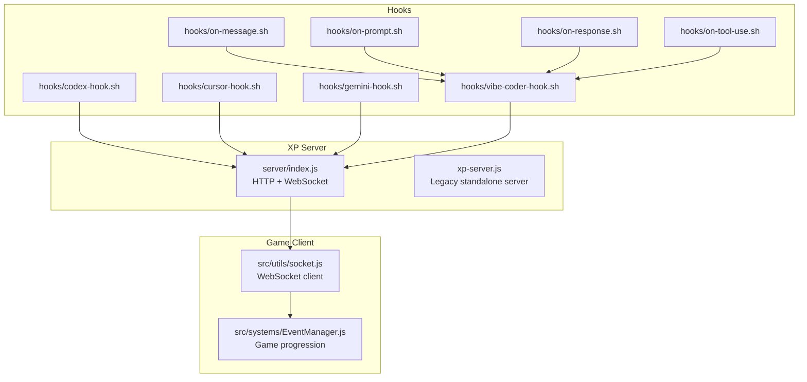
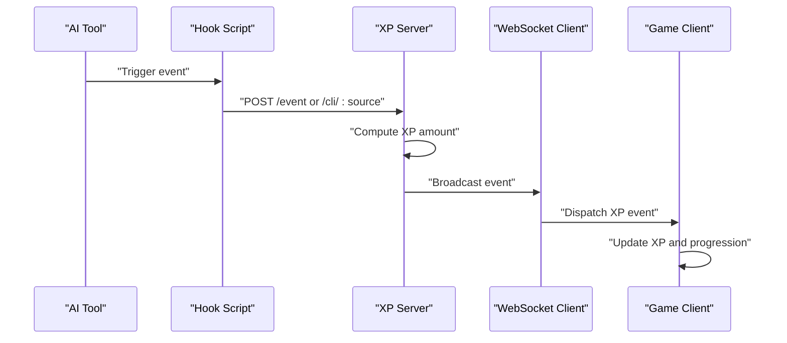
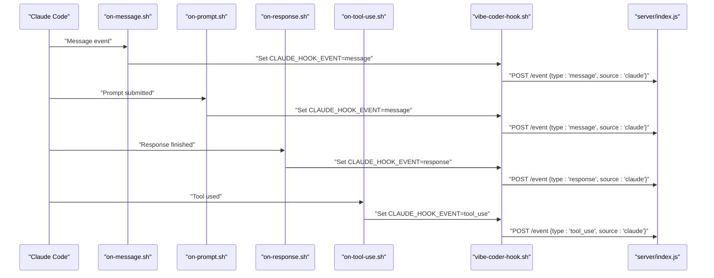
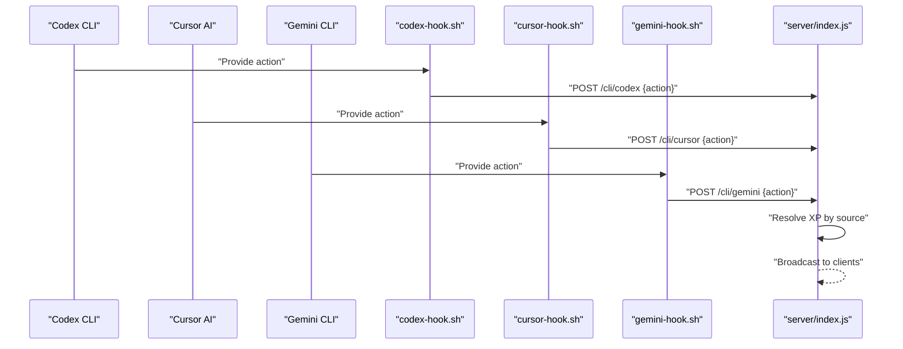
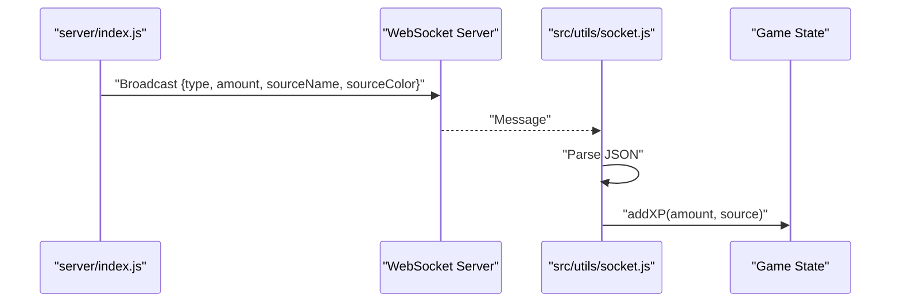
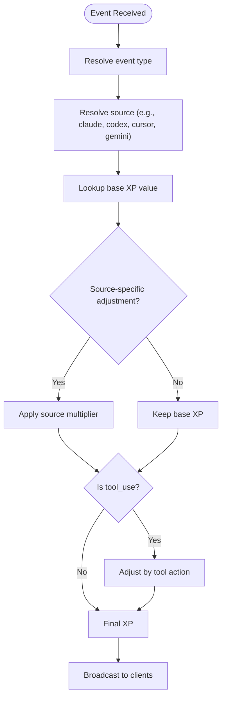
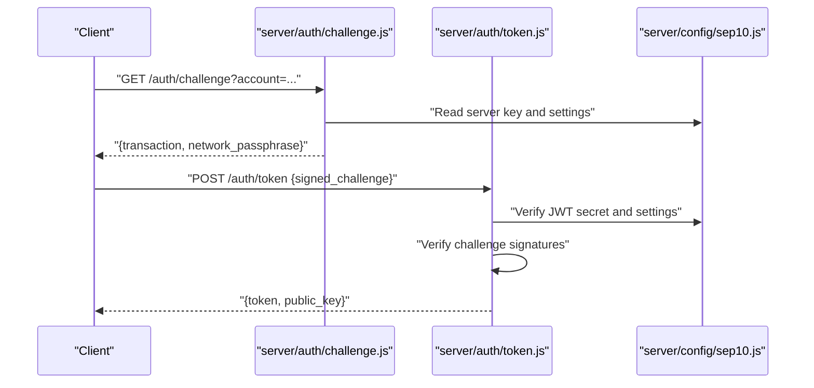
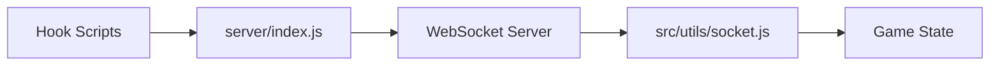

# AI Integration System

<cite>
**Referenced Files in This Document**
- [hooks/codex-hook.sh](file://hooks/codex-hook.sh)
- [hooks/cursor-hook.sh](file://hooks/cursor-hook.sh)
- [hooks/gemini-hook.sh](file://hooks/gemini-hook.sh)
- [hooks/vibe-coder-hook.sh](file://hooks/vibe-coder-hook.sh)
- [hooks/on-message.sh](file://hooks/on-message.sh)
- [hooks/on-prompt.sh](file://hooks/on-prompt.sh)
- [hooks/on-response.sh](file://hooks/on-response.sh)
- [hooks/on-tool-use.sh](file://hooks/on-tool-use.sh)
- [xp-server.js](file://xp-server.js)
- [server/index.js](file://server/index.js)
- [src/utils/socket.js](file://src/utils/socket.js)
- [src/systems/EventManager.js](file://src/systems/EventManager.js)
- [server/config/sep10.js](file://server/config/sep10.js)
- [server/auth/challenge.js](file://server/auth/challenge.js)
- [server/auth/token.js](file://server/auth/token.js)
- [dist/config.json](file://dist/config.json)
- [dist/config.json.example](file://dist/config.json.example)
</cite>

## Table of Contents
1. [Introduction](#introduction)
2. [Project Structure](#project-structure)
3. [Core Components](#core-components)
4. [Architecture Overview](#architecture-overview)
5. [Detailed Component Analysis](#detailed-component-analysis)
6. [Dependency Analysis](#dependency-analysis)
7. [Performance Considerations](#performance-considerations)
8. [Troubleshooting Guide](#troubleshooting-guide)
9. [Conclusion](#conclusion)
10. [Appendices](#appendices)

## Introduction
This document explains the AI coding tool integration system that captures real-time coding activity from supported AI tools and translates it into in-game XP accumulation. It covers the hook architecture and event-driven integration pattern, the XP broadcasting mechanism via WebSocket, authentication and security considerations, configuration instructions for each supported tool, and how AI activity influences game progression.

## Project Structure
The AI integration spans three primary areas:
- Hooks: Tool-specific Bash scripts that emit events to the XP server.
- XP Server: An HTTP/WebSocket server that receives events, computes XP amounts, and broadcasts updates to the game client.
- Game Client: A WebSocket client that listens for XP events and updates the game state.

**Diagram sources**
- [hooks/on-message.sh](file://hooks/on-message.sh#L1-L5)
- [hooks/on-prompt.sh](file://hooks/on-prompt.sh#L1-L5)
- [hooks/on-response.sh](file://hooks/on-response.sh#L1-L5)
- [hooks/on-tool-use.sh](file://hooks/on-tool-use.sh#L1-L5)
- [hooks/vibe-coder-hook.sh](file://hooks/vibe-coder-hook.sh#L1-L24)
- [hooks/codex-hook.sh](file://hooks/codex-hook.sh#L1-L27)
- [hooks/cursor-hook.sh](file://hooks/cursor-hook.sh#L1-L24)
- [hooks/gemini-hook.sh](file://hooks/gemini-hook.sh#L1-L27)
- [server/index.js](file://server/index.js#L54-L125)
- [xp-server.js](file://xp-server.js#L5-L106)
- [src/utils/socket.js](file://src/utils/socket.js#L1-L121)
- [src/systems/EventManager.js](file://src/systems/EventManager.js#L1-L393)

**Section sources**
- [server/index.js](file://server/index.js#L54-L125)
- [src/utils/socket.js](file://src/utils/socket.js#L1-L121)
- [src/systems/EventManager.js](file://src/systems/EventManager.js#L1-L393)

## Core Components
- Claude Code integration: Event hooks (message, prompt, response, tool_use) feed into a central Claude hook that posts to the XP server.
- Generic CLI tools: Codex, Cursor, Gemini CLI each post structured events to the XP server.
- XP server: Receives events via HTTP POST, computes XP amounts per event and source, and broadcasts via WebSocket to the game client.
- Game client: Connects to the XP WebSocket, parses events, and updates the game’s XP and progression systems.

Key XP values and multipliers:
- Base XP values per event type are defined in the XP server.
- Source-specific multipliers adjust XP amounts for Claude Code, Codex CLI, Gemini CLI, Cursor AI, and Copilot.
- Tool-use actions can receive bonuses depending on the tool invoked (e.g., Edit/Write vs Bash).

**Section sources**
- [server/index.js](file://server/index.js#L78-L113)
- [server/index.js](file://server/index.js#L115-L125)
- [src/utils/socket.js](file://src/utils/socket.js#L54-L72)

## Architecture Overview
The integration follows an event-driven pattern:
- AI tools emit events (via hooks).
- Hooks POST JSON payloads to the XP server.
- The XP server validates and normalizes events, computes XP, and broadcasts to all WebSocket clients.
- The game client consumes the WebSocket stream and updates the game state.

**Diagram sources**
- [hooks/on-message.sh](file://hooks/on-message.sh#L1-L5)
- [hooks/vibe-coder-hook.sh](file://hooks/vibe-coder-hook.sh#L1-L24)
- [hooks/codex-hook.sh](file://hooks/codex-hook.sh#L1-L27)
- [hooks/cursor-hook.sh](file://hooks/cursor-hook.sh#L1-L24)
- [hooks/gemini-hook.sh](file://hooks/gemini-hook.sh#L1-L27)
- [server/index.js](file://server/index.js#L99-L125)
- [src/utils/socket.js](file://src/utils/socket.js#L54-L72)

## Detailed Component Analysis

### Claude Code Integration
Claude Code integrates via four event hooks that set an event type and exec the central Claude hook. The Claude hook reads event data from stdin, determines the event type from environment, and posts to the XP server with a fixed source identifier.

**Diagram sources**
- [hooks/on-message.sh](file://hooks/on-message.sh#L1-L5)
- [hooks/on-prompt.sh](file://hooks/on-prompt.sh#L1-L5)
- [hooks/on-response.sh](file://hooks/on-response.sh#L1-L5)
- [hooks/on-tool-use.sh](file://hooks/on-tool-use.sh#L1-L5)
- [hooks/vibe-coder-hook.sh](file://hooks/vibe-coder-hook.sh#L1-L24)
- [server/index.js](file://server/index.js#L99-L113)

**Section sources**
- [hooks/on-message.sh](file://hooks/on-message.sh#L1-L5)
- [hooks/on-prompt.sh](file://hooks/on-prompt.sh#L1-L5)
- [hooks/on-response.sh](file://hooks/on-response.sh#L1-L5)
- [hooks/on-tool-use.sh](file://hooks/on-tool-use.sh#L1-L5)
- [hooks/vibe-coder-hook.sh](file://hooks/vibe-coder-hook.sh#L1-L24)
- [server/index.js](file://server/index.js#L99-L113)

### Generic CLI Tools Integration
Each CLI tool exposes a dedicated hook script that reads an action from stdin or argument and posts a structured event to the XP server. The server endpoint for CLI sources accepts the source and action, resolves XP accordingly, and broadcasts.

**Diagram sources**
- [hooks/codex-hook.sh](file://hooks/codex-hook.sh#L1-L27)
- [hooks/cursor-hook.sh](file://hooks/cursor-hook.sh#L1-L24)
- [hooks/gemini-hook.sh](file://hooks/gemini-hook.sh#L1-L27)
- [server/index.js](file://server/index.js#L115-L125)

**Section sources**
- [hooks/codex-hook.sh](file://hooks/codex-hook.sh#L1-L27)
- [hooks/cursor-hook.sh](file://hooks/cursor-hook.sh#L1-L24)
- [hooks/gemini-hook.sh](file://hooks/gemini-hook.sh#L1-L27)
- [server/index.js](file://server/index.js#L115-L125)

### XP Broadcasting and WebSocket Client
The XP server runs an HTTP endpoint and a WebSocket server on the same port. It computes XP amounts per event and source, then broadcasts a normalized message to all connected clients. The game client connects to the WebSocket, parses messages, and invokes the game’s XP accumulation logic.

**Diagram sources**
- [server/index.js](file://server/index.js#L63-L76)
- [server/index.js](file://server/index.js#L99-L113)
- [src/utils/socket.js](file://src/utils/socket.js#L54-L72)

**Section sources**
- [server/index.js](file://server/index.js#L63-L76)
- [server/index.js](file://server/index.js#L99-L113)
- [src/utils/socket.js](file://src/utils/socket.js#L54-L72)

### XP Values, Multipliers, and Tool Bonuses
- Base XP values per event type are defined in the XP server.
- Source-specific XP keys are resolved for each CLI source, with fallback defaults.
- Tool-use actions can receive bonuses based on the tool invoked (e.g., Edit/Write vs Bash).

**Diagram sources**
- [server/index.js](file://server/index.js#L78-L113)

**Section sources**
- [server/index.js](file://server/index.js#L78-L113)

### Authentication Flow and Security Considerations
The server supports SEP-10/Stellar Web Authentication for secure identity verification. The flow includes:
- Challenge generation: A signed challenge transaction is returned for the client to sign.
- Token issuance: After verifying the signed challenge, the server issues a JWT and persists user data.

**Diagram sources**
- [server/auth/challenge.js](file://server/auth/challenge.js#L64-L86)
- [server/auth/token.js](file://server/auth/token.js#L29-L79)
- [server/config/sep10.js](file://server/config/sep10.js#L76-L86)

**Section sources**
- [server/auth/challenge.js](file://server/auth/challenge.js#L64-L86)
- [server/auth/token.js](file://server/auth/token.js#L29-L79)
- [server/config/sep10.js](file://server/config/sep10.js#L76-L86)

## Dependency Analysis
The integration relies on a small set of cohesive dependencies:
- Hooks depend on the XP server endpoints.
- The XP server depends on the WebSocket library and Express.
- The game client depends on the WebSocket client module and the game state.

**Diagram sources**
- [server/index.js](file://server/index.js#L54-L125)
- [src/utils/socket.js](file://src/utils/socket.js#L1-L121)

**Section sources**
- [server/index.js](file://server/index.js#L54-L125)
- [src/utils/socket.js](file://src/utils/socket.js#L1-L121)

## Performance Considerations
- Non-blocking hook invocations: Hooks use asynchronous HTTP requests to avoid blocking AI tool workflows.
- Lightweight XP computation: The XP server performs minimal parsing and broadcasting.
- Client-side resilience: The game WebSocket client reconnects automatically and logs only once when offline.
- Rate limiting: The XP server responds quickly and does not implement rate limiting; ensure external rate limits if needed.

[No sources needed since this section provides general guidance]

## Troubleshooting Guide
Common integration issues and resolutions:
- XP server offline: The game client logs a message when the XP server is unreachable and retries periodically. Ensure the XP server is running and reachable on the expected port.
- Incorrect hook usage: Verify that the Claude event hooks set the correct environment variable and exec the central Claude hook. Confirm that CLI hooks send JSON payloads to the correct endpoints.
- Invalid JSON or malformed events: The XP server returns a 400 error for invalid JSON. Validate the payload structure and content-type headers.
- Authentication failures: Ensure the SEP-10 configuration includes a valid server secret key and JWT secret. Confirm the web auth domain and network passphrase match the deployment environment.

**Section sources**
- [src/utils/socket.js](file://src/utils/socket.js#L89-L103)
- [hooks/on-message.sh](file://hooks/on-message.sh#L1-L5)
- [hooks/vibe-coder-hook.sh](file://hooks/vibe-coder-hook.sh#L1-L24)
- [hooks/codex-hook.sh](file://hooks/codex-hook.sh#L18-L23)
- [hooks/cursor-hook.sh](file://hooks/cursor-hook.sh#L15-L20)
- [hooks/gemini-hook.sh](file://hooks/gemini-hook.sh#L18-L23)
- [server/index.js](file://server/index.js#L60-L64)
- [server/config/sep10.js](file://server/config/sep10.js#L76-L86)

## Conclusion
The AI integration system provides a robust, event-driven pipeline from AI tools to in-game XP accumulation. By leveraging lightweight hooks, a centralized XP server, and a resilient WebSocket client, it enables real-time feedback and progression. Proper configuration of sources, authentication, and client connectivity ensures smooth operation across supported tools.

[No sources needed since this section summarizes without analyzing specific files]

## Appendices

### Configuration Instructions
- Claude Code: Configure the four event hooks to set the event type and execute the central Claude hook. Ensure the hook posts to the XP server endpoint.
- Codex CLI: Pipe or pass the action to the Codex hook script, which posts to the CLI endpoint.
- Cursor AI: Pipe or pass the action to the Cursor hook script, which posts to the CLI endpoint.
- Gemini CLI: Pipe or pass the action to the Gemini hook script, which posts to the CLI endpoint.
- Game client: The client connects to the WebSocket endpoint and expects normalized XP events.

**Section sources**
- [hooks/on-message.sh](file://hooks/on-message.sh#L1-L5)
- [hooks/on-prompt.sh](file://hooks/on-prompt.sh#L1-L5)
- [hooks/on-response.sh](file://hooks/on-response.sh#L1-L5)
- [hooks/on-tool-use.sh](file://hooks/on-tool-use.sh#L1-L5)
- [hooks/vibe-coder-hook.sh](file://hooks/vibe-coder-hook.sh#L1-L24)
- [hooks/codex-hook.sh](file://hooks/codex-hook.sh#L1-L27)
- [hooks/cursor-hook.sh](file://hooks/cursor-hook.sh#L1-L24)
- [hooks/gemini-hook.sh](file://hooks/gemini-hook.sh#L1-L27)
- [src/utils/socket.js](file://src/utils/socket.js#L5-L16)

### Bonus XP Multipliers and Tool Bonuses
- Base XP per event type is defined in the XP server.
- Source-specific multipliers adjust XP for Claude Code, Codex CLI, Gemini CLI, Cursor AI, and Copilot.
- Tool-use actions receive bonuses based on the tool invoked (e.g., Edit/Write vs Bash).

**Section sources**
- [server/index.js](file://server/index.js#L78-L113)

### Relationship Between AI Activity and Game Progression
- XP accumulation updates the game’s XP state and can influence progression mechanics such as level-ups, unlocks, and event triggers.
- Mid-wave chaos events can further modify XP gains and enemy behavior, amplifying the impact of sustained AI activity.

**Section sources**
- [src/utils/socket.js](file://src/utils/socket.js#L60-L68)
- [src/systems/EventManager.js](file://src/systems/EventManager.js#L139-L162)