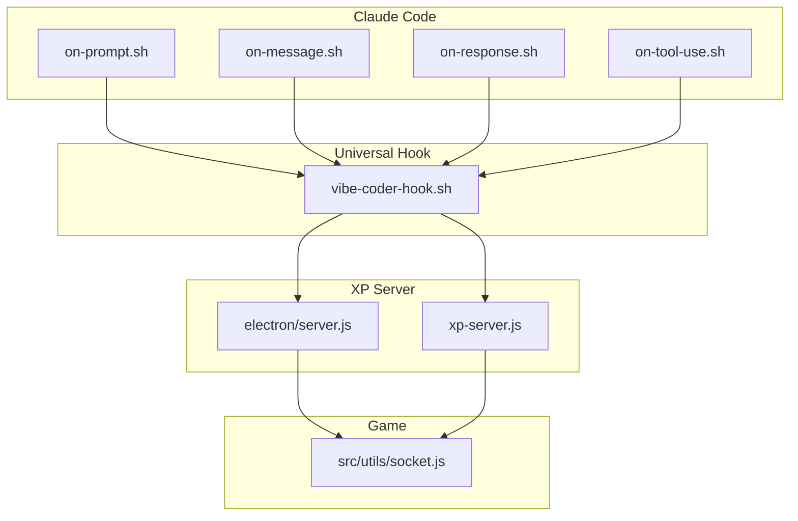
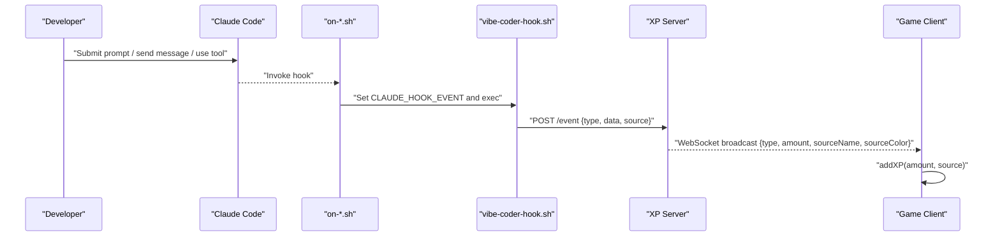
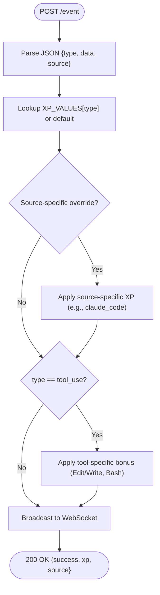
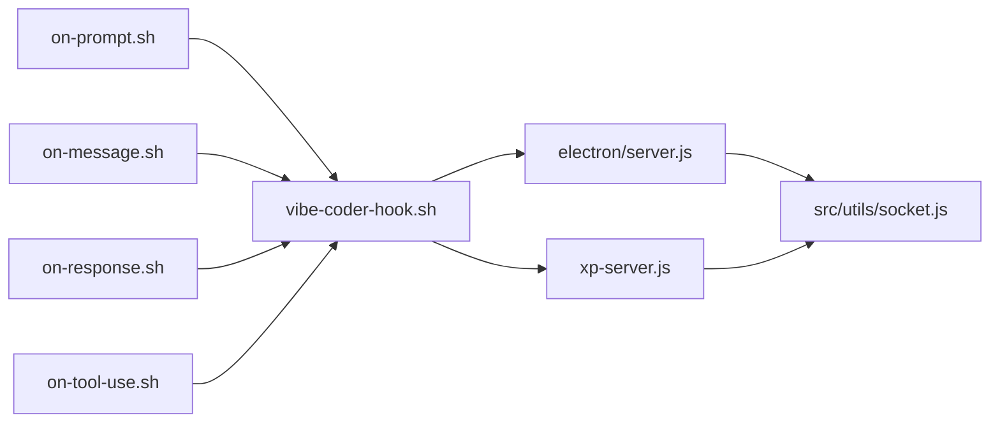

# Claude Code Integration

<cite>
**Referenced Files in This Document**
- [SETUP.md](file://SETUP.md)
- [README.md](file://README.md)
- [hooks/on-message.sh](file://hooks/on-message.sh)
- [hooks/on-prompt.sh](file://hooks/on-prompt.sh)
- [hooks/on-response.sh](file://hooks/on-response.sh)
- [hooks/on-tool-use.sh](file://hooks/on-tool-use.sh)
- [hooks/vibe-coder-hook.sh](file://hooks/vibe-coder-hook.sh)
- [electron/server.js](file://electron/server.js)
- [src/utils/socket.js](file://src/utils/socket.js)
- [xp-server.js](file://xp-server.js)
</cite>

## Table of Contents
1. [Introduction](#introduction)
2. [Project Structure](#project-structure)
3. [Core Components](#core-components)
4. [Architecture Overview](#architecture-overview)
5. [Detailed Component Analysis](#detailed-component-analysis)
6. [Dependency Analysis](#dependency-analysis)
7. [Performance Considerations](#performance-considerations)
8. [Troubleshooting Guide](#troubleshooting-guide)
9. [Conclusion](#conclusion)
10. [Appendices](#appendices)

## Introduction
This document explains how the Claude Code AI tool integrates with Vibe Coder to award in-game experience points (XP) based on coding activity. It covers the Claude hook system, event types captured, XP calculation rules, environment configuration, automatic source detection, and how Claude-specific event data is parsed and forwarded to the game. It also includes setup instructions, webhook configuration, and troubleshooting guidance.

## Project Structure
The Claude integration spans three primary areas:
- Claude Code hooks that emit events on prompt, message, response, and tool use
- A universal hook script that forwards events to the XP server
- An XP server that parses events, applies XP rules, and broadcasts to the game via WebSocket

**Diagram sources**
- [hooks/on-prompt.sh](file://hooks/on-prompt.sh#L1-L5)
- [hooks/on-message.sh](file://hooks/on-message.sh#L1-L5)
- [hooks/on-response.sh](file://hooks/on-response.sh#L1-L5)
- [hooks/on-tool-use.sh](file://hooks/on-tool-use.sh#L1-L5)
- [hooks/vibe-coder-hook.sh](file://hooks/vibe-coder-hook.sh#L1-L24)
- [electron/server.js](file://electron/server.js#L1-L183)
- [xp-server.js](file://xp-server.js#L1-L106)
- [src/utils/socket.js](file://src/utils/socket.js#L1-L120)

**Section sources**
- [SETUP.md](file://SETUP.md#L48-L106)
- [README.md](file://README.md#L99-L112)

## Core Components
- Claude Code hooks: Trigger on prompt submission, message send, response completion, and tool use.
- Universal hook: Reads event data from stdin, detects event type from environment, sets source to Claude, and posts to the XP server.
- XP servers:
  - Electron-built server: Accepts HTTP POST /event, applies XP values and bonuses, and broadcasts via WebSocket.
  - Standalone server: Accepts HTTP POST /event and broadcasts via WebSocket.
- Game client: Connects to the XP server WebSocket and adds XP to the player state.

**Section sources**
- [hooks/on-prompt.sh](file://hooks/on-prompt.sh#L1-L5)
- [hooks/on-message.sh](file://hooks/on-message.sh#L1-L5)
- [hooks/on-response.sh](file://hooks/on-response.sh#L1-L5)
- [hooks/on-tool-use.sh](file://hooks/on-tool-use.sh#L1-L5)
- [hooks/vibe-coder-hook.sh](file://hooks/vibe-coder-hook.sh#L1-L24)
- [electron/server.js](file://electron/server.js#L18-L119)
- [xp-server.js](file://xp-server.js#L11-L70)
- [src/utils/socket.js](file://src/utils/socket.js#L1-L120)

## Architecture Overview
The Claude integration follows a simple pipeline:
- Claude Code emits a hook event
- The hook script sets an event type in the environment and forwards the event payload to the XP server
- The XP server parses the event, applies XP values and bonuses, and broadcasts a standardized message to the game
- The game receives the message via WebSocket and increases the player’s XP

**Diagram sources**
- [hooks/on-prompt.sh](file://hooks/on-prompt.sh#L1-L5)
- [hooks/on-message.sh](file://hooks/on-message.sh#L1-L5)
- [hooks/on-tool-use.sh](file://hooks/on-tool-use.sh#L1-L5)
- [hooks/vibe-coder-hook.sh](file://hooks/vibe-coder-hook.sh#L1-L24)
- [electron/server.js](file://electron/server.js#L99-L119)
- [src/utils/socket.js](file://src/utils/socket.js#L54-L72)

## Detailed Component Analysis

### Claude Hook Scripts
- on-prompt.sh: Sets the event type to message when a prompt is submitted.
- on-message.sh: Sets the event type to message when a message is sent.
- on-response.sh: Sets the event type to response when Claude finishes responding.
- on-tool-use.sh: Sets the event type to tool_use when a tool operation completes (e.g., file read/edit, bash).

These scripts export the event type into the environment and then execute the universal hook.

**Section sources**
- [hooks/on-prompt.sh](file://hooks/on-prompt.sh#L1-L5)
- [hooks/on-message.sh](file://hooks/on-message.sh#L1-L5)
- [hooks/on-response.sh](file://hooks/on-response.sh#L1-L5)
- [hooks/on-tool-use.sh](file://hooks/on-tool-use.sh#L1-L5)

### Universal Hook Script
The universal hook reads the event payload from stdin, extracts the event type from the environment variable CLAUDE_HOOK_EVENT (defaulting to unknown), detects the source as Claude, and posts a JSON payload to the XP server. It is designed to be non-blocking and always exits successfully to avoid interrupting Claude Code.

Key behaviors:
- Reads stdin for the raw event payload
- Uses CLAUDE_HOOK_EVENT to determine event type
- Sets source to claude
- Sends a POST to http://localhost:3333/event (standalone server) or http://localhost:3001/event (Electron server)
- Non-blocking curl with short timeouts

**Section sources**
- [hooks/vibe-coder-hook.sh](file://hooks/vibe-coder-hook.sh#L1-L24)

### XP Server (Electron-built)
The Electron-built server exposes:
- HTTP POST /event: Parses JSON {type, data, source}, applies XP values and bonuses, and broadcasts a standardized message to WebSocket clients.
- WebSocket: Broadcasts {type, amount, source, sourceName, sourceColor, timestamp} to connected clients.

XP values and bonuses:
- Base values: message, tool_use, response
- CLI-specific overrides: when source is claude, uses a higher value for code-related activity
- Tool-use bonuses: extra XP for Edit/Write operations and Bash operations

**Diagram sources**
- [electron/server.js](file://electron/server.js#L99-L119)

**Section sources**
- [electron/server.js](file://electron/server.js#L18-L119)

### XP Server (Standalone)
The standalone server (xp-server.js) provides:
- HTTP POST /event: Parses JSON, logs the event, and broadcasts a message to WebSocket clients with source name and color.
- WebSocket: Broadcasts {type, amount, sourceName, sourceColor} to clients.

It defines XP values for message, response, tool_use, and unknown, and maps the source to a color.

**Section sources**
- [xp-server.js](file://xp-server.js#L11-L70)

### Game Client (WebSocket)
The game connects to the XP server WebSocket and listens for XP events. On receipt, it parses the message and calls the game’s XP addition routine with the amount and source metadata.

**Section sources**
- [src/utils/socket.js](file://src/utils/socket.js#L1-L120)

## Dependency Analysis
- Claude hooks depend on the universal hook script to post events to the XP server.
- The universal hook depends on the XP server being reachable at localhost on the configured port.
- The game depends on the XP server WebSocket to receive XP events.
- The Electron-built server and standalone server share the same event schema and broadcast format, enabling interchangeable operation.

**Diagram sources**
- [hooks/on-prompt.sh](file://hooks/on-prompt.sh#L1-L5)
- [hooks/on-message.sh](file://hooks/on-message.sh#L1-L5)
- [hooks/on-response.sh](file://hooks/on-response.sh#L1-L5)
- [hooks/on-tool-use.sh](file://hooks/on-tool-use.sh#L1-L5)
- [hooks/vibe-coder-hook.sh](file://hooks/vibe-coder-hook.sh#L1-L24)
- [electron/server.js](file://electron/server.js#L99-L119)
- [xp-server.js](file://xp-server.js#L32-L70)
- [src/utils/socket.js](file://src/utils/socket.js#L54-L72)

**Section sources**
- [hooks/vibe-coder-hook.sh](file://hooks/vibe-coder-hook.sh#L1-L24)
- [electron/server.js](file://electron/server.js#L99-L119)
- [xp-server.js](file://xp-server.js#L32-L70)
- [src/utils/socket.js](file://src/utils/socket.js#L54-L72)

## Performance Considerations
- The hook scripts use non-blocking HTTP POST with short timeouts to prevent stalling Claude Code operations.
- The XP servers broadcast events asynchronously to all WebSocket clients without blocking the HTTP request.
- The game client reconnects automatically if the XP server becomes unavailable, minimizing downtime.

[No sources needed since this section provides general guidance]

## Troubleshooting Guide
Common issues and resolutions:
- XP server not running: Ensure the XP server is started. The Electron-built server runs on port 3001; the standalone server runs on port 3333.
- Hook not executable: Verify permissions and test the hook manually.
- No XP appearing in-game: Confirm the game is connected to the correct XP server port and that the WebSocket connection is established.
- Auto-move not triggering: Auto-move activates only when XP is received from hooks; manual XP via keyboard does not trigger it.

**Section sources**
- [SETUP.md](file://SETUP.md#L109-L124)
- [src/utils/socket.js](file://src/utils/socket.js#L18-L104)

## Conclusion
The Claude Code integration leverages a small set of shell hooks to capture meaningful coding events and forward them to the Vibe Coder XP server. The XP server applies deterministic XP values and bonuses, then broadcasts standardized events to the game via WebSocket. This design is robust, non-intrusive, and easily extensible to other AI coding tools.

[No sources needed since this section summarizes without analyzing specific files]

## Appendices

### Setup Instructions for Claude Code Integration
- Install dependencies and start the game server.
- Start the XP server (Electron-built on port 3001 or standalone on port 3333).
- Locate your Claude Code hooks directory and copy the on-prompt.sh hook into ~/.claude/hooks/.
- Ensure the hook is executable and test it manually.

**Section sources**
- [SETUP.md](file://SETUP.md#L32-L65)

### Webhook Configuration
- The universal hook posts to /event with a JSON payload containing type, data, and source.
- The Electron-built server expects the same payload shape and responds with a JSON success message.
- The standalone server expects the same payload and responds with a JSON success message.

**Section sources**
- [hooks/vibe-coder-hook.sh](file://hooks/vibe-coder-hook.sh#L14-L20)
- [electron/server.js](file://electron/server.js#L100-L119)
- [xp-server.js](file://xp-server.js#L32-L70)

### Event Types and XP Values
- Event types emitted by Claude hooks: message, response, tool_use.
- XP values applied by the Electron-built server:
  - message: base value
  - response: base value
  - tool_use: base value with tool-specific bonuses (Edit/Write, Bash)
  - source-specific overrides: when source is claude, a higher XP value is applied for code-related activity
- The standalone server applies similar logic with its own XP table.

**Section sources**
- [electron/server.js](file://electron/server.js#L18-L29)
- [electron/server.js](file://electron/server.js#L104-L115)
- [xp-server.js](file://xp-server.js#L11-L17)

### Environment Variable Usage
- CLAUDE_HOOK_EVENT: Set by on-*.sh scripts to indicate the event type (message, response, tool_use).
- The universal hook reads this variable to determine the event type.

**Section sources**
- [hooks/on-prompt.sh](file://hooks/on-prompt.sh#L3-L3)
- [hooks/on-message.sh](file://hooks/on-message.sh#L3-L3)
- [hooks/on-response.sh](file://hooks/on-response.sh#L3-L3)
- [hooks/on-tool-use.sh](file://hooks/on-tool-use.sh#L3-L3)
- [hooks/vibe-coder-hook.sh](file://hooks/vibe-coder-hook.sh#L9-L9)

### Automatic Source Detection
- The universal hook sets the source to claude by default.
- The Electron-built server recognizes source-specific XP values and applies bonuses accordingly.

**Section sources**
- [hooks/vibe-coder-hook.sh](file://hooks/vibe-coder-hook.sh#L11-L12)
- [electron/server.js](file://electron/server.js#L104-L109)

### Parsing and Formatting Claude-Specific Event Data
- The universal hook forwards the raw event payload from stdin as-is in the data field.
- The XP server parses the payload and broadcasts a standardized message to the game, including sourceName and sourceColor.

**Section sources**
- [hooks/vibe-coder-hook.sh](file://hooks/vibe-coder-hook.sh#L5-L6)
- [electron/server.js](file://electron/server.js#L48-L73)
- [xp-server.js](file://xp-server.js#L44-L56)

### Examples of Claude Event Data and XP Mapping
- Prompt submission: event type message; mapped to XP according to base values and source-specific overrides.
- Message send: event type message; mapped similarly.
- Response completion: event type response; mapped to XP.
- Tool use: event type tool_use; mapped to base XP with potential tool-specific bonuses.

**Section sources**
- [hooks/on-prompt.sh](file://hooks/on-prompt.sh#L3-L3)
- [hooks/on-message.sh](file://hooks/on-message.sh#L3-L3)
- [hooks/on-response.sh](file://hooks/on-response.sh#L3-L3)
- [hooks/on-tool-use.sh](file://hooks/on-tool-use.sh#L3-L3)
- [electron/server.js](file://electron/server.js#L104-L115)