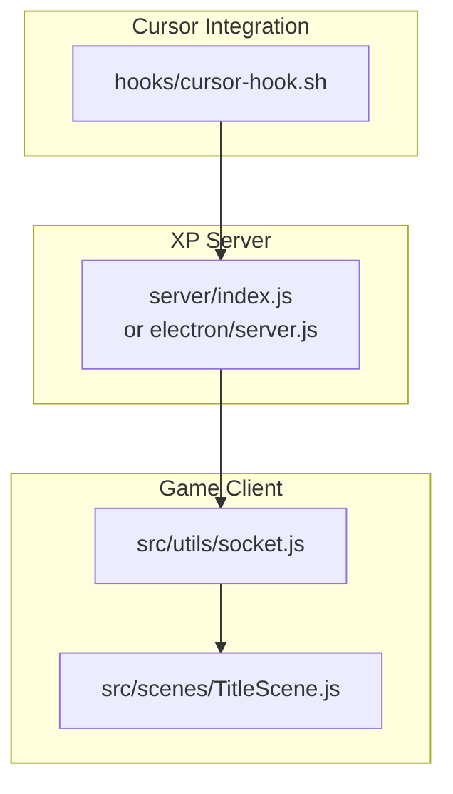
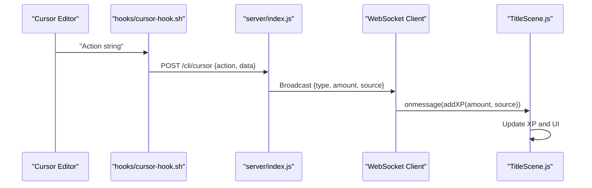
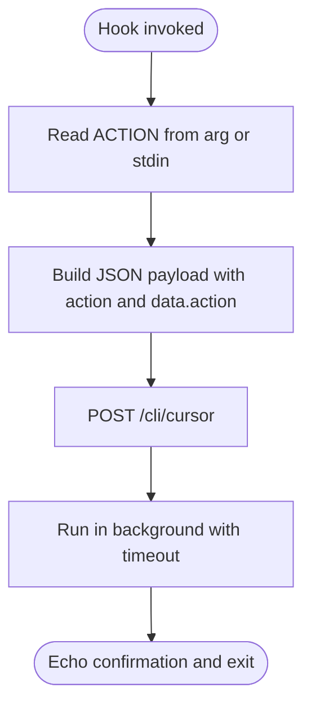
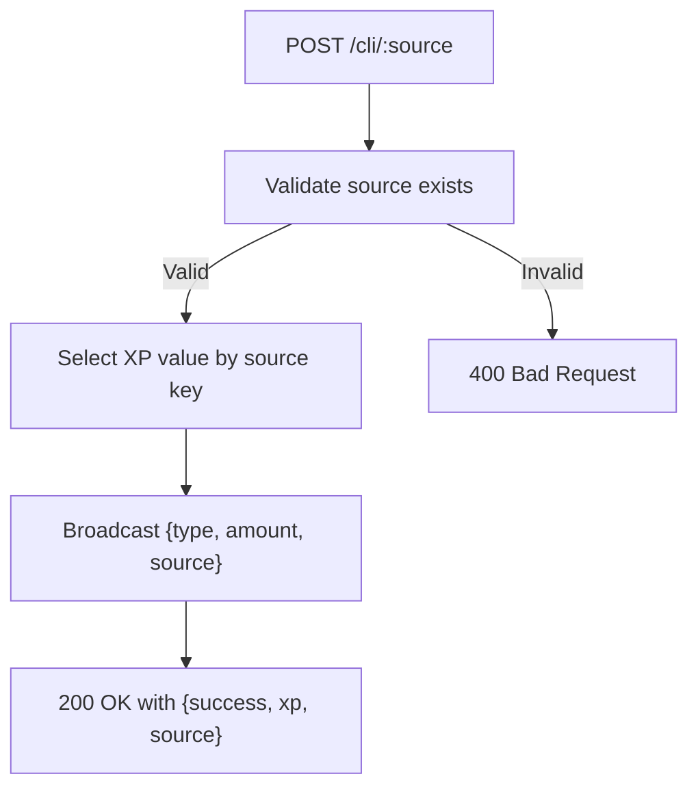
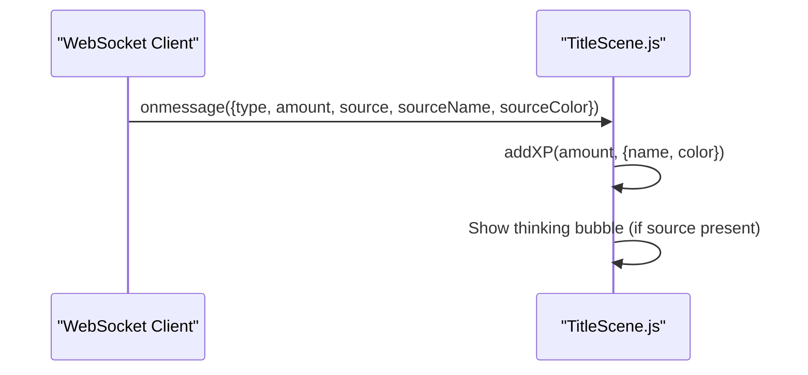
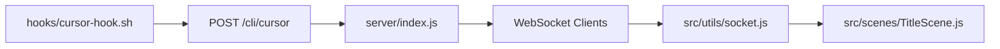

# Cursor AI Integration

<cite>
**Referenced Files in This Document**
- [cursor-hook.sh](file://hooks/cursor-hook.sh)
- [vibe-coder-hook.sh](file://hooks/vibe-coder-hook.sh)
- [on-prompt.sh](file://hooks/on-prompt.sh)
- [on-response.sh](file://hooks/on-response.sh)
- [index.js](file://server/index.js)
- [electron/server.js](file://electron/server.js)
- [socket.js](file://src/utils/socket.js)
- [TitleScene.js](file://src/scenes/TitleScene.js)
- [README.md](file://README.md)
- [SETUP.md](file://SETUP.md)
</cite>

## Table of Contents
1. [Introduction](#introduction)
2. [Project Structure](#project-structure)
3. [Core Components](#core-components)
4. [Architecture Overview](#architecture-overview)
5. [Detailed Component Analysis](#detailed-component-analysis)
6. [Dependency Analysis](#dependency-analysis)
7. [Performance Considerations](#performance-considerations)
8. [Troubleshooting Guide](#troubleshooting-guide)
9. [Conclusion](#conclusion)

## Introduction
This document explains the Cursor AI integration for Vibe Coder. It covers how Cursor-specific hooks capture coding activities and send XP events to the Vibe Coder backend, how event types and XP values are calculated, and how the integration connects to the Vibe Coder event system. It also provides setup instructions, configuration options, performance optimization tips, troubleshooting guidance, and best practices for maximizing XP rewards.

## Project Structure
The Cursor integration consists of:
- A Cursor-specific hook script that posts activity events to the Vibe Coder XP server
- An XP server that receives events, applies XP values, and broadcasts them to the game
- A game client that consumes XP events via WebSocket and updates the player state

**Diagram sources**
- [cursor-hook.sh](file://hooks/cursor-hook.sh#L1-L24)
- [index.js](file://server/index.js#L99-L125)
- [electron/server.js](file://electron/server.js#L100-L133)
- [socket.js](file://src/utils/socket.js#L1-L121)
- [TitleScene.js](file://src/scenes/TitleScene.js#L1201-L1224)

**Section sources**
- [cursor-hook.sh](file://hooks/cursor-hook.sh#L1-L24)
- [index.js](file://server/index.js#L99-L125)
- [electron/server.js](file://electron/server.js#L100-L133)
- [socket.js](file://src/utils/socket.js#L1-L121)
- [TitleScene.js](file://src/scenes/TitleScene.js#L1201-L1224)

## Core Components
- Cursor hook script: Reads an action string from arguments or stdin and posts a structured event to the Vibe Coder CLI endpoint.
- XP server: Receives events, selects the appropriate XP value based on source and event type, and broadcasts to clients.
- Game client: Connects to the XP server via WebSocket, parses events, and adds XP to the player state.

Key integration points:
- Cursor hook posts to the CLI endpoint with a fixed action name and includes the Cursor action in the data payload.
- The XP server recognizes the Cursor source and applies the corresponding XP value.
- The game client consumes the broadcast and triggers in-game reactions.

**Section sources**
- [cursor-hook.sh](file://hooks/cursor-hook.sh#L7-L20)
- [index.js](file://server/index.js#L115-L125)
- [electron/server.js](file://electron/server.js#L122-L133)
- [socket.js](file://src/utils/socket.js#L54-L72)

## Architecture Overview
The Cursor integration follows a straightforward pipeline: Cursor action → hook → XP server → WebSocket → game client.

**Diagram sources**
- [cursor-hook.sh](file://hooks/cursor-hook.sh#L15-L20)
- [index.js](file://server/index.js#L115-L125)
- [socket.js](file://src/utils/socket.js#L54-L72)
- [TitleScene.js](file://src/scenes/TitleScene.js#L1218-L1224)

## Detailed Component Analysis

### Cursor Hook Script
Purpose:
- Capture a Cursor action (e.g., code completion) and forward it to the Vibe Coder XP server.

Behavior:
- Reads the action from the first argument or stdin if none is provided.
- Sends a POST request to the CLI endpoint for the Cursor source.
- Uses non-blocking background execution to avoid blocking Cursor operations.
- Returns immediately after queuing the request.

Event payload:
- action: Fixed string indicating a Cursor activity.
- data.action: The actual Cursor action captured from the environment.

**Diagram sources**
- [cursor-hook.sh](file://hooks/cursor-hook.sh#L7-L22)

**Section sources**
- [cursor-hook.sh](file://hooks/cursor-hook.sh#L1-L24)

### XP Server Endpoint for CLI Sources
Endpoint:
- POST /cli/:source

Behavior:
- Validates the source exists.
- Determines the XP amount based on the presence of a source-specific key (code/cli/ai).
- Broadcasts the event to all WebSocket clients.

Cursor-specific behavior:
- When source is "cursor", the server uses the Cursor XP value for the event.
- The endpoint accepts an action field and optional data payload.

**Diagram sources**
- [index.js](file://server/index.js#L115-L125)
- [electron/server.js](file://electron/server.js#L122-L133)

**Section sources**
- [index.js](file://server/index.js#L115-L125)
- [electron/server.js](file://electron/server.js#L122-L133)

### Game Client Integration
WebSocket client:
- Connects to the local XP server WebSocket.
- Parses incoming messages and calls the game's XP addition routine with the source metadata.
- Triggers UI reactions when the event includes a source (coding activity).

Title scene listeners:
- Listens for XP events and shows a thinking bubble when the event originates from a coding source.
- Uses the source name and color to annotate XP popups.

**Diagram sources**
- [socket.js](file://src/utils/socket.js#L54-L72)
- [TitleScene.js](file://src/scenes/TitleScene.js#L1218-L1224)

**Section sources**
- [socket.js](file://src/utils/socket.js#L1-L121)
- [TitleScene.js](file://src/scenes/TitleScene.js#L1201-L1224)

### Event Types and XP Value Calculations
Supported event types:
- message: Base XP value applied by default.
- response: Base XP value applied by default.
- tool_use: Additional XP bonuses apply when the tool name indicates editing or writing actions, or bash commands.

Source-specific XP values:
- cursor_ai: Applied when the source is "cursor".

Notes:
- The XP server selects the base XP value based on the event type and overrides it according to the source.
- Tool-use bonuses are applied when the tool name includes specific substrings.

**Section sources**
- [index.js](file://server/index.js#L78-L88)
- [index.js](file://server/index.js#L107-L110)
- [electron/server.js](file://electron/server.js#L19-L29)
- [electron/server.js](file://electron/server.js#L112-L115)

### Cursor-Specific Coding Patterns and XP Accumulation
Cursor actions captured by the hook are forwarded as a data payload. The XP server treats these as generic Cursor activity and applies the Cursor XP value. There is no additional pattern recognition in the server for Cursor actions; the hook determines the action string passed to the server.

Implications:
- Any Cursor action triggers a single XP event with the Cursor source.
- To maximize XP, use Cursor frequently during development sessions.

**Section sources**
- [cursor-hook.sh](file://hooks/cursor-hook.sh#L7-L20)
- [index.js](file://server/index.js#L105-L106)
- [electron/server.js](file://electron/server.js#L108)

## Dependency Analysis
High-level dependencies:
- The Cursor hook depends on the XP server being reachable at the configured endpoint.
- The XP server depends on the CLI sources registry and XP values.
- The game client depends on the WebSocket server being available.

**Diagram sources**
- [cursor-hook.sh](file://hooks/cursor-hook.sh#L15-L20)
- [index.js](file://server/index.js#L115-L125)
- [socket.js](file://src/utils/socket.js#L54-L72)
- [TitleScene.js](file://src/scenes/TitleScene.js#L1218-L1224)

**Section sources**
- [cursor-hook.sh](file://hooks/cursor-hook.sh#L1-L24)
- [index.js](file://server/index.js#L99-L125)
- [socket.js](file://src/utils/socket.js#L1-L121)
- [TitleScene.js](file://src/scenes/TitleScene.js#L1201-L1224)

## Performance Considerations
- Non-blocking hook execution: The Cursor hook runs the HTTP request in the background to avoid blocking the editor.
- Short timeouts: The hook sets conservative connection and max timeouts to prevent delays.
- Efficient broadcasting: The XP server broadcasts events to all connected clients without heavy processing.
- Client-side reconnection: The game client automatically reconnects to the XP server if the connection drops.

Recommendations:
- Keep the XP server running during long coding sessions.
- Avoid excessive manual triggering of the hook to prevent unnecessary network traffic.
- Ensure the game client remains connected to receive XP consistently.

**Section sources**
- [cursor-hook.sh](file://hooks/cursor-hook.sh#L18-L20)
- [index.js](file://server/index.js#L63-L76)
- [socket.js](file://src/utils/socket.js#L80-L86)

## Troubleshooting Guide
Common issues and resolutions:
- XP server not running:
  - Ensure the XP server is started and listening on the expected port.
  - Verify the port is not blocked by a firewall.
- Hook not executable:
  - Confirm the hook file has execute permissions.
  - Test the hook manually to validate behavior.
- No XP appearing in-game:
  - Check that the game client is connected to the XP server.
  - Inspect the browser console for WebSocket errors.
- Cursor action not recognized:
  - Confirm the hook is invoked with the correct action string.
  - Verify the server endpoint is reachable from the hook.

Connection status indicators:
- LIVE: Connected to XP server, earning real XP.
- OFFLINE: Not connected, use manual XP if desired.
- CONNECTING: Attempting to connect.

**Section sources**
- [SETUP.md](file://SETUP.md#L109-L124)
- [SETUP.md](file://SETUP.md#L146-L153)
- [socket.js](file://src/utils/socket.js#L38-L52)
- [socket.js](file://src/utils/socket.js#L74-L86)

## Conclusion
The Cursor AI integration for Vibe Coder is designed to be lightweight and robust. The Cursor hook forwards editor actions to the XP server, which applies the Cursor XP value and broadcasts the event to the game client. By keeping the XP server running and ensuring reliable hook execution, players can continuously accumulate XP while coding with Cursor. For best results, integrate the hook into Cursor's extension system, monitor connection status, and maintain a stable local development environment.