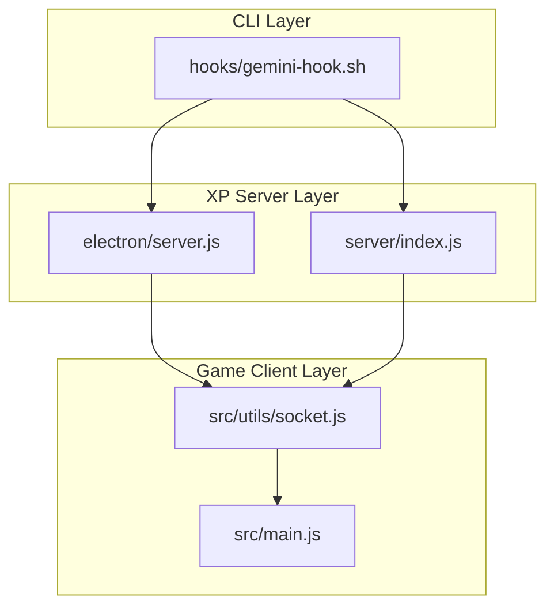
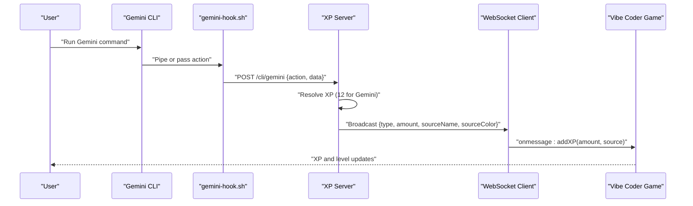
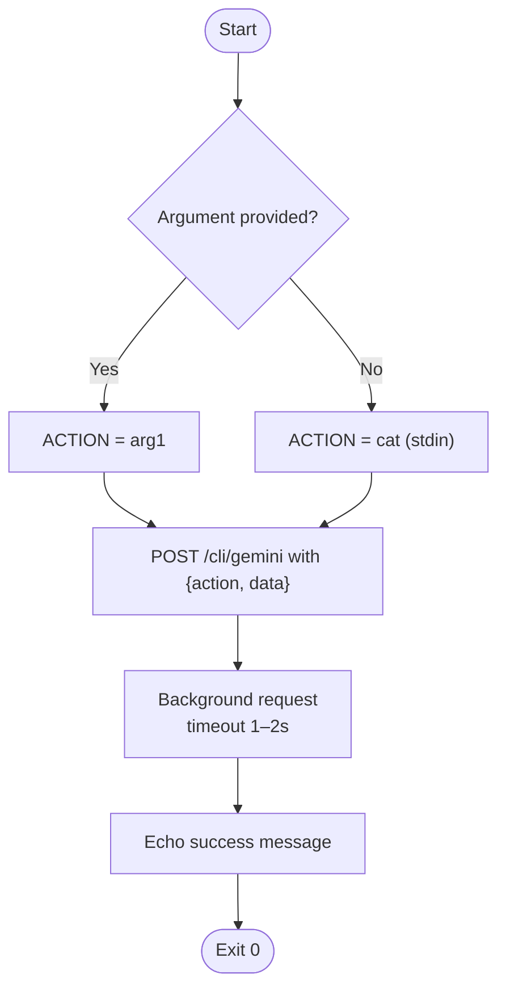
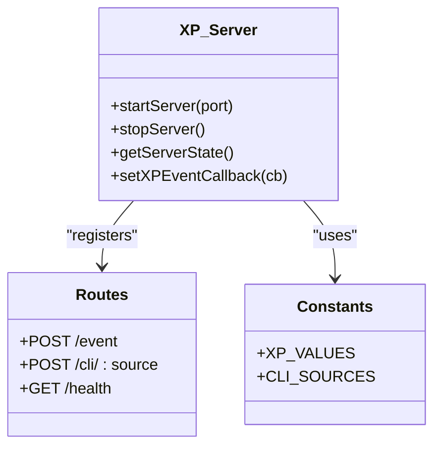
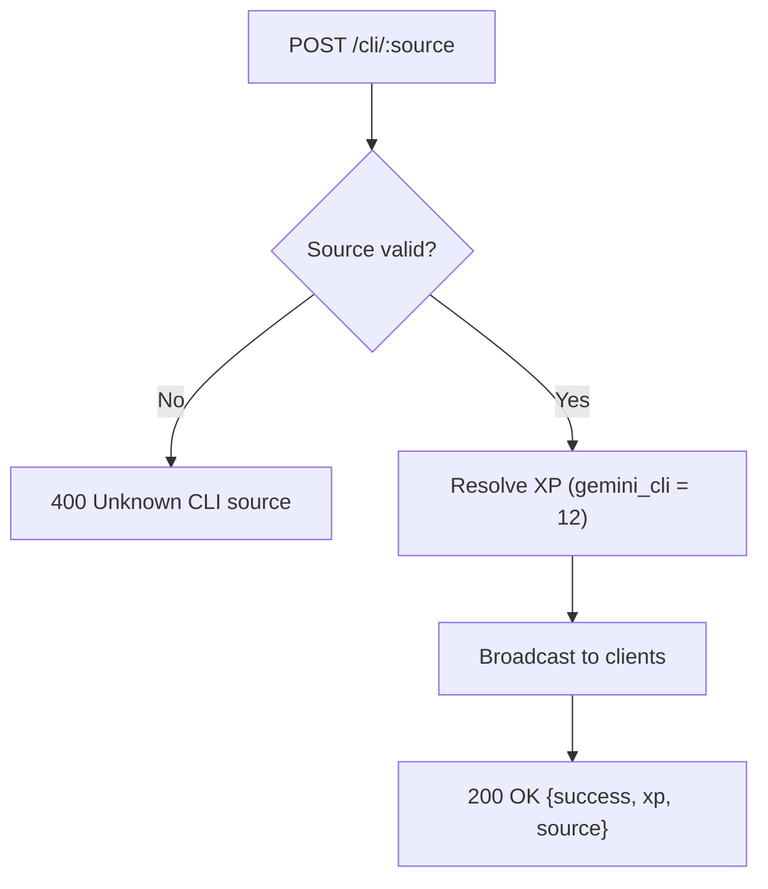
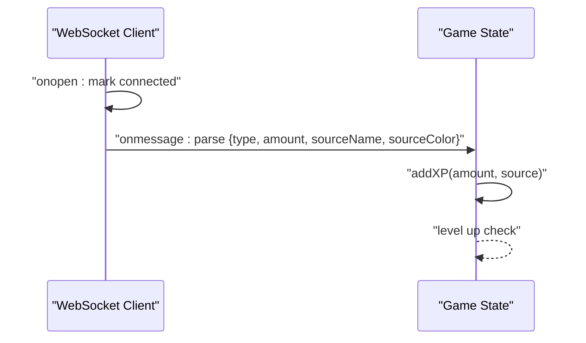
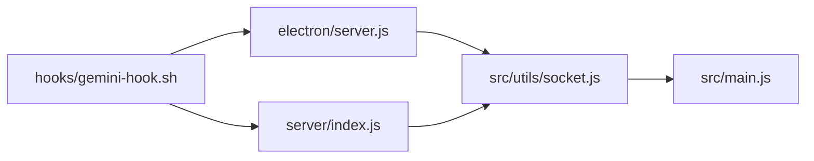

# Gemini CLI Integration

<cite>
**Referenced Files in This Document**
- [gemini-hook.sh](file://hooks/gemini-hook.sh)
- [codex-hook.sh](file://hooks/codex-hook.sh)
- [vibe-coder-hook.sh](file://hooks/vibe-coder-hook.sh)
- [on-prompt.sh](file://hooks/on-prompt.sh)
- [on-response.sh](file://hooks/on-response.sh)
- [README.md](file://README.md)
- [SETUP.md](file://SETUP.md)
- [electron/server.js](file://electron/server.js)
- [server/index.js](file://server/index.js)
- [src/utils/socket.js](file://src/utils/socket.js)
- [src/main.js](file://src/main.js)
- [.env.example](file://.env.example)
- [.env](file://.env)
</cite>

## Table of Contents
1. [Introduction](#introduction)
2. [Project Structure](#project-structure)
3. [Core Components](#core-components)
4. [Architecture Overview](#architecture-overview)
5. [Detailed Component Analysis](#detailed-component-analysis)
6. [Dependency Analysis](#dependency-analysis)
7. [Performance Considerations](#performance-considerations)
8. [Troubleshooting Guide](#troubleshooting-guide)
9. [Conclusion](#conclusion)
10. [Appendices](#appendices)

## Introduction
This document explains how the Gemini AI CLI integrates with Vibe Coder to reward real coding activity with XP. It covers how the Gemini hook captures CLI actions, how the XP server translates them into XP events, and how the game receives and applies the XP. It also provides setup steps, authentication notes, XP reward guidelines, troubleshooting tips, and best practices for effective Gemini CLI usage.

## Project Structure
The Gemini integration spans three layers:
- CLI hook: a small shell script that posts Gemini CLI activity to the XP server
- XP server: a Node.js HTTP/WebSocket service that validates and broadcasts XP events
- Game client: a browser/Electron app that listens for XP events and updates the player state

**Diagram sources**
- [gemini-hook.sh](file://hooks/gemini-hook.sh#L1-L26)
- [electron/server.js](file://electron/server.js#L75-L151)
- [server/index.js](file://server/index.js#L99-L125)
- [src/utils/socket.js](file://src/utils/socket.js#L1-L121)
- [src/main.js](file://src/main.js#L323-L379)

**Section sources**
- [gemini-hook.sh](file://hooks/gemini-hook.sh#L1-L26)
- [electron/server.js](file://electron/server.js#L75-L151)
- [server/index.js](file://server/index.js#L99-L125)
- [src/utils/socket.js](file://src/utils/socket.js#L1-L121)
- [src/main.js](file://src/main.js#L323-L379)

## Core Components
- Gemini CLI hook: reads an action string from stdin or an argument and posts it to the XP server’s Gemini endpoint
- XP server: exposes endpoints for CLI sources and broadcasts XP events to the game via WebSocket
- Game client: connects to the XP server, parses incoming events, and increases player XP and level

Key XP values for Gemini CLI:
- Gemini CLI: 12 XP per event
- Gemini AI: 12 XP per event (when applicable)

These values are defined in the XP server and applied when the source matches Gemini.

**Section sources**
- [gemini-hook.sh](file://hooks/gemini-hook.sh#L18-L23)
- [electron/server.js](file://electron/server.js#L18-L29)
- [electron/server.js](file://electron/server.js#L121-L133)
- [server/index.js](file://server/index.js#L78-L88)
- [server/index.js](file://server/index.js#L115-L125)

## Architecture Overview
The Gemini integration follows a simple pipeline:
1. User runs a Gemini CLI command or workflow
2. The Gemini hook posts an action payload to the XP server
3. The XP server resolves the XP amount for the Gemini source and broadcasts the event
4. The game client receives the event and updates the player state

**Diagram sources**
- [gemini-hook.sh](file://hooks/gemini-hook.sh#L10-L23)
- [electron/server.js](file://electron/server.js#L121-L133)
- [src/utils/socket.js](file://src/utils/socket.js#L54-L72)
- [src/main.js](file://src/main.js#L337-L364)

## Detailed Component Analysis

### Gemini Hook Script
The Gemini hook script reads either a command-line argument or stdin, then posts a structured payload to the XP server’s Gemini endpoint. It uses a non-blocking background curl request to minimize latency.

**Diagram sources**
- [gemini-hook.sh](file://hooks/gemini-hook.sh#L10-L25)

**Section sources**
- [gemini-hook.sh](file://hooks/gemini-hook.sh#L1-L26)

### XP Server (Electron)
The Electron-built XP server defines XP values and CLI source mappings, exposes endpoints for CLI sources, and broadcasts events to connected clients.

**Diagram sources**
- [electron/server.js](file://electron/server.js#L75-L151)
- [electron/server.js](file://electron/server.js#L18-L39)

Key behaviors:
- CLI endpoints resolve XP based on the source (e.g., gemini_cli = 12)
- Broadcasts events to all WebSocket clients with source metadata
- Provides health check endpoint

**Section sources**
- [electron/server.js](file://electron/server.js#L18-L29)
- [electron/server.js](file://electron/server.js#L121-L133)
- [electron/server.js](file://electron/server.js#L135-L151)

### XP Server (Standalone)
The standalone server mirrors the Electron server behavior for compatibility, including CLI endpoints and XP resolution.

**Diagram sources**
- [server/index.js](file://server/index.js#L115-L125)

**Section sources**
- [server/index.js](file://server/index.js#L78-L88)
- [server/index.js](file://server/index.js#L115-L125)

### Game Client Integration
The game client connects to the XP server, listens for events, and updates the player’s XP and level. It also tracks the last XP source to enable auto-movement logic.

**Diagram sources**
- [src/utils/socket.js](file://src/utils/socket.js#L38-L72)
- [src/main.js](file://src/main.js#L337-L364)

**Section sources**
- [src/utils/socket.js](file://src/utils/socket.js#L1-L121)
- [src/main.js](file://src/main.js#L323-L379)

## Dependency Analysis
The integration depends on:
- Shell scripting for the Gemini hook
- Node.js for the XP server
- WebSocket communication for real-time updates
- Game state management for XP accumulation and leveling

**Diagram sources**
- [gemini-hook.sh](file://hooks/gemini-hook.sh#L18-L23)
- [electron/server.js](file://electron/server.js#L121-L133)
- [server/index.js](file://server/index.js#L115-L125)
- [src/utils/socket.js](file://src/utils/socket.js#L36-L72)
- [src/main.js](file://src/main.js#L337-L364)

**Section sources**
- [gemini-hook.sh](file://hooks/gemini-hook.sh#L1-L26)
- [electron/server.js](file://electron/server.js#L75-L151)
- [server/index.js](file://server/index.js#L99-L125)
- [src/utils/socket.js](file://src/utils/socket.js#L1-L121)
- [src/main.js](file://src/main.js#L323-L379)

## Performance Considerations
- Non-blocking requests: Gemini hook uses background curl to avoid blocking CLI workflows
- Short timeouts: Requests are limited to 1–2 seconds to prevent hangs
- Lightweight payloads: Events carry minimal data to reduce overhead
- Efficient broadcasting: Server broadcasts only resolved XP amounts and source metadata

Best practices:
- Keep the XP server running during development
- Prefer local connections (localhost) to avoid network latency
- Batch frequent CLI actions to reduce request frequency if needed

[No sources needed since this section provides general guidance]

## Troubleshooting Guide
Common issues and resolutions:
- XP server not running
  - Ensure the XP server is started and listening on the expected port
  - Use the health endpoint to verify status
- Hook not executable
  - Ensure the Gemini hook script is executable
- No XP in-game
  - Verify the game is running locally (WebSocket client only connects on localhost)
  - Check browser console for WebSocket errors
- Connection status indicators
  - Live: connected and earning XP
  - Offline: not connected, use manual XP
  - Connecting: attempting to connect

**Section sources**
- [SETUP.md](file://SETUP.md#L109-L143)
- [src/utils/socket.js](file://src/utils/socket.js#L13-L16)
- [src/utils/socket.js](file://src/utils/socket.js#L38-L52)
- [SETUP.md](file://SETUP.md#L146-L153)

## Conclusion
The Gemini CLI integration seamlessly captures coding activity and converts it into XP within Vibe Coder. The hook posts lightweight events to the XP server, which resolves XP amounts and broadcasts them to the game client. With proper setup and the provided troubleshooting guidance, developers can effectively reward real Gemini CLI usage with meaningful XP gains.

[No sources needed since this section summarizes without analyzing specific files]

## Appendices

### Setup and Authentication Notes
- Local development requires running the XP server and ensuring the game connects to it
- The game client only connects to the XP server on localhost to avoid cross-origin issues
- Environment variables are primarily for on-chain features and do not affect CLI integration

**Section sources**
- [SETUP.md](file://SETUP.md#L32-L46)
- [src/utils/socket.js](file://src/utils/socket.js#L13-L16)
- [.env.example](file://.env.example#L1-L37)
- [.env](file://.env#L1-L5)

### CLI Command Patterns and XP Rewards
- Gemini CLI: 12 XP per event
- Gemini AI: 12 XP per event (when applicable)

These values are applied when the XP server recognizes the source as Gemini.

**Section sources**
- [electron/server.js](file://electron/server.js#L18-L29)
- [server/index.js](file://server/index.js#L78-L88)

### Related Hook Patterns (for comparison)
- Codex CLI: similar endpoint and payload pattern
- Generic Claude Code hooks: demonstrate the broader hook ecosystem

**Section sources**
- [codex-hook.sh](file://hooks/codex-hook.sh#L1-L27)
- [vibe-coder-hook.sh](file://hooks/vibe-coder-hook.sh#L1-L24)
- [on-prompt.sh](file://hooks/on-prompt.sh#L1-L5)
- [on-response.sh](file://hooks/on-response.sh#L1-L5)
- [README.md](file://README.md#L103-L111)