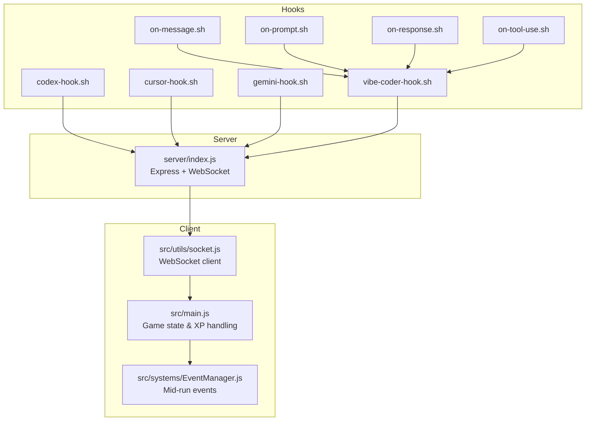
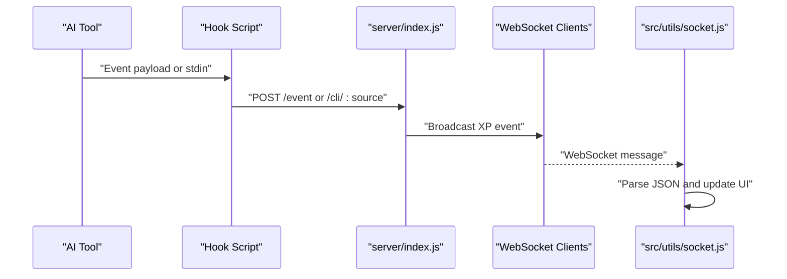
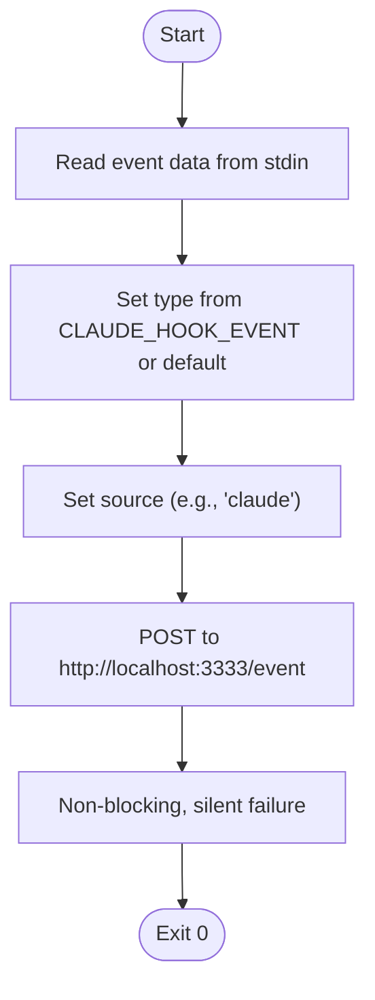
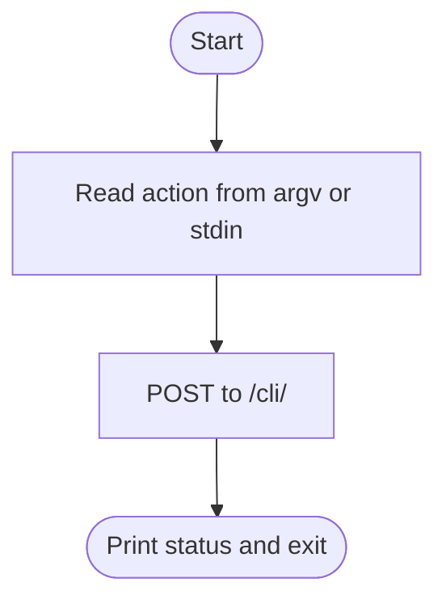
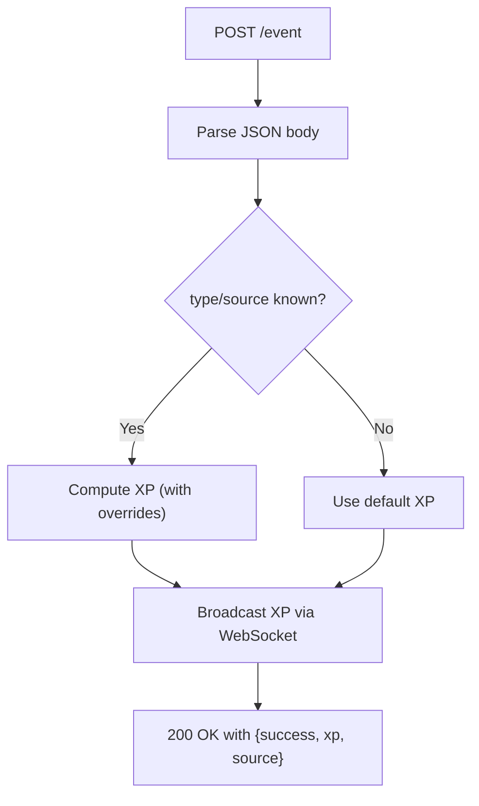
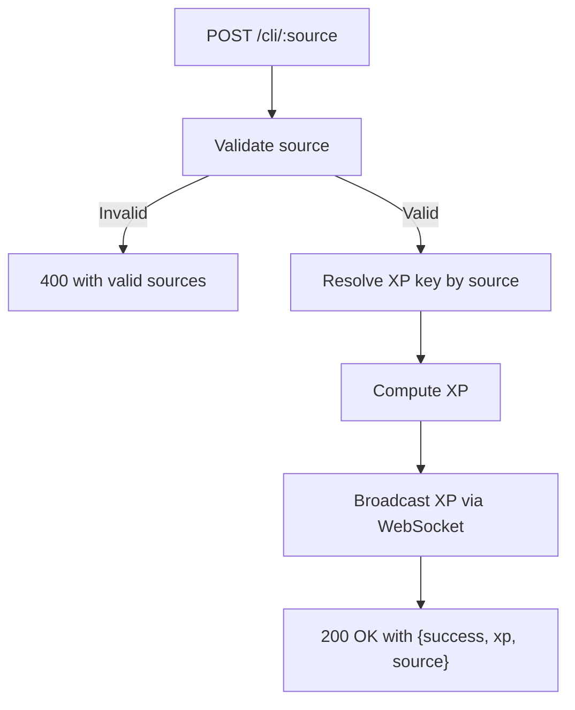
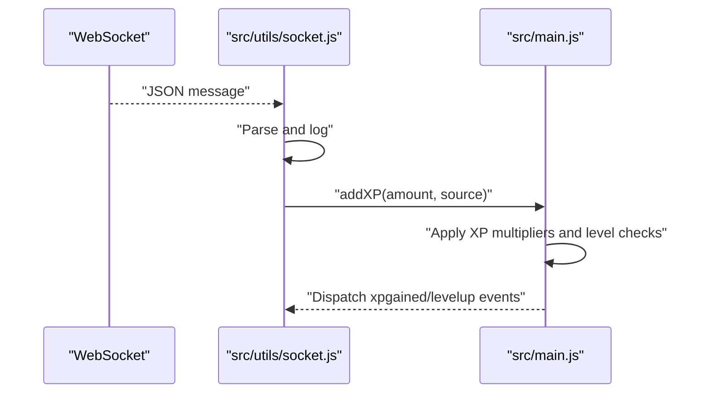
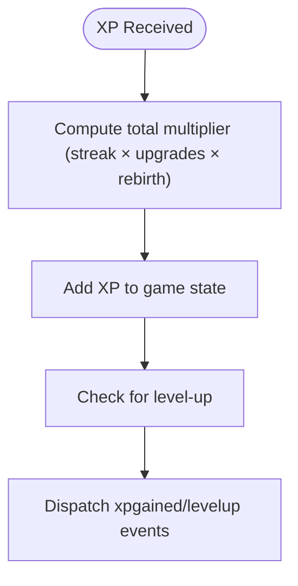
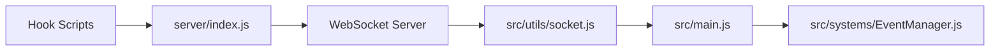

# Generic Tool Support

<cite>
**Referenced Files in This Document**
- [hooks/vibe-coder-hook.sh](file://hooks/vibe-coder-hook.sh)
- [hooks/on-message.sh](file://hooks/on-message.sh)
- [hooks/on-prompt.sh](file://hooks/on-prompt.sh)
- [hooks/on-response.sh](file://hooks/on-response.sh)
- [hooks/on-tool-use.sh](file://hooks/on-tool-use.sh)
- [hooks/codex-hook.sh](file://hooks/codex-hook.sh)
- [hooks/cursor-hook.sh](file://hooks/cursor-hook.sh)
- [hooks/gemini-hook.sh](file://hooks/gemini-hook.sh)
- [server/index.js](file://server/index.js)
- [src/utils/socket.js](file://src/utils/socket.js)
- [src/main.js](file://src/main.js)
- [src/systems/EventManager.js](file://src/systems/EventManager.js)
</cite>

## Table of Contents
1. [Introduction](#introduction)
2. [Project Structure](#project-structure)
3. [Core Components](#core-components)
4. [Architecture Overview](#architecture-overview)
5. [Detailed Component Analysis](#detailed-component-analysis)
6. [Dependency Analysis](#dependency-analysis)
7. [Performance Considerations](#performance-considerations)
8. [Troubleshooting Guide](#troubleshooting-guide)
9. [Conclusion](#conclusion)
10. [Appendices](#appendices)

## Introduction
This document explains how Vibe Coder supports generic AI tool integration beyond the officially supported ones. It details the standardized event format, the generic hook template, and the integration patterns used to send events to the Vibe Coder server. You will learn how to configure custom tools to emit events, how the server parses and broadcasts them, and how the client receives and applies XP accordingly. The guide also includes templates and examples for rapid deployment of new tool integrations, along with best practices and troubleshooting tips.

## Project Structure
The integration spans three areas:
- Hooks: Platform-specific or generic shell scripts that forward events to the server.
- Server: An Express + WebSocket service that validates, rates, and broadcasts XP events.
- Client: A browser/Electron app that subscribes to live XP events and updates game state.

**Diagram sources**
- [hooks/on-message.sh](file://hooks/on-message.sh#L1-L5)
- [hooks/on-prompt.sh](file://hooks/on-prompt.sh#L1-L5)
- [hooks/on-response.sh](file://hooks/on-response.sh#L1-L5)
- [hooks/on-tool-use.sh](file://hooks/on-tool-use.sh#L1-L5)
- [hooks/vibe-coder-hook.sh](file://hooks/vibe-coder-hook.sh#L1-L24)
- [hooks/codex-hook.sh](file://hooks/codex-hook.sh#L1-L27)
- [hooks/cursor-hook.sh](file://hooks/cursor-hook.sh#L1-L24)
- [hooks/gemini-hook.sh](file://hooks/gemini-hook.sh#L1-L27)
- [server/index.js](file://server/index.js#L99-L125)
- [src/utils/socket.js](file://src/utils/socket.js#L1-L121)
- [src/main.js](file://src/main.js#L323-L379)
- [src/systems/EventManager.js](file://src/systems/EventManager.js#L1-L393)

**Section sources**
- [hooks/vibe-coder-hook.sh](file://hooks/vibe-coder-hook.sh#L1-L24)
- [server/index.js](file://server/index.js#L99-L125)
- [src/utils/socket.js](file://src/utils/socket.js#L1-L121)
- [src/main.js](file://src/main.js#L323-L379)

## Core Components
- Generic Claude-style hook: A reusable template that reads event data from stdin, detects the event type via environment, and posts to the server with a standardized payload.
- CLI-style hooks: Dedicated scripts for specific tools (Codex, Cursor, Gemini) that post structured payloads to dedicated endpoints.
- Server endpoints:
  - POST /event: Accepts generic events with type, data, and source; computes XP and broadcasts to WebSocket clients.
  - POST /cli/:source: Accepts CLI activity events for known sources; resolves XP amounts dynamically.
- WebSocket client: Connects to the local XP server, parses incoming messages, and updates game XP and UI.
- Game state: Applies XP multipliers, tracks streaks, and dispatches events for UI updates.

**Section sources**
- [hooks/vibe-coder-hook.sh](file://hooks/vibe-coder-hook.sh#L1-L24)
- [hooks/on-message.sh](file://hooks/on-message.sh#L1-L5)
- [hooks/on-prompt.sh](file://hooks/on-prompt.sh#L1-L5)
- [hooks/on-response.sh](file://hooks/on-response.sh#L1-L5)
- [hooks/on-tool-use.sh](file://hooks/on-tool-use.sh#L1-L5)
- [hooks/codex-hook.sh](file://hooks/codex-hook.sh#L1-L27)
- [hooks/cursor-hook.sh](file://hooks/cursor-hook.sh#L1-L24)
- [hooks/gemini-hook.sh](file://hooks/gemini-hook.sh#L1-L27)
- [server/index.js](file://server/index.js#L99-L125)
- [src/utils/socket.js](file://src/utils/socket.js#L1-L121)
- [src/main.js](file://src/main.js#L323-L379)

## Architecture Overview
The integration follows a simple, extensible pattern:
- Tools emit events either as structured payloads or via stdin.
- Hooks transform events into a unified format and POST to the server.
- The server validates, computes XP, and broadcasts via WebSocket.
- The client receives events, applies multipliers, and updates the game state.

**Diagram sources**
- [hooks/vibe-coder-hook.sh](file://hooks/vibe-coder-hook.sh#L1-L24)
- [hooks/codex-hook.sh](file://hooks/codex-hook.sh#L1-L27)
- [server/index.js](file://server/index.js#L99-L125)
- [src/utils/socket.js](file://src/utils/socket.js#L54-L72)

## Detailed Component Analysis

### Generic Claude-Style Hook Template
The generic hook reads event data from stdin, determines the event type from the environment, sets a source, and posts to the server. It is designed to be reused across platforms by setting the appropriate environment variable before execution.

Key behaviors:
- Reads event payload from stdin.
- Uses CLAUDE_HOOK_EVENT (or falls back to a default) to set type.
- Sends a JSON payload with type, data, and source to the server.
- Non-blocking, fire-and-forget delivery.

**Diagram sources**
- [hooks/vibe-coder-hook.sh](file://hooks/vibe-coder-hook.sh#L1-L24)

**Section sources**
- [hooks/vibe-coder-hook.sh](file://hooks/vibe-coder-hook.sh#L1-L24)
- [hooks/on-message.sh](file://hooks/on-message.sh#L1-L5)
- [hooks/on-prompt.sh](file://hooks/on-prompt.sh#L1-L5)
- [hooks/on-response.sh](file://hooks/on-response.sh#L1-L5)
- [hooks/on-tool-use.sh](file://hooks/on-tool-use.sh#L1-L5)

### CLI-Style Hooks for Specific Tools
These scripts are tailored for specific AI tools and post to dedicated endpoints with a consistent payload shape. They accept either a command-line argument or stdin and forward a structured action payload.

Patterns:
- Accept action from argv or stdin.
- POST to /cli/<source>.
- Non-blocking delivery.

**Diagram sources**
- [hooks/codex-hook.sh](file://hooks/codex-hook.sh#L1-L27)
- [hooks/cursor-hook.sh](file://hooks/cursor-hook.sh#L1-L24)
- [hooks/gemini-hook.sh](file://hooks/gemini-hook.sh#L1-L27)

**Section sources**
- [hooks/codex-hook.sh](file://hooks/codex-hook.sh#L1-L27)
- [hooks/cursor-hook.sh](file://hooks/cursor-hook.sh#L1-L24)
- [hooks/gemini-hook.sh](file://hooks/gemini-hook.sh#L1-L27)

### Server Endpoint: POST /event
Accepts generic events with:
- type: event category (e.g., message, response, tool_use).
- data: arbitrary JSON payload (e.g., tool metadata).
- source: tool family (e.g., claude, codex, gemini, cursor, copilot).

Processing:
- Determines XP amount based on type and source.
- Adjusts XP for specific tool_use actions (e.g., Edit/Write vs Bash).
- Broadcasts a normalized XP event to WebSocket clients.

**Diagram sources**
- [server/index.js](file://server/index.js#L99-L113)

**Section sources**
- [server/index.js](file://server/index.js#L99-L113)

### Server Endpoint: POST /cli/:source
Accepts CLI activity events for known sources. It:
- Validates the source.
- Resolves XP key based on source and predefined categories.
- Broadcasts a normalized XP event.

**Diagram sources**
- [server/index.js](file://server/index.js#L115-L125)

**Section sources**
- [server/index.js](file://server/index.js#L115-L125)

### WebSocket Client and Game State
The client:
- Connects to ws://localhost:3001 only on localhost.
- Parses incoming messages and logs them.
- Updates game XP via window.VIBE_CODER.addXP, applying multipliers and dispatching events.

**Diagram sources**
- [src/utils/socket.js](file://src/utils/socket.js#L54-L72)
- [src/main.js](file://src/main.js#L337-L364)

**Section sources**
- [src/utils/socket.js](file://src/utils/socket.js#L1-L121)
- [src/main.js](file://src/main.js#L323-L379)

### Mid-Run Events and XP Multipliers
While not part of the generic integration, the client’s XP handling includes:
- XP multipliers from upgrades and rebirths.
- Streak-based bonuses.
- Event-driven XP boosts (e.g., DOUBLE_XP).

**Diagram sources**
- [src/main.js](file://src/main.js#L337-L364)
- [src/systems/EventManager.js](file://src/systems/EventManager.js#L134-L153)

**Section sources**
- [src/main.js](file://src/main.js#L323-L379)
- [src/systems/EventManager.js](file://src/systems/EventManager.js#L1-L393)

## Dependency Analysis
- Hooks depend on the server endpoints and the local network.
- The server depends on the WebSocket server and the XP computation logic.
- The client depends on the WebSocket URL and the global game state object.

**Diagram sources**
- [hooks/vibe-coder-hook.sh](file://hooks/vibe-coder-hook.sh#L1-L24)
- [server/index.js](file://server/index.js#L99-L125)
- [src/utils/socket.js](file://src/utils/socket.js#L1-L121)
- [src/main.js](file://src/main.js#L323-L379)
- [src/systems/EventManager.js](file://src/systems/EventManager.js#L1-L393)

**Section sources**
- [server/index.js](file://server/index.js#L99-L125)
- [src/utils/socket.js](file://src/utils/socket.js#L1-L121)
- [src/main.js](file://src/main.js#L323-L379)

## Performance Considerations
- Non-blocking delivery: Hooks use asynchronous POST requests to avoid blocking the calling tool.
- Lightweight payloads: Events are small JSON objects; keep data minimal to reduce overhead.
- Rate limiting: The server computes XP per event; avoid flooding to prevent excessive client updates.
- Client-side throttling: The WebSocket client parses and logs events; avoid generating thousands of events per second.

[No sources needed since this section provides general guidance]

## Troubleshooting Guide
Common issues and resolutions:
- Server not reachable:
  - Ensure the server is running and listening on the expected port.
  - Verify firewall and CORS settings if running remotely.
- Events not appearing in the client:
  - Confirm the client is running on localhost; the WebSocket client only connects locally.
  - Check that the server is broadcasting via WebSocket and that the client is subscribed.
- Incorrect XP amounts:
  - Verify the event type and source match server expectations.
  - For tool_use events, confirm tool metadata includes expected keywords for overrides.
- Hook failures:
  - Check stdin availability and environment variables for generic hooks.
  - Validate POST URLs and JSON payloads for CLI hooks.

**Section sources**
- [src/utils/socket.js](file://src/utils/socket.js#L18-L104)
- [server/index.js](file://server/index.js#L99-L125)

## Conclusion
Vibe Coder’s generic tool integration relies on a simple, extensible pattern: tools emit events, hooks normalize and forward them to the server, and the client updates game state in real time. By following the standardized event format and using the provided templates, you can rapidly integrate new AI coding tools with consistent XP behavior.

[No sources needed since this section summarizes without analyzing specific files]

## Appendices

### Standardized Event Format
- Generic endpoint (POST /event):
  - type: string (e.g., message, response, tool_use)
  - data: object (arbitrary tool data; may include tool metadata)
  - source: string (e.g., claude, codex, gemini, cursor, copilot)
- CLI endpoint (POST /cli/:source):
  - action: string (e.g., codex_activity, cursor_activity)
  - data: object (e.g., { action: "<description>" })

**Section sources**
- [server/index.js](file://server/index.js#L99-L125)
- [hooks/codex-hook.sh](file://hooks/codex-hook.sh#L18-L20)
- [hooks/cursor-hook.sh](file://hooks/cursor-hook.sh#L15-L17)
- [hooks/gemini-hook.sh](file://hooks/gemini-hook.sh#L18-L20)

### Integration Patterns and Best Practices
- Use the generic Claude-style hook when integrating tools that support environment-based event emission.
- Use CLI-style hooks for tools that expose direct CLI commands or can pipe output.
- Keep payloads minimal; include only necessary metadata for XP computation.
- Test locally first; the client only connects on localhost.
- Monitor XP amounts and adjust XP values in the server if needed.

**Section sources**
- [hooks/vibe-coder-hook.sh](file://hooks/vibe-coder-hook.sh#L1-L24)
- [hooks/on-message.sh](file://hooks/on-message.sh#L1-L5)
- [hooks/on-prompt.sh](file://hooks/on-prompt.sh#L1-L5)
- [hooks/on-response.sh](file://hooks/on-response.sh#L1-L5)
- [hooks/on-tool-use.sh](file://hooks/on-tool-use.sh#L1-L5)
- [hooks/codex-hook.sh](file://hooks/codex-hook.sh#L1-L27)
- [hooks/cursor-hook.sh](file://hooks/cursor-hook.sh#L1-L24)
- [hooks/gemini-hook.sh](file://hooks/gemini-hook.sh#L1-L27)

### Templates and Examples
- Generic Claude-style hook template:
  - Read event from stdin.
  - Export CLAUDE_HOOK_EVENT to set type.
  - Execute the shared hook to POST to /event.
  - Reference: [hooks/on-message.sh](file://hooks/on-message.sh#L1-L5), [hooks/vibe-coder-hook.sh](file://hooks/vibe-coder-hook.sh#L1-L24)
- CLI-style hook template:
  - Accept action from argv or stdin.
  - POST to /cli/<source> with action and data.
  - Reference: [hooks/codex-hook.sh](file://hooks/codex-hook.sh#L1-L27), [hooks/cursor-hook.sh](file://hooks/cursor-hook.sh#L1-L24), [hooks/gemini-hook.sh](file://hooks/gemini-hook.sh#L1-L27)

**Section sources**
- [hooks/on-message.sh](file://hooks/on-message.sh#L1-L5)
- [hooks/on-prompt.sh](file://hooks/on-prompt.sh#L1-L5)
- [hooks/on-response.sh](file://hooks/on-response.sh#L1-L5)
- [hooks/on-tool-use.sh](file://hooks/on-tool-use.sh#L1-L5)
- [hooks/vibe-coder-hook.sh](file://hooks/vibe-coder-hook.sh#L1-L24)
- [hooks/codex-hook.sh](file://hooks/codex-hook.sh#L1-L27)
- [hooks/cursor-hook.sh](file://hooks/cursor-hook.sh#L1-L24)
- [hooks/gemini-hook.sh](file://hooks/gemini-hook.sh#L1-L27)