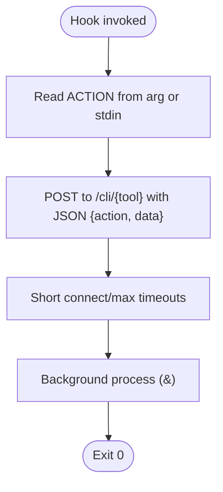

# Hook Architecture

<cite>
**Referenced Files in This Document**
- [hooks/vibe-coder-hook.sh](file://hooks/vibe-coder-hook.sh)
- [hooks/cursor-hook.sh](file://hooks/cursor-hook.sh)
- [hooks/codex-hook.sh](file://hooks/codex-hook.sh)
- [hooks/gemini-hook.sh](file://hooks/gemini-hook.sh)
- [hooks/on-message.sh](file://hooks/on-message.sh)
- [hooks/on-prompt.sh](file://hooks/on-prompt.sh)
- [hooks/on-response.sh](file://hooks/on-response.sh)
- [hooks/on-tool-use.sh](file://hooks/on-tool-use.sh)
- [xp-server.js](file://xp-server.js)
- [src/utils/socket.js](file://src/utils/socket.js)
- [src/utils/authApi.js](file://src/utils/authApi.js)
- [server/routes/auth.js](file://server/routes/auth.js)
- [server/auth/challenge.js](file://server/auth/challenge.js)
- [server/auth/token.js](file://server/auth/token.js)
- [server/middleware/jwtAuth.js](file://server/middleware/jwtAuth.js)
</cite>

## Table of Contents
1. [Introduction](#introduction)
2. [Project Structure](#project-structure)
3. [Core Components](#core-components)
4. [Architecture Overview](#architecture-overview)
5. [Detailed Component Analysis](#detailed-component-analysis)
6. [Dependency Analysis](#dependency-analysis)
7. [Performance Considerations](#performance-considerations)
8. [Troubleshooting Guide](#troubleshooting-guide)
9. [Conclusion](#conclusion)

## Introduction
This document explains the AI integration hook architecture that captures real-time coding activity from multiple AI tools and streams it into the game via a WebSocket-based XP broadcasting system. It covers the event-driven design, hook execution flow, non-blocking data transmission, authentication via Stellar SEP-10, and the HTTP-to-WebSocket pipeline. It also documents timeout and error handling strategies, and provides practical integration patterns for hook scripts.

## Project Structure
The hook architecture spans three primary areas:
- AI tool integration hooks: small Bash scripts that capture tool-specific events and forward them to the XP server.
- XP server: a Node.js HTTP/WebSocket server that accepts events, computes XP amounts, and broadcasts updates to connected clients.
- Frontend client: a browser module that connects to the XP server via WebSocket and updates the game state.

**Diagram sources**
- [hooks/on-message.sh](file://hooks/on-message.sh#L1-L5)
- [hooks/on-prompt.sh](file://hooks/on-prompt.sh#L1-L5)
- [hooks/on-response.sh](file://hooks/on-response.sh#L1-L5)
- [hooks/on-tool-use.sh](file://hooks/on-tool-use.sh#L1-L5)
- [hooks/vibe-coder-hook.sh](file://hooks/vibe-coder-hook.sh#L1-L24)
- [hooks/cursor-hook.sh](file://hooks/cursor-hook.sh#L1-L24)
- [hooks/codex-hook.sh](file://hooks/codex-hook.sh#L1-L27)
- [hooks/gemini-hook.sh](file://hooks/gemini-hook.sh#L1-L27)
- [xp-server.js](file://xp-server.js#L1-L106)
- [src/utils/socket.js](file://src/utils/socket.js#L1-L121)

**Section sources**
- [hooks/vibe-coder-hook.sh](file://hooks/vibe-coder-hook.sh#L1-L24)
- [hooks/cursor-hook.sh](file://hooks/cursor-hook.sh#L1-L24)
- [hooks/codex-hook.sh](file://hooks/codex-hook.sh#L1-L27)
- [hooks/gemini-hook.sh](file://hooks/gemini-hook.sh#L1-L27)
- [xp-server.js](file://xp-server.js#L1-L106)
- [src/utils/socket.js](file://src/utils/socket.js#L1-L121)

## Core Components
- Claude integration hooks: thin wrappers that set an event type and delegate to the central Claude hook script.
- Central Claude hook: reads stdin, extracts the event type, sets a source, and performs a non-blocking HTTP POST to the XP server.
- CLI hooks (Cursor, Codex, Gemini): read an action from arguments or stdin and POST to dedicated endpoints on the XP server.
- XP server: accepts JSON events over HTTP, logs XP amounts, and broadcasts structured messages to WebSocket clients.
- Game client: connects to the XP WebSocket, parses incoming events, and updates the game’s XP state.

Key characteristics:
- Non-blocking: hooks background curl requests and always exit successfully to avoid tool-side delays.
- Event-driven: XP server reacts to incoming events and immediately broadcasts to clients.
- Decoupled: hooks and client communicate over local ports; the XP server acts as a bridge.

**Section sources**
- [hooks/on-message.sh](file://hooks/on-message.sh#L1-L5)
- [hooks/on-prompt.sh](file://hooks/on-prompt.sh#L1-L5)
- [hooks/on-response.sh](file://hooks/on-response.sh#L1-L5)
- [hooks/on-tool-use.sh](file://hooks/on-tool-use.sh#L1-L5)
- [hooks/vibe-coder-hook.sh](file://hooks/vibe-coder-hook.sh#L1-L24)
- [hooks/cursor-hook.sh](file://hooks/cursor-hook.sh#L1-L24)
- [hooks/codex-hook.sh](file://hooks/codex-hook.sh#L1-L27)
- [hooks/gemini-hook.sh](file://hooks/gemini-hook.sh#L1-L27)
- [xp-server.js](file://xp-server.js#L1-L106)
- [src/utils/socket.js](file://src/utils/socket.js#L1-L121)

## Architecture Overview
The system follows an event-driven pattern:
- AI tools trigger hook scripts on user actions.
- Hooks serialize event data and send HTTP requests to the XP server.
- The XP server validates and parses the payload, computes XP, and broadcasts via WebSocket.
- The game client receives updates and updates the player’s XP and visuals.

**Diagram sources**
- [hooks/vibe-coder-hook.sh](file://hooks/vibe-coder-hook.sh#L1-L24)
- [xp-server.js](file://xp-server.js#L20-L70)
- [src/utils/socket.js](file://src/utils/socket.js#L18-L104)

## Detailed Component Analysis

### Claude Hook Chain
The Claude integration uses wrapper scripts to set the event type and then exec the central Claude hook. The central hook reads stdin, determines the event type, sets a source, and posts to the XP server.

**Diagram sources**
- [hooks/on-message.sh](file://hooks/on-message.sh#L1-L5)
- [hooks/on-prompt.sh](file://hooks/on-prompt.sh#L1-L5)
- [hooks/on-response.sh](file://hooks/on-response.sh#L1-L5)
- [hooks/on-tool-use.sh](file://hooks/on-tool-use.sh#L1-L5)
- [hooks/vibe-coder-hook.sh](file://hooks/vibe-coder-hook.sh#L1-L24)
- [xp-server.js](file://xp-server.js#L32-L70)

**Section sources**
- [hooks/on-message.sh](file://hooks/on-message.sh#L1-L5)
- [hooks/on-prompt.sh](file://hooks/on-prompt.sh#L1-L5)
- [hooks/on-response.sh](file://hooks/on-response.sh#L1-L5)
- [hooks/on-tool-use.sh](file://hooks/on-tool-use.sh#L1-L5)
- [hooks/vibe-coder-hook.sh](file://hooks/vibe-coder-hook.sh#L1-L24)

### CLI Hooks (Cursor, Codex, Gemini)
These hooks accept either a command-line argument or stdin, then POST to dedicated endpoints on the XP server. They are non-blocking and always exit successfully.

**Diagram sources**
- [hooks/cursor-hook.sh](file://hooks/cursor-hook.sh#L1-L24)
- [hooks/codex-hook.sh](file://hooks/codex-hook.sh#L1-L27)
- [hooks/gemini-hook.sh](file://hooks/gemini-hook.sh#L1-L27)

**Section sources**
- [hooks/cursor-hook.sh](file://hooks/cursor-hook.sh#L1-L24)
- [hooks/codex-hook.sh](file://hooks/codex-hook.sh#L1-L27)
- [hooks/gemini-hook.sh](file://hooks/gemini-hook.sh#L1-L27)

### XP Server: HTTP and WebSocket Bridge
The XP server:
- Accepts HTTP POST to /event with JSON payload.
- Parses the payload, selects XP amount by type, and broadcasts a structured message to all WebSocket clients.
- Provides a WebSocket server on the same port for real-time updates.

**Diagram sources**
- [xp-server.js](file://xp-server.js#L20-L83)

**Section sources**
- [xp-server.js](file://xp-server.js#L1-L106)

### Game Client: WebSocket Consumer
The client:
- Connects to ws://localhost:3001.
- Handles open/close/reconnect logic with exponential-friendly retries.
- Parses incoming messages and invokes the game’s XP update routine.

**Diagram sources**
- [src/utils/socket.js](file://src/utils/socket.js#L18-L104)

**Section sources**
- [src/utils/socket.js](file://src/utils/socket.js#L1-L121)

### Authentication Flow (SEP-10)
The frontend authentication API implements the full SEP-10 flow:
- GET challenge from the backend with the user’s Stellar public key.
- Sign the challenge with Freighter (or equivalent) within a timeout.
- POST the signed XDR to exchange for a JWT.
- Persist the JWT and use it for protected endpoints.

**Diagram sources**
- [src/utils/authApi.js](file://src/utils/authApi.js#L167-L183)
- [server/routes/auth.js](file://server/routes/auth.js#L19-L55)
- [server/auth/challenge.js](file://server/auth/challenge.js#L64-L86)
- [server/auth/token.js](file://server/auth/token.js#L29-L79)

**Section sources**
- [src/utils/authApi.js](file://src/utils/authApi.js#L1-L184)
- [server/routes/auth.js](file://server/routes/auth.js#L1-L115)
- [server/auth/challenge.js](file://server/auth/challenge.js#L1-L87)
- [server/auth/token.js](file://server/auth/token.js#L1-L80)
- [server/middleware/jwtAuth.js](file://server/middleware/jwtAuth.js#L1-L36)

## Dependency Analysis
- Hooks depend on the XP server being reachable locally.
- The XP server depends on the WebSocket library and exposes both HTTP and WebSocket endpoints.
- The game client depends on the XP server’s WebSocket interface.
- Authentication depends on backend routes and middleware for JWT verification.

**Diagram sources**
- [hooks/vibe-coder-hook.sh](file://hooks/vibe-coder-hook.sh#L1-L24)
- [hooks/cursor-hook.sh](file://hooks/cursor-hook.sh#L1-L24)
- [hooks/codex-hook.sh](file://hooks/codex-hook.sh#L1-L27)
- [hooks/gemini-hook.sh](file://hooks/gemini-hook.sh#L1-L27)
- [xp-server.js](file://xp-server.js#L1-L106)
- [src/utils/socket.js](file://src/utils/socket.js#L1-L121)
- [src/utils/authApi.js](file://src/utils/authApi.js#L1-L184)
- [server/routes/auth.js](file://server/routes/auth.js#L1-L115)
- [server/auth/challenge.js](file://server/auth/challenge.js#L1-L87)
- [server/auth/token.js](file://server/auth/token.js#L1-L80)
- [server/middleware/jwtAuth.js](file://server/middleware/jwtAuth.js#L1-L36)

**Section sources**
- [xp-server.js](file://xp-server.js#L1-L106)
- [src/utils/socket.js](file://src/utils/socket.js#L1-L121)
- [src/utils/authApi.js](file://src/utils/authApi.js#L1-L184)
- [server/routes/auth.js](file://server/routes/auth.js#L1-L115)
- [server/auth/challenge.js](file://server/auth/challenge.js#L1-L87)
- [server/auth/token.js](file://server/auth/token.js#L1-L80)
- [server/middleware/jwtAuth.js](file://server/middleware/jwtAuth.js#L1-L36)

## Performance Considerations
- Non-blocking hook execution: curl is invoked in background mode to avoid blocking the AI tool.
- Short timeouts: connect and total request timeouts are configured to keep the tool responsive.
- Minimal parsing overhead: the XP server parses JSON once and broadcasts to all clients efficiently.
- Client-side resilience: the game client reconnects automatically and avoids repeated logging while offline.

Recommendations:
- Keep hook payloads minimal to reduce bandwidth and parsing cost.
- Monitor XP server CPU usage during bursts of events; consider rate limiting at the hook level if needed.
- Ensure the WebSocket client remains connected; the current implementation auto-reconnects.

**Section sources**
- [hooks/vibe-coder-hook.sh](file://hooks/vibe-coder-hook.sh#L14-L20)
- [hooks/cursor-hook.sh](file://hooks/cursor-hook.sh#L15-L20)
- [hooks/codex-hook.sh](file://hooks/codex-hook.sh#L18-L23)
- [hooks/gemini-hook.sh](file://hooks/gemini-hook.sh#L18-L23)
- [xp-server.js](file://xp-server.js#L32-L70)
- [src/utils/socket.js](file://src/utils/socket.js#L74-L104)

## Troubleshooting Guide
Common issues and resolutions:
- XP server offline: the client logs a friendly message and retries. Ensure the XP server is running and listening on the expected port.
- Invalid JSON from hooks: the XP server responds with a 400 error when JSON parsing fails. Validate hook payloads.
- No events received: verify the client is connecting to ws://localhost:3001 and that the XP server is broadcasting.
- Authentication failures: ensure the backend is configured for SEP-10 and that the frontend uses the correct API base URL.

Operational checks:
- Confirm the XP server logs incoming events and broadcasts.
- Confirm the client logs connection and message events.
- Confirm the hooks are executable and backgrounded.

**Section sources**
- [xp-server.js](file://xp-server.js#L20-L70)
- [src/utils/socket.js](file://src/utils/socket.js#L74-L104)
- [src/utils/authApi.js](file://src/utils/authApi.js#L57-L111)

## Conclusion
The hook architecture provides a robust, non-blocking mechanism to capture AI tool activity and stream it into the game via a WebSocket. The XP server acts as a lightweight bridge, while the client maintains resilient connectivity. The SEP-10 authentication flow secures user sessions and enables protected endpoints. Together, these components form a scalable, event-driven pipeline suitable for real-time coding activity tracking.