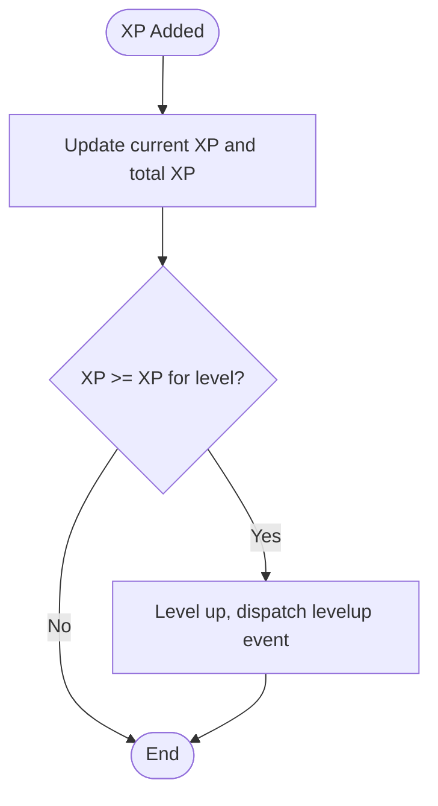

# XP Broadcasting System

<cite>
**Referenced Files in This Document**
- [xp-server.js](file://xp-server.js)
- [socket.js](file://src/utils/socket.js)
- [index.js](file://server/index.js)
- [auth.js](file://server/routes/auth.js)
- [jwtAuth.js](file://server/middleware/jwtAuth.js)
- [sep10.js](file://server/config/sep10.js)
- [main.js](file://src/main.js)
- [EventManager.js](file://src/systems/EventManager.js)
- [vibe-coder-hook.sh](file://hooks/vibe-coder-hook.sh)
- [on-response.sh](file://hooks/on-response.sh)
- [on-tool-use.sh](file://hooks/on-tool-use.sh)
- [walletProgressApi.js](file://src/utils/walletProgressApi.js)
- [walletProgressService.js](file://src/utils/walletProgressService.js)
- [stellarWallet.js](file://src/utils/stellarWallet.js)
</cite>

## Table of Contents
1. [Introduction](#introduction)
2. [Project Structure](#project-structure)
3. [Core Components](#core-components)
4. [Architecture Overview](#architecture-overview)
5. [Detailed Component Analysis](#detailed-component-analysis)
6. [Dependency Analysis](#dependency-analysis)
7. [Performance Considerations](#performance-considerations)
8. [Troubleshooting Guide](#troubleshooting-guide)
9. [Conclusion](#conclusion)

## Introduction
This document explains the XP broadcasting and real-time communication system that captures coding activity from AI development tools and streams it into the game client in real time. It covers how AI hooks emit events, how the XP server receives and transforms them, how WebSocket connections are established and maintained, and how the game updates player XP and level progression. It also documents the authentication flow for WebSocket endpoints, XP calculation algorithms, bonus multipliers, and reward distribution mechanisms. Finally, it provides guidance for troubleshooting connection issues, authentication failures, and performance bottlenecks.

## Project Structure
The XP broadcasting pipeline spans three primary areas:
- AI hooks that detect user actions and emit events
- An XP server that receives events and broadcasts XP updates
- A game client that connects to the XP server via WebSocket and updates player state

**Diagram sources**
- [vibe-coder-hook.sh](file://hooks/vibe-coder-hook.sh#L1-L24)
- [on-response.sh](file://hooks/on-response.sh#L1-L5)
- [on-tool-use.sh](file://hooks/on-tool-use.sh#L1-L5)
- [xp-server.js](file://xp-server.js#L20-L70)
- [socket.js](file://src/utils/socket.js#L18-L104)
- [main.js](file://src/main.js#L337-L364)
- [EventManager.js](file://src/systems/EventManager.js#L134-L153)

**Section sources**
- [xp-server.js](file://xp-server.js#L1-L106)
- [socket.js](file://src/utils/socket.js#L1-L121)
- [index.js](file://server/index.js#L1-L246)
- [main.js](file://src/main.js#L1-L464)

## Core Components
- AI hooks: Capture user actions (responses, tool use) and POST structured events to the XP server.
- XP server: Parses events, computes XP amounts, enriches with source metadata, and broadcasts to WebSocket clients.
- Game client: Establishes a WebSocket connection, listens for XP events, applies XP multipliers, and updates player state.

Key implementation highlights:
- Event ingestion and broadcasting: [xp-server.js](file://xp-server.js#L20-L70)
- WebSocket connection lifecycle and reconnection: [socket.js](file://src/utils/socket.js#L18-L104)
- XP calculation and level-up logic: [main.js](file://src/main.js#L337-L364)
- Event multipliers (temporary events): [EventManager.js](file://src/systems/EventManager.js#L134-L153)

**Section sources**
- [xp-server.js](file://xp-server.js#L11-L17)
- [socket.js](file://src/utils/socket.js#L18-L104)
- [main.js](file://src/main.js#L337-L364)
- [EventManager.js](file://src/systems/EventManager.js#L134-L153)

## Architecture Overview
The system integrates two distinct servers:
- A dedicated XP server for local development that exposes both HTTP and WebSocket endpoints.
- A unified Express server that serves the game API, WebSocket broadcast channel, and authentication.

**Diagram sources**
- [xp-server.js](file://xp-server.js#L5-L73)
- [index.js](file://server/index.js#L53-L61)
- [auth.js](file://server/routes/auth.js#L1-L115)

## Detailed Component Analysis

### AI Hooks and Event Emission
- The hooks detect user actions and forward them to the XP server via HTTP POST.
- They extract the event type from environment variables and set a default source.
- Non-blocking POST requests ensure AI tools continue without delay.

**Diagram sources**
- [vibe-coder-hook.sh](file://hooks/vibe-coder-hook.sh#L5-L20)
- [xp-server.js](file://xp-server.js#L32-L56)

**Section sources**
- [vibe-coder-hook.sh](file://hooks/vibe-coder-hook.sh#L1-L24)
- [on-response.sh](file://hooks/on-response.sh#L1-L5)
- [on-tool-use.sh](file://hooks/on-tool-use.sh#L1-L5)
- [xp-server.js](file://xp-server.js#L32-L56)

### XP Server: HTTP Ingestion and WebSocket Broadcasting
- HTTP endpoint accepts events and responds immediately with the computed XP amount.
- WebSocket server shares the same HTTP server instance and broadcasts enriched events to connected clients.
- Source color mapping and XP value lookup are performed before broadcasting.

**Diagram sources**
- [xp-server.js](file://xp-server.js#L20-L70)

**Section sources**
- [xp-server.js](file://xp-server.js#L11-L17)
- [xp-server.js](file://xp-server.js#L32-L56)
- [xp-server.js](file://xp-server.js#L85-L94)

### Game Client: WebSocket Connection and Event Handling
- The client connects only on localhost to avoid failing connections in production environments.
- It implements robust reconnection logic with exponential backoff-like behavior.
- On receiving an event, it parses the payload and updates the player’s XP and level.

**Diagram sources**
- [socket.js](file://src/utils/socket.js#L18-L104)
- [main.js](file://src/main.js#L337-L364)

**Section sources**
- [socket.js](file://src/utils/socket.js#L18-L104)
- [main.js](file://src/main.js#L448-L461)

### XP Calculation Algorithms, Bonuses, and Level-Up Mechanics
- Base XP is derived from the event type and source-specific overrides.
- Multipliers include:
  - Streak-based multiplier (per tick)
  - Upgrades XP gain bonus
  - Rebirth XP multiplier
  - Temporary event multipliers (e.g., DOUBLE_XP)
- Level-up checks occur after XP is added, dispatching UI events.

**Diagram sources**
- [main.js](file://src/main.js#L344-L358)
- [EventManager.js](file://src/systems/EventManager.js#L134-L153)

**Section sources**
- [main.js](file://src/main.js#L337-L364)
- [EventManager.js](file://src/systems/EventManager.js#L134-L153)

### Authentication Flow for WebSocket Endpoints
- The game API server exposes a WebSocket endpoint shared with the Express app.
- Authentication is handled via JWT middleware for protected routes; however, the XP broadcast WebSocket endpoint does not require authentication in the current implementation.
- The system supports SEP-10 authentication for user profiles and protected endpoints.

**Diagram sources**
- [auth.js](file://server/routes/auth.js#L19-L55)
- [jwtAuth.js](file://server/middleware/jwtAuth.js#L9-L35)
- [sep10.js](file://server/config/sep10.js#L76-L86)

**Section sources**
- [auth.js](file://server/routes/auth.js#L1-L115)
- [jwtAuth.js](file://server/middleware/jwtAuth.js#L1-L36)
- [sep10.js](file://server/config/sep10.js#L1-L87)

### Message Formatting and Event Enrichment
- The XP server enriches events with source name and color, ensuring consistent presentation in the game UI.
- The client expects a JSON payload with keys: type, amount, sourceName, sourceColor.

**Diagram sources**
- [index.js](file://server/index.js#L63-L76)
- [index.js](file://server/index.js#L90-L97)

**Section sources**
- [index.js](file://server/index.js#L63-L76)
- [index.js](file://server/index.js#L90-L97)

### Real-Time Event Broadcasting and Connection Management
- The server maintains a Set of connected WebSocket clients and broadcasts to all OPEN sockets.
- Connection lifecycle includes adding/removing clients and logging connection/disconnection events.

**Diagram sources**
- [index.js](file://server/index.js#L56-L61)
- [socket.js](file://src/utils/socket.js#L38-L96)

**Section sources**
- [index.js](file://server/index.js#L56-L61)
- [socket.js](file://src/utils/socket.js#L38-L96)

### Reward Distribution Mechanisms
- XP is applied to the current run and cumulative totals.
- Level-ups trigger UI events for feedback.
- Temporary event multipliers alter XP gains during active events.

**Diagram sources**
- [main.js](file://src/main.js#L352-L358)

**Section sources**
- [main.js](file://src/main.js#L352-L358)
- [EventManager.js](file://src/systems/EventManager.js#L134-L153)

## Dependency Analysis
The XP broadcasting system exhibits clear separation of concerns:
- Hooks depend on local XP server endpoints.
- XP server depends on event enrichment and broadcasting logic.
- Game client depends on WebSocket connectivity and XP application logic.
- Authentication routes and middleware support user profiles and protected endpoints.

**Diagram sources**
- [vibe-coder-hook.sh](file://hooks/vibe-coder-hook.sh#L15-L20)
- [xp-server.js](file://xp-server.js#L44-L56)
- [socket.js](file://src/utils/socket.js#L38-L72)
- [main.js](file://src/main.js#L337-L364)
- [EventManager.js](file://src/systems/EventManager.js#L134-L153)
- [auth.js](file://server/routes/auth.js#L19-L55)
- [jwtAuth.js](file://server/middleware/jwtAuth.js#L9-L35)
- [index.js](file://server/index.js#L53-L61)

**Section sources**
- [vibe-coder-hook.sh](file://hooks/vibe-coder-hook.sh#L1-L24)
- [xp-server.js](file://xp-server.js#L1-L106)
- [socket.js](file://src/utils/socket.js#L1-L121)
- [main.js](file://src/main.js#L1-L464)
- [EventManager.js](file://src/systems/EventManager.js#L1-L393)
- [auth.js](file://server/routes/auth.js#L1-L115)
- [jwtAuth.js](file://server/middleware/jwtAuth.js#L1-L36)
- [index.js](file://server/index.js#L1-L246)

## Performance Considerations
- Event frequency: The system is designed for high-frequency XP events from AI hooks. Ensure the XP server can handle bursts without blocking the HTTP response.
- Broadcasting overhead: Broadcasting to all clients is O(n). Monitor client counts and consider sharding or selective routing if scaling to many clients.
- Client-side parsing: The game client parses JSON and updates state on every event. Keep payloads minimal and avoid unnecessary UI updates.
- Reconnection strategy: The client retries with a fixed interval. Introduce jitter and backoff to reduce thundering herd on server restarts.
- Multipliers: Streak and temporary event multipliers can amplify XP quickly. Test thresholds to prevent unrealistic spikes.

[No sources needed since this section provides general guidance]

## Troubleshooting Guide

### WebSocket Connection Issues
- Symptom: Client fails to connect or disconnects frequently.
- Checks:
  - Verify the client only connects on localhost to avoid cross-origin or proxy issues.
  - Confirm the XP server is running and listening on the expected port.
  - Inspect browser console for connection errors and logs emitted by the client.
- Actions:
  - Ensure the XP server is reachable at ws://localhost:3001.
  - Review reconnection logic and confirm timers are cleared on successful connect.

**Section sources**
- [socket.js](file://src/utils/socket.js#L18-L104)
- [main.js](file://src/main.js#L448-L461)

### Authentication Failures
- Symptom: Requests to protected endpoints fail with 401 or token-related errors.
- Checks:
  - Validate JWT_SECRET and SEP-10 configuration.
  - Confirm Authorization header format and token validity.
  - Ensure the challenge endpoint returns a valid transaction and the token endpoint issues a valid JWT.
- Actions:
  - Reconfigure environment variables for SEP-10 and JWT secrets.
  - Re-run the full SEP-10 flow: challenge → sign → token exchange.

**Section sources**
- [jwtAuth.js](file://server/middleware/jwtAuth.js#L9-L35)
- [auth.js](file://server/routes/auth.js#L19-L55)
- [sep10.js](file://server/config/sep10.js#L76-L86)

### Performance Bottlenecks in XP Broadcasting
- Symptom: Slow XP updates or dropped events under load.
- Checks:
  - Measure broadcast latency and client count.
  - Validate that the server responds to HTTP POST quickly and does not block I/O.
- Actions:
  - Optimize client-side event handling and reduce redundant UI updates.
  - Consider batching or debouncing frequent XP events if necessary.
  - Monitor server CPU and memory; scale horizontally if needed.

**Section sources**
- [xp-server.js](file://xp-server.js#L32-L70)
- [socket.js](file://src/utils/socket.js#L54-L72)

### Progress Persistence and Wallet Integration
- Symptom: Progress not loading or saving after wallet connection.
- Checks:
  - Confirm wallet address availability and Freighter extension presence.
  - Verify progress API endpoints and payload structure.
- Actions:
  - Ensure the progress API URL is correctly resolved from runtime config.
  - Test load/save flows and handle errors gracefully.

**Section sources**
- [walletProgressApi.js](file://src/utils/walletProgressApi.js#L7-L45)
- [walletProgressService.js](file://src/utils/walletProgressService.js#L22-L84)
- [stellarWallet.js](file://src/utils/stellarWallet.js#L39-L88)

## Conclusion
The XP broadcasting system provides a robust, real-time bridge between AI development tools and the game client. By capturing user actions via hooks, enriching and broadcasting XP events through WebSocket, and applying layered multipliers in the client, the system delivers engaging, responsive feedback. The authentication layer secures user profiles and protected endpoints, while the architecture supports future enhancements such as sharded broadcasting and improved client-side batching.