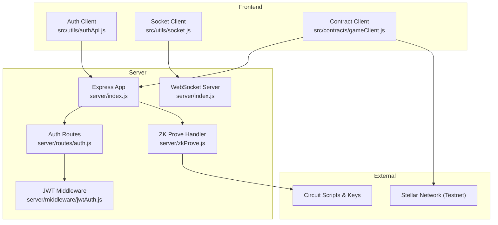
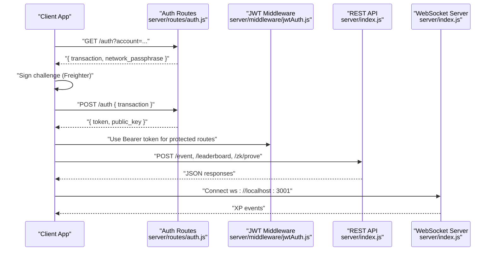
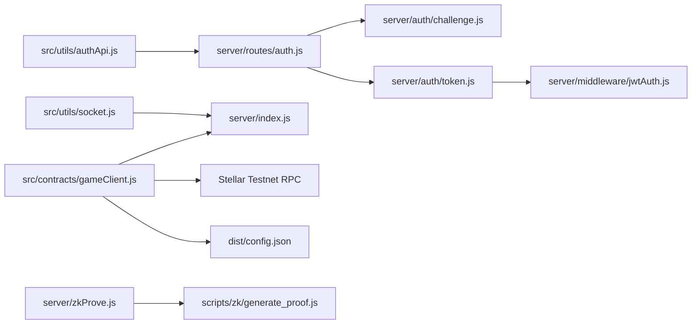

# API Reference

<cite>
**Referenced Files in This Document**
- [server/index.js](file://server/index.js)
- [server/routes/auth.js](file://server/routes/auth.js)
- [server/auth/challenge.js](file://server/auth/challenge.js)
- [server/auth/token.js](file://server/auth/token.js)
- [server/middleware/jwtAuth.js](file://server/middleware/jwtAuth.js)
- [server/zkProve.js](file://server/zkProve.js)
- [src/utils/socket.js](file://src/utils/socket.js)
- [src/utils/authApi.js](file://src/utils/authApi.js)
- [src/contracts/gameClient.js](file://src/contracts/gameClient.js)
- [dist/config.json](file://dist/config.json)
- [public/.well-known/stellar.toml](file://public/.well-known/stellar.toml)
- [server/config/sep10.js](file://server/config/sep10.js)
</cite>

## Table of Contents
1. [Introduction](#introduction)
2. [Project Structure](#project-structure)
3. [Core Components](#core-components)
4. [Architecture Overview](#architecture-overview)
5. [Detailed Component Analysis](#detailed-component-analysis)
6. [Dependency Analysis](#dependency-analysis)
7. [Performance Considerations](#performance-considerations)
8. [Troubleshooting Guide](#troubleshooting-guide)
9. [Conclusion](#conclusion)
10. [Appendices](#appendices)

## Introduction
This document describes Vibe-Coder’s public APIs: REST endpoints for authentication (SEP-10), XP broadcasting via WebSocket, ZK proof generation, leaderboard access, and the Soroban contract API surface used by the game. It covers request/response schemas, authentication methods, error codes, rate limiting, security considerations, CORS configuration, and client integration guidelines.

## Project Structure
The server exposes REST endpoints and a WebSocket server for XP events. Authentication follows SEP-10 standards. ZK proof generation is handled by a dedicated endpoint backed by circuit scripts. The frontend integrates with both REST and WebSocket APIs and interacts with the Soroban contract for ranked submissions and leaderboards.

**Diagram sources**
- [server/index.js](file://server/index.js#L1-L246)
- [server/routes/auth.js](file://server/routes/auth.js#L1-L115)
- [server/middleware/jwtAuth.js](file://server/middleware/jwtAuth.js#L1-L36)
- [server/zkProve.js](file://server/zkProve.js#L1-L68)
- [src/utils/socket.js](file://src/utils/socket.js#L1-L121)
- [src/utils/authApi.js](file://src/utils/authApi.js#L1-L184)
- [src/contracts/gameClient.js](file://src/contracts/gameClient.js#L1-L401)

**Section sources**
- [server/index.js](file://server/index.js#L1-L246)
- [server/routes/auth.js](file://server/routes/auth.js#L1-L115)
- [server/middleware/jwtAuth.js](file://server/middleware/jwtAuth.js#L1-L36)
- [server/zkProve.js](file://server/zkProve.js#L1-L68)
- [src/utils/socket.js](file://src/utils/socket.js#L1-L121)
- [src/utils/authApi.js](file://src/utils/authApi.js#L1-L184)
- [src/contracts/gameClient.js](file://src/contracts/gameClient.js#L1-L401)

## Core Components
- REST API: Authentication (SEP-10), XP broadcasting, ZK proof generation, leaderboard, and progress endpoints.
- WebSocket API: Real-time XP broadcasts to connected clients.
- Soroban Contract API: start_match, submit_result, submit_zk, get_leaderboard, get_leaderboard_by_season.

**Section sources**
- [server/index.js](file://server/index.js#L27-L224)
- [src/contracts/gameClient.js](file://src/contracts/gameClient.js#L76-L327)

## Architecture Overview
The system consists of:
- Express server hosting REST endpoints and a WebSocket server.
- SEP-10 authentication pipeline issuing JWTs.
- ZK proof generation endpoint invoking circuit scripts.
- Frontend clients for authentication, XP streaming, and contract interactions.

**Diagram sources**
- [server/routes/auth.js](file://server/routes/auth.js#L19-L112)
- [server/middleware/jwtAuth.js](file://server/middleware/jwtAuth.js#L9-L35)
- [server/index.js](file://server/index.js#L99-L224)
- [src/utils/socket.js](file://src/utils/socket.js#L18-L104)

## Detailed Component Analysis

### REST Endpoints

#### Authentication (SEP-10)
- Endpoint: GET /auth and POST /auth
- Backward compatibility: GET /auth/challenge and POST /auth/token
- Purpose: Issue signed challenge and verify client-signed challenge to obtain JWT.

- Request
  - GET /auth?account={public_key}
  - POST /auth { transaction: base64_signed_XDR }

- Response
  - GET: { transaction: string, network_passphrase: string }
  - POST: { token: string, public_key: string }

- Headers
  - POST Content-Type: application/json

- Errors
  - 400: Missing or invalid parameters; invalid challenge XDR
  - 404: User not found (GET /auth/me)
  - 401: Missing/invalid/expired Authorization header
  - 503: SEP-10 not configured

- Example
  - GET /auth?account=G... → { transaction, network_passphrase }
  - POST /auth → { token, public_key }

- Notes
  - Client-side helper: getChallenge, postToken, getMe, updateMeUsername.

**Section sources**
- [server/routes/auth.js](file://server/routes/auth.js#L19-L112)
- [server/auth/challenge.js](file://server/auth/challenge.js#L64-L86)
- [server/auth/token.js](file://server/auth/token.js#L29-L79)
- [server/middleware/jwtAuth.js](file://server/middleware/jwtAuth.js#L9-L35)
- [src/utils/authApi.js](file://src/utils/authApi.js#L62-L157)
- [public/.well-known/stellar.toml](file://public/.well-known/stellar.toml#L1-L9)
- [server/config/sep10.js](file://server/config/sep10.js#L76-L86)

#### XP Broadcasting
- Endpoint: POST /event
- Purpose: Broadcast XP events to WebSocket clients with computed XP amounts.

- Request Body
  - type: string (e.g., message, tool_use, task_complete, response, claude_code, codex_cli, gemini_cli, cursor_ai, copilot)
  - data: object (optional)
  - source: string (e.g., claude, codex, gemini, cursor, copilot)

- Response
  - { success: true, xp: number, source: string }

- Validation Rules
  - type defaults to small XP; tool_use adjusts XP based on tool name.
  - Special XP multipliers for specific sources.

- Example
  - POST /event → { success: true, xp: 15, source: "claude" }

**Section sources**
- [server/index.js](file://server/index.js#L99-L113)
- [server/index.js](file://server/index.js#L78-L97)

#### CLI Activity Broadcasting
- Endpoint: POST /cli/:source
- Purpose: Broadcast activity from CLI sources with XP derived from source.

- Path Parameters
  - source: one of claude, codex, gemini, cursor, copilot

- Request Body
  - action: string (optional)
  - data: object (optional)

- Response
  - { success: true, xp: number, source: string }

- Errors
  - 400: Unknown CLI source

**Section sources**
- [server/index.js](file://server/index.js#L115-L125)
- [server/index.js](file://server/index.js#L90-L97)

#### Player Progress
- Endpoint: GET /player/:address/progress
- Purpose: Retrieve saved progress for a Stellar address.

- Path Parameters
  - address: string (trimmed, truncated to 56 chars)

- Response
  - { upgrades, legendaries, highWave: number, highScore: number, saveState, selectedCharacter: string, updatedAt?: number }

- Endpoint: POST /player/:address/progress
- Purpose: Save progress for a Stellar address.

- Request Body
  - upgrades, legendaries, highWave, highScore, saveState, selectedCharacter

- Response
  - { success: true }

- Validation Rules
  - selectedCharacter must be vibecoder, destroyer, or swordsman
  - Numbers sanitized to non-negative integers

**Section sources**
- [server/index.js](file://server/index.js#L129-L154)

#### Leaderboard Access
- Endpoint: GET /leaderboard
- Purpose: Retrieve top 10 leaderboard entries.

- Response
  - { entries: [{ address, wave, score, date }] }

- Endpoint: POST /leaderboard
- Purpose: Submit a ranked entry.

- Request Body
  - address: string
  - wave: number
  - score: number

- Response
  - { success: true, entries: top10 }

- Validation Rules
  - address trimmed and truncated
  - wave, score sanitized to non-negative integers
  - Only beats previous record if score or wave improves

**Section sources**
- [server/index.js](file://server/index.js#L165-L194)

#### ZK Proof Generation
- Endpoint: POST /zk/prove
- Purpose: Generate a Groth16 proof for ranked submission.

- Request Body
  - run_hash_hex: 64-character hex string
  - score: number
  - wave: number
  - nonce: number
  - season_id: number (optional, default 1)

- Response
  - { proof: { a, b, c }, vk: { alpha, beta, gamma, delta, ic }, pub_signals: string[] }

- Errors
  - 400: Missing required fields
  - 500: Proof generation failure

- Notes
  - Requires circuits to be built and keys present.

**Section sources**
- [server/index.js](file://server/index.js#L196-L216)
- [server/zkProve.js](file://server/zkProve.js#L46-L67)

#### Health and 404
- GET /
- GET /health
- 404 Not Found for unknown routes

**Section sources**
- [server/index.js](file://server/index.js#L23-L25)
- [server/index.js](file://server/index.js#L218-L229)

### WebSocket API

#### Connection Handling
- URL: ws://localhost:3001
- Behavior: Connects only on localhost; reconnects automatically after close.
- Events: Custom DOM events dispatched for connection/disconnection.

**Section sources**
- [src/utils/socket.js](file://src/utils/socket.js#L5-L104)

#### Message Formats and Event Types
- Message Type: JSON object
- Fields
  - type: string (e.g., message, tool_use, task_complete, response)
  - amount: number (XP amount)
  - source: string (e.g., claude, codex, gemini, cursor, copilot)
  - sourceName: string (display name)
  - sourceColor: string (hex color)
  - timestamp: number (epoch ms)

- Real-time Interaction Patterns
  - Server broadcasts XP events received via POST /event.
  - Clients parse and apply XP to game state.

**Section sources**
- [server/index.js](file://server/index.js#L63-L76)
- [src/utils/socket.js](file://src/utils/socket.js#L54-L72)

### Soroban Contract API

#### Methods
- start_match(player)
  - Requires wallet signature.
  - Initiates a new match session.

- submit_result(player, wave, score)
  - Requires wallet signature.
  - Casual submission with rule validation (score ≥ wave × MIN_SCORE_PER_WAVE).

- submit_zk(player, proof, vk, pub_signals, nonce, run_hash, season_id, score, wave)
  - Requires wallet signature.
  - ZK-ranked submission with anti-replay nonce and run-hash binding.

- get_leaderboard(limit)
  - Simulated read-only query returning top entries.

- get_leaderboard_by_season(season_id, limit)
  - Simulated read-only query by season.

#### Client Integration
- Contract ID and ZK prover URL are resolved from runtime config.
- Client builds ScVal arguments and invokes transactions.
- Option B: request ZK proof from backend and submit to chain.

**Section sources**
- [src/contracts/gameClient.js](file://src/contracts/gameClient.js#L76-L327)
- [dist/config.json](file://dist/config.json#L1-L7)

## Dependency Analysis

**Diagram sources**
- [src/utils/authApi.js](file://src/utils/authApi.js#L1-L184)
- [server/routes/auth.js](file://server/routes/auth.js#L1-L115)
- [server/auth/challenge.js](file://server/auth/challenge.js#L1-L87)
- [server/auth/token.js](file://server/auth/token.js#L1-L80)
- [server/middleware/jwtAuth.js](file://server/middleware/jwtAuth.js#L1-L36)
- [src/utils/socket.js](file://src/utils/socket.js#L1-L121)
- [server/index.js](file://server/index.js#L1-L246)
- [src/contracts/gameClient.js](file://src/contracts/gameClient.js#L1-L401)
- [dist/config.json](file://dist/config.json#L1-L7)
- [server/zkProve.js](file://server/zkProve.js#L1-L68)

**Section sources**
- [src/utils/authApi.js](file://src/utils/authApi.js#L1-L184)
- [server/routes/auth.js](file://server/routes/auth.js#L1-L115)
- [server/auth/challenge.js](file://server/auth/challenge.js#L1-L87)
- [server/auth/token.js](file://server/auth/token.js#L1-L80)
- [server/middleware/jwtAuth.js](file://server/middleware/jwtAuth.js#L1-L36)
- [src/utils/socket.js](file://src/utils/socket.js#L1-L121)
- [server/index.js](file://server/index.js#L1-L246)
- [src/contracts/gameClient.js](file://src/contracts/gameClient.js#L1-L401)
- [dist/config.json](file://dist/config.json#L1-L7)
- [server/zkProve.js](file://server/zkProve.js#L1-L68)

## Performance Considerations
- WebSocket clients are stored in-memory; consider scaling horizontally with sticky sessions or external pub/sub.
- ZK proof generation is CPU-intensive; ensure adequate timeouts and resource limits.
- Leaderboard sorting is O(n log n) per write; capped to a fixed maximum entries.
- CORS allows GET/POST/OPTIONS with common headers; keep origin wildcard minimal in production deployments.

[No sources needed since this section provides general guidance]

## Troubleshooting Guide
- Authentication
  - Ensure SEP-10 server secret key and JWT secret are configured.
  - Verify WEB_AUTH_ENDPOINT and stellar.toml are reachable.
  - Check Authorization header format for protected routes.

- WebSocket
  - Connection only occurs on localhost; adjust client logic for production.
  - Inspect custom events for connection/disconnection.

- ZK Proving
  - Confirm circuits/build exists and final key is present.
  - Validate run_hash_hex length and numeric inputs.

- Leaderboard
  - Contract ID must be configured; otherwise reads return empty arrays.
  - Ensure at least one submission has been processed on-chain.

**Section sources**
- [server/config/sep10.js](file://server/config/sep10.js#L76-L86)
- [public/.well-known/stellar.toml](file://public/.well-known/stellar.toml#L1-L9)
- [src/utils/socket.js](file://src/utils/socket.js#L18-L104)
- [server/zkProve.js](file://server/zkProve.js#L49-L54)
- [src/contracts/gameClient.js](file://src/contracts/gameClient.js#L278-L327)

## Conclusion
This API reference documents Vibe-Coder’s REST endpoints, WebSocket XP broadcasts, SEP-10 authentication, ZK proof generation, and Soroban contract interactions. Use the provided client helpers and integration patterns to build robust applications that interact securely and efficiently with the platform.

[No sources needed since this section summarizes without analyzing specific files]

## Appendices

### Authentication Methods
- SEP-10 Challenge and Token
  - GET /auth?account=... to receive challenge
  - POST /auth with signed XDR to receive JWT
  - Protected routes require Authorization: Bearer <token>

- Client Helpers
  - getChallenge(account)
  - postToken(signedXdr)
  - getMe()
  - updateMeUsername(username)

**Section sources**
- [server/routes/auth.js](file://server/routes/auth.js#L19-L112)
- [src/utils/authApi.js](file://src/utils/authApi.js#L62-L157)

### CORS Configuration
- Allowed Origins: wildcard
- Allowed Methods: GET, POST, PATCH, OPTIONS
- Allowed Headers: Content-Type, Authorization
- Preflight handled with 200

**Section sources**
- [server/index.js](file://server/index.js#L14-L20)

### Rate Limiting
- No explicit server-side rate limiting observed.
- Consider implementing per-endpoint quotas and sliding window mechanisms in production.

[No sources needed since this section provides general guidance]

### Security Considerations
- Use HTTPS in production; avoid wildcard CORS in untrusted environments.
- Store JWT securely; rotate secrets regularly.
- Validate and sanitize all inputs; enforce numeric bounds.
- For ZK, ensure unique nonces and run-hash binding to prevent replay.

[No sources needed since this section provides general guidance]

### Client Implementation Guidelines
- Use the frontend auth client for SEP-10 flows.
- For XP events, connect to ws://localhost:3001 only in development; implement server-side broadcasting for production.
- For ranked submissions, either generate proofs locally or request them from the backend endpoint.
- Configure contract ID and ZK prover URL via runtime config.

**Section sources**
- [src/utils/authApi.js](file://src/utils/authApi.js#L1-L184)
- [src/utils/socket.js](file://src/utils/socket.js#L1-L121)
- [src/contracts/gameClient.js](file://src/contracts/gameClient.js#L1-L401)
- [dist/config.json](file://dist/config.json#L1-L7)

### Example Requests and Responses
- Authentication
  - GET /auth?account=G... → { transaction, network_passphrase }
  - POST /auth → { token, public_key }

- XP Broadcasting
  - POST /event → { success: true, xp: 15, source: "claude" }

- ZK Proof
  - POST /zk/prove → { proof, vk, pub_signals }

- Leaderboard
  - GET /leaderboard → { entries: [...] }
  - POST /leaderboard → { success: true, entries: [...] }

**Section sources**
- [server/routes/auth.js](file://server/routes/auth.js#L19-L112)
- [server/index.js](file://server/index.js#L99-L113)
- [server/index.js](file://server/index.js#L196-L216)
- [server/index.js](file://server/index.js#L165-L194)