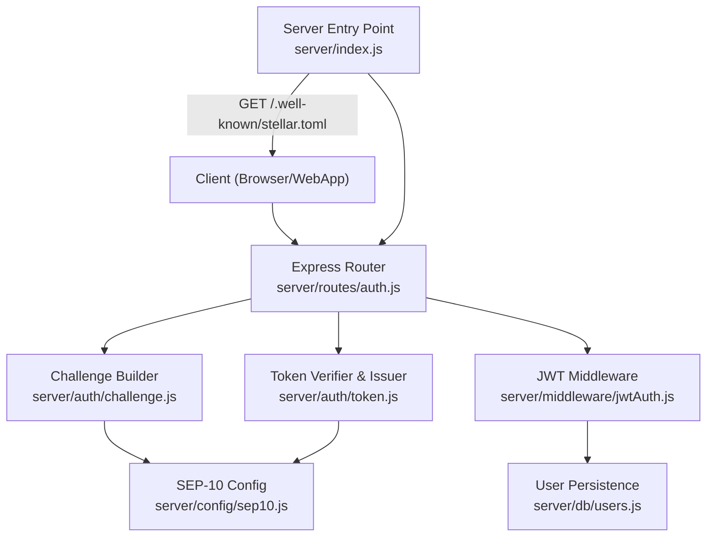
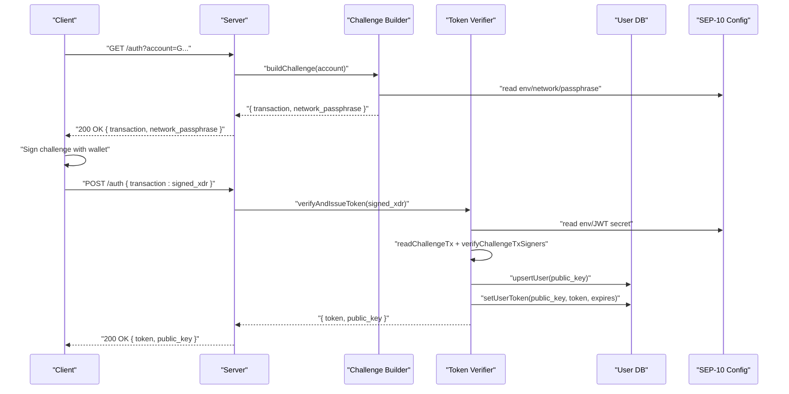
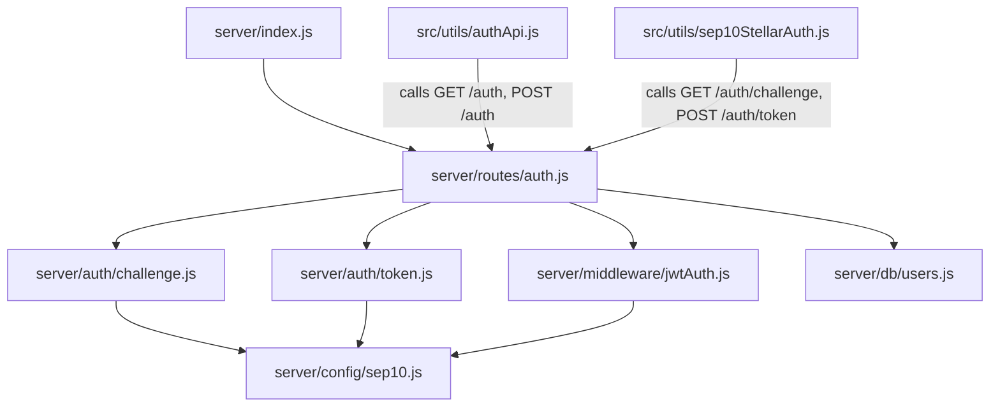

# Authentication Endpoints

<cite>
**Referenced Files in This Document**
- [server/index.js](file://server/index.js)
- [server/routes/auth.js](file://server/routes/auth.js)
- [server/auth/challenge.js](file://server/auth/challenge.js)
- [server/auth/token.js](file://server/auth/token.js)
- [server/middleware/jwtAuth.js](file://server/middleware/jwtAuth.js)
- [server/db/users.js](file://server/db/users.js)
- [server/config/sep10.js](file://server/config/sep10.js)
- [public/.well-known/stellar.toml](file://public/.well-known/stellar.toml)
- [src/utils/authApi.js](file://src/utils/authApi.js)
- [src/utils/sep10StellarAuth.js](file://src/utils/sep10StellarAuth.js)
- [docs/SEP10_AUTH.md](file://docs/SEP10_AUTH.md)
</cite>

## Table of Contents
1. [Introduction](#introduction)
2. [Project Structure](#project-structure)
3. [Core Components](#core-components)
4. [Architecture Overview](#architecture-overview)
5. [Detailed Component Analysis](#detailed-component-analysis)
6. [Dependency Analysis](#dependency-analysis)
7. [Performance Considerations](#performance-considerations)
8. [Troubleshooting Guide](#troubleshooting-guide)
9. [Conclusion](#conclusion)
10. [Appendices](#appendices)

## Introduction
This document provides comprehensive API documentation for Vibe-Coder’s authentication endpoints, focusing on wallet-based authentication using Stellar’s SEP-10 standard. It covers:
- GET /auth/challenge for obtaining authentication challenges
- POST /auth/token for exchanging challenges with signatures
- GET /auth/me and PATCH /auth/me/username for user profile management
- SEP-10 compliant stellar.toml endpoint at /.well-known/stellar.toml

It includes request parameters, response schemas, error handling, JWT token structure, expiration handling, practical authentication flows, and security considerations.

## Project Structure
The authentication system spans server-side route handlers, middleware, configuration, database utilities, and client-side helpers. The server exposes:
- Auth routes under /auth
- A stellar.toml discovery endpoint at /.well-known/stellar.toml

**Diagram sources**
- [server/index.js](file://server/index.js#L27-L51)
- [server/routes/auth.js](file://server/routes/auth.js#L10-L17)
- [server/auth/challenge.js](file://server/auth/challenge.js#L15-L21)
- [server/auth/token.js](file://server/auth/token.js#L9-L16)
- [server/middleware/jwtAuth.js](file://server/middleware/jwtAuth.js#L6-L7)
- [server/db/users.js](file://server/db/users.js#L6-L7)
- [server/config/sep10.js](file://server/config/sep10.js#L13-L86)

**Section sources**
- [server/index.js](file://server/index.js#L27-L51)
- [server/routes/auth.js](file://server/routes/auth.js#L10-L17)

## Core Components
- Auth routes: Provide standard SEP-10 endpoints and backward-compatible alternatives, plus protected user endpoints.
- Challenge builder: Generates a server-signed challenge transaction with Manage Data operations and timebounds.
- Token verifier: Validates the signed challenge against server configuration and issues a JWT.
- JWT middleware: Protects endpoints by verifying Authorization headers and decoding JWT claims.
- User persistence: Upserts users and stores JWT metadata for audit/session tracking.
- SEP-10 configuration: Centralizes environment-driven settings for challenge, network, and JWT behavior.
- stellar.toml: Dynamically generates TOML for wallet discovery with SIGNING_KEY and WEB_AUTH_ENDPOINT.

**Section sources**
- [server/routes/auth.js](file://server/routes/auth.js#L10-L114)
- [server/auth/challenge.js](file://server/auth/challenge.js#L27-L86)
- [server/auth/token.js](file://server/auth/token.js#L29-L79)
- [server/middleware/jwtAuth.js](file://server/middleware/jwtAuth.js#L9-L35)
- [server/db/users.js](file://server/db/users.js#L53-L180)
- [server/config/sep10.js](file://server/config/sep10.js#L18-L86)
- [server/index.js](file://server/index.js#L30-L51)

## Architecture Overview
The authentication flow is SEP-10 compliant and consists of:
1. Client requests a challenge with the intended Stellar account.
2. Server responds with a challenge transaction and network passphrase.
3. Client signs the challenge with a wallet (e.g., Freighter) and submits the signed XDR.
4. Server validates the challenge and issues a JWT.
5. Client stores the JWT and uses it for protected endpoints.

**Diagram sources**
- [server/routes/auth.js](file://server/routes/auth.js#L19-L55)
- [server/auth/challenge.js](file://server/auth/challenge.js#L64-L86)
- [server/auth/token.js](file://server/auth/token.js#L29-L79)
- [server/db/users.js](file://server/db/users.js#L53-L94)
- [server/config/sep10.js](file://server/config/sep10.js#L77-L86)

## Detailed Component Analysis

### GET /auth/challenge
Purpose: Obtain a SEP-10 challenge transaction for the given Stellar account.

- Path: GET /auth?account={publicKey} or GET /auth/challenge?account={publicKey}
- Query parameters:
  - account (required): Stellar public key (G... or M...). Validation ensures it starts with G or M.
- Response schema:
  - transaction: Base64-encoded XDR of the challenge transaction envelope.
  - network_passphrase: Network passphrase used when building the challenge.
- Error handling:
  - 400: Missing or invalid account parameter.
  - 400: Invalid request during challenge creation (e.g., malformed account).
  - 503: SEP-10 auth is not configured (missing server secret or JWT secret).
- Backward compatibility:
  - Also exposed under /auth/challenge for older clients.

Security considerations:
- The challenge includes Manage Data operations for home domain and web auth domain, and enforces timebounds and server signature.

**Section sources**
- [server/routes/auth.js](file://server/routes/auth.js#L19-L33)
- [server/auth/challenge.js](file://server/auth/challenge.js#L64-L86)
- [server/config/sep10.js](file://server/config/sep10.js#L84-L86)

### POST /auth/token
Purpose: Exchange a signed challenge XDR for a JWT.

- Path: POST /auth or POST /auth/token
- Request body (JSON):
  - transaction (required): Base64-encoded XDR of the signed challenge.
  - Alternative: transaction_xdr (alias).
- Required headers:
  - Content-Type: application/json
- Response schema:
  - token: JWT string.
  - public_key: The Stellar public key that controls the account.
- Error handling:
  - 400: Missing or invalid transaction; includes a hint with expected body format.
  - 400: Invalid challenge (malformed XDR or mismatched domain/network).
  - 400: Signature verification failed (client did not sign or modified transaction).
  - 503: SEP-10 auth is not configured.
- JWT structure and expiration:
  - Issued by the server using HS256 with JWT_SECRET.
  - Claims include subject (public_key), issued at (iat), expiration (exp), and issuer (iss).
  - Expiration controlled by JWT_EXPIRY_SEC (default 24 hours).
- Post-processing:
  - Upserts user record and stores JWT with expiration for audit/session tracking.

**Section sources**
- [server/routes/auth.js](file://server/routes/auth.js#L35-L55)
- [server/auth/token.js](file://server/auth/token.js#L29-L79)
- [server/db/users.js](file://server/db/users.js#L53-L94)
- [server/config/sep10.js](file://server/config/sep10.js#L73-L74)

### GET /auth/me
Purpose: Retrieve the authenticated user’s profile.

- Path: GET /auth/me
- Authentication:
  - Authorization: Bearer <JWT>
  - JWT verified by middleware; requires valid signature and non-expired token.
- Response schema:
  - public_key: Stellar public key.
  - username: Nullable username.
  - created_at: ISO timestamp.
  - updated_at: ISO timestamp.
- Error handling:
  - 401: Missing or invalid Authorization header, invalid/expired token, or auth not configured.
  - 404: User not found in database.
  - 500: Internal server error.

**Section sources**
- [server/routes/auth.js](file://server/routes/auth.js#L78-L94)
- [server/middleware/jwtAuth.js](file://server/middleware/jwtAuth.js#L9-L35)
- [server/db/users.js](file://server/db/users.js#L28-L51)

### PATCH /auth/me/username
Purpose: Set or update the user’s username.

- Path: PATCH /auth/me/username
- Authentication:
  - Authorization: Bearer <JWT>
- Request body (JSON):
  - username: String, trimmed and limited to 64 characters.
- Response schema:
  - public_key: Stellar public key.
  - username: Updated username or null.
  - updated_at: ISO timestamp.
- Error handling:
  - 401: Missing or invalid Authorization header, invalid/expired token, or auth not configured.
  - 404: User not found in database.
  - 500: Internal server error.

**Section sources**
- [server/routes/auth.js](file://server/routes/auth.js#L96-L112)
- [server/middleware/jwtAuth.js](file://server/middleware/jwtAuth.js#L9-L35)
- [server/db/users.js](file://server/db/users.js#L96-L125)

### /.well-known/stellar.toml
Purpose: Provide wallet discovery configuration for SEP-10.

- Path: GET /.well-known/stellar.toml
- Behavior:
  - Dynamically generated using server configuration.
  - Includes VERSION, NETWORK_PASSPHRASE, SIGNING_KEY, and WEB_AUTH_ENDPOINT.
  - WEB_AUTH_ENDPOINT points to the standard SEP-10 auth path (/auth).
- Error handling:
  - 503: SEP-10 auth is not configured.
  - 500: Invalid server signing key configuration.

**Section sources**
- [server/index.js](file://server/index.js#L30-L51)
- [server/config/sep10.js](file://server/config/sep10.js#L77-L86)
- [public/.well-known/stellar.toml](file://public/.well-known/stellar.toml#L1-L9)

## Dependency Analysis
The authentication system integrates several modules and configurations:

**Diagram sources**
- [server/routes/auth.js](file://server/routes/auth.js#L10-L17)
- [server/auth/challenge.js](file://server/auth/challenge.js#L15-L21)
- [server/auth/token.js](file://server/auth/token.js#L9-L16)
- [server/middleware/jwtAuth.js](file://server/middleware/jwtAuth.js#L6-L7)
- [server/db/users.js](file://server/db/users.js#L6-L7)
- [server/config/sep10.js](file://server/config/sep10.js#L13-L86)
- [server/index.js](file://server/index.js#L27-L51)
- [src/utils/authApi.js](file://src/utils/authApi.js#L62-L111)
- [src/utils/sep10StellarAuth.js](file://src/utils/sep10StellarAuth.js#L65-L164)

**Section sources**
- [server/routes/auth.js](file://server/routes/auth.js#L10-L17)
- [server/auth/challenge.js](file://server/auth/challenge.js#L15-L21)
- [server/auth/token.js](file://server/auth/token.js#L9-L16)
- [server/middleware/jwtAuth.js](file://server/middleware/jwtAuth.js#L6-L7)
- [server/db/users.js](file://server/db/users.js#L6-L7)
- [server/config/sep10.js](file://server/config/sep10.js#L13-L86)
- [server/index.js](file://server/index.js#L27-L51)
- [src/utils/authApi.js](file://src/utils/authApi.js#L62-L111)
- [src/utils/sep10StellarAuth.js](file://src/utils/sep10StellarAuth.js#L65-L164)

## Performance Considerations
- Challenge and token operations rely on cryptographic primitives and Stellar SDK verification. Keep network_passphrase and home/web auth domains consistent to avoid repeated rejections.
- JWT expiry is configurable; shorter expirations reduce risk but increase login frequency.
- Database operations (upsert and update) are lightweight; ensure database connectivity is reliable for production deployments.

[No sources needed since this section provides general guidance]

## Troubleshooting Guide
Common issues and resolutions:
- POST /auth/token returns 400 with a JSON error:
  - Ensure the request body is JSON with transaction (or transaction_xdr) and Content-Type: application/json.
  - Confirm the signed XDR originates from the same account used for GET /auth?account=... and matches the server’s network passphrase and home/web auth domains.
  - Verify the same backend instance that served the challenge handles the token request.
- Token verification failures:
  - The client must sign the challenge with the intended account; any modification invalidates verification.
- Authorization header issues:
  - Ensure Authorization: Bearer <JWT> is present for protected endpoints; tokens expire and require re-authentication.
- stellar.toml not loading:
  - Confirm server is configured with a valid server secret key and that WEB_AUTH_DOMAIN resolves to the same service.

**Section sources**
- [docs/SEP10_AUTH.md](file://docs/SEP10_AUTH.md#L84-L106)
- [server/routes/auth.js](file://server/routes/auth.js#L35-L55)
- [server/middleware/jwtAuth.js](file://server/middleware/jwtAuth.js#L9-L35)

## Conclusion
Vibe-Coder’s authentication system implements a robust, SEP-10-compliant flow for wallet-based login. It provides standardized endpoints for challenges and token issuance, protected user endpoints, and dynamic wallet discovery via stellar.toml. By adhering to the documented request/response schemas, error handling, and security practices, developers can integrate secure and seamless wallet authentication into their applications.

[No sources needed since this section summarizes without analyzing specific files]

## Appendices

### Practical Authentication Flows
- Standard flow:
  - GET /auth?account={publicKey} → receive challenge XDR and network passphrase
  - Sign challenge with wallet → POST /auth with signed XDR → receive JWT
  - Use JWT in Authorization: Bearer <token> for protected endpoints
- Backward compatibility:
  - Older clients can use GET /auth/challenge and POST /auth/token
- Wallet discovery:
  - Serve /.well-known/stellar.toml with SIGNING_KEY and WEB_AUTH_ENDPOINT

**Section sources**
- [server/routes/auth.js](file://server/routes/auth.js#L57-L76)
- [server/index.js](file://server/index.js#L30-L51)
- [docs/SEP10_AUTH.md](file://docs/SEP10_AUTH.md#L8-L28)

### Client-Side Utilities
- Client utilities provide helper functions for challenge retrieval, token submission, profile retrieval, username updates, and automatic JWT storage/retrieval.
- Demo utilities demonstrate end-to-end login using Freighter and show typical error messages and debugging steps.

**Section sources**
- [src/utils/authApi.js](file://src/utils/authApi.js#L62-L183)
- [src/utils/sep10StellarAuth.js](file://src/utils/sep10StellarAuth.js#L65-L164)