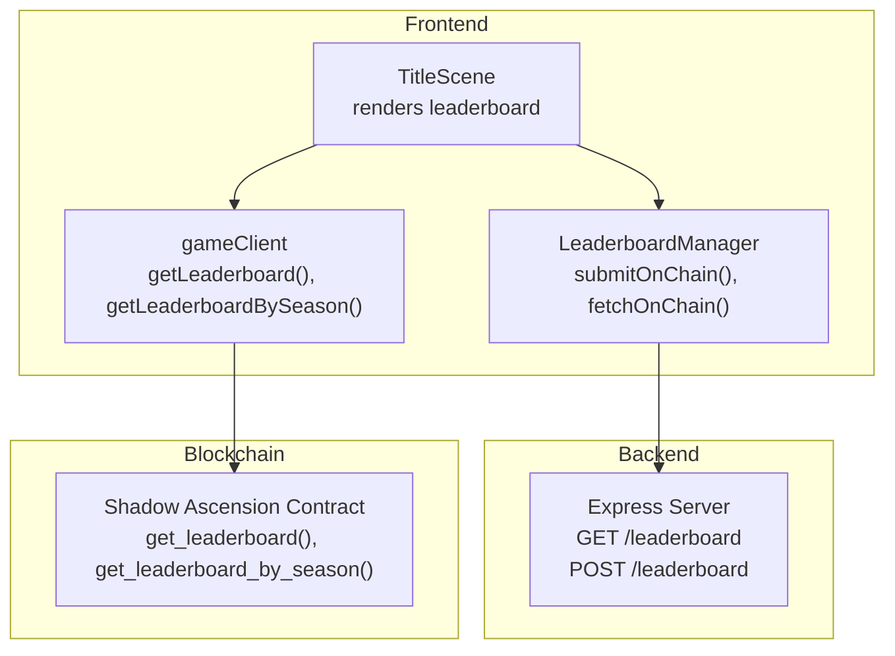
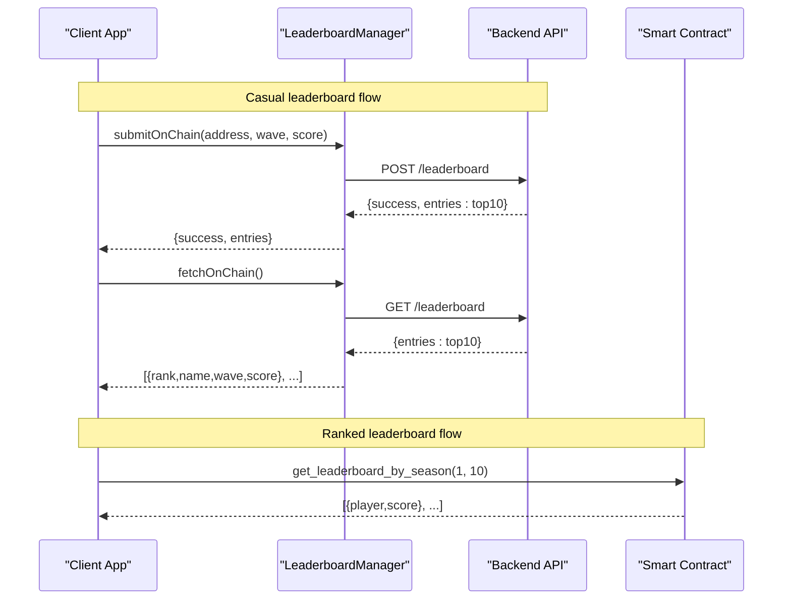
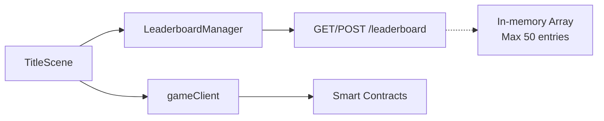

# Leaderboard Management Endpoints

<cite>
**Referenced Files in This Document**
- [server/index.js](file://server/index.js)
- [src/systems/LeaderboardManager.js](file://src/systems/LeaderboardManager.js)
- [src/contracts/gameClient.js](file://src/contracts/gameClient.js)
- [src/scenes/TitleScene.js](file://src/scenes/TitleScene.js)
- [.env](file://.env)
- [.env.example](file://.env.example)
</cite>

## Table of Contents
1. [Introduction](#introduction)
2. [Project Structure](#project-structure)
3. [Core Components](#core-components)
4. [Architecture Overview](#architecture-overview)
5. [Detailed Component Analysis](#detailed-component-analysis)
6. [Dependency Analysis](#dependency-analysis)
7. [Performance Considerations](#performance-considerations)
8. [Troubleshooting Guide](#troubleshooting-guide)
9. [Conclusion](#conclusion)

## Introduction
This document provides comprehensive API documentation for Vibe-Coder's leaderboard management endpoints. It covers:
- GET /leaderboard: retrieving top leaderboard entries with pagination and sorting behavior
- POST /leaderboard: submitting scores with validation rules
- Ranking algorithm: score priority, wave tiebreaker, timestamp fallback
- Leaderboard size limits, duplicate handling, and update logic
- Examples of queries, submissions, and edge cases

The backend implementation is contained in the server module, while the frontend integrates with both the on-chain ranked leaderboard (via smart contracts) and the legacy on-chain casual leaderboard API.

## Project Structure
The leaderboard functionality spans the backend server and frontend systems:
- Backend: Express server exposes GET and POST leaderboard endpoints
- Frontend: LeaderboardManager handles on-chain API interactions and local fallback
- Smart contracts: Provide ranked leaderboard via get_leaderboard_by_season and legacy get_leaderboard

**Diagram sources**
- [server/index.js](file://server/index.js#L156-L194)
- [src/systems/LeaderboardManager.js](file://src/systems/LeaderboardManager.js#L18-L120)
- [src/contracts/gameClient.js](file://src/contracts/gameClient.js#L275-L368)
- [src/scenes/TitleScene.js](file://src/scenes/TitleScene.js#L2240-L2259)

**Section sources**
- [server/index.js](file://server/index.js#L156-L194)
- [src/systems/LeaderboardManager.js](file://src/systems/LeaderboardManager.js#L1-L135)
- [src/contracts/gameClient.js](file://src/contracts/gameClient.js#L275-L368)
- [src/scenes/TitleScene.js](file://src/scenes/TitleScene.js#L2240-L2259)

## Core Components
- Backend leaderboard endpoints
  - GET /leaderboard returns top 10 entries
  - POST /leaderboard accepts address, wave, score; validates and updates the leaderboard
- Frontend leaderboard integrations
  - LeaderboardManager: on-chain API client and local fallback
  - gameClient: reads ranked and legacy leaderboards from smart contracts
  - TitleScene: renders combined leaderboard data

Key behaviors:
- Sorting criteria: score desc, wave desc, timestamp desc
- Pagination: top 10 returned on GET
- Size limits: internal storage capped at 50 entries; display capped at 10
- Duplicate handling: per-address updates only when score or wave improves

**Section sources**
- [server/index.js](file://server/index.js#L156-L194)
- [src/systems/LeaderboardManager.js](file://src/systems/LeaderboardManager.js#L18-L120)
- [src/contracts/gameClient.js](file://src/contracts/gameClient.js#L275-L368)
- [src/scenes/TitleScene.js](file://src/scenes/TitleScene.js#L2240-L2259)

## Architecture Overview
The leaderboard architecture supports both casual and ranked modes:
- Casual leaderboard: backend-managed entries via POST /leaderboard and retrieval via GET /leaderboard
- Ranked leaderboard: on-chain via smart contracts; accessed via gameClient functions

**Diagram sources**
- [src/systems/LeaderboardManager.js](file://src/systems/LeaderboardManager.js#L81-L120)
- [server/index.js](file://server/index.js#L165-L194)
- [src/contracts/gameClient.js](file://src/contracts/gameClient.js#L333-L368)

## Detailed Component Analysis

### GET /leaderboard
Purpose:
- Retrieve the current top leaderboard entries

Behavior:
- Returns top 10 entries sorted by score descending, then wave descending, then timestamp descending
- Uses an internal array with a maximum size of 50 entries; display is capped at 10

Response format:
- entries: array of objects with keys address, wave, score, date

Notes:
- Timestamp is used as a tiebreaker when score and wave are equal
- The endpoint does not accept query parameters for pagination; display limit is fixed at 10

**Section sources**
- [server/index.js](file://server/index.js#L156-L168)

### POST /leaderboard
Purpose:
- Submit a score for a given Stellar address

Validation rules:
- address: required, trimmed, limited to 56 characters
- wave: required, numeric, floored and forced to be non-negative
- score: required, numeric, floored and forced to be non-negative

Duplicate handling and update logic:
- If an entry for the address exists:
  - If the new score is less than or equal to the stored score AND the new wave is less than or equal to the stored wave, no update occurs
  - Otherwise, the existing entry is replaced with the new one
- If no entry exists for the address, a new entry is inserted
- After insertion/update, the leaderboard is sorted and truncated to 50 entries maximum
- The response returns the top 10 entries

Error handling:
- Returns 400 Bad Request if any required field is missing or invalid

**Section sources**
- [server/index.js](file://server/index.js#L170-L194)

### Ranking Algorithm
Sorting priority:
1. Primary: score (higher is better)
2. Secondary: wave (higher is better)
3. Tertiary: timestamp (more recent is better)

Implementation:
- The backend maintains an in-memory array and sorts using a comparator that applies the above priorities
- The frontend on-chain API client transforms returned entries into a display-friendly structure with rank, name, wave, and score

Edge cases:
- Tied scores: wave determines rank
- Tied scores and waves: newer timestamp ranks higher
- No timestamp present: treated as 0 for comparison

**Section sources**
- [server/index.js](file://server/index.js#L159-L163)
- [src/systems/LeaderboardManager.js](file://src/systems/LeaderboardManager.js#L105-L120)

### Frontend Integration
- LeaderboardManager:
  - submitOnChain: posts to the backend leaderboard API
  - fetchOnChain: retrieves top entries from the backend leaderboard API
- gameClient:
  - getLeaderboard: legacy leaderboard (casual)
  - getLeaderboardBySeason: ranked leaderboard (ZK runs)
- TitleScene:
  - Renders combined leaderboard data, preferring ranked entries when available

Environment configuration:
- VITE_LEADERBOARD_URL controls the base URL for the leaderboard API
- Defaults to localhost:3333 when not set

**Section sources**
- [src/systems/LeaderboardManager.js](file://src/systems/LeaderboardManager.js#L9-L11)
- [src/contracts/gameClient.js](file://src/contracts/gameClient.js#L275-L368)
- [src/scenes/TitleScene.js](file://src/scenes/TitleScene.js#L2240-L2259)
- [.env](file://.env#L4-L4)
- [.env.example](file://.env.example#L12-L13)

## Dependency Analysis
The leaderboard system has clear separation of concerns:
- Backend: pure in-memory leaderboard with fixed-size cap and deterministic sorting
- Frontend: dual-path integration supporting both casual and ranked leaderboards
- Smart contracts: provide ranked leaderboard data for on-chain verification

**Diagram sources**
- [src/systems/LeaderboardManager.js](file://src/systems/LeaderboardManager.js#L81-L120)
- [server/index.js](file://server/index.js#L156-L194)
- [src/contracts/gameClient.js](file://src/contracts/gameClient.js#L275-L368)
- [src/scenes/TitleScene.js](file://src/scenes/TitleScene.js#L2240-L2259)

**Section sources**
- [server/index.js](file://server/index.js#L156-L194)
- [src/systems/LeaderboardManager.js](file://src/systems/LeaderboardManager.js#L18-L120)
- [src/contracts/gameClient.js](file://src/contracts/gameClient.js#L275-L368)
- [src/scenes/TitleScene.js](file://src/scenes/TitleScene.js#L2240-L2259)

## Performance Considerations
- Sorting complexity: O(n log n) per update due to comparator-based sort
- Storage: in-memory array; bounded by 50 entries
- Network: POST /leaderboard returns top 10 entries; GET /leaderboard returns top 10
- Recommendations:
  - For high-frequency submissions, consider persistence and indexing
  - Offload sorting to database with composite indexes on (score, wave, timestamp)
  - Cache frequently accessed top entries

[No sources needed since this section provides general guidance]

## Troubleshooting Guide
Common issues and resolutions:
- Invalid submission payload:
  - Ensure address, wave, and score are provided and valid
  - Address is trimmed and limited to 56 characters
- No leaderboard entries returned:
  - Verify the backend is running and reachable
  - Confirm VITE_LEADERBOARD_URL is correctly set in the frontend
- Tied scores and unexpected rank:
  - Remember wave is the tiebreaker; if equal, timestamp determines order
- Wallet connected but no ranked entries:
  - Ensure smart contract is configured and prover is available for ZK submissions

**Section sources**
- [server/index.js](file://server/index.js#L170-L174)
- [src/systems/LeaderboardManager.js](file://src/systems/LeaderboardManager.js#L81-L99)
- [.env.example](file://.env.example#L12-L13)

## Conclusion
Vibe-Coder's leaderboard system provides a robust foundation for both casual and ranked competition:
- Casual mode: simple, fast, and deterministic sorting with clear size limits
- Ranked mode: on-chain verification via ZK for provable fairness
- Frontend seamlessly integrates both modes, prioritizing ranked data when available

Future enhancements could include persistent storage, richer sorting options, and expanded pagination for the GET endpoint.