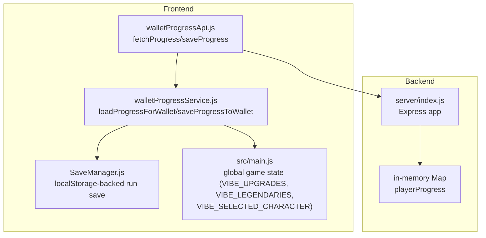
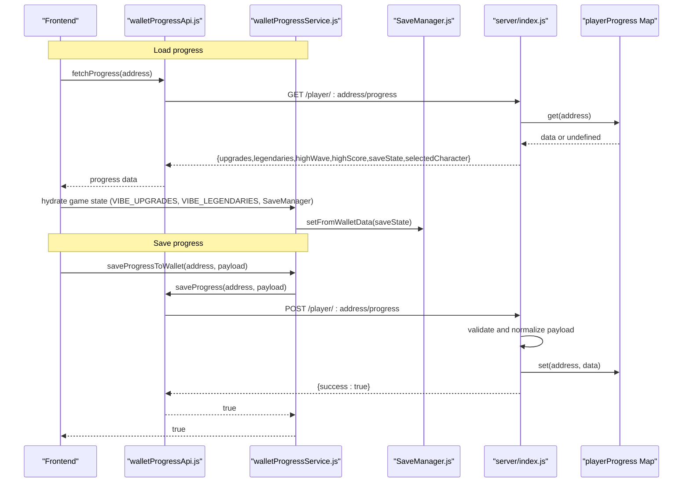
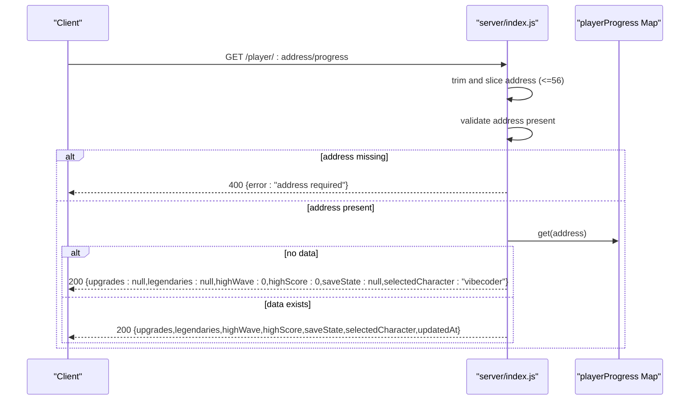
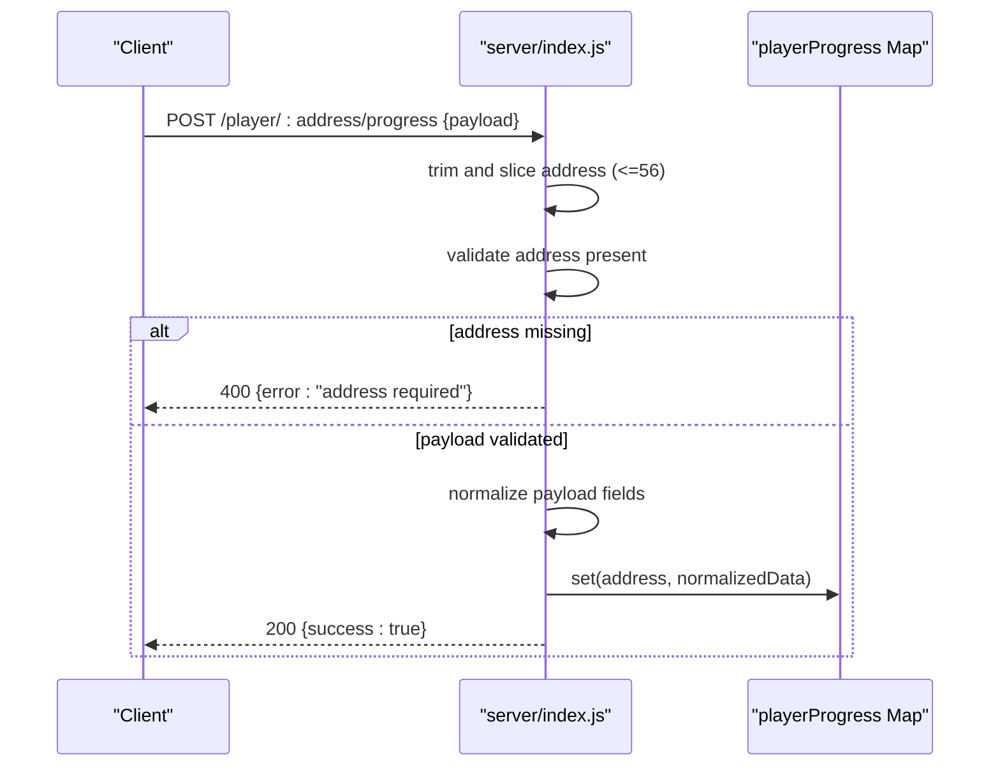
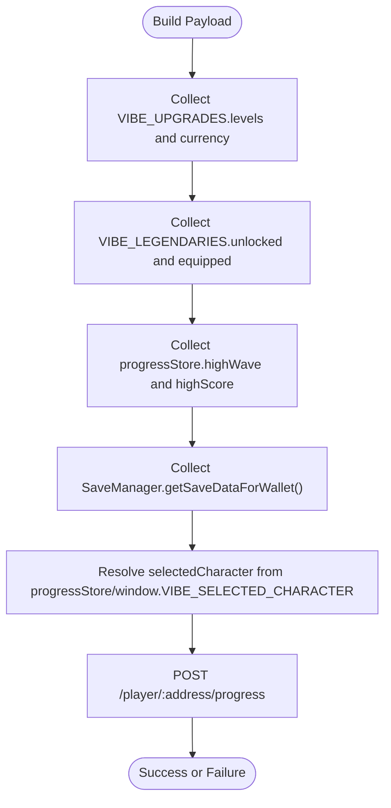
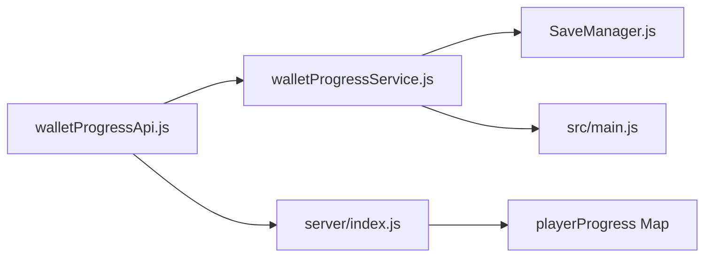

# Progress Persistence Endpoints

<cite>
**Referenced Files in This Document**
- [server/index.js](file://server/index.js)
- [src/utils/walletProgressApi.js](file://src/utils/walletProgressApi.js)
- [src/utils/walletProgressService.js](file://src/utils/walletProgressService.js)
- [src/systems/SaveManager.js](file://src/systems/SaveManager.js)
- [src/main.js](file://src/main.js)
- [.env](file://.env)
- [.env.example](file://.env.example)
</cite>

## Table of Contents
1. [Introduction](#introduction)
2. [Project Structure](#project-structure)
3. [Core Components](#core-components)
4. [Architecture Overview](#architecture-overview)
5. [Detailed Component Analysis](#detailed-component-analysis)
6. [Dependency Analysis](#dependency-analysis)
7. [Performance Considerations](#performance-considerations)
8. [Troubleshooting Guide](#troubleshooting-guide)
9. [Conclusion](#conclusion)

## Introduction
This document provides comprehensive API documentation for Vibe-Coder’s progress persistence endpoints. It covers:
- Retrieval of player progress via GET /player/:address/progress
- Saving player progress via POST /player/:address/progress
- Request/response schemas, validation rules, and constraints
- Temporary in-memory storage and data persistence considerations
- Examples of valid payloads and typical validation scenarios
- Error handling behavior for invalid submissions

These endpoints enable wallet-backed progress persistence keyed by a Stellar wallet address, allowing players to seamlessly continue their upgrades, legendaries, high scores, and saved runs across sessions.

## Project Structure
The progress persistence feature spans the backend server and the frontend client:
- Backend: Express server exposes two endpoints for progress retrieval and saving
- Frontend: Utilities to fetch/save progress and integrate with the game state and SaveManager

**Diagram sources**
- [server/index.js](file://server/index.js#L127-L154)
- [src/utils/walletProgressApi.js](file://src/utils/walletProgressApi.js#L1-L45)
- [src/utils/walletProgressService.js](file://src/utils/walletProgressService.js#L1-L140)
- [src/systems/SaveManager.js](file://src/systems/SaveManager.js#L1-L187)
- [src/main.js](file://src/main.js#L40-L230)

**Section sources**
- [server/index.js](file://server/index.js#L127-L154)
- [src/utils/walletProgressApi.js](file://src/utils/walletProgressApi.js#L1-L45)
- [src/utils/walletProgressService.js](file://src/utils/walletProgressService.js#L1-L140)
- [src/systems/SaveManager.js](file://src/systems/SaveManager.js#L1-L187)
- [src/main.js](file://src/main.js#L40-L230)

## Core Components
- GET /player/:address/progress
  - Purpose: Retrieve a player’s progress by wallet address
  - Behavior: Returns stored progress or defaults if none exists
- POST /player/:address/progress
  - Purpose: Save a player’s progress payload
  - Behavior: Validates and normalizes fields, stores in memory, and returns success

Both endpoints operate on a wallet-address-keyed in-memory store on the server.

**Section sources**
- [server/index.js](file://server/index.js#L129-L154)

## Architecture Overview
The progress persistence architecture consists of:
- Client-side utilities that construct and send requests to the backend
- Backend endpoints that validate and normalize incoming data
- In-memory storage keyed by wallet address
- Integration with global game state and run save persistence

**Diagram sources**
- [src/utils/walletProgressApi.js](file://src/utils/walletProgressApi.js#L15-L45)
- [src/utils/walletProgressService.js](file://src/utils/walletProgressService.js#L22-L84)
- [src/systems/SaveManager.js](file://src/systems/SaveManager.js#L107-L128)
- [server/index.js](file://server/index.js#L129-L154)

## Detailed Component Analysis

### GET /player/:address/progress
- Endpoint: GET /player/:address/progress
- Path parameter:
  - address: string (trimmed, truncated to 56 characters)
- Validation:
  - If address is missing or empty, returns 400 with error
- Response:
  - If no data found for address: returns default object with null upgrades/legendaries/saveState and zeros for highWave/highScore, default selectedCharacter
  - If data exists: returns stored object
- Response schema:
  - upgrades: object or null
  - legendaries: object or null
  - highWave: number (non-negative integer)
  - highScore: number (non-negative integer)
  - saveState: object or null
  - selectedCharacter: one of vibecoder, destroyer, swordsman
  - updatedAt: number (timestamp) — present on saved records

**Diagram sources**
- [server/index.js](file://server/index.js#L129-L135)

**Section sources**
- [server/index.js](file://server/index.js#L129-L135)

### POST /player/:address/progress
- Endpoint: POST /player/:address/progress
- Path parameter:
  - address: string (trimmed, truncated to 56 characters)
- Request body schema:
  - upgrades: object or null
  - legendaries: object or null
  - highWave: number (converted to non-negative integer)
  - highScore: number (converted to non-negative integer)
  - saveState: object or null
  - selectedCharacter: string constrained to vibecoder, destroyer, swordsman
- Validation and normalization:
  - address required; otherwise 400
  - upgrades/legendaries/saveState coerced to object or null
  - highWave/highScore coerced to integers >= 0
  - selectedCharacter coerced to one of the allowed values, default vibecoder
  - updatedAt timestamp added on save
- Response:
  - 200 {success:true}

**Diagram sources**
- [server/index.js](file://server/index.js#L137-L154)

**Section sources**
- [server/index.js](file://server/index.js#L137-L154)

### Frontend Integration and Payload Construction
- Fetch progress:
  - walletProgressApi.fetchProgress(address) constructs GET /player/:address/progress and returns parsed JSON
- Save progress:
  - walletProgressApi.saveProgress(address, payload) sends POST with JSON body
  - walletProgressService.saveProgressToWallet(address, extra?) builds payload from:
    - VIBE_UPGRADES (levels, currency)
    - VIBE_LEGENDARIES (unlocked, equipped)
    - progressStore (highWave, highScore)
    - SaveManager.getSaveDataForWallet() (run save)
    - selectedCharacter (from progressStore or window.VIBE_SELECTED_CHARACTER)
- Environment configuration:
  - VITE_PROGRESS_API_URL or VITE_ZK_PROVER_URL can override default localhost:3333

**Diagram sources**
- [src/utils/walletProgressService.js](file://src/utils/walletProgressService.js#L66-L84)
- [src/systems/SaveManager.js](file://src/systems/SaveManager.js#L120-L128)
- [src/main.js](file://src/main.js#L40-L230)
- [.env.example](file://.env.example#L12-L13)
- [.env](file://.env#L4)

**Section sources**
- [src/utils/walletProgressApi.js](file://src/utils/walletProgressApi.js#L15-L45)
- [src/utils/walletProgressService.js](file://src/utils/walletProgressService.js#L66-L84)
- [src/systems/SaveManager.js](file://src/systems/SaveManager.js#L120-L128)
- [src/main.js](file://src/main.js#L40-L230)
- [.env.example](file://.env.example#L12-L13)
- [.env](file://.env#L4)

## Dependency Analysis
- Backend dependencies:
  - Express app handles CORS and JSON parsing
  - playerProgress Map stores data in-memory
- Frontend dependencies:
  - walletProgressApi uses environment-configurable base URL
  - walletProgressService orchestrates hydration and persistence
  - SaveManager persists run state to localStorage and integrates with wallet-backed progress

**Diagram sources**
- [src/utils/walletProgressApi.js](file://src/utils/walletProgressApi.js#L1-L45)
- [src/utils/walletProgressService.js](file://src/utils/walletProgressService.js#L1-L140)
- [src/systems/SaveManager.js](file://src/systems/SaveManager.js#L1-L187)
- [server/index.js](file://server/index.js#L127-L154)

**Section sources**
- [server/index.js](file://server/index.js#L127-L154)
- [src/utils/walletProgressApi.js](file://src/utils/walletProgressApi.js#L1-L45)
- [src/utils/walletProgressService.js](file://src/utils/walletProgressService.js#L1-L140)
- [src/systems/SaveManager.js](file://src/systems/SaveManager.js#L1-L187)

## Performance Considerations
- In-memory storage:
  - playerProgress is a Map; lookups and updates are O(1) average
  - No persistence across restarts; data is lost when the server restarts
- Payload size:
  - Maximum JSON body size is 512kb (configured in middleware)
  - Upgrades and legendaries are objects; saveState can be substantial depending on run data
- Recommendations:
  - Keep payload minimal by sending only changed fields when feasible
  - Avoid unnecessary frequent saves; batch changes where possible
  - Monitor server memory usage if many concurrent players are expected

[No sources needed since this section provides general guidance]

## Troubleshooting Guide
Common issues and resolutions:
- Missing address parameter
  - Symptom: 400 error with “address required”
  - Resolution: Ensure address is provided and non-empty
- Invalid or malformed request body
  - Symptom: Unexpected nulls or defaults returned
  - Resolution: Verify field types and shapes; see Request Body Schema below
- Character selection constraint
  - Symptom: selectedCharacter resets to vibecoder
  - Resolution: Provide one of vibecoder, destroyer, swordsman
- SaveState compatibility
  - Symptom: Run not restored properly
  - Resolution: Ensure saveState matches SaveManager’s expected shape

Validation scenarios:
- Retrieval with no prior save
  - Expected: Defaults returned (upgrades/legendaries/saveState null; highWave/highScore 0; selectedCharacter vibecoder)
- Saving with partial fields
  - Expected: Provided fields normalized; unspecified fields treated as null/default
- Saving with invalid numeric fields
  - Expected: Numbers coerced to non-negative integers

**Section sources**
- [server/index.js](file://server/index.js#L129-L154)
- [src/utils/walletProgressService.js](file://src/utils/walletProgressService.js#L22-L58)
- [src/systems/SaveManager.js](file://src/systems/SaveManager.js#L107-L128)

## Conclusion
The progress persistence endpoints provide a straightforward, wallet-address-keyed mechanism to store and retrieve player progress. The backend validates and normalizes payloads, while the frontend integrates with global game state and run saves. Because data is stored in-memory, consider adding persistent storage for production deployments to avoid data loss across restarts.

[No sources needed since this section summarizes without analyzing specific files]

## Appendices

### API Definitions

- GET /player/:address/progress
  - Path parameters:
    - address: string (trimmed, max 56 characters)
  - Query: none
  - Response: object with fields upgrades, legendaries, highWave, highScore, saveState, selectedCharacter; updatedAt may be present on saved records
  - Status codes:
    - 200: success
    - 400: address required

- POST /player/:address/progress
  - Path parameters:
    - address: string (trimmed, max 56 characters)
  - Request body: object with fields
    - upgrades: object or null
    - legendaries: object or null
    - highWave: number (converted to non-negative integer)
    - highScore: number (converted to non-negative integer)
    - saveState: object or null
    - selectedCharacter: string constrained to vibecoder, destroyer, swordsman
  - Response: { success: true }
  - Status codes:
    - 200: success
    - 400: address required

**Section sources**
- [server/index.js](file://server/index.js#L129-L154)

### Request Body Schema Details
- upgrades
  - Type: object or null
  - Notes: Stored as-is; ensure keys align with client expectations
- legendaries
  - Type: object or null
  - Fields: unlocked (array), equipped (string or null)
- highWave
  - Type: number
  - Normalization: floored and clamped to >= 0
- highScore
  - Type: number
  - Normalization: floored and clamped to >= 0
- saveState
  - Type: object or null
  - Notes: Should match SaveManager’s expected shape for run restoration
- selectedCharacter
  - Type: string
  - Allowed values: vibecoder, destroyer, swordsman
  - Default: vibecoder if invalid or omitted

**Section sources**
- [server/index.js](file://server/index.js#L140-L151)
- [src/systems/SaveManager.js](file://src/systems/SaveManager.js#L120-L128)

### Example Payloads

- Minimal save payload
  - upgrades: null
  - legendaries: null
  - highWave: 0
  - highScore: 0
  - saveState: null
  - selectedCharacter: "vibecoder"

- Full save payload
  - upgrades: { levels: { /* upgrade keys */ }, currency: 1234 }
  - legendaries: { unlocked: ["voidReaper"], equipped: "voidReaper" }
  - highWave: 42
  - highScore: 9999
  - saveState: { /* SaveManager shape */ }
  - selectedCharacter: "destroyer"

- Invalid selectedCharacter
  - Behavior: Coerced to "vibecoder"

**Section sources**
- [server/index.js](file://server/index.js#L140-L151)
- [src/utils/walletProgressService.js](file://src/utils/walletProgressService.js#L66-L84)

### Environment Configuration
- VITE_PROGRESS_API_URL or VITE_ZK_PROVER_URL can override the default localhost:3333 base URL used by walletProgressApi.

**Section sources**
- [.env.example](file://.env.example#L12-L13)
- [.env](file://.env#L4)
- [src/utils/walletProgressApi.js](file://src/utils/walletProgressApi.js#L7-L13)