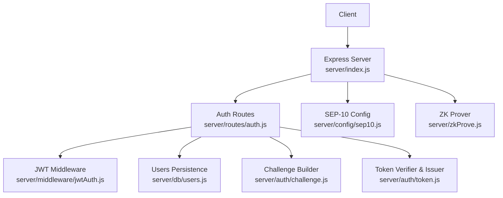
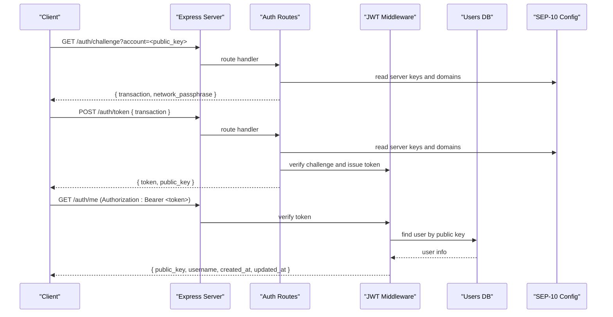
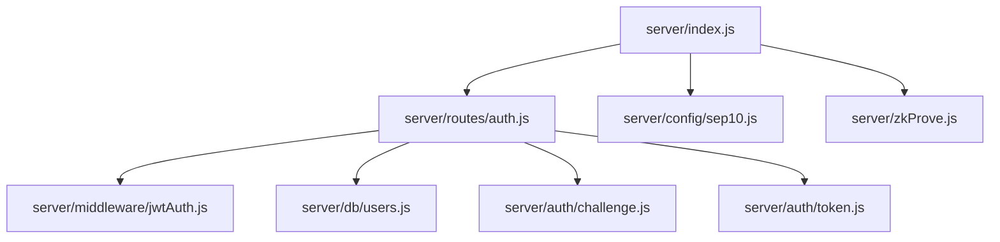

# REST API Endpoints

<cite>
**Referenced Files in This Document**
- [server/index.js](file://server/index.js)
- [server/routes/auth.js](file://server/routes/auth.js)
- [server/auth/challenge.js](file://server/auth/challenge.js)
- [server/auth/token.js](file://server/auth/token.js)
- [server/middleware/jwtAuth.js](file://server/middleware/jwtAuth.js)
- [server/db/users.js](file://server/db/users.js)
- [server/config/sep10.js](file://server/config/sep10.js)
- [server/zkProve.js](file://server/zkProve.js)
- [server/db/schema.sql](file://server/db/schema.sql)
- [server/db/pool.js](file://server/db/pool.js)
- [server/db/supabase.js](file://server/db/supabase.js)
- [.env.example](file://.env.example)
</cite>

## Table of Contents
1. [Introduction](#introduction)
2. [Project Structure](#project-structure)
3. [Core Components](#core-components)
4. [Architecture Overview](#architecture-overview)
5. [Detailed Component Analysis](#detailed-component-analysis)
6. [Dependency Analysis](#dependency-analysis)
7. [Performance Considerations](#performance-considerations)
8. [Troubleshooting Guide](#troubleshooting-guide)
9. [Conclusion](#conclusion)
10. [Appendices](#appendices)

## Introduction
This document provides comprehensive REST API documentation for Vibe-Coder’s HTTP endpoints. It covers authentication, XP tracking, progress persistence, leaderboards, and zero-knowledge proof generation. For each endpoint, you will find request/response schemas, parameter descriptions, authentication requirements, error codes, and practical usage examples. Security considerations, CORS configuration, and rate limiting guidance are included.

## Project Structure
The server is implemented with Express and exposes multiple HTTP endpoints. Authentication is handled via Stellar SEP-10 and JWT. Additional endpoints support real-time XP broadcasting via WebSocket, AI tool integration, progress persistence, leaderboard management, and ZK proof generation.

**Diagram sources**
- [server/index.js](file://server/index.js#L1-L246)
- [server/routes/auth.js](file://server/routes/auth.js#L1-L115)
- [server/middleware/jwtAuth.js](file://server/middleware/jwtAuth.js#L1-L36)
- [server/db/users.js](file://server/db/users.js#L1-L181)
- [server/config/sep10.js](file://server/config/sep10.js#L1-L87)
- [server/auth/challenge.js](file://server/auth/challenge.js#L1-L87)
- [server/auth/token.js](file://server/auth/token.js#L1-L80)
- [server/zkProve.js](file://server/zkProve.js#L1-L68)

**Section sources**
- [server/index.js](file://server/index.js#L1-L246)
- [server/routes/auth.js](file://server/routes/auth.js#L1-L115)

## Core Components
- Authentication endpoints: GET /auth/challenge, POST /auth/token, GET /auth/me, PATCH /auth/me/username
- XP tracking endpoints: POST /event, POST /cli/:source
- Progress persistence: GET /player/:address/progress, POST /player/:address/progress
- Leaderboard endpoints: GET /leaderboard, POST /leaderboard
- ZK proof endpoint: POST /zk/prove
- CORS: Enabled globally with wildcard origin and standard headers
- Rate limiting: Not implemented at the HTTP level; consider adding middleware for production deployments

**Section sources**
- [server/index.js](file://server/index.js#L14-L20)
- [server/index.js](file://server/index.js#L27-L28)
- [server/index.js](file://server/index.js#L99-L125)
- [server/index.js](file://server/index.js#L129-L154)
- [server/index.js](file://server/index.js#L165-L194)
- [server/index.js](file://server/index.js#L196-L216)

## Architecture Overview
The server exposes REST endpoints and a WebSocket server for real-time XP broadcasting. Authentication is SEP-10 compliant and issues JWTs. Data persistence supports Supabase, PostgreSQL, or in-memory fallback.

**Diagram sources**
- [server/index.js](file://server/index.js#L27-L51)
- [server/routes/auth.js](file://server/routes/auth.js#L19-L94)
- [server/middleware/jwtAuth.js](file://server/middleware/jwtAuth.js#L9-L35)
- [server/db/users.js](file://server/db/users.js#L28-L51)
- [server/config/sep10.js](file://server/config/sep10.js#L76-L86)

## Detailed Component Analysis

### Authentication Endpoints
- GET /auth/challenge
  - Purpose: Obtain a signed challenge transaction for SEP-10 authentication.
  - Query parameters:
    - account: Stellar public key (G... or M...).
  - Response:
    - transaction: Base64 XDR of the challenge transaction envelope.
    - network_passphrase: Current network passphrase.
  - Errors:
    - 400: Missing or invalid account.
    - 503: SEP-10 not configured.
  - Example request:
    - GET /auth/challenge?account=G...ADDRESS
  - Example response:
    - { "transaction": "...", "network_passphrase": "Test SDF Network ; September 2015" }

- POST /auth/token
  - Purpose: Exchange a signed challenge XDR for a JWT.
  - Request body:
    - transaction: Signed challenge XDR (application/json).
  - Response:
    - token: JWT for subsequent authenticated requests.
    - public_key: The client’s Stellar public key.
  - Errors:
    - 400: Missing or invalid transaction; invalid challenge/signature.
    - 503: SEP-10 not configured.
  - Example request:
    - POST /auth/token
    - Headers: Content-Type: application/json
    - Body: { "transaction": "<base64_signed_xdr>" }

- GET /auth/me
  - Purpose: Retrieve current user profile.
  - Authentication: Bearer <JWT>.
  - Response:
    - public_key, username, created_at, updated_at.
  - Errors:
    - 401: Missing/invalid/expired token.
    - 404: User not found.
    - 500: Server error.
  - Example response:
    - { "public_key": "G...", "username": "alice", "created_at": "2025-01-01T00:00:00Z", "updated_at": "2025-01-02T00:00:00Z" }

- PATCH /auth/me/username
  - Purpose: Set or update username.
  - Authentication: Bearer <JWT>.
  - Request body:
    - username: String (trimmed, max 64 chars).
  - Response:
    - Updated user object with public_key, username, updated_at.
  - Errors:
    - 401: Missing/invalid/expired token.
    - 404: User not found.
    - 500: Server error.

**Section sources**
- [server/routes/auth.js](file://server/routes/auth.js#L19-L94)
- [server/auth/challenge.js](file://server/auth/challenge.js#L64-L86)
- [server/auth/token.js](file://server/auth/token.js#L29-L79)
- [server/middleware/jwtAuth.js](file://server/middleware/jwtAuth.js#L9-L35)
- [server/db/users.js](file://server/db/users.js#L28-L125)
- [server/config/sep10.js](file://server/config/sep10.js#L76-L86)

### XP Tracking Endpoints
- POST /event
  - Purpose: Real-time XP broadcasting for activities.
  - Request body:
    - type: Activity type (e.g., message, tool_use, response, task_complete).
    - data: Optional structured data (e.g., tool name).
    - source: Tool/provider identifier (e.g., claude, codex, gemini, cursor, copilot).
  - Response:
    - success: Boolean.
    - xp: Calculated XP amount based on type and source.
    - source: Source identifier.
  - Behavior:
    - XP amounts vary by type and source; special handling for tool_use actions.
  - Errors:
    - 200: Always returns success; xp may be minimal if type/source not recognized.
  - Example request:
    - POST /event
    - Body: { "type": "message", "source": "codex" }

- POST /cli/:source
  - Purpose: AI tool integration to emit XP events.
  - Path parameters:
    - source: One of supported CLI sources (claude, codex, gemini, cursor, copilot).
  - Request body:
    - action: Event action (e.g., activity).
    - data: Optional structured data.
  - Response:
    - success: Boolean.
    - xp: XP amount derived from source.
    - source: Provided source.
  - Errors:
    - 400: Unknown CLI source; valid sources returned in error payload.
  - Example request:
    - POST /cli/cursor
    - Body: { "action": "edit", "data": { "tool": "EditFile" } }

**Section sources**
- [server/index.js](file://server/index.js#L99-L125)

### Progress Persistence Endpoints
- GET /player/:address/progress
  - Purpose: Retrieve saved progress for a Stellar address.
  - Path parameters:
    - address: Stellar address (trimmed, max 56 chars).
  - Response:
    - upgrades, legendaries, highWave, highScore, saveState, selectedCharacter.
    - If no data exists, returns defaults with nulls and selectedCharacter set to vibecoder.
  - Errors:
    - 400: Missing address.
  - Example response:
    - { "upgrades": null, "legendaries": null, "highWave": 0, "highScore": 0, "saveState": null, "selectedCharacter": "vibecoder" }

- POST /player/:address/progress
  - Purpose: Persist player progress.
  - Path parameters:
    - address: Stellar address (trimmed, max 56 chars).
  - Request body:
    - upgrades, legendaries, highWave, highScore, saveState, selectedCharacter.
    - selectedCharacter must be one of vibecoder, destroyer, swordsman.
  - Response:
    - success: Boolean.
  - Errors:
    - 400: Missing address.
  - Example request:
    - POST /player/G.../progress
    - Body: { "selectedCharacter": "destroyer", "highWave": 5, "highScore": 1000 }

**Section sources**
- [server/index.js](file://server/index.js#L129-L154)

### Leaderboard Endpoints
- GET /leaderboard
  - Purpose: Retrieve top leaderboard entries.
  - Response:
    - entries: Top 10 entries sorted by score, then wave, then recency.
  - Example response:
    - { "entries": [ { "address": "G...", "wave": 10, "score": 5000, "date": 1700000000000 }, ... ] }

- POST /leaderboard
  - Purpose: Submit a score and wave for an address.
  - Request body:
    - address: Stellar address (required).
    - wave: Integer (required).
    - score: Integer (required).
  - Behavior:
    - Updates existing entry if score/wave improved; maintains a maximum of 50 entries.
  - Response:
    - success: Boolean.
    - entries: Top 10 entries after update.
  - Errors:
    - 400: Missing required fields.
  - Example request:
    - POST /leaderboard
    - Body: { "address": "G...", "wave": 12, "score": 6200 }

**Section sources**
- [server/index.js](file://server/index.js#L165-L194)

### ZK Proof Endpoint
- POST /zk/prove
  - Purpose: Generate a Groth16 proof for ranked submission.
  - Request body:
    - run_hash_hex: 64-character hex string representing a 32-byte hash.
    - score: Integer.
    - wave: Integer.
    - nonce: Integer.
    - season_id: Optional integer (defaults to 1).
  - Response:
    - proof: Groth16 proof structure.
    - vk: Verification key.
    - pub_signals: Public signals array.
  - Errors:
    - 400: Missing required fields.
    - 500: Proof generation failed (e.g., missing circuit artifacts).
  - Prerequisites:
    - Circuits must be built and available in circuits/build.
    - Scripts require snarkjs and circom in PATH.
  - Example request:
    - POST /zk/prove
    - Body: { "run_hash_hex": "0123456789abcdef...", "score": 6200, "wave": 12, "nonce": 123456 }

**Section sources**
- [server/index.js](file://server/index.js#L196-L216)
- [server/zkProve.js](file://server/zkProve.js#L46-L67)

### CORS Configuration
- Enabled globally with:
  - Access-Control-Allow-Origin: *
  - Access-Control-Allow-Methods: GET, POST, PATCH, OPTIONS
  - Access-Control-Allow-Headers: Content-Type, Authorization
- Preflight requests (OPTIONS) return 200 immediately.

**Section sources**
- [server/index.js](file://server/index.js#L14-L20)

### Security Considerations
- Authentication:
  - SEP-10 challenge issuance and token verification are implemented with @stellar/stellar-sdk and jsonwebtoken.
  - JWT secret must be configured; otherwise endpoints return 503.
  - Protected routes require Authorization: Bearer <JWT>.
- Data storage:
  - Supports Supabase, PostgreSQL, or in-memory fallback. Schema and connection pooling are provided.
- Environment variables:
  - Critical for operation: SEP10_SERVER_SECRET_KEY, JWT_SECRET, SEP10_HOME_DOMAIN, SEP10_WEB_AUTH_DOMAIN, SEP10_NETWORK_PASSPHRASE.
  - See .env.example for defaults and deployment notes.

**Section sources**
- [server/config/sep10.js](file://server/config/sep10.js#L76-L86)
- [server/middleware/jwtAuth.js](file://server/middleware/jwtAuth.js#L9-L35)
- [server/db/users.js](file://server/db/users.js#L1-L181)
- [server/db/schema.sql](file://server/db/schema.sql#L1-L31)
- [server/db/pool.js](file://server/db/pool.js#L1-L36)
- [server/db/supabase.js](file://server/db/supabase.js#L1-L23)
- [.env.example](file://.env.example#L23-L36)

## Dependency Analysis

**Diagram sources**
- [server/index.js](file://server/index.js#L1-L246)
- [server/routes/auth.js](file://server/routes/auth.js#L1-L115)
- [server/middleware/jwtAuth.js](file://server/middleware/jwtAuth.js#L1-L36)
- [server/db/users.js](file://server/db/users.js#L1-L181)
- [server/config/sep10.js](file://server/config/sep10.js#L1-L87)
- [server/auth/challenge.js](file://server/auth/challenge.js#L1-L87)
- [server/auth/token.js](file://server/auth/token.js#L1-L80)
- [server/zkProve.js](file://server/zkProve.js#L1-L68)

**Section sources**
- [server/index.js](file://server/index.js#L1-L246)
- [server/routes/auth.js](file://server/routes/auth.js#L1-L115)

## Performance Considerations
- WebSocket broadcasting:
  - Broadcasts XP updates to all connected clients; ensure client-side throttling to avoid flooding.
- Leaderboard sorting:
  - Sorting and slicing to top 10 occurs on each request; consider caching top N in memory for high traffic.
- ZK proof generation:
  - CPU-intensive; ensure adequate resources and consider queueing or offloading to dedicated workers.
- Database:
  - Supabase/PostgreSQL provide scalable persistence; in-memory fallback is suitable for development only.

[No sources needed since this section provides general guidance]

## Troubleshooting Guide
- Authentication errors:
  - 400 on /auth/challenge: Verify account parameter is present and a valid Stellar public key.
  - 400 on /auth/token: Ensure transaction is a non-empty base64 string and signed challenge XDR.
  - 401 on protected routes: Confirm Authorization header format and valid, unexpired JWT.
  - 503 on auth endpoints: Check that SEP-10 and JWT secrets are configured.
- ZK proof errors:
  - 400: Missing required fields in request body.
  - 500: Circuits not built or scripts not available; run npm run zk:build and ensure PATH includes snarkjs and circom.
- CORS issues:
  - Ensure client sends Content-Type and Authorization headers; preflight OPTIONS is handled automatically.

**Section sources**
- [server/routes/auth.js](file://server/routes/auth.js#L19-L94)
- [server/middleware/jwtAuth.js](file://server/middleware/jwtAuth.js#L9-L35)
- [server/index.js](file://server/index.js#L196-L216)
- [server/config/sep10.js](file://server/config/sep10.js#L76-L86)

## Conclusion
Vibe-Coder’s API provides a robust foundation for authentication, XP tracking, progress persistence, leaderboards, and ZK proof generation. The design emphasizes SEP-10 compliance and JWT-based protection for authenticated endpoints. For production deployments, consider implementing rate limiting, stricter CORS policies, and monitoring for error rates and latency.

[No sources needed since this section summarizes without analyzing specific files]

## Appendices

### Endpoint Reference Summary
- Authentication
  - GET /auth/challenge?account={public_key}
  - POST /auth/token { transaction }
  - GET /auth/me (requires Authorization)
  - PATCH /auth/me/username { username }
- XP Tracking
  - POST /event { type, data?, source? }
  - POST /cli/{source} { action?, data? }
- Progress
  - GET /player/{address}/progress
  - POST /player/{address}/progress { upgrades?, legendaries?, highWave?, highScore?, saveState?, selectedCharacter? }
- Leaderboard
  - GET /leaderboard
  - POST /leaderboard { address, wave, score }
- ZK Proof
  - POST /zk/prove { run_hash_hex, score, wave, nonce, season_id? }

**Section sources**
- [server/index.js](file://server/index.js#L27-L28)
- [server/index.js](file://server/index.js#L99-L125)
- [server/index.js](file://server/index.js#L129-L154)
- [server/index.js](file://server/index.js#L165-L194)
- [server/index.js](file://server/index.js#L196-L216)

### Data Models and Schemas
- User model (from persistence):
  - public_key: String (unique)
  - username: String (nullable)
  - current_jwt: Text (nullable)
  - jwt_expires_at: Timestamp (nullable)
  - created_at: Timestamp
  - updated_at: Timestamp

- Leaderboard entry:
  - address: String
  - wave: Number
  - score: Number
  - date: Number (timestamp)

- ZK proof payload:
  - proof: { a, b, c }
  - vk: { alpha, beta, gamma, delta, ic }
  - pub_signals: Array<String>

**Section sources**
- [server/db/schema.sql](file://server/db/schema.sql#L5-L13)
- [server/index.js](file://server/index.js#L165-L194)
- [server/zkProve.js](file://server/zkProve.js#L46-L67)