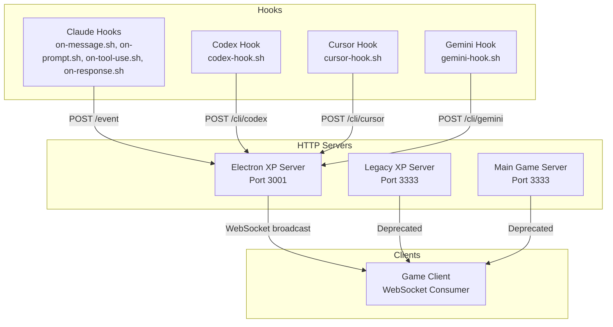
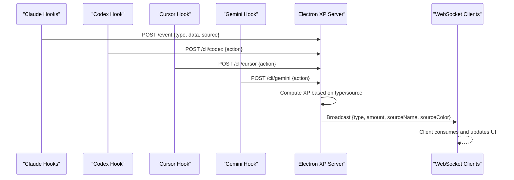
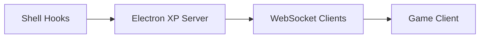

# XP Tracking Endpoints

<cite>
**Referenced Files in This Document**
- [xp-server.js](file://xp-server.js)
- [electron/server.js](file://electron/server.js)
- [server/index.js](file://server/index.js)
- [src/utils/socket.js](file://src/utils/socket.js)
- [hooks/vibe-coder-hook.sh](file://hooks/vibe-coder-hook.sh)
- [hooks/on-message.sh](file://hooks/on-message.sh)
- [hooks/on-prompt.sh](file://hooks/on-prompt.sh)
- [hooks/on-tool-use.sh](file://hooks/on-tool-use.sh)
- [hooks/on-response.sh](file://hooks/on-response.sh)
- [hooks/codex-hook.sh](file://hooks/codex-hook.sh)
- [hooks/cursor-hook.sh](file://hooks/cursor-hook.sh)
- [hooks/gemini-hook.sh](file://hooks/gemini-hook.sh)
</cite>

## Table of Contents
1. [Introduction](#introduction)
2. [Project Structure](#project-structure)
3. [Core Components](#core-components)
4. [Architecture Overview](#architecture-overview)
5. [Detailed Component Analysis](#detailed-component-analysis)
6. [Dependency Analysis](#dependency-analysis)
7. [Performance Considerations](#performance-considerations)
8. [Troubleshooting Guide](#troubleshooting-guide)
9. [Conclusion](#conclusion)

## Introduction
This document describes the XP tracking system used by Vibe-Coder to reward user activities across AI tools and in-game interactions. It covers:
- Real-time XP broadcasting via POST /event
- AI tool integration via POST /cli/:source with dynamic source routing
- XP scoring rules for different activity types and sources
- WebSocket integration for real-time client consumption
- Examples of supported XP sources and point values

## Project Structure
The XP tracking system spans multiple components:
- HTTP servers that expose REST endpoints and WebSocket channels
- Shell hooks that emit events from AI tools
- A client-side WebSocket consumer that updates the game state

**Diagram sources**
- [electron/server.js](file://electron/server.js#L75-L151)
- [xp-server.js](file://xp-server.js#L1-L106)
- [server/index.js](file://server/index.js#L99-L125)
- [src/utils/socket.js](file://src/utils/socket.js#L1-L120)
- [hooks/vibe-coder-hook.sh](file://hooks/vibe-coder-hook.sh#L1-L24)
- [hooks/codex-hook.sh](file://hooks/codex-hook.sh#L1-L27)
- [hooks/cursor-hook.sh](file://hooks/cursor-hook.sh#L1-L24)
- [hooks/gemini-hook.sh](file://hooks/gemini-hook.sh#L1-L27)

**Section sources**
- [electron/server.js](file://electron/server.js#L1-L183)
- [server/index.js](file://server/index.js#L1-L246)
- [src/utils/socket.js](file://src/utils/socket.js#L1-L120)
- [hooks/vibe-coder-hook.sh](file://hooks/vibe-coder-hook.sh#L1-L24)
- [hooks/codex-hook.sh](file://hooks/codex-hook.sh#L1-L27)
- [hooks/cursor-hook.sh](file://hooks/cursor-hook.sh#L1-L24)
- [hooks/gemini-hook.sh](file://hooks/gemini-hook.sh#L1-L27)

## Core Components
- Electron XP Server (primary): Runs on port 3001, exposes /event and /cli/:source, and broadcasts XP via WebSocket.
- Legacy XP Server (deprecated): Runs on port 3333, supports /event and WebSocket.
- Main Game Server (deprecated): Also runs on port 3333, supports /event and /cli/:source.
- Client WebSocket consumer: Connects to ws://localhost:3001 to receive XP events.
- AI Tool Hooks: Emit structured events to the XP server.

Key behaviors:
- XP values are defined per activity type and per source.
- WebSocket messages include type, amount, source, sourceName, and sourceColor.
- CLI endpoints accept dynamic source routing and calculate XP accordingly.

**Section sources**
- [electron/server.js](file://electron/server.js#L18-L39)
- [electron/server.js](file://electron/server.js#L48-L73)
- [electron/server.js](file://electron/server.js#L100-L133)
- [src/utils/socket.js](file://src/utils/socket.js#L1-L120)

## Architecture Overview
The system integrates AI tool hooks with a central XP server and a WebSocket-based client.

**Diagram sources**
- [hooks/vibe-coder-hook.sh](file://hooks/vibe-coder-hook.sh#L15-L20)
- [hooks/codex-hook.sh](file://hooks/codex-hook.sh#L18-L23)
- [hooks/cursor-hook.sh](file://hooks/cursor-hook.sh#L15-L19)
- [hooks/gemini-hook.sh](file://hooks/gemini-hook.sh#L18-L23)
- [electron/server.js](file://electron/server.js#L100-L119)
- [electron/server.js](file://electron/server.js#L122-L133)
- [electron/server.js](file://electron/server.js#L48-L73)

## Detailed Component Analysis

### POST /event (Real-time XP Broadcasting)
Purpose:
- Accepts structured events from AI tool hooks and broadcasts XP to all connected clients.

Request schema:
- type: string (required). Activity type such as message, tool_use, response, task_complete, or unknown.
- data: object (optional). Tool-specific metadata (e.g., tool name).
- source: string (optional). AI tool identifier such as claude, codex, gemini, cursor, copilot, or unknown.

Response schema:
- success: boolean
- xp: number
- source: string

Behavior:
- Computes XP based on type and source.
- Applies bonus XP for certain tool_use actions (e.g., Edit/Write, Bash).
- Broadcasts a WebSocket message containing type, amount, sourceName, and sourceColor.

Example requests:
- Claude message/response/tool_use events via shell hooks
- Generic events via direct POST

Example response:
- {"success": true, "xp": 10, "source": "claude"}

Notes:
- Unknown activity types default to small XP amounts.
- WebSocket consumers update the game state with the received XP.

**Section sources**
- [electron/server.js](file://electron/server.js#L100-L119)
- [electron/server.js](file://electron/server.js#L48-L73)
- [hooks/vibe-coder-hook.sh](file://hooks/vibe-coder-hook.sh#L15-L20)

### POST /cli/:source (AI Tool Integration)
Purpose:
- Route XP events from CLI-based AI tools to the XP server with dynamic source routing.

Path parameters:
- source: string (required). Supported sources: claude, codex, gemini, cursor, copilot.

Request schema:
- action: string (optional). Defaults to "activity" if omitted.
- data: object (optional). Tool-specific metadata.

Response schema:
- success: boolean
- xp: number
- source: string

Behavior:
- Validates the requested source against known CLI sources.
- Calculates XP using source-specific values (e.g., codex_cli, gemini_cli, cursor_ai).
- Broadcasts the event to WebSocket clients.

Example requests:
- POST /cli/codex with action "completed task"
- POST /cli/gemini with action "generated code"

Example response:
- {"success": true, "xp": 12, "source": "codex"}

**Section sources**
- [electron/server.js](file://electron/server.js#L122-L133)
- [hooks/codex-hook.sh](file://hooks/codex-hook.sh#L18-L23)
- [hooks/cursor-hook.sh](file://hooks/cursor-hook.sh#L15-L19)
- [hooks/gemini-hook.sh](file://hooks/gemini-hook.sh#L18-L23)

### WebSocket Integration and Client Consumption
Connection:
- The game client connects to ws://localhost:3001.
- On successful connection, the client dispatches a custom event for UI updates.
- On close or error, the client schedules a reconnect.

Message format:
- type: string
- amount: number
- source: string
- sourceName: string
- sourceColor: string
- timestamp: number

Client behavior:
- Parses incoming messages and logs XP events.
- Updates the game state by adding XP with source metadata.

Reconnection:
- Implements exponential backoff-like reconnect scheduling.

**Section sources**
- [src/utils/socket.js](file://src/utils/socket.js#L1-L120)
- [electron/server.js](file://electron/server.js#L48-L73)

### XP Scoring System
Activity types and base values:
- message: 10 XP
- tool_use: 5 XP
- response: 5 XP
- task_complete: 50 XP
- unknown: 5 XP

Source-specific multipliers:
- claude: 15 XP for code-related actions
- codex: 12 XP for CLI actions
- gemini: 12 XP for CLI actions
- cursor: 10 XP for AI actions
- copilot: 8 XP

Bonus XP:
- tool_use with Edit/Write: 15 XP
- tool_use with Bash: 10 XP

WebSocket message includes:
- type, amount, sourceName (uppercase), sourceColor (hex)

**Section sources**
- [electron/server.js](file://electron/server.js#L18-L29)
- [electron/server.js](file://electron/server.js#L104-L115)
- [electron/server.js](file://electron/server.js#L31-L39)

### AI Tool Hooks
Claude hooks:
- on-message.sh, on-prompt.sh, on-tool-use.sh, on-response.sh set environment variables and exec vibe-coder-hook.sh.
- vibe-coder-hook.sh posts to /event with type derived from environment and source set to claude.

Codex, Cursor, Gemini hooks:
- Directly post to /cli/:source with action payloads.
- Non-blocking, silent curl calls with short timeouts.

**Section sources**
- [hooks/on-message.sh](file://hooks/on-message.sh#L1-L5)
- [hooks/on-prompt.sh](file://hooks/on-prompt.sh#L1-L5)
- [hooks/on-tool-use.sh](file://hooks/on-tool-use.sh#L1-L5)
- [hooks/on-response.sh](file://hooks/on-response.sh#L1-L5)
- [hooks/vibe-coder-hook.sh](file://hooks/vibe-coder-hook.sh#L1-L24)
- [hooks/codex-hook.sh](file://hooks/codex-hook.sh#L1-L27)
- [hooks/cursor-hook.sh](file://hooks/cursor-hook.sh#L1-L24)
- [hooks/gemini-hook.sh](file://hooks/gemini-hook.sh#L1-L27)

## Dependency Analysis
High-level dependencies:
- Hooks depend on the Electron XP Server being reachable at localhost:3001.
- The Electron XP Server depends on Express for HTTP and ws for WebSocket.
- The client depends on the WebSocket URL and parses structured messages.

**Diagram sources**
- [hooks/vibe-coder-hook.sh](file://hooks/vibe-coder-hook.sh#L15-L20)
- [hooks/codex-hook.sh](file://hooks/codex-hook.sh#L18-L23)
- [hooks/cursor-hook.sh](file://hooks/cursor-hook.sh#L15-L19)
- [hooks/gemini-hook.sh](file://hooks/gemini-hook.sh#L18-L23)
- [electron/server.js](file://electron/server.js#L75-L151)
- [src/utils/socket.js](file://src/utils/socket.js#L1-L120)

**Section sources**
- [electron/server.js](file://electron/server.js#L1-L183)
- [src/utils/socket.js](file://src/utils/socket.js#L1-L120)

## Performance Considerations
- Non-blocking hook invocations: Hooks use background curl calls to avoid blocking AI tool workflows.
- Minimal JSON parsing: Server endpoints parse JSON once and broadcast efficiently.
- Lightweight WebSocket messages: Messages include only essential fields to reduce bandwidth.
- Reconnection strategy: Client retries with a delay to avoid excessive reconnect storms.

## Troubleshooting Guide
Common issues and resolutions:
- Server not reachable:
  - Verify the Electron XP Server is running on port 3001.
  - Confirm the client is connecting to ws://localhost:3001.
- Unknown CLI source:
  - Ensure the source parameter is one of claude, codex, gemini, cursor, copilot.
- Invalid JSON in /event:
  - Validate the request body conforms to the schema.
- No XP updates in the game:
  - Check WebSocket connection state and logs.
  - Confirm the client is running locally (non-localhost environments skip connection).

Operational checks:
- Health endpoints:
  - Electron XP Server: GET /health
  - Main Game Server: GET /health

**Section sources**
- [electron/server.js](file://electron/server.js#L135-L142)
- [server/index.js](file://server/index.js#L218-L224)
- [src/utils/socket.js](file://src/utils/socket.js#L18-L104)

## Conclusion
The XP tracking system provides a robust, extensible mechanism for rewarding user activities across multiple AI tools and in-game interactions. By combining structured HTTP endpoints, dynamic source routing, and real-time WebSocket updates, it enables seamless integration with AI tool workflows while keeping the game responsive and engaging.