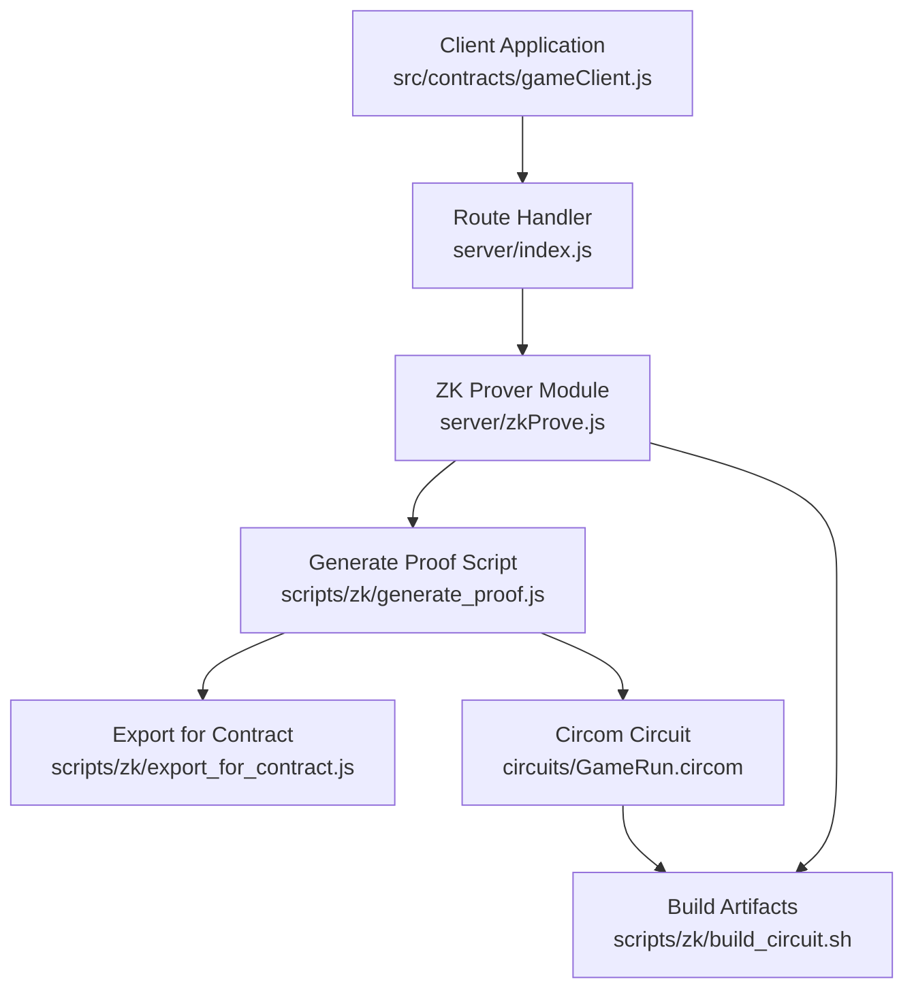
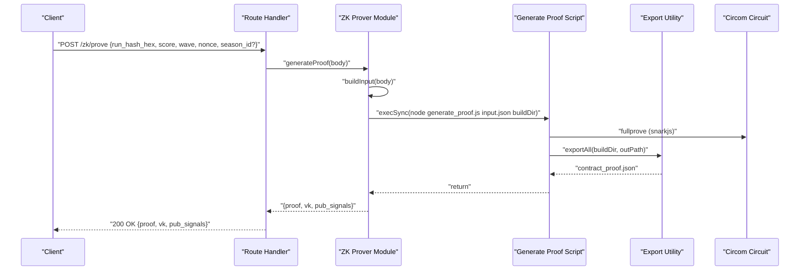
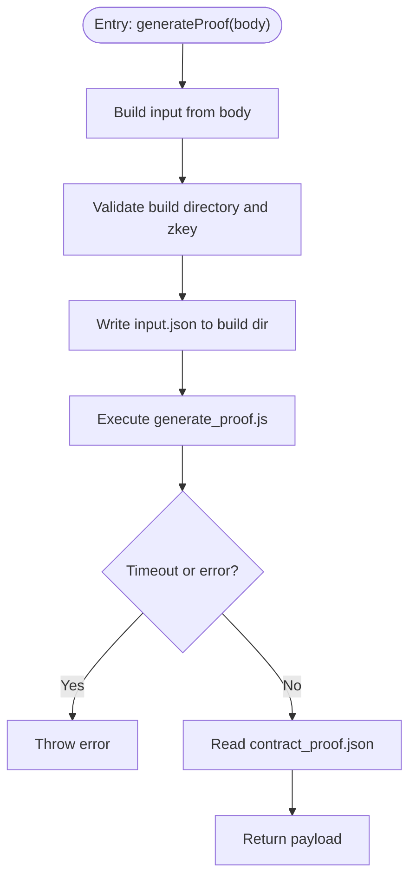
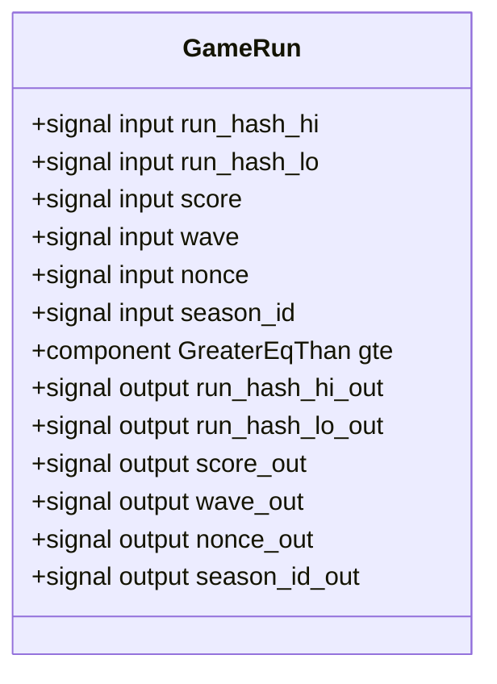
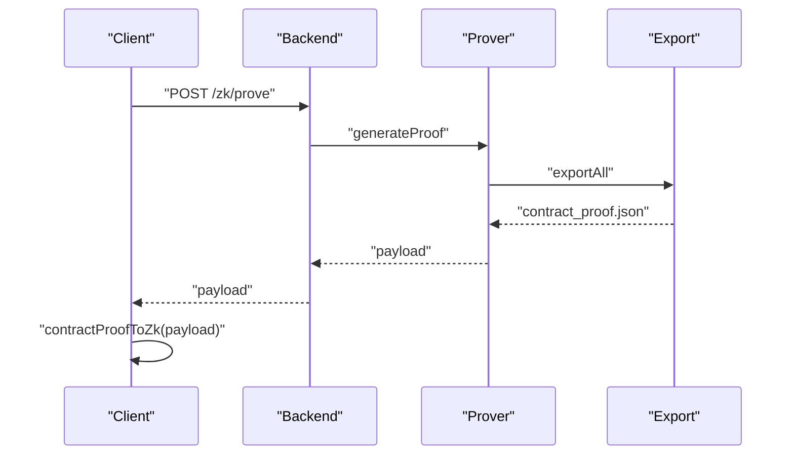
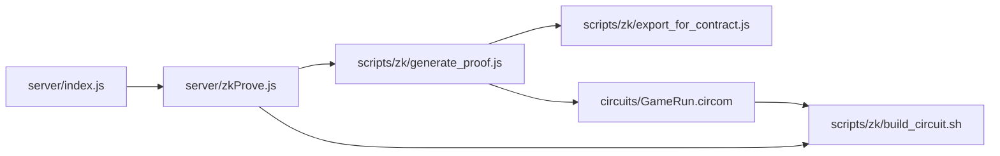

# Zero-Knowledge Proof Endpoints

<cite>
**Referenced Files in This Document**
- [server/index.js](file://server/index.js)
- [server/zkProve.js](file://server/zkProve.js)
- [src/zk/gameProof.js](file://src/zk/gameProof.js)
- [circuits/GameRun.circom](file://circuits/GameRun.circom)
- [scripts/zk/generate_proof.js](file://scripts/zk/generate_proof.js)
- [scripts/zk/export_for_contract.js](file://scripts/zk/export_for_contract.js)
- [scripts/zk/build_circuit.sh](file://scripts/zk/build_circuit.sh)
- [src/contracts/gameClient.js](file://src/contracts/gameClient.js)
- [circuits/input.json.example](file://circuits/input.json.example)
</cite>

## Table of Contents
1. [Introduction](#introduction)
2. [Project Structure](#project-structure)
3. [Core Components](#core-components)
4. [Architecture Overview](#architecture-overview)
5. [Detailed Component Analysis](#detailed-component-analysis)
6. [Dependency Analysis](#dependency-analysis)
7. [Performance Considerations](#performance-considerations)
8. [Troubleshooting Guide](#troubleshooting-guide)
9. [Conclusion](#conclusion)
10. [Appendices](#appendices)

## Introduction
This document provides comprehensive API documentation for Vibe-Coder’s ZK proof generation endpoint. It covers the POST /zk/prove endpoint, including request body schema, cryptographic requirements, proof generation workflow, response format, integration with the snarkjs library and Circom circuit, error handling, examples, and security considerations.

## Project Structure
The ZK proof pipeline spans the server route handler, a dedicated ZK prover module, supporting scripts, and the Circom circuit definition. The client-side integration is provided by a helper that requests proofs from the backend and normalizes the returned data.

**Diagram sources**
- [server/index.js](file://server/index.js#L196-L216)
- [server/zkProve.js](file://server/zkProve.js#L46-L67)
- [scripts/zk/generate_proof.js](file://scripts/zk/generate_proof.js#L36-L45)
- [scripts/zk/export_for_contract.js](file://scripts/zk/export_for_contract.js#L65-L86)
- [circuits/GameRun.circom](file://circuits/GameRun.circom#L1-L34)
- [scripts/zk/build_circuit.sh](file://scripts/zk/build_circuit.sh#L30-L51)
- [src/contracts/gameClient.js](file://src/contracts/gameClient.js#L103-L121)

**Section sources**
- [server/index.js](file://server/index.js#L196-L216)
- [server/zkProve.js](file://server/zkProve.js#L1-L68)
- [scripts/zk/generate_proof.js](file://scripts/zk/generate_proof.js#L1-L46)
- [scripts/zk/export_for_contract.js](file://scripts/zk/export_for_contract.js#L1-L95)
- [circuits/GameRun.circom](file://circuits/GameRun.circom#L1-L34)
- [scripts/zk/build_circuit.sh](file://scripts/zk/build_circuit.sh#L1-L57)
- [src/contracts/gameClient.js](file://src/contracts/gameClient.js#L103-L160)

## Core Components
- Route handler: Validates request body and invokes the ZK prover.
- ZK prover module: Builds circuit input, writes input.json, executes the proof generation script, and returns the contract-ready proof payload.
- Proof generation script: Runs snarkjs fullprove and exports artifacts for contract verification.
- Export utility: Converts Groth16 proof, verifying key, and public signals into the expected byte formats.
- Circom circuit: Defines the constraints and public outputs for the ZK proof.
- Client integration: Requests the proof from the backend and normalizes the response for on-chain submission.

**Section sources**
- [server/index.js](file://server/index.js#L196-L216)
- [server/zkProve.js](file://server/zkProve.js#L15-L67)
- [scripts/zk/generate_proof.js](file://scripts/zk/generate_proof.js#L36-L45)
- [scripts/zk/export_for_contract.js](file://scripts/zk/export_for_contract.js#L38-L86)
- [circuits/GameRun.circom](file://circuits/GameRun.circom#L8-L31)
- [src/contracts/gameClient.js](file://src/contracts/gameClient.js#L103-L160)

## Architecture Overview
The ZK proof generation follows a deterministic workflow:
- Client prepares run metadata and requests a proof from the backend.
- Backend validates inputs, constructs the circuit input, and triggers the prover.
- The prover executes snarkjs to produce a Groth16 proof and exports it in a contract-compatible format.
- The client receives a structured payload containing the proof, verification key, and public signals.

**Diagram sources**
- [server/index.js](file://server/index.js#L196-L216)
- [server/zkProve.js](file://server/zkProve.js#L46-L67)
- [scripts/zk/generate_proof.js](file://scripts/zk/generate_proof.js#L36-L45)
- [scripts/zk/export_for_contract.js](file://scripts/zk/export_for_contract.js#L65-L86)
- [circuits/GameRun.circom](file://circuits/GameRun.circom#L8-L31)

## Detailed Component Analysis

### Endpoint Definition: POST /zk/prove
- Method: POST
- Path: /zk/prove
- Content-Type: application/json
- Authentication: Not enforced by the endpoint itself; typically paired with JWT or SEP-10 authentication elsewhere in the server.

Request Body Schema
- run_hash_hex: string (required). Hex-encoded 32-byte run hash. Leading “0x” is stripped and zero-padded to 64 hex characters. Split into run_hash_hi (first 16 bytes) and run_hash_lo (last 16 bytes) for the circuit.
- score: number (required). Non-negative integer; clamped to 0 if negative.
- wave: number (required). Non-negative integer; clamped to 0 if negative.
- nonce: number (required). Integer treated as unsigned 64-bit; converted to a string for the circuit.
- season_id: number (optional). Defaults to 1 if omitted.

Response Format
- proof: object
  - a: string. Hex-encoded G1 point (64 bytes).
  - b: string. Hex-encoded G2 point (128 bytes).
  - c: string. Hex-encoded G1 point (64 bytes).
- vk: object
  - alpha: string. Hex-encoded G1 point (64 bytes).
  - beta: string. Hex-encoded G2 point (128 bytes).
  - gamma: string. Hex-encoded G2 point (128 bytes).
  - delta: string. Hex-encoded G2 point (128 bytes).
  - ic: string[]. Array of hex-encoded G1 points (64 bytes each).
- pub_signals: string[]. Array of 32-byte hex-encoded field elements (6 total for the circuit).

Validation Rules
- run_hash_hex must be exactly 64 hex characters after normalization.
- score and wave must be non-negative integers.
- season_id must be a non-negative integer; defaults to 1 if omitted.
- The circuit enforces score >= wave * 10 (MIN_SCORE_PER_WAVE).

Security Notes
- Anti-replay protection relies on nonce uniqueness per run submission. The backend does not enforce replay detection; it is the client’s responsibility to ensure a fresh nonce per run.
- The run hash binds the run result to prevent tampering; clients should compute run_hash using the documented hashing scheme before requesting a proof.

Integration Pattern
- Client computes run_hash and collects score, wave, nonce, and optional season_id.
- Client calls POST /zk/prove and receives the contract-ready proof payload.
- Client converts the payload to binary format and submits it to the on-chain verifier.

**Section sources**
- [server/index.js](file://server/index.js#L196-L216)
- [server/zkProve.js](file://server/zkProve.js#L15-L39)
- [scripts/zk/export_for_contract.js](file://scripts/zk/export_for_contract.js#L38-L86)
- [circuits/GameRun.circom](file://circuits/GameRun.circom#L16-L22)
- [src/zk/gameProof.js](file://src/zk/gameProof.js#L19-L42)
- [src/contracts/gameClient.js](file://src/contracts/gameClient.js#L103-L160)

### ZK Prover Module
Responsibilities
- Build circuit input from request body.
- Validate prerequisites (build directory and final zkey presence).
- Write input.json to the build directory.
- Execute the proof generation script synchronously with a timeout.
- Parse and return the contract-ready proof payload.

Processing Logic
- Input normalization ensures run_hash_hex is 64 hex characters and splits into run_hash_hi/run_hash_lo.
- score and wave are floored and clamped to non-negative values.
- season_id defaults to 1 if omitted.
- The module throws descriptive errors if prerequisites are missing.

**Diagram sources**
- [server/zkProve.js](file://server/zkProve.js#L46-L67)

**Section sources**
- [server/zkProve.js](file://server/zkProve.js#L15-L67)

### Proof Generation Script
Workflow
- Copies the input.json into the build directory.
- Invokes snarkjs groth16 fullprove with the circuit WASM, final zkey, and generated proof/public files.
- Calls exportAll to convert proof, verifying key, and public signals into contract-ready hex strings.

Requirements
- snarkjs must be installed and available in PATH.
- The circuit must be compiled and built (R1CS, WASM, zkey).

**Section sources**
- [scripts/zk/generate_proof.js](file://scripts/zk/generate_proof.js#L32-L45)

### Export Utility
Purpose
- Convert snarkjs outputs into the expected byte layouts for on-chain verification:
  - G1 points: 64 bytes (two 32-byte big-endian field elements concatenated).
  - G2 points: 128 bytes (four 32-byte big-endian field elements in limb order).
  - Public signals: 32-byte field elements.

Output
- Returns an object with proof, vk, and pub_signals as hex strings.

**Section sources**
- [scripts/zk/export_for_contract.js](file://scripts/zk/export_for_contract.js#L38-L86)

### Circom Circuit
Template: GameRun
- Inputs: run_hash_hi, run_hash_lo, score, wave, nonce, season_id.
- Public outputs: run_hash_hi, run_hash_lo, score, wave, nonce, season_id.
- Constraint: score >= wave * 10 enforced via GreaterEqThan comparator.

**Diagram sources**
- [circuits/GameRun.circom](file://circuits/GameRun.circom#L8-L31)

**Section sources**
- [circuits/GameRun.circom](file://circuits/GameRun.circom#L1-L34)

### Client Integration
- requestZkProof: Sends POST /zk/prove with normalized payload and returns the contract-ready proof.
- contractProofToZk: Normalizes the returned payload into Uint8Array for on-chain submission.

**Diagram sources**
- [src/contracts/gameClient.js](file://src/contracts/gameClient.js#L103-L160)
- [server/index.js](file://server/index.js#L196-L216)
- [server/zkProve.js](file://server/zkProve.js#L46-L67)
- [scripts/zk/export_for_contract.js](file://scripts/zk/export_for_contract.js#L65-L86)

**Section sources**
- [src/contracts/gameClient.js](file://src/contracts/gameClient.js#L103-L160)

## Dependency Analysis
External Dependencies
- snarkjs: Required for Groth16 proving and verification key export.
- circom: Required to compile the circuit; the project uses circomlib comparators.
- Powers of tau (ptau): Downloaded or generated locally during build.

Internal Dependencies
- server/index.js depends on server/zkProve.js for proof generation.
- server/zkProve.js depends on scripts/zk/generate_proof.js and scripts/zk/export_for_contract.js.
- scripts/zk/generate_proof.js depends on the compiled circuit artifacts and snarkjs.
- scripts/zk/export_for_contract.js depends on the proof, verifying key, and public JSON outputs.

**Diagram sources**
- [server/index.js](file://server/index.js#L5-L6)
- [server/zkProve.js](file://server/zkProve.js#L57-L62)
- [scripts/zk/generate_proof.js](file://scripts/zk/generate_proof.js#L36-L45)
- [scripts/zk/export_for_contract.js](file://scripts/zk/export_for_contract.js#L65-L86)
- [scripts/zk/build_circuit.sh](file://scripts/zk/build_circuit.sh#L30-L51)
- [circuits/GameRun.circom](file://circuits/GameRun.circom#L6)

**Section sources**
- [server/index.js](file://server/index.js#L5-L6)
- [server/zkProve.js](file://server/zkProve.js#L57-L62)
- [scripts/zk/generate_proof.js](file://scripts/zk/generate_proof.js#L36-L45)
- [scripts/zk/export_for_contract.js](file://scripts/zk/export_for_contract.js#L65-L86)
- [scripts/zk/build_circuit.sh](file://scripts/zk/build_circuit.sh#L30-L51)
- [circuits/GameRun.circom](file://circuits/GameRun.circom#L6)

## Performance Considerations
- Proof generation is CPU-intensive and synchronous. The prover sets a 60-second timeout to avoid hanging the server.
- The build artifacts (WASM, zkey) must be present; otherwise, the endpoint fails fast with a descriptive error.
- Network latency dominates client requests; ensure the prover server is reachable and responsive.

[No sources needed since this section provides general guidance]

## Troubleshooting Guide
Common Errors and Causes
- Missing required fields: The route handler returns 400 if run_hash_hex, score, wave, or nonce are missing.
- run_hash_hex format: Must be 64 hex characters after normalization; otherwise, the prover throws an error.
- Missing build artifacts: If the build directory or final zkey is absent, the prover throws an error instructing to run the build script.
- snarkjs or circom not installed: The generate_proof script checks for these tools and exits with an error if missing.
- Proof generation failure: The prover catches exceptions and returns 500 with the error message.

Resolution Steps
- Verify run_hash_hex is a 64-character hex string and remove leading “0x” if present.
- Ensure the circuit is built using the provided build script before invoking /zk/prove.
- Confirm snarkjs is installed globally and available in PATH.
- Check server logs for detailed error messages.

**Section sources**
- [server/index.js](file://server/index.js#L196-L216)
- [server/zkProve.js](file://server/zkProve.js#L49-L54)
- [scripts/zk/generate_proof.js](file://scripts/zk/generate_proof.js#L23-L30)

## Conclusion
The POST /zk/prove endpoint provides a robust mechanism for generating Groth16 proofs bound to run results. By enforcing strict input validation, leveraging the Circom circuit, and exporting standardized artifacts, the system enables secure and verifiable ranked submissions. Clients must ensure run_hash correctness, nonce uniqueness, and proper integration with the on-chain verifier.

[No sources needed since this section summarizes without analyzing specific files]

## Appendices

### Request and Response Examples
Request Example
- Endpoint: POST /zk/prove
- Headers: Content-Type: application/json
- Body:
  - run_hash_hex: "a1b2c3d4e5f678901234567890abcdefa1b2c3d4e5f678901234567890abcdef"
  - score: 1200
  - wave: 42
  - nonce: 9876543210
  - season_id: 1

Response Example
- Status: 200 OK
- Body:
  - proof: { a: "...", b: "...", c: "..." }
  - vk: { alpha: "...", beta: "...", gamma: "...", delta: "...", ic: ["...", "..."] }
  - pub_signals: ["...", "...", "...", "...", "...", "..."]

Integration Example (Client)
- Use requestZkProof to send the payload and receive the contract-ready proof.
- Normalize the response with contractProofToZk for on-chain submission.

**Section sources**
- [server/index.js](file://server/index.js#L196-L216)
- [src/contracts/gameClient.js](file://src/contracts/gameClient.js#L103-L160)
- [circuits/input.json.example](file://circuits/input.json.example#L1-L9)