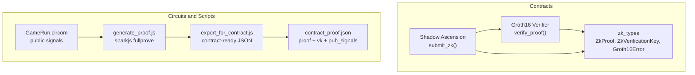
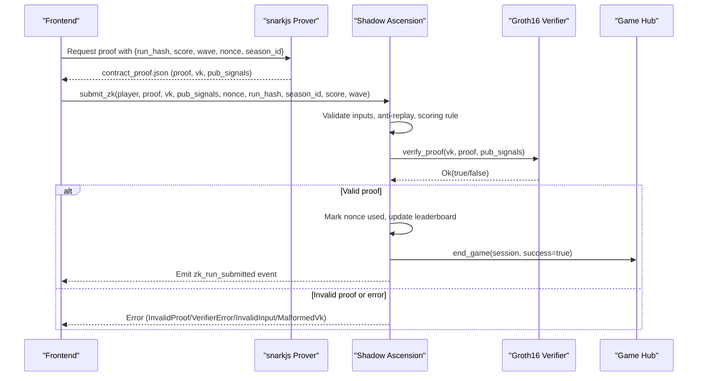
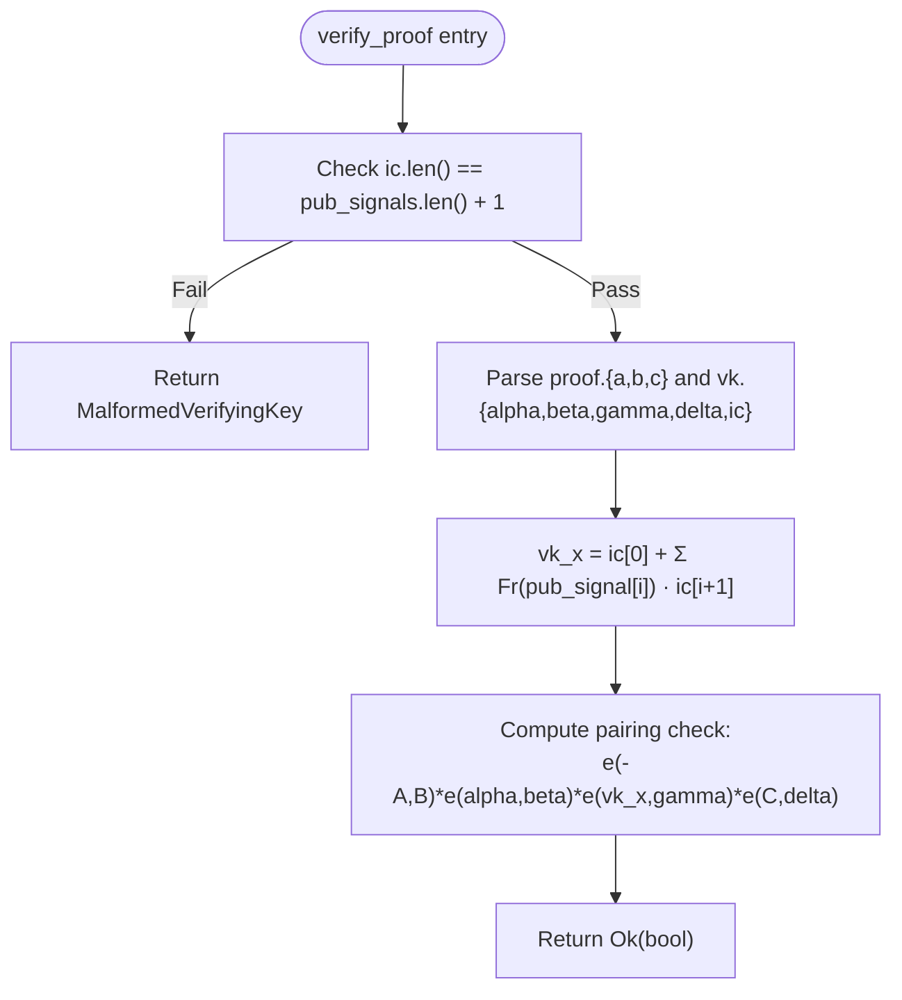
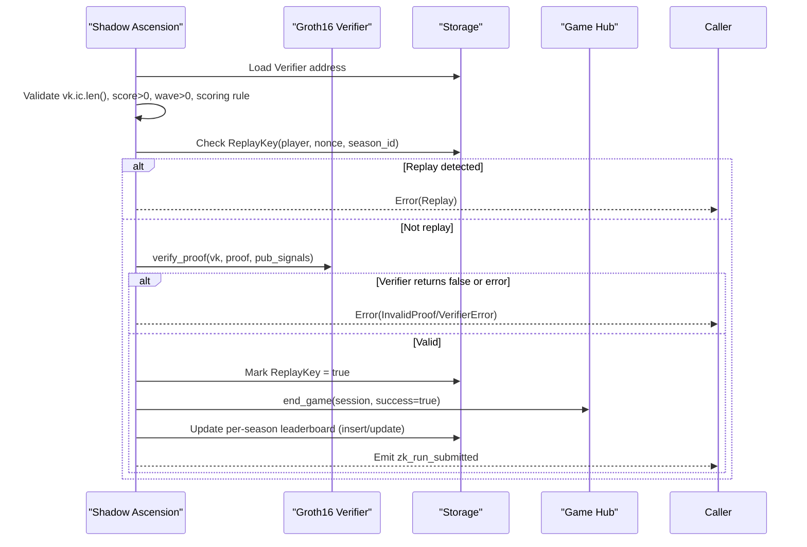
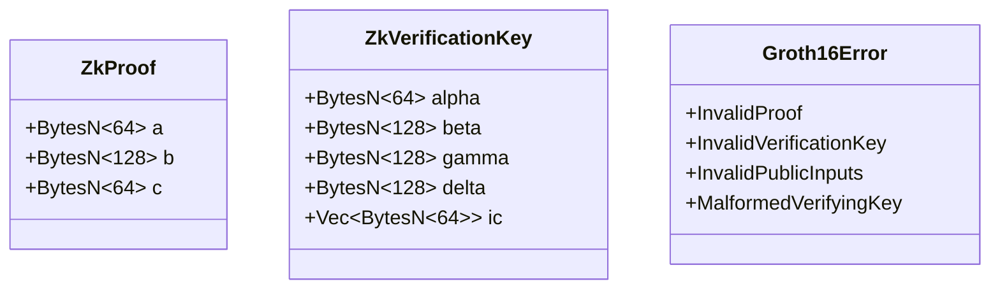
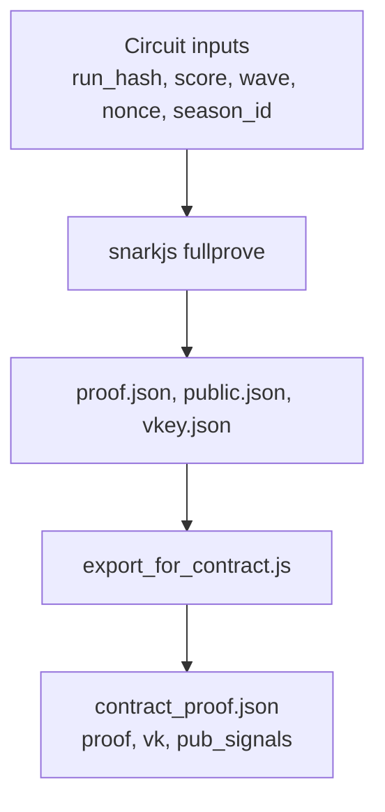
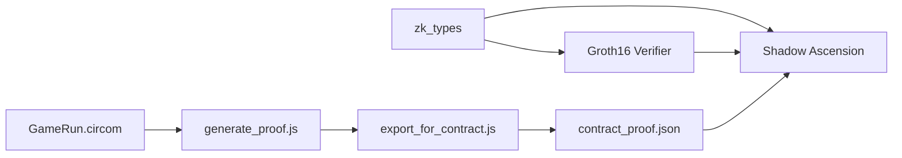

# Groth16 Verifier Contract

<cite>
**Referenced Files in This Document**
- [lib.rs](file://contracts/groth16_verifier/src/lib.rs)
- [Cargo.toml](file://contracts/groth16_verifier/Cargo.toml)
- [README.md](file://contracts/groth16_verifier/README.md)
- [lib.rs](file://contracts/shadow_ascension/src/lib.rs)
- [lib.rs](file://contracts/zk_types/src/lib.rs)
- [test.rs](file://contracts/groth16_verifier/src/test.rs)
- [tests.rs](file://contracts/shadow_ascension/src/tests.rs)
- [GameRun.circom](file://circuits/GameRun.circom)
- [generate_proof.js](file://scripts/zk/generate_proof.js)
- [export_for_contract.js](file://scripts/zk/export_for_contract.js)
- [contract_proof.json](file://circuits/build/contract_proof.json)
- [vkey.json](file://circuits/build/vkey.json)
- [ZK_AND_BALANCE.md](file://docs/ZK_AND_BALANCE.md)
- [E2E_VERIFICATION.md](file://docs/E2E_VERIFICATION.md)
- [DEPLOY_ZK_STEPS.md](file://docs/DEPLOY_ZK_STEPS.md)
</cite>

## Table of Contents
1. [Introduction](#introduction)
2. [Project Structure](#project-structure)
3. [Core Components](#core-components)
4. [Architecture Overview](#architecture-overview)
5. [Detailed Component Analysis](#detailed-component-analysis)
6. [Dependency Analysis](#dependency-analysis)
7. [Performance Considerations](#performance-considerations)
8. [Troubleshooting Guide](#troubleshooting-guide)
9. [Conclusion](#conclusion)
10. [Appendices](#appendices)

## Introduction
This document describes the Groth16 verifier contract used in Vibe-Coder’s ZK proof system on Stellar Soroban. It focuses on the BN254 pairing-friendly elliptic curve implementation, the Groth16 verification algorithm, and the integration with the Shadow Ascension contract that manages ranked leaderboards and reward distribution. The document explains how submit_zk validates proof format, checks verification keys, verifies public signals, and updates on-chain state accordingly. It also covers cryptographic primitives, batch verification considerations, error handling, performance characteristics, and practical integration with snarkjs.

## Project Structure
The ZK verification system is composed of three main parts:
- Groth16 Verifier: dedicated contract that performs BN254 pairing checks for Groth16 proofs.
- Shadow Ascension: game policy contract orchestrating ZK submission, anti-replay, leaderboard updates, and event emission.
- zk_types: shared data structures and error enums used by both contracts.

**Diagram sources**
- [lib.rs](file://contracts/groth16_verifier/src/lib.rs#L18-L56)
- [lib.rs](file://contracts/shadow_ascension/src/lib.rs#L159-L264)
- [lib.rs](file://contracts/zk_types/src/lib.rs#L27-L43)
- [GameRun.circom](file://circuits/GameRun.circom#L1-L34)
- [generate_proof.js](file://scripts/zk/generate_proof.js#L1-L46)
- [export_for_contract.js](file://scripts/zk/export_for_contract.js#L65-L86)
- [contract_proof.json](file://circuits/build/contract_proof.json#L1-L30)

**Section sources**
- [lib.rs](file://contracts/groth16_verifier/src/lib.rs#L1-L61)
- [lib.rs](file://contracts/shadow_ascension/src/lib.rs#L1-L314)
- [lib.rs](file://contracts/zk_types/src/lib.rs#L1-L44)

## Core Components
- Groth16 Verifier contract:
  - Purpose: single-responsibility BN254 Groth16 verification.
  - Inputs: verification key, proof, and public signals.
  - Output: boolean indicating whether the pairing check passes.
  - Error handling: returns a domain-specific error type for malformed inputs.
- Shadow Ascension contract:
  - Purpose: orchestrates ZK submission, anti-replay, leaderboard updates, and event emission.
  - Integrates with a Game Hub to finalize runs and manage sessions.
  - Enforces scoring rules and validates inputs before invoking the verifier.
- zk_types:
  - Defines ZkProof, ZkVerificationKey, and Groth16Error with sizes for BN254 elements.

**Section sources**
- [lib.rs](file://contracts/groth16_verifier/src/lib.rs#L18-L56)
- [lib.rs](file://contracts/shadow_ascension/src/lib.rs#L159-L264)
- [lib.rs](file://contracts/zk_types/src/lib.rs#L27-L43)

## Architecture Overview
The end-to-end ZK verification flow:
- Circuit defines public signals and constraints.
- snarkjs generates a Groth16 proof and verification key.
- Export script converts artifacts to contract-ready hex-encoded buffers.
- Frontend requests a proof from the prover and submits submit_zk with the proof, verification key, and public signals.
- Shadow Ascension validates inputs, checks anti-replay, and invokes the Groth16 Verifier.
- On success, it updates per-season leaderboard, emits an event, and notifies the Game Hub.

**Diagram sources**
- [lib.rs](file://contracts/shadow_ascension/src/lib.rs#L159-L264)
- [lib.rs](file://contracts/groth16_verifier/src/lib.rs#L23-L56)
- [export_for_contract.js](file://scripts/zk/export_for_contract.js#L65-L86)
- [contract_proof.json](file://circuits/build/contract_proof.json#L1-L30)

## Detailed Component Analysis

### Groth16 Verifier Contract
Responsibilities:
- Validate verification key shape (ic length vs number of public signals).
- Deserialize BN254 points from compact representations.
- Compute vk_x = ic[0] + Σ(pub_signal[i] · ic[i+1]) in G1.
- Perform the BN254 pairing check e(-A, B) · e(α, β) · e(vk_x, γ) · e(C, δ) ≟ 1.

Implementation highlights:
- Uses BN254 affine points and scalar field elements from the Soroban SDK.
- Performs group arithmetic in G1 and G2 and the final pairing check.
- Returns a boolean result; errors are represented via a dedicated error type.

**Diagram sources**
- [lib.rs](file://contracts/groth16_verifier/src/lib.rs#L23-L56)

**Section sources**
- [lib.rs](file://contracts/groth16_verifier/src/lib.rs#L18-L56)
- [README.md](file://contracts/groth16_verifier/README.md#L1-L48)

### Shadow Ascension Contract (submit_zk)
Responsibilities:
- Validate inputs: verification key shape, positive score and wave, adherence to scoring rule.
- Anti-replay: track (player, nonce, season_id) to prevent reuse.
- Invoke the Groth16 Verifier and handle errors.
- Update per-season leaderboard and emit events.

Key behaviors:
- Enforces score ≥ wave × MIN_SCORE_PER_WAVE.
- Marks nonce as used upon successful verification.
- Calls Game Hub to finalize the run.
- Emits ZkRunSubmitted event on success.

**Diagram sources**
- [lib.rs](file://contracts/shadow_ascension/src/lib.rs#L159-L264)

**Section sources**
- [lib.rs](file://contracts/shadow_ascension/src/lib.rs#L159-L264)
- [tests.rs](file://contracts/shadow_ascension/src/tests.rs#L100-L297)

### zk_types: Data Structures and Errors
- ZkProof: three BN254 points (A, B, C) serialized as BytesN<64>, BytesN<128>, BytesN<64>.
- ZkVerificationKey: α∈G1, β, γ, δ∈G2, and ic[]∈G1 with Ethereum-compatible uncompressed encodings.
- Groth16Error: domain-specific errors for invalid proof, VK, or public inputs, plus malformed VK.

**Diagram sources**
- [lib.rs](file://contracts/zk_types/src/lib.rs#L27-L43)

**Section sources**
- [lib.rs](file://contracts/zk_types/src/lib.rs#L16-L43)

### Circuit and Proof Generation
- GameRun.circom exposes run_hash_hi, run_hash_lo, score, wave, nonce, season_id as public signals and enforces score ≥ wave × 10.
- generate_proof.js orchestrates snarkjs fullprove and exports contract-ready JSON.
- export_for_contract.js converts snarkjs outputs to the expected BN254 encodings and sizes.

**Diagram sources**
- [GameRun.circom](file://circuits/GameRun.circom#L1-L34)
- [generate_proof.js](file://scripts/zk/generate_proof.js#L36-L45)
- [export_for_contract.js](file://scripts/zk/export_for_contract.js#L65-L86)
- [contract_proof.json](file://circuits/build/contract_proof.json#L1-L30)
- [vkey.json](file://circuits/build/vkey.json#L1-L119)

**Section sources**
- [GameRun.circom](file://circuits/GameRun.circom#L1-L34)
- [generate_proof.js](file://scripts/zk/generate_proof.js#L1-L46)
- [export_for_contract.js](file://scripts/zk/export_for_contract.js#L1-L95)
- [contract_proof.json](file://circuits/build/contract_proof.json#L1-L30)
- [vkey.json](file://circuits/build/vkey.json#L1-L119)

## Dependency Analysis
- Groth16 Verifier depends on zk_types for shared types and on Soroban SDK BN254 primitives.
- Shadow Ascension depends on zk_types and invokes the Groth16 Verifier contract.
- Circuit and scripts feed the contracts with properly encoded proof and verification key.

**Diagram sources**
- [Cargo.toml](file://contracts/groth16_verifier/Cargo.toml#L11-L13)
- [lib.rs](file://contracts/groth16_verifier/src/lib.rs#L13)
- [lib.rs](file://contracts/shadow_ascension/src/lib.rs#L10)
- [export_for_contract.js](file://scripts/zk/export_for_contract.js#L65-L86)

**Section sources**
- [Cargo.toml](file://contracts/groth16_verifier/Cargo.toml#L11-L13)
- [lib.rs](file://contracts/groth16_verifier/src/lib.rs#L13)
- [lib.rs](file://contracts/shadow_ascension/src/lib.rs#L10)

## Performance Considerations
- BN254 pairing costs dominate verification performance on Soroban. The verifier performs a single pairing check per call.
- Resource simulation: use the provided Stellar CLI command to simulate CPU/memory envelopes with a real proof payload.
- Batch verification: the current implementation does not support batching multiple proofs in a single call; each verification incurs full pairing computation.
- Storage and hashing: submit_zk writes anti-replay keys and sorts leaderboard entries; consider the cost of persistent storage operations and sorting for high-frequency runs.

[No sources needed since this section provides general guidance]

## Troubleshooting Guide
Common failure modes and diagnostics:
- Malformed verifying key:
  - Symptom: submit_zk returns VerifierError or panics during VK shape validation.
  - Cause: ic.len() ≠ pub_signals.len() + 1.
  - Fix: regenerate verification key with matching public signals count.
- Invalid proof:
  - Symptom: verifier returns false; submit_zk returns InvalidProof.
  - Cause: proof does not satisfy the Groth16 equation or tampered values.
  - Fix: regenerate proof using the correct circuit and inputs.
- Anti-replay violation:
  - Symptom: submit_zk returns Replay.
  - Cause: same (player, nonce, season_id) submitted twice.
  - Fix: increment nonce per run or use a fresh season_id.
- Invalid input scoring rule:
  - Symptom: submit_zk returns InvalidInput.
  - Cause: score < wave × MIN_SCORE_PER_WAVE or non-positive score/wave.
  - Fix: adjust run outcome to meet the rule before submission.
- Verifier not set:
  - Symptom: submit_zk panics or returns VerifierNotSet.
  - Cause: policy contract has no verifier address configured.
  - Fix: deploy verifier and call set_verifier on policy.

Validation references:
- Unit tests for malformed VK rejection and invalid/valid proof behavior.
- Integration tests covering anti-replay, invalid proof, and valid submission.

**Section sources**
- [lib.rs](file://contracts/groth16_verifier/src/lib.rs#L31-L33)
- [lib.rs](file://contracts/shadow_ascension/src/lib.rs#L173-L220)
- [test.rs](file://contracts/groth16_verifier/src/test.rs#L23-L73)
- [tests.rs](file://contracts/shadow_ascension/src/tests.rs#L71-L297)

## Conclusion
The Groth16 verifier contract provides a minimal, focused BN254 pairing-based verification service integrated with Shadow Ascension to power a provably fair, ranked leaderboard. Together with the circuit and snarkjs pipeline, it enables secure, on-chain ZK submissions with robust input validation, anti-replay protection, and transparent event emission. For production deployments, ensure the network supports BN254, simulate resource usage, and follow the deployment and end-to-end verification steps.

[No sources needed since this section summarizes without analyzing specific files]

## Appendices

### Verification Workflow Examples
- End-to-end demo checklist and automated tests:
  - Use npm scripts to generate a real proof and run contract tests.
  - Confirm deploy steps and environment configuration for Testnet.

**Section sources**
- [E2E_VERIFICATION.md](file://docs/E2E_VERIFICATION.md#L18-L36)
- [DEPLOY_ZK_STEPS.md](file://docs/DEPLOY_ZK_STEPS.md#L19-L31)

### Security Considerations and Attack Vectors
- Input validation:
  - Always validate VK shape and public signals length before invoking the verifier.
  - Enforce scoring rule client-side and server-side to avoid wasted computations.
- Anti-replay:
  - Use unique nonces per run and per season; persist replay keys to prevent reuse.
- Prover integrity:
  - Prefer trusted or self-hosted provers; verify exported contract_proof.json against known-good artifacts.
- Curve and encoding correctness:
  - Ensure proper BN254 encodings and sizes; mismatches cause deserialization errors or incorrect pairing results.

[No sources needed since this section provides general guidance]

### Optimization Techniques for ZK Verification on Soroban
- Minimize contract calls:
  - Batch unrelated operations off-chain; keep verification as a single call.
- Reduce storage churn:
  - Use efficient leaderboard updates and avoid frequent re-sorting for very high throughput.
- Pre-validate inputs:
  - Validate scoring rule and VK shape in the client to reduce on-chain failures.
- Monitor resource usage:
  - Use simulation to estimate CPU and memory budgets and plan rate limits accordingly.

[No sources needed since this section provides general guidance]