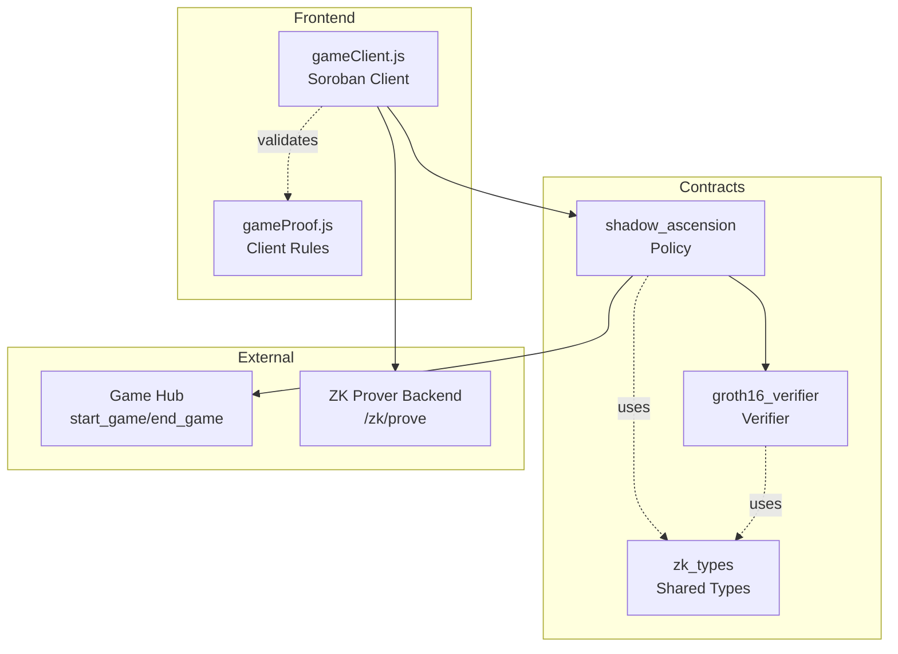
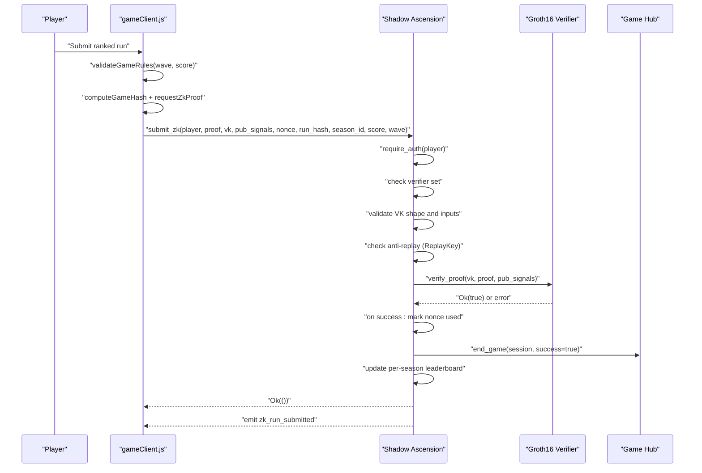
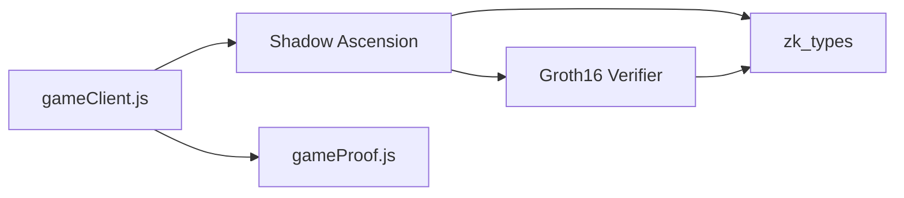

# Shadow Ascension Contract

<cite>
**Referenced Files in This Document**
- [lib.rs](file://contracts/shadow_ascension/src/lib.rs)
- [Cargo.toml](file://contracts/shadow_ascension/Cargo.toml)
- [tests.rs](file://contracts/shadow_ascension/src/tests.rs)
- [lib.rs (zk_types)](file://contracts/zk_types/src/lib.rs)
- [lib.rs (groth16_verifier)](file://contracts/groth16_verifier/src/lib.rs)
- [gameClient.js](file://src/contracts/gameClient.js)
- [gameProof.js](file://src/zk/gameProof.js)
- [README.md](file://README.md)
- [TECHNICAL_DOCUMENTATION.md](file://docs/TECHNICAL_DOCUMENTATION.md)
- [ZK_AND_BALANCE.md](file://docs/ZK_AND_BALANCE.md)
- [deploy_contracts_testnet.sh](file://scripts/deploy_contracts_testnet.sh)
</cite>

## Table of Contents
1. [Introduction](#introduction)
2. [Project Structure](#project-structure)
3. [Core Components](#core-components)
4. [Architecture Overview](#architecture-overview)
5. [Detailed Component Analysis](#detailed-component-analysis)
6. [Dependency Analysis](#dependency-analysis)
7. [Performance Considerations](#performance-considerations)
8. [Troubleshooting Guide](#troubleshooting-guide)
9. [Conclusion](#conclusion)
10. [Appendices](#appendices)

## Introduction
Shadow Ascension is Vibe-Coder’s main game policy contract deployed on Stellar/Soroban. It orchestrates game sessions, manages scoring, enforces fairness via zero-knowledge proof verification, and maintains per-season leaderboards. The contract integrates with a Game Hub for session lifecycle and a dedicated Groth16 verifier for BN254 pairing-based proof validation. It supports two submission modes:
- Casual submission via submit_result for quick, rule-enforced entries.
- Ranked submission via submit_zk for provably fair entries backed by a Groth16 proof.

The contract enforces a minimum score rule (score >= wave * MIN_SCORE_PER_WAVE), uses nonces to prevent replay, and organizes leaderboard data by season.

## Project Structure
The Shadow Ascension contract resides in the contracts/shadow_ascension module alongside shared ZK types and a Groth16 verifier. The frontend game client in src/contracts/gameClient.js integrates with the contract and the ZK prover backend.

**Diagram sources**
- [lib.rs](file://contracts/shadow_ascension/src/lib.rs#L70-L295)
- [lib.rs (groth16_verifier)](file://contracts/groth16_verifier/src/lib.rs#L15-L56)
- [lib.rs (zk_types)](file://contracts/zk_types/src/lib.rs#L27-L43)
- [gameClient.js](file://src/contracts/gameClient.js#L76-L249)
- [gameProof.js](file://src/zk/gameProof.js#L51-L63)

**Section sources**
- [README.md](file://README.md#L44-L78)
- [TECHNICAL_DOCUMENTATION.md](file://docs/TECHNICAL_DOCUMENTATION.md#L19-L40)

## Core Components
- Policy contract (Shadow Ascension): Implements game session orchestration, scoring rules, ZK verification, anti-replay, and leaderboard management.
- Groth16 Verifier: Stateless BN254 pairing-based proof checker.
- Shared ZK Types: Defines ZkProof, ZkVerificationKey, and Groth16Error for ABI compatibility.
- Frontend Client: Handles wallet signing, argument construction, ZK proof retrieval, and leaderboard queries.

Key responsibilities:
- start_match: Starts a game session via Game Hub and increments internal session counter.
- submit_result: Validates rule (score >= wave * MIN_SCORE_PER_WAVE), calls Game Hub end_game, and appends to legacy leaderboard.
- submit_zk: Verifies Groth16 proof, enforces anti-replay and input constraints, updates per-season leaderboard, emits event, and calls Game Hub end_game.
- get_leaderboard: Returns legacy leaderboard entries.
- get_leaderboard_by_season: Returns per-season ranked entries.

**Section sources**
- [lib.rs](file://contracts/shadow_ascension/src/lib.rs#L70-L295)
- [lib.rs (groth16_verifier)](file://contracts/groth16_verifier/src/lib.rs#L15-L56)
- [lib.rs (zk_types)](file://contracts/zk_types/src/lib.rs#L27-L43)
- [README.md](file://README.md#L49-L56)

## Architecture Overview
Shadow Ascension acts as a policy layer that:
- Stores a Game Hub address and session counter.
- Delegates session lifecycle to Game Hub via start_game and end_game.
- Enforces ZK verification via a separate verifier contract.
- Maintains two leaderboard stores: legacy (casual) and per-season (ranked).
- Emits events for external indexers.

**Diagram sources**
- [lib.rs](file://contracts/shadow_ascension/src/lib.rs#L159-L264)
- [lib.rs (groth16_verifier)](file://contracts/groth16_verifier/src/lib.rs#L23-L56)
- [gameClient.js](file://src/contracts/gameClient.js#L213-L249)

**Section sources**
- [TECHNICAL_DOCUMENTATION.md](file://docs/TECHNICAL_DOCUMENTATION.md#L29-L40)
- [ZK_AND_BALANCE.md](file://docs/ZK_AND_BALANCE.md#L20-L33)

## Detailed Component Analysis

### Shadow Ascension Contract API
Public functions and their roles:
- init(game_hub: Address): Initializes the contract with a Game Hub address and resets session counter.
- set_verifier(verifier: Address): Sets the Groth16 verifier contract address.
- start_match(player: Address) -> u32: Starts a match by calling Game Hub start_game and returns the new session id.
- submit_result(player: Address, wave: u32, score: i128) -> bool: Validates rule (score >= wave * MIN_SCORE_PER_WAVE), calls Game Hub end_game, appends to legacy leaderboard, and returns true on success.
- submit_zk(player: Address, proof: ZkProof, vk: ZkVerificationKey, pub_signals: Vec<BytesN<32>>, nonce: u64, run_hash: BytesN<32>, season_id: u32, score: u32, wave: u32) -> Result<(), ShadowAscensionError>: Verifies Groth16 proof, enforces anti-replay and input constraints, updates per-season leaderboard, emits event, and calls Game Hub end_game.
- get_leaderboard(limit: u32) -> Vec<LeaderboardEntry>: Returns legacy leaderboard entries up to limit.
- get_leaderboard_by_season(season_id: u32, limit: u32) -> Vec<ScoreEntry>: Returns per-season ranked entries up to limit.

Validation rules and constraints:
- Minimum score rule: score >= wave * MIN_SCORE_PER_WAVE (MIN_SCORE_PER_WAVE = 10).
- Input constraints for submit_zk: score > 0, wave > 0, vk.ic.len() == pub_signals.len() + 1.
- Anti-replay: ReplayKey (player, nonce, season_id) must be unique; once used, it is marked true.

Return values and events:
- submit_zk returns Ok(()) on success; emits ZkRunSubmitted event with player, season_id, score, wave, run_hash.
- get_leaderboard returns Vec<LeaderboardEntry>; get_leaderboard_by_season returns Vec<ScoreEntry>.

Storage and state:
- Persistent storage keys:
  - "Hub": Game Hub address.
  - "Session": u32 session counter.
  - "Verifier": Address of verifier contract.
  - "Leaderboard": Vec<LeaderboardEntry> for legacy mode.
  - LeaderboardKey { season_id }: Vec<ScoreEntry> for ranked mode.
- Anti-replay storage: ReplayKey -> bool.

Integration with Game Hub:
- start_match calls Game Hub start_game with game_id, session, player, system_player, and initial x/y values.
- submit_result and submit_zk both call Game Hub end_game(session, success=true).

**Section sources**
- [lib.rs](file://contracts/shadow_ascension/src/lib.rs#L76-L119)
- [lib.rs](file://contracts/shadow_ascension/src/lib.rs#L122-L154)
- [lib.rs](file://contracts/shadow_ascension/src/lib.rs#L159-L264)
- [lib.rs](file://contracts/shadow_ascension/src/lib.rs#L267-L294)

### Groth16 Verifier Contract
Responsibilities:
- verify_proof(vk: ZkVerificationKey, proof: ZkProof, pub_signals: Vec<BytesN<32>>) -> Result<bool, Groth16Error>.
- Validates vk.ic length equals pub_signals.len() + 1.
- Computes vk_x = ic[0] + sum(pub_signals[i] * ic[i+1]) and runs BN254 pairing check.

Error mapping:
- Malformed verifying key -> ShadowAscensionError::MalformedVk.
- Host errors or false result -> ShadowAscensionError::VerifierError or InvalidProof.

**Section sources**
- [lib.rs (groth16_verifier)](file://contracts/groth16_verifier/src/lib.rs#L23-L56)
- [lib.rs (zk_types)](file://contracts/zk_types/src/lib.rs#L16-L25)

### Frontend Integration (gameClient.js)
Key functions:
- startMatch(signerPublicKey, signTransaction): Calls start_match with player address.
- submitResult(signerPublicKey, signTransaction, wave, score): Calls submit_result with player, wave, and score.
- requestZkProof(baseUrl, payload): Requests a Groth16 proof from backend prover.
- submitZk(signerPublicKey, signTransaction, zk, nonce, runHashHex, seasonId, score, wave): Builds ScVal arguments and calls submit_zk.
- submitZkFromProver(signerPublicKey, signTransaction, proverUrl, payload): Convenience wrapper around requestZkProof and submitZk.
- getLeaderboard(limit): Simulates get_leaderboard and parses results.
- getLeaderboardBySeason(seasonId, limit): Simulates get_leaderboard_by_season and parses results.

Argument construction:
- Converts zk.proof, zk.vk, and pub_signals to ScVal for contract invocation.
- Validates game rules client-side before calling submitZk.

**Section sources**
- [gameClient.js](file://src/contracts/gameClient.js#L76-L95)
- [gameClient.js](file://src/contracts/gameClient.js#L103-L121)
- [gameClient.js](file://src/contracts/gameClient.js#L213-L249)
- [gameClient.js](file://src/contracts/gameClient.js#L278-L390)

### Anti-Replay Mechanism
- ReplayKey: (player, nonce, season_id) stored persistently as true after a successful submit_zk.
- Before verification, the contract checks if the key is already used; if so, returns Replay.
- The nonce is included as a public input in the ZK proof, preventing reuse of the same proof with a different nonce.

**Section sources**
- [lib.rs](file://contracts/shadow_ascension/src/lib.rs#L47-L54)
- [lib.rs](file://contracts/shadow_ascension/src/lib.rs#L190-L201)
- [ZK_AND_BALANCE.md](file://docs/ZK_AND_BALANCE.md#L36-L42)

### Seasonal Ranking System
- Per-season leaderboard keyed by LeaderboardKey { season_id }.
- Each entry is ScoreEntry { player, score }.
- On successful submit_zk, the player’s score is updated only if higher; leaderboard is sorted descending by score.

**Section sources**
- [lib.rs](file://contracts/shadow_ascension/src/lib.rs#L40-L46)
- [lib.rs](file://contracts/shadow_ascension/src/lib.rs#L235-L256)
- [TECHNICAL_DOCUMENTATION.md](file://docs/TECHNICAL_DOCUMENTATION.md#L38-L40)

### Data Structures and Complexity
- LeaderboardEntry: O(1) append; sorting is bubble-sort-like O(n^2) per update.
- ScoreEntry: O(n) scan to find/update player; O(n^2) sort per update.
- Anti-replay: O(1) lookup/set for ReplayKey.
- ZK verification: O(1) pairing check (fixed number of operations).

**Section sources**
- [lib.rs](file://contracts/shadow_ascension/src/lib.rs#L24-L38)
- [lib.rs](file://contracts/shadow_ascension/src/lib.rs#L297-L310)

## Dependency Analysis
- shadow_ascension depends on zk_types for ZK types and errors.
- groth16_verifier depends on zk_types for ZK types and uses Soroban BN254 crypto.
- gameClient.js depends on Stellar SDK and gameProof.js for client-side validation.

**Diagram sources**
- [Cargo.toml](file://contracts/shadow_ascension/Cargo.toml#L13-L15)
- [lib.rs (groth16_verifier)](file://contracts/groth16_verifier/src/lib.rs#L7-L13)
- [gameClient.js](file://src/contracts/gameClient.js#L1-L6)

**Section sources**
- [Cargo.toml](file://contracts/shadow_ascension/Cargo.toml#L13-L15)
- [lib.rs (zk_types)](file://contracts/zk_types/src/lib.rs#L7-L8)

## Performance Considerations
- Gas and simulation:
  - Use stellar contract invoke --sim-only to estimate CPU and memory for submit_zk and verify_proof.
  - Verification cost is dominated by BN254 pairing and group operations; fixed per verification.
- Storage growth:
  - Anti-replay keys: O(number of distinct (player, nonce, season_id)).
  - Leaderboards: O(number of players per season).
- Recommendations:
  - Limit season durations and leaderboard sizes to control storage growth.
  - Prefer batched reads for leaderboard queries (limit parameter).
  - Use nonce strategies that minimize collisions (e.g., timestamps or counters).

**Section sources**
- [TECHNICAL_DOCUMENTATION.md](file://docs/TECHNICAL_DOCUMENTATION.md#L300-L315)
- [ZK_AND_BALANCE.md](file://docs/ZK_AND_BALANCE.md#L100-L148)

## Troubleshooting Guide
Common errors and resolutions:
- VerifierNotSet: Ensure set_verifier has been called with a valid verifier address.
- MalformedVk: Verify vk.ic length equals pub_signals.len() + 1.
- InvalidInput: Ensure score > 0, wave > 0, and score >= wave * MIN_SCORE_PER_WAVE.
- Replay: Use a unique nonce per (player, season_id) submission.
- VerifierError: Indicates host error or invalid proof/public inputs; confirm VK correctness and proof generation.
- InvalidProof: Proof verification failed; re-generate proof with correct inputs.

Frontend validation:
- Client-side rule validation via validateGameRules prevents unnecessary transactions.
- submitZk performs additional validation and throws on failure.

**Section sources**
- [lib.rs](file://contracts/shadow_ascension/src/lib.rs#L12-L22)
- [lib.rs](file://contracts/shadow_ascension/src/lib.rs#L173-L188)
- [lib.rs (groth16_verifier)](file://contracts/groth16_verifier/src/lib.rs#L31-L33)
- [tests.rs](file://contracts/shadow_ascension/src/tests.rs#L71-L191)
- [gameClient.js](file://src/contracts/gameClient.js#L228-L231)

## Conclusion
Shadow Ascension provides a robust, provably fair framework for ranked gameplay on Stellar/Soroban. Its separation of concerns—policy, verifier, and shared types—ensures maintainability and security. The anti-replay mechanism, minimum score rule, and per-season leaderboards collectively uphold competitive integrity. The frontend client streamlines integration with wallet signing and ZK proof generation, enabling seamless user experiences.

## Appendices

### Practical Deployment and Invocation Examples
- Deployment (Testnet):
  - Build WASM for wasm32v1-none target.
  - Deploy verifier and policy contracts.
  - Initialize policy with Game Hub address.
  - Set verifier address on policy.
  - Configure frontend environment variables.

- Invocation examples:
  - Start a match: gameClient.startMatch(signerPublicKey, signTransaction).
  - Submit casual result: gameClient.submitResult(signerPublicKey, signTransaction, wave, score).
  - Submit ranked result: gameClient.submitZkFromProver(signerPublicKey, signTransaction, proverUrl, payload).

**Section sources**
- [deploy_contracts_testnet.sh](file://scripts/deploy_contracts_testnet.sh#L21-L60)
- [README.md](file://README.md#L69-L78)
- [gameClient.js](file://src/contracts/gameClient.js#L76-L95)
- [gameClient.js](file://src/contracts/gameClient.js#L258-L273)

### Function Signatures and Parameter Types
- init(game_hub: Address)
- set_verifier(verifier: Address)
- start_match(player: Address) -> u32
- submit_result(player: Address, wave: u32, score: i128) -> bool
- submit_zk(player: Address, proof: ZkProof, vk: ZkVerificationKey, pub_signals: Vec<BytesN<32>>, nonce: u64, run_hash: BytesN<32>, season_id: u32, score: u32, wave: u32) -> Result<(), ShadowAscensionError>
- get_leaderboard(limit: u32) -> Vec<LeaderboardEntry>
- get_leaderboard_by_season(season_id: u32, limit: u32) -> Vec<ScoreEntry>

**Section sources**
- [lib.rs](file://contracts/shadow_ascension/src/lib.rs#L76-L119)
- [lib.rs](file://contracts/shadow_ascension/src/lib.rs#L122-L154)
- [lib.rs](file://contracts/shadow_ascension/src/lib.rs#L159-L264)
- [lib.rs](file://contracts/shadow_ascension/src/lib.rs#L267-L294)

### Error Codes and Mappings
- ShadowAscensionError:
  - VerifierNotSet
  - Replay
  - InvalidProof
  - VerifierError
  - InvalidInput
  - MalformedVk

Groth16Error mapped to ShadowAscensionError:
- MalformedVerifyingKey -> MalformedVk
- Other verifier errors -> VerifierError

**Section sources**
- [lib.rs](file://contracts/shadow_ascension/src/lib.rs#L12-L22)
- [lib.rs (groth16_verifier)](file://contracts/groth16_verifier/src/lib.rs#L16-L25)