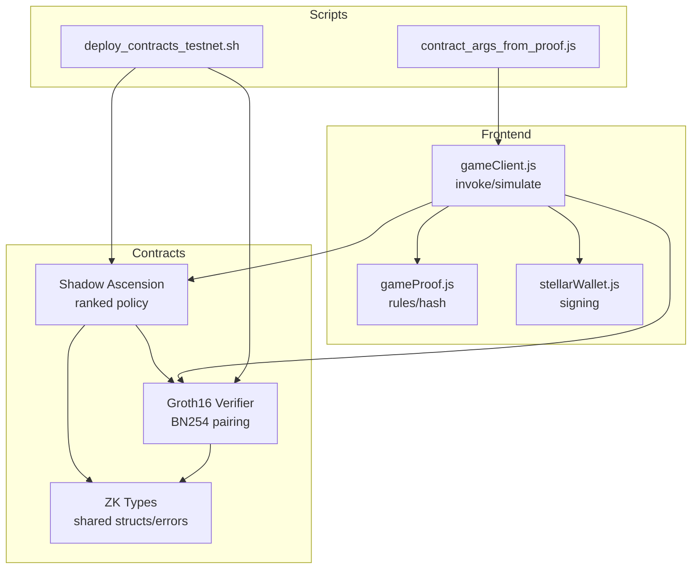
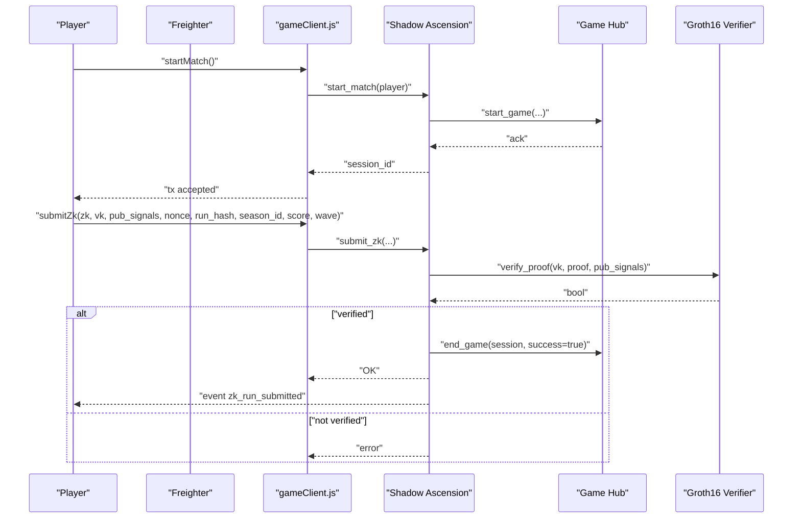
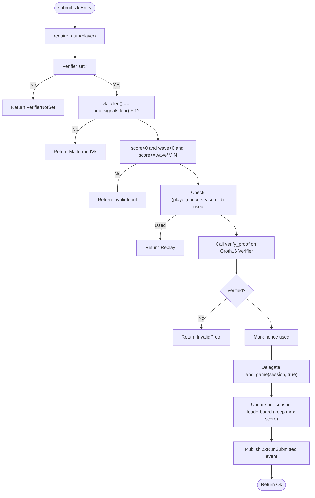
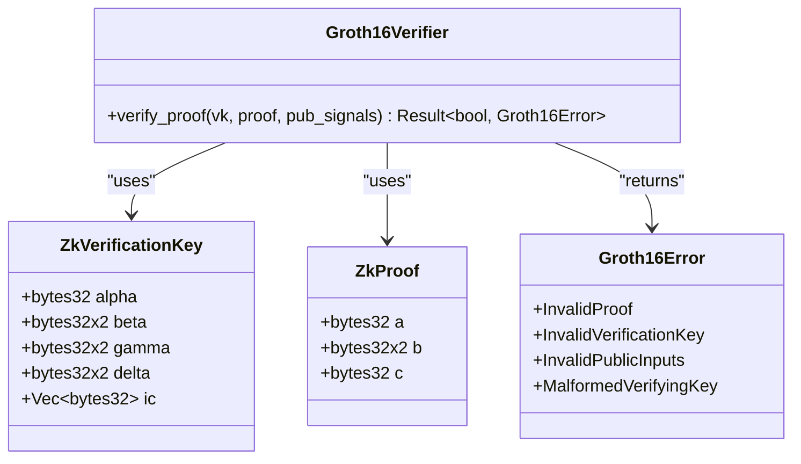
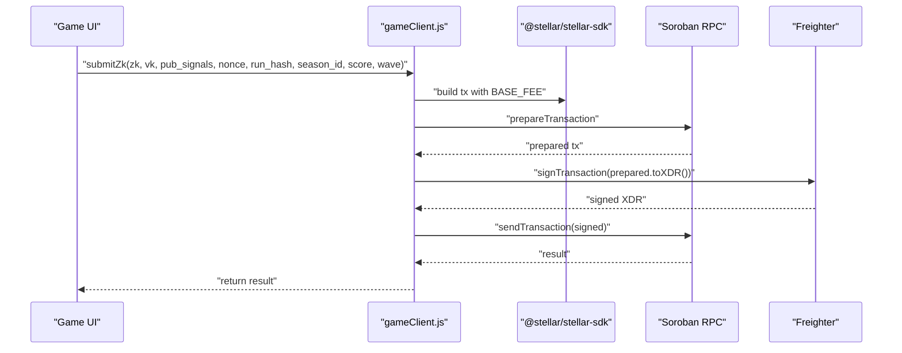
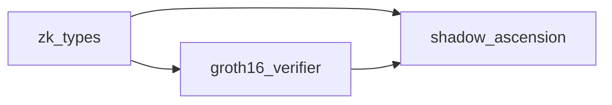

# Soroban Contract API

<cite>
**Referenced Files in This Document**
- [lib.rs](file://contracts/shadow_ascension/src/lib.rs)
- [lib.rs](file://contracts/groth16_verifier/src/lib.rs)
- [lib.rs](file://contracts/zk_types/src/lib.rs)
- [Cargo.toml](file://contracts/shadow_ascension/Cargo.toml)
- [Cargo.toml](file://contracts/groth16_verifier/Cargo.toml)
- [Cargo.toml](file://contracts/zk_types/Cargo.toml)
- [Cargo.toml](file://contracts/Cargo.toml)
- [gameClient.js](file://src/contracts/gameClient.js)
- [gameProof.js](file://src/zk/gameProof.js)
- [deploy_contracts_testnet.sh](file://scripts/deploy_contracts_testnet.sh)
- [contract_args_from_proof.js](file://scripts/zk/contract_args_from_proof.js)
- [stellarWallet.js](file://src/utils/stellarWallet.js)
- [tests.rs](file://contracts/shadow_ascension/src/tests.rs)
</cite>

## Table of Contents
1. [Introduction](#introduction)
2. [Project Structure](#project-structure)
3. [Core Components](#core-components)
4. [Architecture Overview](#architecture-overview)
5. [Detailed Component Analysis](#detailed-component-analysis)
6. [Dependency Analysis](#dependency-analysis)
7. [Performance Considerations](#performance-considerations)
8. [Troubleshooting Guide](#troubleshooting-guide)
9. [Conclusion](#conclusion)
10. [Appendices](#appendices)

## Introduction
This document describes the Soroban contract API for Vibe-Coder’s Shadow Ascension integration on Stellar. It covers:
- Shadow Ascension contract functions: initialization, match lifecycle, ranked ZK submission, and leaderboard queries.
- Groth16 verifier contract interface for BN254 pairing-based proof verification.
- Frontend integration via gameClient.js for contract invocation, argument formatting, and response handling.
- Transaction signing workflows using Freighter wallet.
- Error handling, anti-replay, and event emission details.
- Practical deployment steps and network-specific considerations.

## Project Structure
The repository organizes contracts and integration code as follows:
- Contracts:
  - shadow_ascension: game policy with leaderboard and ZK submission.
  - groth16_verifier: BN254 Groth16 verifier.
  - zk_types: shared ZK data structures and errors.
- Frontend:
  - gameClient.js: contract invocation helpers and simulation utilities.
  - gameProof.js: client-side rule validation and run hash computation.
  - stellarWallet.js: Freighter wallet integration for signing.
- Scripts:
  - deploy_contracts_testnet.sh: end-to-end deployment to Testnet.
  - contract_args_from_proof.js: build invoke arguments from circuit outputs.

**Diagram sources**
- [lib.rs](file://contracts/shadow_ascension/src/lib.rs#L70-L295)
- [lib.rs](file://contracts/groth16_verifier/src/lib.rs#L15-L57)
- [lib.rs](file://contracts/zk_types/src/lib.rs#L16-L44)
- [gameClient.js](file://src/contracts/gameClient.js#L1-L401)
- [gameProof.js](file://src/zk/gameProof.js#L1-L78)
- [stellarWallet.js](file://src/utils/stellarWallet.js#L1-L115)
- [deploy_contracts_testnet.sh](file://scripts/deploy_contracts_testnet.sh#L1-L70)
- [contract_args_from_proof.js](file://scripts/zk/contract_args_from_proof.js#L1-L46)

**Section sources**
- [Cargo.toml](file://contracts/Cargo.toml#L1-L4)
- [Cargo.toml](file://contracts/shadow_ascension/Cargo.toml#L1-L30)
- [Cargo.toml](file://contracts/groth16_verifier/Cargo.toml#L1-L22)
- [Cargo.toml](file://contracts/zk_types/Cargo.toml#L1-L13)

## Core Components
- Shadow Ascension contract (ranked policy)
  - Initializes with a Game Hub address and a session counter.
  - Supports match lifecycle via start_match and end_game delegation to the Game Hub.
  - Provides submit_result for legacy casual mode and submit_zk for ranked ZK submissions.
  - Exposes get_leaderboard and get_leaderboard_by_season for querying leaderboards.
  - Emits ZkRunSubmitted event on successful ranked submissions.
- Groth16 Verifier contract (BN254)
  - Performs pairing checks against verification keys and public inputs.
  - Returns boolean verification outcomes or specific Groth16Error values.
- ZK Types
  - Defines ZkProof, ZkVerificationKey, Groth16Error, and serialization sizes for BN254 elements.
- Frontend Integration
  - gameClient.js: builds, signs, and submits transactions; simulates reads; formats arguments for ScVal.
  - gameProof.js: validates game rules and computes run hash for binding.
  - stellarWallet.js: connects Freighter, caches address, and signs transactions.

**Section sources**
- [lib.rs](file://contracts/shadow_ascension/src/lib.rs#L70-L295)
- [lib.rs](file://contracts/groth16_verifier/src/lib.rs#L15-L57)
- [lib.rs](file://contracts/zk_types/src/lib.rs#L16-L44)
- [gameClient.js](file://src/contracts/gameClient.js#L1-L401)
- [gameProof.js](file://src/zk/gameProof.js#L1-L78)
- [stellarWallet.js](file://src/utils/stellarWallet.js#L1-L115)

## Architecture Overview
The system separates concerns:
- Game logic and ranking live in Shadow Ascension.
- Cryptographic verification is delegated to Groth16 Verifier.
- Frontend handles wallet signing and argument formatting, then invokes contracts.

**Diagram sources**
- [lib.rs](file://contracts/shadow_ascension/src/lib.rs#L87-L119)
- [lib.rs](file://contracts/shadow_ascension/src/lib.rs#L159-L264)
- [lib.rs](file://contracts/groth16_verifier/src/lib.rs#L23-L56)
- [gameClient.js](file://src/contracts/gameClient.js#L76-L80)
- [gameClient.js](file://src/contracts/gameClient.js#L213-L249)

## Detailed Component Analysis

### Shadow Ascension Contract API
- Initialization
  - Function: init(game_hub)
  - Purpose: Store Game Hub address and initialize session counter.
  - Transaction requirement: Requires deployer authority; invoked once post-deployment.
- Verifier Management
  - Function: set_verifier(verifier)
  - Purpose: Register the Groth16 Verifier contract address.
  - Transaction requirement: Must be called by authorized account after deployment.
- Match Lifecycle
  - Function: start_match(player) -> u32
  - Behavior: Increments session, delegates to Game Hub via start_game with contract address, session, player, and system player.
  - Authentication: Requires player.require_auth().
  - Transaction requirement: Signed by player.
- Legacy Casual Submission
  - Function: submit_result(player, wave, score) -> bool
  - Rules: score must be at least wave * MIN_SCORE_PER_WAVE; otherwise returns false.
  - Behavior: Delegates to Game Hub end_game with success=true and updates a casual leaderboard.
  - Authentication: Requires player.require_auth().
  - Transaction requirement: Signed by player.
- Ranked ZK Submission
  - Function: submit_zk(player, proof, vk, pub_signals, nonce, run_hash, season_id, score, wave) -> Result<(), ShadowAscensionError>
  - Pre-checks:
    - Verifier must be set.
    - vk.ic length equals pub_signals length + 1.
    - score > 0 and wave > 0.
    - score >= wave * MIN_SCORE_PER_WAVE.
    - Anti-replay: (player, nonce, season_id) must be unused.
  - Verification:
    - Invokes Groth16 Verifier verify_proof; returns error on mismatch or verifier error.
  - Post-processing:
    - Marks nonce as used.
    - Delegates to Game Hub end_game with success=true.
    - Updates per-season leaderboard (ScoreEntry: player, score) keeping highest score.
    - Emits ZkRunSubmitted event with player, season_id, score, wave, run_hash.
  - Authentication: Requires player.require_auth().
  - Transaction requirement: Signed by player.
- Leaderboard Queries
  - Function: get_leaderboard_by_season(season_id, limit) -> Vec<ScoreEntry>
  - Returns top entries for a given season ordered by score descending.
  - Function: get_leaderboard(limit) -> Vec<LeaderboardEntry>
  - Returns casual leaderboard entries ordered by score descending.
  - Transaction requirement: Read-only simulation via frontend helpers.

**Diagram sources**
- [lib.rs](file://contracts/shadow_ascension/src/lib.rs#L159-L264)
- [lib.rs](file://contracts/groth16_verifier/src/lib.rs#L23-L56)

**Section sources**
- [lib.rs](file://contracts/shadow_ascension/src/lib.rs#L76-L119)
- [lib.rs](file://contracts/shadow_ascension/src/lib.rs#L122-L154)
- [lib.rs](file://contracts/shadow_ascension/src/lib.rs#L159-L264)
- [lib.rs](file://contracts/shadow_ascension/src/lib.rs#L267-L294)

### Groth16 Verifier Contract Interface
- Function: verify_proof(vk, proof, pub_signals) -> Result<bool, Groth16Error>
- Inputs:
  - vk: ZkVerificationKey with alpha, beta, gamma, delta, ic vector.
  - proof: ZkProof with a, b, c.
  - pub_signals: vector of 32-byte field elements.
- Validation:
  - Checks vk.ic length equals pub_signals length + 1; otherwise returns MalformedVerifyingKey.
- Computation:
  - Computes vk_x = ic[0] + sum(pub_signals[i] * ic[i+1]) using BN254 arithmetic.
  - Performs pairing check e(-A, B) * e(alpha, beta) * e(vk_x, gamma) * e(C, delta) == 1.
- Output:
  - Ok(true) if pairing check passes; Ok(false) otherwise.
  - Err(Groth16Error) for malformed inputs.

**Diagram sources**
- [lib.rs](file://contracts/groth16_verifier/src/lib.rs#L15-L57)
- [lib.rs](file://contracts/zk_types/src/lib.rs#L27-L44)

**Section sources**
- [lib.rs](file://contracts/groth16_verifier/src/lib.rs#L23-L56)
- [lib.rs](file://contracts/zk_types/src/lib.rs#L16-L44)

### ZK Types and Serialization
- ZkProof: three BN254 group elements (a: G1, b: G2, c: G1).
- ZkVerificationKey: affine encodings of BN254 points with ic vector.
- Sizes:
  - G1: 64 bytes
  - G2: 128 bytes
  - Fr: 32 bytes
- Errors:
  - Groth16Error enumerates invalid proof, VK, public inputs, and malformed VK.

**Section sources**
- [lib.rs](file://contracts/zk_types/src/lib.rs#L9-L14)
- [lib.rs](file://contracts/zk_types/src/lib.rs#L16-L44)

### Frontend Integration: gameClient.js
- Environment and Contract ID
  - Reads VITE_SHADOW_ASCENSION_CONTRACT_ID from environment.
  - Defaults to Testnet RPC and passphrase.
- Invocation Pattern
  - Builds Transaction with BASE_FEE, networkPassphrase, and timeout.
  - Prepares transaction via server.prepareTransaction, signs via wallet, and sends.
  - Throws on RPC error status.
- Argument Formatting
  - Converts player public key to Address ScVal.
  - Encodes i128 scores and u32 values to ScVal.
  - Converts BN254 proof, VK, and pub_signals to ScVal maps and vectors.
  - Ensures run_hash is 32 bytes.
- Methods
  - startMatch(): calls start_match(player).
  - submitResult(): calls submit_result(player, wave, score).
  - submitZk(): calls submit_zk with formatted ScVal arguments.
  - submitZkFromProver(): requests proof from backend, converts to zk, then calls submitZk.
  - getLeaderboard(limit): simulates get_leaderboard and parses result.
  - getLeaderboardBySeason(seasonId, limit): simulates get_leaderboard_by_season and parses result.
- Simulation Utilities
  - Uses simulateTransaction for read-only calls without fees.

**Diagram sources**
- [gameClient.js](file://src/contracts/gameClient.js#L33-L63)
- [gameClient.js](file://src/contracts/gameClient.js#L213-L249)

**Section sources**
- [gameClient.js](file://src/contracts/gameClient.js#L8-L28)
- [gameClient.js](file://src/contracts/gameClient.js#L33-L63)
- [gameClient.js](file://src/contracts/gameClient.js#L76-L95)
- [gameClient.js](file://src/contracts/gameClient.js#L213-L249)
- [gameClient.js](file://src/contracts/gameClient.js#L278-L327)
- [gameClient.js](file://src/contracts/gameClient.js#L333-L390)

### Transaction Signing Workflow
- Freighter Integration
  - connect(): requests access and caches address.
  - getAddress(): returns cached address.
  - signTransaction(xdr, networkPassphrase): signs with Freighter and returns signed XDR.
- Frontend Usage
  - gameClient.js invokes signTransaction with prepared transaction XDR.
  - Uses Testnet passphrase by default.

**Section sources**
- [stellarWallet.js](file://src/utils/stellarWallet.js#L39-L53)
- [stellarWallet.js](file://src/utils/stellarWallet.js#L104-L114)
- [gameClient.js](file://src/contracts/gameClient.js#L56-L62)

### Event Emission Details
- Event: ZkRunSubmitted
  - Emitted on successful submit_zk.
  - Payload: player, season_id, score, wave, run_hash.
  - Publish mechanism: events().publish(...).

**Section sources**
- [lib.rs](file://contracts/shadow_ascension/src/lib.rs#L56-L65)
- [lib.rs](file://contracts/shadow_ascension/src/lib.rs#L258-L261)

### Practical Examples

- Deployment to Testnet
  - Build WASM for wasm32v1-none target.
  - Deploy verifier and policy contracts.
  - Initialize policy with Game Hub address.
  - Set verifier on policy.
  - Configure VITE_SHADOW_ASCENSION_CONTRACT_ID in environment.

- Calling Functions from Frontend
  - Start a match: call startMatch with signer public key and signTransaction.
  - Submit result: call submitResult with wave and score.
  - Submit ZK: call submitZk with zk.proof, zk.vk, pub_signals, nonce, run_hash, season_id, score, wave.
  - Query leaderboards: call getLeaderboard(limit) or getLeaderboardBySeason(seasonId, limit).

- Backend Proof Generation (Optional)
  - Use requestZkProof to obtain contract-proof-ready payload from backend.
  - Convert to zk object with contractProofToZk.
  - Call submitZkFromProver to request proof and submit in one step.

**Section sources**
- [deploy_contracts_testnet.sh](file://scripts/deploy_contracts_testnet.sh#L17-L70)
- [gameClient.js](file://src/contracts/gameClient.js#L76-L95)
- [gameClient.js](file://src/contracts/gameClient.js#L103-L121)
- [gameClient.js](file://src/contracts/gameClient.js#L258-L273)

## Dependency Analysis
- Workspace composition
  - shadow_ascension depends on zk_types.
  - groth16_verifier depends on zk_types.
  - shadow_ascension also depends on groth16_verifier for verification.
- Build targets
  - wasm32v1-none required for Soroban Testnet.
- Frontend dependencies
  - @stellar/stellar-sdk for RPC, transactions, and ScVal conversion.
  - @stellar/freighter-api for wallet signing.

**Diagram sources**
- [Cargo.toml](file://contracts/shadow_ascension/Cargo.toml#L14-L15)
- [Cargo.toml](file://contracts/groth16_verifier/Cargo.toml#L12-L13)
- [Cargo.toml](file://contracts/zk_types/Cargo.toml#L11-L12)

**Section sources**
- [Cargo.toml](file://contracts/Cargo.toml#L1-L4)
- [Cargo.toml](file://contracts/shadow_ascension/Cargo.toml#L14-L15)
- [Cargo.toml](file://contracts/groth16_verifier/Cargo.toml#L12-L13)
- [Cargo.toml](file://contracts/zk_types/Cargo.toml#L11-L12)

## Performance Considerations
- Gas Optimization Tips
  - Prefer read-only simulations for leaderboard queries to avoid fees.
  - Batch updates carefully; leaderboard sorting is O(n^2) in current implementation—keep season leaderboards reasonably sized.
  - Use minimal pub_signals and compact run_hash to reduce argument size.
- Network-Specific Considerations
  - Testnet requires wasm32v1-none target; mainnet may differ—build accordingly.
  - Use appropriate network passphrase and RPC endpoint per network.
- Anti-replay Costs
  - Storing and checking ReplayKey adds persistent storage writes; ensure nonce uniqueness to minimize retries.

[No sources needed since this section provides general guidance]

## Troubleshooting Guide
- Common Errors from Shadow Ascension
  - VerifierNotSet: set_verifier was not called or not set correctly.
  - Replay: nonce already used for (player, season_id).
  - InvalidProof: verifier returned false or proof mismatch.
  - VerifierError: error thrown by verifier contract.
  - InvalidInput: score or wave invalid, or score below progression threshold.
  - MalformedVk: vk.ic length does not match pub_signals + 1.
- Frontend Checks
  - Ensure VITE_SHADOW_ASCENSION_CONTRACT_ID is configured.
  - Validate zk.proof, zk.vk, pub_signals shapes and sizes.
  - Confirm run_hash is 32 bytes and season_id/score/wave are positive.
- Tests Reference
  - Integration tests demonstrate verifier-not-set, anti-replay, malformed VK, invalid input, and valid submission scenarios.

**Section sources**
- [lib.rs](file://contracts/shadow_ascension/src/lib.rs#L12-L22)
- [tests.rs](file://contracts/shadow_ascension/src/tests.rs#L71-L98)
- [tests.rs](file://contracts/shadow_ascension/src/tests.rs#L100-L150)
- [tests.rs](file://contracts/shadow_ascension/src/tests.rs#L152-L191)
- [tests.rs](file://contracts/shadow_ascension/src/tests.rs#L193-L223)
- [tests.rs](file://contracts/shadow_ascension/src/tests.rs#L225-L254)
- [tests.rs](file://contracts/shadow_ascension/src/tests.rs#L256-L297)

## Conclusion
The Shadow Ascension integration leverages a clean separation between game policy, cryptographic verification, and frontend interaction. By following the documented APIs, argument formatting, and signing workflows, developers can reliably deploy, interact with, and troubleshoot the ranked ZK submission pipeline on Soroban.

[No sources needed since this section summarizes without analyzing specific files]

## Appendices

### Function Signatures and Parameter Requirements

- Shadow Ascension
  - init(game_hub: Address)
  - set_verifier(verifier: Address)
  - start_match(player: Address) -> u32
  - submit_result(player: Address, wave: u32, score: i128) -> bool
  - submit_zk(player: Address, proof: ZkProof, vk: ZkVerificationKey, pub_signals: Vec<BytesN<32>>, nonce: u64, run_hash: BytesN<32>, season_id: u32, score: u32, wave: u32) -> Result<(), ShadowAscensionError>
  - get_leaderboard_by_season(season_id: u32, limit: u32) -> Vec<ScoreEntry>
  - get_leaderboard(limit: u32) -> Vec<LeaderboardEntry>

- Groth16 Verifier
  - verify_proof(vk: ZkVerificationKey, proof: ZkProof, pub_signals: Vec<BytesN<32>>) -> Result<bool, Groth16Error>

**Section sources**
- [lib.rs](file://contracts/shadow_ascension/src/lib.rs#L76-L119)
- [lib.rs](file://contracts/shadow_ascension/src/lib.rs#L122-L154)
- [lib.rs](file://contracts/shadow_ascension/src/lib.rs#L159-L264)
- [lib.rs](file://contracts/shadow_ascension/src/lib.rs#L267-L294)
- [lib.rs](file://contracts/groth16_verifier/src/lib.rs#L23-L56)

### Transaction Requirements
- All mutating functions require signature from the player address passed as the first argument.
- Use BASE_FEE, networkPassphrase, and timeout as configured in gameClient.js.
- Simulations for read-only queries use a dummy account and simulateTransaction.

**Section sources**
- [gameClient.js](file://src/contracts/gameClient.js#L48-L62)
- [gameClient.js](file://src/contracts/gameClient.js#L294-L300)

### Network-Specific Considerations
- Testnet:
  - RPC endpoint and passphrase constants are used by default in gameClient.js.
  - Build target wasm32v1-none for Soroban Testnet.
- Mainnet:
  - Adjust RPC endpoint and passphrase; ensure correct contract IDs and build target.

**Section sources**
- [gameClient.js](file://src/contracts/gameClient.js#L8-L10)
- [deploy_contracts_testnet.sh](file://scripts/deploy_contracts_testnet.sh#L17-L26)