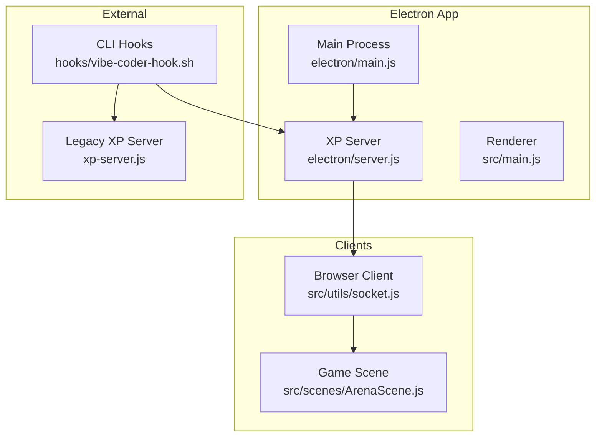
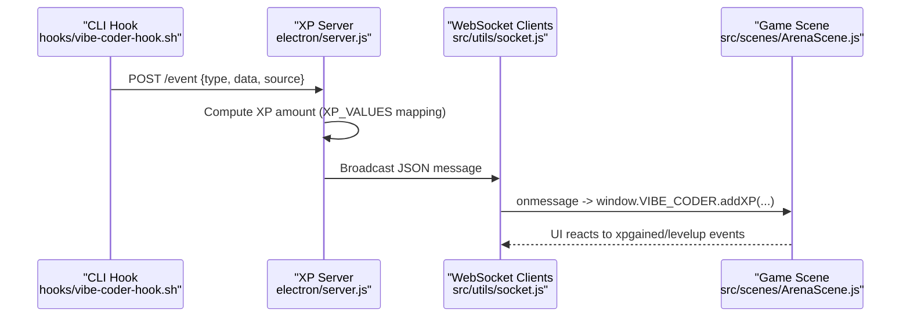
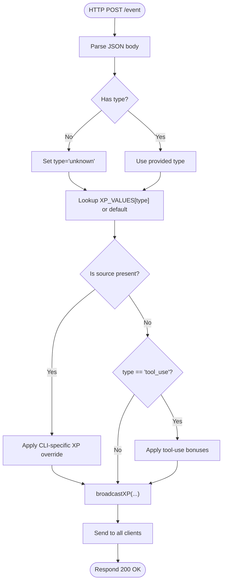
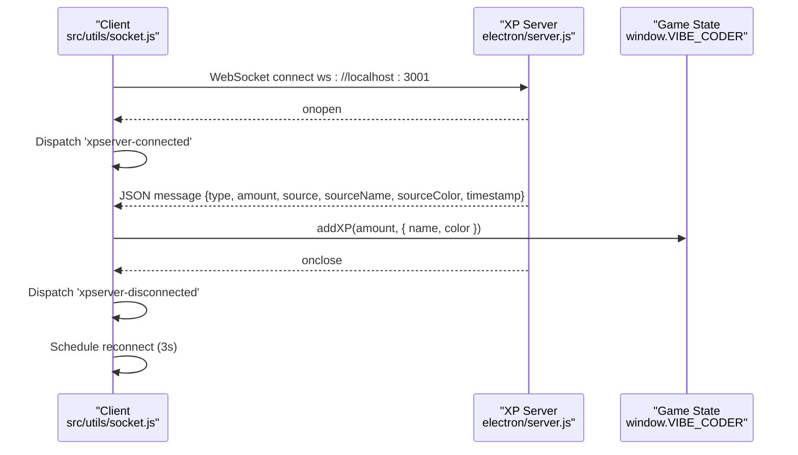
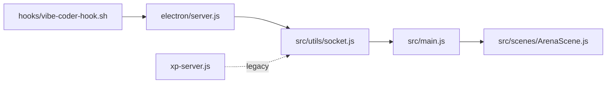

# WebSocket API

<cite>
**Referenced Files in This Document**
- [xp-server.js](file://xp-server.js)
- [electron/server.js](file://electron/server.js)
- [src/utils/socket.js](file://src/utils/socket.js)
- [src/main.js](file://src/main.js)
- [src/scenes/ArenaScene.js](file://src/scenes/ArenaScene.js)
- [hooks/vibe-coder-hook.sh](file://hooks/vibe-coder-hook.sh)
- [server/index.js](file://server/index.js)
- [package.json](file://package.json)
</cite>

## Table of Contents
1. [Introduction](#introduction)
2. [Project Structure](#project-structure)
3. [Core Components](#core-components)
4. [Architecture Overview](#architecture-overview)
5. [Detailed Component Analysis](#detailed-component-analysis)
6. [Dependency Analysis](#dependency-analysis)
7. [Performance Considerations](#performance-considerations)
8. [Troubleshooting Guide](#troubleshooting-guide)
9. [Conclusion](#conclusion)
10. [Appendices](#appendices)

## Introduction
This document describes Vibe-Coder’s real-time XP broadcasting system over WebSocket. It covers:
- How the XP server is started and how clients connect
- Message formats and event types for XP broadcasts
- The broadcastXP implementation and XP_VALUE mapping system
- Client-side integration patterns, connection handling, and error recovery
- Practical examples for connecting to ws://localhost:3001, sending/receiving XP events, and handling lifecycle events
- Guidelines for client implementation, connection pooling, and performance optimization

## Project Structure
The XP system spans two primary server implementations and a client-side WebSocket integration:
- Built-in Electron XP server (Express + WebSocket) on port 3001
- Legacy standalone XP server (HTTP + WebSocket) on port 3333
- Client-side WebSocket integration in the browser/renderer process
- CLI hooks that emit XP events to the server

**Diagram sources**
- [electron/server.js](file://electron/server.js#L75-L151)
- [src/utils/socket.js](file://src/utils/socket.js#L1-L121)
- [src/main.js](file://src/main.js#L1-L20)
- [src/scenes/ArenaScene.js](file://src/scenes/ArenaScene.js#L2580-L2612)
- [hooks/vibe-coder-hook.sh](file://hooks/vibe-coder-hook.sh#L1-L24)
- [xp-server.js](file://xp-server.js#L1-L106)

**Section sources**
- [electron/server.js](file://electron/server.js#L1-L183)
- [src/utils/socket.js](file://src/utils/socket.js#L1-L121)
- [src/main.js](file://src/main.js#L1-L20)
- [src/scenes/ArenaScene.js](file://src/scenes/ArenaScene.js#L2580-L2612)
- [hooks/vibe-coder-hook.sh](file://hooks/vibe-coder-hook.sh#L1-L24)
- [xp-server.js](file://xp-server.js#L1-L106)

## Core Components
- Electron-built XP server: Express HTTP API plus WebSocket broadcasting on port 3001
- Client WebSocket integration: Browser-side connection to ws://localhost:3001 with automatic reconnection
- CLI hooks: Emit XP events to the server via HTTP POST
- Game state: Receives XP events and updates player stats

Key responsibilities:
- Server: Accepts XP events, computes XP amounts, broadcasts to clients, tracks state
- Client: Connects to the server, parses messages, updates game state, dispatches UI events
- Hooks: Forward AI/editor actions to the server as XP events

**Section sources**
- [electron/server.js](file://electron/server.js#L18-L73)
- [src/utils/socket.js](file://src/utils/socket.js#L18-L121)
- [hooks/vibe-coder-hook.sh](file://hooks/vibe-coder-hook.sh#L1-L24)

## Architecture Overview
The system uses a dual-path architecture:
- Built-in Electron server (recommended): Runs inside the Electron app, exposes both HTTP and WebSocket on port 3001
- Legacy standalone server (deprecated): Separate Node process on port 3333

**Diagram sources**
- [hooks/vibe-coder-hook.sh](file://hooks/vibe-coder-hook.sh#L15-L20)
- [electron/server.js](file://electron/server.js#L99-L119)
- [src/utils/socket.js](file://src/utils/socket.js#L54-L72)
- [src/scenes/ArenaScene.js](file://src/scenes/ArenaScene.js#L2580-L2612)

## Detailed Component Analysis

### Electron-built XP Server (Port 3001)
- HTTP endpoints:
  - POST /event: Accepts {type, data, source}, computes XP, broadcasts to clients
  - POST /cli/:source: CLI-specific endpoint for direct source events
  - GET /health: Returns server status and client count
- WebSocket:
  - Broadcasts XP events to all connected clients
  - Tracks client count and last event
- XP_VALUE mapping:
  - Base activities: message, tool_use, task_complete, response
  - CLI-specific: claude_code, codex_cli, gemini_cli, cursor_ai, copilot
  - Tool-use bonuses: higher XP for Edit/Write vs Bash
- Broadcast payload includes type, amount, source, sourceName, sourceColor, timestamp

**Diagram sources**
- [electron/server.js](file://electron/server.js#L99-L119)
- [electron/server.js](file://electron/server.js#L48-L73)

**Section sources**
- [electron/server.js](file://electron/server.js#L18-L73)
- [electron/server.js](file://electron/server.js#L75-L151)

### Legacy Standalone XP Server (Port 3333)
- HTTP POST /event: Parses JSON, computes XP using XP_VALUES, broadcasts via WebSocket
- WebSocket: Broadcasts simplified message with type, amount, sourceName, sourceColor
- Used primarily for backward compatibility with older setups

**Section sources**
- [xp-server.js](file://xp-server.js#L11-L94)

### Client WebSocket Integration (ws://localhost:3001)
- Connection:
  - Only connects on localhost to avoid cross-origin failures
  - Guards against concurrent connection attempts
  - Automatically reconnects on close with exponential backoff
- Lifecycle events:
  - Dispatches CustomEvent 'xpserver-connected' on open
  - Dispatches CustomEvent 'xpserver-disconnected' on close
- Message handling:
  - Parses incoming JSON and extracts type, amount, sourceName, sourceColor
  - Calls window.VIBE_CODER.addXP(amount, { name, color })
- Disconnection and cleanup:
  - Clears reconnect timers and closes socket gracefully

**Diagram sources**
- [src/utils/socket.js](file://src/utils/socket.js#L18-L121)
- [electron/server.js](file://electron/server.js#L48-L73)
- [src/main.js](file://src/main.js#L323-L379)

**Section sources**
- [src/utils/socket.js](file://src/utils/socket.js#L1-L121)
- [src/main.js](file://src/main.js#L323-L379)

### CLI Hooks Integration
- The hook script forwards events to the XP server via HTTP POST
- Sends {type, data, source} to http://localhost:3333/event (legacy) or http://localhost:3001/event (built-in)
- Non-blocking, silent failure to avoid disrupting the editor workflow

**Section sources**
- [hooks/vibe-coder-hook.sh](file://hooks/vibe-coder-hook.sh#L1-L24)

### Game Scene Integration
- Listens for XP events and level-up events to update UI
- Cleans up event listeners on scene transitions to prevent leaks

**Section sources**
- [src/scenes/ArenaScene.js](file://src/scenes/ArenaScene.js#L2580-L2612)

## Dependency Analysis
- Electron-built server depends on Express and ws for HTTP and WebSocket
- Client depends on native WebSocket and window.VIBE_CODER global for state updates
- CLI hooks depend on curl and local server availability

**Diagram sources**
- [hooks/vibe-coder-hook.sh](file://hooks/vibe-coder-hook.sh#L15-L20)
- [electron/server.js](file://electron/server.js#L75-L151)
- [src/utils/socket.js](file://src/utils/socket.js#L1-L121)
- [src/main.js](file://src/main.js#L323-L379)
- [src/scenes/ArenaScene.js](file://src/scenes/ArenaScene.js#L2580-L2612)
- [xp-server.js](file://xp-server.js#L1-L106)

**Section sources**
- [package.json](file://package.json#L31-L42)
- [electron/server.js](file://electron/server.js#L1-L183)
- [src/utils/socket.js](file://src/utils/socket.js#L1-L121)

## Performance Considerations
- Connection reuse: Maintain a single WebSocket connection per client; avoid frequent reconnects
- Message volume: Batch or throttle high-frequency events if needed; the current server broadcasts per event
- Client filtering: On the client, debounce UI updates to reduce rendering churn
- Server scaling: The built-in server maintains a Set of clients; consider connection limits for production
- Network reliability: The client already implements automatic reconnection; keep retry intervals reasonable

[No sources needed since this section provides general guidance]

## Troubleshooting Guide
Common issues and resolutions:
- Cannot connect to ws://localhost:3001:
  - Ensure the Electron app is running and the built-in server is started
  - Confirm the server is listening on port 3001
- No XP events received:
  - Verify CLI hooks are emitting events to the correct endpoint
  - Check that the client is on localhost and not blocked by CSP
- Frequent disconnects:
  - Review client reconnection logic and network stability
  - Ensure the server is not overloaded or crashing
- Unexpected XP amounts:
  - Confirm the event type and source match XP_VALUE mappings
  - Check for tool-use bonuses and CLI-specific overrides

**Section sources**
- [src/utils/socket.js](file://src/utils/socket.js#L18-L121)
- [electron/server.js](file://electron/server.js#L99-L119)

## Conclusion
Vibe-Coder’s XP broadcasting system provides a robust, real-time mechanism for rewarding coding activity. The Electron-built server offers a unified HTTP/WebSocket interface, while the client integrates seamlessly with the game state and UI. By following the guidelines below, developers can integrate, extend, and optimize the XP system effectively.

[No sources needed since this section summarizes without analyzing specific files]

## Appendices

### API Definitions

- Endpoint: POST /event
  - Request body: { type: string, data?: object, source?: string }
  - Response: { success: boolean, xp: number, source: string }

- Endpoint: POST /cli/:source
  - Path params: source (claude|codex|gemini|cursor|copilot)
  - Request body: { action?: string, data?: object }
  - Response: { success: boolean, xp: number, source: string }

- Endpoint: GET /health
  - Response: { status: string, clients: number, uptime: number }

- WebSocket message (broadcast):
  - Fields: type, amount, source, sourceName, sourceColor, timestamp

**Section sources**
- [electron/server.js](file://electron/server.js#L99-L142)
- [electron/server.js](file://electron/server.js#L48-L73)

### Client Implementation Guidelines
- Connect only on localhost to avoid cross-origin errors
- Use a single persistent WebSocket connection
- Listen for 'xpserver-connected' and 'xpserver-disconnected' events to update UI
- Parse incoming messages and call window.VIBE_CODER.addXP(amount, { name, color })
- Implement graceful disconnect and reconnect logic

**Section sources**
- [src/utils/socket.js](file://src/utils/socket.js#L18-L121)
- [src/main.js](file://src/main.js#L323-L379)

### Connection Pooling Strategies
- Single connection per client is sufficient for this use case
- Avoid multiple concurrent WebSocket instances
- Reuse the existing connection; rely on automatic reconnection on close

[No sources needed since this section provides general guidance]

### Performance Optimization Tips
- Minimize UI updates per XP event; batch or throttle rendering
- Avoid unnecessary JSON parsing or deep cloning on the client
- Monitor client count and server health via /health
- Consider rate-limiting high-frequency tool_use events if needed

[No sources needed since this section provides general guidance]