# Authentication System

<cite>
**Referenced Files in This Document**
- [server/auth/challenge.js](file://server/auth/challenge.js)
- [server/auth/token.js](file://server/auth/token.js)
- [server/middleware/jwtAuth.js](file://server/middleware/jwtAuth.js)
- [server/routes/auth.js](file://server/routes/auth.js)
- [server/config/sep10.js](file://server/config/sep10.js)
- [server/db/users.js](file://server/db/users.js)
- [server/index.js](file://server/index.js)
- [src/utils/sep10StellarAuth.js](file://src/utils/sep10StellarAuth.js)
- [src/utils/authApi.js](file://src/utils/authApi.js)
- [public/.well-known/stellar.toml](file://public/.well-known/stellar.toml)
- [scripts/sep10-login-demo.js](file://scripts/sep10-login-demo.js)
- [docs/DEPLOY_RENDER_SEP10.md](file://docs/DEPLOY_RENDER_SEP10.md)
- [docs/SEP10_AUTH.md](file://docs/SEP10_AUTH.md)
</cite>

## Table of Contents
1. [Introduction](#introduction)
2. [Project Structure](#project-structure)
3. [Core Components](#core-components)
4. [Architecture Overview](#architecture-overview)
5. [Detailed Component Analysis](#detailed-component-analysis)
6. [Dependency Analysis](#dependency-analysis)
7. [Performance Considerations](#performance-considerations)
8. [Troubleshooting Guide](#troubleshooting-guide)
9. [Conclusion](#conclusion)
10. [Appendices](#appendices)

## Introduction
This document explains Vibe-Coder’s authentication system implementing Stellar’s SEP-10 (Stellar Web Authentication) standard. It covers the challenge-response flow, JWT issuance and validation, route protection with middleware, user information retrieval, and the generation of the stellar.toml configuration for wallet discovery. It also includes examples of the complete authentication flow, error handling scenarios, and security considerations, along with integration notes for Freighter and the role of server secret keys.

## Project Structure
The authentication system spans server-side modules, database persistence, and client utilities:
- Server routes and middleware implement the SEP-10 endpoints and JWT protection
- Configuration module centralizes environment-driven settings
- Database layer persists user records and JWT metadata
- Frontend utilities integrate with Freighter and manage JWT lifecycle

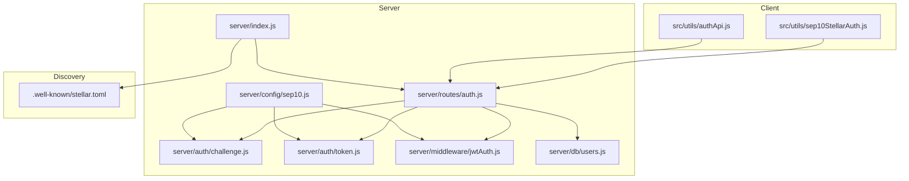

**Diagram sources**
- [server/index.js](file://server/index.js#L1-L246)
- [server/config/sep10.js](file://server/config/sep10.js#L1-L87)
- [server/auth/challenge.js](file://server/auth/challenge.js#L1-L87)
- [server/auth/token.js](file://server/auth/token.js#L1-L80)
- [server/middleware/jwtAuth.js](file://server/middleware/jwtAuth.js#L1-L36)
- [server/routes/auth.js](file://server/routes/auth.js#L1-L115)
- [server/db/users.js](file://server/db/users.js#L1-L181)
- [src/utils/sep10StellarAuth.js](file://src/utils/sep10StellarAuth.js#L1-L219)
- [src/utils/authApi.js](file://src/utils/authApi.js#L1-L184)
- [public/.well-known/stellar.toml](file://public/.well-known/stellar.toml#L1-L9)

**Section sources**
- [server/index.js](file://server/index.js#L1-L246)
- [server/routes/auth.js](file://server/routes/auth.js#L1-L115)
- [server/config/sep10.js](file://server/config/sep10.js#L1-L87)

## Core Components
- Challenge endpoint: Generates a server-signed challenge transaction for a given Stellar account
- Token endpoint: Verifies the signed challenge and issues a JWT
- JWT middleware: Protects routes by validating JWT signatures and expiration
- User endpoints: Retrieve and update user information using the authenticated public key
- Configuration: Centralizes environment variables for SEP-10 and JWT behavior
- Discovery: Generates stellar.toml for wallet discovery

**Section sources**
- [server/auth/challenge.js](file://server/auth/challenge.js#L1-L87)
- [server/auth/token.js](file://server/auth/token.js#L1-L80)
- [server/middleware/jwtAuth.js](file://server/middleware/jwtAuth.js#L1-L36)
- [server/routes/auth.js](file://server/routes/auth.js#L1-L115)
- [server/config/sep10.js](file://server/config/sep10.js#L1-L87)
- [server/db/users.js](file://server/db/users.js#L1-L181)
- [public/.well-known/stellar.toml](file://public/.well-known/stellar.toml#L1-L9)

## Architecture Overview
The system implements a strict server-verified flow:
- Clients request a challenge with their public key
- Wallets (via Freighter) sign the challenge
- The signed challenge is sent to the server for verification
- On success, the server issues a JWT and persists user data
- Subsequent requests include the JWT in the Authorization header for protected routes

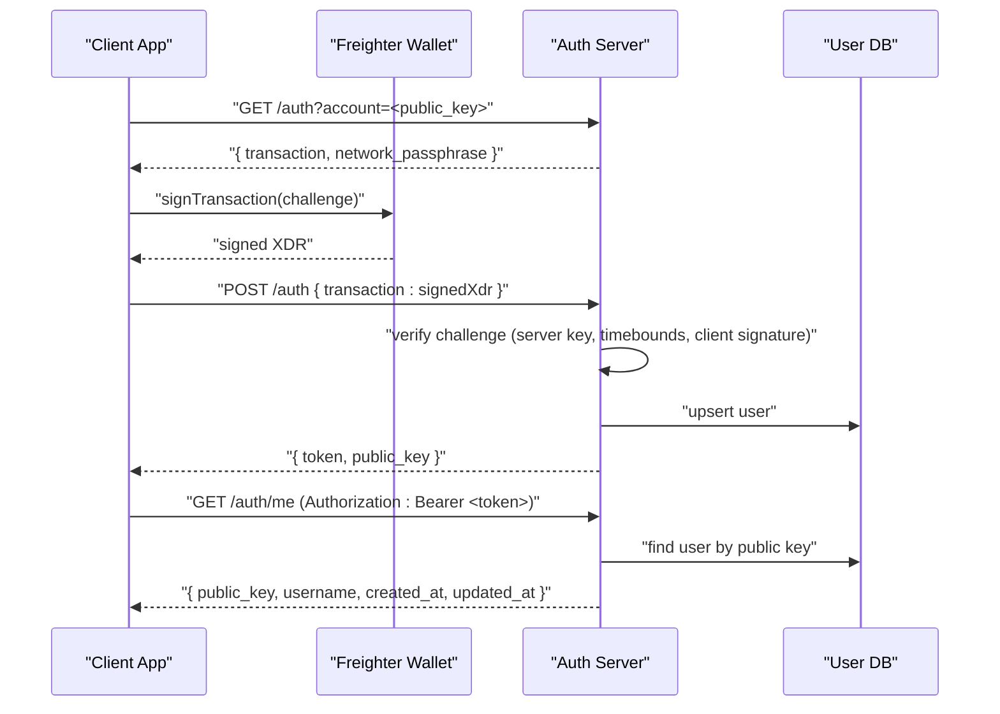

**Diagram sources**
- [server/routes/auth.js](file://server/routes/auth.js#L1-L115)
- [server/auth/challenge.js](file://server/auth/challenge.js#L1-L87)
- [server/auth/token.js](file://server/auth/token.js#L1-L80)
- [server/db/users.js](file://server/db/users.js#L1-L181)
- [src/utils/sep10StellarAuth.js](file://src/utils/sep10StellarAuth.js#L1-L219)

## Detailed Component Analysis

### Challenge Endpoint: /auth/challenge and /auth
- Purpose: Build and return a server-signed challenge transaction for a given Stellar account
- Validation: Ensures the account is a valid Stellar public key (G... or M...), and constructs a Manage Data operation for the home domain and a Manage Data operation for the web auth domain
- Output: Returns the challenge transaction as base64 XDR and the network passphrase

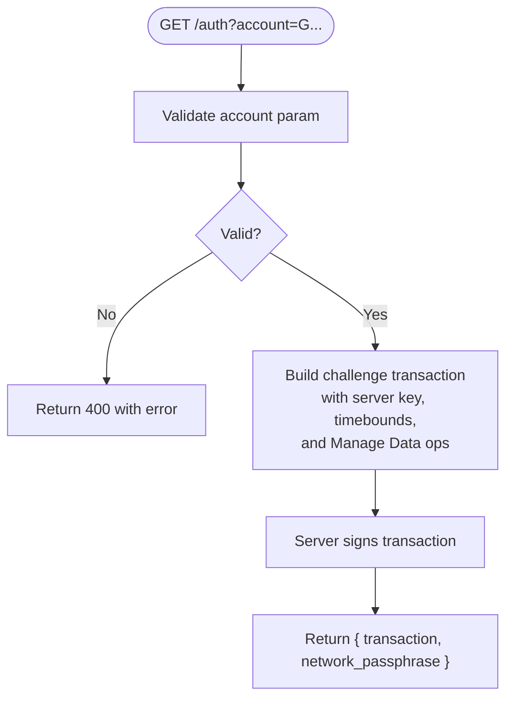

**Diagram sources**
- [server/auth/challenge.js](file://server/auth/challenge.js#L1-L87)
- [server/routes/auth.js](file://server/routes/auth.js#L19-L33)

**Section sources**
- [server/auth/challenge.js](file://server/auth/challenge.js#L27-L86)
- [server/routes/auth.js](file://server/routes/auth.js#L19-L33)

### Token Endpoint: /auth and /auth/token
- Purpose: Verify the signed challenge and issue a JWT
- Verification steps:
  - Parse and validate the challenge against server configuration (home domain, web auth domain, network passphrase)
  - Verify the client’s signature on the challenge
  - Reject if signatures are missing or mismatched
- JWT creation: Payload includes subject (public key), issued-at, expiration, and issuer; signed with HS256 using a server-secret JWT secret
- Persistence: Upsert user and store JWT metadata

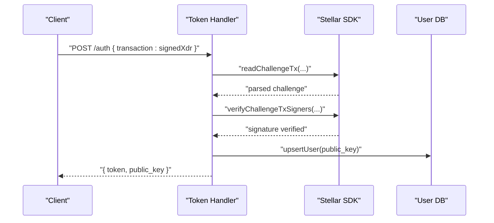

**Diagram sources**
- [server/auth/token.js](file://server/auth/token.js#L29-L79)
- [server/db/users.js](file://server/db/users.js#L53-L94)

**Section sources**
- [server/auth/token.js](file://server/auth/token.js#L29-L79)
- [server/db/users.js](file://server/db/users.js#L53-L94)

### JWT Middleware: Protecting Routes
- Purpose: Validate Authorization headers and JWT signatures
- Behavior:
  - Expects Authorization: Bearer <jwt>
  - Verifies HS256 signature using the configured JWT secret
  - Rejects expired or invalid tokens
  - Attaches decoded public key to the request for downstream handlers

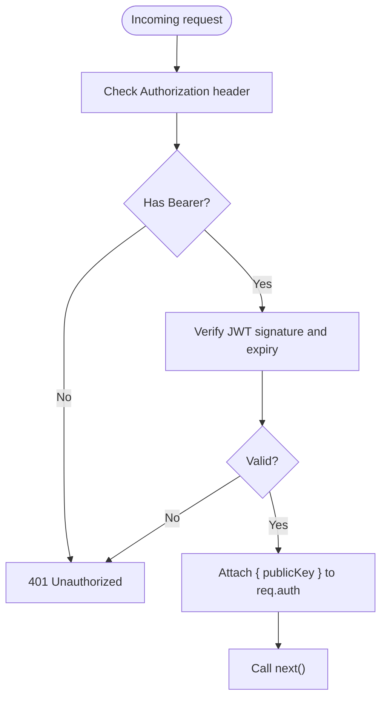

**Diagram sources**
- [server/middleware/jwtAuth.js](file://server/middleware/jwtAuth.js#L9-L35)

**Section sources**
- [server/middleware/jwtAuth.js](file://server/middleware/jwtAuth.js#L9-L35)

### User Information Endpoints: /auth/me and /auth/me/username
- GET /auth/me: Requires a valid JWT; returns user profile data
- PATCH /auth/me/username: Requires a valid JWT; updates username with basic sanitization

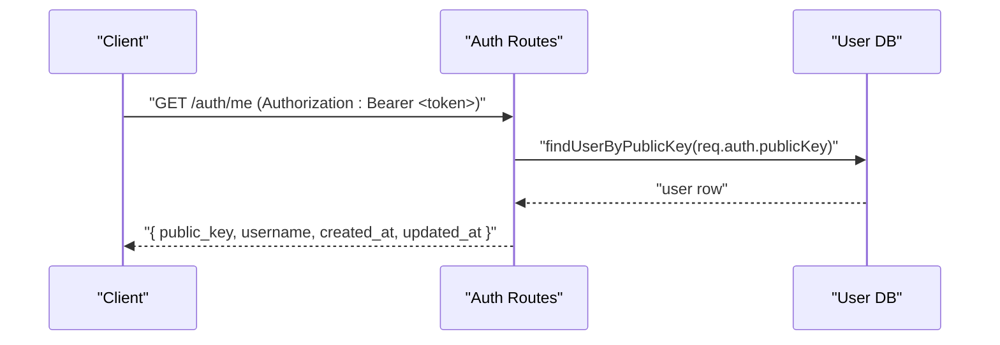

**Diagram sources**
- [server/routes/auth.js](file://server/routes/auth.js#L78-L94)
- [server/db/users.js](file://server/db/users.js#L28-L51)

**Section sources**
- [server/routes/auth.js](file://server/routes/auth.js#L78-L112)
- [server/db/users.js](file://server/db/users.js#L28-L125)

### Configuration Module: server/config/sep10.js
- Centralizes environment-driven behavior:
  - Server secret key for signing challenges
  - Home domain and web auth domain normalization
  - Network passphrase and challenge timeout
  - JWT secret and expiry
  - Optional enable/disable flag and environment aliases

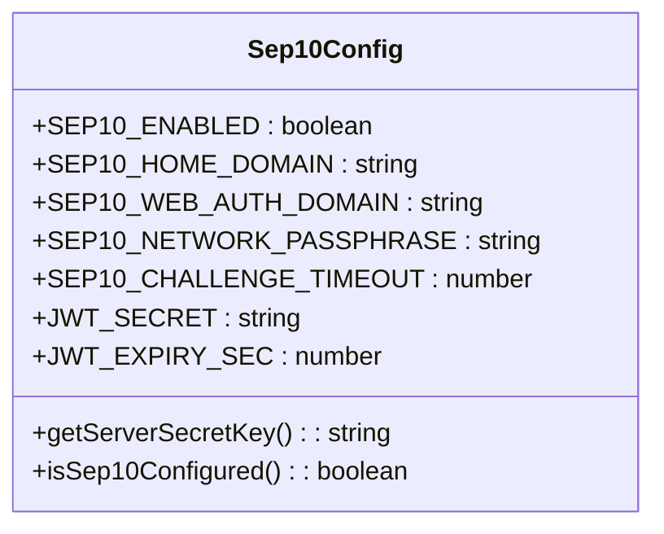

**Diagram sources**
- [server/config/sep10.js](file://server/config/sep10.js#L1-L87)

**Section sources**
- [server/config/sep10.js](file://server/config/sep10.js#L1-L87)

### Database Layer: server/db/users.js
- Provides user persistence with multiple backends:
  - Supabase (preferred)
  - PostgreSQL (via connection pool)
  - In-memory fallback
- Functions:
  - Upsert user on successful token issuance
  - Store JWT and expiration for audit/session tracking
  - Retrieve and update user profile

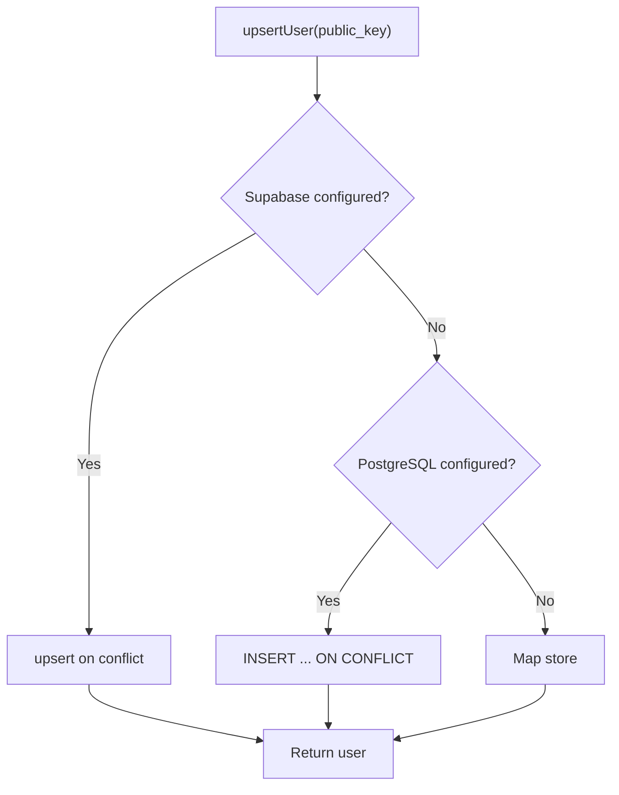

**Diagram sources**
- [server/db/users.js](file://server/db/users.js#L53-L94)

**Section sources**
- [server/db/users.js](file://server/db/users.js#L1-L181)

### Frontend Integration: src/utils/sep10StellarAuth.js and src/utils/authApi.js
- sep10StellarAuth.js:
  - Detects Freighter availability
  - Executes the full login flow: get challenge, sign with Freighter, submit token, store JWT
  - Provides authenticatedFetch helper with automatic Authorization header
- authApi.js:
  - Client-side helpers for challenge, token exchange, and protected calls
  - Supports standard and legacy endpoint paths for backward compatibility

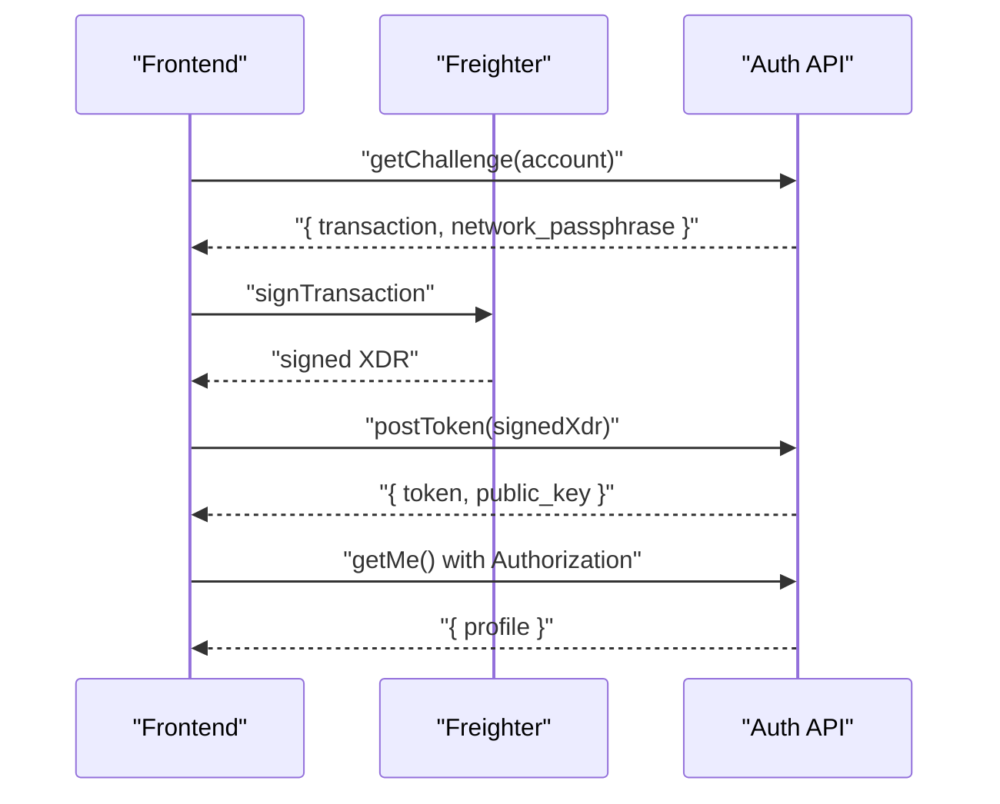

**Diagram sources**
- [src/utils/sep10StellarAuth.js](file://src/utils/sep10StellarAuth.js#L65-L164)
- [src/utils/authApi.js](file://src/utils/authApi.js#L62-L132)

**Section sources**
- [src/utils/sep10StellarAuth.js](file://src/utils/sep10StellarAuth.js#L1-L219)
- [src/utils/authApi.js](file://src/utils/authApi.js#L1-L184)

### Discovery: .well-known/stellar.toml Generation
- The server dynamically generates a stellar.toml file advertising:
  - SIGNING_KEY: derived from the server secret key
  - WEB_AUTH_ENDPOINT: the canonical endpoint serving GET and POST on the same path
- The endpoint scheme is chosen based on whether the web auth domain is localhost

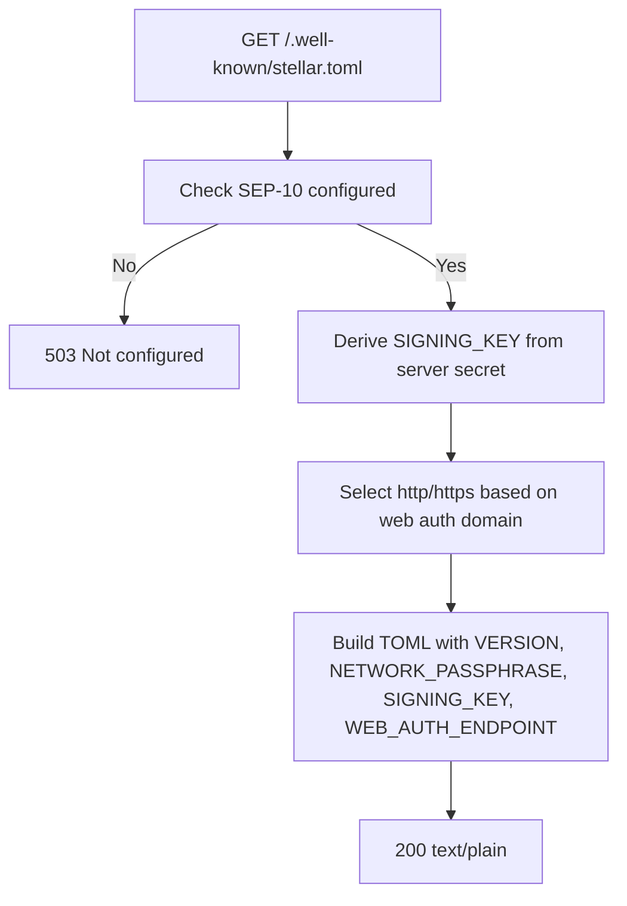

**Diagram sources**
- [server/index.js](file://server/index.js#L30-L51)
- [public/.well-known/stellar.toml](file://public/.well-known/stellar.toml#L1-L9)

**Section sources**
- [server/index.js](file://server/index.js#L30-L51)
- [public/.well-known/stellar.toml](file://public/.well-known/stellar.toml#L1-L9)

## Dependency Analysis
- Route handlers depend on:
  - Challenge builder for generating transactions
  - Token verifier for validating signatures and issuing JWTs
  - JWT middleware for protecting endpoints
  - Database layer for user persistence
- Configuration module provides shared constants and secrets
- Frontend utilities depend on route handlers and Freighter

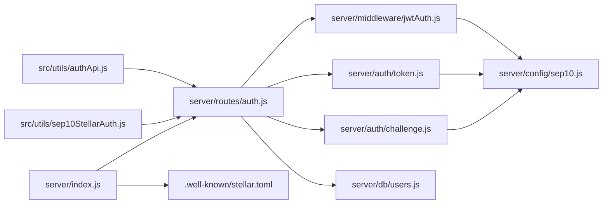

**Diagram sources**
- [server/routes/auth.js](file://server/routes/auth.js#L1-L115)
- [server/auth/challenge.js](file://server/auth/challenge.js#L1-L87)
- [server/auth/token.js](file://server/auth/token.js#L1-L80)
- [server/middleware/jwtAuth.js](file://server/middleware/jwtAuth.js#L1-L36)
- [server/db/users.js](file://server/db/users.js#L1-L181)
- [server/config/sep10.js](file://server/config/sep10.js#L1-L87)
- [server/index.js](file://server/index.js#L1-L246)
- [src/utils/sep10StellarAuth.js](file://src/utils/sep10StellarAuth.js#L1-L219)
- [src/utils/authApi.js](file://src/utils/authApi.js#L1-L184)

**Section sources**
- [server/routes/auth.js](file://server/routes/auth.js#L1-L115)
- [server/index.js](file://server/index.js#L1-L246)

## Performance Considerations
- Challenge timeout: Controlled by configuration to balance usability and security
- JWT expiry: Short-lived tokens reduce risk and require periodic re-authentication
- Database backends: Supabase and PostgreSQL offer better scalability than in-memory storage
- CORS: Broad allow-all headers simplify cross-origin requests from static frontends

[No sources needed since this section provides general guidance]

## Troubleshooting Guide
Common errors and resolutions:
- Missing or invalid Authorization header: Ensure the Authorization header is present and starts with Bearer
- Invalid or expired token: Tokens are validated with HS256 and expiration; regenerate if expired
- Transaction required or malformed: Ensure the POST body includes a JSON object with a transaction field containing a valid base64 signed XDR
- Signature verification failed: Confirm the transaction was signed by the correct account and not modified
- WEB_AUTH_DOMAIN mismatch: Ensure the web auth domain matches the domain serving the endpoints
- SEP-10 not configured: Verify server secret key and JWT secret are set

**Section sources**
- [server/middleware/jwtAuth.js](file://server/middleware/jwtAuth.js#L9-L35)
- [server/routes/auth.js](file://server/routes/auth.js#L35-L55)
- [docs/SEP10_AUTH.md](file://docs/SEP10_AUTH.md#L84-L106)

## Conclusion
Vibe-Coder’s authentication system adheres to the SEP-10 standard, providing a secure, server-verified login flow using Stellar wallets and Freighter. The implementation includes robust challenge generation, strict signature verification, JWT issuance with middleware protection, and user management. The system is designed for easy deployment and integrates seamlessly with wallets through stellar.toml discovery.

[No sources needed since this section summarizes without analyzing specific files]

## Appendices

### Complete Authentication Flow Example
- Client requests challenge with their public key
- Wallet signs the challenge
- Client submits the signed challenge to the server
- Server validates and issues a JWT
- Client stores the JWT and accesses protected endpoints

**Section sources**
- [src/utils/sep10StellarAuth.js](file://src/utils/sep10StellarAuth.js#L65-L164)
- [scripts/sep10-login-demo.js](file://scripts/sep10-login-demo.js#L24-L118)

### Security Considerations
- Server-only verification: The server validates the challenge and issues the JWT; no client-side simulation
- Replay prevention: Challenges include a nonce and timebounds; JWT includes issued-at and expiration
- Signature enforcement: Both server and client signatures are required for verification
- Secret management: Server secret key and JWT secret must be kept confidential

**Section sources**
- [docs/SEP10_AUTH.md](file://docs/SEP10_AUTH.md#L74-L79)

### Deployment Notes
- Environment variables must be configured for the backend
- Database schema must be applied before use
- Frontend must point to the correct API base URL

**Section sources**
- [docs/DEPLOY_RENDER_SEP10.md](file://docs/DEPLOY_RENDER_SEP10.md#L57-L129)