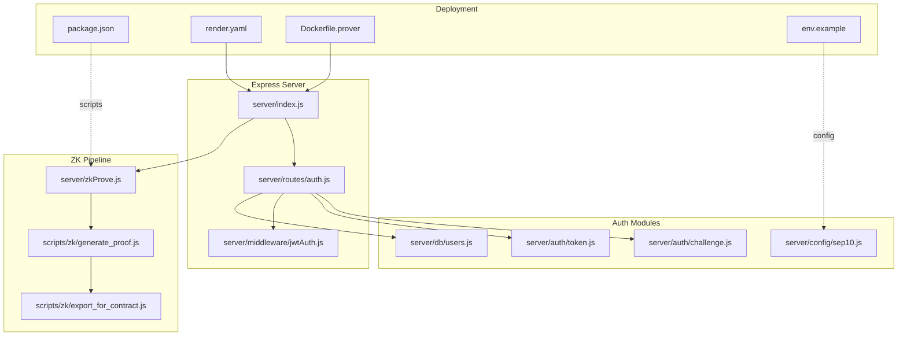
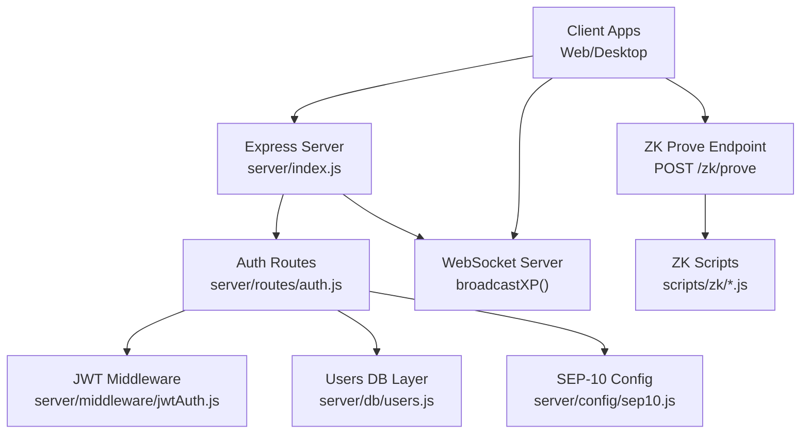
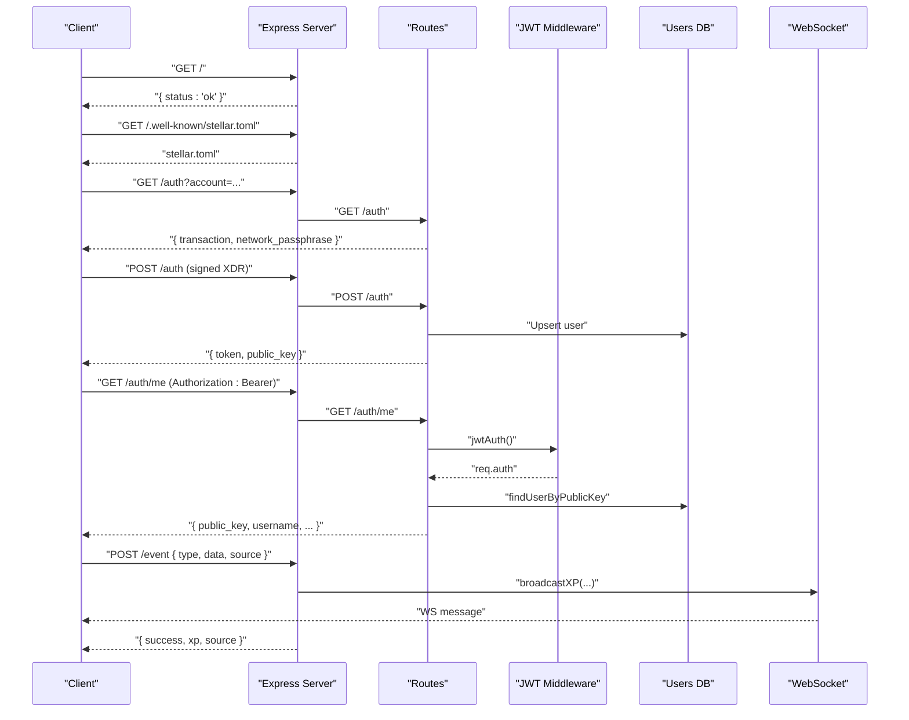
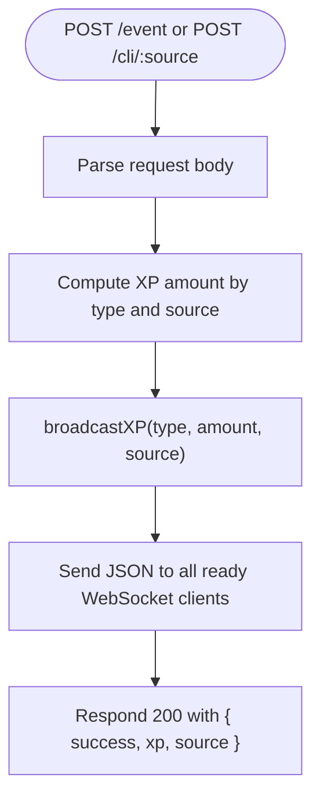
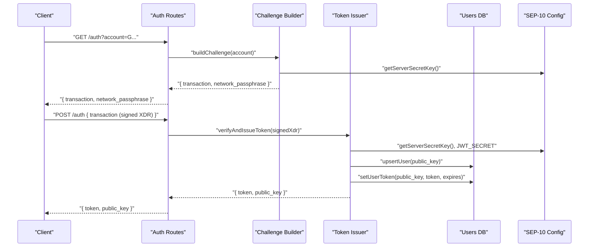
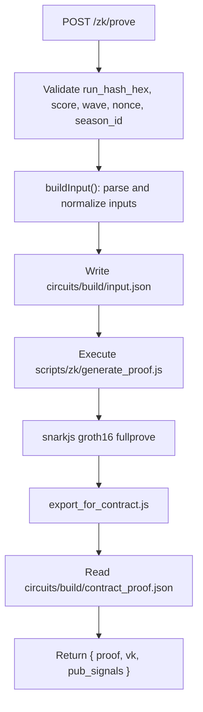
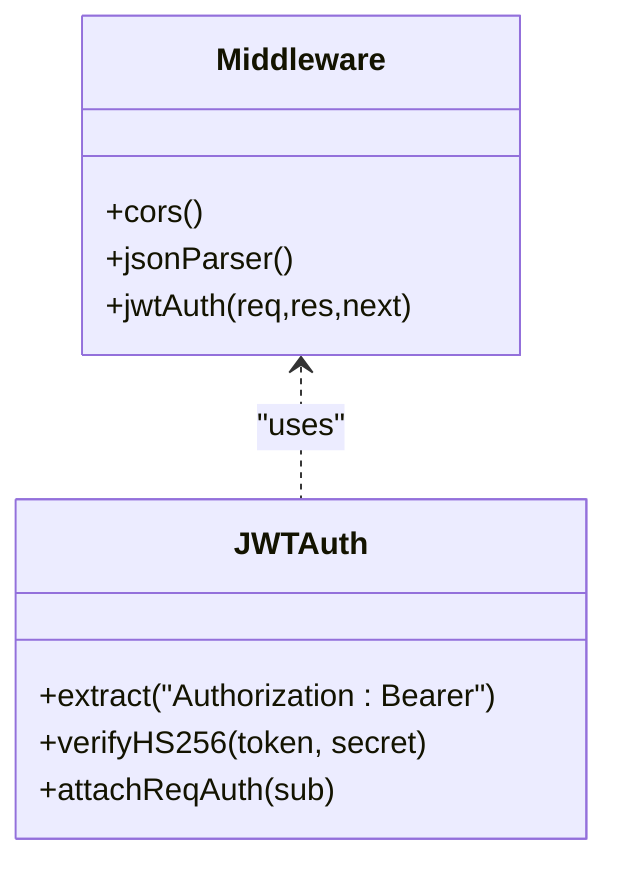
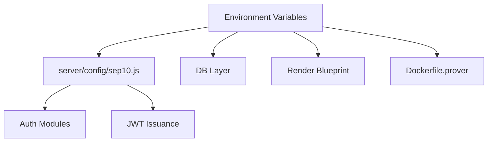
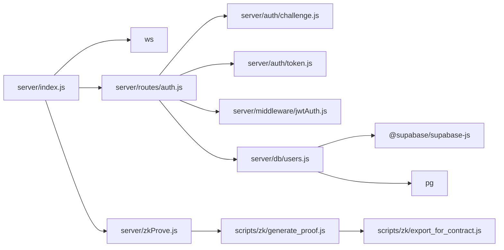
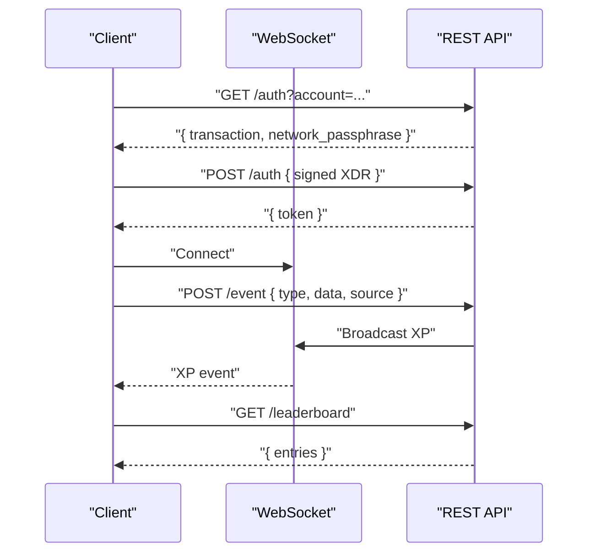

# Backend Services

<cite>
**Referenced Files in This Document**
- [server/index.js](file://server/index.js)
- [server/auth/challenge.js](file://server/auth/challenge.js)
- [server/auth/token.js](file://server/auth/token.js)
- [server/routes/auth.js](file://server/routes/auth.js)
- [server/middleware/jwtAuth.js](file://server/middleware/jwtAuth.js)
- [server/config/sep10.js](file://server/config/sep10.js)
- [server/db/users.js](file://server/db/users.js)
- [server/zkProve.js](file://server/zkProve.js)
- [scripts/zk/generate_proof.js](file://scripts/zk/generate_proof.js)
- [scripts/zk/export_for_contract.js](file://scripts/zk/export_for_contract.js)
- [.env.example](file://.env.example)
- [package.json](file://package.json)
- [render.yaml](file://render.yaml)
- [Dockerfile.prover](file://Dockerfile.prover)
</cite>

## Table of Contents
1. [Introduction](#introduction)
2. [Project Structure](#project-structure)
3. [Core Components](#core-components)
4. [Architecture Overview](#architecture-overview)
5. [Detailed Component Analysis](#detailed-component-analysis)
6. [Dependency Analysis](#dependency-analysis)
7. [Performance Considerations](#performance-considerations)
8. [Troubleshooting Guide](#troubleshooting-guide)
9. [Conclusion](#conclusion)
10. [Appendices](#appendices)

## Introduction
This document describes the backend services architecture for Vibe-Coder, focusing on the Express server, REST API endpoints, WebSocket integration for real-time XP broadcasting, authentication using SEP-10 challenge-response and JWT, and the ZK proof generation pipeline using snarkjs and Circom circuits. It also covers middleware, configuration, environment variables, deployment considerations, API specifications, error handling, and performance optimization.

## Project Structure
The backend is organized around a modular Express server with dedicated modules for authentication, database abstraction, middleware, configuration, and ZK proof generation. Supporting scripts orchestrate the ZK build and proof generation steps.

**Diagram sources**
- [server/index.js](file://server/index.js#L1-L246)
- [server/routes/auth.js](file://server/routes/auth.js#L1-L115)
- [server/middleware/jwtAuth.js](file://server/middleware/jwtAuth.js#L1-L36)
- [server/auth/challenge.js](file://server/auth/challenge.js#L1-L87)
- [server/auth/token.js](file://server/auth/token.js#L1-L80)
- [server/config/sep10.js](file://server/config/sep10.js#L1-L87)
- [server/db/users.js](file://server/db/users.js#L1-L181)
- [server/zkProve.js](file://server/zkProve.js#L1-L68)
- [scripts/zk/generate_proof.js](file://scripts/zk/generate_proof.js#L1-L46)
- [scripts/zk/export_for_contract.js](file://scripts/zk/export_for_contract.js#L1-L95)
- [package.json](file://package.json#L7-L22)
- [render.yaml](file://render.yaml#L1-L15)
- [Dockerfile.prover](file://Dockerfile.prover#L1-L26)
- [.env.example](file://.env.example#L1-L37)

**Section sources**
- [server/index.js](file://server/index.js#L1-L246)
- [server/routes/auth.js](file://server/routes/auth.js#L1-L115)
- [server/middleware/jwtAuth.js](file://server/middleware/jwtAuth.js#L1-L36)
- [server/auth/challenge.js](file://server/auth/challenge.js#L1-L87)
- [server/auth/token.js](file://server/auth/token.js#L1-L80)
- [server/config/sep10.js](file://server/config/sep10.js#L1-L87)
- [server/db/users.js](file://server/db/users.js#L1-L181)
- [server/zkProve.js](file://server/zkProve.js#L1-L68)
- [scripts/zk/generate_proof.js](file://scripts/zk/generate_proof.js#L1-L46)
- [scripts/zk/export_for_contract.js](file://scripts/zk/export_for_contract.js#L1-L95)
- [package.json](file://package.json#L7-L22)
- [render.yaml](file://render.yaml#L1-L15)
- [Dockerfile.prover](file://Dockerfile.prover#L1-L26)
- [.env.example](file://.env.example#L1-L37)

## Core Components
- Express server with middleware, routes, and WebSocket broadcasting for XP events.
- Authentication subsystem implementing SEP-10 challenge-response and issuing JWT tokens.
- ZK proof generation pipeline integrating snarkjs and Circom artifacts.
- Database abstraction supporting Supabase, PostgreSQL, or in-memory storage.
- Configuration module for SEP-10 and JWT parameters with environment variable support.
- Deployment configurations for Render and Docker-based ZK prover.

**Section sources**
- [server/index.js](file://server/index.js#L1-L246)
- [server/routes/auth.js](file://server/routes/auth.js#L1-L115)
- [server/middleware/jwtAuth.js](file://server/middleware/jwtAuth.js#L1-L36)
- [server/auth/challenge.js](file://server/auth/challenge.js#L1-L87)
- [server/auth/token.js](file://server/auth/token.js#L1-L80)
- [server/config/sep10.js](file://server/config/sep10.js#L1-L87)
- [server/db/users.js](file://server/db/users.js#L1-L181)
- [server/zkProve.js](file://server/zkProve.js#L1-L68)
- [scripts/zk/generate_proof.js](file://scripts/zk/generate_proof.js#L1-L46)
- [scripts/zk/export_for_contract.js](file://scripts/zk/export_for_contract.js#L1-L95)
- [render.yaml](file://render.yaml#L1-L15)
- [Dockerfile.prover](file://Dockerfile.prover#L1-L26)
- [.env.example](file://.env.example#L1-L37)

## Architecture Overview
The backend exposes REST endpoints for authentication, user management, XP broadcasting, player progress, leaderboard, and ZK proof generation. It integrates WebSocket for real-time XP notifications and uses SEP-10 for wallet-based identity and JWT for session tokens. The ZK prover runs as a separate service containerized with snarkjs and prebuilt circuit artifacts.

**Diagram sources**
- [server/index.js](file://server/index.js#L1-L246)
- [server/routes/auth.js](file://server/routes/auth.js#L1-L115)
- [server/middleware/jwtAuth.js](file://server/middleware/jwtAuth.js#L1-L36)
- [server/db/users.js](file://server/db/users.js#L1-L181)
- [server/config/sep10.js](file://server/config/sep10.js#L1-L87)
- [server/zkProve.js](file://server/zkProve.js#L1-L68)
- [scripts/zk/generate_proof.js](file://scripts/zk/generate_proof.js#L1-L46)
- [scripts/zk/export_for_contract.js](file://scripts/zk/export_for_contract.js#L1-L95)

## Detailed Component Analysis

### Express Server and Endpoints
- Health check: GET /
- CORS middleware enabling cross-origin requests.
- SEP-10 discovery: GET /.well-known/stellar.toml
- Auth routes: GET /auth, POST /auth, GET /auth/challenge, POST /auth/token, GET /auth/me, PATCH /auth/me/username
- Real-time XP: POST /event, POST /cli/:source
- Player progress: GET /player/:address/progress, POST /player/:address/progress
- Leaderboard: GET /leaderboard, POST /leaderboard
- ZK proof: POST /zk/prove
- Health: GET /health
- 404 and global error handler

**Diagram sources**
- [server/index.js](file://server/index.js#L23-L125)
- [server/routes/auth.js](file://server/routes/auth.js#L19-L94)
- [server/middleware/jwtAuth.js](file://server/middleware/jwtAuth.js#L9-L35)
- [server/db/users.js](file://server/db/users.js#L28-L51)

**Section sources**
- [server/index.js](file://server/index.js#L1-L246)
- [server/routes/auth.js](file://server/routes/auth.js#L1-L115)
- [server/middleware/jwtAuth.js](file://server/middleware/jwtAuth.js#L1-L36)
- [server/db/users.js](file://server/db/users.js#L1-L181)

### WebSocket Integration for Real-Time XP Broadcasting
- Maintains a Set of connected clients.
- On connection, adds to clients; on close, removes.
- broadcastXP constructs messages with type, amount, source metadata, and timestamp.
- Endpoints POST /event and POST /cli/:source trigger broadcasts.

**Diagram sources**
- [server/index.js](file://server/index.js#L58-L125)

**Section sources**
- [server/index.js](file://server/index.js#L56-L125)

### Authentication System: SEP-10 Challenge-Response and JWT
- Challenge building: GET /auth/challenge builds a Manage Data operation with a random nonce and server signature.
- Token issuance: POST /auth verifies signatures and issues a JWT with HS256.
- Protected routes: GET /auth/me and PATCH /auth/me/username require Authorization: Bearer <jwt>.
- User persistence: Upsert user and store JWT with expiration.

**Diagram sources**
- [server/routes/auth.js](file://server/routes/auth.js#L19-L55)
- [server/auth/challenge.js](file://server/auth/challenge.js#L64-L86)
- [server/auth/token.js](file://server/auth/token.js#L29-L79)
- [server/config/sep10.js](file://server/config/sep10.js#L77-L86)
- [server/db/users.js](file://server/db/users.js#L53-L94)

**Section sources**
- [server/auth/challenge.js](file://server/auth/challenge.js#L1-L87)
- [server/auth/token.js](file://server/auth/token.js#L1-L80)
- [server/routes/auth.js](file://server/routes/auth.js#L1-L115)
- [server/middleware/jwtAuth.js](file://server/middleware/jwtAuth.js#L1-L36)
- [server/db/users.js](file://server/db/users.js#L1-L181)
- [server/config/sep10.js](file://server/config/sep10.js#L1-L87)

### ZK Proof Generation Service
- Endpoint POST /zk/prove validates inputs and delegates to generateProof.
- generateProof writes input.json, executes scripts/zk/generate_proof.js, and reads contract_proof.json.
- The script runs snarkjs groth16 fullprove and exports contract-ready proof via export_for_contract.js.

**Diagram sources**
- [server/zkProve.js](file://server/zkProve.js#L46-L67)
- [scripts/zk/generate_proof.js](file://scripts/zk/generate_proof.js#L36-L45)
- [scripts/zk/export_for_contract.js](file://scripts/zk/export_for_contract.js#L65-L86)

**Section sources**
- [server/zkProve.js](file://server/zkProve.js#L1-L68)
- [scripts/zk/generate_proof.js](file://scripts/zk/generate_proof.js#L1-L46)
- [scripts/zk/export_for_contract.js](file://scripts/zk/export_for_contract.js#L1-L95)

### Middleware Architecture
- CORS middleware sets Access-Control headers and handles preflight.
- JSON body parser with size limit.
- jwtAuth middleware extracts Bearer token, verifies HS256 signature, attaches req.auth, and handles errors.

**Diagram sources**
- [server/index.js](file://server/index.js#L12-L20)
- [server/middleware/jwtAuth.js](file://server/middleware/jwtAuth.js#L9-L35)

**Section sources**
- [server/index.js](file://server/index.js#L12-L20)
- [server/middleware/jwtAuth.js](file://server/middleware/jwtAuth.js#L1-L36)

### Server Configuration and Environment Variables
- SEP-10 configuration supports toggles, home domains, web auth domain normalization, network passphrase, challenge timeout, JWT secret, and expiry.
- Environment variables include Supabase, database, and SEP-10/JWT settings.
- Render blueprint defines health checks and environment variables.
- Dockerfile.prover installs snarkjs globally and runs the server with prebuilt circuits.

**Diagram sources**
- [server/config/sep10.js](file://server/config/sep10.js#L18-L86)
- [.env.example](file://.env.example#L23-L37)
- [render.yaml](file://render.yaml#L11-L15)
- [Dockerfile.prover](file://Dockerfile.prover#L7-L25)

**Section sources**
- [server/config/sep10.js](file://server/config/sep10.js#L1-L87)
- [.env.example](file://.env.example#L1-L37)
- [render.yaml](file://render.yaml#L1-L15)
- [Dockerfile.prover](file://Dockerfile.prover#L1-L26)

## Dependency Analysis
- Express depends on ws for WebSocket server.
- Auth routes depend on challenge builder, token issuer, JWT middleware, and users DB.
- ZK prover depends on scripts/zk/generate_proof.js and export_for_contract.js.
- Database layer abstracts Supabase, PostgreSQL, and in-memory stores.
- Package scripts define zk:build, zk:proof, zk:args, and zk:e2e commands.

**Diagram sources**
- [server/index.js](file://server/index.js#L1-L10)
- [server/routes/auth.js](file://server/routes/auth.js#L10-L15)
- [server/auth/challenge.js](file://server/auth/challenge.js#L7-L21)
- [server/auth/token.js](file://server/auth/token.js#L7-L19)
- [server/middleware/jwtAuth.js](file://server/middleware/jwtAuth.js#L6-L7)
- [server/db/users.js](file://server/db/users.js#L6-L7)
- [server/zkProve.js](file://server/zkProve.js#L6-L12)
- [scripts/zk/generate_proof.js](file://scripts/zk/generate_proof.js#L6-L10)
- [scripts/zk/export_for_contract.js](file://scripts/zk/export_for_contract.js#L6-L8)

**Section sources**
- [server/index.js](file://server/index.js#L1-L10)
- [server/routes/auth.js](file://server/routes/auth.js#L10-L15)
- [server/db/users.js](file://server/db/users.js#L6-L7)
- [package.json](file://package.json#L43-L51)

## Performance Considerations
- Limit JSON body size to prevent large payloads.
- WebSocket broadcasting sends only ready clients; consider rate limiting or throttling broadcasts.
- ZK proof generation is CPU-intensive; ensure adequate compute resources and prebuild circuits.
- Use Render health checks and proper timeouts for long-running operations.
- Cache frequently accessed data (e.g., leaderboard top N) to reduce computation.

[No sources needed since this section provides general guidance]

## Troubleshooting Guide
- 404 Not Found: Verify endpoint paths and ensure trailing slashes match expectations.
- Global error handler: Logs server errors and returns structured JSON with error message.
- Auth errors: Check SEP-10 configuration, server secret key, JWT secret, and challenge timeout.
- ZK proof errors: Confirm circuits/build exists, final zkey present, and snarkjs installed; validate input shape and sizes.

**Section sources**
- [server/index.js](file://server/index.js#L227-L239)
- [server/config/sep10.js](file://server/config/sep10.js#L77-L86)
- [server/zkProve.js](file://server/zkProve.js#L49-L54)

## Conclusion
The backend provides a robust foundation for Vibe-Coder’s authentication, real-time XP broadcasting, and ZK proof generation. It adheres to SEP-10 standards, offers flexible database storage, and is deployable via Render or Docker. Proper configuration of environment variables and circuit artifacts ensures secure and efficient operation.

[No sources needed since this section summarizes without analyzing specific files]

## Appendices

### API Endpoint Specifications
- GET /
  - Purpose: Health check for load balancers.
  - Response: { status: "ok" }
- GET /.well-known/stellar.toml
  - Purpose: Provide SEP-10 discovery metadata.
  - Response: Text/Plain containing TOML fields.
- GET /auth?account={public_key}
  - Purpose: Retrieve challenge transaction XDR and network passphrase.
  - Response: { transaction: "...", network_passphrase: "..." }
- POST /auth
  - Purpose: Submit signed challenge XDR to receive JWT.
  - Body: { transaction: "<base64_XDR>" }
  - Response: { token: "...", public_key: "G..." }
- GET /auth/me
  - Purpose: Fetch current user profile.
  - Headers: Authorization: Bearer <jwt>
  - Response: { public_key, username, created_at, updated_at }
- PATCH /auth/me/username
  - Purpose: Update username.
  - Headers: Authorization: Bearer <jwt>
  - Body: { username: "..." }
  - Response: { public_key, username, updated_at }
- POST /event
  - Purpose: Emit XP event; triggers WebSocket broadcast.
  - Body: { type: "...", data: {...}, source: "..." }
  - Response: { success: true, xp: number, source: "..." }
- POST /cli/:source
  - Purpose: Emit activity from CLI source; triggers WebSocket broadcast.
  - Path Params: source in ["claude","codex","gemini","cursor","copilot","unknown"]
  - Body: { action: "...", data: {...} }
  - Response: { success: true, xp: number, source: "..." }
- GET /player/:address/progress
  - Purpose: Retrieve saved progress for a Stellar address.
  - Response: { upgrades, legendaries, highWave, highScore, saveState, selectedCharacter }
- POST /player/:address/progress
  - Purpose: Save progress for a Stellar address.
  - Body: { upgrades, legendaries, highWave, highScore, saveState, selectedCharacter }
  - Response: { success: true }
- GET /leaderboard
  - Purpose: Retrieve top leaderboard entries.
  - Response: { entries: [...] }
- POST /leaderboard
  - Purpose: Submit score/wave; updates leaderboard if improved.
  - Body: { address: "...", wave: number, score: number }
  - Response: { success: true, entries: [...] }
- POST /zk/prove
  - Purpose: Generate Groth16 proof for ranked submission.
  - Body: { run_hash_hex: "64-hex", score: number, wave: number, nonce: number, season_id?: number }
  - Response: { proof: {...}, vk: {...}, pub_signals: [...] }
- GET /health
  - Purpose: Server health and metrics.
  - Response: { status: "ok", clients: number, uptime: seconds }

**Section sources**
- [server/index.js](file://server/index.js#L23-L224)
- [server/routes/auth.js](file://server/routes/auth.js#L19-L112)
- [server/db/users.js](file://server/db/users.js#L28-L125)
- [server/zkProve.js](file://server/zkProve.js#L196-L216)

### Server-Client Communication Patterns and Real-Time Events
- Client initiates SEP-10 challenge-response to obtain JWT.
- Client subscribes to WebSocket for XP broadcasts.
- Client emits events via POST /event or POST /cli/:source to trigger XP increases and broadcasts.
- Client retrieves leaderboard and progress endpoints for persistent state.

**Diagram sources**
- [server/index.js](file://server/index.js#L58-L125)
- [server/routes/auth.js](file://server/routes/auth.js#L19-L55)