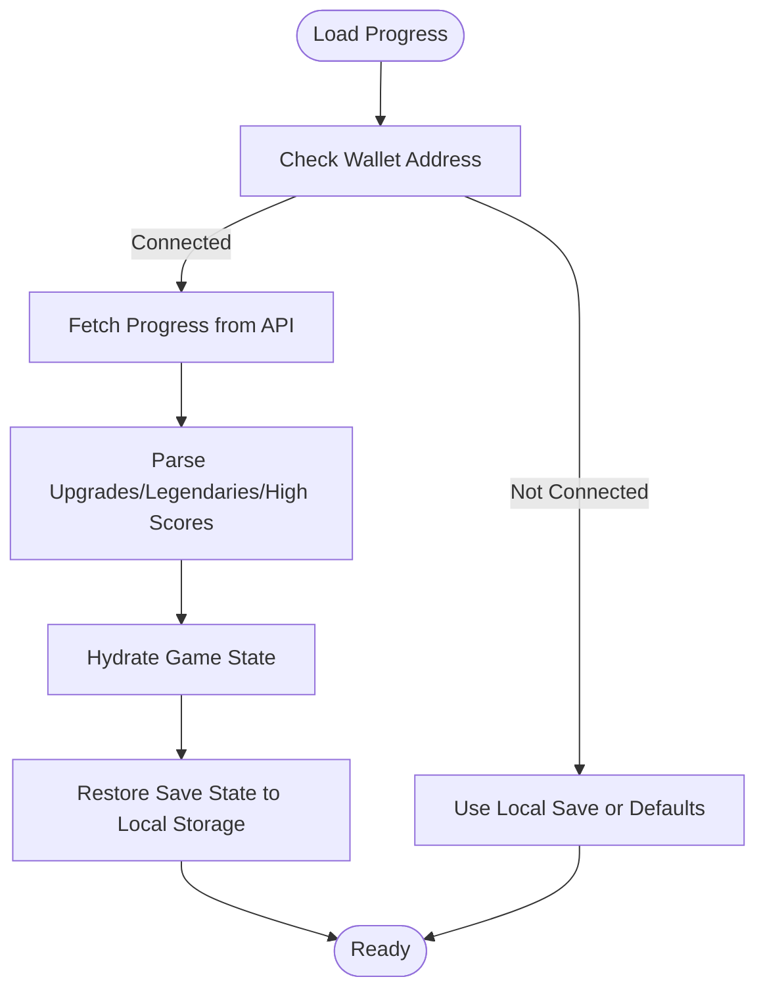

# Database and Storage

<cite>
**Referenced Files in This Document**
- [schema.sql](file://server/db/schema.sql)
- [supabase.js](file://server/db/supabase.js)
- [pool.js](file://server/db/pool.js)
- [users.js](file://server/db/users.js)
- [auth.js](file://server/routes/auth.js)
- [challenge.js](file://server/auth/challenge.js)
- [token.js](file://server/auth/token.js)
- [jwtAuth.js](file://server/middleware/jwtAuth.js)
- [run_db_schema.js](file://scripts/run_db_schema.js)
- [walletProgressService.js](file://src/utils/walletProgressService.js)
- [walletProgressApi.js](file://src/utils/walletProgressApi.js)
- [stellarWallet.js](file://src/utils/stellarWallet.js)
- [SaveManager.js](file://src/systems/SaveManager.js)
- [gameProof.js](file://src/zk/gameProof.js)
</cite>

## Table of Contents
1. [Introduction](#introduction)
2. [Project Structure](#project-structure)
3. [Core Components](#core-components)
4. [Architecture Overview](#architecture-overview)
5. [Detailed Component Analysis](#detailed-component-analysis)
6. [Dependency Analysis](#dependency-analysis)
7. [Performance Considerations](#performance-considerations)
8. [Troubleshooting Guide](#troubleshooting-guide)
9. [Conclusion](#conclusion)
10. [Appendices](#appendices)

## Introduction
This document explains Vibe-Coder’s database and storage systems. It covers:
- Supabase integration for user identity and optional external database support
- PostgreSQL connection pooling and schema design
- User management flows (registration, authentication, and token storage)
- Player progress storage using in-memory fallback, local storage, and wallet-backed persistence
- Integration with blockchain-based systems for provable fairness and persistence
- Data validation, connection management, and query patterns

## Project Structure
The storage system spans backend database utilities, Express routes, middleware, and frontend utilities:
- Backend database layer: connection pooling, Supabase client, and user persistence
- Authentication pipeline: challenge generation, token issuance, and JWT middleware
- Frontend progress layer: wallet-backed persistence, local storage for runs, and wallet utilities
- Blockchain utilities: deterministic run hashing and validation rules

**Diagram sources**
- [auth.js](file://server/routes/auth.js#L1-L115)
- [jwtAuth.js](file://server/middleware/jwtAuth.js#L1-L36)
- [challenge.js](file://server/auth/challenge.js#L1-L87)
- [token.js](file://server/auth/token.js#L1-L80)
- [users.js](file://server/db/users.js#L1-L181)
- [pool.js](file://server/db/pool.js#L1-L36)
- [supabase.js](file://server/db/supabase.js#L1-L23)
- [schema.sql](file://server/db/schema.sql#L1-L31)
- [stellarWallet.js](file://src/utils/stellarWallet.js#L1-L115)
- [walletProgressApi.js](file://src/utils/walletProgressApi.js#L1-L46)
- [walletProgressService.js](file://src/utils/walletProgressService.js#L1-L140)
- [SaveManager.js](file://src/systems/SaveManager.js#L1-L187)
- [gameProof.js](file://src/zk/gameProof.js#L1-L78)

**Section sources**
- [auth.js](file://server/routes/auth.js#L1-L115)
- [jwtAuth.js](file://server/middleware/jwtAuth.js#L1-L36)
- [challenge.js](file://server/auth/challenge.js#L1-L87)
- [token.js](file://server/auth/token.js#L1-L80)
- [users.js](file://server/db/users.js#L1-L181)
- [pool.js](file://server/db/pool.js#L1-L36)
- [supabase.js](file://server/db/supabase.js#L1-L23)
- [schema.sql](file://server/db/schema.sql#L1-L31)
- [stellarWallet.js](file://src/utils/stellarWallet.js#L1-L115)
- [walletProgressApi.js](file://src/utils/walletProgressApi.js#L1-L46)
- [walletProgressService.js](file://src/utils/walletProgressService.js#L1-L140)
- [SaveManager.js](file://src/systems/SaveManager.js#L1-L187)
- [gameProof.js](file://src/zk/gameProof.js#L1-L78)

## Core Components
- Supabase client and table constants for optional external user storage
- PostgreSQL connection pool with SSL and idle timeouts
- User persistence with three-tier fallback: Supabase → PostgreSQL → in-memory
- Wallet-backed progress service for upgrades, legendaries, high scores, and save state
- Local storage-based run persistence with automatic cleanup
- JWT-based authentication pipeline compliant with SEP-10
- Blockchain utilities for deterministic run hashing and rule validation

**Section sources**
- [supabase.js](file://server/db/supabase.js#L1-L23)
- [pool.js](file://server/db/pool.js#L1-L36)
- [users.js](file://server/db/users.js#L1-L181)
- [walletProgressService.js](file://src/utils/walletProgressService.js#L1-L140)
- [SaveManager.js](file://src/systems/SaveManager.js#L1-L187)
- [jwtAuth.js](file://server/middleware/jwtAuth.js#L1-L36)
- [challenge.js](file://server/auth/challenge.js#L1-L87)
- [token.js](file://server/auth/token.js#L1-L80)
- [gameProof.js](file://src/zk/gameProof.js#L1-L78)

## Architecture Overview
The system supports multiple persistence backends and authentication providers:
- Authentication: Freighter-based SEP-10 challenge/token flow, JWT middleware, and protected routes
- Identity storage: Supabase table for users (optional), PostgreSQL table for users (fallback), or in-memory map (dev)
- Progress storage: Wallet-backed API for persistent upgrades/legendaries/high scores/save state
- Run storage: Local storage for temporary run checkpoints with TTL and cleanup
- Blockchain: Deterministic run hashing and validation rules for provable fairness

**Diagram sources**
- [auth.js](file://server/routes/auth.js#L1-L115)
- [challenge.js](file://server/auth/challenge.js#L1-L87)
- [token.js](file://server/auth/token.js#L1-L80)
- [users.js](file://server/db/users.js#L1-L181)
- [pool.js](file://server/db/pool.js#L1-L36)
- [supabase.js](file://server/db/supabase.js#L1-L23)
- [jwtAuth.js](file://server/middleware/jwtAuth.js#L1-L36)

## Detailed Component Analysis

### Database Schema and Connection Management
- PostgreSQL schema defines a users table with UUID primary key, unique public_key, optional username, JWT fields, and timestamps. An index is created on public_key, and a trigger updates updated_at on row changes.
- The connection pool is created from DATABASE_URL with SSL disabled for localhost and enabled otherwise. It limits concurrency and manages idle clients.
- A helper script applies the schema to the configured database.

**Diagram sources**
- [schema.sql](file://server/db/schema.sql#L5-L31)

**Section sources**
- [schema.sql](file://server/db/schema.sql#L1-L31)
- [pool.js](file://server/db/pool.js#L1-L36)
- [run_db_schema.js](file://scripts/run_db_schema.js#L1-L38)

### Supabase Integration
- The Supabase client is lazily initialized using either a service role key or anonymous key. If neither is present, the client remains null.
- The users table constant is exported for use in user operations.
- User operations prefer Supabase when available; otherwise they fall back to PostgreSQL or in-memory storage.

**Section sources**
- [supabase.js](file://server/db/supabase.js#L1-L23)
- [users.js](file://server/db/users.js#L1-L181)

### User Management and Authentication Pipeline
- The authentication routes expose GET /auth (challenge) and POST /auth (token), plus backward-compatible endpoints.
- The challenge builder validates the account parameter and constructs a signed challenge transaction with manage-data operations and timebounds.
- The token issuer verifies the signed challenge against server and client signers, issues a JWT, and persists the token for the user.
- JWT middleware validates Authorization headers and decodes tokens using HS256.

**Diagram sources**
- [auth.js](file://server/routes/auth.js#L1-L115)
- [challenge.js](file://server/auth/challenge.js#L1-L87)
- [token.js](file://server/auth/token.js#L1-L80)
- [users.js](file://server/db/users.js#L1-L181)
- [pool.js](file://server/db/pool.js#L1-L36)
- [supabase.js](file://server/db/supabase.js#L1-L23)

**Section sources**
- [auth.js](file://server/routes/auth.js#L1-L115)
- [challenge.js](file://server/auth/challenge.js#L1-L87)
- [token.js](file://server/auth/token.js#L1-L80)
- [jwtAuth.js](file://server/middleware/jwtAuth.js#L1-L36)

### Player Progress Storage and Wallet Integration
- Wallet-backed progress service loads and saves upgrades, legendaries, high scores, selected character, and save state via a server API keyed by wallet address.
- The wallet progress API determines the backend URL from environment/config and performs fetch requests to load/save progress.
- Local storage is used for run persistence with automatic cleanup after 24 hours.
- Wallet utilities provide connection, caching, signing, and disconnection flows.

**Diagram sources**
- [walletProgressService.js](file://src/utils/walletProgressService.js#L1-L140)
- [walletProgressApi.js](file://src/utils/walletProgressApi.js#L1-L46)
- [SaveManager.js](file://src/systems/SaveManager.js#L1-L187)
- [stellarWallet.js](file://src/utils/stellarWallet.js#L1-L115)

**Section sources**
- [walletProgressService.js](file://src/utils/walletProgressService.js#L1-L140)
- [walletProgressApi.js](file://src/utils/walletProgressApi.js#L1-L46)
- [SaveManager.js](file://src/systems/SaveManager.js#L1-L187)
- [stellarWallet.js](file://src/utils/stellarWallet.js#L1-L115)

### Blockchain-Based Persistence and Provable Fairness
- Deterministic run hashing binds player address, wave, score, run seed, and timestamp into a SHA-256 hash.
- Validation rules enforce minimum score per wave and sane bounds for wave and score.
- Random run seeds are generated at run start and used to compute the final hash at run end.

**Diagram sources**
- [gameProof.js](file://src/zk/gameProof.js#L1-L78)

**Section sources**
- [gameProof.js](file://src/zk/gameProof.js#L1-L78)

## Dependency Analysis
- Backend routes depend on middleware, challenge builder, token issuer, and user DB layer.
- User DB layer depends on connection pool and Supabase client, with in-memory fallback.
- Frontend progress service depends on wallet utilities and wallet progress API.
- Save manager depends on local storage and is used by the progress service.

**Diagram sources**
- [auth.js](file://server/routes/auth.js#L1-L115)
- [challenge.js](file://server/auth/challenge.js#L1-L87)
- [token.js](file://server/auth/token.js#L1-L80)
- [users.js](file://server/db/users.js#L1-L181)
- [pool.js](file://server/db/pool.js#L1-L36)
- [supabase.js](file://server/db/supabase.js#L1-L23)
- [walletProgressService.js](file://src/utils/walletProgressService.js#L1-L140)
- [walletProgressApi.js](file://src/utils/walletProgressApi.js#L1-L46)
- [stellarWallet.js](file://src/utils/stellarWallet.js#L1-L115)
- [SaveManager.js](file://src/systems/SaveManager.js#L1-L187)

**Section sources**
- [auth.js](file://server/routes/auth.js#L1-L115)
- [users.js](file://server/db/users.js#L1-L181)
- [walletProgressService.js](file://src/utils/walletProgressService.js#L1-L140)
- [SaveManager.js](file://src/systems/SaveManager.js#L1-L187)

## Performance Considerations
- Connection pooling: The pool limits concurrent connections and releases clients promptly after queries. Disable SSL locally to avoid handshake overhead; enable SSL in production for secure cloud databases.
- Indexing: A unique index on public_key accelerates lookups and upserts.
- Fallback strategies: In-memory storage avoids database round-trips during development but does not persist across sessions.
- Local storage TTL: Run saves older than 24 hours are cleared automatically to prevent stale state accumulation.
- API calls: Wallet progress API calls should be batched or debounced to minimize network overhead.

[No sources needed since this section provides general guidance]

## Troubleshooting Guide
- Authentication failures:
  - Ensure JWT_SECRET is configured and matches the middleware expectations.
  - Verify the Authorization header format and token validity.
  - Confirm challenge and token endpoints are reachable and the server responds with proper errors.
- Database connectivity:
  - Check DATABASE_URL and SSL settings; confirm the pool initializes and queries succeed.
  - Apply the schema using the provided script if tables are missing.
- Supabase integration:
  - Confirm SUPABASE_URL and keys are set; if both service and anonymous keys are present, the service key takes precedence.
- Wallet progress:
  - Verify the progress API URL resolution and network availability.
  - Ensure wallet is connected and address is cached; retry saving if the initial attempt fails.
- Run persistence:
  - If a save is too old, it is cleared automatically; re-run the game to create a new save.

**Section sources**
- [jwtAuth.js](file://server/middleware/jwtAuth.js#L1-L36)
- [token.js](file://server/auth/token.js#L1-L80)
- [pool.js](file://server/db/pool.js#L1-L36)
- [run_db_schema.js](file://scripts/run_db_schema.js#L1-L38)
- [supabase.js](file://server/db/supabase.js#L1-L23)
- [walletProgressApi.js](file://src/utils/walletProgressApi.js#L1-L46)
- [SaveManager.js](file://src/systems/SaveManager.js#L1-L187)

## Conclusion
Vibe-Coder’s storage architecture combines robust authentication with flexible persistence:
- Authentication is handled via Freighter and SEP-10, issuing JWTs verified by middleware.
- Identity storage supports Supabase, PostgreSQL, and in-memory fallbacks.
- Player progress is persisted wallet-backed with local run storage for temporary checkpoints.
- Blockchain utilities provide deterministic hashing and validation for provable fairness.
This layered design ensures resilience, scalability, and user-centric persistence across environments.

[No sources needed since this section summarizes without analyzing specific files]

## Appendices

### Database Schema Reference
- Table: users
  - Columns: id (UUID, PK), public_key (VARCHAR, UNIQUE), username (VARCHAR), current_jwt (TEXT), jwt_expires_at (TIMESTAMPTZ), created_at (TIMESTAMPTZ), updated_at (TIMESTAMPTZ)
  - Index: users_public_key_idx on public_key
  - Trigger: set_updated_at() updates updated_at on row changes

**Section sources**
- [schema.sql](file://server/db/schema.sql#L5-L31)

### Environment Variables
- DATABASE_URL: PostgreSQL connection string for the pool
- SUPABASE_URL: Supabase project URL
- SUPABASE_ANON_KEY: Supabase anonymous key
- SUPABASE_SERVICE_ROLE_KEY: Supabase service role key
- JWT_SECRET: Secret for signing JWTs
- VITE_PROGRESS_API_URL or VITE_ZK_PROVER_URL: Backend URL for wallet progress API

**Section sources**
- [pool.js](file://server/db/pool.js#L1-L36)
- [supabase.js](file://server/db/supabase.js#L1-L23)
- [jwtAuth.js](file://server/middleware/jwtAuth.js#L1-L36)
- [walletProgressApi.js](file://src/utils/walletProgressApi.js#L1-L46)