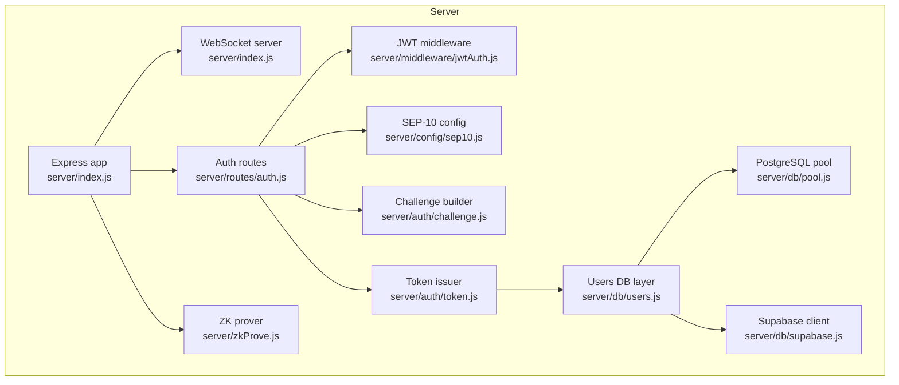
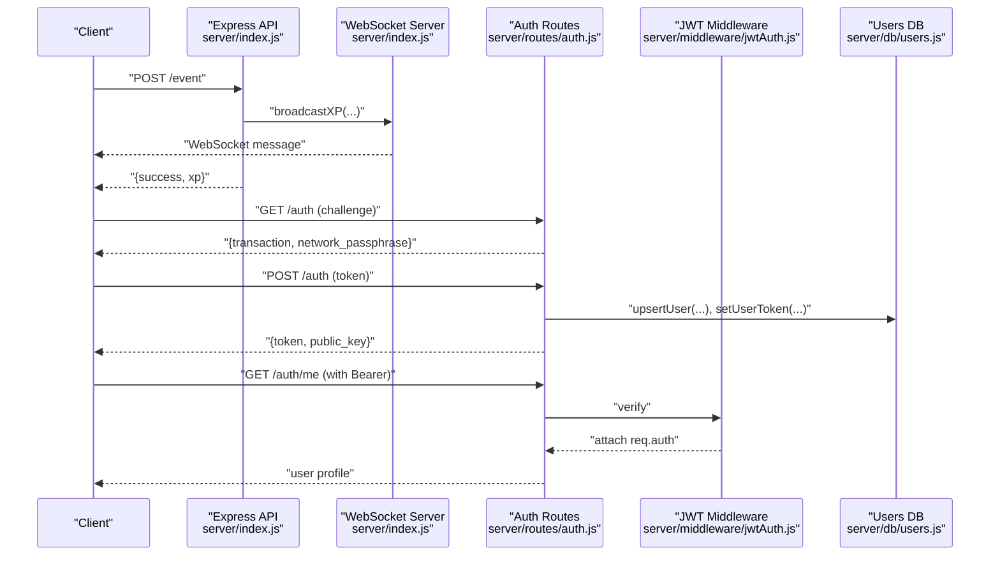
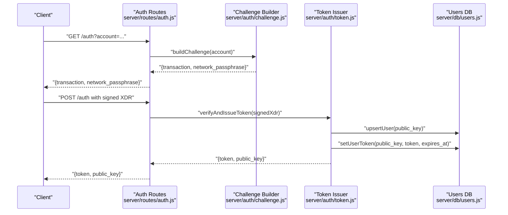
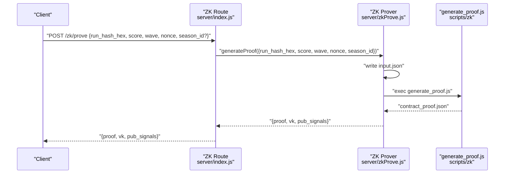
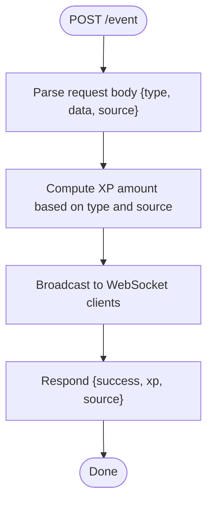
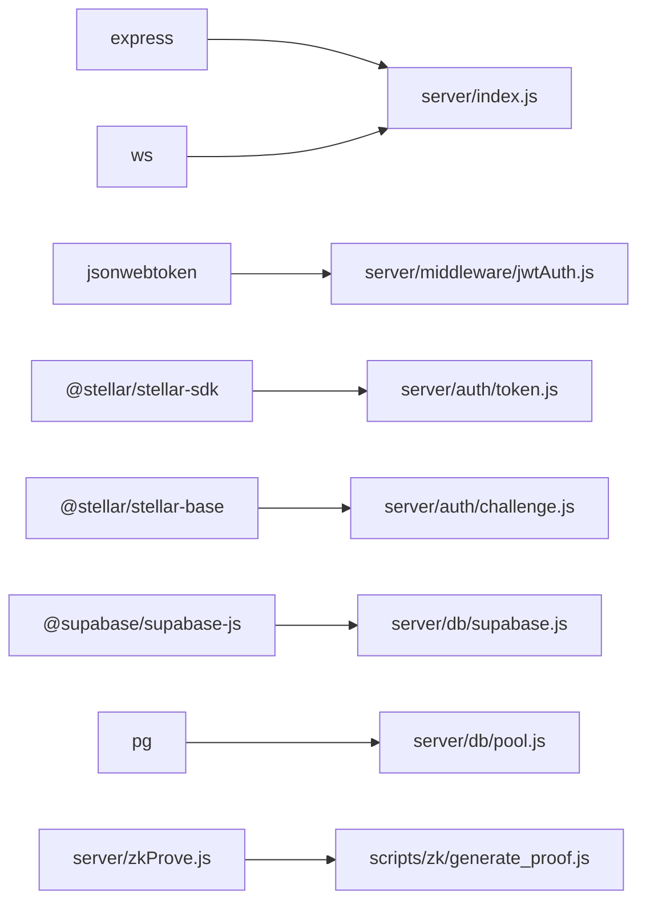

# Express Server

<cite>
**Referenced Files in This Document**
- [server/index.js](file://server/index.js)
- [server/routes/auth.js](file://server/routes/auth.js)
- [server/middleware/jwtAuth.js](file://server/middleware/jwtAuth.js)
- [server/config/sep10.js](file://server/config/sep10.js)
- [server/auth/challenge.js](file://server/auth/challenge.js)
- [server/auth/token.js](file://server/auth/token.js)
- [server/db/users.js](file://server/db/users.js)
- [server/db/pool.js](file://server/db/pool.js)
- [server/db/supabase.js](file://server/db/supabase.js)
- [server/db/schema.sql](file://server/db/schema.sql)
- [server/zkProve.js](file://server/zkProve.js)
- [.env.example](file://.env.example)
- [package.json](file://package.json)
- [render.yaml](file://render.yaml)
- [Dockerfile.prover](file://Dockerfile.prover)
</cite>

## Table of Contents
1. [Introduction](#introduction)
2. [Project Structure](#project-structure)
3. [Core Components](#core-components)
4. [Architecture Overview](#architecture-overview)
5. [Detailed Component Analysis](#detailed-component-analysis)
6. [Dependency Analysis](#dependency-analysis)
7. [Performance Considerations](#performance-considerations)
8. [Troubleshooting Guide](#troubleshooting-guide)
9. [Conclusion](#conclusion)
10. [Appendices](#appendices)

## Introduction
This document describes Vibe-Coder’s Express server implementation. It covers server initialization, middleware configuration (including CORS handling and JSON parsing limits), routing architecture for REST endpoints, authentication via Stellar SEP-10, progress persistence, leaderboard, ZK proof generation, health checks, 404 handling, error handling, configuration and environment variables, and deployment considerations. The server also exposes a WebSocket endpoint to broadcast XP events to connected clients.

## Project Structure
The server is implemented as a single Express application with modularized concerns:
- Entry point initializes the HTTP server, WebSocket server, middleware, routes, and endpoints.
- Authentication routes and middleware integrate with Stellar SEP-10 and JWT.
- Database abstraction supports Supabase, PostgreSQL, or in-memory storage.
- ZK proof generation integrates with prebuilt circuits and Node scripts.

**Diagram sources**
- [server/index.js](file://server/index.js#L1-L246)
- [server/routes/auth.js](file://server/routes/auth.js#L1-L115)
- [server/middleware/jwtAuth.js](file://server/middleware/jwtAuth.js#L1-L36)
- [server/config/sep10.js](file://server/config/sep10.js#L1-L87)
- [server/auth/challenge.js](file://server/auth/challenge.js#L1-L87)
- [server/auth/token.js](file://server/auth/token.js#L1-L80)
- [server/db/users.js](file://server/db/users.js#L1-L181)
- [server/db/pool.js](file://server/db/pool.js#L1-L36)
- [server/db/supabase.js](file://server/db/supabase.js#L1-L23)
- [server/zkProve.js](file://server/zkProve.js#L1-L68)

**Section sources**
- [server/index.js](file://server/index.js#L1-L246)
- [package.json](file://package.json#L1-L135)

## Core Components
- Express app and HTTP server creation with JSON body parsing limit.
- CORS middleware for cross-origin requests.
- WebSocket server for XP broadcasting to clients.
- Routing for:
  - Health check
  - Authentication (SEP-10 challenge and token issuance)
  - Player progress persistence
  - Leaderboard
  - ZK proof generation
  - 404 handling and global error handler

Key implementation references:
- Server initialization and middleware: [server/index.js](file://server/index.js#L9-L25)
- WebSocket setup and XP broadcast: [server/index.js](file://server/index.js#L53-L76)
- Endpoint definitions: [server/index.js](file://server/index.js#L99-L229)
- ZK proof generation: [server/zkProve.js](file://server/zkProve.js#L46-L67)

**Section sources**
- [server/index.js](file://server/index.js#L1-L246)
- [server/zkProve.js](file://server/zkProve.js#L1-L68)

## Architecture Overview
The server composes Express with a WebSocket server to deliver real-time XP updates and REST APIs. Authentication is handled via Stellar SEP-10 with JWT issuance. Data persistence is flexible, supporting Supabase, PostgreSQL, or in-memory storage. ZK proof generation is offloaded to a dedicated Docker-based service.

**Diagram sources**
- [server/index.js](file://server/index.js#L53-L113)
- [server/routes/auth.js](file://server/routes/auth.js#L19-L94)
- [server/middleware/jwtAuth.js](file://server/middleware/jwtAuth.js#L9-L35)
- [server/db/users.js](file://server/db/users.js#L53-L94)

## Detailed Component Analysis

### Server Initialization and Middleware
- JSON parsing limit is set to 512kb.
- CORS headers are set globally for GET, POST, PATCH, OPTIONS with Content-Type and Authorization.
- Options preflight returns 200 immediately.
- Root health endpoint returns a simple status.
- WebSocket server is created from the same HTTP server and maintains a Set of connected clients.

Implementation references:
- JSON limit and CORS: [server/index.js](file://server/index.js#L12-L20)
- Root health: [server/index.js](file://server/index.js#L22-L25)
- WebSocket setup: [server/index.js](file://server/index.js#L53-L61)

**Section sources**
- [server/index.js](file://server/index.js#L1-L246)

### Routing Architecture

#### Health Check: GET /
- Returns server status, client count, and uptime.

Reference:
- [server/index.js](file://server/index.js#L218-L224)

#### Authentication: /auth
- GET /auth or GET /auth/challenge: builds a SEP-10 challenge transaction and network passphrase.
- POST /auth or POST /auth/token: verifies signed challenge and issues JWT.
- GET /auth/me: protected route returning user profile.
- PATCH /auth/me/username: protected route to set/update username.

References:
- Route wiring and handlers: [server/index.js](file://server/index.js#L27-L28), [server/routes/auth.js](file://server/routes/auth.js#L57-L112)
- Challenge building: [server/auth/challenge.js](file://server/auth/challenge.js#L64-L86)
- Token issuance and verification: [server/auth/token.js](file://server/auth/token.js#L29-L79)
- JWT middleware: [server/middleware/jwtAuth.js](file://server/middleware/jwtAuth.js#L9-L35)
- User persistence: [server/db/users.js](file://server/db/users.js#L28-L125)

#### Player Progress: /player/:address/progress
- GET returns persisted progress for an address with defaults if none exists.
- POST persists upgrades, legendaries, highWave, highScore, saveState, and selectedCharacter.

References:
- Handlers: [server/index.js](file://server/index.js#L129-L154)

#### Leaderboard: /leaderboard
- GET returns top 10 entries sorted by score, wave, then date.
- POST adds or updates an entry; caps total entries at 50.

References:
- Handlers: [server/index.js](file://server/index.js#L159-L194)

#### ZK Proof Generation: /zk/prove
- Validates required fields and delegates proof generation to zkProve module.
- Returns contract-ready proof payload or error.

References:
- Handler: [server/index.js](file://server/index.js#L196-L216)
- ZK generator: [server/zkProve.js](file://server/zkProve.js#L46-L67)

#### XP Broadcasting: /event and /cli/:source
- /event accepts type, data, and source; computes XP based on type and source, then broadcasts to WebSocket clients.
- /cli/:source accepts action and data; validates source and broadcasts XP.

References:
- Handler: [server/index.js](file://server/index.js#L99-L125)
- XP values and sources: [server/index.js](file://server/index.js#L78-L97)

#### 404 Handling and Global Error Handler
- Catch-all 404 handler returns JSON error.
- Global error handler returns standardized JSON error with appropriate status.

References:
- 404 and error handler: [server/index.js](file://server/index.js#L226-L239)

**Section sources**
- [server/index.js](file://server/index.js#L27-L229)
- [server/routes/auth.js](file://server/routes/auth.js#L1-L115)
- [server/middleware/jwtAuth.js](file://server/middleware/jwtAuth.js#L1-L36)
- [server/auth/challenge.js](file://server/auth/challenge.js#L1-L87)
- [server/auth/token.js](file://server/auth/token.js#L1-L80)
- [server/db/users.js](file://server/db/users.js#L1-L181)
- [server/zkProve.js](file://server/zkProve.js#L1-L68)

### Authentication Flow (SEP-10)

**Diagram sources**
- [server/routes/auth.js](file://server/routes/auth.js#L19-L55)
- [server/auth/challenge.js](file://server/auth/challenge.js#L64-L86)
- [server/auth/token.js](file://server/auth/token.js#L29-L79)
- [server/db/users.js](file://server/db/users.js#L53-L94)

### ZK Proof Generation Flow

**Diagram sources**
- [server/index.js](file://server/index.js#L196-L216)
- [server/zkProve.js](file://server/zkProve.js#L46-L67)

### XP Broadcasting Flow

**Diagram sources**
- [server/index.js](file://server/index.js#L99-L113)

## Dependency Analysis
- Express and ws power HTTP and WebSocket servers.
- jsonwebtoken handles JWT signing and verification.
- @stellar/stellar-sdk and @stellar/stellar-base support SEP-10 challenge and verification.
- Database layer supports Supabase and PostgreSQL with a fallback to in-memory storage.
- ZK prover depends on external scripts and prebuilt circuit artifacts.

**Diagram sources**
- [server/index.js](file://server/index.js#L1-L246)
- [server/middleware/jwtAuth.js](file://server/middleware/jwtAuth.js#L1-L36)
- [server/auth/token.js](file://server/auth/token.js#L1-L80)
- [server/auth/challenge.js](file://server/auth/challenge.js#L1-L87)
- [server/db/supabase.js](file://server/db/supabase.js#L1-L23)
- [server/db/pool.js](file://server/db/pool.js#L1-L36)
- [server/zkProve.js](file://server/zkProve.js#L1-L68)

**Section sources**
- [package.json](file://package.json#L31-L42)
- [server/index.js](file://server/index.js#L1-L246)

## Performance Considerations
- JSON body parsing limit is set to 512kb to prevent large payloads.
- WebSocket broadcast iterates over connected clients; consider rate limiting or throttling if client counts grow large.
- ZK proof generation executes an external script with a timeout; ensure adequate CPU/memory resources and prebuilt circuit artifacts.
- Database operations use a connection pool with conservative limits; monitor contention under load.
- CORS is permissive; restrict origins in production if applicable.

[No sources needed since this section provides general guidance]

## Troubleshooting Guide
Common issues and remedies:
- 404 Not Found: Ensure endpoint paths match documented routes.
- Global error handler: Inspect returned error messages and status codes.
- Authentication errors:
  - SEP-10 not configured: Verify server secret key and JWT secret are set.
  - Invalid Authorization header or token: Confirm Bearer token format and expiration.
  - Transaction verification failures: Validate signed XDR and network passphrase.
- ZK proof generation:
  - Missing circuit artifacts: Ensure prebuilt circuit files exist.
  - Script execution failures: Check logs for external tool errors.
- Database connectivity:
  - Supabase or PostgreSQL misconfiguration: Confirm credentials and table existence.

References:
- 404 and error handler: [server/index.js](file://server/index.js#L226-L239)
- JWT middleware: [server/middleware/jwtAuth.js](file://server/middleware/jwtAuth.js#L9-L35)
- SEP-10 configuration: [server/config/sep10.js](file://server/config/sep10.js#L76-L86)
- ZK prover: [server/zkProve.js](file://server/zkProve.js#L46-L67)
- Database schema: [server/db/schema.sql](file://server/db/schema.sql#L5-L13)

**Section sources**
- [server/index.js](file://server/index.js#L226-L239)
- [server/middleware/jwtAuth.js](file://server/middleware/jwtAuth.js#L1-L36)
- [server/config/sep10.js](file://server/config/sep10.js#L76-L86)
- [server/zkProve.js](file://server/zkProve.js#L1-L68)
- [server/db/schema.sql](file://server/db/schema.sql#L1-L31)

## Conclusion
The Express server provides a cohesive backend for Vibe-Coder with robust authentication via Stellar SEP-10, real-time XP broadcasting via WebSocket, player progress persistence, leaderboard management, and ZK proof generation. Its modular design and flexible database layer enable straightforward deployment across environments.

[No sources needed since this section summarizes without analyzing specific files]

## Appendices

### Environment Variables
Key environment variables and their roles:
- Authentication and SEP-10:
  - SEP10_ENABLED: Enable/disable SEP-10 auth
  - SEP10_SERVER_SECRET_KEY or SECRET_SEP10_SIGNING_SEED: Server’s Stellar secret key
  - JWT_SECRET or SECRET_SEP10_JWT_SECRET: JWT signing secret
  - SEP10_HOME_DOMAIN or SEP10_HOME_DOMAINS: Home domain(s)
  - SEP10_WEB_AUTH_DOMAIN: Domain hosting the auth endpoint
  - SEP10_NETWORK_PASSPHRASE: Network passphrase
  - SEP10_CHALLENGE_TIMEOUT or SEP10_AUTH_TIMEOUT: Challenge timeout
  - JWT_EXPIRY_SEC or SEP10_JWT_TIMEOUT: JWT expiry in seconds
- Database:
  - SUPABASE_URL and SUPABASE_ANON_KEY or SUPABASE_SERVICE_ROLE_KEY: Supabase credentials
  - DATABASE_URL: PostgreSQL connection string
- Frontend:
  - VITE_API_URL: Base URL for API endpoints
  - VITE_ZK_PROVER_URL: URL for ZK prover service

References:
- Example environment variables: [.env.example](file://.env.example#L18-L37)
- SEP-10 configuration loader: [server/config/sep10.js](file://server/config/sep10.js#L18-L86)
- Supabase client: [server/db/supabase.js](file://server/db/supabase.js#L8-L20)
- PostgreSQL pool: [server/db/pool.js](file://server/db/pool.js#L14-L24)

**Section sources**
- [.env.example](file://.env.example#L1-L37)
- [server/config/sep10.js](file://server/config/sep10.js#L1-L87)
- [server/db/supabase.js](file://server/db/supabase.js#L1-L23)
- [server/db/pool.js](file://server/db/pool.js#L1-L36)

### Deployment Considerations
- Docker-based ZK prover:
  - Uses a slim Node.js image, installs snarkjs globally, copies server, scripts, and circuits.
  - Exposes port 3333 and sets NODE_ENV=production.
  - Requires prebuilt circuit artifacts in circuits/build/.
- Render blueprint:
  - Deploys a web service using Dockerfile.prover.
  - Sets healthCheckPath to /health and NODE_ENV to production.

References:
- Dockerfile for ZK prover: [Dockerfile.prover](file://Dockerfile.prover#L1-L26)
- Render blueprint: [render.yaml](file://render.yaml#L1-L15)

**Section sources**
- [Dockerfile.prover](file://Dockerfile.prover#L1-L26)
- [render.yaml](file://render.yaml#L1-L15)

### Request/Response Patterns

- GET /health
  - Request: No body
  - Response: { status: "ok", clients: number, uptime: number }

- GET /.well-known/stellar.toml
  - Request: No body
  - Response: Plain text TOML document with version, network passphrase, signing key, and web auth endpoint

- POST /event
  - Request: { type: string, data?: object, source?: string }
  - Response: { success: true, xp: number, source: string }

- POST /cli/:source
  - Request: { action?: string, data?: object }
  - Response: { success: true, xp: number, source: string }

- GET /player/:address/progress
  - Request: Path param address
  - Response: { upgrades: object|null, legendaries: object|null, highWave: number, highScore: number, saveState: object|null, selectedCharacter: string }

- POST /player/:address/progress
  - Request: { upgrades?: object, legendaries?: object, highWave?: number, highScore?: number, saveState?: object, selectedCharacter?: string }
  - Response: { success: true }

- GET /leaderboard
  - Request: No body
  - Response: { entries: array of top 10 leaderboard items }

- POST /leaderboard
  - Request: { address: string, wave: number, score: number }
  - Response: { success: true, entries: array }

- POST /zk/prove
  - Request: { run_hash_hex: string, score: number, wave: number, nonce: number, season_id?: number }
  - Response: { proof: object, vk: object, pub_signals: string[] }

- GET /auth/challenge
  - Request: Query param account
  - Response: { transaction: string, network_passphrase: string }

- POST /auth/token
  - Request: { transaction: string } or { transaction_xdr: string } or raw base64 string
  - Response: { token: string, public_key: string }

- GET /auth/me
  - Request: Authorization: Bearer <token>
  - Response: { public_key: string, username: string|null, created_at: string, updated_at: string }

- PATCH /auth/me/username
  - Request: Authorization: Bearer <token>, Body: { username: string }
  - Response: { public_key: string, username: string|null, updated_at: string }

- 404 Not Found
  - Response: { error: "Not found" }

- Global Error Handler
  - Response: { error: string } with status derived from error or 500

**Section sources**
- [server/index.js](file://server/index.js#L22-L229)
- [server/routes/auth.js](file://server/routes/auth.js#L19-L112)
- [server/db/users.js](file://server/db/users.js#L79-L125)
- [server/zkProve.js](file://server/zkProve.js#L46-L67)