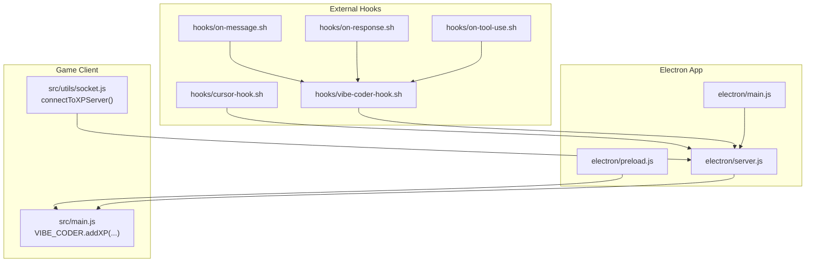
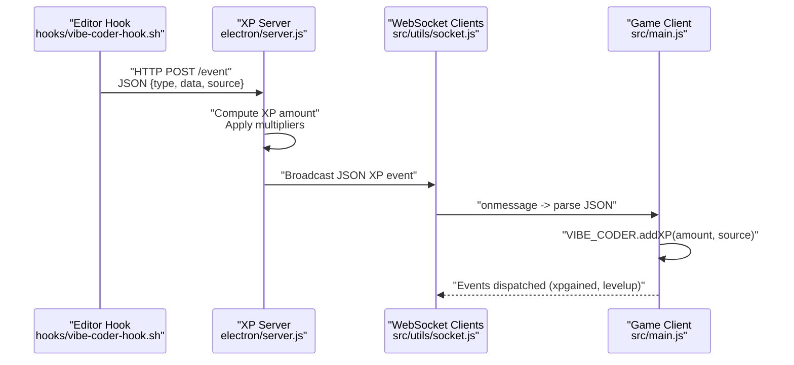
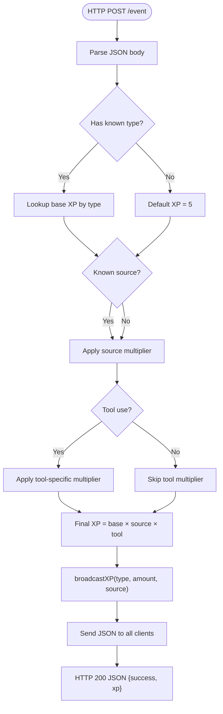
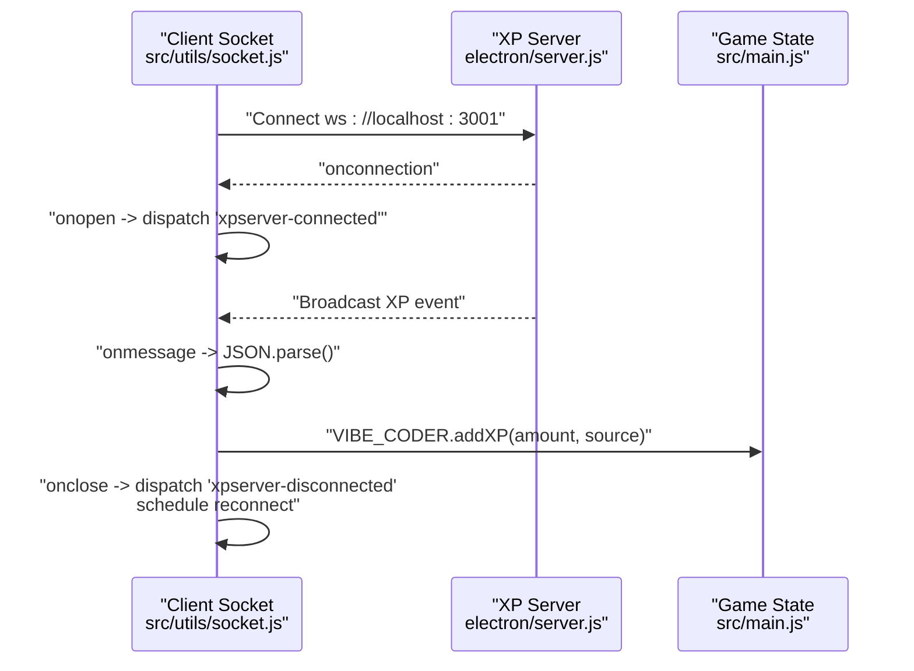
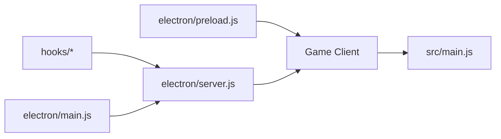

# WebSocket Communication

<cite>
**Referenced Files in This Document**
- [xp-server.js](file://xp-server.js)
- [electron/server.js](file://electron/server.js)
- [src/utils/socket.js](file://src/utils/socket.js)
- [electron/main.js](file://electron/main.js)
- [electron/preload.js](file://electron/preload.js)
- [src/main.js](file://src/main.js)
- [hooks/vibe-coder-hook.sh](file://hooks/vibe-coder-hook.sh)
- [hooks/on-message.sh](file://hooks/on-message.sh)
- [hooks/on-response.sh](file://hooks/on-response.sh)
- [hooks/on-tool-use.sh](file://hooks/on-tool-use.sh)
- [hooks/cursor-hook.sh](file://hooks/cursor-hook.sh)
</cite>

## Table of Contents
1. [Introduction](#introduction)
2. [Project Structure](#project-structure)
3. [Core Components](#core-components)
4. [Architecture Overview](#architecture-overview)
5. [Detailed Component Analysis](#detailed-component-analysis)
6. [Dependency Analysis](#dependency-analysis)
7. [Performance Considerations](#performance-considerations)
8. [Troubleshooting Guide](#troubleshooting-guide)
9. [Conclusion](#conclusion)

## Introduction
This document explains Vibe-Coder’s WebSocket-based XP (experience points) communication system. It covers the Electron-built XP server, client connection lifecycle, real-time XP broadcasting, message serialization/deserialization, XP value calculation with multipliers, and client-side integration patterns. It also provides examples of message formats, performance considerations for concurrent connections, and error handling strategies.

## Project Structure
The XP system spans three primary areas:
- Electron-built XP server that exposes both HTTP endpoints and a WebSocket server
- Client-side WebSocket connector that connects to the Electron server
- CLI and editor hooks that emit XP events to the server

**Diagram sources**
- [electron/main.js](file://electron/main.js#L128-L144)
- [electron/server.js](file://electron/server.js#L75-L151)
- [electron/preload.js](file://electron/preload.js#L24-L30)
- [src/main.js](file://src/main.js#L337-L364)
- [src/utils/socket.js](file://src/utils/socket.js#L18-L104)
- [hooks/vibe-coder-hook.sh](file://hooks/vibe-coder-hook.sh#L14-L20)
- [hooks/on-message.sh](file://hooks/on-message.sh#L3)
- [hooks/on-response.sh](file://hooks/on-response.sh#L3)
- [hooks/on-tool-use.sh](file://hooks/on-tool-use.sh#L3)
- [hooks/cursor-hook.sh](file://hooks/cursor-hook.sh#L15-L20)

**Section sources**
- [electron/main.js](file://electron/main.js#L128-L144)
- [electron/server.js](file://electron/server.js#L75-L151)
- [src/utils/socket.js](file://src/utils/socket.js#L18-L104)
- [src/main.js](file://src/main.js#L337-L364)
- [hooks/vibe-coder-hook.sh](file://hooks/vibe-coder-hook.sh#L14-L20)

## Core Components
- Electron-built XP server
  - HTTP endpoints for receiving XP events from CLI/editor hooks
  - WebSocket server for real-time XP broadcasts to the game client
  - XP value system with multipliers per source and event type
- Client-side WebSocket connector
  - Connects to the Electron server, parses messages, and updates game XP
  - Handles reconnection and disconnection events
- CLI/editor integration hooks
  - Emit structured events to the XP server via HTTP POST

Key implementation references:
- Server initialization and endpoints: [electron/server.js](file://electron/server.js#L75-L151)
- XP broadcasting function: [electron/server.js](file://electron/server.js#L48-L73)
- Client connection lifecycle: [electron/server.js](file://electron/server.js#L87-L97)
- Client-side WebSocket connector: [src/utils/socket.js](file://src/utils/socket.js#L18-L104)
- Game XP consumption: [src/main.js](file://src/main.js#L337-L364)
- CLI hook integration: [hooks/vibe-coder-hook.sh](file://hooks/vibe-coder-hook.sh#L14-L20), [hooks/cursor-hook.sh](file://hooks/cursor-hook.sh#L15-L20)

**Section sources**
- [electron/server.js](file://electron/server.js#L48-L151)
- [src/utils/socket.js](file://src/utils/socket.js#L18-L104)
- [src/main.js](file://src/main.js#L337-L364)
- [hooks/vibe-coder-hook.sh](file://hooks/vibe-coder-hook.sh#L14-L20)
- [hooks/cursor-hook.sh](file://hooks/cursor-hook.sh#L15-L20)

## Architecture Overview
The XP system uses a dual-mode architecture:
- HTTP ingestion: CLI/editor hooks POST events to the XP server
- Real-time distribution: The XP server broadcasts XP events over WebSocket to the game client

**Diagram sources**
- [hooks/vibe-coder-hook.sh](file://hooks/vibe-coder-hook.sh#L14-L20)
- [electron/server.js](file://electron/server.js#L100-L119)
- [electron/server.js](file://electron/server.js#L48-L73)
- [src/utils/socket.js](file://src/utils/socket.js#L54-L72)
- [src/main.js](file://src/main.js#L337-L364)

## Detailed Component Analysis

### Electron-built XP Server
The Electron XP server provides:
- HTTP endpoint for external hooks to submit XP events
- WebSocket server for live XP broadcasts
- XP value computation with per-source and per-event multipliers
- Server state tracking and health endpoint

Key behaviors:
- HTTP POST /event: Parses incoming JSON, computes XP amount, and broadcasts to WebSocket clients
- HTTP POST /cli/:source: Handles CLI-specific activities and broadcasts XP
- WebSocket on connection: Tracks connected clients and cleans up on close
- Broadcast function: Sends formatted XP events to all connected clients

**Diagram sources**
- [electron/server.js](file://electron/server.js#L100-L119)
- [electron/server.js](file://electron/server.js#L48-L73)

**Section sources**
- [electron/server.js](file://electron/server.js#L18-L29)
- [electron/server.js](file://electron/server.js#L48-L73)
- [electron/server.js](file://electron/server.js#L75-L97)
- [electron/server.js](file://electron/server.js#L100-L133)
- [electron/server.js](file://electron/server.js#L135-L142)

### Client-side WebSocket Connector
The client-side connector:
- Establishes a WebSocket connection to the Electron server
- Parses incoming XP events and forwards them to the game state
- Emits connection/disconnection events for UI feedback
- Implements automatic reconnection on close/error

**Diagram sources**
- [src/utils/socket.js](file://src/utils/socket.js#L18-L104)
- [electron/server.js](file://electron/server.js#L87-L97)
- [src/main.js](file://src/main.js#L337-L364)

**Section sources**
- [src/utils/socket.js](file://src/utils/socket.js#L18-L104)
- [electron/server.js](file://electron/server.js#L87-L97)
- [src/main.js](file://src/main.js#L337-L364)

### XP Value System and Multipliers
XP values and multipliers are defined centrally and applied during event processing:
- Base XP per event type
- Per-source multipliers (e.g., Claude, Cursor, Gemini, Codex, Copilot)
- Special tool-use multipliers for edits, writes, and bash actions
- CLI-specific XP for direct CLI actions

References:
- XP values and multipliers: [electron/server.js](file://electron/server.js#L18-L29)
- Source-specific XP adjustments: [electron/server.js](file://electron/server.js#L104-L109)
- Tool-use multipliers: [electron/server.js](file://electron/server.js#L112-L115)

**Section sources**
- [electron/server.js](file://electron/server.js#L18-L29)
- [electron/server.js](file://electron/server.js#L104-L115)

### Message Formats
The XP server broadcasts a standardized JSON payload to clients. The client parses and forwards the data to the game state.

- Broadcast message fields:
  - type: event type (e.g., message, response, tool_use)
  - amount: computed XP amount
  - source: originating tool/source
  - sourceName: uppercase display name
  - sourceColor: hex color for the source
  - timestamp: milliseconds since epoch

- Example message (described):
  - type: "tool_use"
  - amount: 15
  - source: "cursor"
  - sourceName: "CURSOR"
  - sourceColor: "#ff88ff"
  - timestamp: 1710000000000

References:
- Broadcast construction: [electron/server.js](file://electron/server.js#L50-L57)
- Client parsing and forwarding: [src/utils/socket.js](file://src/utils/socket.js#L54-L72)
- Game consumption: [src/main.js](file://src/main.js#L337-L364)

**Section sources**
- [electron/server.js](file://electron/server.js#L50-L57)
- [src/utils/socket.js](file://src/utils/socket.js#L54-L72)
- [src/main.js](file://src/main.js#L337-L364)

### Client-side Integration Patterns
- Automatic connection on localhost environments
- Event-driven UI updates via custom events
- Graceful fallback when server is unavailable
- Optional manual disconnection control

References:
- Connection guard and state: [src/utils/socket.js](file://src/utils/socket.js#L18-L31)
- Connection and disconnection events: [src/utils/socket.js](file://src/utils/socket.js#L38-L51), [src/utils/socket.js](file://src/utils/socket.js#L74-L87)
- Manual disconnect: [src/utils/socket.js](file://src/utils/socket.js#L110-L120)

**Section sources**
- [src/utils/socket.js](file://src/utils/socket.js#L18-L31)
- [src/utils/socket.js](file://src/utils/socket.js#L38-L51)
- [src/utils/socket.js](file://src/utils/socket.js#L74-L87)
- [src/utils/socket.js](file://src/utils/socket.js#L110-L120)

### Legacy Standalone XP Server (Deprecated)
A legacy standalone server existed previously, but the current production system runs within Electron. The legacy server is retained for historical context.

References:
- Legacy server file: [xp-server.js](file://xp-server.js#L1-L106)

**Section sources**
- [xp-server.js](file://xp-server.js#L1-L106)

## Dependency Analysis
The XP system exhibits clear separation of concerns:
- Hooks depend on the Electron XP server
- The Electron main process initializes and manages the XP server
- The preload bridge exposes server state and events to the renderer
- The game consumes XP events and updates internal state

**Diagram sources**
- [hooks/vibe-coder-hook.sh](file://hooks/vibe-coder-hook.sh#L14-L20)
- [electron/server.js](file://electron/server.js#L75-L151)
- [electron/main.js](file://electron/main.js#L128-L144)
- [electron/preload.js](file://electron/preload.js#L24-L30)
- [src/main.js](file://src/main.js#L337-L364)

**Section sources**
- [electron/main.js](file://electron/main.js#L128-L144)
- [electron/server.js](file://electron/server.js#L75-L151)
- [electron/preload.js](file://electron/preload.js#L24-L30)
- [src/main.js](file://src/main.js#L337-L364)
- [hooks/vibe-coder-hook.sh](file://hooks/vibe-coder-hook.sh#L14-L20)

## Performance Considerations
- Connection lifecycle
  - The server tracks clients in a Set and removes them on close, preventing leaks
  - Broadcast checks readyState before sending to avoid errors on closed sockets
- Message throughput
  - Broadcasting is O(n) with n = number of connected clients
  - For many concurrent clients, consider batching or rate limiting
- Serialization overhead
  - JSON stringify/send is lightweight; avoid unnecessary conversions
- Reconnection strategy
  - Client-side exponential backoff is not implemented; a simple fixed retry is used
- Resource cleanup
  - Server stops gracefully by closing all client sockets and shutting down HTTP/WebSocket servers

Recommendations:
- Monitor client count and broadcast latency under load
- Consider adding server-side rate limits for incoming events
- Add optional throttling of broadcasts if UI cannot keep up

**Section sources**
- [electron/server.js](file://electron/server.js#L87-L97)
- [electron/server.js](file://electron/server.js#L59-L63)
- [src/utils/socket.js](file://src/utils/socket.js#L80-L86)

## Troubleshooting Guide
Common issues and resolutions:
- Server not reachable
  - Verify Electron XP server is running and listening on the expected port
  - Check server logs for startup messages and client connection events
- Client fails to connect
  - Ensure the client is running on localhost; the connector intentionally does not connect off-localhost
  - Confirm the WebSocket URL matches the Electron server port
- No XP events received
  - Confirm hooks are posting to the correct endpoint and include type, data, and source
  - Check that the server applies expected multipliers for the given source/type
- Disconnections and reconnections
  - The client emits connection/disconnection events; listen for them to update UI
  - The client retries automatically with a fixed interval; verify network stability

Operational references:
- Server startup and logging: [electron/server.js](file://electron/server.js#L144-L148)
- Client connection guard: [src/utils/socket.js](file://src/utils/socket.js#L18-L26)
- Client reconnection: [src/utils/socket.js](file://src/utils/socket.js#L80-L86)
- Hook posting to server: [hooks/vibe-coder-hook.sh](file://hooks/vibe-coder-hook.sh#L14-L20), [hooks/cursor-hook.sh](file://hooks/cursor-hook.sh#L15-L20)

**Section sources**
- [electron/server.js](file://electron/server.js#L144-L148)
- [src/utils/socket.js](file://src/utils/socket.js#L18-L26)
- [src/utils/socket.js](file://src/utils/socket.js#L80-L86)
- [hooks/vibe-coder-hook.sh](file://hooks/vibe-coder-hook.sh#L14-L20)
- [hooks/cursor-hook.sh](file://hooks/cursor-hook.sh#L15-L20)

## Conclusion
Vibe-Coder’s WebSocket XP system provides a robust, extensible pipeline for real-time XP distribution. The Electron-built server centralizes event ingestion and broadcasting, while the client-side connector ensures resilient connectivity and clean integration with the game state. The XP value system supports fine-grained multipliers per source and activity, enabling differentiated rewards across AI tools and editor actions. With careful monitoring and optional enhancements, the system scales effectively for multiple concurrent clients and diverse development workflows.