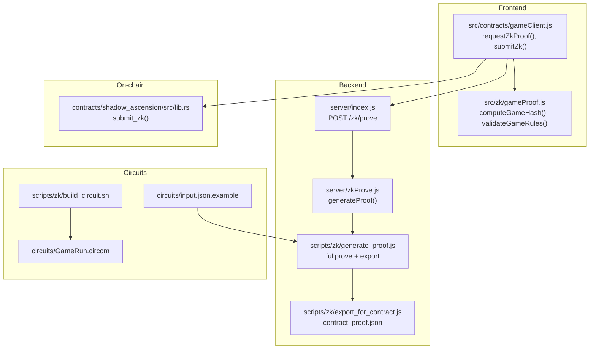
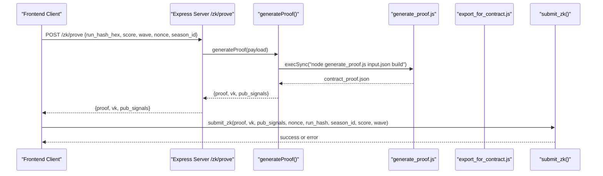
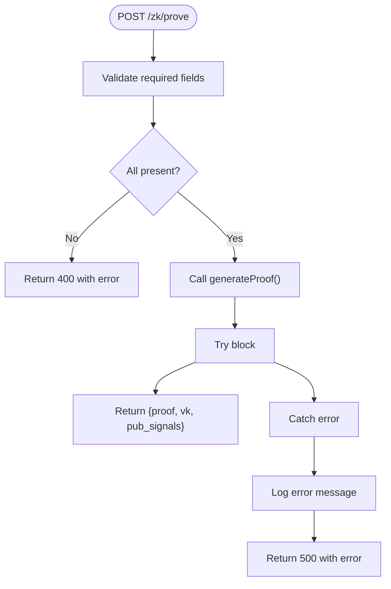
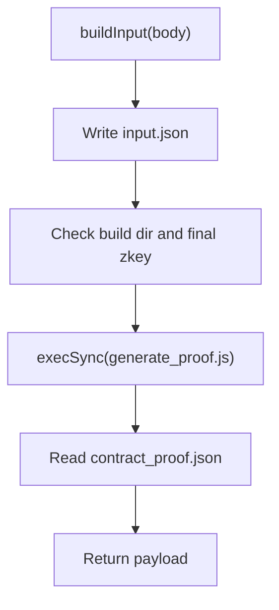
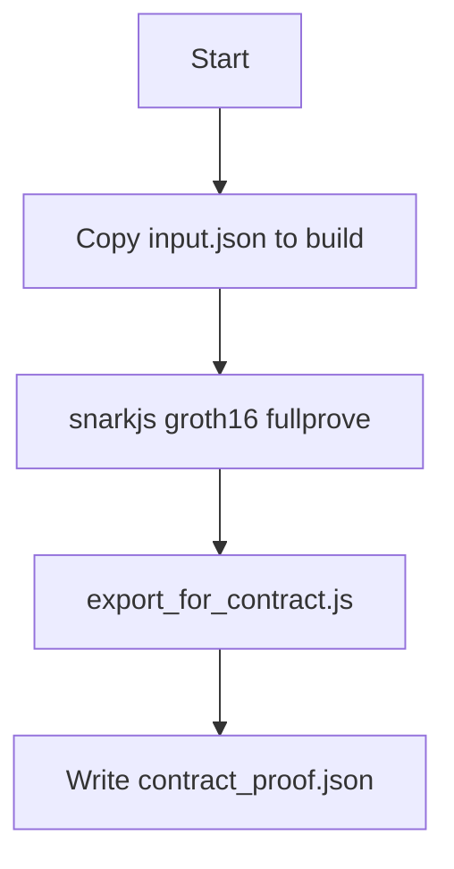
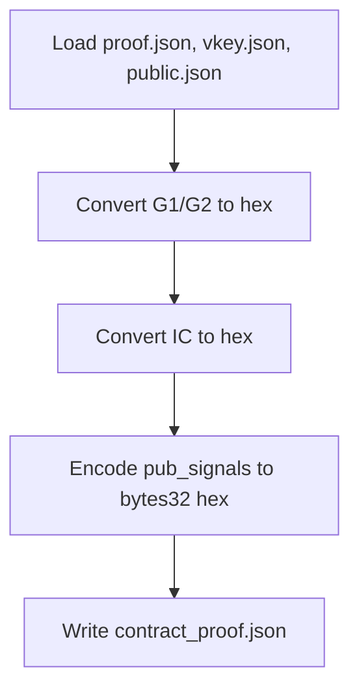
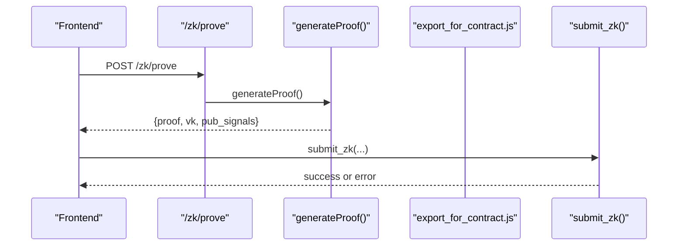
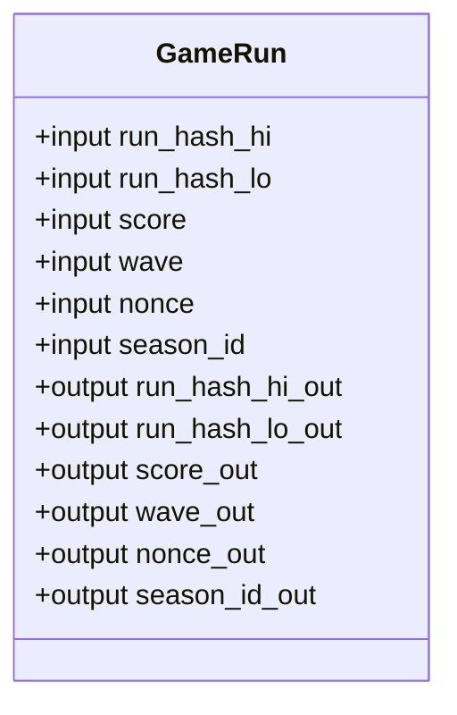
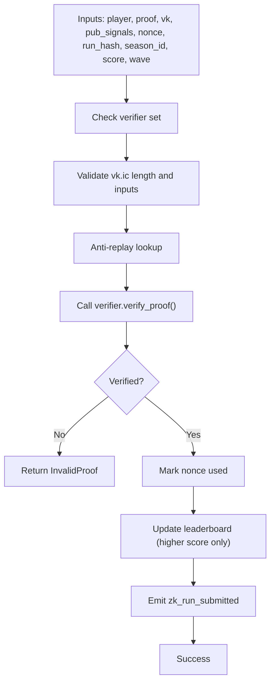
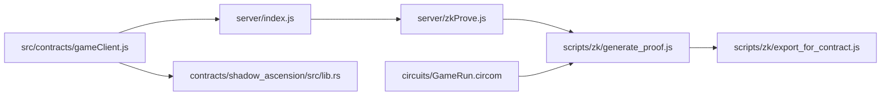

# ZK Proof Generation

<cite>
**Referenced Files in This Document**
- [server/index.js](file://server/index.js)
- [server/zkProve.js](file://server/zkProve.js)
- [scripts/zk/generate_proof.js](file://scripts/zk/generate_proof.js)
- [scripts/zk/export_for_contract.js](file://scripts/zk/export_for_contract.js)
- [scripts/zk/build_circuit.sh](file://scripts/zk/build_circuit.sh)
- [src/contracts/gameClient.js](file://src/contracts/gameClient.js)
- [src/zk/gameProof.js](file://src/zk/gameProof.js)
- [circuits/GameRun.circom](file://circuits/GameRun.circom)
- [circuits/input.json.example](file://circuits/input.json.example)
- [contracts/shadow_ascension/src/lib.rs](file://contracts/shadow_ascension/src/lib.rs)
</cite>

## Table of Contents
1. [Introduction](#introduction)
2. [Project Structure](#project-structure)
3. [Core Components](#core-components)
4. [Architecture Overview](#architecture-overview)
5. [Detailed Component Analysis](#detailed-component-analysis)
6. [Dependency Analysis](#dependency-analysis)
7. [Performance Considerations](#performance-considerations)
8. [Troubleshooting Guide](#troubleshooting-guide)
9. [Conclusion](#conclusion)

## Introduction
This document explains Vibe-Coder’s ZK proof generation service that produces Groth16 proofs from Circom circuits for ranked gameplay. It covers the generateProof function, the /zk/prove endpoint, input validation, witness generation, and proof creation via snarkjs. It also documents the end-to-end workflow from frontend request through backend prover to on-chain verification, including error handling and integration with the frontend ZK system.

## Project Structure
The ZK pipeline spans three layers:
- Frontend client integrates with the backend prover and submits ZK proofs to the on-chain contract.
- Backend server exposes /zk/prove and orchestrates proof generation.
- Scripts and circuits implement the Groth16 prover workflow and export a contract-ready format.

**Diagram sources**
- [server/index.js](file://server/index.js#L196-L216)
- [server/zkProve.js](file://server/zkProve.js#L46-L67)
- [scripts/zk/generate_proof.js](file://scripts/zk/generate_proof.js#L1-L46)
- [scripts/zk/export_for_contract.js](file://scripts/zk/export_for_contract.js#L65-L86)
- [scripts/zk/build_circuit.sh](file://scripts/zk/build_circuit.sh#L1-L57)
- [src/contracts/gameClient.js](file://src/contracts/gameClient.js#L97-L273)
- [src/zk/gameProof.js](file://src/zk/gameProof.js#L1-L78)
- [circuits/GameRun.circom](file://circuits/GameRun.circom#L1-L34)
- [circuits/input.json.example](file://circuits/input.json.example#L1-L9)
- [contracts/shadow_ascension/src/lib.rs](file://contracts/shadow_ascension/src/lib.rs#L156-L264)

**Section sources**
- [server/index.js](file://server/index.js#L196-L216)
- [server/zkProve.js](file://server/zkProve.js#L1-L68)
- [scripts/zk/generate_proof.js](file://scripts/zk/generate_proof.js#L1-L46)
- [scripts/zk/export_for_contract.js](file://scripts/zk/export_for_contract.js#L1-L95)
- [scripts/zk/build_circuit.sh](file://scripts/zk/build_circuit.sh#L1-L57)
- [src/contracts/gameClient.js](file://src/contracts/gameClient.js#L1-L401)
- [src/zk/gameProof.js](file://src/zk/gameProof.js#L1-L78)
- [circuits/GameRun.circom](file://circuits/GameRun.circom#L1-L34)
- [circuits/input.json.example](file://circuits/input.json.example#L1-L9)
- [contracts/shadow_ascension/src/lib.rs](file://contracts/shadow_ascension/src/lib.rs#L156-L264)

## Core Components
- Backend endpoint: POST /zk/prove validates inputs and delegates to generateProof.
- Prover orchestration: generateProof writes input.json, invokes the Groth16 pipeline, and returns contract_proof.json.
- Groth16 pipeline: generate_proof.js executes snarkjs fullprove and exports contract-ready artifacts.
- Exporter: export_for_contract.js converts snarkjs outputs to BN254-encoded hex blobs for on-chain verification.
- Frontend integration: gameClient.js requests proofs and submits ZK runs to the contract.
- Circuit definition: GameRun.circom binds run_hash and game stats, enforcing score vs wave constraints.
- Contract logic: submit_zk verifies the proof against the verifier, prevents replays, and updates leaderboards.

**Section sources**
- [server/index.js](file://server/index.js#L196-L216)
- [server/zkProve.js](file://server/zkProve.js#L46-L67)
- [scripts/zk/generate_proof.js](file://scripts/zk/generate_proof.js#L36-L45)
- [scripts/zk/export_for_contract.js](file://scripts/zk/export_for_contract.js#L65-L86)
- [src/contracts/gameClient.js](file://src/contracts/gameClient.js#L97-L273)
- [circuits/GameRun.circom](file://circuits/GameRun.circom#L8-L31)
- [contracts/shadow_ascension/src/lib.rs](file://contracts/shadow_ascension/src/lib.rs#L156-L264)

## Architecture Overview
The ZK workflow is a request-response flow between the frontend and backend, followed by on-chain verification.

**Diagram sources**
- [server/index.js](file://server/index.js#L196-L216)
- [server/zkProve.js](file://server/zkProve.js#L46-L67)
- [scripts/zk/generate_proof.js](file://scripts/zk/generate_proof.js#L36-L45)
- [scripts/zk/export_for_contract.js](file://scripts/zk/export_for_contract.js#L65-L86)
- [src/contracts/gameClient.js](file://src/contracts/gameClient.js#L251-L273)
- [contracts/shadow_ascension/src/lib.rs](file://contracts/shadow_ascension/src/lib.rs#L156-L264)

## Detailed Component Analysis

### Backend Endpoint: /zk/prove
- Validates presence of run_hash_hex, score, wave, and nonce; season_id is optional.
- Delegates to generateProof with numeric conversions and defaults.
- Returns contract_proof.json payload on success; logs and returns 500 on error.

**Diagram sources**
- [server/index.js](file://server/index.js#L196-L216)

**Section sources**
- [server/index.js](file://server/index.js#L196-L216)

### Backend Prover Orchestration: generateProof
- Builds circuit input from request body, normalizing run_hash_hex to two 128-bit halves, clamping score and wave to non-negative integers, converting nonce and season_id to integers.
- Ensures circuits/build exists and contains the final proving key.
- Writes input.json and executes generate_proof.js synchronously with a timeout.
- Reads contract_proof.json and returns it.

**Diagram sources**
- [server/zkProve.js](file://server/zkProve.js#L20-L67)

**Section sources**
- [server/zkProve.js](file://server/zkProve.js#L1-L68)

### Groth16 Pipeline: generate_proof.js
- Accepts input.json and build directory paths.
- Copies input.json into build for snarkjs.
- Executes snarkjs groth16 fullprove to produce proof.json and public.json.
- Invokes export_for_contract.js to write contract_proof.json.

**Diagram sources**
- [scripts/zk/generate_proof.js](file://scripts/zk/generate_proof.js#L32-L45)

**Section sources**
- [scripts/zk/generate_proof.js](file://scripts/zk/generate_proof.js#L1-L46)

### Exporter: export_for_contract.js
- Converts snarkjs proof (G1/G2) and verification key (BN254) into big-endian hex blobs.
- Encodes public signals as 32-byte hex strings.
- Produces a contract-ready object with proof, vk, and pub_signals.

**Diagram sources**
- [scripts/zk/export_for_contract.js](file://scripts/zk/export_for_contract.js#L38-L86)

**Section sources**
- [scripts/zk/export_for_contract.js](file://scripts/zk/export_for_contract.js#L1-L95)

### Frontend Integration: gameClient.js
- requestZkProof sends {run_hash_hex, score, wave, nonce, season_id} to /zk/prove and returns contract_proof.json.
- submitZkFromProver performs a full ranked submission by requesting a proof and then invoking submit_zk on-chain.
- submitZk validates inputs, converts run_hash to BytesN<32>, builds ScVal arguments, and signs/invokes the contract.

**Diagram sources**
- [src/contracts/gameClient.js](file://src/contracts/gameClient.js#L97-L273)
- [server/zkProve.js](file://server/zkProve.js#L46-L67)
- [scripts/zk/export_for_contract.js](file://scripts/zk/export_for_contract.js#L65-L86)
- [contracts/shadow_ascension/src/lib.rs](file://contracts/shadow_ascension/src/lib.rs#L156-L264)

**Section sources**
- [src/contracts/gameClient.js](file://src/contracts/gameClient.js#L97-L273)

### Circuit Definition: GameRun.circom
- Inputs: run_hash_hi, run_hash_lo, score, wave, nonce, season_id.
- Enforces score >= wave * 10 via a comparator template.
- Exposes all inputs as public outputs for verification.

**Diagram sources**
- [circuits/GameRun.circom](file://circuits/GameRun.circom#L8-L31)

**Section sources**
- [circuits/GameRun.circom](file://circuits/GameRun.circom#L1-L34)

### Frontend ZK Utilities: gameProof.js
- computeGameHash: hashes player, wave, score, runSeed, timestamp to derive run_hash.
- validateGameRules: client-side validation ensuring sane wave/score and score >= wave * 10.
- generateRunSeed: creates a random 32-byte seed for run binding.

**Section sources**
- [src/zk/gameProof.js](file://src/zk/gameProof.js#L1-L78)

### On-chain Verification: submit_zk
- Verifies that verifier is set, vk/ic lengths match, inputs are valid, and score >= wave * 10.
- Checks anti-replay using (player, nonce, season_id).
- Invokes the verifier contract to validate proof and pub_signals.
- Updates per-season leaderboard and emits an event upon success.

**Diagram sources**
- [contracts/shadow_ascension/src/lib.rs](file://contracts/shadow_ascension/src/lib.rs#L156-L264)

**Section sources**
- [contracts/shadow_ascension/src/lib.rs](file://contracts/shadow_ascension/src/lib.rs#L156-L264)

## Dependency Analysis
- server/index.js depends on server/zkProve.js for proof generation.
- server/zkProve.js depends on scripts/zk/generate_proof.js and reads circuits/build artifacts.
- scripts/zk/generate_proof.js depends on snarkjs and scripts/zk/export_for_contract.js.
- scripts/zk/export_for_contract.js depends on snarkjs outputs (proof.json, vkey.json, public.json).
- src/contracts/gameClient.js depends on server/zkProve.js indirectly via /zk/prove and on-chain contract methods.
- contracts/shadow_ascension/src/lib.rs depends on the verifier contract and on-chain storage.

**Diagram sources**
- [server/index.js](file://server/index.js#L196-L216)
- [server/zkProve.js](file://server/zkProve.js#L46-L67)
- [scripts/zk/generate_proof.js](file://scripts/zk/generate_proof.js#L36-L45)
- [scripts/zk/export_for_contract.js](file://scripts/zk/export_for_contract.js#L65-L86)
- [src/contracts/gameClient.js](file://src/contracts/gameClient.js#L97-L273)
- [contracts/shadow_ascension/src/lib.rs](file://contracts/shadow_ascension/src/lib.rs#L156-L264)
- [circuits/GameRun.circom](file://circuits/GameRun.circom#L1-L34)

**Section sources**
- [server/index.js](file://server/index.js#L196-L216)
- [server/zkProve.js](file://server/zkProve.js#L1-L68)
- [scripts/zk/generate_proof.js](file://scripts/zk/generate_proof.js#L1-L46)
- [scripts/zk/export_for_contract.js](file://scripts/zk/export_for_contract.js#L1-L95)
- [src/contracts/gameClient.js](file://src/contracts/gameClient.js#L1-L401)
- [contracts/shadow_ascension/src/lib.rs](file://contracts/shadow_ascension/src/lib.rs#L156-L264)
- [circuits/GameRun.circom](file://circuits/GameRun.circom#L1-L34)

## Performance Considerations
- Proof generation is CPU-intensive and synchronous; a 60-second timeout is enforced to prevent hanging.
- The prover relies on snarkjs and the WASM circuit; ensure sufficient memory and disk space for witness computation.
- Minimizing input sizes and avoiding unnecessary re-runs improves throughput.
- Circuit compilation and trusted setup are offline tasks handled by build_circuit.sh.

[No sources needed since this section provides general guidance]

## Troubleshooting Guide
Common issues and resolutions:
- Missing or invalid run_hash_hex: must be exactly 64 hex characters; otherwise, input normalization throws an error.
- Missing required fields: /zk/prove returns 400 if run_hash_hex, score, wave, or nonce are absent.
- Circuits not built: generateProof checks for circuits/build and GameRun_final.zkey; missing artifacts cause errors.
- snarkjs or circom not installed: build_circuit.sh validates PATH for circom and snarkjs; install prerequisites if commands are not found.
- Export mismatches: export_for_contract.js enforces strict byte lengths for G1/G2 and IC vectors; mismatches indicate corrupted snarkjs outputs.
- On-chain verification failures: submit_zk rejects invalid inputs, malformed VK, replay attempts, or verifier errors.

**Section sources**
- [server/zkProve.js](file://server/zkProve.js#L49-L54)
- [server/index.js](file://server/index.js#L196-L216)
- [scripts/zk/build_circuit.sh](file://scripts/zk/build_circuit.sh#L16-L28)
- [scripts/zk/export_for_contract.js](file://scripts/zk/export_for_contract.js#L38-L58)
- [contracts/shadow_ascension/src/lib.rs](file://contracts/shadow_ascension/src/lib.rs#L173-L220)

## Conclusion
The ZK proof generation service integrates frontend requests, backend orchestration, and on-chain verification seamlessly. The generateProof function and /zk/prove endpoint provide a robust interface for producing contract-ready Groth16 proofs from Circom circuits. Frontend utilities compute run hashes, validate game rules, and submit ZK runs to the contract, which enforces replay protection and updates leaderboards. Proper setup of prerequisites and adherence to input constraints ensure reliable operation.