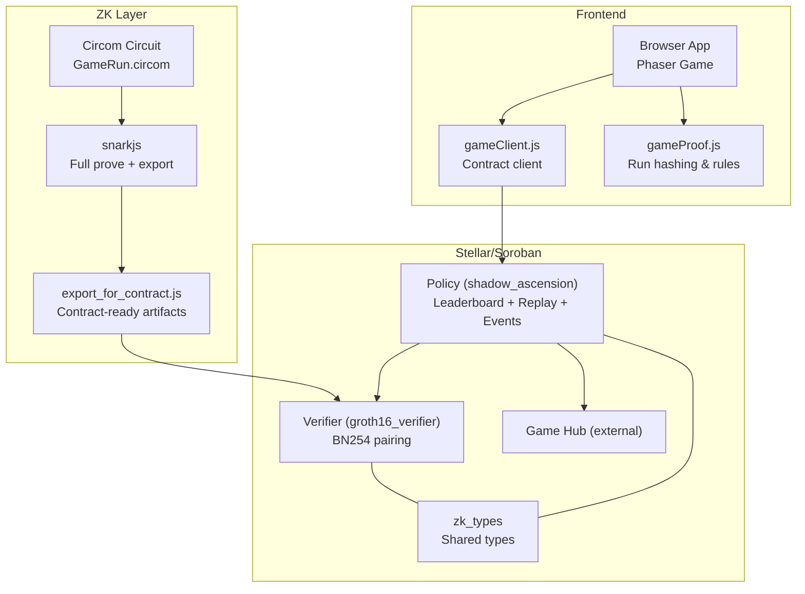
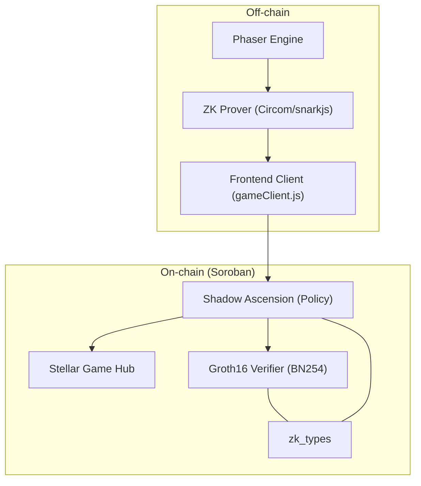
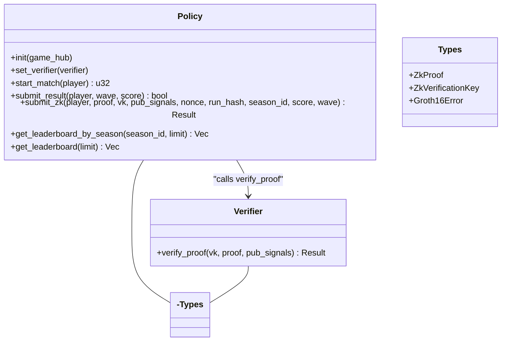
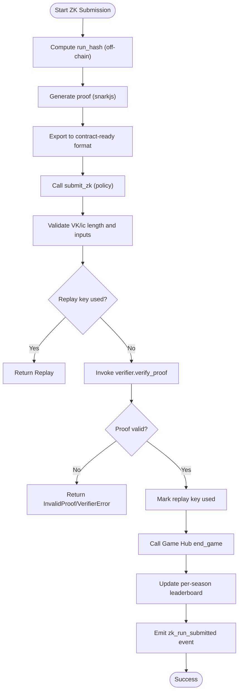
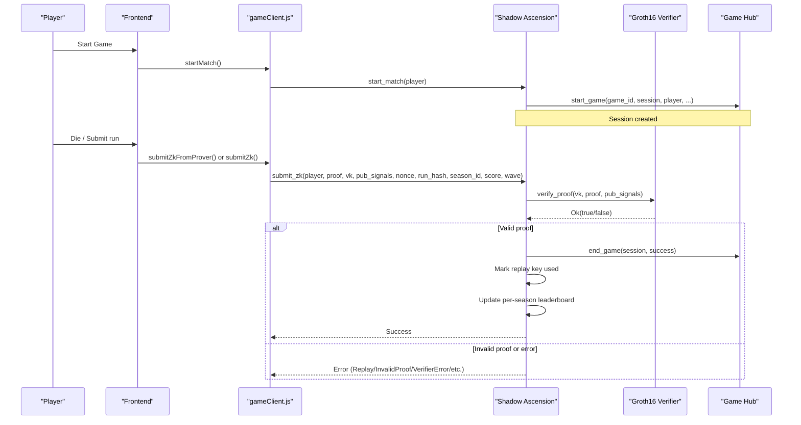
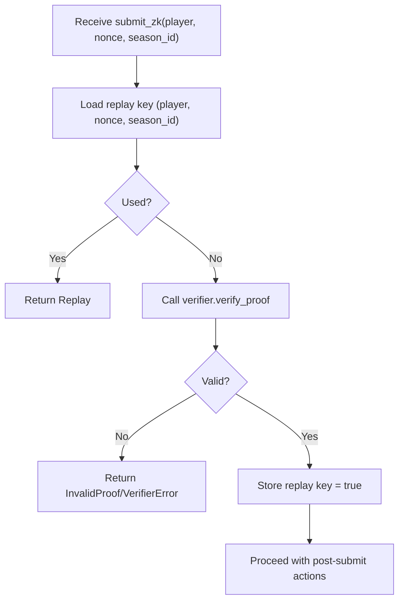
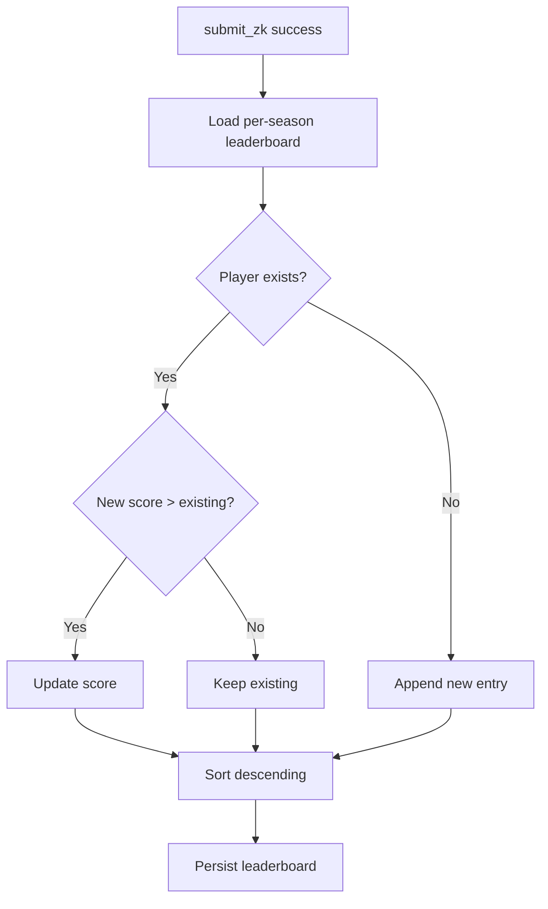
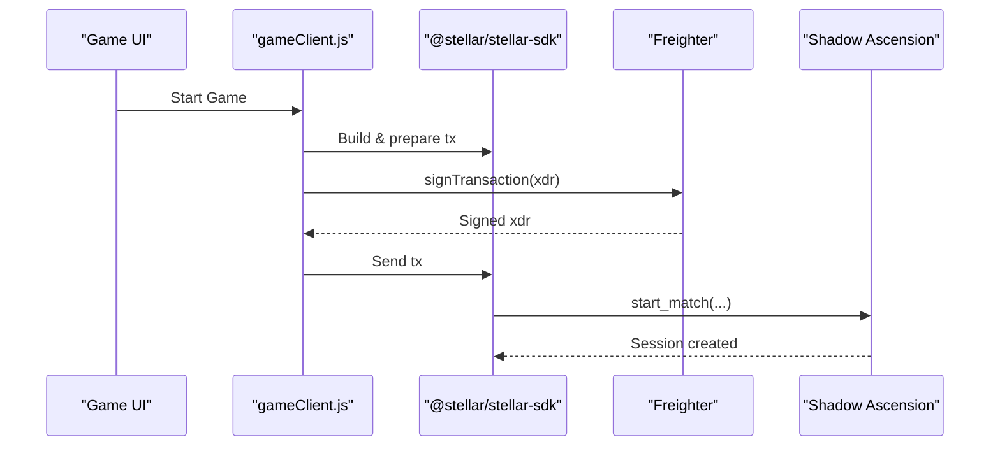
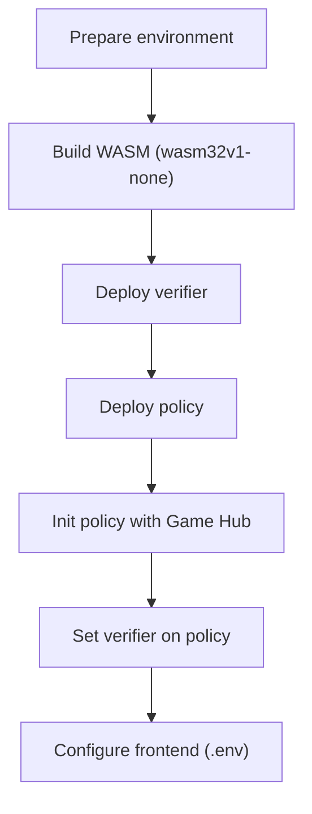
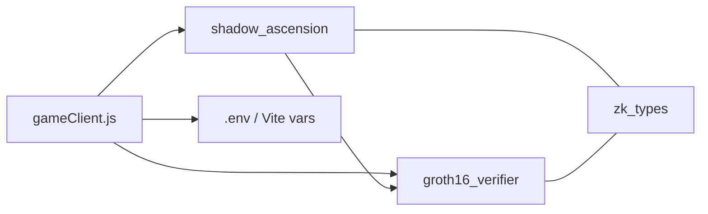

# Blockchain Integration

<cite>
**Referenced Files in This Document**
- [contracts/README.md](file://contracts/README.md)
- [docs/TECHNICAL_DOCUMENTATION.md](file://docs/TECHNICAL_DOCUMENTATION.md)
- [docs/E2E_VERIFICATION.md](file://docs/E2E_VERIFICATION.md)
- [docs/ZK_REAL_SETUP.md](file://docs/ZK_REAL_SETUP.md)
- [docs/DEPLOY_ZK_STEPS.md](file://docs/DEPLOY_ZK_STEPS.md)
- [scripts/zk/build_circuit.sh](file://scripts/zk/build_circuit.sh)
- [scripts/zk/generate_proof.js](file://scripts/zk/generate_proof.js)
- [scripts/zk/export_for_contract.js](file://scripts/zk/export_for_contract.js)
- [scripts/deploy_contracts_testnet.sh](file://scripts/deploy_contracts_testnet.sh)
- [package.json](file://package.json)
- [src/contracts/gameClient.js](file://src/contracts/gameClient.js)
- [src/zk/gameProof.js](file://src/zk/gameProof.js)
- [circuits/GameRun.circom](file://circuits/GameRun.circom)
- [contracts/groth16_verifier/src/lib.rs](file://contracts/groth16_verifier/src/lib.rs)
- [contracts/shadow_ascension/src/lib.rs](file://contracts/shadow_ascension/src/lib.rs)
- [.env](file://.env)
</cite>

## Table of Contents
1. [Introduction](#introduction)
2. [Project Structure](#project-structure)
3. [Core Components](#core-components)
4. [Architecture Overview](#architecture-overview)
5. [Detailed Component Analysis](#detailed-component-analysis)
6. [Dependency Analysis](#dependency-analysis)
7. [Performance Considerations](#performance-considerations)
8. [Troubleshooting Guide](#troubleshooting-guide)
9. [Conclusion](#conclusion)
10. [Appendices](#appendices)

## Introduction
This document explains Vibe-Coder’s blockchain integration with Stellar and Soroban. It covers the three-contract architecture (Game Hub, Policy, and Groth16 verifier), the zero-knowledge proof system using Circom and snarkjs, the end-to-end flow from game start to on-chain submission, anti-replay protection, leaderboard management, frontend contract client and wallet integration, deployment procedures, and troubleshooting guidance.

## Project Structure
The repository organizes blockchain-related logic across contracts, ZK tooling, frontend client, and deployment scripts:
- Contracts: Rust-based Soroban contracts (shared types, verifier, policy).
- ZK tooling: Circom circuit, snarkjs-based proof generation, and export utilities.
- Frontend client: JavaScript contract client and ZK helpers.
- Deployment: shell scripts and documentation for Testnet deployment.

**Diagram sources**
- [src/contracts/gameClient.js](file://src/contracts/gameClient.js#L1-L401)
- [src/zk/gameProof.js](file://src/zk/gameProof.js#L1-L78)
- [circuits/GameRun.circom](file://circuits/GameRun.circom#L1-L34)
- [scripts/zk/export_for_contract.js](file://scripts/zk/export_for_contract.js#L1-L95)
- [contracts/groth16_verifier/src/lib.rs](file://contracts/groth16_verifier/src/lib.rs#L1-L61)
- [contracts/shadow_ascension/src/lib.rs](file://contracts/shadow_ascension/src/lib.rs#L1-L314)

**Section sources**
- [contracts/README.md](file://contracts/README.md#L1-L88)
- [docs/TECHNICAL_DOCUMENTATION.md](file://docs/TECHNICAL_DOCUMENTATION.md#L19-L86)

## Core Components
- zk_types: Shared ZK types and errors for Groth16 proof and verification key formats.
- groth16_verifier: Stateless BN254 Groth16 verifier contract performing pairing checks.
- shadow_ascension: Policy contract orchestrating session lifecycle, anti-replay, leaderboard updates, and ZK submission.
- Frontend client: Contract invocation utilities, ZK proof request, and leaderboard queries.
- ZK pipeline: Circom circuit, snarkjs proof generation, and export to contract-ready format.

**Section sources**
- [docs/TECHNICAL_DOCUMENTATION.md](file://docs/TECHNICAL_DOCUMENTATION.md#L231-L284)
- [contracts/groth16_verifier/src/lib.rs](file://contracts/groth16_verifier/src/lib.rs#L1-L61)
- [contracts/shadow_ascension/src/lib.rs](file://contracts/shadow_ascension/src/lib.rs#L1-L314)
- [src/contracts/gameClient.js](file://src/contracts/gameClient.js#L1-L401)
- [circuits/GameRun.circom](file://circuits/GameRun.circom#L1-L34)

## Architecture Overview
The system integrates off-chain game logic and ZK proof generation with on-chain contracts and a Stellar Game Hub. The policy contract coordinates session lifecycle, anti-replay, leaderboard updates, and ZK verification via the verifier contract.

**Diagram sources**
- [docs/TECHNICAL_DOCUMENTATION.md](file://docs/TECHNICAL_DOCUMENTATION.md#L19-L86)
- [src/contracts/gameClient.js](file://src/contracts/gameClient.js#L1-L401)
- [contracts/shadow_ascension/src/lib.rs](file://contracts/shadow_ascension/src/lib.rs#L1-L314)
- [contracts/groth16_verifier/src/lib.rs](file://contracts/groth16_verifier/src/lib.rs#L1-L61)

## Detailed Component Analysis

### Three-Contract Architecture
- Game Hub (external): Orchestrates session lifecycle. The policy calls start_game and end_game during match lifecycle.
- Policy (shadow_ascension): Enforces anti-replay, validates inputs, calls verifier, updates per-season leaderboard, emits events, and manages Game Hub integration.
- Groth16 Verifier (groth16_verifier): Stateless BN254 verifier validating Groth16 proofs and VK shape.

**Diagram sources**
- [contracts/shadow_ascension/src/lib.rs](file://contracts/shadow_ascension/src/lib.rs#L70-L295)
- [contracts/groth16_verifier/src/lib.rs](file://contracts/groth16_verifier/src/lib.rs#L15-L57)
- [docs/TECHNICAL_DOCUMENTATION.md](file://docs/TECHNICAL_DOCUMENTATION.md#L231-L284)

**Section sources**
- [docs/TECHNICAL_DOCUMENTATION.md](file://docs/TECHNICAL_DOCUMENTATION.md#L29-L86)
- [contracts/shadow_ascension/src/lib.rs](file://contracts/shadow_ascension/src/lib.rs#L70-L295)
- [contracts/groth16_verifier/src/lib.rs](file://contracts/groth16_verifier/src/lib.rs#L15-L57)

### Zero-Knowledge Proof System (Circom + snarkjs + Verifier)
- Circuit: GameRun.circom binds run_hash (hi/lo), score, wave, nonce, season_id, and enforces score ≥ wave × MIN_SCORE_PER_WAVE.
- Proof generation: snarkjs fullprove produces proof.json and public.json; export_for_contract.js converts to contract-ready hex blobs.
- On-chain verification: Policy validates VK shape and inputs, then calls Verifier.verify_proof; on success, it marks replay, updates leaderboard, calls Game Hub end_game, and emits an event.

**Diagram sources**
- [src/zk/gameProof.js](file://src/zk/gameProof.js#L19-L78)
- [circuits/GameRun.circom](file://circuits/GameRun.circom#L1-L34)
- [scripts/zk/generate_proof.js](file://scripts/zk/generate_proof.js#L1-L46)
- [scripts/zk/export_for_contract.js](file://scripts/zk/export_for_contract.js#L65-L95)
- [contracts/shadow_ascension/src/lib.rs](file://contracts/shadow_ascension/src/lib.rs#L156-L264)
- [contracts/groth16_verifier/src/lib.rs](file://contracts/groth16_verifier/src/lib.rs#L18-L57)

**Section sources**
- [docs/ZK_REAL_SETUP.md](file://docs/ZK_REAL_SETUP.md#L12-L192)
- [scripts/zk/build_circuit.sh](file://scripts/zk/build_circuit.sh#L1-L57)
- [scripts/zk/generate_proof.js](file://scripts/zk/generate_proof.js#L1-L46)
- [scripts/zk/export_for_contract.js](file://scripts/zk/export_for_contract.js#L1-L95)
- [circuits/GameRun.circom](file://circuits/GameRun.circom#L1-L34)
- [contracts/groth16_verifier/src/lib.rs](file://contracts/groth16_verifier/src/lib.rs#L18-L57)
- [contracts/shadow_ascension/src/lib.rs](file://contracts/shadow_ascension/src/lib.rs#L156-L264)

### End-to-End Flow: From Game Start to On-Chain Submission
- Session lifecycle: start_match initiates a new session and calls Game Hub start_game; submit_zk or submit_result ends the run and calls Game Hub end_game.
- ZK path: compute run_hash, request proof from prover/backend, and submit ZK to policy; on success, update leaderboard and emit event.
- Fallback path: if ZK prover is unavailable, fallback to submit_result for casual mode.

**Diagram sources**
- [src/contracts/gameClient.js](file://src/contracts/gameClient.js#L76-L273)
- [contracts/shadow_ascension/src/lib.rs](file://contracts/shadow_ascension/src/lib.rs#L86-L264)
- [contracts/groth16_verifier/src/lib.rs](file://contracts/groth16_verifier/src/lib.rs#L23-L57)

**Section sources**
- [docs/TECHNICAL_DOCUMENTATION.md](file://docs/TECHNICAL_DOCUMENTATION.md#L19-L86)
- [src/contracts/gameClient.js](file://src/contracts/gameClient.js#L76-L273)
- [contracts/shadow_ascension/src/lib.rs](file://contracts/shadow_ascension/src/lib.rs#L86-L264)

### Anti-Replay Protection Mechanism
- ReplayKey: (player, nonce, season_id) stored persistently; once used, prevents reuse.
- Binding: nonce is a public input of the circuit; the proof binds to that nonce, ensuring the same proof cannot be submitted again even if re-signed.
- Scope: Replay protection is per player, per nonce, per season; prevents cross-season and cross-player replay.

**Diagram sources**
- [contracts/shadow_ascension/src/lib.rs](file://contracts/shadow_ascension/src/lib.rs#L190-L222)
- [docs/TECHNICAL_DOCUMENTATION.md](file://docs/TECHNICAL_DOCUMENTATION.md#L287-L297)

**Section sources**
- [docs/TECHNICAL_DOCUMENTATION.md](file://docs/TECHNICAL_DOCUMENTATION.md#L287-L297)
- [contracts/shadow_ascension/src/lib.rs](file://contracts/shadow_ascension/src/lib.rs#L190-L222)

### Leaderboard Management
- Per-season ranked leaderboard: ScoreEntry { player, score } sorted descending; updated only when new score exceeds existing score for the player.
- Legacy casual leaderboard: LeaderboardEntry { player, wave, score } appended on submit_result.
- Retrieval: get_leaderboard_by_season and get_leaderboard helpers in the policy.

**Diagram sources**
- [contracts/shadow_ascension/src/lib.rs](file://contracts/shadow_ascension/src/lib.rs#L235-L256)

**Section sources**
- [docs/TECHNICAL_DOCUMENTATION.md](file://docs/TECHNICAL_DOCUMENTATION.md#L38-L40)
- [contracts/shadow_ascension/src/lib.rs](file://contracts/shadow_ascension/src/lib.rs#L266-L294)

### Frontend Contract Client and Wallet Integration (Freighter)
- Contract client: gameClient.js builds transactions, signs via wallet, and invokes policy methods (start_match, submit_result, submit_zk).
- Wallet integration: Freighter is required for play; the frontend reads contract ID and prover URL from environment variables.
- ZK prover integration: Option B allows requesting a proof from a backend prover and then submitting ZK.

**Diagram sources**
- [src/contracts/gameClient.js](file://src/contracts/gameClient.js#L33-L80)

**Section sources**
- [src/contracts/gameClient.js](file://src/contracts/gameClient.js#L1-L401)
- [package.json](file://package.json#L32-L42)
- [.env](file://.env#L1-L5)

### Deployment Procedures
- Build WASM: Use rustup target wasm32v1-none; build zk_types, groth16_verifier, shadow_ascension.
- Deploy verifier and policy to Testnet; initialize policy with Game Hub and set verifier.
- Configure frontend: set VITE_SHADOW_ASCENSION_CONTRACT_ID and VITE_ZK_PROVER_URL.

**Diagram sources**
- [docs/DEPLOY_ZK_STEPS.md](file://docs/DEPLOY_ZK_STEPS.md#L19-L89)
- [scripts/deploy_contracts_testnet.sh](file://scripts/deploy_contracts_testnet.sh#L19-L70)

**Section sources**
- [docs/DEPLOY_ZK_STEPS.md](file://docs/DEPLOY_ZK_STEPS.md#L1-L90)
- [scripts/deploy_contracts_testnet.sh](file://scripts/deploy_contracts_testnet.sh#L1-L70)
- [contracts/README.md](file://contracts/README.md#L9-L21)

## Dependency Analysis
- Shared types: zk_types is consumed by both verifier and policy to ensure consistent serialization and ABI compatibility.
- Policy depends on:
  - Verifier contract for BN254 pairing verification.
  - Game Hub contract for session lifecycle.
  - Frontend client for invoking submit_zk and retrieving leaderboards.
- Verifier depends only on zk_types and host BN254 crypto operations.
- Frontend client depends on @stellar/stellar-sdk and environment variables for contract IDs and prover URL.

**Diagram sources**
- [src/contracts/gameClient.js](file://src/contracts/gameClient.js#L11-L20)
- [contracts/shadow_ascension/src/lib.rs](file://contracts/shadow_ascension/src/lib.rs#L7-L10)
- [contracts/groth16_verifier/src/lib.rs](file://contracts/groth16_verifier/src/lib.rs#L7-L13)

**Section sources**
- [src/contracts/gameClient.js](file://src/contracts/gameClient.js#L11-L20)
- [contracts/shadow_ascension/src/lib.rs](file://contracts/shadow_ascension/src/lib.rs#L7-L10)
- [contracts/groth16_verifier/src/lib.rs](file://contracts/groth16_verifier/src/lib.rs#L7-L13)

## Performance Considerations
- Verification cost: Groth16 verification is dominated by BN254 pairing and group operations; use stellar contract invoke --sim-only to estimate CPU/memory before deployment.
- Resource simulation: Measure submit_zk and verify_proof costs on Testnet with real-sized proof and VK.
- Gas envelope: Costs depend on circuit size and VK shape; fixed for six public inputs.

**Section sources**
- [docs/TECHNICAL_DOCUMENTATION.md](file://docs/TECHNICAL_DOCUMENTATION.md#L300-L315)
- [docs/ZK_REAL_SETUP.md](file://docs/ZK_REAL_SETUP.md#L156-L176)

## Troubleshooting Guide
Common issues and resolutions:
- Verifier not set: submit_zk returns VerifierNotSet; ensure policy.set_verifier was called with a valid verifier ID.
- Malformed VK: vk.ic length must equal pub_signals length + 1; mismatch leads to MalformedVk.
- Invalid input: score or wave must be greater than zero; legacy rule also enforces score >= wave × MIN_SCORE_PER_WAVE.
- Replay: same (player, nonce, season_id) cannot be reused; ensure unique nonce per run.
- Invalid proof: pairing check failed; verify VK, proof, and pub_signals match the circuit and inputs.
- Frontend configuration: ensure VITE_SHADOW_ASCENSION_CONTRACT_ID and VITE_ZK_PROVER_URL are set; reconnect wallet if required.

**Section sources**
- [contracts/shadow_ascension/src/lib.rs](file://contracts/shadow_ascension/src/lib.rs#L173-L220)
- [docs/TECHNICAL_DOCUMENTATION.md](file://docs/TECHNICAL_DOCUMENTATION.md#L318-L330)
- [src/contracts/gameClient.js](file://src/contracts/gameClient.js#L392-L400)

## Conclusion
Vibe-Coder’s blockchain integration leverages a clean separation of concerns: the policy manages session lifecycle, anti-replay, and leaderboards; the verifier performs BN254 Groth16 verification; the frontend integrates with Freighter and optionally a backend prover. The ZK pipeline binds run outcomes to cryptographic commitments, ensuring provable fairness and on-chain integrity.

## Appendices

### Appendix A: End-to-End Verification Checklist
- Build circuit and generate a real proof.
- Simulate verifier and policy behavior.
- Manually verify on-chain events and leaderboard updates.
- Confirm fallback to casual mode if ZK prover is down.

**Section sources**
- [docs/E2E_VERIFICATION.md](file://docs/E2E_VERIFICATION.md#L18-L68)

### Appendix B: Environment Variables and Frontend Configuration
- VITE_SHADOW_ASCENSION_CONTRACT_ID: Policy contract ID.
- VITE_ZK_PROVER_URL: Optional backend prover URL for ZK submission.

**Section sources**
- [.env](file://.env#L1-L5)
- [src/contracts/gameClient.js](file://src/contracts/gameClient.js#L11-L20)