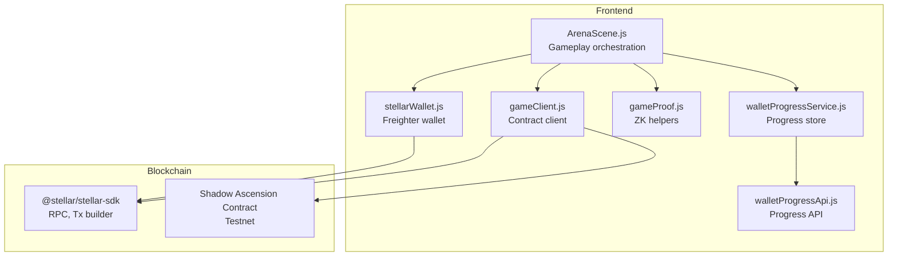
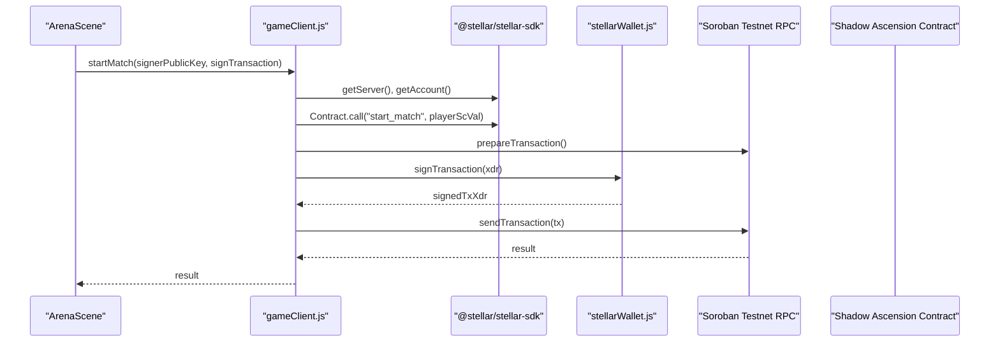
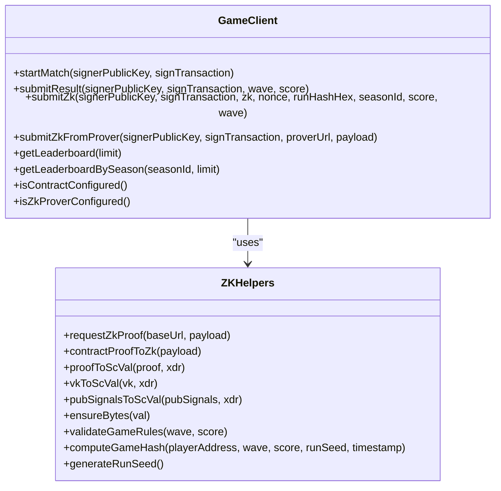
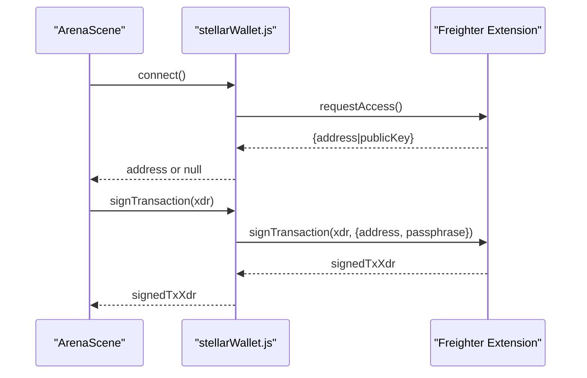
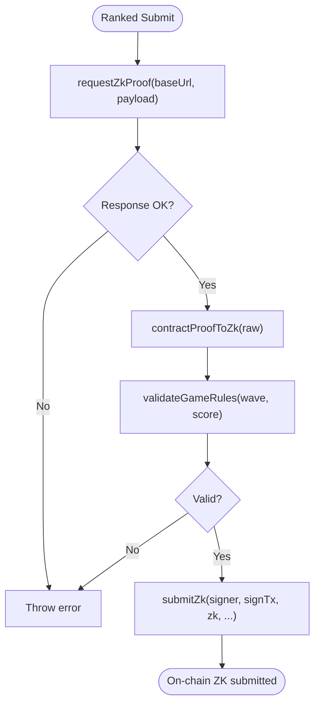
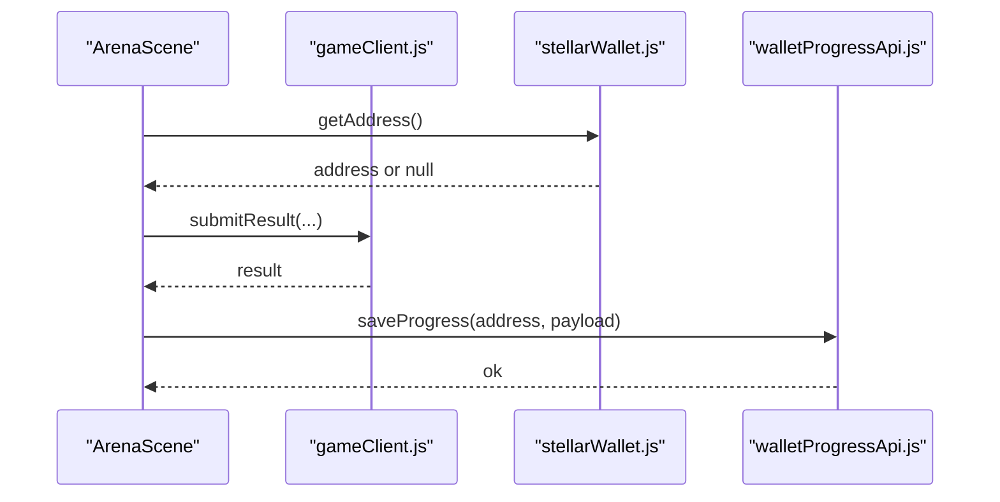
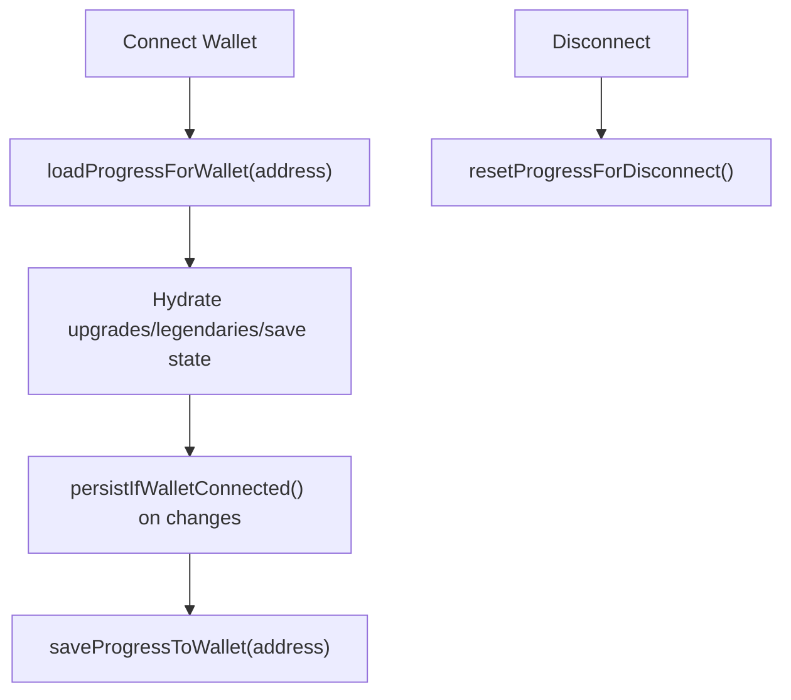
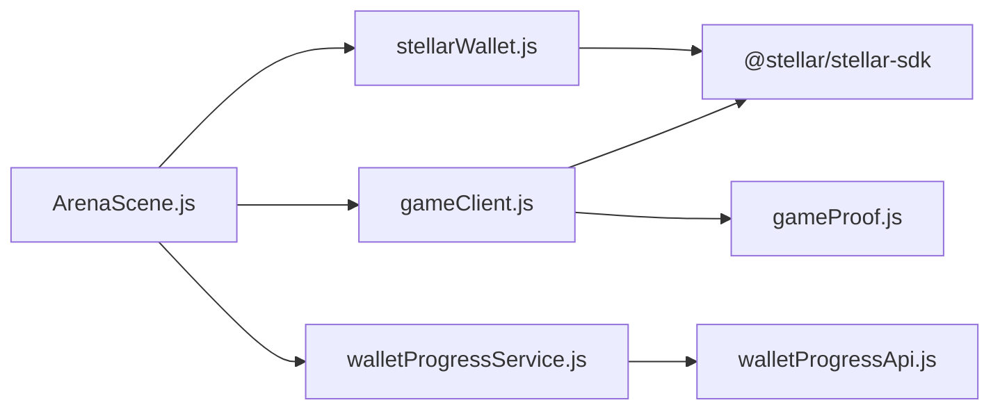

# Frontend Contract Client

<cite>
**Referenced Files in This Document**
- [src/contracts/gameClient.js](file://src/contracts/gameClient.js)
- [src/utils/stellarWallet.js](file://src/utils/stellarWallet.js)
- [src/utils/sep10StellarAuth.js](file://src/utils/sep10StellarAuth.js)
- [src/utils/walletProgressService.js](file://src/utils/walletProgressService.js)
- [src/utils/walletProgressApi.js](file://src/utils/walletProgressApi.js)
- [src/zk/gameProof.js](file://src/zk/gameProof.js)
- [src/scenes/ArenaScene.js](file://src/scenes/ArenaScene.js)
- [src/main.js](file://src/main.js)
</cite>

## Table of Contents
1. [Introduction](#introduction)
2. [Project Structure](#project-structure)
3. [Core Components](#core-components)
4. [Architecture Overview](#architecture-overview)
5. [Detailed Component Analysis](#detailed-component-analysis)
6. [Dependency Analysis](#dependency-analysis)
7. [Performance Considerations](#performance-considerations)
8. [Troubleshooting Guide](#troubleshooting-guide)
9. [Conclusion](#conclusion)

## Introduction
This document explains the frontend contract client implementation used by Vibe-Coder to interact with the Shadow Ascension Soroban game contract on Testnet. It covers how the client builds and signs transactions, integrates with the Freighter wallet, submits game results, requests ZK proofs from a backend prover, and reads on-chain leaderboards. It also documents the game client API, parameter handling, real-time state updates, event listening, error handling, wallet connection flow, account management, transaction fee handling, debugging techniques, performance optimization, and security considerations.

## Project Structure
The frontend contract client lives in the “contracts” folder and integrates with wallet utilities, ZK helpers, and scene logic. Key areas:
- Contract client: builds, signs, and sends contract invocations
- Wallet integration: Freighter-based connection and signing
- ZK support: proof request and conversion utilities
- Scene orchestration: triggers contract interactions during gameplay
- Wallet-backed progress: loads and saves persistent game state

**Diagram sources**
- [src/contracts/gameClient.js](file://src/contracts/gameClient.js#L25-L63)
- [src/utils/stellarWallet.js](file://src/utils/stellarWallet.js#L104-L114)
- [src/zk/gameProof.js](file://src/zk/gameProof.js#L29-L42)
- [src/utils/walletProgressService.js](file://src/utils/walletProgressService.js#L22-L84)
- [src/utils/walletProgressApi.js](file://src/utils/walletProgressApi.js#L15-L45)
- [src/scenes/ArenaScene.js](file://src/scenes/ArenaScene.js#L1-L50)

**Section sources**
- [src/contracts/gameClient.js](file://src/contracts/gameClient.js#L1-L401)
- [src/utils/stellarWallet.js](file://src/utils/stellarWallet.js#L1-L115)
- [src/zk/gameProof.js](file://src/zk/gameProof.js#L1-L78)
- [src/utils/walletProgressService.js](file://src/utils/walletProgressService.js#L1-L140)
- [src/utils/walletProgressApi.js](file://src/utils/walletProgressApi.js#L1-L46)
- [src/scenes/ArenaScene.js](file://src/scenes/ArenaScene.js#L1-L120)

## Core Components
- Contract client
  - Builds and signs contract invocations with the Stellar SDK
  - Supports start_match, submit_result, submit_zk, and read-only leaderboard queries
  - Handles ScVal construction and XDR serialization for Groth16 proofs
- Freighter wallet integration
  - Connects, caches, and disconnects the user’s address
  - Signs transactions with Freighter and validates results
- ZK proof pipeline
  - Requests proofs from a backend prover
  - Normalizes proof payloads to BN254-encoded bytes for contract submission
- Wallet-backed progress
  - Loads and saves upgrades, legendaries, high scores, and save state keyed by wallet address
- Game orchestration
  - Triggers contract interactions at key moments (start match, submit result, ZK submit)
  - Updates UI and persists progress

**Section sources**
- [src/contracts/gameClient.js](file://src/contracts/gameClient.js#L33-L63)
- [src/utils/stellarWallet.js](file://src/utils/stellarWallet.js#L39-L114)
- [src/zk/gameProof.js](file://src/zk/gameProof.js#L29-L78)
- [src/utils/walletProgressService.js](file://src/utils/walletProgressService.js#L22-L139)
- [src/scenes/ArenaScene.js](file://src/scenes/ArenaScene.js#L1598-L1602)

## Architecture Overview
The frontend interacts with the Soroban contract via the Stellar SDK. Transactions are prepared on-chain, signed by the user’s Freighter wallet, and submitted to the Testnet RPC. For ranked ZK runs, the client requests a proof from a backend prover and submits it on-chain.

**Diagram sources**
- [src/contracts/gameClient.js](file://src/contracts/gameClient.js#L25-L63)
- [src/utils/stellarWallet.js](file://src/utils/stellarWallet.js#L104-L114)
- [src/scenes/ArenaScene.js](file://src/scenes/ArenaScene.js#L1598-L1602)

## Detailed Component Analysis

### Contract Client API
The contract client exposes methods to interact with the Shadow Ascension contract on Testnet. It constructs ScVal arguments, prepares transactions via the SDK, and submits them after wallet signing.

- startMatch(signerPublicKey, signTransaction)
  - Calls start_match(player)
  - Uses playerScVal to encode the signer public key as an Address ScVal
- submitResult(signerPublicKey, signTransaction, wave, score)
  - Calls submit_result(player, wave, score)
  - Encodes wave as u32 and score as i128 ScVal
- submitZk(...)
  - Calls submit_zk(player, proof, vk, pubSignals, nonce, runHash, seasonId, score, wave)
  - Validates game rules client-side
  - Converts proof/vk/pubSignals to xdr.ScVal maps and bytes
- submitZkFromProver(...)
  - Requests a ZK proof from the backend prover and then submits it on-chain
- getLeaderboard(limit)
  - Simulates get_leaderboard and parses the returned vector of maps
- getLeaderboardBySeason(seasonId, limit)
  - Simulates get_leaderboard_by_season and parses entries
- Utility helpers
  - playerScVal, requestZkProof, contractProofToZk, proofToScVal, vkToScVal, pubSignalsToScVal
  - ensureBytes, validateGameRules, computeGameHash, generateRunSeed

**Diagram sources**
- [src/contracts/gameClient.js](file://src/contracts/gameClient.js#L76-L121)
- [src/contracts/gameClient.js](file://src/contracts/gameClient.js#L213-L273)
- [src/contracts/gameClient.js](file://src/contracts/gameClient.js#L278-L390)
- [src/zk/gameProof.js](file://src/zk/gameProof.js#L29-L78)

**Section sources**
- [src/contracts/gameClient.js](file://src/contracts/gameClient.js#L76-L121)
- [src/contracts/gameClient.js](file://src/contracts/gameClient.js#L213-L273)
- [src/contracts/gameClient.js](file://src/contracts/gameClient.js#L278-L390)
- [src/zk/gameProof.js](file://src/zk/gameProof.js#L29-L78)

### Wallet Integration with Freighter
The wallet module manages connection, caching, and signing:
- isFreighterAvailable(): checks availability of the Freighter extension
- connect(): requests access and caches the address in memory and localStorage
- getAddress(): returns cached address; does not auto-reconnect
- disconnect(): clears cache and storage
- isConnected(): indicates whether a cached address exists
- shortAddress(): formats addresses for UI
- signTransaction(xdr, networkPassphrase): signs with Freighter and validates result

**Diagram sources**
- [src/utils/stellarWallet.js](file://src/utils/stellarWallet.js#L26-L53)
- [src/utils/stellarWallet.js](file://src/utils/stellarWallet.js#L104-L114)
- [src/scenes/ArenaScene.js](file://src/scenes/ArenaScene.js#L1598-L1602)

**Section sources**
- [src/utils/stellarWallet.js](file://src/utils/stellarWallet.js#L26-L53)
- [src/utils/stellarWallet.js](file://src/utils/stellarWallet.js#L61-L88)
- [src/utils/stellarWallet.js](file://src/utils/stellarWallet.js#L104-L114)

### ZK Proof Pipeline
Ranked matches use a backend ZK prover to generate Groth16 proofs:
- requestZkProof(baseUrl, payload): posts run metadata to the prover endpoint and returns contract-proof-compatible JSON
- contractProofToZk(payload): normalizes proof, vk, and pubSignals to Uint8Array
- submitZkFromProver(...): orchestrates requestZkProof and submitZk
- validateGameRules(...): ensures score meets minimum per wave before submission

**Diagram sources**
- [src/contracts/gameClient.js](file://src/contracts/gameClient.js#L103-L121)
- [src/contracts/gameClient.js](file://src/contracts/gameClient.js#L144-L160)
- [src/contracts/gameClient.js](file://src/contracts/gameClient.js#L228-L231)
- [src/contracts/gameClient.js](file://src/contracts/gameClient.js#L258-L273)
- [src/zk/gameProof.js](file://src/zk/gameProof.js#L51-L63)

**Section sources**
- [src/contracts/gameClient.js](file://src/contracts/gameClient.js#L103-L121)
- [src/contracts/gameClient.js](file://src/contracts/gameClient.js#L144-L160)
- [src/contracts/gameClient.js](file://src/contracts/gameClient.js#L228-L231)
- [src/contracts/gameClient.js](file://src/contracts/gameClient.js#L258-L273)
- [src/zk/gameProof.js](file://src/zk/gameProof.js#L51-L63)

### Game Orchestration and Real-Time Updates
The ArenaScene coordinates contract interactions:
- On wave completion, it persists progress and may submit on-chain leaderboard entries
- It triggers wallet-backed progress saves and updates UI
- Leaderboard display logic prefers on-chain ranked data when available

**Diagram sources**
- [src/scenes/ArenaScene.js](file://src/scenes/ArenaScene.js#L1598-L1602)
- [src/contracts/gameClient.js](file://src/contracts/gameClient.js#L85-L95)
- [src/utils/walletProgressApi.js](file://src/utils/walletProgressApi.js#L29-L45)

**Section sources**
- [src/scenes/ArenaScene.js](file://src/scenes/ArenaScene.js#L1598-L1602)
- [src/contracts/gameClient.js](file://src/contracts/gameClient.js#L85-L95)
- [src/utils/walletProgressApi.js](file://src/utils/walletProgressApi.js#L29-L45)

### Wallet-Backed Progress Service
The progress service synchronizes persistent game state with the backend:
- loadProgressForWallet(address): hydrates upgrades, legendaries, high scores, and save state
- saveProgressToWallet(address, extra?): posts current state to the backend
- persistIfWalletConnected(): saves when a wallet is connected
- resetProgressForDisconnect(): clears state on disconnect
- selectCharacter(charId)/cycleCharacter(dir): updates selected character and persists

**Diagram sources**
- [src/utils/walletProgressService.js](file://src/utils/walletProgressService.js#L22-L84)
- [src/utils/walletProgressService.js](file://src/utils/walletProgressService.js#L110-L139)
- [src/utils/walletProgressApi.js](file://src/utils/walletProgressApi.js#L15-L45)

**Section sources**
- [src/utils/walletProgressService.js](file://src/utils/walletProgressService.js#L22-L84)
- [src/utils/walletProgressService.js](file://src/utils/walletProgressService.js#L110-L139)
- [src/utils/walletProgressApi.js](file://src/utils/walletProgressApi.js#L15-L45)

## Dependency Analysis
- gameClient.js depends on:
  - @stellar/stellar-sdk for RPC, transaction building, and ScVal
  - stellarWallet.js for signing and address retrieval
  - gameProof.js for client-side rule validation and hashing
- ArenaScene depends on:
  - gameClient.js for contract interactions
  - stellarWallet.js for wallet state
  - walletProgressService.js for persistence
  - walletProgressApi.js for backend progress sync
- walletProgressService.js depends on:
  - stellarWallet.js for address
  - walletProgressApi.js for fetch/post

**Diagram sources**
- [src/scenes/ArenaScene.js](file://src/scenes/ArenaScene.js#L1-L50)
- [src/contracts/gameClient.js](file://src/contracts/gameClient.js#L25-L41)
- [src/utils/stellarWallet.js](file://src/utils/stellarWallet.js#L7-L12)
- [src/utils/walletProgressService.js](file://src/utils/walletProgressService.js#L7-L8)
- [src/utils/walletProgressApi.js](file://src/utils/walletProgressApi.js#L7-L13)
- [src/zk/gameProof.js](file://src/zk/gameProof.js#L1-L14)

**Section sources**
- [src/contracts/gameClient.js](file://src/contracts/gameClient.js#L25-L41)
- [src/utils/stellarWallet.js](file://src/utils/stellarWallet.js#L7-L12)
- [src/utils/walletProgressService.js](file://src/utils/walletProgressService.js#L7-L8)
- [src/utils/walletProgressApi.js](file://src/utils/walletProgressApi.js#L7-L13)
- [src/zk/gameProof.js](file://src/zk/gameProof.js#L1-L14)
- [src/scenes/ArenaScene.js](file://src/scenes/ArenaScene.js#L1-L50)

## Performance Considerations
- Transaction preparation and simulation
  - Use simulateTransaction for read-only queries (leaderboard) to avoid fees
  - Batch UI updates after contract calls to minimize reflows
- ZK proof requests
  - Cache run seeds and hashes locally to avoid recomputation
  - Limit prover requests to necessary runs (ranked mode)
- Wallet operations
  - Avoid repeated signTransaction calls; batch operations when possible
  - Use cached addresses to reduce Freighter round-trips
- Rendering and state
  - Debounce leaderboard refreshes and progress saves
  - Use efficient data structures for progress payloads

[No sources needed since this section provides general guidance]

## Troubleshooting Guide
Common issues and resolutions:
- Wallet not connected
  - Ensure Freighter is installed and connected; use isFreighterAvailable() and connect()
  - Verify cached address exists; if not, prompt user to connect
- Signing failures
  - Confirm signTransaction resolves to a signed XDR; errors indicate user denial or extension issues
  - Wrap signing with timeouts to avoid UI hangs
- Contract invocation errors
  - Inspect result.status and errorResultXdr; ensure contract ID is configured
  - Validate ScVal types and sizes (u32, i128, bytes)
- ZK proof errors
  - Verify backend prover responds with contract-proof-compatible JSON
  - Ensure ensureBytes produces correct byte arrays for proof/vk/pubSignals
- Leaderboard display
  - Fallback to legacy leaderboard when on-chain ranked data is unavailable
  - Handle simulation errors gracefully and return empty arrays

**Section sources**
- [src/utils/stellarWallet.js](file://src/utils/stellarWallet.js#L26-L53)
- [src/utils/stellarWallet.js](file://src/utils/stellarWallet.js#L104-L114)
- [src/contracts/gameClient.js](file://src/contracts/gameClient.js#L59-L62)
- [src/contracts/gameClient.js](file://src/contracts/gameClient.js#L123-L138)
- [src/contracts/gameClient.js](file://src/contracts/gameClient.js#L278-L327)

## Conclusion
The Vibe-Coder frontend contract client provides a robust, wallet-integrated pathway to interact with the Shadow Ascension Soroban contract on Testnet. By leveraging Freighter for secure signing, the Stellar SDK for transaction lifecycle, and a backend ZK prover for ranked runs, it enables seamless gameplay experiences. The wallet-backed progress service ensures persistence keyed to the user’s address, while careful error handling and performance strategies keep interactions responsive and reliable.