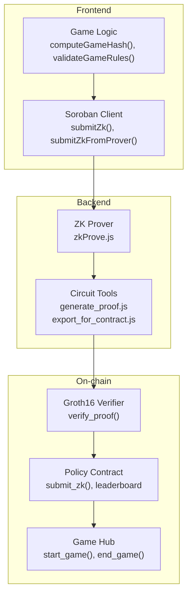
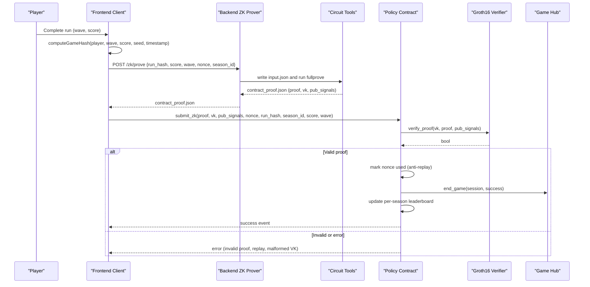
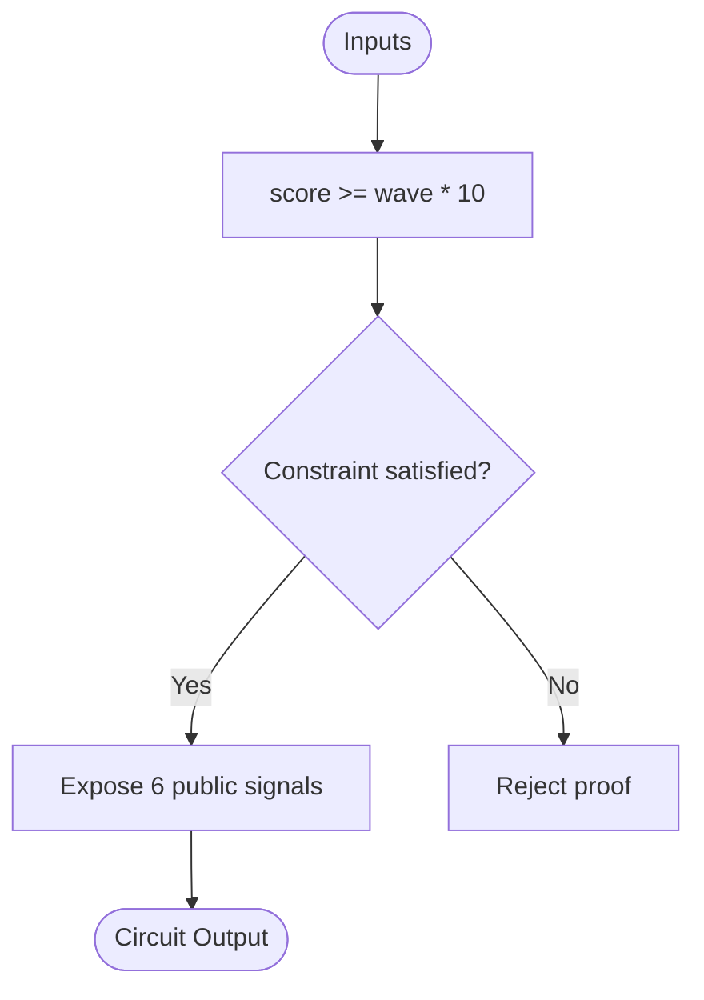
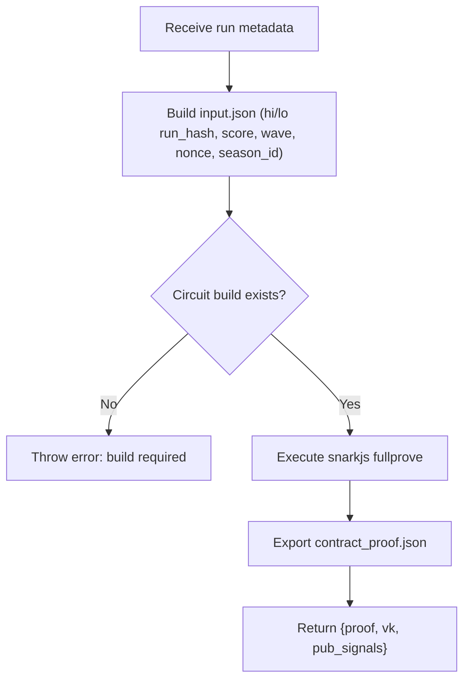
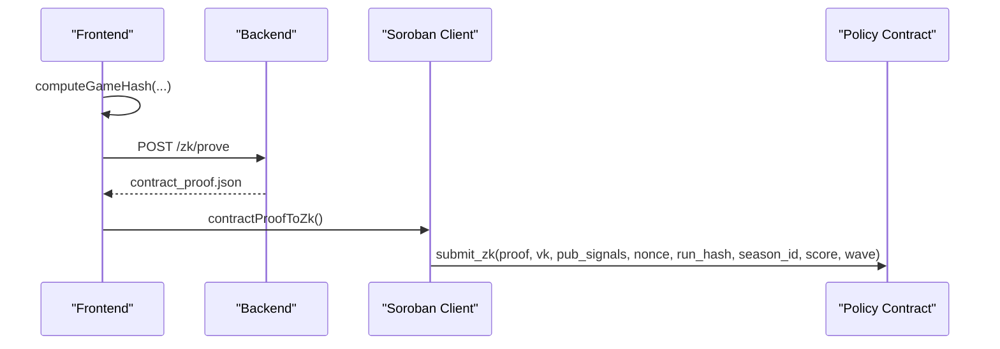
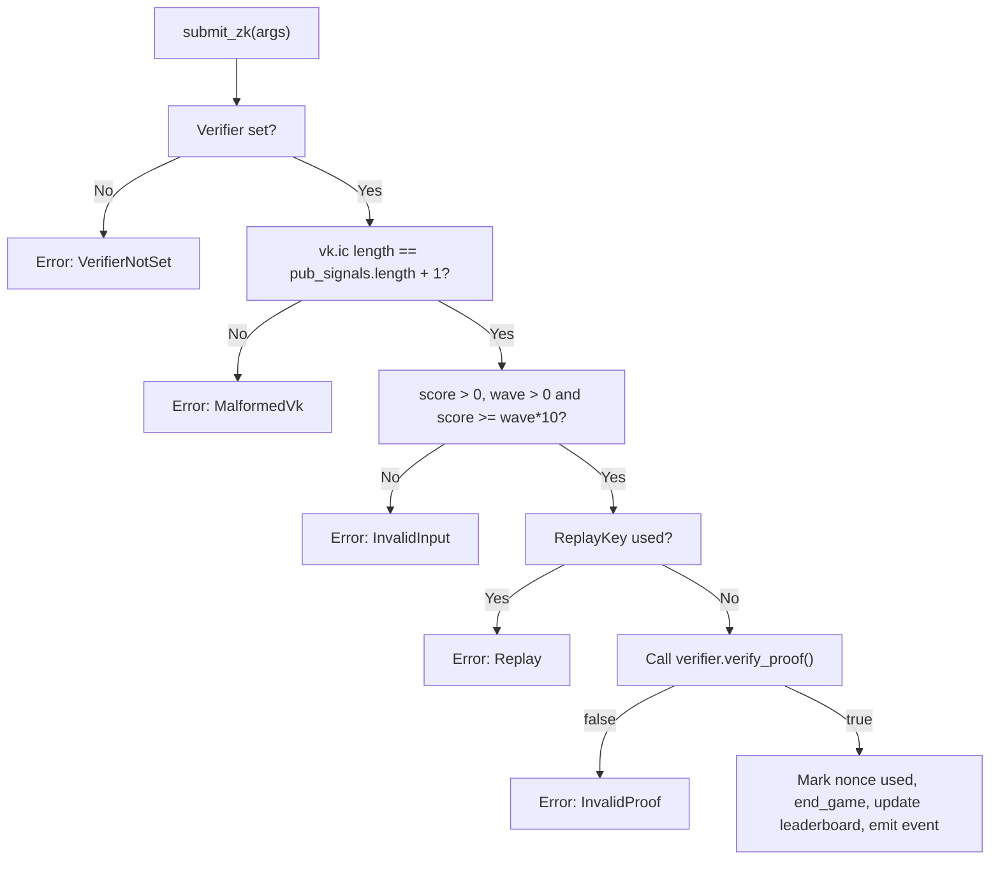
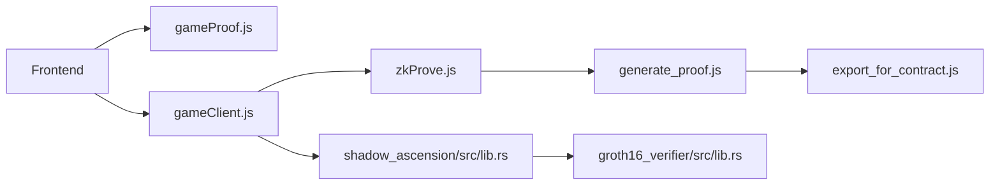

# Proof Generation and Verification

<cite>
**Referenced Files in This Document**
- [README.md](file://README.md)
- [DEPLOY_ZK_STEPS.md](file://docs/DEPLOY_ZK_STEPS.md)
- [E2E_VERIFICATION.md](file://docs/E2E_VERIFICATION.md)
- [GameRun.circom](file://circuits/GameRun.circom)
- [vkey.json](file://circuits/build/vkey.json)
- [contract_proof.json](file://circuits/build/contract_proof.json)
- [public.json](file://circuits/build/public.json)
- [generate_proof.js](file://scripts/zk/generate_proof.js)
- [export_for_contract.js](file://scripts/zk/export_for_contract.js)
- [zkProve.js](file://server/zkProve.js)
- [gameProof.js](file://src/zk/gameProof.js)
- [gameClient.js](file://src/contracts/gameClient.js)
- [groth16_verifier/src/lib.rs](file://contracts/groth16_verifier/src/lib.rs)
- [shadow_ascension/src/lib.rs](file://contracts/shadow_ascension/src/lib.rs)
- [auth.js](file://server/routes/auth.js)
- [sep10StellarAuth.js](file://src/utils/sep10StellarAuth.js)
</cite>

## Table of Contents
1. [Introduction](#introduction)
2. [Project Structure](#project-structure)
3. [Core Components](#core-components)
4. [Architecture Overview](#architecture-overview)
5. [Detailed Component Analysis](#detailed-component-analysis)
6. [Dependency Analysis](#dependency-analysis)
7. [Performance Considerations](#performance-considerations)
8. [Troubleshooting Guide](#troubleshooting-guide)
9. [Conclusion](#conclusion)
10. [Appendices](#appendices)

## Introduction
This document explains the end-to-end zero-knowledge proof generation and verification workflow in Vibe-Coder. It covers how a completed game run is transformed into a Groth16 proof, how the backend prover produces a contract-ready payload, and how the on-chain policy contract verifies the proof and updates the leaderboard. It also documents the circuit constraints, public input preparation, proof format, verification key structure, anti-replay protection, and fallback mechanisms.

## Project Structure
The ZK system spans three layers:
- Off-chain game logic and frontend client
- Backend ZK prover service
- On-chain contracts (verifier and policy)

**Diagram sources**
- [README.md](file://README.md#L40-L67)
- [gameProof.js](file://src/zk/gameProof.js#L1-L78)
- [gameClient.js](file://src/contracts/gameClient.js#L1-L401)
- [zkProve.js](file://server/zkProve.js#L1-L68)
- [generate_proof.js](file://scripts/zk/generate_proof.js#L1-L46)
- [export_for_contract.js](file://scripts/zk/export_for_contract.js#L1-L95)
- [groth16_verifier/src/lib.rs](file://contracts/groth16_verifier/src/lib.rs#L1-L61)
- [shadow_ascension/src/lib.rs](file://contracts/shadow_ascension/src/lib.rs#L1-L314)

**Section sources**
- [README.md](file://README.md#L40-L67)
- [DEPLOY_ZK_STEPS.md](file://docs/DEPLOY_ZK_STEPS.md#L1-L90)

## Core Components
- Circuit: GameRun (BN254/Groth16) constraining run_hash binding and score vs wave rule.
- Backend ZK prover: builds input from run metadata, executes snarkjs fullprove, exports contract-ready proof.
- Frontend client: computes run_hash, requests proof from backend, converts to Soroban ScVal, and submits to policy.
- On-chain verifier: performs BN254 pairing check against the verification key and public signals.
- Policy contract: validates inputs, enforces anti-replay, invokes verifier, updates leaderboard, and calls Game Hub.

**Section sources**
- [GameRun.circom](file://circuits/GameRun.circom#L1-L34)
- [vkey.json](file://circuits/build/vkey.json#L1-L119)
- [contract_proof.json](file://circuits/build/contract_proof.json#L1-L30)
- [public.json](file://circuits/build/public.json#L1-L8)
- [generate_proof.js](file://scripts/zk/generate_proof.js#L1-L46)
- [export_for_contract.js](file://scripts/zk/export_for_contract.js#L1-L95)
- [zkProve.js](file://server/zkProve.js#L1-L68)
- [gameClient.js](file://src/contracts/gameClient.js#L1-L401)
- [groth16_verifier/src/lib.rs](file://contracts/groth16_verifier/src/lib.rs#L1-L61)
- [shadow_ascension/src/lib.rs](file://contracts/shadow_ascension/src/lib.rs#L1-L314)

## Architecture Overview
The end-to-end flow from run completion to on-chain verification:

**Diagram sources**
- [README.md](file://README.md#L58-L67)
- [gameProof.js](file://src/zk/gameProof.js#L29-L42)
- [gameClient.js](file://src/contracts/gameClient.js#L103-L121)
- [zkProve.js](file://server/zkProve.js#L46-L67)
- [generate_proof.js](file://scripts/zk/generate_proof.js#L36-L44)
- [export_for_contract.js](file://scripts/zk/export_for_contract.js#L65-L86)
- [shadow_ascension/src/lib.rs](file://contracts/shadow_ascension/src/lib.rs#L159-L264)
- [groth16_verifier/src/lib.rs](file://contracts/groth16_verifier/src/lib.rs#L23-L56)

## Detailed Component Analysis

### Circuit: GameRun (Constraints and Public Inputs)
- Inputs: run_hash_hi, run_hash_lo, score, wave, nonce, season_id.
- Constraint: score >= wave * MIN_SCORE_PER_WAVE (enforced via comparator).
- Outputs: run_hash_hi, run_hash_lo, score, wave, nonce, season_id as public signals.

**Diagram sources**
- [GameRun.circom](file://circuits/GameRun.circom#L8-L31)

**Section sources**
- [GameRun.circom](file://circuits/GameRun.circom#L1-L34)
- [public.json](file://circuits/build/public.json#L1-L8)

### Backend ZK Prover Service
- Accepts run metadata and constructs input.json with run_hash split into hi/lo parts, plus numeric fields.
- Validates presence of compiled circuit artifacts and build directory.
- Executes snarkjs fullprove and exports a contract-ready payload containing:
  - proof: { a (64 hex), b (128 hex), c (64 hex) }
  - vk: { alpha, beta, gamma, delta, ic[] } (BN254-encoded)
  - pub_signals: array of 32-byte hex strings

**Diagram sources**
- [zkProve.js](file://server/zkProve.js#L20-L67)
- [generate_proof.js](file://scripts/zk/generate_proof.js#L36-L44)
- [export_for_contract.js](file://scripts/zk/export_for_contract.js#L65-L86)

**Section sources**
- [zkProve.js](file://server/zkProve.js#L1-L68)
- [generate_proof.js](file://scripts/zk/generate_proof.js#L1-L46)
- [export_for_contract.js](file://scripts/zk/export_for_contract.js#L1-L95)
- [contract_proof.json](file://circuits/build/contract_proof.json#L1-L30)
- [vkey.json](file://circuits/build/vkey.json#L1-L119)

### Frontend Proof Handling and Submission
- Computes run_hash using a deterministic hash of player, wave, score, run seed, and timestamp.
- Validates game rules client-side before submitting.
- Requests proof from backend prover and converts the returned contract_proof.json into Soroban ScVal types.
- Submits ZK run to the policy contract with anti-replay nonce and season binding.

**Diagram sources**
- [gameProof.js](file://src/zk/gameProof.js#L29-L42)
- [gameClient.js](file://src/contracts/gameClient.js#L103-L121)
- [gameClient.js](file://src/contracts/gameClient.js#L144-L160)
- [gameClient.js](file://src/contracts/gameClient.js#L213-L249)

**Section sources**
- [gameProof.js](file://src/zk/gameProof.js#L1-L78)
- [gameClient.js](file://src/contracts/gameClient.js#L1-L401)

### On-chain Verification and Anti-Replay
- The verifier contract performs BN254 pairing check against the provided verification key and public inputs.
- The policy contract:
  - Ensures verifier is set and VK structure is valid (ic length matches pub_signals).
  - Enforces score and wave constraints.
  - Checks anti-replay using (player, nonce, season_id).
  - Invokes verifier; on success, marks nonce used, calls Game Hub end_game, updates per-season leaderboard, and emits an event.

**Diagram sources**
- [shadow_ascension/src/lib.rs](file://contracts/shadow_ascension/src/lib.rs#L159-L264)
- [groth16_verifier/src/lib.rs](file://contracts/groth16_verifier/src/lib.rs#L23-L56)

**Section sources**
- [shadow_ascension/src/lib.rs](file://contracts/shadow_ascension/src/lib.rs#L1-L314)
- [groth16_verifier/src/lib.rs](file://contracts/groth16_verifier/src/lib.rs#L1-L61)

### Proof Format and Verification Key Structure
- Proof: three group elements encoded as big-endian hex strings:
  - a: G1 element (64 hex chars)
  - b: G2 element (128 hex chars)
  - c: G1 element (64 hex chars)
- Verification key: BN254-encoded points and coefficients:
  - alpha: G1 (64 hex)
  - beta: G2 (128 hex)
  - gamma: G2 (128 hex)
  - delta: G2 (128 hex)
  - ic: vector of G1 points (length equals number of public signals + 1)
- Public signals: array of 32-byte hex strings (one per public input)

**Section sources**
- [export_for_contract.js](file://scripts/zk/export_for_contract.js#L38-L86)
- [vkey.json](file://circuits/build/vkey.json#L1-L119)
- [contract_proof.json](file://circuits/build/contract_proof.json#L1-L30)
- [public.json](file://circuits/build/public.json#L1-L8)

### Public Input Preparation
- run_hash is split into run_hash_hi and run_hash_lo (each 16 bytes) and passed as decimal strings to the circuit.
- score, wave, nonce, and season_id are validated and normalized before being written to input.json.

**Section sources**
- [zkProve.js](file://server/zkProve.js#L20-L39)
- [generate_proof.js](file://scripts/zk/generate_proof.js#L32-L34)

### Authentication and Authorization
- The frontend uses Freighter to obtain a Stellar public key and signs transactions on-chain.
- Backend routes implement SEP-10 challenge and token issuance for user management APIs.

**Section sources**
- [sep10StellarAuth.js](file://src/utils/sep10StellarAuth.js#L1-L219)
- [auth.js](file://server/routes/auth.js#L1-L115)

## Dependency Analysis
- Frontend depends on:
  - gameProof.js for run_hash computation and rule validation
  - gameClient.js for invoking contracts and converting proof payloads
- Backend depends on:
  - zkProve.js orchestrating input building and script execution
  - generate_proof.js invoking snarkjs
  - export_for_contract.js translating outputs to contract-ready format
- On-chain depends on:
  - groth16_verifier for BN254 pairing verification
  - shadow_ascension for policy logic, anti-replay, and leaderboard updates

**Diagram sources**
- [gameProof.js](file://src/zk/gameProof.js#L1-L78)
- [gameClient.js](file://src/contracts/gameClient.js#L1-L401)
- [zkProve.js](file://server/zkProve.js#L1-L68)
- [generate_proof.js](file://scripts/zk/generate_proof.js#L1-L46)
- [export_for_contract.js](file://scripts/zk/export_for_contract.js#L1-L95)
- [shadow_ascension/src/lib.rs](file://contracts/shadow_ascension/src/lib.rs#L1-L314)
- [groth16_verifier/src/lib.rs](file://contracts/groth16_verifier/src/lib.rs#L1-L61)

**Section sources**
- [README.md](file://README.md#L40-L67)

## Performance Considerations
- Circuit compilation and fullprove are CPU-intensive; ensure adequate resources and consider caching artifacts.
- Use short-lived, unique nonces to avoid unnecessary retries.
- Batch or cache frequently used verification keys on the frontend if applicable.
- Minimize network latency by running the prover close to the frontend or using a CDN for static assets.

## Troubleshooting Guide
Common issues and resolutions:
- Missing build artifacts
  - Symptom: Backend throws an error indicating missing build directory or final zkey.
  - Resolution: Run the circuit build steps and ensure GameRun_final.zkey exists.
  - Section sources
    - [zkProve.js](file://server/zkProve.js#L49-L54)
    - [DEPLOY_ZK_STEPS.md](file://docs/DEPLOY_ZK_STEPS.md#L82-L83)
- Invalid run_hash_hex
  - Symptom: Input builder rejects run_hash_hex length or format.
  - Resolution: Ensure 64-character hex string; the builder normalizes and splits into hi/lo.
  - Section sources
    - [zkProve.js](file://server/zkProve.js#L21-L24)
- Malformed verification key
  - Symptom: On-chain submission fails with MalformedVk.
  - Resolution: Verify VK structure and ic length matches pub_signals + 1.
  - Section sources
    - [shadow_ascension/src/lib.rs](file://contracts/shadow_ascension/src/lib.rs#L178-L180)
    - [export_for_contract.js](file://scripts/zk/export_for_contract.js#L53-L57)
- Invalid proof or verifier error
  - Symptom: On-chain submission returns InvalidProof or VerifierError.
  - Resolution: Confirm backend generated a valid proof; verify VK and pub_signals match circuit outputs.
  - Section sources
    - [shadow_ascension/src/lib.rs](file://contracts/shadow_ascension/src/lib.rs#L213-L220)
    - [groth16_verifier/src/lib.rs](file://contracts/groth16_verifier/src/lib.rs#L31-L33)
- Anti-replay rejection
  - Symptom: On-chain submission fails with Replay.
  - Resolution: Use a unique nonce per run; do not reuse (player, nonce, season_id).
  - Section sources
    - [shadow_ascension/src/lib.rs](file://contracts/shadow_ascension/src/lib.rs#L195-L201)
- Backend prover unreachable
  - Symptom: Frontend receives error from /zk/prove.
  - Resolution: Verify VITE_ZK_PROVER_URL and that the backend server is running.
  - Section sources
    - [gameClient.js](file://src/contracts/gameClient.js#L103-L121)
    - [DEPLOY_ZK_STEPS.md](file://docs/DEPLOY_ZK_STEPS.md#L76-L77)

## Conclusion
Vibe-Coder’s ZK system integrates a compact Groth16 circuit, a backend prover, and on-chain verification to ensure provable fairness for ranked runs. The frontend computes run_hash deterministically, requests a proof from the backend, and submits it to the policy contract, which enforces anti-replay and updates the leaderboard. Robust error handling and clear separation of concerns across layers enable reliable, auditable gameplay.

## Appendices

### End-to-End Verification Checklist
- Circuit and prover configured and tested.
- Contracts deployed and policy initialized with verifier.
- Frontend configured with contract ID and prover URL.
- Play a run, verify on-chain events and leaderboard updates.

**Section sources**
- [E2E_VERIFICATION.md](file://docs/E2E_VERIFICATION.md#L1-L68)