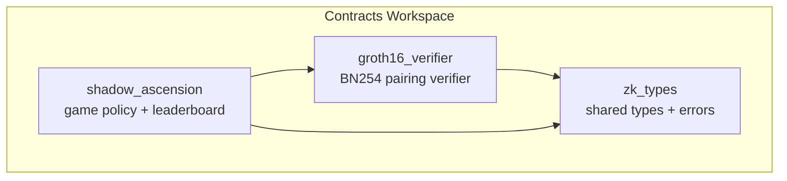
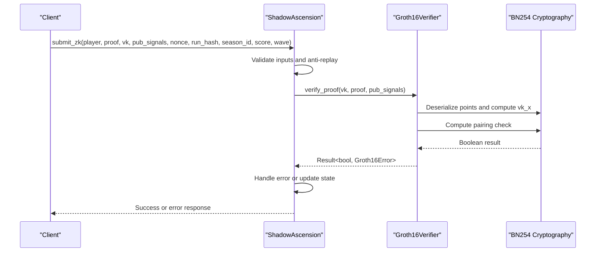
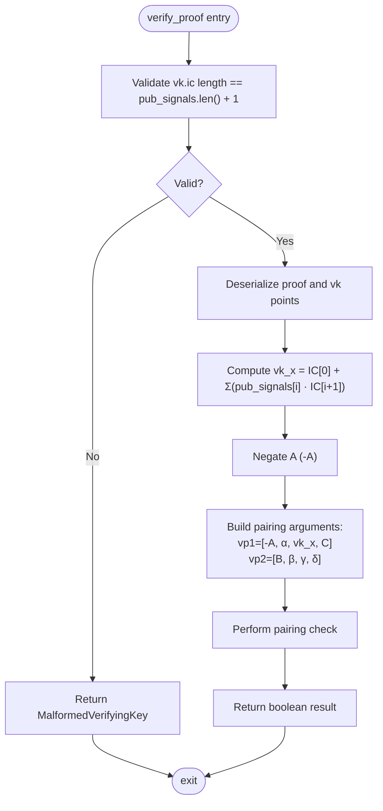
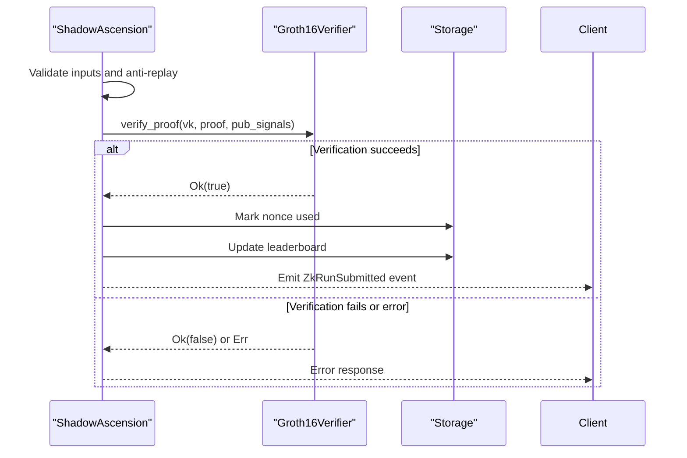
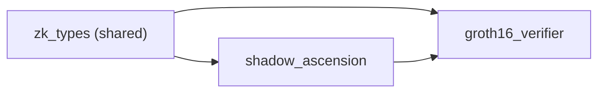

# Groth16 Verifier Contract

<cite>
**Referenced Files in This Document**
- [lib.rs](file://contracts/groth16_verifier/src/lib.rs)
- [test.rs](file://contracts/groth16_verifier/src/test.rs)
- [Cargo.toml](file://contracts/groth16_verifier/Cargo.toml)
- [README.md](file://contracts/groth16_verifier/README.md)
- [lib.rs](file://contracts/zk_types/src/lib.rs)
- [lib.rs](file://contracts/shadow_ascension/src/lib.rs)
- [tests.rs](file://contracts/shadow_ascension/src/tests.rs)
- [contract_proof.json](file://circuits/build/contract_proof.json)
- [vkey.json](file://circuits/build/vkey.json)
</cite>

## Table of Contents
1. [Introduction](#introduction)
2. [Project Structure](#project-structure)
3. [Core Components](#core-components)
4. [Architecture Overview](#architecture-overview)
5. [Detailed Component Analysis](#detailed-component-analysis)
6. [Dependency Analysis](#dependency-analysis)
7. [Performance Considerations](#performance-considerations)
8. [Troubleshooting Guide](#troubleshooting-guide)
9. [Conclusion](#conclusion)
10. [Appendices](#appendices)

## Introduction
This document provides comprehensive technical documentation for the Groth16 verifier contract that performs BN254 pairing-based proof verification. The contract adheres to the single responsibility principle: it performs pure cryptographic verification without incorporating game logic or leaderboard functionality. It implements the BN254 pairing check algorithm according to the mathematical formula e(-A, B) · e(α, β) · e(vk_x, γ) · e(C, δ) ≡ 1, where vk_x is computed as the sum over public signals multiplied by the verification key's IC components.

The verifier integrates with the broader Shadow Ascension ecosystem, where it validates zero-knowledge proofs submitted by players. The contract exposes a single function, verify_proof, which takes a verification key, a Groth16 proof, and public signals, returning a boolean indicating whether the proof satisfies the pairing equation. Error handling is centralized through a dedicated Groth16Error enumeration.

## Project Structure
The Groth16 verifier is part of a modular Rust workspace with three primary crates:
- groth16_verifier: Contains the BN254 pairing-based verifier contract
- zk_types: Defines shared data structures and error enums used across contracts
- shadow_ascension: Implements game logic, leaderboard management, and orchestrates verifier integration

**Diagram sources**
- [Cargo.toml](file://contracts/groth16_verifier/Cargo.toml#L1-L22)
- [lib.rs](file://contracts/shadow_ascension/src/lib.rs#L1-L314)

**Section sources**
- [Cargo.toml](file://contracts/groth16_verifier/Cargo.toml#L1-L22)
- [README.md](file://contracts/groth16_verifier/README.md#L1-L48)

## Core Components
This section documents the core components of the Groth16 verifier contract, focusing on the verify_proof function, data structures, and error handling.

- verify_proof function
  - Purpose: Performs BN254 pairing-based verification of a Groth16 proof against a verification key and public signals
  - Inputs:
    - Verification key (ZkVerificationKey): Contains α, β, γ, δ, and IC vector
    - Proof (ZkProof): Contains A, B, C commitments
    - Public signals (Vec<BytesN<32>>): Public inputs serialized as field elements
  - Output: Result<bool, Groth16Error>
  - Mathematical formula: e(-A, B) · e(α, β) · e(vk_x, γ) · e(C, δ) ≡ 1
  - vk_x computation: vk_x = IC[0] + Σ(pub_signals[i] · IC[i+1])

- ZkVerificationKey structure
  - alpha: G1 point (64 bytes)
  - beta: G2 point (128 bytes)
  - gamma: G2 point (128 bytes)
  - delta: G2 point (128 bytes)
  - ic: Vector of G1 points (64 bytes each), length equals pub_signals.length + 1

- ZkProof structure
  - a: G1 point (64 bytes)
  - b: G2 point (128 bytes)
  - c: G1 point (64 bytes)

- Groth16Error enumeration
  - InvalidProof: Proof failed pairing check
  - InvalidVerificationKey: Verification key is invalid
  - InvalidPublicInputs: Public inputs are invalid
  - MalformedVerifyingKey: Verification key structure mismatch (IC length vs. public signals)

**Section sources**
- [lib.rs](file://contracts/groth16_verifier/src/lib.rs#L18-L56)
- [lib.rs](file://contracts/zk_types/src/lib.rs#L16-L43)

## Architecture Overview
The verifier operates as a standalone contract that other contracts can invoke. The Shadow Ascension contract manages game state, applies business rules, and delegates cryptographic verification to the Groth16 verifier. This separation ensures that verification logic remains pure and reusable across different contexts.

**Diagram sources**
- [lib.rs](file://contracts/shadow_ascension/src/lib.rs#L159-L264)
- [lib.rs](file://contracts/groth16_verifier/src/lib.rs#L23-L56)

## Detailed Component Analysis

### verify_proof Implementation
The verify_proof function implements the BN254 pairing check with the following steps:
1. Validate verification key structure: ensure IC length equals public signals length plus one
2. Deserialize proof and verification key points from byte arrays
3. Compute vk_x by accumulating IC[0] and Σ(pub_signals[i] · IC[i+1])
4. Construct pairing arguments: [-A, α, vk_x, C] and [B, β, γ, δ]
5. Perform pairing check and return result

**Diagram sources**
- [lib.rs](file://contracts/groth16_verifier/src/lib.rs#L23-L56)

**Section sources**
- [lib.rs](file://contracts/groth16_verifier/src/lib.rs#L18-L56)

### Data Structures and Serialization
The zk_types module defines the canonical serialization format for BN254 elements:
- G1_SIZE: 64 bytes (uncompressed affine)
- G2_SIZE: 128 bytes (uncompressed affine)
- FR_SIZE: 32 bytes (field element)

These sizes are used consistently across the verifier and integration tests.

**Section sources**
- [lib.rs](file://contracts/zk_types/src/lib.rs#L9-L14)

### Error Handling and Validation
The verifier enforces strict validation:
- MalformedVerifyingKey: Triggered when vk.ic.length ≠ pub_signals.length + 1
- InvalidProof: Returned when pairing check fails
- InvalidVerificationKey and InvalidPublicInputs: Handled by underlying deserialization failures

Integration tests demonstrate these behaviors and show that the verifier returns a boolean result rather than panicking on invalid inputs.

**Section sources**
- [lib.rs](file://contracts/groth16_verifier/src/lib.rs#L31-L33)
- [test.rs](file://contracts/groth16_verifier/src/test.rs#L23-L47)

### Integration Patterns with Shadow Ascension
Shadow Ascension demonstrates the recommended integration pattern:
- Set verifier contract address via set_verifier
- Validate business rules (scores, waves, anti-replay) before invoking verifier
- Handle verifier errors and propagate results to update leaderboard and emit events

**Diagram sources**
- [lib.rs](file://contracts/shadow_ascension/src/lib.rs#L159-L264)

**Section sources**
- [lib.rs](file://contracts/shadow_ascension/src/lib.rs#L159-L264)
- [tests.rs](file://contracts/shadow_ascension/src/tests.rs#L100-L150)

## Dependency Analysis
The verifier relies on shared types and follows a clean dependency graph:

**Diagram sources**
- [Cargo.toml](file://contracts/groth16_verifier/Cargo.toml#L11-L13)
- [lib.rs](file://contracts/shadow_ascension/src/lib.rs#L10-L10)

Key dependencies:
- soroban-sdk: Provides BN254 cryptography primitives (pairing_check, g1_add, g1_mul)
- zk_types: Shared data structures and error enums

**Section sources**
- [Cargo.toml](file://contracts/groth16_verifier/Cargo.toml#L11-L13)
- [lib.rs](file://contracts/zk_types/src/lib.rs#L1-L44)

## Performance Considerations
- Pairing operations are computationally expensive; simulate resource usage with the provided CLI command
- The release profile enables LTO and aggressive optimization to reduce WASM size and improve runtime performance
- Consider batching verification requests when possible and caching frequently used verification keys

[No sources needed since this section provides general guidance]

## Troubleshooting Guide
Common issues and resolutions:
- MalformedVerifyingKey: Ensure vk.ic.length equals pub_signals.length + 1
- InvalidProof: Verify that the proof corresponds to the provided verification key and public signals
- Integration errors: Check that the verifier contract is properly registered and set in Shadow Ascension

Unit tests provide concrete examples of expected behavior:
- Malformed VK: Expects error propagation
- Invalid proof: Returns false
- Valid proof: Returns boolean result

**Section sources**
- [test.rs](file://contracts/groth16_verifier/src/test.rs#L23-L99)
- [README.md](file://contracts/groth16_verifier/README.md#L39-L47)

## Conclusion
The Groth16 verifier contract implements a focused, cryptographically sound verification mechanism for BN254 pairing-based proofs. Its adherence to the single responsibility principle ensures that verification logic remains isolated and reusable. The integration with Shadow Ascension demonstrates a clean separation of concerns, where cryptographic verification is handled by the verifier while game logic and state management reside in the policy contract. Proper error handling, validation, and testing ensure robust operation in production environments.

[No sources needed since this section summarizes without analyzing specific files]

## Appendices

### Mathematical Formula Reference
The verifier implements the BN254 pairing check:
e(-A, B) · e(α, β) · e(vk_x, γ) · e(C, δ) ≡ 1

Where:
- A, C are G1 points from the proof
- B is a G2 point from the proof
- α, β, γ, δ are G1/G2 points from the verification key
- vk_x = IC[0] + Σ(pub_signals[i] · IC[i+1])

**Section sources**
- [lib.rs](file://contracts/groth16_verifier/src/lib.rs#L20-L22)

### Example Verification Workflows
- Basic verification: Call verify_proof with valid vk, proof, and pub_signals
- Integration with Shadow Ascension: Use submit_zk to validate and process ranked submissions
- Real proof testing: Use the provided contract_proof.json to validate end-to-end verification

**Section sources**
- [tests.rs](file://contracts/shadow_ascension/src/tests.rs#L312-L381)
- [contract_proof.json](file://circuits/build/contract_proof.json#L1-L30)

### Security Considerations
- Always validate verification key structure before performing pairing checks
- Ensure public signals match the circuit's public input ordering
- Implement anti-replay mechanisms at the policy level
- Use proper error handling to prevent information leakage
- Regularly audit cryptographic dependencies and update to supported network versions

**Section sources**
- [README.md](file://contracts/groth16_verifier/README.md#L1-L48)
- [lib.rs](file://contracts/shadow_ascension/src/lib.rs#L159-L264)