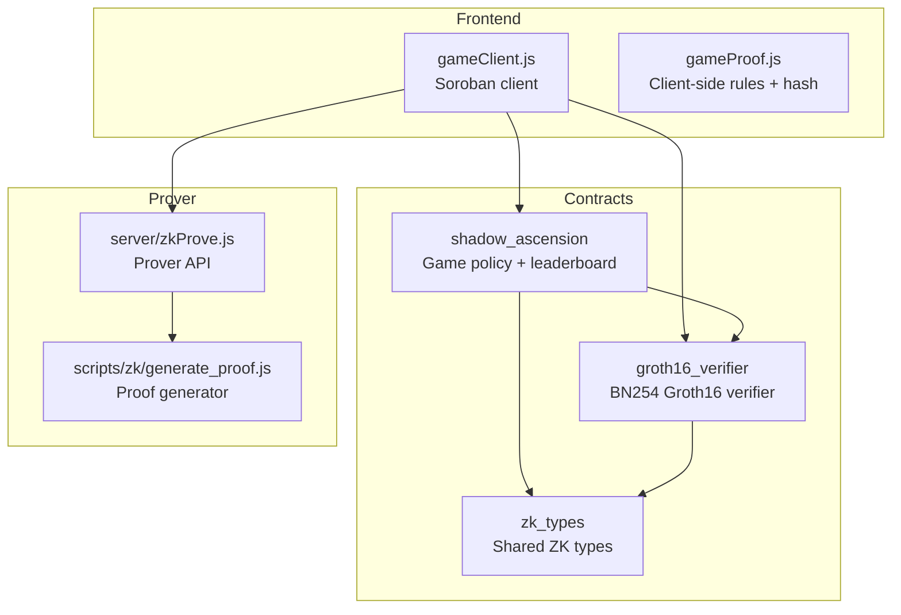
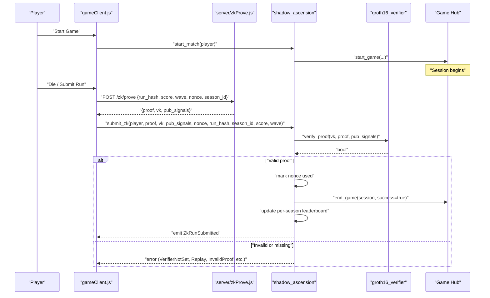
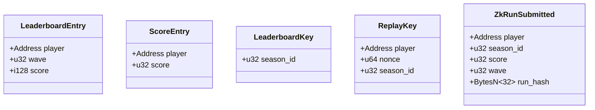
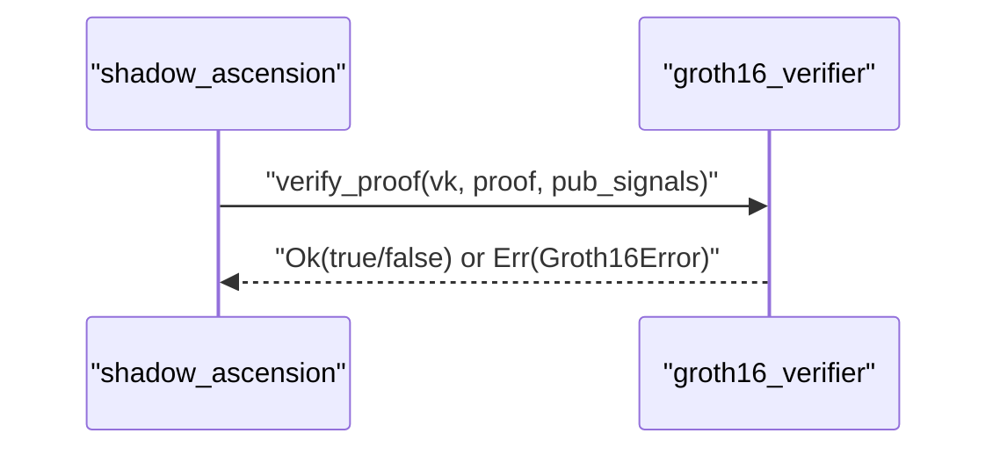
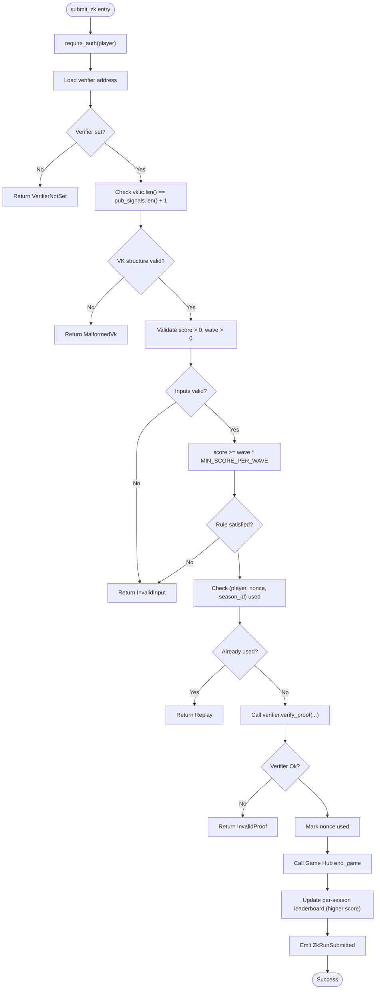
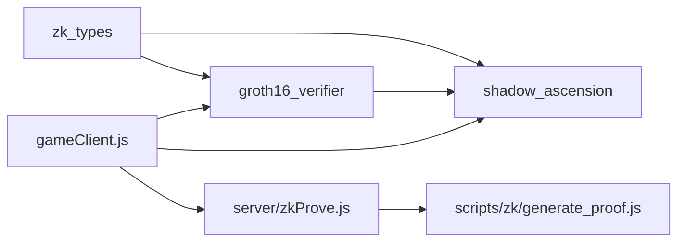

# Shadow Ascension Policy Contract

<cite>
**Referenced Files in This Document**
- [lib.rs](file://contracts/shadow_ascension/src/lib.rs)
- [Cargo.toml](file://contracts/shadow_ascension/Cargo.toml)
- [tests.rs](file://contracts/shadow_ascension/src/tests.rs)
- [lib.rs](file://contracts/groth16_verifier/src/lib.rs)
- [Cargo.toml](file://contracts/groth16_verifier/Cargo.toml)
- [lib.rs](file://contracts/zk_types/src/lib.rs)
- [README.md](file://contracts/README.md)
- [README.md](file://README.md)
- [gameClient.js](file://src/contracts/gameClient.js)
- [gameProof.js](file://src/zk/gameProof.js)
- [zkProve.js](file://server/zkProve.js)
- [generate_proof.js](file://scripts/zk/generate_proof.js)
</cite>

## Table of Contents
1. [Introduction](#introduction)
2. [Project Structure](#project-structure)
3. [Core Components](#core-components)
4. [Architecture Overview](#architecture-overview)
5. [Detailed Component Analysis](#detailed-component-analysis)
6. [Dependency Analysis](#dependency-analysis)
7. [Performance Considerations](#performance-considerations)
8. [Troubleshooting Guide](#troubleshooting-guide)
9. [Conclusion](#conclusion)
10. [Appendices](#appendices)

## Introduction
This document describes the Shadow Ascension policy contract that governs ranked gameplay and leaderboard functionality. It explains how the contract validates player submissions, prevents replays, integrates with a Groth16 verifier, and updates leaderboards. It also covers the submit_zk function interface, parameter validation rules, event emissions, and how the frontend game client interacts with the contract and prover backend.

## Project Structure
The Shadow Ascension system is composed of three main smart contracts and supporting frontend/client code:
- zk_types: Shared ZK data types used by both verifier and policy.
- groth16_verifier: BN254 Groth16 verifier contract that performs pairing checks.
- shadow_ascension: Game policy contract that orchestrates session lifecycle, anti-replay, verifier integration, leaderboard updates, and events.

**Diagram sources**
- [lib.rs](file://contracts/shadow_ascension/src/lib.rs#L1-L314)
- [lib.rs](file://contracts/groth16_verifier/src/lib.rs#L1-L61)
- [lib.rs](file://contracts/zk_types/src/lib.rs#L1-L44)
- [gameClient.js](file://src/contracts/gameClient.js#L1-L401)
- [gameProof.js](file://src/zk/gameProof.js#L1-L78)
- [zkProve.js](file://server/zkProve.js#L1-L68)
- [generate_proof.js](file://scripts/zk/generate_proof.js#L1-L46)

**Section sources**
- [README.md](file://contracts/README.md#L1-L88)
- [README.md](file://README.md#L40-L96)

## Core Components
- ShadowAscension policy contract
  - Initializes Game Hub address and session counter.
  - Sets the Groth16 verifier contract address.
  - Manages session lifecycle via start_match and delegates end_game to Game Hub.
  - Validates and accepts ranked submissions via submit_zk with anti-replay and verifier checks.
  - Maintains per-season ranked leaderboard and legacy casual leaderboard.
  - Emits ZkRunSubmitted event on successful ranked submissions.
- Groth16 verifier contract
  - Performs BN254 pairing checks against a Groth16 proof, verification key, and public signals.
- zk_types library
  - Defines ZkProof, ZkVerificationKey, Groth16Error, and serialization sizes for BN254 elements.

**Section sources**
- [lib.rs](file://contracts/shadow_ascension/src/lib.rs#L70-L295)
- [lib.rs](file://contracts/groth16_verifier/src/lib.rs#L15-L57)
- [lib.rs](file://contracts/zk_types/src/lib.rs#L16-L44)

## Architecture Overview
The ranked submission flow integrates the frontend client, prover backend, and on-chain contracts:

**Diagram sources**
- [lib.rs](file://contracts/shadow_ascension/src/lib.rs#L87-L119)
- [lib.rs](file://contracts/shadow_ascension/src/lib.rs#L159-L264)
- [lib.rs](file://contracts/groth16_verifier/src/lib.rs#L23-L56)
- [gameClient.js](file://src/contracts/gameClient.js#L76-L249)
- [zkProve.js](file://server/zkProve.js#L46-L67)

## Detailed Component Analysis

### ShadowAscension Policy Contract
Responsibilities:
- Initialization and configuration
  - Stores Game Hub address and initializes session counter.
  - Allows setting the verifier contract address.
- Session lifecycle
  - start_match increments a persistent session counter and calls Game Hub start_game.
- Legacy casual submission
  - submit_result validates score vs wave and writes to legacy leaderboard.
- Ranked ZK submission
  - submit_zk performs:
    - Authentication (require_auth).
    - Verifier existence check.
    - Verification key structure validation (ic length).
    - Input validation (score > 0, wave > 0, progression rule score >= wave * MIN_SCORE_PER_WAVE).
    - Anti-replay check using (player, nonce, season_id).
    - Invokes verifier contract to validate proof.
    - Marks nonce as used on success.
    - Calls Game Hub end_game.
    - Updates per-season leaderboard (higher score replaces existing).
    - Emits ZkRunSubmitted event.
- Leaderboard queries
  - get_leaderboard_by_season returns top N players by score for a season.
  - get_leaderboard returns legacy casual leaderboard entries.

Data structures and types:
- LeaderboardEntry: player, wave, score (legacy).
- ScoreEntry: player, score (ranked).
- LeaderboardKey: season_id.
- ReplayKey: player, nonce, season_id.
- ZkRunSubmitted: event payload with player, season_id, score, wave, run_hash.

Error handling:
- ShadowAscensionError enumerates: VerifierNotSet, Replay, InvalidProof, VerifierError, InvalidInput, MalformedVk.

Security measures:
- Anti-replay via persistent storage of (player, nonce, season_id) keys.
- Verifier contract validation for all ranked submissions.
- Player authentication via require_auth on all mutating functions.

Event emission:
- ZkRunSubmitted event published upon successful ranked submission.

**Section sources**
- [lib.rs](file://contracts/shadow_ascension/src/lib.rs#L70-L295)
- [tests.rs](file://contracts/shadow_ascension/src/tests.rs#L71-L297)

#### Class Diagram: Data Types

**Diagram sources**
- [lib.rs](file://contracts/shadow_ascension/src/lib.rs#L24-L65)

### Groth16 Verifier Contract
Responsibilities:
- verify_proof performs BN254 pairing checks against ZkProof, ZkVerificationKey, and public signals.
- Validates verification key structure (ic length).
- Returns boolean success or Groth16Error.

Integration:
- Called by ShadowAscension policy contract during submit_zk.

**Section sources**
- [lib.rs](file://contracts/groth16_verifier/src/lib.rs#L18-L56)
- [lib.rs](file://contracts/zk_types/src/lib.rs#L16-L44)

#### Sequence Diagram: Verifier Flow

**Diagram sources**
- [lib.rs](file://contracts/shadow_ascension/src/lib.rs#L203-L220)
- [lib.rs](file://contracts/groth16_verifier/src/lib.rs#L23-L56)

### Frontend Integration and Client-Side Rules
Client responsibilities:
- startMatch: calls policy.start_match(player).
- submitResult: calls policy.submit_result(player, wave, score) for casual mode.
- submitZk: builds proof/vk/pubSignals, validates client-side rules, and calls policy.submit_zk.
- submitZkFromProver: requests proof from backend prover and then calls submitZk.
- getLeaderboard/getLeaderboardBySeason: read-only queries to display rankings.

Client-side validation:
- validateGameRules enforces score >= wave * MIN_SCORE_PER_WAVE and bounds checking.

Prover backend:
- server/zkProve.js generates circuit inputs from request and executes proof generation script.
- scripts/zk/generate_proof.js runs snarkjs fullprove and exports contract-ready proof.

**Section sources**
- [gameClient.js](file://src/contracts/gameClient.js#L76-L249)
- [gameClient.js](file://src/contracts/gameClient.js#L258-L273)
- [gameProof.js](file://src/zk/gameProof.js#L51-L63)
- [zkProve.js](file://server/zkProve.js#L46-L67)
- [generate_proof.js](file://scripts/zk/generate_proof.js#L36-L45)

#### Flowchart: submit_zk Validation Logic

**Diagram sources**
- [lib.rs](file://contracts/shadow_ascension/src/lib.rs#L159-L264)

## Dependency Analysis
- shadow_ascension depends on zk_types for ZK data structures and Groth16Error.
- groth16_verifier depends on zk_types for ZK data structures and Groth16Error.
- Frontend gameClient.js depends on zk_types via shared serialization and on the prover backend for ranked submissions.
- Prover backend depends on circuit build artifacts and snarkjs.

**Diagram sources**
- [Cargo.toml](file://contracts/shadow_ascension/Cargo.toml#L13-L19)
- [Cargo.toml](file://contracts/groth16_verifier/Cargo.toml#L11-L16)
- [lib.rs](file://contracts/zk_types/src/lib.rs#L7-L14)
- [gameClient.js](file://src/contracts/gameClient.js#L1-L401)
- [zkProve.js](file://server/zkProve.js#L1-L68)
- [generate_proof.js](file://scripts/zk/generate_proof.js#L1-L46)

**Section sources**
- [Cargo.toml](file://contracts/shadow_ascension/Cargo.toml#L13-L19)
- [Cargo.toml](file://contracts/groth16_verifier/Cargo.toml#L11-L16)

## Performance Considerations
- Leaderboard sorting is implemented with a simple bubble-sort-like routine; complexity is O(n^2). For large leaderboards, consider optimizing to O(n log n) with a stable sort to preserve deterministic ordering.
- Anti-replay uses a persistent map keyed by (player, nonce, season_id). Ensure season_id partitioning keeps key sets bounded per season.
- Verifier calls are off-chain in the policy contract; ensure public inputs and verification key sizes remain within expected limits to avoid excessive computational costs.

## Troubleshooting Guide
Common errors and resolutions:
- VerifierNotSet
  - Cause: set_verifier was not called or not persisted.
  - Resolution: Deploy and initialize verifier, then call set_verifier on policy.
- Replay
  - Cause: Same (player, nonce, season_id) submitted twice.
  - Resolution: Use a fresh nonce per run; do not reuse.
- InvalidProof
  - Cause: Verifier returned false or malformed inputs.
  - Resolution: Recreate proof with correct run_hash, score, wave, and public signals; ensure prover backend is configured.
- VerifierError
  - Cause: Underlying verifier error (e.g., malformed verifying key).
  - Resolution: Validate VK structure and IC length; confirm prover output correctness.
- InvalidInput
  - Cause: score == 0, wave == 0, or score < wave * MIN_SCORE_PER_WAVE.
  - Resolution: Fix client-side validation and ensure game rules are met before submission.
- MalformedVk
  - Cause: vk.ic length does not match pub_signals count + 1.
  - Resolution: Recreate VK with correct structure from the circuit.

Integration tips:
- Ensure VITE_SHADOW_ASCENSION_CONTRACT_ID and VITE_ZK_PROVER_URL are set for ranked mode.
- Confirm prover backend is reachable and circuits are built before requesting proofs.

**Section sources**
- [lib.rs](file://contracts/shadow_ascension/src/lib.rs#L12-L22)
- [tests.rs](file://contracts/shadow_ascension/src/tests.rs#L71-L297)
- [README.md](file://contracts/README.md#L73-L83)

## Conclusion
The Shadow Ascension policy contract provides a secure, provably fair ranked submission mechanism by combining anti-replay protection, strict input validation, and on-chain Groth16 verification. Together with the frontend client and prover backend, it enables transparent, tamper-proof leaderboard updates while preserving game privacy and fairness.

## Appendices

### Function Reference: submit_zk
Parameters:
- player: Address (authenticated)
- proof: ZkProof (BN254-encoded)
- vk: ZkVerificationKey (BN254-encoded)
- pub_signals: Vec<BytesN<32>>
- nonce: u64 (unique per player per season)
- run_hash: BytesN<32> (binding to run result)
- season_id: u32 (season partitioning)
- score: u32 (must be > 0 and >= wave * MIN_SCORE_PER_WAVE)
- wave: u32 (must be > 0)

Behavior:
- Validates inputs and progression rule.
- Checks anti-replay.
- Calls verifier contract.
- On success: marks nonce used, calls Game Hub end_game, updates per-season leaderboard, emits ZkRunSubmitted.

**Section sources**
- [lib.rs](file://contracts/shadow_ascension/src/lib.rs#L159-L264)
- [lib.rs](file://contracts/zk_types/src/lib.rs#L27-L43)

### Example Workflows

#### Ranked Submission (End-to-End)
- Compute run_hash on client.
- Request proof from prover backend.
- Call submitZk to submit to policy contract.
- On success, ZkRunSubmitted event is emitted and leaderboard updated.

**Section sources**
- [gameClient.js](file://src/contracts/gameClient.js#L213-L249)
- [zkProve.js](file://server/zkProve.js#L46-L67)
- [README.md](file://README.md#L58-L67)

#### Anti-Replay Protection
- Each (player, nonce, season_id) is stored as used after first successful submission.
- Subsequent submissions with the same tuple are rejected.

**Section sources**
- [lib.rs](file://contracts/shadow_ascension/src/lib.rs#L190-L201)
- [tests.rs](file://contracts/shadow_ascension/src/tests.rs#L100-L150)