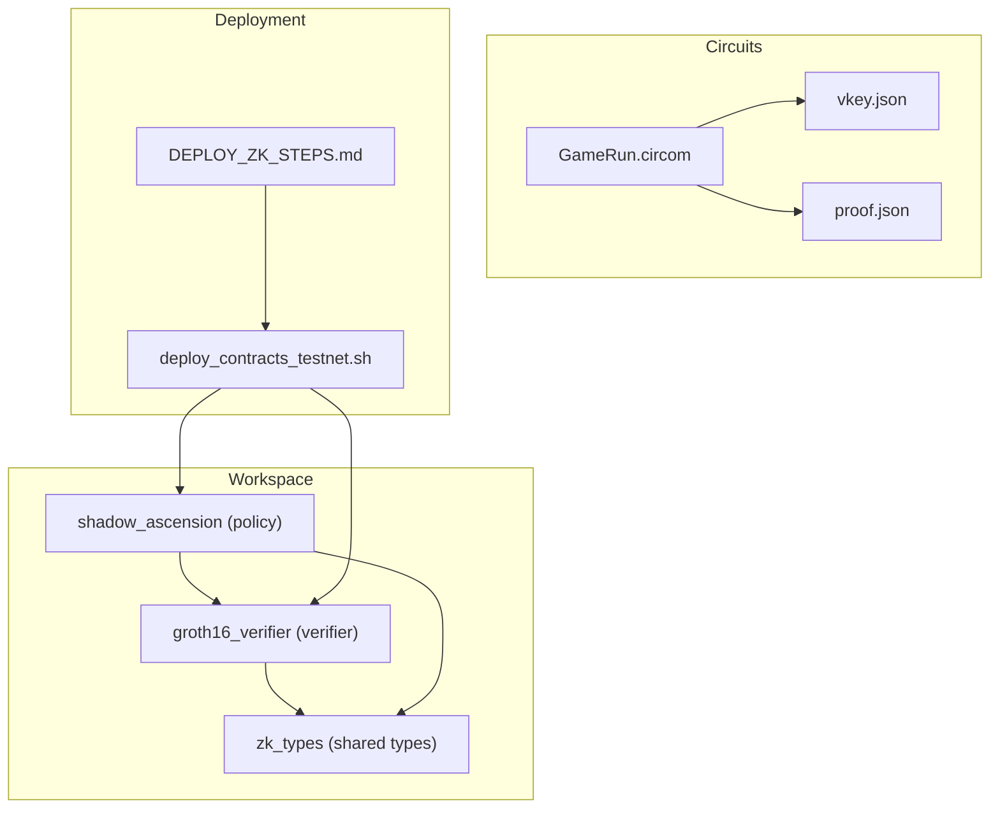
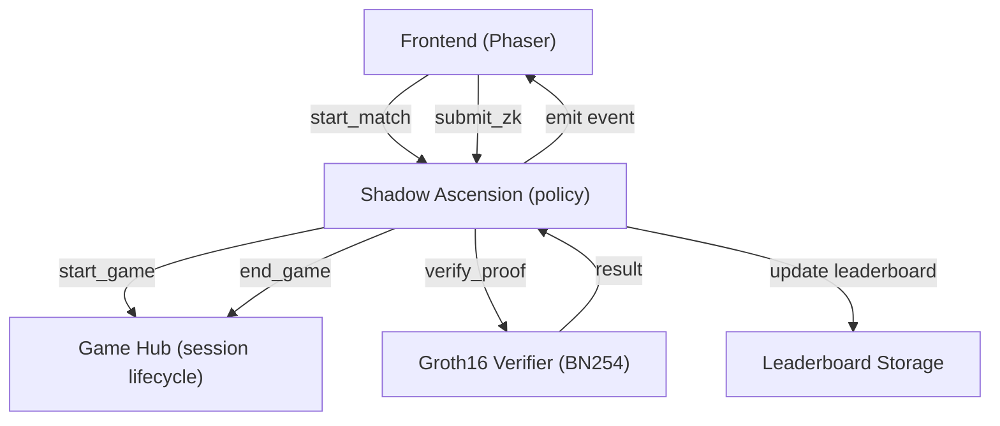
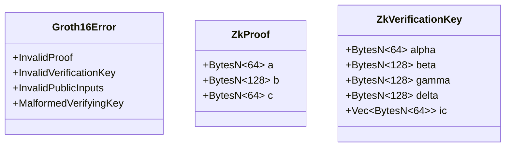
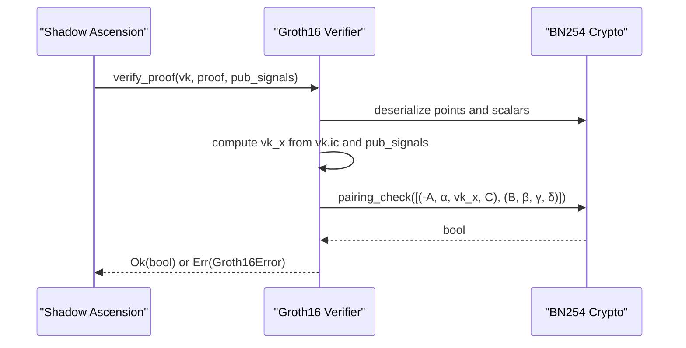
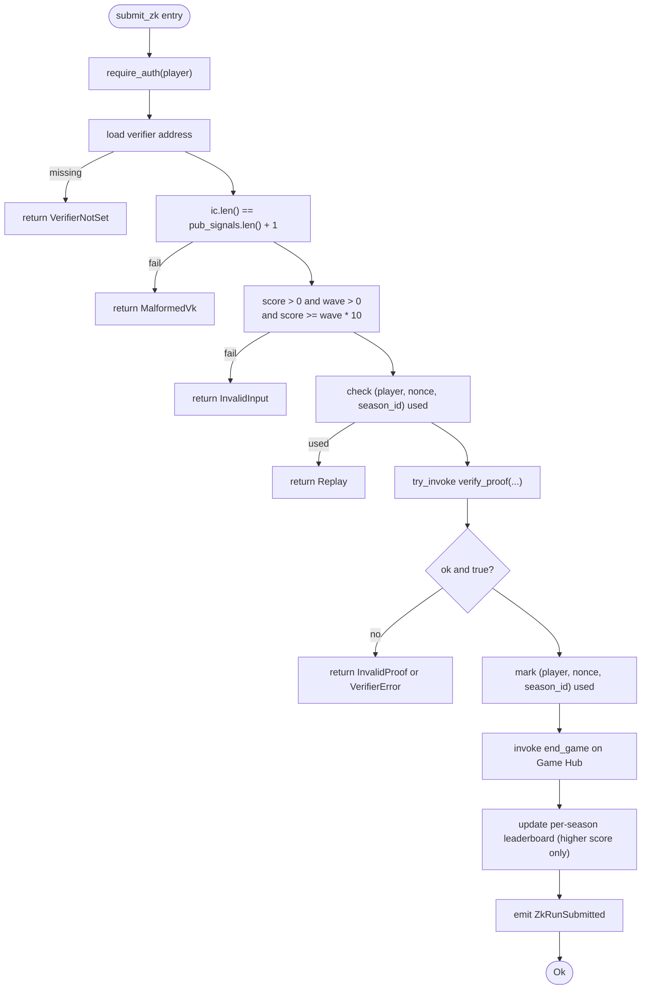
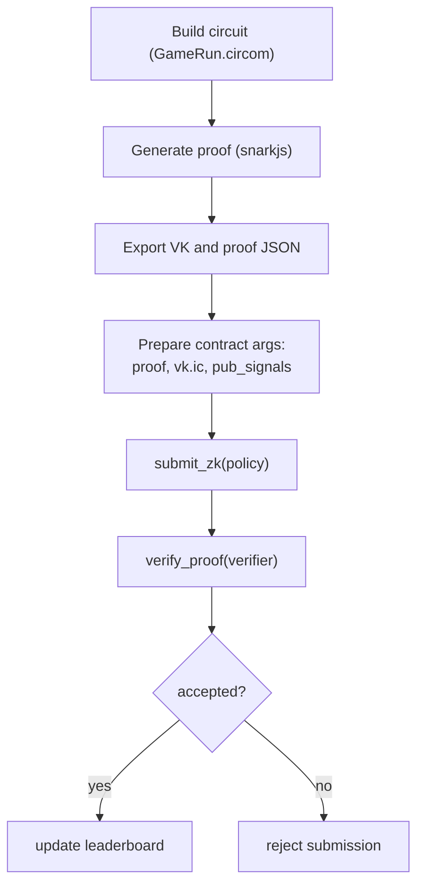
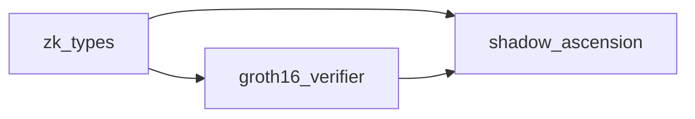

# Smart Contract Architecture

<cite>
**Referenced Files in This Document**
- [README.md](file://README.md)
- [contracts/README.md](file://contracts/README.md)
- [contracts/Cargo.toml](file://contracts/Cargo.toml)
- [contracts/zk_types/src/lib.rs](file://contracts/zk_types/src/lib.rs)
- [contracts/zk_types/Cargo.toml](file://contracts/zk_types/Cargo.toml)
- [contracts/groth16_verifier/src/lib.rs](file://contracts/groth16_verifier/src/lib.rs)
- [contracts/groth16_verifier/src/test.rs](file://contracts/groth16_verifier/src/test.rs)
- [contracts/groth16_verifier/Cargo.toml](file://contracts/groth16_verifier/Cargo.toml)
- [contracts/shadow_ascension/src/lib.rs](file://contracts/shadow_ascension/src/lib.rs)
- [contracts/shadow_ascension/src/tests.rs](file://contracts/shadow_ascension/src/tests.rs)
- [contracts/shadow_ascension/Cargo.toml](file://contracts/shadow_ascension/Cargo.toml)
- [circuits/GameRun.circom](file://circuits/GameRun.circom)
- [circuits/build/vkey.json](file://circuits/build/vkey.json)
- [circuits/build/proof.json](file://circuits/build/proof.json)
- [scripts/deploy_contracts_testnet.sh](file://scripts/deploy_contracts_testnet.sh)
- [docs/DEPLOY_ZK_STEPS.md](file://docs/DEPLOY_ZK_STEPS.md)
- [docs/E2E_VERIFICATION.md](file://docs/E2E_VERIFICATION.md)
</cite>

## Table of Contents
1. [Introduction](#introduction)
2. [Project Structure](#project-structure)
3. [Core Components](#core-components)
4. [Architecture Overview](#architecture-overview)
5. [Detailed Component Analysis](#detailed-component-analysis)
6. [Dependency Analysis](#dependency-analysis)
7. [Performance Considerations](#performance-considerations)
8. [Troubleshooting Guide](#troubleshooting-guide)
9. [Conclusion](#conclusion)
10. [Appendices](#appendices)

## Introduction
This document explains Vibe-Coder’s three-contract architecture on Soroban for a provably fair, ZK-ranked survival game. The system separates concerns across:
- Groth16 verifier contract: BN254 pairing-based verification with a single responsibility.
- Shadow Ascension policy contract: game logic, anti-replay, leaderboard management, and integration with the Game Hub.
- zk_types shared library: common data structures and errors for Groth16 verification.

It documents the BN254 pairing algorithm, contract interfaces, data flow, verification key and proof formats, public signal handling, deployment and upgrade procedures, and security considerations. It also provides examples of interactions and integration patterns.

## Project Structure
The repository organizes the ZK stack into a workspace with three crates:
- zk_types: shared types and errors.
- groth16_verifier: BN254 Groth16 verifier.
- shadow_ascension: policy contract integrating with the Game Hub and managing leaderboards.

**Diagram sources**
- [contracts/Cargo.toml](file://contracts/Cargo.toml#L1-L4)
- [contracts/zk_types/Cargo.toml](file://contracts/zk_types/Cargo.toml#L1-L13)
- [contracts/groth16_verifier/Cargo.toml](file://contracts/groth16_verifier/Cargo.toml#L1-L22)
- [contracts/shadow_ascension/Cargo.toml](file://contracts/shadow_ascension/Cargo.toml#L1-L30)
- [circuits/GameRun.circom](file://circuits/GameRun.circom#L1-L34)
- [circuits/build/vkey.json](file://circuits/build/vkey.json#L1-L119)
- [circuits/build/proof.json](file://circuits/build/proof.json#L1-L28)
- [scripts/deploy_contracts_testnet.sh](file://scripts/deploy_contracts_testnet.sh#L1-L70)
- [docs/DEPLOY_ZK_STEPS.md](file://docs/DEPLOY_ZK_STEPS.md#L1-L90)

**Section sources**
- [contracts/README.md](file://contracts/README.md#L1-L88)
- [contracts/Cargo.toml](file://contracts/Cargo.toml#L1-L4)

## Core Components
- zk_types: Defines Groth16Error, ZkProof, and ZkVerificationKey, plus sizes for BN254 elements. These types are used by both the verifier and the policy.
- groth16_verifier: Implements BN254 pairing-based Groth16 verification. It validates that a proof matches the verification key and public signals according to the pairing equation.
- shadow_ascension: Implements game policy, including initialization, match lifecycle, anti-replay protection, leaderboard management, and event emission. It invokes the verifier for ranked submissions.

Key responsibilities:
- zk_types: Serialization sizes and error codes for BN254 elements.
- groth16_verifier: Pairing check e(-A, B)·e(α, β)·e(vk_x, γ)·e(C, δ) == 1, with vk_x derived from vk.ic and public signals.
- shadow_ascension: Enforces game rules, manages per-season leaderboards, emits events, and coordinates with the Game Hub.

**Section sources**
- [contracts/zk_types/src/lib.rs](file://contracts/zk_types/src/lib.rs#L1-L44)
- [contracts/groth16_verifier/src/lib.rs](file://contracts/groth16_verifier/src/lib.rs#L1-L61)
- [contracts/shadow_ascension/src/lib.rs](file://contracts/shadow_ascension/src/lib.rs#L1-L314)

## Architecture Overview
The system integrates off-chain gameplay with on-chain verification and governance. The policy contract orchestrates the session lifecycle and submissions, while the verifier ensures cryptographic validity of ranked runs.

**Diagram sources**
- [README.md](file://README.md#L40-L67)
- [contracts/shadow_ascension/src/lib.rs](file://contracts/shadow_ascension/src/lib.rs#L70-L294)
- [contracts/groth16_verifier/src/lib.rs](file://contracts/groth16_verifier/src/lib.rs#L15-L56)

## Detailed Component Analysis

### zk_types: Shared Data Structures
- Purpose: Provide canonical definitions for Groth16 data structures and errors used across contracts.
- Types:
  - Groth16Error: error variants for invalid proof, VK, public inputs, and malformed VK shape.
  - ZkProof: points A (G1), B (G2), C (G1) representing the Groth16 proof.
  - ZkVerificationKey: α (G1), β (G2), γ (G2), δ (G2), and ic vector of G1 points.
- Sizes: G1=64 bytes, G2=128 bytes, Fr=32 bytes.

**Diagram sources**
- [contracts/zk_types/src/lib.rs](file://contracts/zk_types/src/lib.rs#L16-L44)

**Section sources**
- [contracts/zk_types/src/lib.rs](file://contracts/zk_types/src/lib.rs#L1-L44)
- [contracts/zk_types/Cargo.toml](file://contracts/zk_types/Cargo.toml#L1-L13)

### Groth16 Verifier Contract
- Responsibilities:
  - Validate Groth16 proof against a verification key and public signals.
  - Enforce VK shape: ic length equals public signals count plus one.
  - Compute vk_x = ic[0] + Σ(pub_signal[i] · ic[i+1]) using scalar multiplication and point addition.
  - Perform BN254 pairing check using the standard equation.
- Public interface:
  - verify_proof(env, vk, proof, pub_signals) -> Result<bool, Groth16Error>.

**Diagram sources**
- [contracts/groth16_verifier/src/lib.rs](file://contracts/groth16_verifier/src/lib.rs#L18-L56)
- [contracts/shadow_ascension/src/lib.rs](file://contracts/shadow_ascension/src/lib.rs#L203-L220)

**Section sources**
- [contracts/groth16_verifier/src/lib.rs](file://contracts/groth16_verifier/src/lib.rs#L1-L61)
- [contracts/groth16_verifier/src/test.rs](file://contracts/groth16_verifier/src/test.rs#L1-L100)
- [contracts/groth16_verifier/Cargo.toml](file://contracts/groth16_verifier/Cargo.toml#L1-L22)

### Shadow Ascension Policy Contract
- Responsibilities:
  - Initialize with Game Hub address and maintain a session counter.
  - Set the verifier contract address.
  - Manage match lifecycle: start_match calls Game Hub start_game; submit_result and submit_zk call Game Hub end_game.
  - Anti-replay: track (player, nonce, season_id) to prevent reuse.
  - Leaderboard management: per-season ScoreEntry list sorted descending by score; legacy LeaderboardEntry for casual mode.
  - Events: emit ZkRunSubmitted on successful ranked submission.
- Public interfaces:
  - init(env, game_hub)
  - set_verifier(env, verifier)
  - start_match(env, player) -> u32
  - submit_result(env, player, wave, score) -> bool
  - submit_zk(env, player, proof, vk, pub_signals, nonce, run_hash, season_id, score, wave) -> Result<(), ShadowAscensionError>
  - get_leaderboard_by_season(env, season_id, limit) -> Vec<ScoreEntry>
  - get_leaderboard(env, limit) -> Vec<LeaderboardEntry>

**Diagram sources**
- [contracts/shadow_ascension/src/lib.rs](file://contracts/shadow_ascension/src/lib.rs#L156-L264)

**Section sources**
- [contracts/shadow_ascension/src/lib.rs](file://contracts/shadow_ascension/src/lib.rs#L1-L314)
- [contracts/shadow_ascension/src/tests.rs](file://contracts/shadow_ascension/src/tests.rs#L1-L382)
- [contracts/shadow_ascension/Cargo.toml](file://contracts/shadow_ascension/Cargo.toml#L1-L30)

### Circuit and ZK Data Formats
- Circuit: GameRun.circom binds run_hash (hi/lo), score, wave, nonce, season_id and enforces score >= wave * 10. It exposes these as public outputs.
- Verification key: vkey.json contains BN128 curve parameters and IC structure compatible with BN254 serialization sizes in the contracts.
- Proof: proof.json contains π_a, π_b, π_c representing the Groth16 proof.

**Diagram sources**
- [circuits/GameRun.circom](file://circuits/GameRun.circom#L1-L34)
- [circuits/build/vkey.json](file://circuits/build/vkey.json#L1-L119)
- [circuits/build/proof.json](file://circuits/build/proof.json#L1-L28)
- [contracts/shadow_ascension/src/lib.rs](file://contracts/shadow_ascension/src/lib.rs#L156-L264)

**Section sources**
- [circuits/GameRun.circom](file://circuits/GameRun.circom#L1-L34)
- [circuits/build/vkey.json](file://circuits/build/vkey.json#L1-L119)
- [circuits/build/proof.json](file://circuits/build/proof.json#L1-L28)

## Dependency Analysis
- Workspace composition: contracts/Cargo.toml lists members zk_types, groth16_verifier, shadow_ascension.
- Internal dependencies:
  - groth16_verifier depends on zk_types.
  - shadow_ascension depends on zk_types and invokes groth16_verifier.
- Off-chain dependencies:
  - Circuits and prover produce VK and proof consumed by on-chain submission.

**Diagram sources**
- [contracts/Cargo.toml](file://contracts/Cargo.toml#L1-L4)
- [contracts/zk_types/Cargo.toml](file://contracts/zk_types/Cargo.toml#L1-L13)
- [contracts/groth16_verifier/Cargo.toml](file://contracts/groth16_verifier/Cargo.toml#L11-L13)
- [contracts/shadow_ascension/Cargo.toml](file://contracts/shadow_ascension/Cargo.toml#L13-L15)

**Section sources**
- [contracts/Cargo.toml](file://contracts/Cargo.toml#L1-L4)
- [contracts/groth16_verifier/Cargo.toml](file://contracts/groth16_verifier/Cargo.toml#L11-L13)
- [contracts/shadow_ascension/Cargo.toml](file://contracts/shadow_ascension/Cargo.toml#L13-L15)

## Performance Considerations
- Pairing computation: BN254 pairing_check is computationally intensive; minimize unnecessary invocations.
- Public inputs and VK shape: Ensure pub_signals and vk.ic lengths match to avoid extra validation overhead.
- Leaderboard updates: Sorting is O(n^2) in current implementation; consider optimizing for large leaderboards.
- Storage: Persistent storage reads/writes for leaderboard and replay keys; batch operations where possible.
- Gas and fees: Prefer sim-only invocations for testing; use estimate fees before submitting.

[No sources needed since this section provides general guidance]

## Troubleshooting Guide
Common errors and causes:
- VerifierNotSet: Policy has not been initialized with a verifier address.
- MalformedVk: vk.ic length does not equal pub_signals.length + 1.
- InvalidInput: score <= 0, wave <= 0, or score < wave * 10.
- Replay: (player, nonce, season_id) already used.
- InvalidProof or VerifierError: Proof failed verification or verifier returned an error.

Validation and tests:
- Unit tests for verifier cover malformed VK rejection and invalid/valid proof handling.
- Integration tests for policy cover verifier-not-set panic, anti-replay, invalid proof, and valid submission updating leaderboard and emitting events.

**Section sources**
- [contracts/shadow_ascension/src/lib.rs](file://contracts/shadow_ascension/src/lib.rs#L12-L22)
- [contracts/groth16_verifier/src/test.rs](file://contracts/groth16_verifier/src/test.rs#L23-L100)
- [contracts/shadow_ascension/src/tests.rs](file://contracts/shadow_ascension/src/tests.rs#L71-L382)

## Conclusion
Vibe-Coder’s architecture cleanly separates cryptographic verification, game policy, and shared data structures. The BN254 pairing-based verifier ensures that only valid runs enter the ranked leaderboard, while the policy enforces game rules, manages anti-replay, and coordinates with the Game Hub. The modular design simplifies deployment, testing, and future upgrades.

[No sources needed since this section summarizes without analyzing specific files]

## Appendices

### Contract Interfaces and Data Flow
- Verifier interface: verify_proof(vk, proof, pub_signals) -> bool or Groth16Error.
- Policy interface: submit_zk(...) validates inputs, checks anti-replay, calls verifier, updates leaderboard, emits event, and notifies Game Hub.

**Section sources**
- [contracts/groth16_verifier/src/lib.rs](file://contracts/groth16_verifier/src/lib.rs#L18-L56)
- [contracts/shadow_ascension/src/lib.rs](file://contracts/shadow_ascension/src/lib.rs#L156-L264)

### Deployment Procedures
- Build WASM for zk_types, groth16_verifier, and shadow_ascension using wasm32v1-none target.
- Deploy verifier and policy to Testnet; initialize policy with Game Hub and set verifier.
- Configure frontend with contract IDs and prover URL.

**Section sources**
- [contracts/README.md](file://contracts/README.md#L9-L21)
- [scripts/deploy_contracts_testnet.sh](file://scripts/deploy_contracts_testnet.sh#L1-L70)
- [docs/DEPLOY_ZK_STEPS.md](file://docs/DEPLOY_ZK_STEPS.md#L19-L89)

### Upgrade Mechanisms
- The contracts are designed as separate modules. Upgrades should be coordinated carefully:
  - Maintain ABI compatibility for zk_types to avoid breaking changes.
  - For policy upgrades, preserve storage keys for leaderboard and replay protection.
  - For verifier upgrades, ensure VKs remain compatible with the circuit’s public signals.
- Recommended approach: deploy new verifier, set_verifier on policy, test, then decommission old verifier.

[No sources needed since this section provides general guidance]

### Security Considerations
- Anti-replay: Use unique (player, nonce, season_id) per submission.
- VK integrity: Validate vk.ic length against pub_signals count.
- Rule enforcement: score >= wave * 10 prevents trivial submissions.
- Event transparency: Emits ZkRunSubmitted for on-chain auditability.
- Access control: require_auth on sensitive operations.

**Section sources**
- [contracts/shadow_ascension/src/lib.rs](file://contracts/shadow_ascension/src/lib.rs#L172-L264)
- [circuits/GameRun.circom](file://circuits/GameRun.circom#L16-L22)

### Examples and Integration Patterns
- End-to-end flow: start_match -> play -> submit_zk -> verifier -> leaderboard update -> event emission.
- Fallback: submit_result for casual mode when ZK prover is unavailable.
- Testing: Automated tests cover verifier behavior and policy submission scenarios.

**Section sources**
- [README.md](file://README.md#L58-L67)
- [docs/E2E_VERIFICATION.md](file://docs/E2E_VERIFICATION.md#L1-L68)