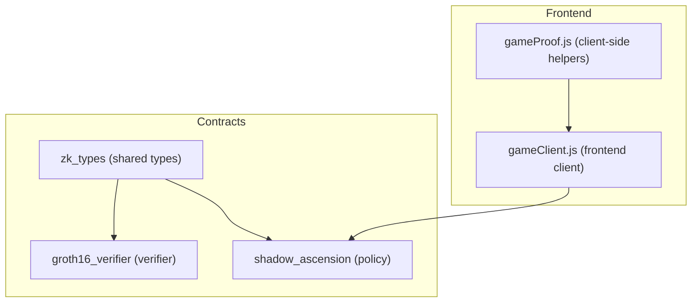
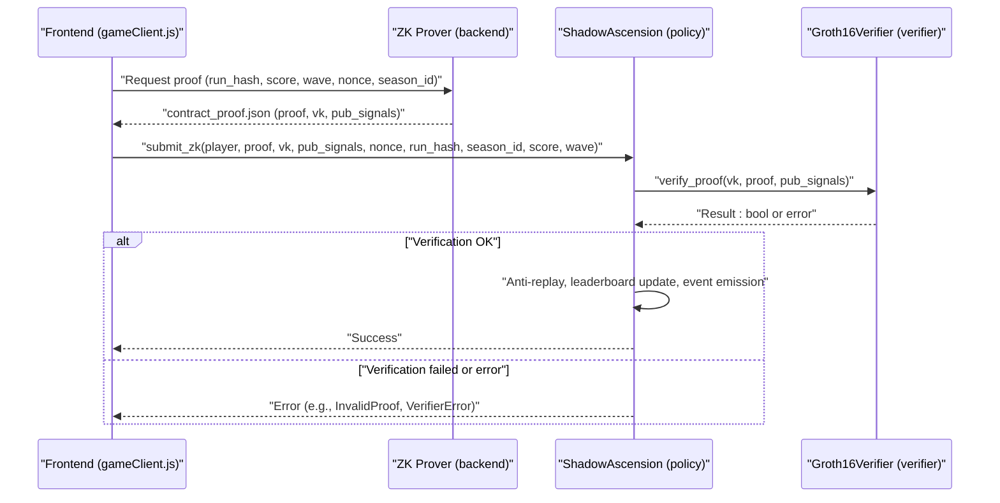
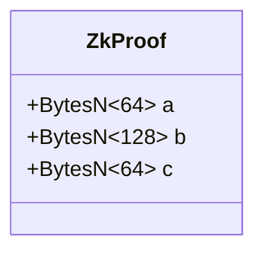
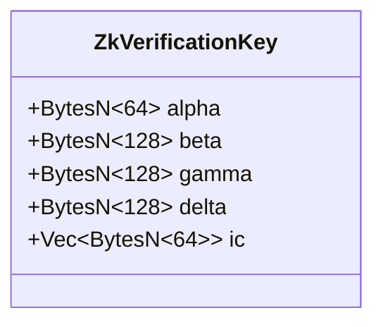
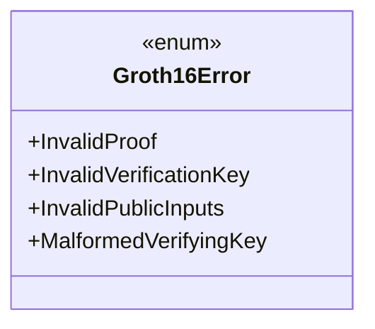
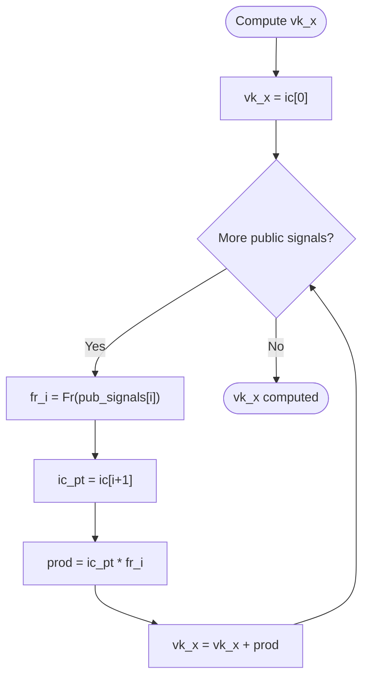
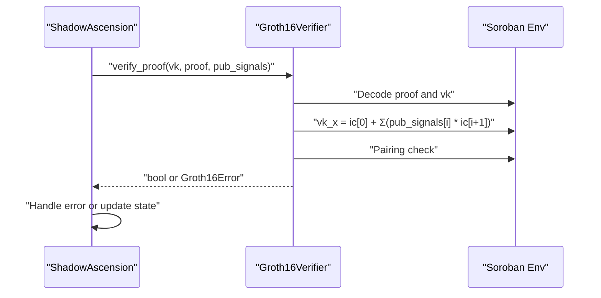
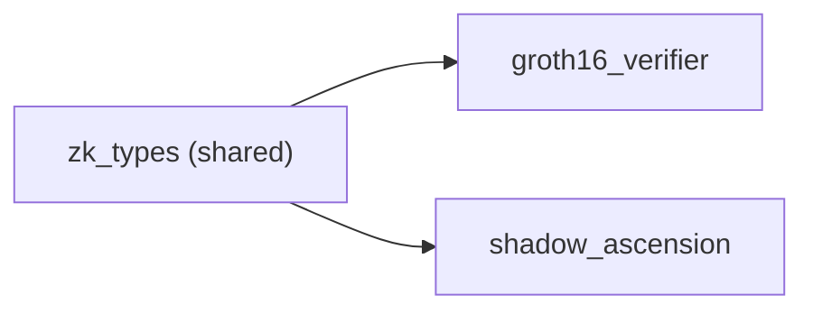

# ZK Types Library

<cite>
**Referenced Files in This Document**
- [lib.rs](file://contracts/zk_types/src/lib.rs)
- [Cargo.toml](file://contracts/zk_types/Cargo.toml)
- [lib.rs](file://contracts/groth16_verifier/src/lib.rs)
- [test.rs](file://contracts/groth16_verifier/src/test.rs)
- [Cargo.toml](file://contracts/groth16_verifier/Cargo.toml)
- [lib.rs](file://contracts/shadow_ascension/src/lib.rs)
- [tests.rs](file://contracts/shadow_ascension/src/tests.rs)
- [Cargo.toml](file://contracts/shadow_ascension/Cargo.toml)
- [export_for_contract.js](file://scripts/zk/export_for_contract.js)
- [contract_args_from_proof.js](file://scripts/zk/contract_args_from_proof.js)
- [README.md](file://contracts/groth16_verifier/README.md)
- [README.md](file://contracts/README.md)
- [gameClient.js](file://src/contracts/gameClient.js)
- [gameProof.js](file://src/zk/gameProof.js)
</cite>

## Table of Contents
1. [Introduction](#introduction)
2. [Project Structure](#project-structure)
3. [Core Components](#core-components)
4. [Architecture Overview](#architecture-overview)
5. [Detailed Component Analysis](#detailed-component-analysis)
6. [Dependency Analysis](#dependency-analysis)
7. [Performance Considerations](#performance-considerations)
8. [Troubleshooting Guide](#troubleshooting-guide)
9. [Conclusion](#conclusion)
10. [Appendices](#appendices)

## Introduction
This document describes the shared zk_types library that defines common Groth16 BN254 data structures used across contracts. It focuses on:
- ZkProof structure (a, b, c fields)
- ZkVerificationKey structure (alpha, beta, gamma, delta, ic arrays)
- Groth16Error enum
- Public signals format as BytesN<32>
- Relationship between verification keys and public inputs
- Serialization requirements for on-chain consumption
- Practical usage in both contracts
- Conversion patterns between frontend JavaScript and Rust types
- Type safety and validation requirements for ZK operations

## Project Structure
The zk_types crate is a small, shared library consumed by both the Groth16 verifier and the game policy contract. The contracts are organized as follows:
- zk_types: shared types and constants
- groth16_verifier: BN254 pairing verification logic
- shadow_ascension: game policy, anti-replay, leaderboard, and integration with the verifier

**Diagram sources**
- [Cargo.toml](file://contracts/zk_types/Cargo.toml#L1-L13)
- [Cargo.toml](file://contracts/groth16_verifier/Cargo.toml#L1-L22)
- [Cargo.toml](file://contracts/shadow_ascension/Cargo.toml#L1-L30)

**Section sources**
- [README.md](file://contracts/README.md#L1-L88)

## Core Components
This section documents the core shared types and errors used across contracts.

- ZkProof
  - Fields: a (G1), b (G2), c (G1)
  - Serialization: Ethereum-compatible uncompressed encodings
  - Size: 64 bytes for a and c; 128 bytes for b
- ZkVerificationKey
  - Fields: alpha (G1), beta (G2), gamma (G2), delta (G2), ic (vector of G1)
  - Relationship to public inputs: ic.len() must equal pub_signals.len() + 1
- Groth16Error
  - Error variants: InvalidProof, InvalidVerificationKey, InvalidPublicInputs, MalformedVerifyingKey
- Public signals
  - Format: Vec<BytesN<32>>
  - Encoding: big-endian 32-byte field elements (Fr)

These definitions and sizes are declared in the shared library and enforced by both contracts during verification and submission.

**Section sources**
- [lib.rs](file://contracts/zk_types/src/lib.rs#L1-L44)
- [lib.rs](file://contracts/groth16_verifier/src/lib.rs#L18-L56)
- [lib.rs](file://contracts/shadow_ascension/src/lib.rs#L159-L264)

## Architecture Overview
The verification pipeline integrates frontend, backend prover, and on-chain contracts:

**Diagram sources**
- [lib.rs](file://contracts/shadow_ascension/src/lib.rs#L159-L264)
- [lib.rs](file://contracts/groth16_verifier/src/lib.rs#L23-L56)
- [gameClient.js](file://src/contracts/gameClient.js#L213-L249)
- [contract_args_from_proof.js](file://scripts/zk/contract_args_from_proof.js#L18-L45)

## Detailed Component Analysis

### ZkProof Structure
- Purpose: Encapsulates a Groth16 proof in BN254 encoding.
- Fields:
  - a: BytesN<64> representing a G1 point (uncompressed affine x||y)
  - b: BytesN<128> representing a G2 point (limb-ordered x0||x1||y0||y1)
  - c: BytesN<64> representing a G1 point (uncompressed affine x||y)
- Serialization requirements:
  - G1: 64 bytes (big-endian x and y concatenated)
  - G2: 128 bytes (x0||x1||y0||y1 in little-limb order)
- Usage:
  - Passed to verify_proof in the verifier contract
  - Constructed from snarkjs proof and exported via export_for_contract.js

**Diagram sources**
- [lib.rs](file://contracts/zk_types/src/lib.rs#L27-L33)

**Section sources**
- [lib.rs](file://contracts/zk_types/src/lib.rs#L9-L14)
- [lib.rs](file://contracts/zk_types/src/lib.rs#L27-L33)
- [export_for_contract.js](file://scripts/zk/export_for_contract.js#L22-L45)

### ZkVerificationKey Structure
- Purpose: Encapsulates the verification key for BN254 Groth16 verification.
- Fields:
  - alpha: BytesN<64> (G1)
  - beta: BytesN<128> (G2)
  - gamma: BytesN<128> (G2)
  - delta: BytesN<128> (G2)
  - ic: Vec<BytesN<64>> (G1 vector)
- Relationship to public inputs:
  - Verification key must satisfy: ic.len() == pub_signals.len() + 1
  - Failure triggers MalformedVerifyingKey error
- Usage:
  - Passed to verify_proof in the verifier contract
  - Constructed from snarkjs verification key and exported via export_for_contract.js

**Diagram sources**
- [lib.rs](file://contracts/zk_types/src/lib.rs#L35-L43)

**Section sources**
- [lib.rs](file://contracts/zk_types/src/lib.rs#L35-L43)
- [lib.rs](file://contracts/groth16_verifier/src/lib.rs#L31-L33)
- [export_for_contract.js](file://scripts/zk/export_for_contract.js#L47-L58)

### Groth16Error Enum
- Purpose: Standardized error reporting for verification failures and validation issues.
- Variants:
  - InvalidProof: Proof failed pairing check
  - InvalidVerificationKey: VK invalid format or values
  - InvalidPublicInputs: Public inputs invalid format or values
  - MalformedVerifyingKey: ic.len() != pub_signals.len() + 1
- Usage:
  - Returned by verify_proof in the verifier contract
  - Interpreted by the policy contract to decide error responses

**Diagram sources**
- [lib.rs](file://contracts/zk_types/src/lib.rs#L16-L25)

**Section sources**
- [lib.rs](file://contracts/zk_types/src/lib.rs#L16-L25)
- [lib.rs](file://contracts/groth16_verifier/src/lib.rs#L31-L33)

### Public Signals (BytesN<32>)
- Format: Vec<BytesN<32>>
- Encoding: big-endian 32-byte field elements (Fr)
- Role: Inputs bound to the verification key via vk_x computation
- Relationship: vk_x = ic[0] + sum(pub_signals[i] * ic[i+1])

**Diagram sources**
- [lib.rs](file://contracts/groth16_verifier/src/lib.rs#L43-L49)

**Section sources**
- [lib.rs](file://contracts/groth16_verifier/src/lib.rs#L27-L28)
- [lib.rs](file://contracts/groth16_verifier/src/lib.rs#L43-L49)

### Verification Workflow in Contracts
- Groth16Verifier.verify_proof:
  - Validates ic.len() vs pub_signals.len()
  - Decodes proof and VK into affine points
  - Computes vk_x from pub_signals
  - Performs pairing check and returns boolean
- ShadowAscension.submit_zk:
  - Enforces policy rules (verifier set, input validity, anti-replay)
  - Invokes verifier and interprets results
  - Updates leaderboard and emits events on success

**Diagram sources**
- [lib.rs](file://contracts/groth16_verifier/src/lib.rs#L23-L56)
- [lib.rs](file://contracts/shadow_ascension/src/lib.rs#L203-L221)

**Section sources**
- [lib.rs](file://contracts/groth16_verifier/src/lib.rs#L18-L56)
- [lib.rs](file://contracts/shadow_ascension/src/lib.rs#L159-L264)

## Dependency Analysis
The zk_types crate is a dependency of both contracts. The verifier consumes zk_types to perform BN254 pairing checks, while the policy consumes zk_types to validate inputs and call the verifier.

**Diagram sources**
- [Cargo.toml](file://contracts/zk_types/Cargo.toml#L11-L12)
- [Cargo.toml](file://contracts/groth16_verifier/Cargo.toml#L13)
- [Cargo.toml](file://contracts/shadow_ascension/Cargo.toml#L15)

**Section sources**
- [Cargo.toml](file://contracts/zk_types/Cargo.toml#L1-L13)
- [Cargo.toml](file://contracts/groth16_verifier/Cargo.toml#L1-L22)
- [Cargo.toml](file://contracts/shadow_ascension/Cargo.toml#L1-L30)

## Performance Considerations
- Pairing costs dominate verification; ensure vk_ic vectors are minimal and avoid unnecessary allocations
- Prefer precomputed or cached VKs where feasible
- Validate inputs early to reduce wasted computation
- Use sim-only invocations to estimate resource usage before deployment

[No sources needed since this section provides general guidance]

## Troubleshooting Guide
Common integration pitfalls and remedies:
- MalformedVerifyingKey
  - Cause: ic.len() != pub_signals.len() + 1
  - Fix: Ensure circuit public inputs align with VK IC vector length
- InvalidProof
  - Cause: Proof does not satisfy the pairing equation
  - Fix: Recompute proof with correct inputs and VK
- InvalidVerificationKey / InvalidPublicInputs
  - Cause: Incorrect encoding or corrupted bytes
  - Fix: Validate serialization and lengths using export_for_contract.js
- Frontend argument construction
  - Symptom: "union name undefined, not ScVal" errors
  - Fix: Convert raw buffers to xdr.ScVal.scvBytes and build proper ScVal structures

Validation and conversion utilities:
- export_for_contract.js: converts snarkjs outputs to contract-ready hex
- contract_args_from_proof.js: builds invoke arguments for verify_proof and submit_zk
- gameClient.js: constructs ScVal for on-chain invocation and handles prover requests

**Section sources**
- [lib.rs](file://contracts/zk_types/src/lib.rs#L16-L25)
- [lib.rs](file://contracts/groth16_verifier/src/lib.rs#L31-L33)
- [tests.rs](file://contracts/groth16_verifier/src/test.rs#L23-L47)
- [tests.rs](file://contracts/shadow_ascension/src/tests.rs#L152-L191)
- [export_for_contract.js](file://scripts/zk/export_for_contract.js#L1-L95)
- [contract_args_from_proof.js](file://scripts/zk/contract_args_from_proof.js#L1-L46)
- [gameClient.js](file://src/contracts/gameClient.js#L164-L200)

## Conclusion
The zk_types library provides a compact, type-safe foundation for Groth16 verification on Stellar’s Soroban. By enforcing strict serialization formats and validation rules, it ensures correctness across contracts and frontends. Proper alignment of public inputs with verification keys, careful frontend-to-contract conversions, and robust error handling are essential for reliable ZK-enabled applications.

[No sources needed since this section summarizes without analyzing specific files]

## Appendices

### Data Serialization Reference
- G1: 64 bytes (x||y), big-endian
- G2: 128 bytes (x0||x1||y0||y1), limb order
- Fr: 32 bytes (big-endian)
- Public signals: Vec<BytesN<32>>

**Section sources**
- [lib.rs](file://contracts/zk_types/src/lib.rs#L9-L14)
- [export_for_contract.js](file://scripts/zk/export_for_contract.js#L22-L36)

### Frontend-to-Rust Conversion Patterns
- From snarkjs to contract-ready hex:
  - Use export_for_contract.js to convert proof, vk, and pub_signals
- From frontend buffers to ScVal:
  - Use ensureBytes to normalize inputs
  - Build xdr.ScVal.scvBytes for bytes and xdr.ScVal.scvVec for vectors
- Example invocation payloads:
  - verify_proof: vk, proof, pub_signals
  - submit_zk: player, proof, vk, pub_signals, nonce, run_hash, season_id, score, wave

**Section sources**
- [export_for_contract.js](file://scripts/zk/export_for_contract.js#L65-L86)
- [contract_args_from_proof.js](file://scripts/zk/contract_args_from_proof.js#L18-L45)
- [gameClient.js](file://src/contracts/gameClient.js#L144-L200)

### Type Safety and Validation Checklist
- Verify VK IC length equals pub_signals length plus one
- Confirm BytesN sizes match expected lengths (64, 128, 32)
- Ensure public inputs encode to big-endian 32-byte field elements
- Validate frontend ScVal construction before invoking contracts
- Test malformed inputs to confirm error propagation

**Section sources**
- [lib.rs](file://contracts/groth16_verifier/src/lib.rs#L31-L33)
- [tests.rs](file://contracts/groth16_verifier/src/test.rs#L23-L47)
- [tests.rs](file://contracts/shadow_ascension/src/tests.rs#L152-L191)