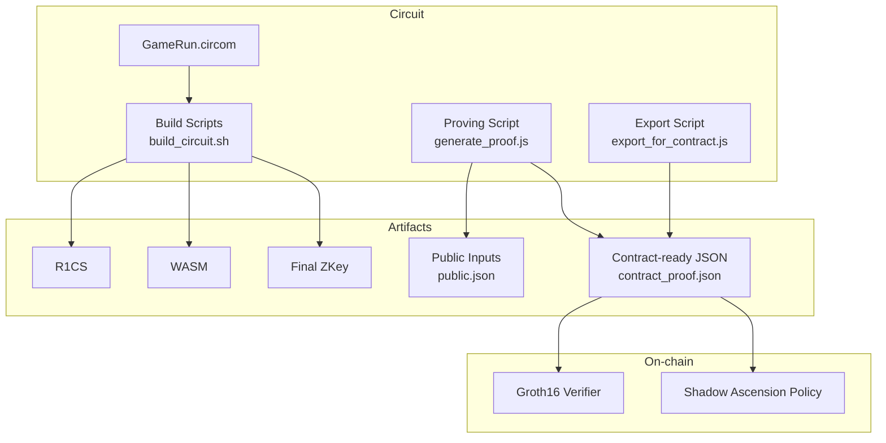
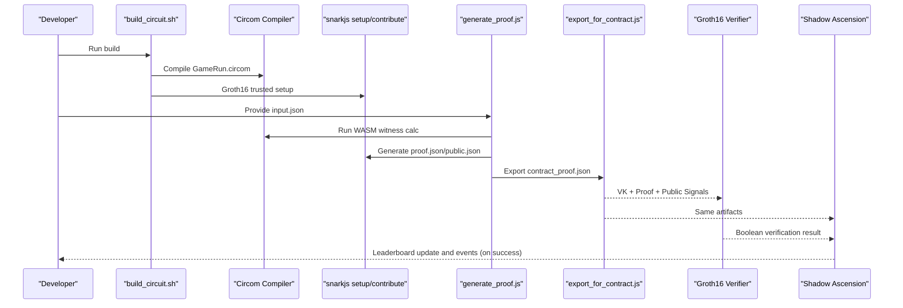
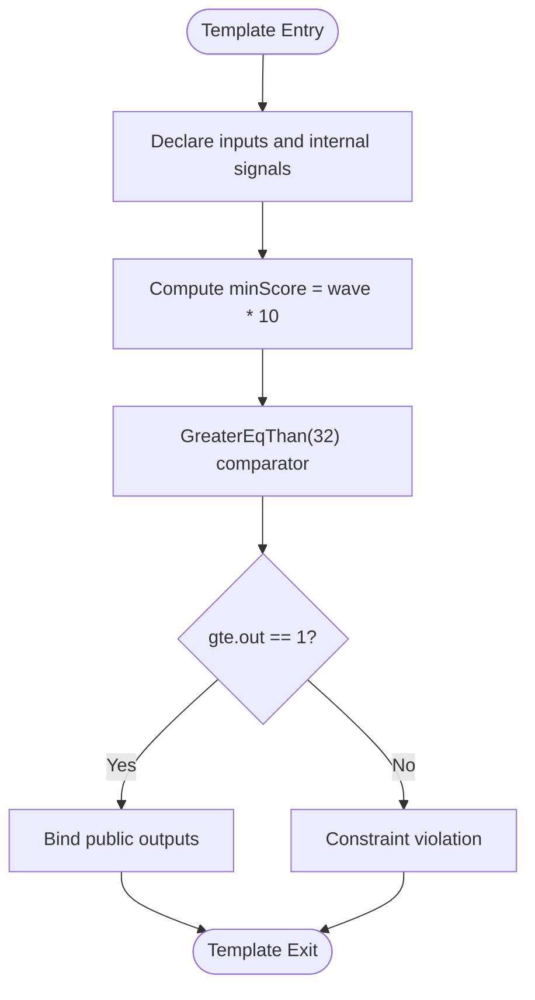
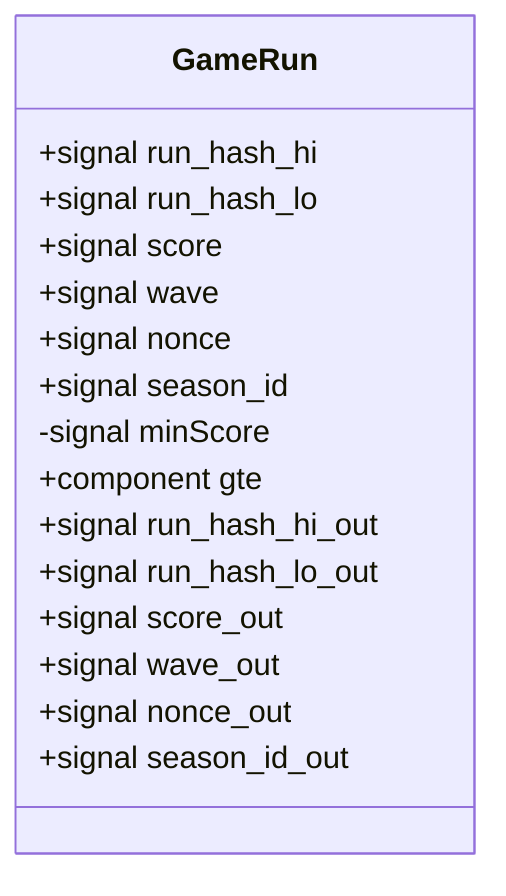
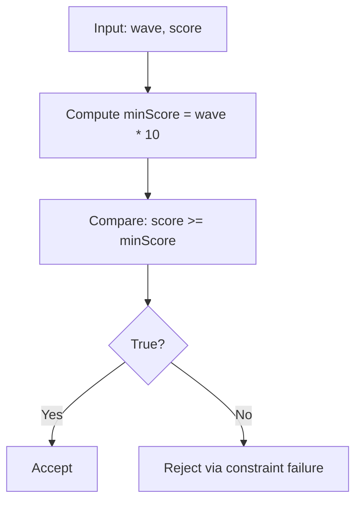
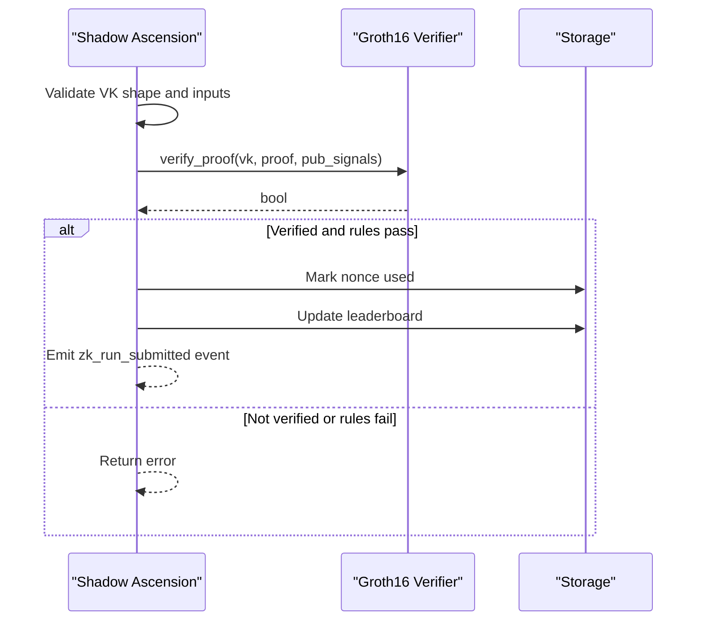
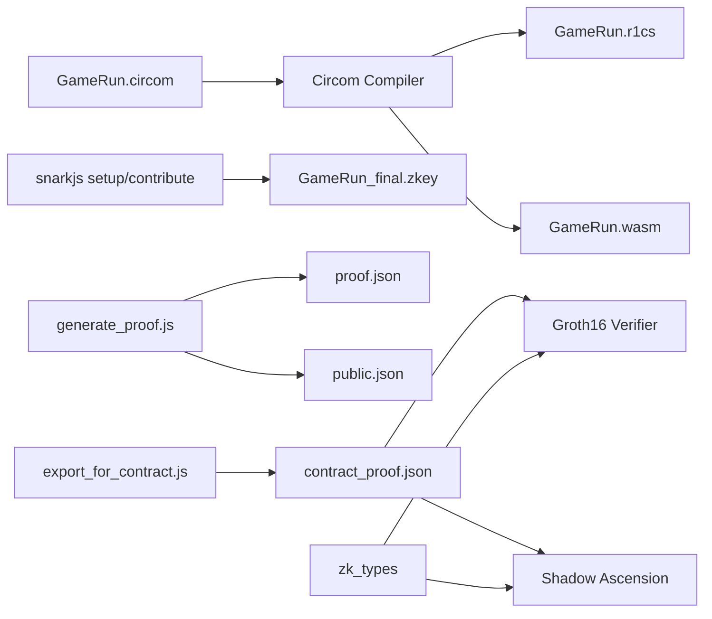

# Circuit Design and Implementation

<cite>
**Referenced Files in This Document**
- [GameRun.circom](file://circuits/GameRun.circom)
- [input.json](file://circuits/input.json)
- [input.json.example](file://circuits/input.json.example)
- [build_circuit.sh](file://scripts/zk/build_circuit.sh)
- [generate_proof.js](file://scripts/zk/generate_proof.js)
- [export_for_contract.js](file://scripts/zk/export_for_contract.js)
- [shadow_ascension/lib.rs](file://contracts/shadow_ascension/src/lib.rs)
- [shadow_ascension/tests.rs](file://contracts/shadow_ascension/src/tests.rs)
- [groth16_verifier/lib.rs](file://contracts/groth16_verifier/src/lib.rs)
- [zk_types/lib.rs](file://contracts/zk_types/src/lib.rs)
- [gameProof.js](file://src/zk/gameProof.js)
- [zkProve.js](file://server/zkProve.js)
- [GameRun.sym](file://circuits/build/GameRun.sym)
- [witness_calculator.js](file://circuits/build/GameRun_js/witness_calculator.js)
</cite>

## Table of Contents
1. [Introduction](#introduction)
2. [Project Structure](#project-structure)
3. [Core Components](#core-components)
4. [Architecture Overview](#architecture-overview)
5. [Detailed Component Analysis](#detailed-component-analysis)
6. [Dependency Analysis](#dependency-analysis)
7. [Performance Considerations](#performance-considerations)
8. [Troubleshooting Guide](#troubleshooting-guide)
9. [Conclusion](#conclusion)
10. [Appendices](#appendices)

## Introduction
This document explains the GameRun circuit design and implementation used for ZK-ranked run submission in the Shadow Ascension game. It covers the circuit template structure, input/output signals, mathematical constraints, template parameters, bit-width considerations, and integration with the on-chain verifier and policy contracts. It also documents constraint enforcement for score validation, signal declarations, component instantiation, output binding, and practical examples for modifying and extending the circuit.

## Project Structure
The GameRun circuit resides under circuits and is compiled into R1CS and WASM artifacts. Proving and exporting are orchestrated by shell and Node.js scripts. The on-chain policy and verifier live in the contracts directory, while client-side helpers and server-side proof generation are in src and server respectively.

**Diagram sources**
- [GameRun.circom](file://circuits/GameRun.circom#L1-L34)
- [build_circuit.sh](file://scripts/zk/build_circuit.sh#L30-L51)
- [generate_proof.js](file://scripts/zk/generate_proof.js#L36-L45)
- [export_for_contract.js](file://scripts/zk/export_for_contract.js#L65-L86)
- [groth16_verifier/lib.rs](file://contracts/groth16_verifier/src/lib.rs#L23-L56)
- [shadow_ascension/lib.rs](file://contracts/shadow_ascension/src/lib.rs#L159-L264)

**Section sources**
- [GameRun.circom](file://circuits/GameRun.circom#L1-L34)
- [build_circuit.sh](file://scripts/zk/build_circuit.sh#L1-L57)
- [generate_proof.js](file://scripts/zk/generate_proof.js#L1-L46)
- [export_for_contract.js](file://scripts/zk/export_for_contract.js#L1-L95)

## Core Components
- GameRun circuit template: declares inputs, enforces score vs wave constraint, and exposes public outputs.
- Input specification: defines run_hash (split into hi/lo), score, wave, nonce, and season_id.
- Constraint enforcement: score >= wave * MIN_SCORE_PER_WAVE (with MIN_SCORE_PER_WAVE = 10).
- Public outputs: run_hash_hi, run_hash_lo, score, wave, nonce, season_id.
- Bit-width and field considerations: BN254 field elements (Fr = 32 bytes), G1 = 64 bytes, G2 = 128 bytes.

**Section sources**
- [GameRun.circom](file://circuits/GameRun.circom#L8-L31)
- [input.json](file://circuits/input.json#L1-L9)
- [input.json.example](file://circuits/input.json.example#L1-L9)
- [GameRun.sym](file://circuits/build/GameRun.sym#L1-L6)

## Architecture Overview
The end-to-end flow integrates circuit compilation, trusted setup, witness calculation, proof generation, and on-chain verification.

**Diagram sources**
- [build_circuit.sh](file://scripts/zk/build_circuit.sh#L30-L51)
- [generate_proof.js](file://scripts/zk/generate_proof.js#L36-L45)
- [export_for_contract.js](file://scripts/zk/export_for_contract.js#L65-L86)
- [groth16_verifier/lib.rs](file://contracts/groth16_verifier/src/lib.rs#L23-L56)
- [shadow_ascension/lib.rs](file://contracts/shadow_ascension/src/lib.rs#L159-L264)

## Detailed Component Analysis

### GameRun Circuit Template
The GameRun template defines the following:
- Inputs:
  - run_hash_hi: high 128 bits of run_hash
  - run_hash_lo: low 128 bits of run_hash
  - score: u32
  - wave: u32
  - nonce: u64
  - season_id: u32
- Constraint:
  - Enforces score >= wave * MIN_SCORE_PER_WAVE (MIN_SCORE_PER_WAVE = 10)
- Outputs:
  - run_hash_hi_out, run_hash_lo_out, score_out, wave_out, nonce_out, season_id_out

**Diagram sources**
- [GameRun.circom](file://circuits/GameRun.circom#L8-L31)

**Section sources**
- [GameRun.circom](file://circuits/GameRun.circom#L8-L31)

### Signal Declarations and Output Binding
- Inputs are declared as signals with explicit comments indicating bit-widths and roles.
- Internal signal minScore computes wave scaled by MIN_SCORE_PER_WAVE.
- Comparator GreaterEqThan(32) ensures score meets the minimum requirement.
- Public outputs are bound to original inputs to expose run_hash parts, score, wave, nonce, and season_id.

**Diagram sources**
- [GameRun.circom](file://circuits/GameRun.circom#L8-L31)

**Section sources**
- [GameRun.circom](file://circuits/GameRun.circom#L8-L31)

### Constraint Implementation for Score Validation
- The constraint score >= wave * MIN_SCORE_PER_WAVE is enforced using a 32-bit comparator.
- The circuit does not enforce positivity of wave; the policy contract enforces wave > 0.

**Diagram sources**
- [GameRun.circom](file://circuits/GameRun.circom#L16-L22)

**Section sources**
- [GameRun.circom](file://circuits/GameRun.circom#L16-L22)

### Circuit Parameter Specifications and Bit-Width Considerations
- Field: BN254 (Fr = 32 bytes)
- Group sizes: G1 = 64 bytes, G2 = 128 bytes
- Public inputs exported as 32-byte big-endian field elements
- Circuit uses 32-bit comparator; inputs are treated as 32-bit unsigned integers

**Section sources**
- [export_for_contract.js](file://scripts/zk/export_for_contract.js#L22-L36)
- [zk_types/lib.rs](file://contracts/zk_types/src/lib.rs#L9-L14)
- [GameRun.circom](file://circuits/GameRun.circom#L11-L14)

### Input Validation Rules
- The policy contract validates:
  - Non-zero score and wave (wave > 0 enforced)
  - Progression rule: score >= wave * MIN_SCORE_PER_WAVE
  - Anti-replay: (player, nonce, season_id) must be unique
  - Verification key shape: ic length equals public signals count plus one
- The circuit enforces the progression rule; the policy enforces non-zero and anti-replay checks.

**Section sources**
- [shadow_ascension/lib.rs](file://contracts/shadow_ascension/src/lib.rs#L178-L220)
- [GameRun.circom](file://circuits/GameRun.circom#L16-L22)

### On-chain Verification and Policy Integration
- Groth16 Verifier performs BN254 pairing check against VK, proof, and public signals.
- Shadow Ascension policy:
  - Verifies VK shape and calls verifier
  - Applies additional business rules (non-zero inputs, progression, anti-replay)
  - Updates per-season leaderboard and emits an event on success

**Diagram sources**
- [shadow_ascension/lib.rs](file://contracts/shadow_ascension/src/lib.rs#L159-L264)
- [groth16_verifier/lib.rs](file://contracts/groth16_verifier/src/lib.rs#L23-L56)

**Section sources**
- [shadow_ascension/lib.rs](file://contracts/shadow_ascension/src/lib.rs#L159-L264)
- [groth16_verifier/lib.rs](file://contracts/groth16_verifier/src/lib.rs#L23-L56)

### Client-Side and Server-Side Integration
- Client-side helper validates wave/score rules and generates run seeds.
- Server-side zkProve orchestrates building inputs, invoking the proving script, and returning contract-ready artifacts.

**Section sources**
- [gameProof.js](file://src/zk/gameProof.js#L44-L77)
- [zkProve.js](file://server/zkProve.js#L46-L67)

## Dependency Analysis
The GameRun circuit depends on circomlib comparators. The build pipeline produces R1CS/WASM and trusted setup artifacts. The export script converts artifacts to on-chain compatible formats. The policy and verifier depend on shared zk_types.

**Diagram sources**
- [GameRun.circom](file://circuits/GameRun.circom#L6)
- [build_circuit.sh](file://scripts/zk/build_circuit.sh#L30-L51)
- [generate_proof.js](file://scripts/zk/generate_proof.js#L36-L45)
- [export_for_contract.js](file://scripts/zk/export_for_contract.js#L65-L86)
- [zk_types/lib.rs](file://contracts/zk_types/src/lib.rs#L27-L43)

**Section sources**
- [GameRun.circom](file://circuits/GameRun.circom#L6)
- [build_circuit.sh](file://scripts/zk/build_circuit.sh#L30-L51)
- [export_for_contract.js](file://scripts/zk/export_for_contract.js#L65-L86)
- [zk_types/lib.rs](file://contracts/zk_types/src/lib.rs#L27-L43)

## Performance Considerations
- Circuit size: The GameRun circuit is small, using a single comparator and minimal auxiliary signals, resulting in compact R1CS and fast witness computation.
- Witness calculation: The WASM calculator writes normalized field elements to shared memory; ensure input sizes match signal expectations to avoid runtime errors.
- Trusted setup: Powers of tau and Groth16 setup are required; the build script handles fallbacks for missing artifacts.
- On-chain verification: Pairing checks are efficient; ensure VK shape and public signals lengths are correct to prevent reverts.

[No sources needed since this section provides general guidance]

## Troubleshooting Guide
Common issues and resolutions:
- Missing build artifacts: Ensure the circuit is compiled and trusted setup is performed before generating proofs.
- Incorrect input.json: Provide all required fields with correct types and sizes.
- Malformed VK: Verify ic length equals public signals count plus one.
- Zero inputs: The policy rejects zero score or wave; ensure both are positive.
- Anti-replay: Using the same (player, nonce, season_id) twice will fail.
- Constraint violation: If score < wave * MIN_SCORE_PER_WAVE, the circuit constraint fails.

**Section sources**
- [build_circuit.sh](file://scripts/zk/build_circuit.sh#L23-L26)
- [generate_proof.js](file://scripts/zk/generate_proof.js#L27-L30)
- [shadow_ascension/lib.rs](file://contracts/shadow_ascension/src/lib.rs#L178-L220)
- [shadow_ascension/tests.rs](file://contracts/shadow_ascension/src/tests.rs#L193-L254)

## Conclusion
The GameRun circuit enforces a simple yet critical progression rule—score versus wave—via a 32-bit comparator. Combined with on-chain verification and policy-level checks (non-zero inputs, anti-replay), it provides a robust foundation for ranked run submissions. The modular build, export, and verification pipeline enables straightforward extension and deployment.

[No sources needed since this section summarizes without analyzing specific files]

## Appendices

### Appendix A: Input Specification
- run_hash_hi: 128-bit high part of run hash
- run_hash_lo: 128-bit low part of run hash
- score: u32
- wave: u32
- nonce: u64
- season_id: u32

Example input files:
- [input.json](file://circuits/input.json#L1-L9)
- [input.json.example](file://circuits/input.json.example#L1-L9)

**Section sources**
- [input.json](file://circuits/input.json#L1-L9)
- [input.json.example](file://circuits/input.json.example#L1-L9)

### Appendix B: Public Signals and Sym Table
- Public outputs exposed by the circuit: run_hash_hi, run_hash_lo, score, wave, nonce, season_id
- The sym table enumerates these outputs and internal signals

**Section sources**
- [GameRun.sym](file://circuits/build/GameRun.sym#L1-L6)

### Appendix C: Witness Calculator Behavior
- The witness calculator validates input signal counts and throws errors for mismatches
- Ensures proper normalization and memory writes for field elements

**Section sources**
- [witness_calculator.js](file://circuits/build/GameRun_js/witness_calculator.js#L131-L168)

### Appendix D: Example Modification and Extension Patterns
- Add a new parameter:
  - Extend the template with a new input signal
  - Introduce a new constraint or comparator as needed
  - Update public outputs to include the new parameter
  - Update input.json and server-side builders to supply the new value
- Change the progression rule:
  - Adjust MIN_SCORE_PER_WAVE in both the circuit and policy for consistency
  - Rebuild and regenerate proof artifacts
- Add anti-replay fields:
  - Include additional fields in both the circuit’s public outputs and the policy’s replay key
  - Update VK shape expectations accordingly

[No sources needed since this section provides general guidance]