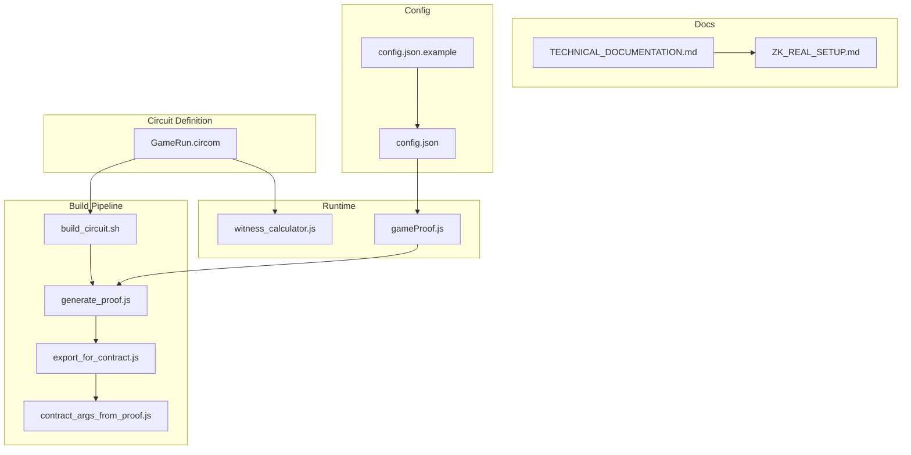
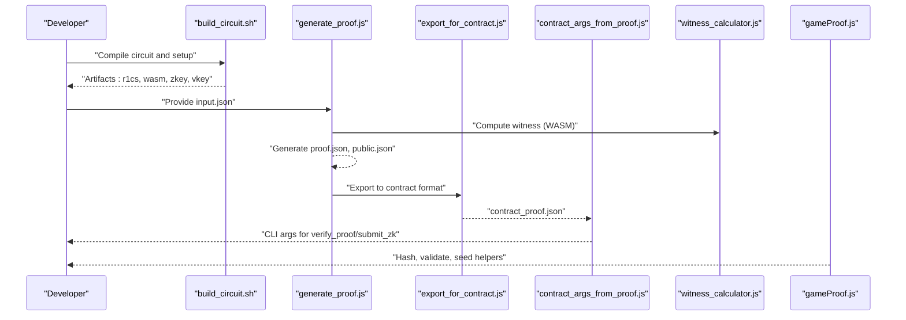
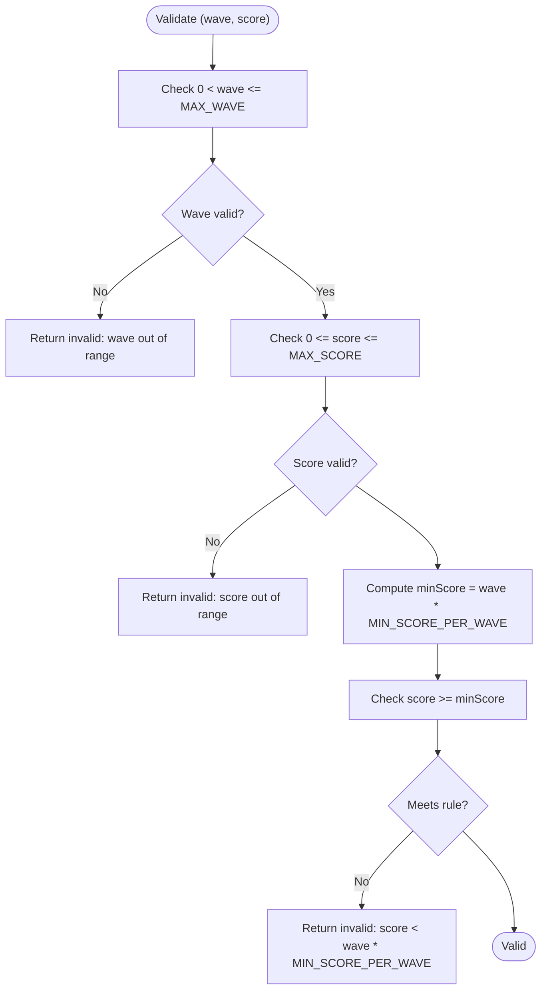
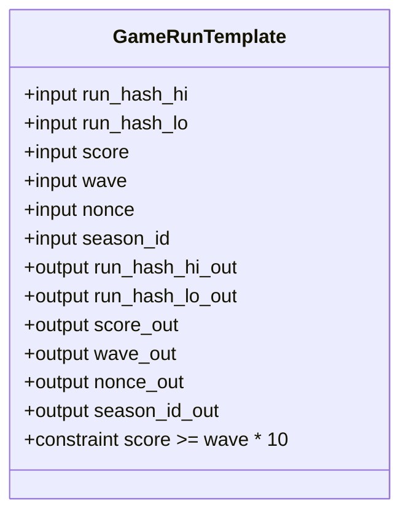
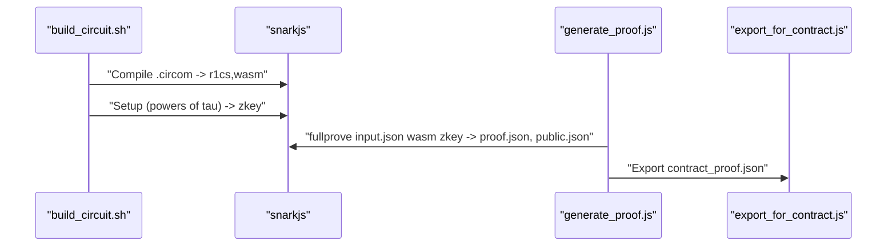
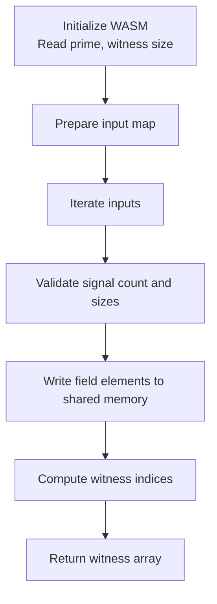
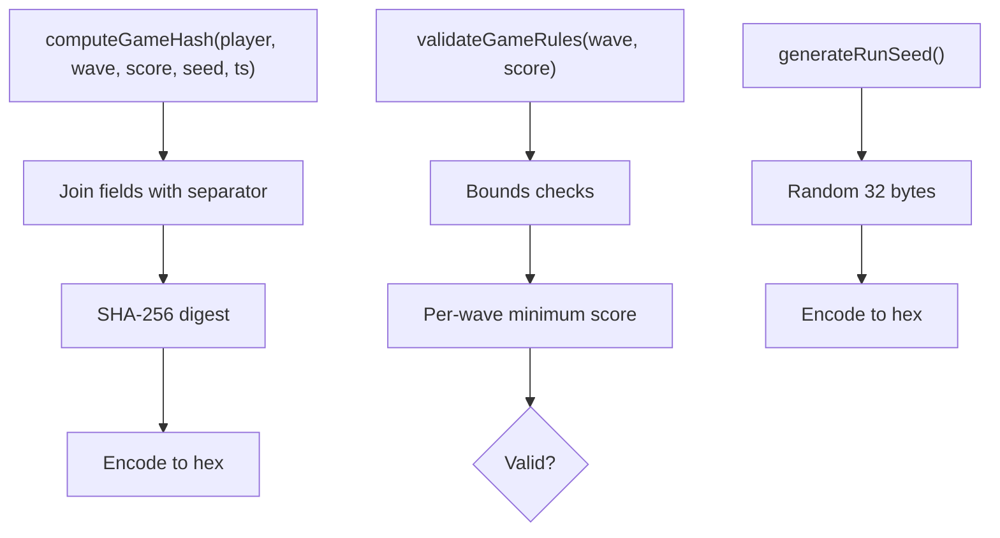
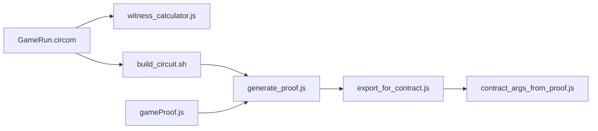

# Circuit Parameters and Configuration

<cite>
**Referenced Files in This Document**
- [GameRun.circom](file://circuits/GameRun.circom)
- [input.json](file://circuits/input.json)
- [input.json.example](file://circuits/input.json.example)
- [build_circuit.sh](file://scripts/zk/build_circuit.sh)
- [generate_proof.js](file://scripts/zk/generate_proof.js)
- [export_for_contract.js](file://scripts/zk/export_for_contract.js)
- [contract_args_from_proof.js](file://scripts/zk/contract_args_from_proof.js)
- [witness_calculator.js](file://circuits/build/GameRun_js/witness_calculator.js)
- [TECHNICAL_DOCUMENTATION.md](file://docs/TECHNICAL_DOCUMENTATION.md)
- [ZK_REAL_SETUP.md](file://docs/ZK_REAL_SETUP.md)
- [gameProof.js](file://src/zk/gameProof.js)
- [config.json](file://dist/config.json)
- [config.json.example](file://dist/config.json.example)
</cite>

## Table of Contents
1. [Introduction](#introduction)
2. [Project Structure](#project-structure)
3. [Core Components](#core-components)
4. [Architecture Overview](#architecture-overview)
5. [Detailed Component Analysis](#detailed-component-analysis)
6. [Dependency Analysis](#dependency-analysis)
7. [Performance Considerations](#performance-considerations)
8. [Troubleshooting Guide](#troubleshooting-guide)
9. [Conclusion](#conclusion)
10. [Appendices](#appendices)

## Introduction
This document explains the circuit parameter configuration and input specification system used to generate and verify Groth16 proofs for the ranked mode of the game. It covers:
- The input.json format and parameter validation
- Circuit public inputs and constraints
- Trusted setup and proof generation pipeline
- Witness calculator integration and JavaScript wrappers
- Runtime parameter handling and environment configuration
- Circuit size limits, security parameters, and performance tuning
- Example configurations, parameter ranges, and validation rules
- Guidelines for optimization, security, and cross-environment compatibility

## Project Structure
The ZK system spans several directories and scripts:
- circuits: source circuit, example input, and build artifacts
- scripts/zk: build, proof generation, and export scripts
- src/zk: client-side helpers for hashing and validation
- docs: technical and setup documentation
- dist: frontend configuration (environment variables)

**Diagram sources**
- [GameRun.circom](file://circuits/GameRun.circom#L1-L34)
- [build_circuit.sh](file://scripts/zk/build_circuit.sh#L1-L57)
- [generate_proof.js](file://scripts/zk/generate_proof.js#L1-L46)
- [export_for_contract.js](file://scripts/zk/export_for_contract.js#L1-L95)
- [contract_args_from_proof.js](file://scripts/zk/contract_args_from_proof.js#L1-L46)
- [witness_calculator.js](file://circuits/build/GameRun_js/witness_calculator.js#L1-L200)
- [TECHNICAL_DOCUMENTATION.md](file://docs/TECHNICAL_DOCUMENTATION.md#L1-L334)
- [ZK_REAL_SETUP.md](file://docs/ZK_REAL_SETUP.md#L1-L192)
- [config.json](file://dist/config.json#L1-L7)
- [config.json.example](file://dist/config.json.example#L1-L6)

**Section sources**
- [GameRun.circom](file://circuits/GameRun.circom#L1-L34)
- [build_circuit.sh](file://scripts/zk/build_circuit.sh#L1-L57)
- [generate_proof.js](file://scripts/zk/generate_proof.js#L1-L46)
- [export_for_contract.js](file://scripts/zk/export_for_contract.js#L1-L95)
- [contract_args_from_proof.js](file://scripts/zk/contract_args_from_proof.js#L1-L46)
- [witness_calculator.js](file://circuits/build/GameRun_js/witness_calculator.js#L1-L200)
- [TECHNICAL_DOCUMENTATION.md](file://docs/TECHNICAL_DOCUMENTATION.md#L1-L334)
- [ZK_REAL_SETUP.md](file://docs/ZK_REAL_SETUP.md#L1-L192)
- [config.json](file://dist/config.json#L1-L7)
- [config.json.example](file://dist/config.json.example#L1-L6)

## Core Components
- Circuit definition: GameRun.circom declares six public inputs and a constraint ensuring score meets a minimum per-wave threshold.
- Input specification: input.json defines the public inputs consumed by the circuit and used to generate the proof.
- Build pipeline: build_circuit.sh compiles the circuit and performs Groth16 trusted setup; generate_proof.js runs the prover; export_for_contract.js converts outputs to contract-ready format.
- Witness calculator: the WASM witness calculator validates and computes the witness for the circuit given the input map.
- Client helpers: gameProof.js provides hashing, validation, and seed generation used by the frontend and backend.
- Environment configuration: config.json and config.json.example define frontend URLs and contract IDs.

**Section sources**
- [GameRun.circom](file://circuits/GameRun.circom#L8-L31)
- [input.json](file://circuits/input.json#L1-L9)
- [input.json.example](file://circuits/input.json.example#L1-L9)
- [build_circuit.sh](file://scripts/zk/build_circuit.sh#L30-L51)
- [generate_proof.js](file://scripts/zk/generate_proof.js#L32-L45)
- [export_for_contract.js](file://scripts/zk/export_for_contract.js#L65-L86)
- [witness_calculator.js](file://circuits/build/GameRun_js/witness_calculator.js#L131-L191)
- [gameProof.js](file://src/zk/gameProof.js#L29-L77)
- [config.json](file://dist/config.json#L1-L7)
- [config.json.example](file://dist/config.json.example#L1-L6)

## Architecture Overview
The ZK workflow integrates the circuit, prover, and contracts:

**Diagram sources**
- [build_circuit.sh](file://scripts/zk/build_circuit.sh#L30-L51)
- [generate_proof.js](file://scripts/zk/generate_proof.js#L32-L45)
- [export_for_contract.js](file://scripts/zk/export_for_contract.js#L65-L86)
- [contract_args_from_proof.js](file://scripts/zk/contract_args_from_proof.js#L16-L45)
- [witness_calculator.js](file://circuits/build/GameRun_js/witness_calculator.js#L176-L191)
- [gameProof.js](file://src/zk/gameProof.js#L29-L77)

## Detailed Component Analysis

### Input Specification and Parameter Validation
- Public inputs and types:
  - run_hash_hi: high 128 bits of run commitment (u32)
  - run_hash_lo: low 128 bits of run commitment (u32)
  - score: final score (u32)
  - wave: final wave (u32)
  - nonce: replay token (u64)
  - season_id: season identifier (u32)
- Constraint enforced by the circuit: score >= wave * MIN_SCORE_PER_WAVE (default 10 per wave).
- Client-side validation rules:
  - wave must be greater than 0 and within a maximum bound
  - score must be non-negative and below a maximum bound
  - Additional rule: score must meet the per-wave minimum enforced by the circuit

**Diagram sources**
- [gameProof.js](file://src/zk/gameProof.js#L51-L63)
- [GameRun.circom](file://circuits/GameRun.circom#L16-L22)

**Section sources**
- [input.json](file://circuits/input.json#L1-L9)
- [input.json.example](file://circuits/input.json.example#L1-L9)
- [gameProof.js](file://src/zk/gameProof.js#L15-L63)
- [GameRun.circom](file://circuits/GameRun.circom#L16-L22)

### Circuit Definition and Public Inputs
- The circuit template declares six input signals and exposes them as public outputs.
- The constraint enforces the minimum score per wave using a comparator component.
- Public input ordering and sizes are defined for serialization and verification.

**Diagram sources**
- [GameRun.circom](file://circuits/GameRun.circom#L8-L31)

**Section sources**
- [GameRun.circom](file://circuits/GameRun.circom#L8-L31)

### Trusted Setup and Proof Generation
- The build script compiles the circuit to R1CS and WASM, then performs Groth16 setup using Powers of Tau and a contribution step.
- The proof generation script copies input.json into the build directory, runs the prover, and exports a contract-ready artifact.
- The export script converts proof and verification key into the byte layout expected by the verifier contract.

**Diagram sources**
- [build_circuit.sh](file://scripts/zk/build_circuit.sh#L30-L51)
- [generate_proof.js](file://scripts/zk/generate_proof.js#L32-L45)
- [export_for_contract.js](file://scripts/zk/export_for_contract.js#L65-L86)

**Section sources**
- [build_circuit.sh](file://scripts/zk/build_circuit.sh#L30-L51)
- [generate_proof.js](file://scripts/zk/generate_proof.js#L32-L45)
- [export_for_contract.js](file://scripts/zk/export_for_contract.js#L65-L86)

### Witness Calculator Integration
- The witness calculator initializes the WASM module, reads prime and witness size, and validates input signal counts and sizes.
- It writes normalized field elements into shared memory and computes the witness, returning either big-endian buffers or BigInt values.

**Diagram sources**
- [witness_calculator.js](file://circuits/build/GameRun_js/witness_calculator.js#L108-L191)

**Section sources**
- [witness_calculator.js](file://circuits/build/GameRun_js/witness_calculator.js#L108-L191)

### JavaScript Wrapper Functionality
- computeGameHash: constructs a run hash from player, wave, score, seed, and timestamp using SHA-256.
- validateGameRules: enforces wave and score bounds and the per-wave minimum score rule.
- generateRunSeed: creates a random 32-byte seed for run binding.

**Diagram sources**
- [gameProof.js](file://src/zk/gameProof.js#L29-L77)

**Section sources**
- [gameProof.js](file://src/zk/gameProof.js#L29-L77)

### Runtime Parameter Handling and Environment Configuration
- Frontend environment variables define API endpoints and contract IDs used by the client.
- The example configuration shows how to override defaults for local or remote deployments.

**Section sources**
- [config.json](file://dist/config.json#L1-L7)
- [config.json.example](file://dist/config.json.example#L1-L6)

## Dependency Analysis
- Circuit depends on circomlib comparators for inequality constraints.
- Build pipeline depends on circom, snarkjs, and a valid Powers of Tau file.
- Proof generation depends on a compiled WASM witness calculator and a finalized trusted setup key.
- Contract arguments depend on the exported proof and verification key.

**Diagram sources**
- [GameRun.circom](file://circuits/GameRun.circom#L6-L22)
- [build_circuit.sh](file://scripts/zk/build_circuit.sh#L30-L51)
- [generate_proof.js](file://scripts/zk/generate_proof.js#L32-L45)
- [export_for_contract.js](file://scripts/zk/export_for_contract.js#L65-L86)
- [contract_args_from_proof.js](file://scripts/zk/contract_args_from_proof.js#L16-L45)
- [witness_calculator.js](file://circuits/build/GameRun_js/witness_calculator.js#L108-L191)
- [gameProof.js](file://src/zk/gameProof.js#L29-L77)

**Section sources**
- [GameRun.circom](file://circuits/GameRun.circom#L6-L22)
- [build_circuit.sh](file://scripts/zk/build_circuit.sh#L30-L51)
- [generate_proof.js](file://scripts/zk/generate_proof.js#L32-L45)
- [export_for_contract.js](file://scripts/zk/export_for_contract.js#L65-L86)
- [contract_args_from_proof.js](file://scripts/zk/contract_args_from_proof.js#L16-L45)
- [witness_calculator.js](file://circuits/build/GameRun_js/witness_calculator.js#L108-L191)
- [gameProof.js](file://src/zk/gameProof.js#L29-L77)

## Performance Considerations
- Trusted setup: Powers of Tau and circuit-specific contribution dominate initial setup cost. Use a pre-generated .ptau for demos; prefer multi-party ceremonies for production.
- Proof generation: Depends on WASM execution and Groth16 computations. Keep input sizes minimal and avoid unnecessary public inputs.
- Serialization: Contract-ready export uses fixed-size byte layouts for G1/G2/Fr. Ensure correct endianness and lengths to prevent verification failures.
- Simulation: Use the Stellar CLI to simulate transactions and estimate CPU/memory before deployment.

[No sources needed since this section provides general guidance]

## Troubleshooting Guide
Common issues and resolutions:
- Missing or invalid input.json: ensure the file exists and matches the expected structure.
- Build prerequisites: verify circom 2.x and snarkjs are installed and accessible.
- Powers of Tau: if the file is missing or too small, regenerate it locally.
- Proof export: confirm export_for_contract produced contract_proof.json with correct byte lengths.
- Contract arguments: use contract_args_from_proof.js to generate CLI-ready arguments.
- Witness calculation: the witness calculator throws explicit errors for missing signals, size mismatches, and assertion failures.

**Section sources**
- [generate_proof.js](file://scripts/zk/generate_proof.js#L23-L30)
- [build_circuit.sh](file://scripts/zk/build_circuit.sh#L33-L46)
- [export_for_contract.js](file://scripts/zk/export_for_contract.js#L38-L63)
- [contract_args_from_proof.js](file://scripts/zk/contract_args_from_proof.js#L11-L14)
- [witness_calculator.js](file://circuits/build/GameRun_js/witness_calculator.js#L21-L42)

## Conclusion
The circuit parameter configuration and input specification system centers on a six-public-input design that binds run outcomes and enforces a per-wave scoring rule. The build and proof generation pipeline, combined with a robust export and argument construction process, enables reliable on-chain verification. Client-side helpers ensure consistent hashing and validation, while environment configuration supports flexible deployment across local and hosted environments.

[No sources needed since this section summarizes without analyzing specific files]

## Appendices

### A. Input.json Format Reference
- Keys: run_hash_hi, run_hash_lo, score, wave, nonce, season_id
- Types: integers represented as strings
- Constraints: enforced by the circuit and client-side validation

**Section sources**
- [input.json](file://circuits/input.json#L1-L9)
- [input.json.example](file://circuits/input.json.example#L1-L9)
- [GameRun.circom](file://circuits/GameRun.circom#L16-L22)
- [gameProof.js](file://src/zk/gameProof.js#L51-L63)

### B. Parameter Ranges and Validation Rules
- wave: 0 < wave <= MAX_WAVE
- score: 0 <= score <= MAX_SCORE
- score >= wave * MIN_SCORE_PER_WAVE enforced by circuit
- nonce: u64; must be unique per (player, season_id)
- season_id: u32; included to scope replay and leaderboards

**Section sources**
- [gameProof.js](file://src/zk/gameProof.js#L15-L17)
- [gameProof.js](file://src/zk/gameProof.js#L51-L63)
- [GameRun.circom](file://circuits/GameRun.circom#L16-L22)

### C. Example Input Configuration
- Use input.json.example as a template and adjust values accordingly.

**Section sources**
- [input.json.example](file://circuits/input.json.example#L1-L9)

### D. Compatibility and Security Notes
- Curve choice: BN254 (alt_bn128) aligns with the verifier and SDK expectations.
- Byte order: G1/Fr big-endian; G2 x0||x1||y0||y1; export_for_contract.js ensures correct layout.
- Replay protection: nonce plus season_id scopes submissions; verifier rejects malformed VK shapes.

**Section sources**
- [TECHNICAL_DOCUMENTATION.md](file://docs/TECHNICAL_DOCUMENTATION.md#L108-L116)
- [export_for_contract.js](file://scripts/zk/export_for_contract.js#L23-L36)
- [TECHNICAL_DOCUMENTATION.md](file://docs/TECHNICAL_DOCUMENTATION.md#L318-L330)