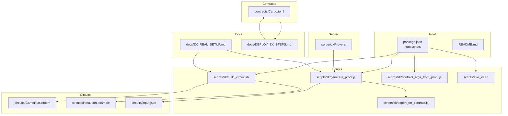
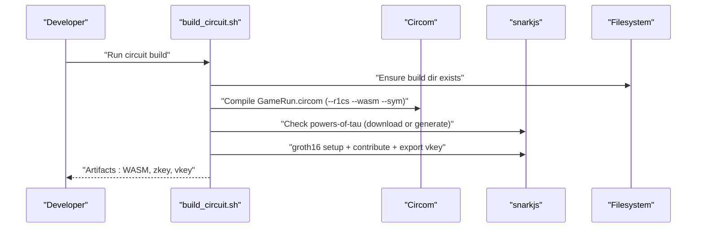
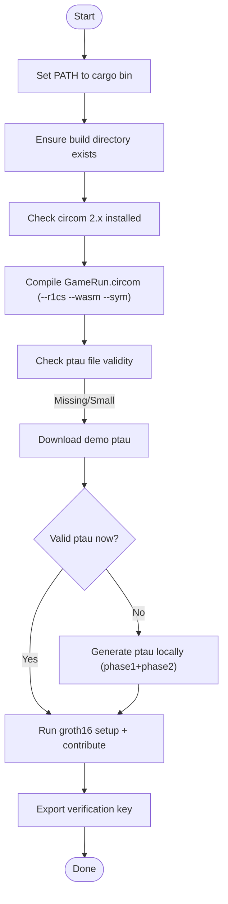
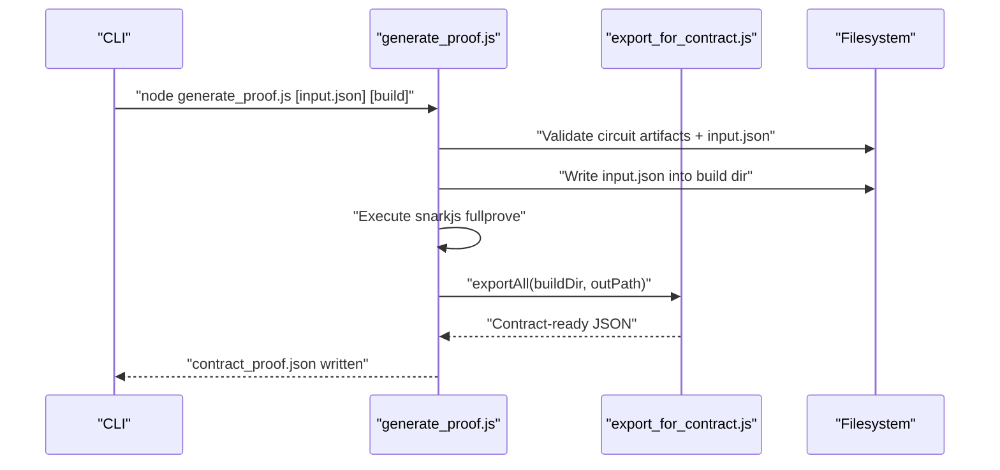
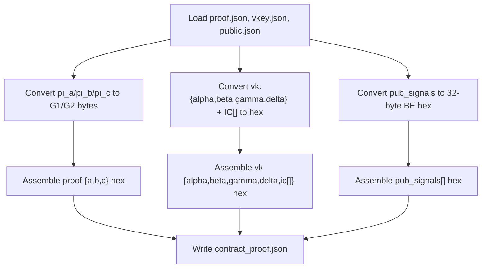
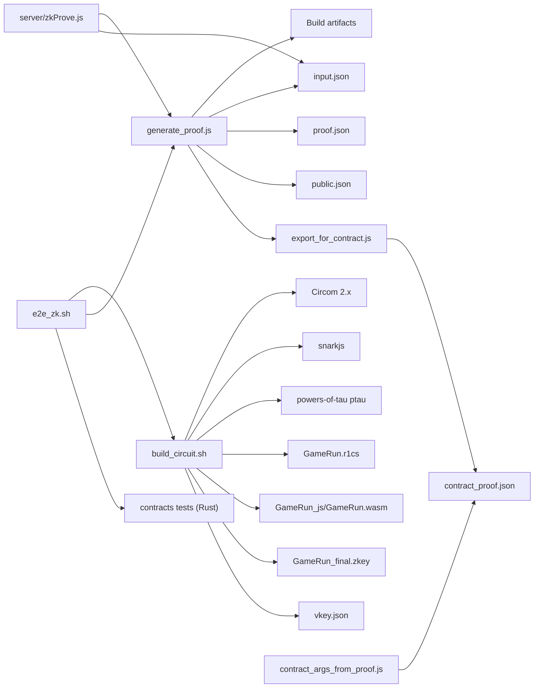

# Build Script Automation

<cite>
**Referenced Files in This Document**
- [build_circuit.sh](file://scripts/zk/build_circuit.sh)
- [generate_proof.js](file://scripts/zk/generate_proof.js)
- [export_for_contract.js](file://scripts/zk/export_for_contract.js)
- [contract_args_from_proof.js](file://scripts/zk/contract_args_from_proof.js)
- [e2e_zk.sh](file://scripts/e2e_zk.sh)
- [GameRun.circom](file://circuits/GameRun.circom)
- [input.json.example](file://circuits/input.json.example)
- [input.json](file://circuits/input.json)
- [zkProve.js](file://server/zkProve.js)
- [package.json](file://package.json)
- [Cargo.toml](file://contracts/Cargo.toml)
- [DEPLOY_ZK_STEPS.md](file://docs/DEPLOY_ZK_STEPS.md)
- [ZK_REAL_SETUP.md](file://docs/ZK_REAL_SETUP.md)
- [deploy.yml](file://.github/workflows/deploy.yml)
- [README.md](file://README.md)
</cite>

## Table of Contents
1. [Introduction](#introduction)
2. [Project Structure](#project-structure)
3. [Core Components](#core-components)
4. [Architecture Overview](#architecture-overview)
5. [Detailed Component Analysis](#detailed-component-analysis)
6. [Dependency Analysis](#dependency-analysis)
7. [Performance Considerations](#performance-considerations)
8. [Troubleshooting Guide](#troubleshooting-guide)
9. [Conclusion](#conclusion)
10. [Appendices](#appendices)

## Introduction
This document explains the complete ZK build script automation system used to compile Circom circuits, perform Groth16 trusted setup, generate real proofs, and export artifacts ready for on-chain verification. It covers the bash script architecture, environment variable handling, dependency management, automated workflow from circuit compilation through key generation, error handling and validation checks, PATH configuration for cargo-installed tools, working directory management, output artifact verification, customization options, environment setup requirements, and CI/CD integration. It also includes troubleshooting guidance and debugging techniques for common automation issues.

## Project Structure
The ZK automation spans shell scripts, Node.js utilities, Rust contracts, and documentation. The primary build pipeline is orchestrated from the repository root with scripts under scripts/zk/, circuit sources under circuits/, and contract code under contracts/.

**Diagram sources**
- [package.json](file://package.json#L18-L21)
- [build_circuit.sh](file://scripts/zk/build_circuit.sh#L1-L57)
- [generate_proof.js](file://scripts/zk/generate_proof.js#L1-L46)
- [export_for_contract.js](file://scripts/zk/export_for_contract.js#L1-L95)
- [contract_args_from_proof.js](file://scripts/zk/contract_args_from_proof.js#L1-L46)
- [e2e_zk.sh](file://scripts/e2e_zk.sh#L1-L22)
- [GameRun.circom](file://circuits/GameRun.circom#L1-L34)
- [input.json.example](file://circuits/input.json.example#L1-L9)
- [input.json](file://circuits/input.json#L1-L9)
- [zkProve.js](file://server/zkProve.js#L1-L68)
- [Cargo.toml](file://contracts/Cargo.toml#L1-L4)
- [ZK_REAL_SETUP.md](file://docs/ZK_REAL_SETUP.md#L1-L192)
- [DEPLOY_ZK_STEPS.md](file://docs/DEPLOY_ZK_STEPS.md#L1-L90)

**Section sources**
- [package.json](file://package.json#L18-L21)
- [README.md](file://README.md#L115-L135)

## Core Components
- build_circuit.sh: Orchestrates Circom compilation (R1CS/WASM/SYM), validates tool versions, manages powers-of-tau ceremony, and performs Groth16 setup and key export.
- generate_proof.js: Generates a real Groth16 proof from compiled circuit and input.json, then exports contract-ready JSON.
- export_for_contract.js: Converts snarkjs outputs (proof, verification key, public signals) into the contract’s expected hex-encoded format.
- contract_args_from_proof.js: Builds Soroban invoke arguments from contract_proof.json for verify_proof and submit_zk.
- e2e_zk.sh: End-to-end workflow that builds the circuit, generates a proof, and runs contract tests.
- server/zkProve.js: Backend wrapper that writes input.json from a request, executes the proof pipeline, and returns contract-ready JSON.
- package.json: Exposes npm scripts to invoke the ZK pipeline and run end-to-end tests.
- contracts/Cargo.toml: Workspace definition for Rust contracts.
- Documentation: ZK_REAL_SETUP.md and DEPLOY_ZK_STEPS.md define environment setup, deployment steps, and validation.

**Section sources**
- [build_circuit.sh](file://scripts/zk/build_circuit.sh#L1-L57)
- [generate_proof.js](file://scripts/zk/generate_proof.js#L1-L46)
- [export_for_contract.js](file://scripts/zk/export_for_contract.js#L1-L95)
- [contract_args_from_proof.js](file://scripts/zk/contract_args_from_proof.js#L1-L46)
- [e2e_zk.sh](file://scripts/e2e_zk.sh#L1-L22)
- [zkProve.js](file://server/zkProve.js#L1-L68)
- [package.json](file://package.json#L18-L21)
- [Cargo.toml](file://contracts/Cargo.toml#L1-L4)
- [ZK_REAL_SETUP.md](file://docs/ZK_REAL_SETUP.md#L1-L192)
- [DEPLOY_ZK_STEPS.md](file://docs/DEPLOY_ZK_STEPS.md#L1-L90)

## Architecture Overview
The ZK automation follows a deterministic pipeline:
- Tool discovery and PATH configuration ensure cargo-installed Circom is prioritized.
- Circuit compilation produces R1CS, WASM, and SYM artifacts.
- Powers-of-tau ceremony is bootstrapped either by downloading a small demo ptau or generating it locally.
- Groth16 trusted setup creates initial and finalized zkeys, exporting a verification key.
- A real proof is generated using the compiled WASM and final zkey with input.json.
- Artifacts are exported into a contract-ready JSON format.
- Optional CLI helpers assemble invoke arguments for on-chain verification and submission.

**Diagram sources**
- [build_circuit.sh](file://scripts/zk/build_circuit.sh#L13-L51)
- [GameRun.circom](file://circuits/GameRun.circom#L1-L34)

**Section sources**
- [build_circuit.sh](file://scripts/zk/build_circuit.sh#L1-L57)
- [GameRun.circom](file://circuits/GameRun.circom#L1-L34)

## Detailed Component Analysis

### build_circuit.sh
Responsibilities:
- Sets PATH to prioritize cargo-installed tools.
- Validates presence and version compatibility of Circom (2.x) and snarkjs.
- Compiles the circuit to R1CS/WASM/SYM.
- Ensures a valid powers-of-tau file (downloads demo ptau if missing or too small; otherwise generates locally).
- Executes Groth16 setup, contributes a random zkey, and exports the verification key.

Key behaviors:
- Environment handling: Prepends ~/.cargo/bin to PATH to guarantee the correct Circom is used.
- Working directory: Operates from circuits/ and writes outputs to circuits/build/.
- Validation: Checks tool availability and version; exits early with guidance if prerequisites are missing.
- Artifact verification: Lists expected outputs upon completion.

**Diagram sources**
- [build_circuit.sh](file://scripts/zk/build_circuit.sh#L5-L51)

**Section sources**
- [build_circuit.sh](file://scripts/zk/build_circuit.sh#L1-L57)

### generate_proof.js
Responsibilities:
- Validates prerequisites: compiled circuit and input.json must exist.
- Copies input.json into the build directory for snarkjs consumption.
- Invokes snarkjs to generate a full Groth16 proof and public signals.
- Delegates export to export_for_contract.js and writes contract_proof.json.

Processing logic:
- Resolves absolute paths for circuits, build, and WASM/zkey locations.
- Accepts optional argv overrides for input.json and build directory.
- Executes snarkjs in the build directory with inherited stdio.

**Diagram sources**
- [generate_proof.js](file://scripts/zk/generate_proof.js#L18-L45)
- [export_for_contract.js](file://scripts/zk/export_for_contract.js#L65-L86)

**Section sources**
- [generate_proof.js](file://scripts/zk/generate_proof.js#L1-L46)
- [export_for_contract.js](file://scripts/zk/export_for_contract.js#L1-L95)

### export_for_contract.js
Responsibilities:
- Converts BN254 field elements and curve points into the contract’s expected hex encodings.
- Handles G1 and G2 conversions with correct byte ordering for Soroban (BN254).
- Produces a unified contract_proof.json containing proof, vk, and pub_signals.

Data transformations:
- toHex: Ensures big-endian 32-byte hex strings for field elements.
- g1ToBytes and g2ToBytes: Assemble curve points into 64-byte (G1) and 128-byte (G2) buffers.
- exportAll: Aggregates outputs and writes JSON for contract usage.

**Diagram sources**
- [export_for_contract.js](file://scripts/zk/export_for_contract.js#L38-L86)

**Section sources**
- [export_for_contract.js](file://scripts/zk/export_for_contract.js#L1-L95)

### contract_args_from_proof.js
Responsibilities:
- Reads contract_proof.json and formats invoke arguments for verify_proof and submit_zk.
- Converts hex strings to ScVal-friendly formats (hex/base64) suitable for Stellar CLI or frontend.

Usage:
- Validates that contract_proof.json exists before proceeding.
- Outputs JSON with vk, proof, pub_signals, and derived fields like run_hash_hex, score, wave, nonce, season_id.

**Section sources**
- [contract_args_from_proof.js](file://scripts/zk/contract_args_from_proof.js#L1-L46)

### e2e_zk.sh
Responsibilities:
- Chains the entire ZK workflow: build circuit, generate a real proof, and run contract tests.
- Uses npm scripts to invoke Node-based proof generation and Rust contract tests.

Integration:
- Calls ./scripts/zk/build_circuit.sh and npm run zk:proof.
- Switches to contracts/ to run cargo tests for groth16_verifier and shadow_ascension packages.

**Section sources**
- [e2e_zk.sh](file://scripts/e2e_zk.sh#L1-L22)
- [package.json](file://package.json#L18-L21)

### server/zkProve.js
Responsibilities:
- Accepts a request payload with run_hash_hex, score, wave, nonce, season_id.
- Validates and splits run_hash_hex into run_hash_hi/run_hash_lo.
- Ensures circuits/build exists and contains the final zkey.
- Writes input.json and executes generate_proof.js synchronously.
- Returns contract-proof-ready JSON.

Error handling:
- Throws descriptive errors when prerequisites are missing or inputs are malformed.
- Enforces a 60-second timeout for the proof generation subprocess.

**Section sources**
- [zkProve.js](file://server/zkProve.js#L1-L68)

### package.json Scripts
- zk:build: Invokes build_circuit.sh.
- zk:proof: Invokes generate_proof.js.
- zk:args: Invokes contract_args_from_proof.js.
- zk:e2e: Invokes e2e_zk.sh.

These scripts provide a consistent interface for developers and CI/CD to run the ZK pipeline.

**Section sources**
- [package.json](file://package.json#L18-L21)

### Contracts Workspace
- contracts/Cargo.toml defines a workspace with three members: zk_types, groth16_verifier, and shadow_ascension.
- DEPLOY_ZK_STEPS.md documents building and deploying contracts with wasm32v1-none target and initializing policy contracts.

**Section sources**
- [Cargo.toml](file://contracts/Cargo.toml#L1-L4)
- [DEPLOY_ZK_STEPS.md](file://docs/DEPLOY_ZK_STEPS.md#L19-L31)

## Dependency Analysis
The ZK automation depends on external tools and local artifacts. The following diagram maps these dependencies and their relationships.

**Diagram sources**
- [build_circuit.sh](file://scripts/zk/build_circuit.sh#L16-L51)
- [generate_proof.js](file://scripts/zk/generate_proof.js#L18-L45)
- [export_for_contract.js](file://scripts/zk/export_for_contract.js#L65-L86)
- [contract_args_from_proof.js](file://scripts/zk/contract_args_from_proof.js#L8-L14)
- [zkProve.js](file://server/zkProve.js#L46-L67)
- [e2e_zk.sh](file://scripts/e2e_zk.sh#L8-L18)

**Section sources**
- [build_circuit.sh](file://scripts/zk/build_circuit.sh#L16-L51)
- [generate_proof.js](file://scripts/zk/generate_proof.js#L18-L45)
- [export_for_contract.js](file://scripts/zk/export_for_contract.js#L65-L86)
- [contract_args_from_proof.js](file://scripts/zk/contract_args_from_proof.js#L8-L14)
- [zkProve.js](file://server/zkProve.js#L46-L67)
- [e2e_zk.sh](file://scripts/e2e_zk.sh#L8-L18)

## Performance Considerations
- Powers-of-tau generation is computationally intensive; the script prefers a pre-downloaded demo ptau for development and falls back to local generation only when necessary.
- The server-side proof generation sets a 60-second timeout to prevent long-running or stuck processes.
- Using cargo-installed Circom ensures optimal performance compared to distribution-packaged versions.
- Keeping input.json minimal and avoiding unnecessary re-compilation reduces end-to-end runtime.

[No sources needed since this section provides general guidance]

## Troubleshooting Guide
Common issues and resolutions:
- Circom version conflict:
  - Symptom: Parse errors or failure to compile.
  - Resolution: Ensure Circom 2.x is installed and available in PATH (cargo-installed). The script validates version and exits with guidance if Circom 0.x is detected.
- Missing snarkjs:
  - Symptom: Command not found during setup or proof generation.
  - Resolution: Install globally with npm and ensure it is in PATH.
- Invalid or corrupted ptau:
  - Symptom: Setup fails or downloads appear too small.
  - Resolution: The script removes invalid files and attempts to download a demo ptau; if that fails, it generates the ptau locally using snarkjs commands.
- Missing build artifacts:
  - Symptom: Errors indicating missing R1CS, WASM, or zkey.
  - Resolution: Run the build script first, then generate the proof. The generate_proof.js script checks for required files and exits with guidance if missing.
- Incorrect input.json:
  - Symptom: Proof generation fails due to invalid or missing fields.
  - Resolution: Use circuits/input.json.example as a template and populate required fields (run_hash_hi, run_hash_lo, score, wave, nonce, season_id).
- Server-side proof generation failures:
  - Symptom: Backend returns errors or timeouts.
  - Resolution: Verify that circuits/build exists and contains the final zkey. Confirm that snarkjs is available in PATH and that the request payload conforms to expected types and ranges.
- CI/CD environment:
  - Symptom: Scripts fail due to missing tools or PATH issues.
  - Resolution: Ensure Node.js and Rust toolchains are installed, and PATH includes ~/.cargo/bin. The GitHub Actions workflow demonstrates setting up Node and caching dependencies.

**Section sources**
- [build_circuit.sh](file://scripts/zk/build_circuit.sh#L16-L28)
- [build_circuit.sh](file://scripts/zk/build_circuit.sh#L34-L46)
- [generate_proof.js](file://scripts/zk/generate_proof.js#L23-L30)
- [input.json.example](file://circuits/input.json.example#L1-L9)
- [zkProve.js](file://server/zkProve.js#L49-L54)
- [deploy.yml](file://.github/workflows/deploy.yml#L31-L35)

## Conclusion
The ZK build script automation system provides a robust, repeatable pipeline for compiling Circom circuits, performing Groth16 trusted setup, generating real proofs, and preparing artifacts for on-chain verification. By enforcing tool version checks, managing PATH and working directories, validating prerequisites, and offering clear error messages, it supports both local development and CI/CD integration. The included Node.js utilities and server-side wrapper further streamline end-to-end workflows, enabling seamless integration with frontend and backend components.

[No sources needed since this section summarizes without analyzing specific files]

## Appendices

### Environment Variables and Setup
- PATH configuration:
  - The build script prepends ~/.cargo/bin to PATH to prioritize cargo-installed tools.
  - CI environments should mirror this by ensuring ~/.cargo/bin is present in PATH.
- Frontend environment variables:
  - VITE_SHADOW_ASCENSION_CONTRACT_ID and VITE_ZK_PROVER_URL are referenced in documentation and CI workflows for on-chain integration.
- Rust target:
  - Contracts require wasm32v1-none target for Soroban testnet; the deployment guide documents adding and using this target.

**Section sources**
- [build_circuit.sh](file://scripts/zk/build_circuit.sh#L5-L5)
- [DEPLOY_ZK_STEPS.md](file://docs/DEPLOY_ZK_STEPS.md#L24-L25)
- [deploy.yml](file://.github/workflows/deploy.yml#L43-L45)
- [README.md](file://README.md#L95-L95)

### CI/CD Integration
- GitHub Actions:
  - The deploy.yml workflow demonstrates installing Node, caching dependencies, building the app, and uploading artifacts for GitHub Pages.
  - Secrets can be injected into the build environment to configure on-chain contract IDs and prover URLs.
- ZK pipeline in CI:
  - Add steps to install Node, Rust, Circom, and snarkjs.
  - Set PATH to include ~/.cargo/bin.
  - Run npm run zk:build and npm run zk:proof.
  - Optionally run npm run zk:e2e to validate the end-to-end flow.

**Section sources**
- [deploy.yml](file://.github/workflows/deploy.yml#L31-L45)
- [package.json](file://package.json#L18-L21)
- [DEPLOY_ZK_STEPS.md](file://docs/DEPLOY_ZK_STEPS.md#L24-L25)

### Script Customization Options
- Overriding input.json and build directory:
  - generate_proof.js accepts optional argv parameters to specify input.json and build directory paths.
- Circuit name and paths:
  - build_circuit.sh defines CIRCUIT_NAME and build paths; adjust these constants to support additional circuits.
- Export format:
  - export_for_contract.js centralizes conversion logic; modify only if the contract’s expected format changes.

**Section sources**
- [generate_proof.js](file://scripts/zk/generate_proof.js#L18-L19)
- [build_circuit.sh](file://scripts/zk/build_circuit.sh#L11-L11)
- [export_for_contract.js](file://scripts/zk/export_for_contract.js#L65-L86)