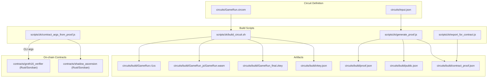
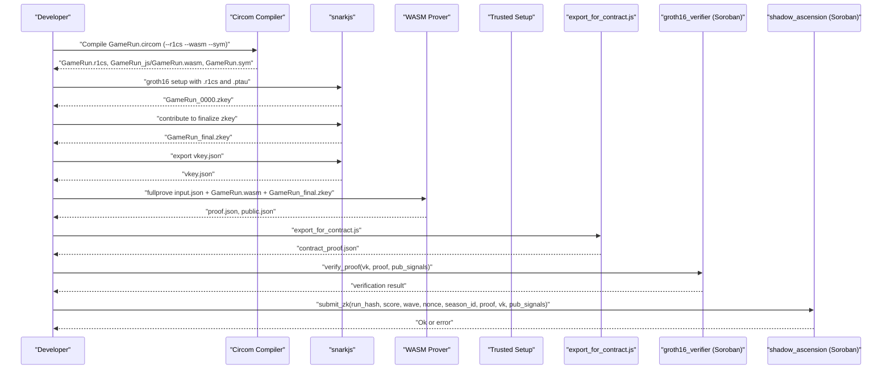
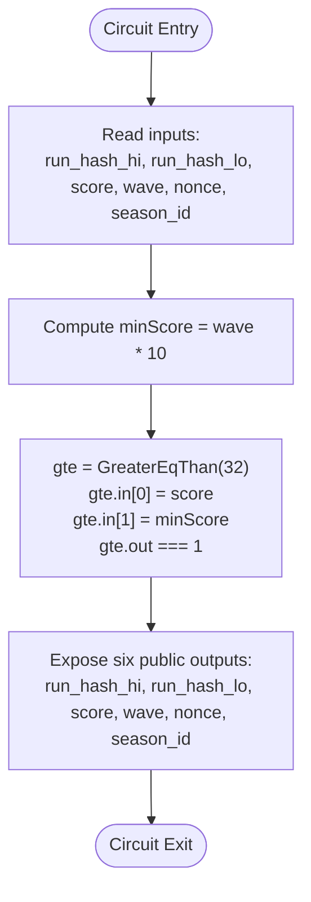
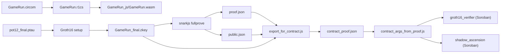

# Circuit Compilation

<cite>
**Referenced Files in This Document**
- [GameRun.circom](file://circuits/GameRun.circom)
- [build_circuit.sh](file://scripts/zk/build_circuit.sh)
- [generate_proof.js](file://scripts/zk/generate_proof.js)
- [export_for_contract.js](file://scripts/zk/export_for_contract.js)
- [contract_args_from_proof.js](file://scripts/zk/contract_args_from_proof.js)
- [input.json](file://circuits/input.json)
- [zkProve.js](file://server/zkProve.js)
- [Cargo.toml (workspace)](file://contracts/Cargo.toml)
- [Cargo.toml (groth16_verifier)](file://contracts/groth16_verifier/Cargo.toml)
- [Cargo.toml (shadow_ascension)](file://contracts/shadow_ascension/Cargo.toml)
- [ZK_REAL_SETUP.md](file://docs/ZK_REAL_SETUP.md)
- [DEPLOY_ZK_STEPS.md](file://docs/DEPLOY_ZK_STEPS.md)
- [package.json](file://package.json)
</cite>

## Table of Contents
1. [Introduction](#introduction)
2. [Project Structure](#project-structure)
3. [Core Components](#core-components)
4. [Architecture Overview](#architecture-overview)
5. [Detailed Component Analysis](#detailed-component-analysis)
6. [Dependency Analysis](#dependency-analysis)
7. [Performance Considerations](#performance-considerations)
8. [Troubleshooting Guide](#troubleshooting-guide)
9. [Conclusion](#conclusion)
10. [Appendices](#appendices)

## Introduction
This document explains the ZK circuit compilation pipeline for the GameRun.circom circuit, from source to a Groth16 proof suitable for on-chain verification. It covers:
- Step-by-step compilation workflow: .circom → R1CS → WASM prover → Trusted Setup → Verification Key and Proof
- Compiler flags and artifacts
- Circuit structure, public signals, and constraints
- Practical commands, expected outputs, troubleshooting, version compatibility, and optimization tips

## Project Structure
The ZK workflow spans three areas:
- Circuit definition under circuits/
- Build automation under scripts/zk/
- On-chain verification contracts under contracts/

**Diagram sources**
- [GameRun.circom](file://circuits/GameRun.circom#L1-L34)
- [build_circuit.sh](file://scripts/zk/build_circuit.sh#L1-L57)
- [generate_proof.js](file://scripts/zk/generate_proof.js#L1-L46)
- [export_for_contract.js](file://scripts/zk/export_for_contract.js#L1-L95)
- [contract_args_from_proof.js](file://scripts/zk/contract_args_from_proof.js#L1-L46)
- [Cargo.toml (workspace)](file://contracts/Cargo.toml#L1-L4)
- [Cargo.toml (groth16_verifier)](file://contracts/groth16_verifier/Cargo.toml#L1-L22)
- [Cargo.toml (shadow_ascension)](file://contracts/shadow_ascension/Cargo.toml#L1-L30)

**Section sources**
- [GameRun.circom](file://circuits/GameRun.circom#L1-L34)
- [build_circuit.sh](file://scripts/zk/build_circuit.sh#L1-L57)
- [generate_proof.js](file://scripts/zk/generate_proof.js#L1-L46)
- [export_for_contract.js](file://scripts/zk/export_for_contract.js#L1-L95)
- [contract_args_from_proof.js](file://scripts/zk/contract_args_from_proof.js#L1-L46)
- [Cargo.toml (workspace)](file://contracts/Cargo.toml#L1-L4)
- [Cargo.toml (groth16_verifier)](file://contracts/groth16_verifier/Cargo.toml#L1-L22)
- [Cargo.toml (shadow_ascension)](file://contracts/shadow_ascension/Cargo.toml#L1-L30)

## Core Components
- GameRun.circom: Defines the circuit inputs, comparator constraint enforcing score ≥ wave × MIN_SCORE_PER_WAVE, and six public outputs bound to run_hash (hi/lo), score, wave, nonce, and season_id.
- build_circuit.sh: Orchestrates Circom compilation (R1CS + WASM + sym), downloads or generates Powers of Tau, performs Groth16 setup, and exports the verification key.
- generate_proof.js: Runs snarkjs fullprove with the compiled WASM prover and final zkey, then exports a contract-ready JSON combining proof, verification key, and public signals.
- export_for_contract.js: Converts BN254 field elements and group elements to the expected byte layouts for Soroban contracts.
- contract_args_from_proof.js: Builds invoke arguments for stellar CLI or frontend from contract_proof.json, including derived values like score, wave, nonce, and season_id.
- server/zkProve.js: Backend endpoint that writes input.json from a request, triggers proof generation, and returns the contract-ready payload.

**Section sources**
- [GameRun.circom](file://circuits/GameRun.circom#L1-L34)
- [build_circuit.sh](file://scripts/zk/build_circuit.sh#L1-L57)
- [generate_proof.js](file://scripts/zk/generate_proof.js#L1-L46)
- [export_for_contract.js](file://scripts/zk/export_for_contract.js#L1-L95)
- [contract_args_from_proof.js](file://scripts/zk/contract_args_from_proof.js#L1-L46)
- [zkProve.js](file://server/zkProve.js#L1-L68)

## Architecture Overview
End-to-end flow from circuit to on-chain verification:

**Diagram sources**
- [build_circuit.sh](file://scripts/zk/build_circuit.sh#L30-L51)
- [generate_proof.js](file://scripts/zk/generate_proof.js#L32-L45)
- [export_for_contract.js](file://scripts/zk/export_for_contract.js#L65-L86)
- [Cargo.toml (groth16_verifier)](file://contracts/groth16_verifier/Cargo.toml#L1-L22)
- [Cargo.toml (shadow_ascension)](file://contracts/shadow_ascension/Cargo.toml#L1-L30)

## Detailed Component Analysis

### GameRun.circom: Inputs, Signals, and Constraints
- Inputs: run_hash_hi, run_hash_lo, score, wave, nonce, season_id
- Public outputs: run_hash_hi_out, run_hash_lo_out, score_out, wave_out, nonce_out, season_id_out
- Constraint: Enforces score ≥ wave × MIN_SCORE_PER_WAVE via GreaterEqThan comparator from circomlib
- Public signals: Six signals exposed for on-chain verification

**Diagram sources**
- [GameRun.circom](file://circuits/GameRun.circom#L8-L31)

**Section sources**
- [GameRun.circom](file://circuits/GameRun.circom#L1-L34)

### build_circuit.sh: Compilation and Trusted Setup
- Validates circom 2.x and snarkjs presence
- Compiles GameRun.circom with --r1cs, --wasm, --sym into circuits/build/
- Ensures a valid .ptau exists (downloads demo-sized ptau or generates locally)
- Performs Groth16 setup, contributes to finalize zkey, exports vkey.json

Key outputs in circuits/build/:
- GameRun.r1cs
- GameRun_js/GameRun.wasm
- GameRun.sym
- GameRun_0000.zkey
- GameRun_final.zkey
- vkey.json

**Section sources**
- [build_circuit.sh](file://scripts/zk/build_circuit.sh#L1-L57)

### generate_proof.js: Full Prove and Export
- Copies input.json into circuits/build/
- Executes snarkjs groth16 fullprove with the compiled WASM prover and final zkey
- Produces proof.json and public.json
- Invokes export_for_contract.js to write contract_proof.json

**Section sources**
- [generate_proof.js](file://scripts/zk/generate_proof.js#L1-L46)

### export_for_contract.js: Contract-Compatible Byte Layout
- Converts BN254 field elements to big-endian 32-byte hex
- Encodes G1 points as 64 bytes (x||y)
- Encodes G2 points as 128 bytes with x0||x1||y0||y1 limb order
- Exports proof, vk, and pub_signals in the format expected by contracts

**Section sources**
- [export_for_contract.js](file://scripts/zk/export_for_contract.js#L1-L95)

### contract_args_from_proof.js: Invoke Arguments Builder
- Reads contract_proof.json
- Builds verify_proof and submit_zk argument sets
- Derives run_hash_hex from pub_signals[0], score, wave, nonce, season_id from pub_signals

**Section sources**
- [contract_args_from_proof.js](file://scripts/zk/contract_args_from_proof.js#L1-L46)

### server/zkProve.js: Backend Proof Generation Endpoint
- Accepts run_hash_hex, score, wave, nonce, season_id
- Splits run_hash_hex into hi/lo, writes input.json
- Invokes generate_proof.js and returns contract_proof.json content

**Section sources**
- [zkProve.js](file://server/zkProve.js#L1-L68)

## Dependency Analysis
- GameRun.circom depends on circomlib GreaterEqThan comparator
- build_circuit.sh depends on circom 2.x and snarkjs
- generate_proof.js depends on snarkjs fullprove and the compiled WASM prover
- export_for_contract.js depends on the generated proof.json, vkey.json, and public.json
- contract_args_from_proof.js depends on contract_proof.json
- On-chain verification relies on groth16_verifier and shadow_ascension contracts

**Diagram sources**
- [GameRun.circom](file://circuits/GameRun.circom#L6-L22)
- [build_circuit.sh](file://scripts/zk/build_circuit.sh#L30-L51)
- [generate_proof.js](file://scripts/zk/generate_proof.js#L32-L45)
- [export_for_contract.js](file://scripts/zk/export_for_contract.js#L65-L86)
- [contract_args_from_proof.js](file://scripts/zk/contract_args_from_proof.js#L8-L45)
- [Cargo.toml (groth16_verifier)](file://contracts/groth16_verifier/Cargo.toml#L1-L22)
- [Cargo.toml (shadow_ascension)](file://contracts/shadow_ascension/Cargo.toml#L1-L30)

**Section sources**
- [GameRun.circom](file://circuits/GameRun.circom#L6-L22)
- [build_circuit.sh](file://scripts/zk/build_circuit.sh#L30-L51)
- [generate_proof.js](file://scripts/zk/generate_proof.js#L32-L45)
- [export_for_contract.js](file://scripts/zk/export_for_contract.js#L65-L86)
- [contract_args_from_proof.js](file://scripts/zk/contract_args_from_proof.js#L8-L45)
- [Cargo.toml (groth16_verifier)](file://contracts/groth16_verifier/Cargo.toml#L1-L22)
- [Cargo.toml (shadow_ascension)](file://contracts/shadow_ascension/Cargo.toml#L1-L30)

## Performance Considerations
- Use optimized Rust profiles for contracts (LTO, opt-level 3) to reduce on-chain bytecode size and improve performance.
- Prefer precomputed or cached .ptau files for faster local development; generate only when necessary.
- Keep input.json minimal and deterministic to speed up fullprove.
- For backend flows, cache contract_proof.json per run_hash to avoid recomputation when not needed.

[No sources needed since this section provides general guidance]

## Troubleshooting Guide
Common issues and resolutions:
- Circom version mismatch: The circuit pragma requires 2.x; ensure PATH includes ~/.cargo/bin and verify with the script’s version check.
- Missing snarkjs: Install globally and ensure it is on PATH.
- Powers of Tau missing or corrupted: The script attempts to download a demo-sized .ptau; if invalid, it generates locally. Ensure network access or manual provision of a valid .ptau.
- Missing artifacts after build: Confirm that GameRun.r1cs, GameRun_js/GameRun.wasm, GameRun_final.zkey, and vkey.json exist in circuits/build/.
- Backend proof generation fails: Verify circuits/build exists and contains GameRun_final.zkey; ensure input.json is valid and matches the circuit’s public signals.
- Contract argument mismatch: Use contract_args_from_proof.js to derive correct arguments from contract_proof.json.

**Section sources**
- [build_circuit.sh](file://scripts/zk/build_circuit.sh#L16-L28)
- [build_circuit.sh](file://scripts/zk/build_circuit.sh#L34-L46)
- [generate_proof.js](file://scripts/zk/generate_proof.js#L23-L30)
- [zkProve.js](file://server/zkProve.js#L49-L54)
- [contract_args_from_proof.js](file://scripts/zk/contract_args_from_proof.js#L11-L14)

## Conclusion
The GameRun.circom pipeline integrates cleanly with snarkjs and Soroban contracts. By following the documented steps—ensuring compatible tool versions, compiling with the correct flags, performing trusted setup, generating proofs, and exporting contract-ready artifacts—you can reliably produce on-chain verifiable proofs for ranked runs.

[No sources needed since this section summarizes without analyzing specific files]

## Appendices

### A. Compilation Flags and Outputs
- Flags used by the build script:
  - --r1cs: Generate Rank-1 Constraint System
  - --wasm: Generate WASM prover
  - --sym: Generate symbolic representation
- Typical outputs in circuits/build/:
  - GameRun.r1cs
  - GameRun_js/GameRun.wasm
  - GameRun.sym
  - GameRun_0000.zkey
  - GameRun_final.zkey
  - vkey.json
  - proof.json
  - public.json
  - contract_proof.json

**Section sources**
- [build_circuit.sh](file://scripts/zk/build_circuit.sh#L31-L31)
- [build_circuit.sh](file://scripts/zk/build_circuit.sh#L53-L56)

### B. Practical Commands
- Compile circuit and trusted setup:
  - chmod +x scripts/zk/build_circuit.sh
  - ./scripts/zk/build_circuit.sh
- Generate a real proof:
  - node scripts/zk/generate_proof.js circuits/input.json circuits/build
- Build invoke arguments:
  - node scripts/zk/contract_args_from_proof.js circuits/build
- Backend proof generation:
  - npm run zk:proof (via package.json scripts)

**Section sources**
- [ZK_REAL_SETUP.md](file://docs/ZK_REAL_SETUP.md#L29-L66)
- [ZK_REAL_SETUP.md](file://docs/ZK_REAL_SETUP.md#L83-L87)
- [package.json](file://package.json#L18-L21)

### C. Version Compatibility
- circom 2.1.x required by the pragma in GameRun.circom
- snarkjs installed globally
- Node 18+ recommended for scripts
- Rust + wasm32v1-none for contracts (Soroban testnet target)

**Section sources**
- [GameRun.circom](file://circuits/GameRun.circom#L4-L4)
- [ZK_REAL_SETUP.md](file://docs/ZK_REAL_SETUP.md#L7-L10)
- [DEPLOY_ZK_STEPS.md](file://docs/DEPLOY_ZK_STEPS.md#L21-L21)

### D. Circuit Inputs and Public Signals
- Inputs: run_hash_hi, run_hash_lo, score, wave, nonce, season_id
- Public outputs (signals exposed for verification): run_hash_hi, run_hash_lo, score, wave, nonce, season_id

**Section sources**
- [GameRun.circom](file://circuits/GameRun.circom#L9-L30)
- [input.json](file://circuits/input.json#L1-L9)