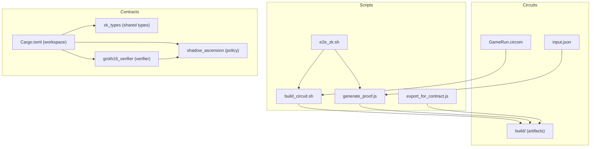
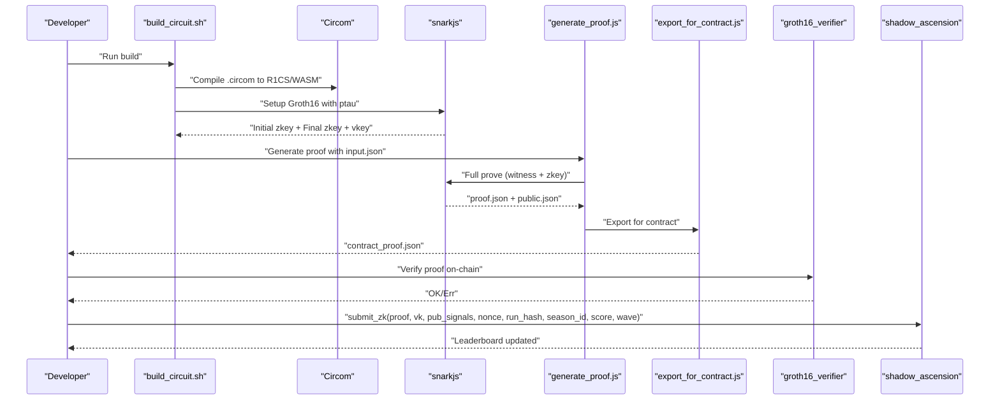
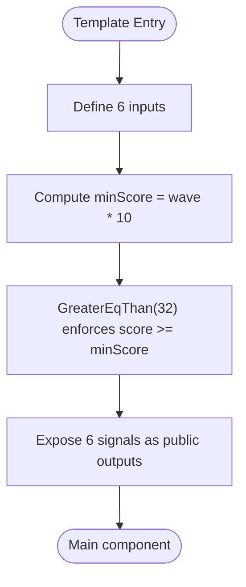
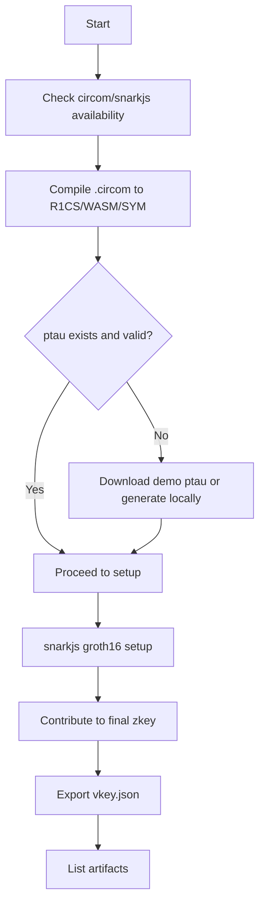
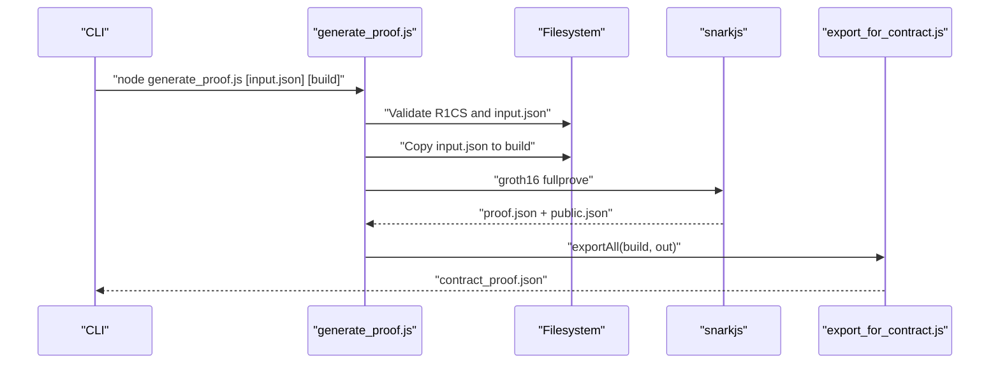
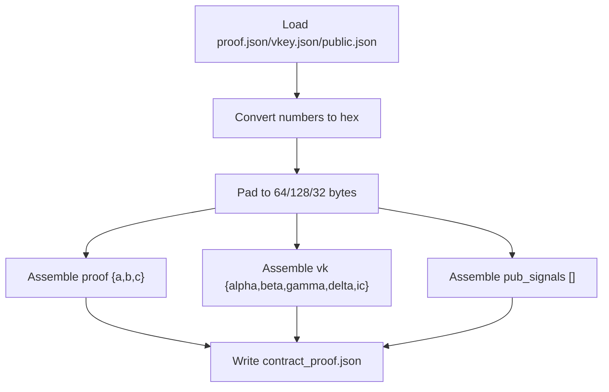
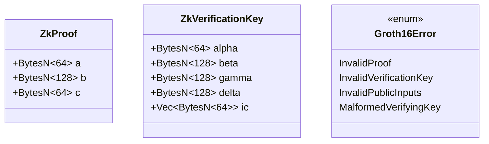
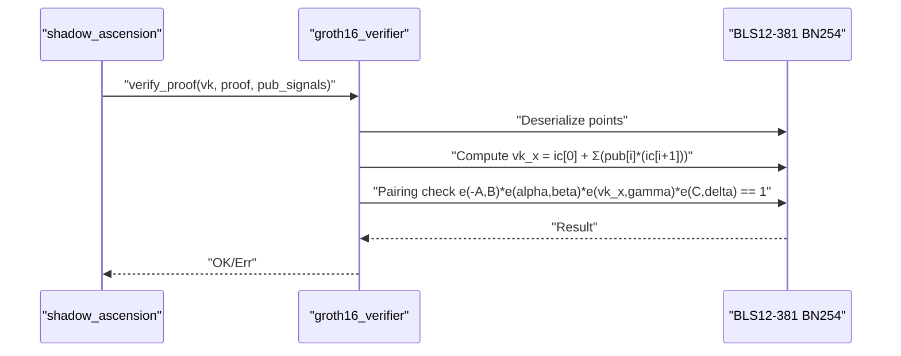
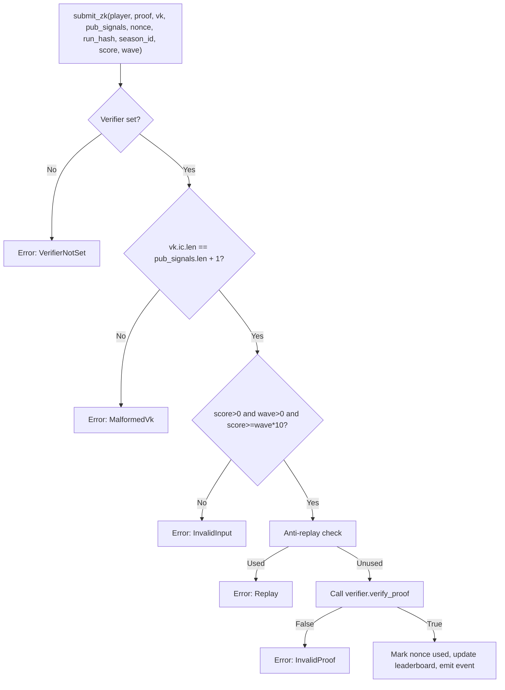
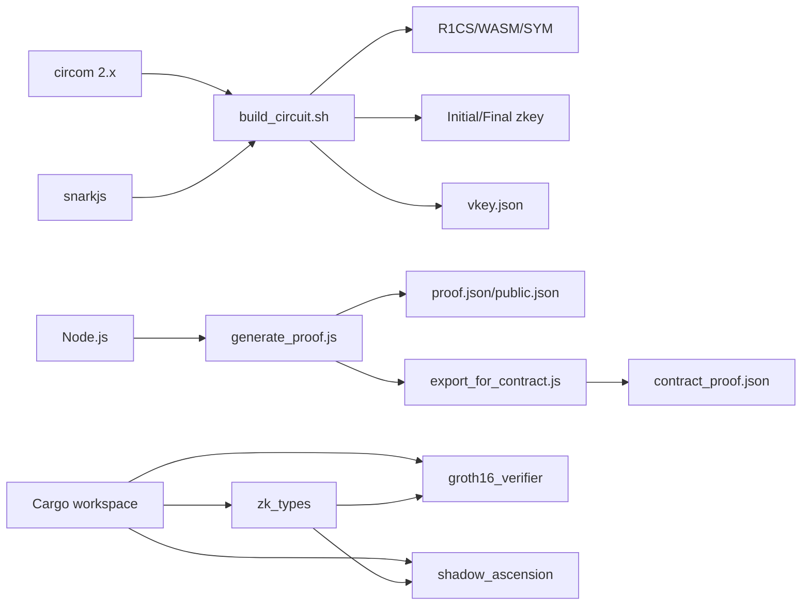

# Compilation and Build Process

<cite>
**Referenced Files in This Document**
- [build_circuit.sh](file://scripts/zk/build_circuit.sh)
- [generate_proof.js](file://scripts/zk/generate_proof.js)
- [export_for_contract.js](file://scripts/zk/export_for_contract.js)
- [e2e_zk.sh](file://scripts/e2e_zk.sh)
- [GameRun.circom](file://circuits/GameRun.circom)
- [input.json](file://circuits/input.json)
- [Cargo.toml (workspace)](file://contracts/Cargo.toml)
- [Cargo.toml (zk_types)](file://contracts/zk_types/Cargo.toml)
- [lib.rs (zk_types)](file://contracts/zk_types/src/lib.rs)
- [Cargo.toml (groth16_verifier)](file://contracts/groth16_verifier/Cargo.toml)
- [lib.rs (groth16_verifier)](file://contracts/groth16_verifier/src/lib.rs)
- [Cargo.toml (shadow_ascension)](file://contracts/shadow_ascension/Cargo.toml)
- [lib.rs (shadow_ascension)](file://contracts/shadow_ascension/src/lib.rs)
- [gameProof.js](file://src/zk/gameProof.js)
- [SETUP.md](file://SETUP.md)
</cite>

## Table of Contents
1. [Introduction](#introduction)
2. [Project Structure](#project-structure)
3. [Core Components](#core-components)
4. [Architecture Overview](#architecture-overview)
5. [Detailed Component Analysis](#detailed-component-analysis)
6. [Dependency Analysis](#dependency-analysis)
7. [Performance Considerations](#performance-considerations)
8. [Troubleshooting Guide](#troubleshooting-guide)
9. [Conclusion](#conclusion)
10. [Appendices](#appendices)

## Introduction
This document explains the ZK circuit compilation and build pipeline for the project’s Groth16-based SNARK workflow. It covers the step-by-step compilation from .circom to R1CS and WASM, witness generation, constraint system creation, and the Phase 2 powers of tau ceremony. It also documents the build script functionality, dependency management, output artifacts, and the end-to-end flow to produce a contract-ready proof. Finally, it provides optimization tips, debugging approaches, and environment setup requirements.

## Project Structure
The ZK build pipeline spans three areas:
- Circuits: .circom source and generated artifacts
- Scripts: Bash and Node.js tooling for building and proving
- Contracts: Rust-based Groth16 verifier and policy contract

**Diagram sources**
- [build_circuit.sh](file://scripts/zk/build_circuit.sh#L1-L57)
- [generate_proof.js](file://scripts/zk/generate_proof.js#L1-L46)
- [export_for_contract.js](file://scripts/zk/export_for_contract.js#L1-L95)
- [e2e_zk.sh](file://scripts/e2e_zk.sh#L1-L22)
- [GameRun.circom](file://circuits/GameRun.circom#L1-L34)
- [input.json](file://circuits/input.json#L1-L9)
- [Cargo.toml (workspace)](file://contracts/Cargo.toml#L1-L4)
- [Cargo.toml (zk_types)](file://contracts/zk_types/Cargo.toml#L1-L44)
- [Cargo.toml (groth16_verifier)](file://contracts/groth16_verifier/Cargo.toml#L1-L22)
- [Cargo.toml (shadow_ascension)](file://contracts/shadow_ascension/Cargo.toml#L1-L30)
- [lib.rs (zk_types)](file://contracts/zk_types/src/lib.rs#L1-L44)
- [lib.rs (groth16_verifier)](file://contracts/groth16_verifier/src/lib.rs#L1-L61)
- [lib.rs (shadow_ascension)](file://contracts/shadow_ascension/src/lib.rs#L1-L314)

**Section sources**
- [build_circuit.sh](file://scripts/zk/build_circuit.sh#L1-L57)
- [generate_proof.js](file://scripts/zk/generate_proof.js#L1-L46)
- [export_for_contract.js](file://scripts/zk/export_for_contract.js#L1-L95)
- [e2e_zk.sh](file://scripts/e2e_zk.sh#L1-L22)
- [GameRun.circom](file://circuits/GameRun.circom#L1-L34)
- [input.json](file://circuits/input.json#L1-L9)
- [Cargo.toml (workspace)](file://contracts/Cargo.toml#L1-L4)
- [Cargo.toml (zk_types)](file://contracts/zk_types/Cargo.toml#L1-L44)
- [lib.rs (zk_types)](file://contracts/zk_types/src/lib.rs#L1-L44)
- [Cargo.toml (groth16_verifier)](file://contracts/groth16_verifier/Cargo.toml#L1-L22)
- [lib.rs (groth16_verifier)](file://contracts/groth16_verifier/src/lib.rs#L1-L61)
- [Cargo.toml (shadow_ascension)](file://contracts/shadow_ascension/Cargo.toml#L1-L30)
- [lib.rs (shadow_ascension)](file://contracts/shadow_ascension/src/lib.rs#L1-L314)

## Core Components
- Circuit definition: GameRun.circom defines inputs, constraints, and public outputs.
- Build script: Orchestrates compilation, powers-of-tau setup, Groth16 trusted setup, and artifact export.
- Proof generation: Node.js script runs full Groth16 proving and exports a contract-ready JSON.
- Contract types: Shared BN254 types for proofs and verification keys.
- Verifier contract: Performs BN254 pairing checks to validate Groth16 proofs.
- Policy contract: Integrates verification, anti-replay, and leaderboard updates.

**Section sources**
- [GameRun.circom](file://circuits/GameRun.circom#L1-L34)
- [build_circuit.sh](file://scripts/zk/build_circuit.sh#L1-L57)
- [generate_proof.js](file://scripts/zk/generate_proof.js#L1-L46)
- [export_for_contract.js](file://scripts/zk/export_for_contract.js#L1-L95)
- [lib.rs (zk_types)](file://contracts/zk_types/src/lib.rs#L1-L44)
- [lib.rs (groth16_verifier)](file://contracts/groth16_verifier/src/lib.rs#L1-L61)
- [lib.rs (shadow_ascension)](file://contracts/shadow_ascension/src/lib.rs#L1-L314)

## Architecture Overview
The end-to-end ZK workflow:
1. Compile .circom to R1CS and WASM.
2. Prepare Phase 2 powers-of-tau (download or generate locally).
3. Run Groth16 trusted setup to produce initial and final zkeys.
4. Export verification key and public signals.
5. Generate a real Groth16 proof using the WASM witness generator and final zkey.
6. Convert proof and verification key to contract-friendly byte arrays.
7. Verify on-chain using the verifier contract and update policy state.

**Diagram sources**
- [build_circuit.sh](file://scripts/zk/build_circuit.sh#L30-L51)
- [generate_proof.js](file://scripts/zk/generate_proof.js#L36-L44)
- [export_for_contract.js](file://scripts/zk/export_for_contract.js#L65-L86)
- [lib.rs (groth16_verifier)](file://contracts/groth16_verifier/src/lib.rs#L23-L56)
- [lib.rs (shadow_ascension)](file://contracts/shadow_ascension/src/lib.rs#L159-L264)

## Detailed Component Analysis

### Circuit Definition: GameRun.circom
- Inputs: run_hash_hi, run_hash_lo, score, wave, nonce, season_id.
- Constraint: score >= wave * MIN_SCORE_PER_WAVE.
- Public outputs: all six inputs are exposed as public signals for verification.

**Diagram sources**
- [GameRun.circom](file://circuits/GameRun.circom#L8-L31)

**Section sources**
- [GameRun.circom](file://circuits/GameRun.circom#L1-L34)

### Build Script: build_circuit.sh
Responsibilities:
- Ensures required tools are installed and on PATH.
- Compiles .circom to R1CS and WASM with symbols.
- Manages powers-of-tau lifecycle:
  - Validates existing .ptau file.
  - Downloads a small demo .ptau if missing or too small.
  - Generates fresh .ptau locally if needed.
- Runs Groth16 setup and contributes to produce final zkey.
- Exports verification key and lists artifacts.

**Diagram sources**
- [build_circuit.sh](file://scripts/zk/build_circuit.sh#L16-L51)

**Section sources**
- [build_circuit.sh](file://scripts/zk/build_circuit.sh#L1-L57)

### Proof Generation: generate_proof.js
Responsibilities:
- Validates prerequisites (built R1CS and input.json).
- Copies input.json into build directory.
- Executes full Groth16 proving with WASM witness generator and final zkey.
- Invokes export_for_contract.js to produce contract_proof.json.

**Diagram sources**
- [generate_proof.js](file://scripts/zk/generate_proof.js#L23-L44)
- [export_for_contract.js](file://scripts/zk/export_for_contract.js#L65-L86)

**Section sources**
- [generate_proof.js](file://scripts/zk/generate_proof.js#L1-L46)

### Contract Serialization: export_for_contract.js
Responsibilities:
- Converts BN254 field elements to big-endian byte arrays.
- Encodes G1/G2 points to the expected sizes for on-chain verification.
- Produces a JSON object consumable by the contract with:
  - proof: { a (64), b (128), c (64) }
  - vk: { alpha, beta, gamma, delta, ic[] }
  - pub_signals: array of 32-byte values

**Diagram sources**
- [export_for_contract.js](file://scripts/zk/export_for_contract.js#L38-L86)

**Section sources**
- [export_for_contract.js](file://scripts/zk/export_for_contract.js#L1-L95)

### End-to-End Workflow: e2e_zk.sh
Executes the entire pipeline:
- Builds the circuit.
- Generates a real Groth16 proof.
- Runs Rust contract tests for verifier and policy.

**Section sources**
- [e2e_zk.sh](file://scripts/e2e_zk.sh#L1-L22)

### Shared Types: zk_types
Defines BN254 sizes and data structures used by both verifier and policy:
- Sizes: G1=64, G2=128, Fr=32 bytes.
- Errors: InvalidProof, InvalidVerificationKey, InvalidPublicInputs, MalformedVerifyingKey.
- Types: ZkProof, ZkVerificationKey.

**Diagram sources**
- [lib.rs (zk_types)](file://contracts/zk_types/src/lib.rs#L27-L43)

**Section sources**
- [lib.rs (zk_types)](file://contracts/zk_types/src/lib.rs#L1-L44)

### Verifier Contract: groth16_verifier
Responsibilities:
- Accepts ZkVerificationKey, ZkProof, and public signals.
- Performs BN254 pairing check using the verification equation.
- Returns true if the proof verifies against the VK and public inputs.

**Diagram sources**
- [lib.rs (groth16_verifier)](file://contracts/groth16_verifier/src/lib.rs#L23-L56)

**Section sources**
- [lib.rs (groth16_verifier)](file://contracts/groth16_verifier/src/lib.rs#L1-L61)

### Policy Contract: shadow_ascension
Responsibilities:
- Enforces anti-replay using (player, nonce, season_id).
- Validates input constraints (score > 0, wave > 0, progression rule).
- Calls the verifier contract and updates leaderboards upon successful verification.

**Diagram sources**
- [lib.rs (shadow_ascension)](file://contracts/shadow_ascension/src/lib.rs#L159-L264)

**Section sources**
- [lib.rs (shadow_ascension)](file://contracts/shadow_ascension/src/lib.rs#L1-L314)

### Client-Side Utilities: gameProof.js
Provides helpers for computing run hashes, validating game rules, and generating run seeds. Useful for front-end integration and pre-validation.

**Section sources**
- [gameProof.js](file://src/zk/gameProof.js#L1-L78)

## Dependency Analysis
Toolchain and workspace dependencies:
- Build tools: circom 2.x, snarkjs, Node.js.
- Rust workspace: zk_types, groth16_verifier, shadow_ascension.
- Environment: PATH configured to use cargo-installed circom.

**Diagram sources**
- [build_circuit.sh](file://scripts/zk/build_circuit.sh#L3-L28)
- [generate_proof.js](file://scripts/zk/generate_proof.js#L6-L10)
- [export_for_contract.js](file://scripts/zk/export_for_contract.js#L65-L86)
- [Cargo.toml (workspace)](file://contracts/Cargo.toml#L1-L4)
- [Cargo.toml (zk_types)](file://contracts/zk_types/Cargo.toml#L1-L44)
- [Cargo.toml (groth16_verifier)](file://contracts/groth16_verifier/Cargo.toml#L1-L22)
- [Cargo.toml (shadow_ascension)](file://contracts/shadow_ascension/Cargo.toml#L1-L30)

**Section sources**
- [build_circuit.sh](file://scripts/zk/build_circuit.sh#L1-L57)
- [generate_proof.js](file://scripts/zk/generate_proof.js#L1-L46)
- [export_for_contract.js](file://scripts/zk/export_for_contract.js#L1-L95)
- [Cargo.toml (workspace)](file://contracts/Cargo.toml#L1-L4)
- [Cargo.toml (zk_types)](file://contracts/zk_types/Cargo.toml#L1-L44)
- [Cargo.toml (groth16_verifier)](file://contracts/groth16_verifier/Cargo.toml#L1-L22)
- [Cargo.toml (shadow_ascension)](file://contracts/shadow_ascension/Cargo.toml#L1-L30)

## Performance Considerations
- Circuit optimization:
  - Minimize multiplications and use provided templates (e.g., comparator) to reduce constraint count.
  - Keep public input count reasonable to reduce verification cost.
- Powers-of-tau:
  - Use a pre-generated .ptau to avoid long local generation.
  - Ensure .ptau is valid and large enough for the circuit size.
- Witness generation:
  - Prefer optimized WASM builds and avoid unnecessary logging during production runs.
- On-chain verification:
  - Reuse verification keys and avoid re-exporting unless changed.
  - Batch submissions when possible to amortize gas costs.

[No sources needed since this section provides general guidance]

## Troubleshooting Guide
Common issues and resolutions:
- Missing or incompatible tools:
  - Ensure circom 2.x is installed and on PATH; the build script validates this.
  - Install snarkjs globally if missing.
- Invalid or small .ptau:
  - The build script downloads a demo .ptau if missing or too small; otherwise generates locally.
- Missing artifacts:
  - Run the build script before generating proofs.
  - Ensure input.json exists and matches circuit inputs.
- Verification failures:
  - Confirm contract_proof.json was generated from the latest proof and vkey.
  - Verify public signals align with VK IC vector length.
- Rust tests:
  - Run contract tests after generating a real proof to validate the end-to-end flow.

**Section sources**
- [build_circuit.sh](file://scripts/zk/build_circuit.sh#L16-L28)
- [generate_proof.js](file://scripts/zk/generate_proof.js#L23-L30)
- [export_for_contract.js](file://scripts/zk/export_for_contract.js#L65-L86)
- [e2e_zk.sh](file://scripts/e2e_zk.sh#L1-L22)

## Conclusion
The project’s ZK pipeline integrates a Circom circuit, a robust build script for trusted setup, and a Node.js proof generator that produces contract-ready artifacts. The Rust contracts provide a clean separation between verification and policy logic, with shared types ensuring compatibility. Following the documented steps and troubleshooting tips ensures reliable compilation, verification, and deployment of Groth16 proofs.

[No sources needed since this section summarizes without analyzing specific files]

## Appendices

### Environment Setup Requirements
- Node.js 18+ and npm for snarkjs and proof generation.
- Cargo-installed circom 2.x on PATH.
- snarkjs installed globally.
- Rust toolchain for compiling contracts.

**Section sources**
- [build_circuit.sh](file://scripts/zk/build_circuit.sh#L3-L28)
- [SETUP.md](file://SETUP.md#L19-L30)

### Build Configuration Options
- Circuit inputs and constraints are defined in the .circom file.
- Public inputs and outputs are explicitly declared for verification.
- Powers-of-tau selection is automated in the build script (download or generate).
- Release profiles for Rust contracts enable optimizations suitable for on-chain deployment.

**Section sources**
- [GameRun.circom](file://circuits/GameRun.circom#L8-L31)
- [build_circuit.sh](file://scripts/zk/build_circuit.sh#L34-L46)
- [Cargo.toml (groth16_verifier)](file://contracts/groth16_verifier/Cargo.toml#L18-L22)
- [Cargo.toml (shadow_ascension)](file://contracts/shadow_ascension/Cargo.toml#L22-L30)