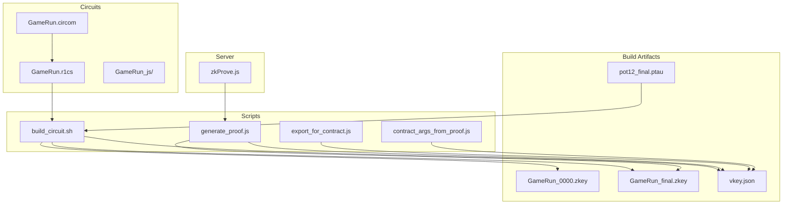
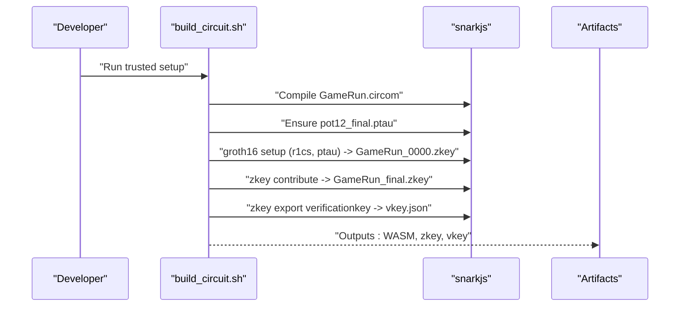
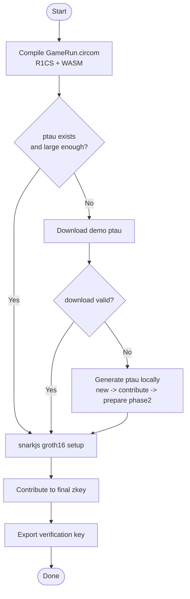
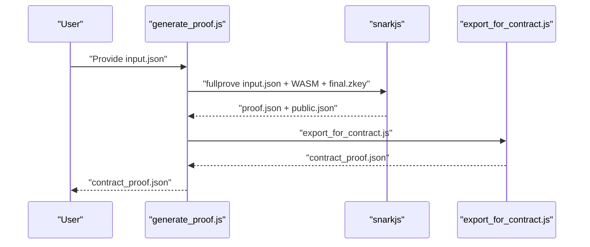
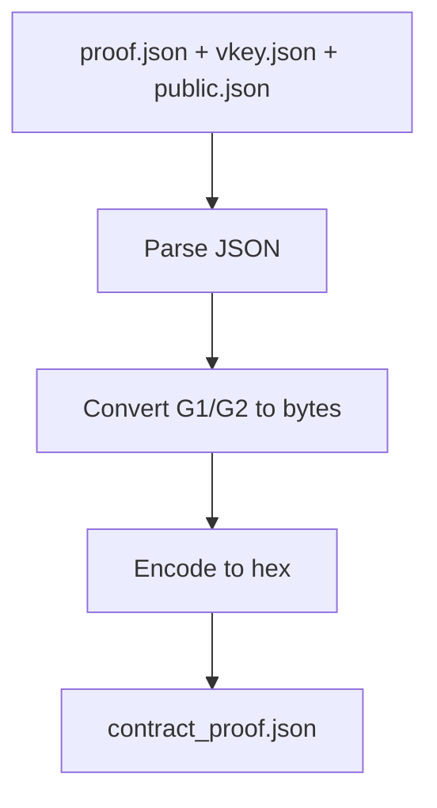
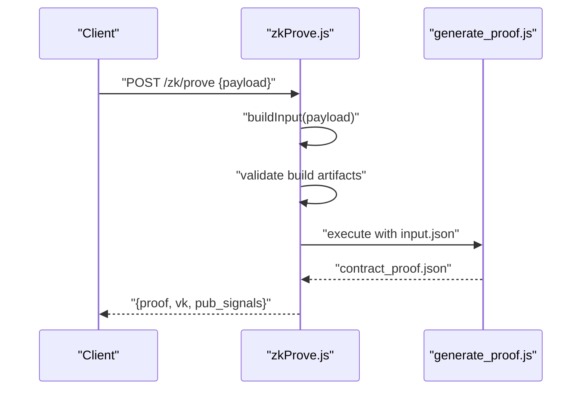
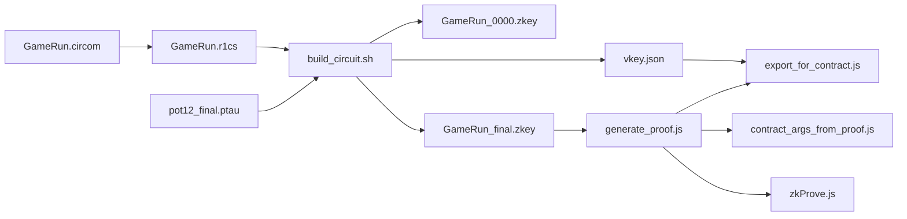

# Groth16 Trusted Setup

<cite>
**Referenced Files in This Document**
- [build_circuit.sh](file://scripts/zk/build_circuit.sh)
- [generate_proof.js](file://scripts/zk/generate_proof.js)
- [export_for_contract.js](file://scripts/zk/export_for_contract.js)
- [contract_args_from_proof.js](file://scripts/zk/contract_args_from_proof.js)
- [zkProve.js](file://server/zkProve.js)
- [ZK_REAL_SETUP.md](file://docs/ZK_REAL_SETUP.md)
- [DEPLOY_ZK_STEPS.md](file://docs/DEPLOY_ZK_STEPS.md)
- [vkey.json](file://circuits/build/vkey.json)
- [GameRun.circom](file://circuits/GameRun.circom)
- [input.json.example](file://circuits/input.json.example)
- [package.json](file://package.json)
</cite>

## Table of Contents
1. [Introduction](#introduction)
2. [Project Structure](#project-structure)
3. [Core Components](#core-components)
4. [Architecture Overview](#architecture-overview)
5. [Detailed Component Analysis](#detailed-component-analysis)
6. [Dependency Analysis](#dependency-analysis)
7. [Performance Considerations](#performance-considerations)
8. [Security and Distribution](#security-and-distribution)
9. [Troubleshooting Guide](#troubleshooting-guide)
10. [Conclusion](#conclusion)

## Introduction
This document explains the Groth16 trusted setup and key generation process used by the project’s zk workflow. It covers the snarkjs groth16 setup steps, zkey file management, and verification key export. It also documents the contribution process, naming conventions, and key file organization. Finally, it details the relationship between the initial zkey, the final zkey, and the verification key output, along with security implications, protection strategies, and distribution considerations.

## Project Structure
The zk workflow is orchestrated by shell and Node.js scripts under scripts/zk, with artifacts produced in circuits/build. The key files and their roles are:
- Initial setup and contribution: scripts/zk/build_circuit.sh
- Proof generation: scripts/zk/generate_proof.js
- Contract-ready export: scripts/zk/export_for_contract.js
- CLI argument builder: scripts/zk/contract_args_from_proof.js
- Backend integration: server/zkProve.js
- Documentation: docs/ZK_REAL_SETUP.md and docs/DEPLOY_ZK_STEPS.md
- Verification key artifact: circuits/build/vkey.json
- Circuit definition: circuits/GameRun.circom
- Example input: circuits/input.json.example
- NPM scripts: package.json

**Diagram sources**
- [build_circuit.sh](file://scripts/zk/build_circuit.sh#L1-L57)
- [generate_proof.js](file://scripts/zk/generate_proof.js#L1-L46)
- [export_for_contract.js](file://scripts/zk/export_for_contract.js#L1-L95)
- [contract_args_from_proof.js](file://scripts/zk/contract_args_from_proof.js#L1-L46)
- [zkProve.js](file://server/zkProve.js#L1-L68)
- [vkey.json](file://circuits/build/vkey.json#L1-L119)
- [GameRun.circom](file://circuits/GameRun.circom)
- [input.json.example](file://circuits/input.json.example#L1-L9)

**Section sources**
- [build_circuit.sh](file://scripts/zk/build_circuit.sh#L1-L57)
- [generate_proof.js](file://scripts/zk/generate_proof.js#L1-L46)
- [export_for_contract.js](file://scripts/zk/export_for_contract.js#L1-L95)
- [contract_args_from_proof.js](file://scripts/zk/contract_args_from_proof.js#L1-L46)
- [zkProve.js](file://server/zkProve.js#L1-L68)
- [ZK_REAL_SETUP.md](file://docs/ZK_REAL_SETUP.md#L1-L192)
- [DEPLOY_ZK_STEPS.md](file://docs/DEPLOY_ZK_STEPS.md#L1-L90)
- [vkey.json](file://circuits/build/vkey.json#L1-L119)
- [GameRun.circom](file://circuits/GameRun.circom)
- [input.json.example](file://circuits/input.json.example#L1-L9)
- [package.json](file://package.json#L7-L21)

## Core Components
- Trusted setup orchestration: scripts/zk/build_circuit.sh
  - Compiles the circuit to R1CS and WASM.
  - Ensures a valid powers of tau file (ptau) is present, downloading or generating as needed.
  - Runs snarkjs groth16 setup to produce the initial zkey.
  - Contributes to the initial zkey to produce the final zkey.
  - Exports the verification key to vkey.json.
- Proof generation: scripts/zk/generate_proof.js
  - Validates prerequisites (built circuit and input).
  - Copies input.json into the build directory.
  - Executes snarkjs groth16 fullprove to produce proof.json and public.json.
  - Invokes export_for_contract.js to produce contract_proof.json.
- Contract export: scripts/zk/export_for_contract.js
  - Converts snarkjs proof and vkey into contract-ready hex-encoded buffers.
  - Encodes G1/G2 elements according to the target chain’s field element ordering.
- Backend integration: server/zkProve.js
  - Accepts a request payload, builds input.json, and triggers the proof pipeline.
  - Returns a contract-ready JSON payload for downstream submission.
- CLI argument builder: scripts/zk/contract_args_from_proof.js
  - Reads contract_proof.json and prints JSON-formatted arguments for verify_proof and submit_zk.

**Section sources**
- [build_circuit.sh](file://scripts/zk/build_circuit.sh#L30-L51)
- [generate_proof.js](file://scripts/zk/generate_proof.js#L23-L44)
- [export_for_contract.js](file://scripts/zk/export_for_contract.js#L38-L86)
- [zkProve.js](file://server/zkProve.js#L46-L67)
- [contract_args_from_proof.js](file://scripts/zk/contract_args_from_proof.js#L16-L45)

## Architecture Overview
The zk workflow follows a deterministic sequence: compile circuit → prepare ptau → groth16 setup → contribute → export verification key → generate proof → export for contract.

**Diagram sources**
- [build_circuit.sh](file://scripts/zk/build_circuit.sh#L30-L51)

## Detailed Component Analysis

### Trusted Setup Orchestration (build_circuit.sh)
- Responsibilities:
  - Circuit compilation to R1CS and WASM.
  - Powers of tau acquisition: attempts download; falls back to local generation.
  - Groth16 setup using the prepared ptau.
  - Contribution step to produce the final zkey.
  - Export of the verification key.
- Naming conventions:
  - Initial zkey: GameRun_0000.zkey
  - Final zkey: GameRun_final.zkey
  - Verification key: vkey.json
  - Powers of tau: pot12_final.ptau (with intermediate stages during generation)
- Key file organization:
  - All outputs are placed under circuits/build.

**Diagram sources**
- [build_circuit.sh](file://scripts/zk/build_circuit.sh#L30-L51)

**Section sources**
- [build_circuit.sh](file://scripts/zk/build_circuit.sh#L1-L57)

### Proof Generation Pipeline (generate_proof.js)
- Responsibilities:
  - Validates presence of compiled circuit and input.json.
  - Executes snarkjs groth16 fullprove to produce proof.json and public.json.
  - Invokes export_for_contract.js to produce contract_proof.json.
- Integration:
  - Uses the final zkey from the previous step.
  - Produces contract_proof.json consumable by the frontend and CLI.

**Diagram sources**
- [generate_proof.js](file://scripts/zk/generate_proof.js#L36-L44)
- [export_for_contract.js](file://scripts/zk/export_for_contract.js#L65-L86)

**Section sources**
- [generate_proof.js](file://scripts/zk/generate_proof.js#L1-L46)

### Contract Export (export_for_contract.js)
- Responsibilities:
  - Converts snarkjs proof and vkey into contract-ready hex buffers.
  - Encodes G1/G2 elements according to target chain conventions.
- Output structure:
  - proof: { a (64 hex), b (128 hex), c (64 hex) }
  - vk: { alpha (64 hex), beta (128 hex), gamma (128 hex), delta (128 hex), ic[] (64 hex each) }
  - pub_signals: array of 32-byte hex strings

**Diagram sources**
- [export_for_contract.js](file://scripts/zk/export_for_contract.js#L38-L86)

**Section sources**
- [export_for_contract.js](file://scripts/zk/export_for_contract.js#L1-L95)

### Backend Integration (zkProve.js)
- Responsibilities:
  - Accepts a request payload and constructs input.json.
  - Ensures the circuit is built and the final zkey exists.
  - Invokes the proof generation pipeline and returns contract_proof.json content.
- Timeout and error handling:
  - Enforces a strict timeout for the proof generation subprocess.
  - Throws descriptive errors if prerequisites are missing.

**Diagram sources**
- [zkProve.js](file://server/zkProve.js#L46-L67)
- [generate_proof.js](file://scripts/zk/generate_proof.js#L36-L44)

**Section sources**
- [zkProve.js](file://server/zkProve.js#L1-L68)

### CLI Argument Builder (contract_args_from_proof.js)
- Responsibilities:
  - Reads contract_proof.json and prints JSON with hex-encoded arguments.
  - Provides ready-to-use vk, proof, pub_signals, and derived fields for submit_zk.

**Section sources**
- [contract_args_from_proof.js](file://scripts/zk/contract_args_from_proof.js#L1-L46)

## Dependency Analysis
- Toolchain dependencies:
  - circom 2.x and snarkjs are required for compilation and setup.
  - Node.js runtime for scripts and server integration.
- Internal dependencies:
  - build_circuit.sh depends on the presence of GameRun.circom and produces GameRun.r1cs, WASM, and zkeys.
  - generate_proof.js depends on the final zkey and input.json.
  - export_for_contract.js depends on proof.json, vkey.json, and public.json.
  - zkProve.js orchestrates the backend flow and depends on the build artifacts.

**Diagram sources**
- [build_circuit.sh](file://scripts/zk/build_circuit.sh#L30-L51)
- [generate_proof.js](file://scripts/zk/generate_proof.js#L36-L44)
- [export_for_contract.js](file://scripts/zk/export_for_contract.js#L65-L86)
- [contract_args_from_proof.js](file://scripts/zk/contract_args_from_proof.js#L16-L45)
- [zkProve.js](file://server/zkProve.js#L46-L67)

**Section sources**
- [build_circuit.sh](file://scripts/zk/build_circuit.sh#L1-L57)
- [generate_proof.js](file://scripts/zk/generate_proof.js#L1-L46)
- [export_for_contract.js](file://scripts/zk/export_for_contract.js#L1-L95)
- [contract_args_from_proof.js](file://scripts/zk/contract_args_from_proof.js#L1-L46)
- [zkProve.js](file://server/zkProve.js#L1-L68)
- [package.json](file://package.json#L7-L21)

## Performance Considerations
- Powers of tau generation:
  - Generating ptau locally is faster for development but still computationally intensive. For production, pre-generated ptau files are recommended.
- Proof generation:
  - Fullproof execution depends on WASM runtime performance and input size. Keep input.json minimal and representative.
- Backend throughput:
  - The server enforces a timeout for proof generation. Tune timeouts and consider queueing for high load.

## Security and Distribution
- Trusted setup security:
  - The ptau file and the final zkey must remain secret and protected. Anyone with the final zkey can impersonate the setup ceremony.
  - Use multi-party contribution ceremonies in production to eliminate single-point-of-failure trust assumptions.
- File protection:
  - Restrict access to GameRun_final.zkey and vkey.json. Store in secure environments and avoid committing to version control.
- Distribution considerations:
  - Distribute only vkey.json and the WASM prover to clients.
  - Keep the final zkey internal to trusted environments.
- Byte order and encoding:
  - The export script encodes field elements in the correct order for the target chain. Ensure compatibility with the verifier contract’s expectations.

**Section sources**
- [build_circuit.sh](file://scripts/zk/build_circuit.sh#L34-L46)
- [export_for_contract.js](file://scripts/zk/export_for_contract.js#L22-L36)
- [ZK_REAL_SETUP.md](file://docs/ZK_REAL_SETUP.md#L187-L192)

## Troubleshooting Guide
- Missing or invalid ptau:
  - Symptom: Setup fails or downloads a small file.
  - Resolution: Ensure pot12_final.ptau exists and is large; the script will attempt to download or regenerate it automatically.
- snarkjs or circom not installed:
  - Symptom: Errors indicating missing commands.
  - Resolution: Install snarkjs globally and ensure circom 2.x is available in PATH.
- Missing build artifacts:
  - Symptom: Errors indicating missing GameRun.r1cs or final zkey.
  - Resolution: Run the build script first to generate all artifacts.
- Proof generation failure:
  - Symptom: Fullproof fails or times out.
  - Resolution: Verify input.json correctness, ensure the final zkey exists, and confirm WASM availability.
- Backend errors:
  - Symptom: Server returns errors about missing build artifacts or invalid input.
  - Resolution: Confirm circuits are built, input.json is valid, and the server has sufficient permissions.

**Section sources**
- [build_circuit.sh](file://scripts/zk/build_circuit.sh#L16-L28)
- [generate_proof.js](file://scripts/zk/generate_proof.js#L23-L30)
- [zkProve.js](file://server/zkProve.js#L49-L54)

## Conclusion
The project’s Groth16 workflow is fully automated via scripts that compile the circuit, manage the trusted setup, and produce artifacts suitable for on-chain verification. The naming conventions and file organization are standardized, and the export pipeline ensures compatibility with the target chain’s verifier. For production, prioritize multi-party contributions, protect the final zkey, and distribute only the verification key and prover WASM.