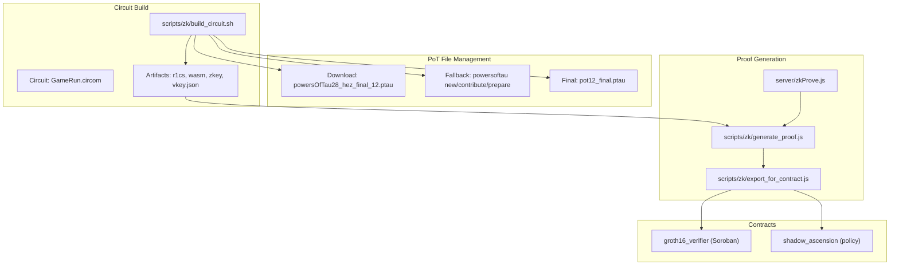
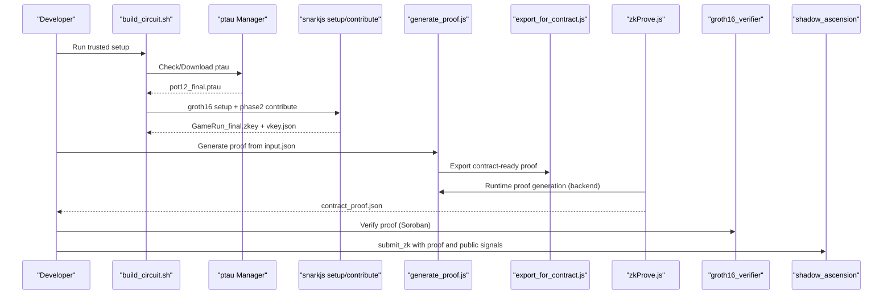
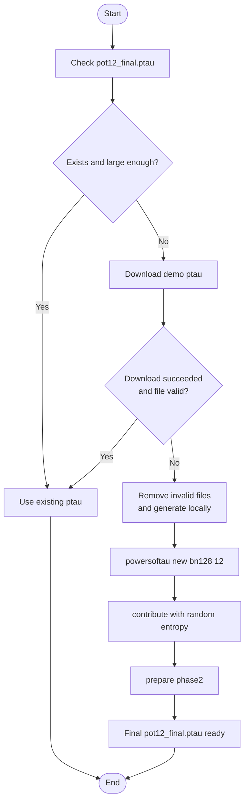
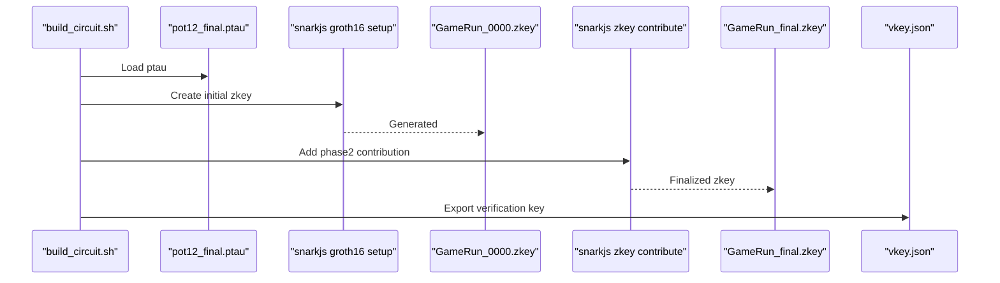
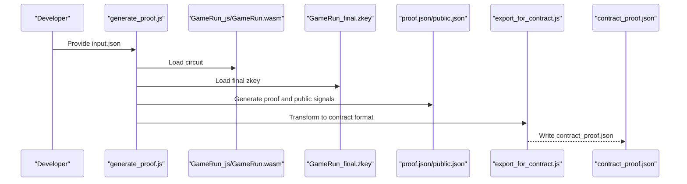
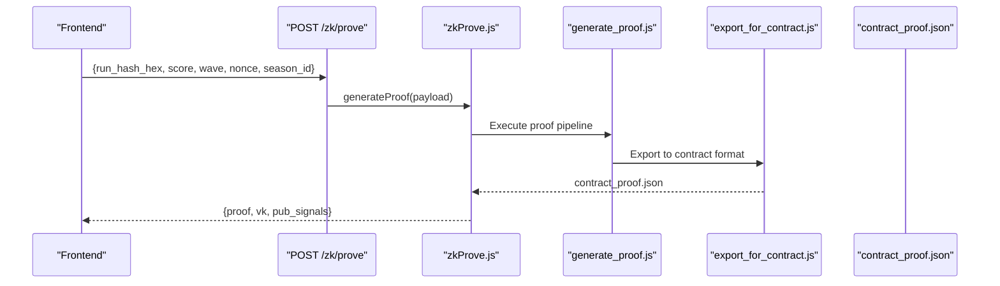
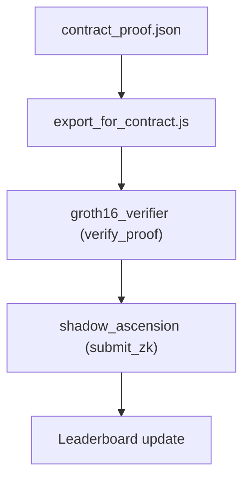
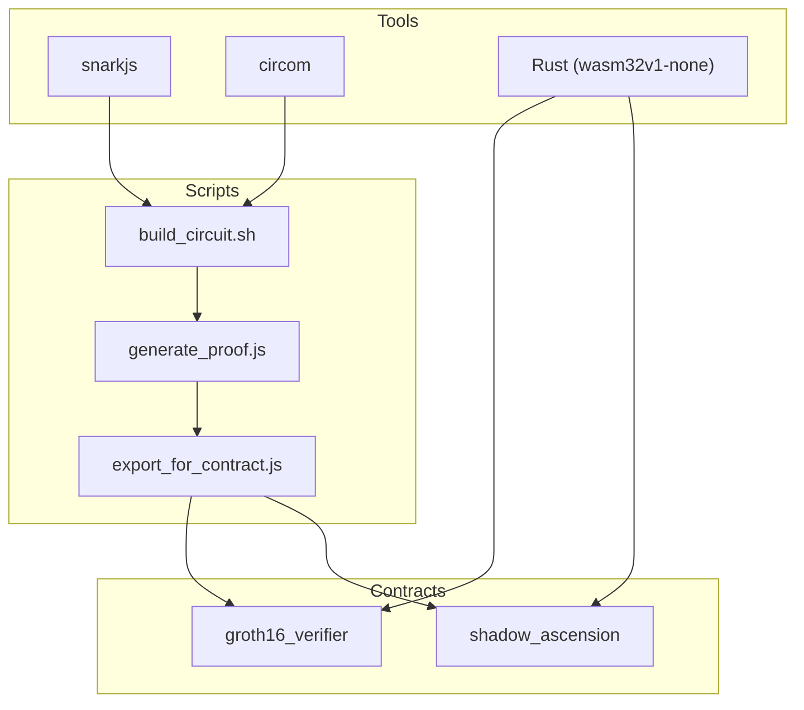

# Powers of Tau Ceremony

<cite>
**Referenced Files in This Document**
- [README.md](file://README.md)
- [SETUP.md](file://SETUP.md)
- [DEPLOY_ZK_STEPS.md](file://docs/DEPLOY_ZK_STEPS.md)
- [ZK_REAL_SETUP.md](file://docs/ZK_REAL_SETUP.md)
- [build_circuit.sh](file://scripts/zk/build_circuit.sh)
- [generate_proof.js](file://scripts/zk/generate_proof.js)
- [export_for_contract.js](file://scripts/zk/export_for_contract.js)
- [zkProve.js](file://server/zkProve.js)
- [Cargo.toml (groth16_verifier)](file://contracts/groth16_verifier/Cargo.toml)
- [lib.rs (groth16_verifier)](file://contracts/groth16_verifier/src/lib.rs)
- [Cargo.toml (shadow_ascension)](file://contracts/shadow_ascension/Cargo.toml)
- [tests.rs (shadow_ascension)](file://contracts/shadow_ascension/src/tests.rs)
- [index.html](file://index.html)
- [package.json](file://package.json)
</cite>

## Table of Contents
1. [Introduction](#introduction)
2. [Project Structure](#project-structure)
3. [Core Components](#core-components)
4. [Architecture Overview](#architecture-overview)
5. [Detailed Component Analysis](#detailed-component-analysis)
6. [Dependency Analysis](#dependency-analysis)
7. [Performance Considerations](#performance-considerations)
8. [Troubleshooting Guide](#troubleshooting-guide)
9. [Conclusion](#conclusion)
10. [Appendices](#appendices)

## Introduction
This document explains the Phase 2 powers of tau ceremony implementation used to produce the trusted setup artifacts for the Groth16 proving system in this project. It covers the trusted setup process, file management, ceremony workflow, automatic download of pre-generated ptau files, fallback local generation, verification procedures, and the snarkjs commands used for new ceremony, contribution, and phase2 preparation. It also documents security considerations, file integrity checks, troubleshooting failed downloads, and guidance for custom ceremony setup and alternative ptau sources.

## Project Structure
The powers of tau ceremony is orchestrated by a shell script that compiles the circuit, manages the ptau file lifecycle, and performs Groth16 setup and verification key export. Supporting scripts handle proof generation and contract export. The backend exposes an endpoint to generate proofs on demand.

**Diagram sources**
- [build_circuit.sh](file://scripts/zk/build_circuit.sh#L1-L57)
- [generate_proof.js](file://scripts/zk/generate_proof.js#L1-L46)
- [export_for_contract.js](file://scripts/zk/export_for_contract.js#L1-L95)
- [zkProve.js](file://server/zkProve.js#L1-L68)
- [lib.rs (groth16_verifier)](file://contracts/groth16_verifier/src/lib.rs#L43-L60)
- [Cargo.toml (groth16_verifier)](file://contracts/groth16_verifier/Cargo.toml#L1-L200)
- [Cargo.toml (shadow_ascension)](file://contracts/shadow_ascension/Cargo.toml#L1-L200)
- [tests.rs (shadow_ascension)](file://contracts/shadow_ascension/src/tests.rs#L321-L350)

**Section sources**
- [build_circuit.sh](file://scripts/zk/build_circuit.sh#L1-L57)
- [generate_proof.js](file://scripts/zk/generate_proof.js#L1-L46)
- [export_for_contract.js](file://scripts/zk/export_for_contract.js#L1-L95)
- [zkProve.js](file://server/zkProve.js#L1-L68)
- [lib.rs (groth16_verifier)](file://contracts/groth16_verifier/src/lib.rs#L43-L60)
- [Cargo.toml (groth16_verifier)](file://contracts/groth16_verifier/Cargo.toml#L1-L200)
- [Cargo.toml (shadow_ascension)](file://contracts/shadow_ascension/Cargo.toml#L1-L200)
- [tests.rs (shadow_ascension)](file://contracts/shadow_ascension/src/tests.rs#L321-L350)

## Core Components
- Powers of tau file manager and fallback generator: Ensures a valid ptau exists, downloads a small demo file if possible, otherwise generates locally using snarkjs.
- Groth16 trusted setup: Uses the ptau to generate initial zkey and contributes a random entropy phase2 contribution.
- Proof pipeline: Generates a Groth16 proof from the circuit and exports it in contract-ready format.
- Backend prover: Accepts runtime inputs, writes input.json, executes the proof pipeline, and returns a contract-ready payload.

Key responsibilities:
- Automatic download of a pre-generated ptau file for development/demo.
- Fallback local generation of the entire Phase 1 and Phase 2 ceremony.
- Verification of circuit build prerequisites and error handling.
- Export of proof, verification key, and public signals to the format expected by the on-chain verifier.

**Section sources**
- [build_circuit.sh](file://scripts/zk/build_circuit.sh#L33-L46)
- [generate_proof.js](file://scripts/zk/generate_proof.js#L32-L40)
- [export_for_contract.js](file://scripts/zk/export_for_contract.js#L65-L86)
- [zkProve.js](file://server/zkProve.js#L46-L67)

## Architecture Overview
The ceremony workflow integrates shell scripting, Node.js utilities, and Rust-based on-chain verification. The backend orchestrates runtime proof generation, while the frontend consumes the result to submit ranked runs.

**Diagram sources**
- [build_circuit.sh](file://scripts/zk/build_circuit.sh#L33-L51)
- [generate_proof.js](file://scripts/zk/generate_proof.js#L36-L44)
- [export_for_contract.js](file://scripts/zk/export_for_contract.js#L65-L86)
- [zkProve.js](file://server/zkProve.js#L46-L67)
- [lib.rs (groth16_verifier)](file://contracts/groth16_verifier/src/lib.rs#L43-L60)
- [tests.rs (shadow_ascension)](file://contracts/shadow_ascension/src/tests.rs#L321-L350)

## Detailed Component Analysis

### Powers of Tau File Management and Fallback Local Generation
The script ensures a valid ptau file exists:
- Checks for the presence and size of the final ptau file.
- Attempts to download a small, pre-generated ptau suitable for development/demo.
- Falls back to generating the entire ceremony locally using snarkjs commands for new, contribute, and prepare phase2.

**Diagram sources**
- [build_circuit.sh](file://scripts/zk/build_circuit.sh#L33-L46)

**Section sources**
- [build_circuit.sh](file://scripts/zk/build_circuit.sh#L33-L46)

### Trusted Setup and Phase 2 Preparation
The script performs:
- Groth16 setup using the ptau to create the initial zkey.
- A random phase2 contribution to finalize the trusted setup.
- Exports the verification key for on-chain use.

**Diagram sources**
- [build_circuit.sh](file://scripts/zk/build_circuit.sh#L48-L51)

**Section sources**
- [build_circuit.sh](file://scripts/zk/build_circuit.sh#L48-L51)

### Proof Generation Pipeline
The proof pipeline:
- Validates prerequisites (built circuit and input.json).
- Executes the full Groth16 proof generation.
- Exports the result into a contract-ready format with hex-encoded fields.

**Diagram sources**
- [generate_proof.js](file://scripts/zk/generate_proof.js#L36-L44)
- [export_for_contract.js](file://scripts/zk/export_for_contract.js#L65-L86)

**Section sources**
- [generate_proof.js](file://scripts/zk/generate_proof.js#L32-L44)
- [export_for_contract.js](file://scripts/zk/export_for_contract.js#L65-L86)

### Backend Runtime Proof Generation
The backend:
- Accepts a JSON payload with run metadata.
- Builds input.json from the request.
- Invokes the proof generation script.
- Returns a contract-ready proof payload.

**Diagram sources**
- [zkProve.js](file://server/zkProve.js#L46-L67)
- [generate_proof.js](file://scripts/zk/generate_proof.js#L36-L44)
- [export_for_contract.js](file://scripts/zk/export_for_contract.js#L65-L86)

**Section sources**
- [zkProve.js](file://server/zkProve.js#L15-L67)

### On-Chain Verification and Policy Integration
The on-chain verifier validates the exported proof against the verification key and public signals. The policy contract coordinates submission and enforces anti-replay and game rules.

**Diagram sources**
- [export_for_contract.js](file://scripts/zk/export_for_contract.js#L65-L86)
- [lib.rs (groth16_verifier)](file://contracts/groth16_verifier/src/lib.rs#L43-L60)
- [tests.rs (shadow_ascension)](file://contracts/shadow_ascension/src/tests.rs#L321-L350)

**Section sources**
- [export_for_contract.js](file://scripts/zk/export_for_contract.js#L65-L86)
- [lib.rs (groth16_verifier)](file://contracts/groth16_verifier/src/lib.rs#L43-L60)
- [tests.rs (shadow_ascension)](file://contracts/shadow_ascension/src/tests.rs#L321-L350)

## Dependency Analysis
The ceremony relies on external tools and libraries:
- snarkjs for powers of tau, Groth16 setup, and proof generation.
- Rust/Soroban toolchain for contract compilation and testing.
- Node.js utilities for orchestration and export.

**Diagram sources**
- [build_circuit.sh](file://scripts/zk/build_circuit.sh#L1-L57)
- [generate_proof.js](file://scripts/zk/generate_proof.js#L1-L46)
- [export_for_contract.js](file://scripts/zk/export_for_contract.js#L1-L95)
- [Cargo.toml (groth16_verifier)](file://contracts/groth16_verifier/Cargo.toml#L1-L200)
- [Cargo.toml (shadow_ascension)](file://contracts/shadow_ascension/Cargo.toml#L1-L200)

**Section sources**
- [build_circuit.sh](file://scripts/zk/build_circuit.sh#L1-L57)
- [generate_proof.js](file://scripts/zk/generate_proof.js#L1-L46)
- [export_for_contract.js](file://scripts/zk/export_for_contract.js#L1-L95)
- [Cargo.toml (groth16_verifier)](file://contracts/groth16_verifier/Cargo.toml#L1-L200)
- [Cargo.toml (shadow_ascension)](file://contracts/shadow_ascension/Cargo.toml#L1-L200)

## Performance Considerations
- The demo ptau is intentionally small to enable quick development iteration. For production, use a larger, multi-participant ceremony to avoid single-point-of-trust risks.
- Proof generation is CPU-intensive; ensure sufficient resources when running locally or in CI.
- The backend sets a timeout for proof generation to prevent long-running processes.

[No sources needed since this section provides general guidance]

## Troubleshooting Guide
Common issues and resolutions:
- Missing or invalid ptau:
  - The script removes files smaller than a threshold and attempts to download a demo ptau. If download fails, it falls back to local generation.
- snarkjs or circom not installed:
  - The script checks for required tools and exits with guidance if missing.
- Backend prerequisite not met:
  - The backend checks for the existence of the build directory and final zkey before generating a proof.
- Contract export format mismatches:
  - The export utility validates byte lengths and throws errors if mismatches are detected.

**Section sources**
- [build_circuit.sh](file://scripts/zk/build_circuit.sh#L16-L28)
- [build_circuit.sh](file://scripts/zk/build_circuit.sh#L33-L46)
- [zkProve.js](file://server/zkProve.js#L49-L54)
- [export_for_contract.js](file://scripts/zk/export_for_contract.js#L38-L63)

## Conclusion
The powers of tau ceremony in this project is designed for rapid development and demonstration while maintaining a clear path to production-grade security. The automated download and fallback mechanisms streamline setup, and the backend enables runtime proof generation for ranked submissions. Adhering to the documented security and integrity practices ensures reliable operation across environments.

[No sources needed since this section summarizes without analyzing specific files]

## Appendices

### Snarkjs Commands for Ceremony Workflow
- New Phase 1 ptau: powersoftau new bn128 12
- Phase 2 Contribution: zkey contribute (with random entropy)
- Prepare Phase 2: powersoftau prepare phase2
- Groth16 Setup: groth16 setup
- Export Verification Key: zkey export verificationkey

These commands are executed by the build script to manage the entire ceremony lifecycle.

**Section sources**
- [build_circuit.sh](file://scripts/zk/build_circuit.sh#L43-L45)
- [build_circuit.sh](file://scripts/zk/build_circuit.sh#L48-L51)

### Security Considerations
- Use a multi-participant, transparent powers of tau ceremony for production to eliminate single-party trust assumptions.
- Validate ptau integrity by checking file size and ensuring it exceeds a minimum threshold before use.
- Keep snarkjs and circom versions compatible with the circuit requirements.
- Restrict backend proof generation to authenticated clients and enforce rate limits.

**Section sources**
- [build_circuit.sh](file://scripts/zk/build_circuit.sh#L33-L46)
- [ZK_REAL_SETUP.md](file://docs/ZK_REAL_SETUP.md#L187-L192)

### File Integrity Checks
- The script removes and regenerates invalid or small ptau files.
- The export utility validates byte lengths for proof and verification key components.
- The backend validates the presence of required build artifacts before generating proofs.

**Section sources**
- [build_circuit.sh](file://scripts/zk/build_circuit.sh#L33-L46)
- [export_for_contract.js](file://scripts/zk/export_for_contract.js#L38-L63)
- [zkProve.js](file://server/zkProve.js#L49-L54)

### Custom Ceremony Setup and Alternative Ptau Sources
- Replace the demo ptau with a larger, community-provided ptau for production use.
- Ensure the replacement ptau matches the required degree and format.
- Verify compatibility with the circuit and snarkjs version used in the project.

**Section sources**
- [build_circuit.sh](file://scripts/zk/build_circuit.sh#L37-L38)
- [ZK_REAL_SETUP.md](file://docs/ZK_REAL_SETUP.md#L187-L192)