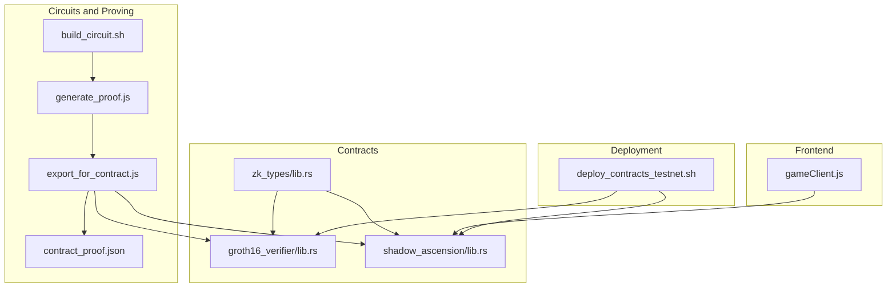
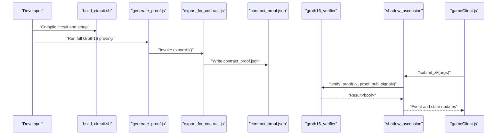
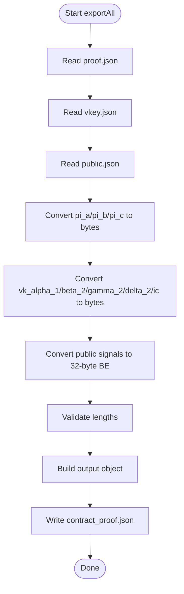
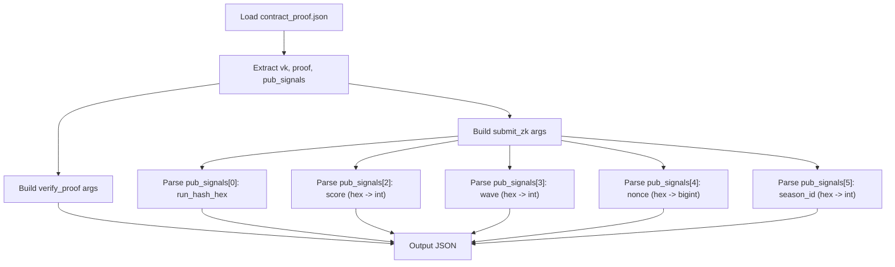
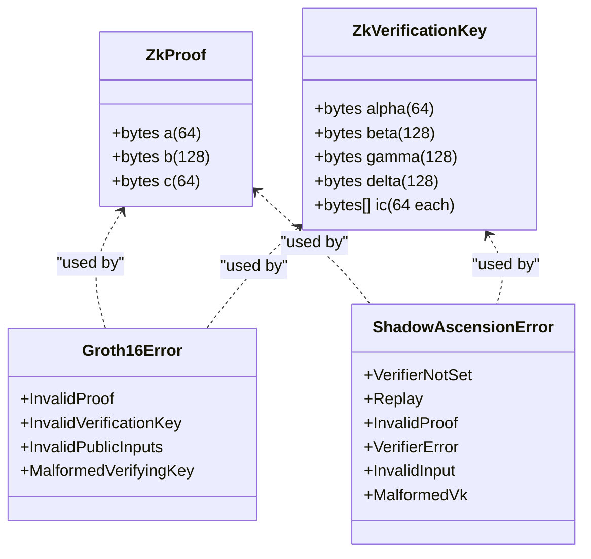
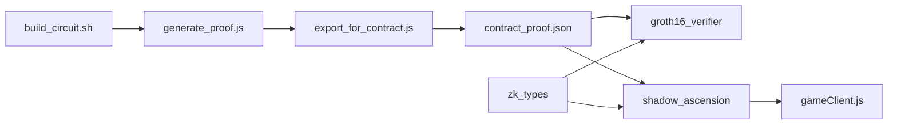

# Contract Export and ABI Generation

<cite>
**Referenced Files in This Document**
- [export_for_contract.js](file://scripts/zk/export_for_contract.js)
- [contract_args_from_proof.js](file://scripts/zk/contract_args_from_proof.js)
- [generate_proof.js](file://scripts/zk/generate_proof.js)
- [build_circuit.sh](file://scripts/zk/build_circuit.sh)
- [contract_proof.json](file://circuits/build/contract_proof.json)
- [input.json.example](file://circuits/input.json.example)
- [groth16_verifier/lib.rs](file://contracts/groth16_verifier/src/lib.rs)
- [shadow_ascension/lib.rs](file://contracts/shadow_ascension/src/lib.rs)
- [zk_types/lib.rs](file://contracts/zk_types/src/lib.rs)
- [gameClient.js](file://src/contracts/gameClient.js)
- [deploy_contracts_testnet.sh](file://scripts/deploy_contracts_testnet.sh)
</cite>

## Table of Contents
1. [Introduction](#introduction)
2. [Project Structure](#project-structure)
3. [Core Components](#core-components)
4. [Architecture Overview](#architecture-overview)
5. [Detailed Component Analysis](#detailed-component-analysis)
6. [Dependency Analysis](#dependency-analysis)
7. [Performance Considerations](#performance-considerations)
8. [Troubleshooting Guide](#troubleshooting-guide)
9. [Conclusion](#conclusion)
10. [Appendices](#appendices)

## Introduction
This document explains the contract export and ABI generation pipeline for the ZK-enabled game contracts. It covers how contract_proof.json is produced, how exportAll transforms Groth16 artifacts into a contract-ready format, and how arguments are prepared for smart contract deployment and invocation. It also documents the ABI structure, parameter mapping, and integration with Solidity contracts, along with the contract_args_from_proof.js utility, argument validation, and deployment preparation.

## Project Structure
The ZK workflow spans several directories and scripts:
- Circuits and proofs: circuits/build, scripts/zk
- Contracts: contracts/groth16_verifier, contracts/shadow_ascension, contracts/zk_types
- Frontend integration: src/contracts/gameClient.js
- Deployment: scripts/deploy_contracts_testnet.sh

**Diagram sources**
- [build_circuit.sh](file://scripts/zk/build_circuit.sh#L1-L57)
- [generate_proof.js](file://scripts/zk/generate_proof.js#L1-L46)
- [export_for_contract.js](file://scripts/zk/export_for_contract.js#L1-L95)
- [contract_proof.json](file://circuits/build/contract_proof.json#L1-L30)
- [groth16_verifier/lib.rs](file://contracts/groth16_verifier/src/lib.rs#L1-L61)
- [shadow_ascension/lib.rs](file://contracts/shadow_ascension/src/lib.rs#L1-L314)
- [zk_types/lib.rs](file://contracts/zk_types/src/lib.rs#L1-L44)
- [gameClient.js](file://src/contracts/gameClient.js#L1-L401)
- [deploy_contracts_testnet.sh](file://scripts/deploy_contracts_testnet.sh#L1-L70)

**Section sources**
- [build_circuit.sh](file://scripts/zk/build_circuit.sh#L1-L57)
- [generate_proof.js](file://scripts/zk/generate_proof.js#L1-L46)
- [export_for_contract.js](file://scripts/zk/export_for_contract.js#L1-L95)
- [contract_proof.json](file://circuits/build/contract_proof.json#L1-L30)
- [groth16_verifier/lib.rs](file://contracts/groth16_verifier/src/lib.rs#L1-L61)
- [shadow_ascension/lib.rs](file://contracts/shadow_ascension/src/lib.rs#L1-L314)
- [zk_types/lib.rs](file://contracts/zk_types/src/lib.rs#L1-L44)
- [gameClient.js](file://src/contracts/gameClient.js#L1-L401)
- [deploy_contracts_testnet.sh](file://scripts/deploy_contracts_testnet.sh#L1-L70)

## Core Components
- export_for_contract.js: Converts snarkjs Groth16 artifacts (proof.json, vkey.json, public.json) into a contract-proof-ready JSON (contract_proof.json). It maps BN254 curve points and scalars to fixed-size byte sequences and validates lengths.
- contract_args_from_proof.js: Builds Soroban invoke arguments from contract_proof.json, extracting vk, proof, pub_signals, and deriving typed parameters (score, wave, nonce, season_id) for verify_proof and submit_zk.
- generate_proof.js: Orchestrates full Groth16 proving and exports the result for contracts.
- contract_proof.json: The canonical contract-ready artifact containing hex-encoded proof, verification key, and public signals.
- groth16_verifier: A standalone contract that verifies Groth16 proofs against a verification key and public inputs.
- shadow_ascension: The game policy contract that integrates with the verifier, enforces anti-replay, and maintains leaderboards.
- zk_types: Shared types for ZK artifacts used by both contracts.
- gameClient.js: Frontend client that prepares ScVal arguments for submit_zk and invokes the contract.
- deploy_contracts_testnet.sh: Deploys both contracts to Soroban Testnet and initializes them.

**Section sources**
- [export_for_contract.js](file://scripts/zk/export_for_contract.js#L1-L95)
- [contract_args_from_proof.js](file://scripts/zk/contract_args_from_proof.js#L1-L46)
- [generate_proof.js](file://scripts/zk/generate_proof.js#L1-L46)
- [contract_proof.json](file://circuits/build/contract_proof.json#L1-L30)
- [groth16_verifier/lib.rs](file://contracts/groth16_verifier/src/lib.rs#L1-L61)
- [shadow_ascension/lib.rs](file://contracts/shadow_ascension/src/lib.rs#L1-L314)
- [zk_types/lib.rs](file://contracts/zk_types/src/lib.rs#L1-L44)
- [gameClient.js](file://src/contracts/gameClient.js#L1-L401)
- [deploy_contracts_testnet.sh](file://scripts/deploy_contracts_testnet.sh#L1-L70)

## Architecture Overview
The ZK export and ABI generation pipeline converts SNARK artifacts into a format consumable by the contracts and the frontend. The verifier contract performs BN254 pairing checks, while the policy contract orchestrates submission, anti-replay, and leaderboard updates.

**Diagram sources**
- [build_circuit.sh](file://scripts/zk/build_circuit.sh#L1-L57)
- [generate_proof.js](file://scripts/zk/generate_proof.js#L1-L46)
- [export_for_contract.js](file://scripts/zk/export_for_contract.js#L65-L86)
- [contract_proof.json](file://circuits/build/contract_proof.json#L1-L30)
- [groth16_verifier/lib.rs](file://contracts/groth16_verifier/src/lib.rs#L23-L56)
- [shadow_ascension/lib.rs](file://contracts/shadow_ascension/src/lib.rs#L159-L264)
- [gameClient.js](file://src/contracts/gameClient.js#L232-L273)

## Detailed Component Analysis

### contract_proof.json Creation and exportAll Functionality
- exportAll reads proof.json, vkey.json, and public.json from the build directory, converts each element to fixed-length byte arrays, and writes a contract-proof-ready JSON file.
- The conversion ensures BN254 compatibility: G1 points are 64 bytes (x||y), G2 points are 128 bytes (x0||x1||y0||y1 limb order), and scalars are 32 bytes big-endian.
- Length validations prevent mismatches during contract verification.

**Diagram sources**
- [export_for_contract.js](file://scripts/zk/export_for_contract.js#L38-L86)

**Section sources**
- [export_for_contract.js](file://scripts/zk/export_for_contract.js#L38-L86)
- [contract_proof.json](file://circuits/build/contract_proof.json#L1-L30)

### Argument Preparation for Smart Contract Deployment and Invocation
- contract_args_from_proof.js reads contract_proof.json and builds two argument sets:
  - verify_proof: vk, proof, pub_signals
  - submit_zk: vk, proof, pub_signals plus derived typed parameters (run_hash_hex, score, wave, nonce, season_id)
- The script parses hex-encoded public signals and converts them to integers or big integers as required by the contracts.

**Diagram sources**
- [contract_args_from_proof.js](file://scripts/zk/contract_args_from_proof.js#L16-L45)

**Section sources**
- [contract_args_from_proof.js](file://scripts/zk/contract_args_from_proof.js#L16-L45)

### ABI Structure and Parameter Mapping
- Shared types (zk_types):
  - ZkProof: three field elements packed as fixed-length bytes (a: 64, b: 128, c: 64)
  - ZkVerificationKey: alpha (64), beta (128), gamma (128), delta (128), ic (vector of 64-byte points)
  - Public inputs: vector of 32-byte field elements
- Contract signatures:
  - verify_proof(vk, proof, pub_signals) -> Result<bool, Groth16Error>
  - submit_zk(player, proof, vk, pub_signals, nonce, run_hash, season_id, score, wave) -> Result<(), ShadowAscensionError>
- Frontend argument construction:
  - gameClient.js converts hex-encoded values to Uint8Array and wraps them in xdr.ScVal for contract invocation.

**Diagram sources**
- [zk_types/lib.rs](file://contracts/zk_types/src/lib.rs#L27-L44)
- [groth16_verifier/lib.rs](file://contracts/groth16_verifier/src/lib.rs#L16-L25)
- [shadow_ascension/lib.rs](file://contracts/shadow_ascension/src/lib.rs#L12-L22)

**Section sources**
- [zk_types/lib.rs](file://contracts/zk_types/src/lib.rs#L1-L44)
- [groth16_verifier/lib.rs](file://contracts/groth16_verifier/src/lib.rs#L1-L61)
- [shadow_ascension/lib.rs](file://contracts/shadow_ascension/src/lib.rs#L1-L314)
- [gameClient.js](file://src/contracts/gameClient.js#L140-L200)

### Integration with Solidity Contracts
- The exported contract_proof.json aligns with Ethereum-compatible BN254 encodings (G1: 64 bytes, G2: 128 bytes, Fr: 32 bytes).
- Solidity contracts expecting Groth16 verification can consume vk.alpha, vk.beta, vk.gamma, vk.delta, vk.ic, and the flattened proof bytes.
- The public signals map to Solidity calldata fields, with each 32-byte element representing a scalar or hash.

[No sources needed since this section provides conceptual integration guidance]

### Example: Exported Contract Arguments
- contract_proof.json contains:
  - proof.a, proof.b, proof.c (hex-encoded)
  - vk.alpha, vk.beta, vk.gamma, vk.delta, vk.ic (hex-encoded)
  - pub_signals (array of hex-encoded 32-byte values)
- contract_args_from_proof.js demonstrates how to derive typed parameters from pub_signals for submit_zk.

**Section sources**
- [contract_proof.json](file://circuits/build/contract_proof.json#L1-L30)
- [contract_args_from_proof.js](file://scripts/zk/contract_args_from_proof.js#L33-L45)

### ABI Generation for Different Contract Types
- groth16_verifier ABI:
  - Method: verify_proof(vk, proof, pub_signals) -> bool
  - Inputs: vk (struct), proof (struct), pub_signals (bytes[])
- shadow_ascension ABI:
  - Methods: init(game_hub), set_verifier(verifier), start_match(player) -> u32, submit_result(player, wave, score) -> bool, submit_zk(...)
  - Inputs: player (Address), proof (ZkProof), vk (ZkVerificationKey), pub_signals (BytesN<32>[]), nonce (u64), run_hash (BytesN<32>), season_id (u32), score (u32), wave (u32)

**Section sources**
- [groth16_verifier/lib.rs](file://contracts/groth16_verifier/src/lib.rs#L23-L56)
- [shadow_ascension/lib.rs](file://contracts/shadow_ascension/src/lib.rs#L76-L295)
- [zk_types/lib.rs](file://contracts/zk_types/src/lib.rs#L27-L44)

### Integration with Deployment Scripts
- deploy_contracts_testnet.sh deploys both contracts to Soroban Testnet and initializes the policy contract with the game hub address, then sets the verifier contract address.
- After deployment, the policy contract ID is written to environment variables for frontend usage.

**Section sources**
- [deploy_contracts_testnet.sh](file://scripts/deploy_contracts_testnet.sh#L46-L70)

## Dependency Analysis
The pipeline exhibits clear separation of concerns:
- build_circuit.sh produces R1CS, WASM, and trusted setup outputs.
- generate_proof.js orchestrates proving and delegates export to export_for_contract.js.
- export_for_contract.js depends on zk_types for BN254 sizes and produces contract_proof.json.
- groth16_verifier consumes contract_proof.json to verify proofs.
- shadow_ascension consumes contract_proof.json to enforce policy and maintain leaderboards.
- gameClient.js constructs ScVal arguments for submit_zk and invokes the policy contract.

**Diagram sources**
- [build_circuit.sh](file://scripts/zk/build_circuit.sh#L1-L57)
- [generate_proof.js](file://scripts/zk/generate_proof.js#L1-L46)
- [export_for_contract.js](file://scripts/zk/export_for_contract.js#L1-L95)
- [contract_proof.json](file://circuits/build/contract_proof.json#L1-L30)
- [groth16_verifier/lib.rs](file://contracts/groth16_verifier/src/lib.rs#L1-L61)
- [shadow_ascension/lib.rs](file://contracts/shadow_ascension/src/lib.rs#L1-L314)
- [zk_types/lib.rs](file://contracts/zk_types/src/lib.rs#L1-L44)
- [gameClient.js](file://src/contracts/gameClient.js#L1-L401)

**Section sources**
- [build_circuit.sh](file://scripts/zk/build_circuit.sh#L1-L57)
- [generate_proof.js](file://scripts/zk/generate_proof.js#L1-L46)
- [export_for_contract.js](file://scripts/zk/export_for_contract.js#L1-L95)
- [contract_proof.json](file://circuits/build/contract_proof.json#L1-L30)
- [groth16_verifier/lib.rs](file://contracts/groth16_verifier/src/lib.rs#L1-L61)
- [shadow_ascension/lib.rs](file://contracts/shadow_ascension/src/lib.rs#L1-L314)
- [zk_types/lib.rs](file://contracts/zk_types/src/lib.rs#L1-L44)
- [gameClient.js](file://src/contracts/gameClient.js#L1-L401)

## Performance Considerations
- BN254 pairing operations dominate gas costs in the verifier. Use simulation to estimate costs before invoking.
- Minimize redundant conversions: ensure hex-to-bytes conversions happen once per argument.
- Keep public signals compact and aligned to 32-byte boundaries to reduce overhead.

[No sources needed since this section provides general guidance]

## Troubleshooting Guide
Common issues and resolutions:
- Missing contract_proof.json: Ensure generate_proof.js completes and writes contract_proof.json before invoking contract_args_from_proof.js.
- Mismatched VK and public signals: The verifier enforces ic length equals pub_signals length plus one; mismatches cause MalformedVerifyingKey.
- Invalid point encodings: Byte-length mismatches or malformed points lead to deserialization failures or incorrect pairing results.
- Frontend argument construction: Ensure hex strings are properly padded and converted to Uint8Array before wrapping in xdr.ScVal.

**Section sources**
- [contract_args_from_proof.js](file://scripts/zk/contract_args_from_proof.js#L11-L14)
- [groth16_verifier/lib.rs](file://contracts/groth16_verifier/src/lib.rs#L31-L33)
- [gameClient.js](file://src/contracts/gameClient.js#L123-L138)

## Conclusion
The contract export and ABI generation pipeline cleanly transforms SNARK artifacts into contract-ready formats, enabling secure and efficient ZK verification on Soroban. The shared zk_types define the ABI, while export_for_contract.js and contract_args_from_proof.js standardize argument preparation for both backend and frontend. Integration with deployment scripts and the frontend client completes the end-to-end workflow for ranked submissions.

[No sources needed since this section summarizes without analyzing specific files]

## Appendices

### Appendix A: Public Signals Mapping
- run_hash_hi: first public signal (32 bytes)
- run_hash_lo: second public signal (32 bytes)
- score: third public signal (hex -> u32)
- wave: fourth public signal (hex -> u32)
- nonce: fifth public signal (hex -> u64)
- season_id: sixth public signal (hex -> u32)

**Section sources**
- [contract_proof.json](file://circuits/build/contract_proof.json#L22-L29)
- [contract_args_from_proof.js](file://scripts/zk/contract_args_from_proof.js#L39-L44)

### Appendix B: Input Example
- input.json.example demonstrates the expected structure for generating a proof.

**Section sources**
- [input.json.example](file://circuits/input.json.example#L1-L9)