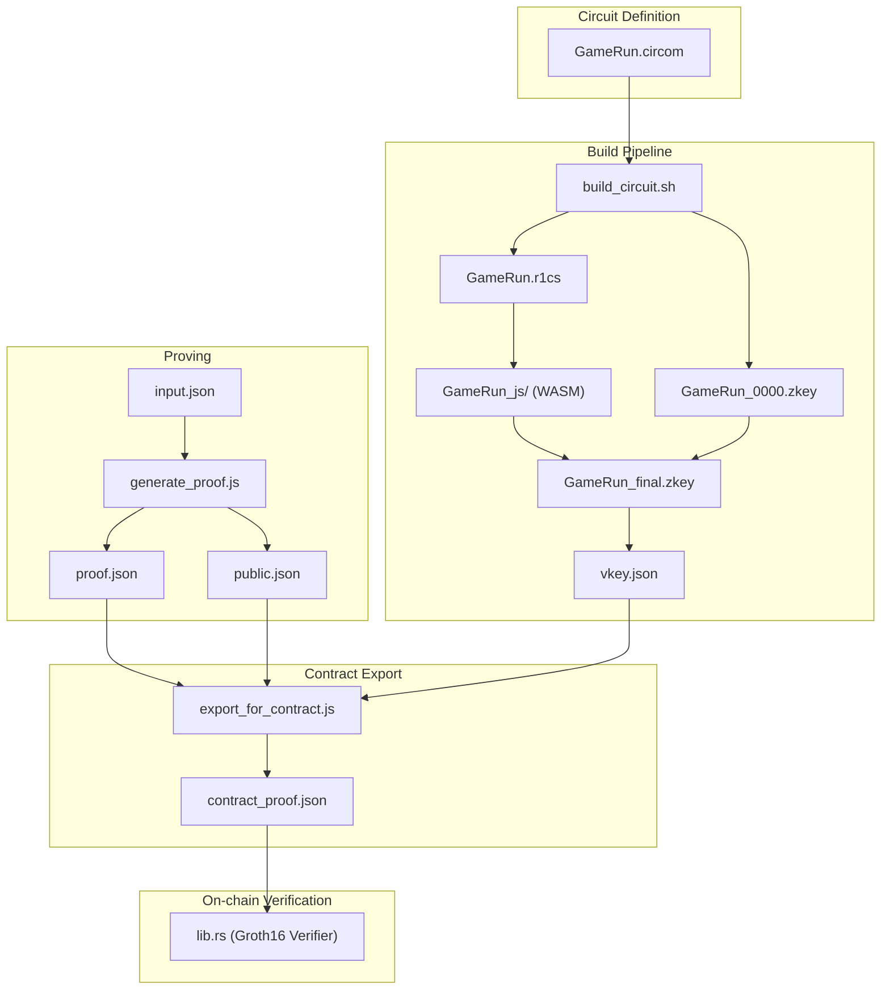
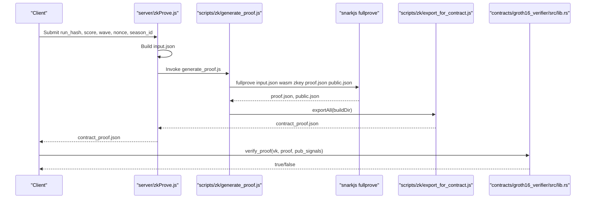
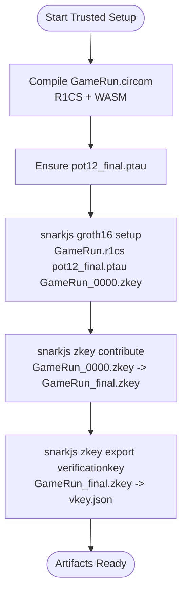
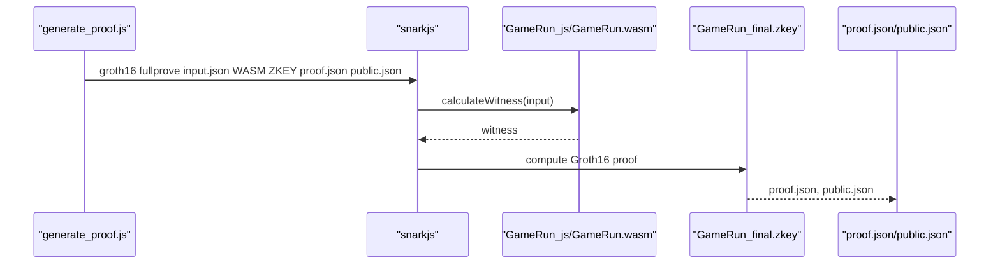
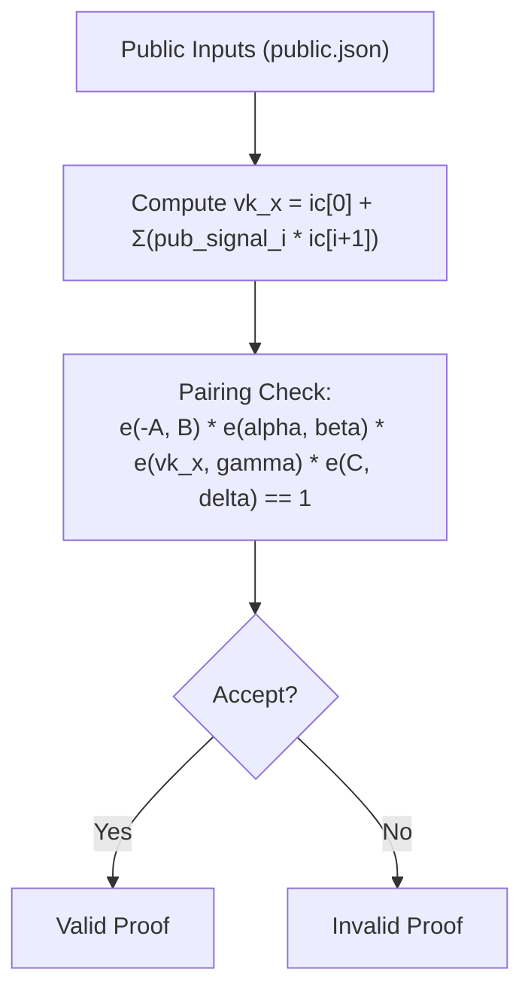
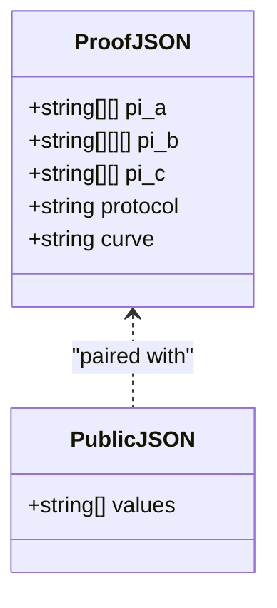
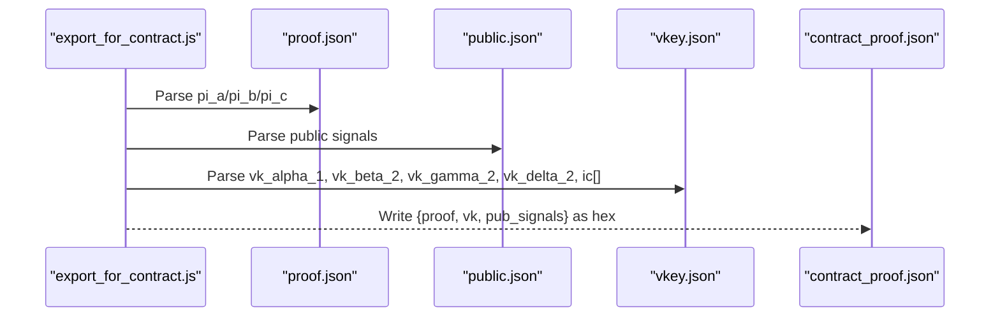
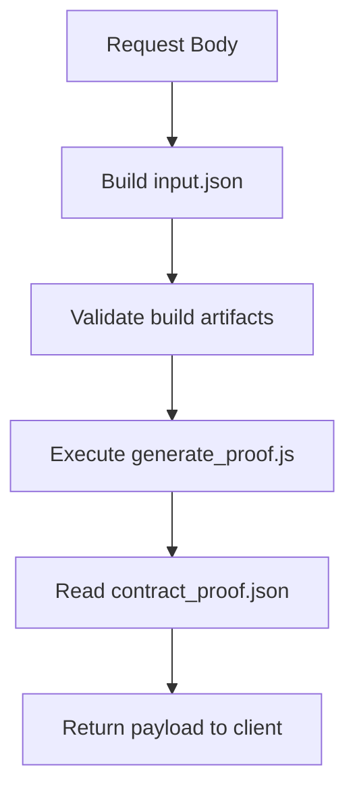
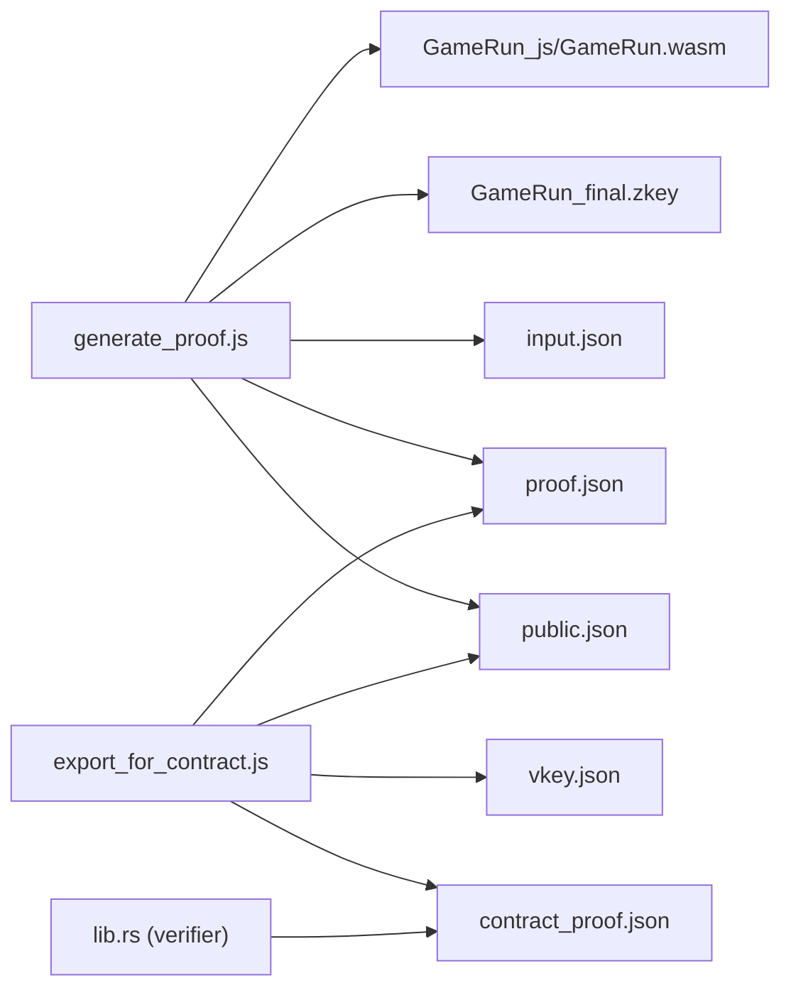

# Groth16 Proof Computation

<cite>
**Referenced Files in This Document**
- [generate_proof.js](file://scripts/zk/generate_proof.js)
- [export_for_contract.js](file://scripts/zk/export_for_contract.js)
- [build_circuit.sh](file://scripts/zk/build_circuit.sh)
- [GameRun.circom](file://circuits/GameRun.circom)
- [input.json](file://circuits/input.json)
- [proof.json](file://circuits/build/proof.json)
- [public.json](file://circuits/build/public.json)
- [vkey.json](file://circuits/build/vkey.json)
- [lib.rs](file://contracts/groth16_verifier/src/lib.rs)
- [zkProve.js](file://server/zkProve.js)
- [package.json](file://package.json)
- [E2E_VERIFICATION.md](file://docs/E2E_VERIFICATION.md)
- [witness_calculator.js](file://circuits/build/GameRun_js/witness_calculator.js)
</cite>

## Table of Contents
1. [Introduction](#introduction)
2. [Project Structure](#project-structure)
3. [Core Components](#core-components)
4. [Architecture Overview](#architecture-overview)
5. [Detailed Component Analysis](#detailed-component-analysis)
6. [Dependency Analysis](#dependency-analysis)
7. [Performance Considerations](#performance-considerations)
8. [Troubleshooting Guide](#troubleshooting-guide)
9. [Conclusion](#conclusion)
10. [Appendices](#appendices)

## Introduction
This document explains how Groth16 proofs are computed and verified in this project using snarkjs. It covers the fullprove command execution, the role of final zkey files, WASM circuit execution, and the mathematical foundations of Groth16. It documents the proof.json and public.json outputs, their structure, and how they are transformed for on-chain verification. It also includes performance considerations, memory requirements, and troubleshooting steps for common proof computation errors.

## Project Structure
The Groth16 workflow spans three stages:
- Trusted setup and circuit compilation
- Proof generation via fullprove
- Contract-ready export and verification

**Diagram sources**
- [build_circuit.sh](file://scripts/zk/build_circuit.sh#L1-L57)
- [GameRun.circom](file://circuits/GameRun.circom#L1-L34)
- [generate_proof.js](file://scripts/zk/generate_proof.js#L1-L46)
- [export_for_contract.js](file://scripts/zk/export_for_contract.js#L1-L95)
- [lib.rs](file://contracts/groth16_verifier/src/lib.rs#L1-L61)

**Section sources**
- [build_circuit.sh](file://scripts/zk/build_circuit.sh#L1-L57)
- [GameRun.circom](file://circuits/GameRun.circom#L1-L34)
- [generate_proof.js](file://scripts/zk/generate_proof.js#L1-L46)
- [export_for_contract.js](file://scripts/zk/export_for_contract.js#L1-L95)
- [lib.rs](file://contracts/groth16_verifier/src/lib.rs#L1-L61)

## Core Components
- Circuit definition: GameRun.circom defines the constraints and public outputs used in the Groth16 proof.
- Trusted setup: build_circuit.sh compiles the circuit, generates powers-of-tau, and produces the final zkey and verification key.
- Prover: generate_proof.js executes snarkjs fullprove to compute the proof and public signals.
- Exporter: export_for_contract.js converts snarkjs outputs into contract-ready hex-encoded buffers.
- Verifier: lib.rs implements the BN254 pairing check for Groth16 verification.

**Section sources**
- [GameRun.circom](file://circuits/GameRun.circom#L1-L34)
- [build_circuit.sh](file://scripts/zk/build_circuit.sh#L1-L57)
- [generate_proof.js](file://scripts/zk/generate_proof.js#L1-L46)
- [export_for_contract.js](file://scripts/zk/export_for_contract.js#L1-L95)
- [lib.rs](file://contracts/groth16_verifier/src/lib.rs#L1-L61)

## Architecture Overview
The end-to-end flow from input to on-chain verification:

**Diagram sources**
- [zkProve.js](file://server/zkProve.js#L1-L68)
- [generate_proof.js](file://scripts/zk/generate_proof.js#L1-L46)
- [export_for_contract.js](file://scripts/zk/export_for_contract.js#L1-L95)
- [lib.rs](file://contracts/groth16_verifier/src/lib.rs#L1-L61)

## Detailed Component Analysis

### Trusted Setup and Final ZKey Role
- The build pipeline compiles the circuit to R1CS and WASM, then performs Groth16 setup using a powers-of-tau file. A final zkey is produced by contributing to the initial zkey, enabling proof generation with the circuit’s parameters.
- The final zkey is required by fullprove and is paired with the exported verification key (vkey.json) for on-chain verification.

**Diagram sources**
- [build_circuit.sh](file://scripts/zk/build_circuit.sh#L1-L57)

**Section sources**
- [build_circuit.sh](file://scripts/zk/build_circuit.sh#L1-L57)
- [vkey.json](file://circuits/build/vkey.json)

### Fullprove Command Execution and WASM Circuit
- The prover script invokes snarkjs groth16 fullprove with input.json, the compiled WASM circuit, and the final zkey. This computes the Groth16 proof and writes proof.json and public.json.
- The WASM witness calculator is used internally by snarkjs to evaluate the circuit for the given inputs.

**Diagram sources**
- [generate_proof.js](file://scripts/zk/generate_proof.js#L36-L40)
- [witness_calculator.js](file://circuits/build/GameRun_js/witness_calculator.js#L176-L212)

**Section sources**
- [generate_proof.js](file://scripts/zk/generate_proof.js#L36-L40)
- [witness_calculator.js](file://circuits/build/GameRun_js/witness_calculator.js#L176-L212)

### Proof Generation Parameters and Mathematical Foundations
- Groth16 is a polynomial commitment scheme over BN254 (BN128 in some contexts). The proof consists of three elements in the underlying groups:
  - pi_a: G1 element
  - pi_b: G2 element
  - pi_c: G1 element
- The verification equation uses a pairing check involving the verification key (vk_alpha_1, vk_beta_2, vk_gamma_2, vk_delta_2) and the public inputs mapped via vk.ic.
- Public inputs are exposed by the circuit and included in public.json. The circuit GameRun exposes run identifiers, score, wave, nonce, and season_id.

**Diagram sources**
- [lib.rs](file://contracts/groth16_verifier/src/lib.rs#L20-L56)
- [public.json](file://circuits/build/public.json#L1-L8)
- [vkey.json](file://circuits/build/vkey.json)

**Section sources**
- [lib.rs](file://contracts/groth16_verifier/src/lib.rs#L18-L56)
- [GameRun.circom](file://circuits/GameRun.circom#L24-L31)
- [public.json](file://circuits/build/public.json#L1-L8)

### Output Files: proof.json and public.json
- proof.json contains the Groth16 proof with group elements encoded as big-endian decimal strings. It includes:
  - pi_a: G1 affine coordinates
  - pi_b: G2 matrix representation
  - pi_c: G1 affine coordinates
  - protocol and curve metadata
- public.json contains the circuit’s public signals as decimal strings. For GameRun, these correspond to run identifiers, score, wave, nonce, and season_id.

**Diagram sources**
- [proof.json](file://circuits/build/proof.json#L1-L28)
- [public.json](file://circuits/build/public.json#L1-L8)

**Section sources**
- [proof.json](file://circuits/build/proof.json#L1-L28)
- [public.json](file://circuits/build/public.json#L1-L8)

### Contract-Ready Export and On-chain Verification
- export_for_contract.js transforms snarkjs outputs into contract-friendly hex-encoded buffers:
  - Proof: a (64 bytes), b (128 bytes), c (64 bytes)
  - Verification key: alpha (64 bytes), beta (128 bytes), gamma (128 bytes), delta (128 bytes), ic[] (each 64 bytes)
  - Public signals: array of 32-byte big-endian field elements
- The Rust verifier performs the BN254 pairing check using these values.

**Diagram sources**
- [export_for_contract.js](file://scripts/zk/export_for_contract.js#L38-L86)
- [proof.json](file://circuits/build/proof.json#L1-L28)
- [public.json](file://circuits/build/public.json#L1-L8)
- [vkey.json](file://circuits/build/vkey.json)

**Section sources**
- [export_for_contract.js](file://scripts/zk/export_for_contract.js#L1-L95)
- [lib.rs](file://contracts/groth16_verifier/src/lib.rs#L18-L56)

### Server Integration for Proof Generation
- server/zkProve.js builds input.json from request data, validates prerequisites, executes the prover script, and returns the contract-ready proof payload.

**Diagram sources**
- [zkProve.js](file://server/zkProve.js#L15-L67)

**Section sources**
- [zkProve.js](file://server/zkProve.js#L1-L68)

## Dependency Analysis
- The prover depends on:
  - The compiled WASM circuit (GameRun_js/GameRun.wasm)
  - The final zkey (GameRun_final.zkey)
  - The input.json file
- The exporter depends on:
  - proof.json, public.json, and vkey.json
- The verifier depends on:
  - contract_proof.json (or equivalent) and the on-chain verification key

**Diagram sources**
- [generate_proof.js](file://scripts/zk/generate_proof.js#L1-L46)
- [export_for_contract.js](file://scripts/zk/export_for_contract.js#L1-L95)
- [lib.rs](file://contracts/groth16_verifier/src/lib.rs#L1-L61)

**Section sources**
- [generate_proof.js](file://scripts/zk/generate_proof.js#L1-L46)
- [export_for_contract.js](file://scripts/zk/export_for_contract.js#L1-L95)
- [lib.rs](file://contracts/groth16_verifier/src/lib.rs#L1-L61)

## Performance Considerations
- Memory and CPU:
  - WASM witness calculation and Groth16 proving are memory-intensive. Ensure sufficient RAM during fullprove.
  - The witness calculator reads and writes large arrays; performance scales with circuit size.
- Disk I/O:
  - The build pipeline downloads or generates large powers-of-tau files. Ensure disk space for .ptau and build artifacts.
- Network:
  - The server-side prover sets a timeout for the prover script execution to prevent hanging.
- Recommendations:
  - Precompile and cache artifacts (R1CS, WASM, zkeys) to avoid repeated setup.
  - Use optimized Node.js runtime and limit concurrent proof generations.

[No sources needed since this section provides general guidance]

## Troubleshooting Guide
Common issues and resolutions:
- Missing prerequisites:
  - Ensure the circuit is built and final zkey exists before invoking the prover.
  - Verify snarkjs and circom are installed and in PATH.
- Invalid input:
  - The prover script checks for the presence of input.json and the compiled R1CS. Ensure input.json conforms to the circuit’s expected fields.
- Proof generation failures:
  - Confirm the WASM circuit and final zkey match the input and circuit.
  - Check that the input values satisfy circuit constraints (e.g., score vs wave relationship).
- Export mismatches:
  - The exporter validates byte lengths for proof and verification key components. If mismatches occur, re-run fullprove and regenerate vkey.
- Verification failures:
  - Ensure the on-chain verification key matches the exported vkey.
  - Confirm public signals align with the verification key’s IC count.

**Section sources**
- [generate_proof.js](file://scripts/zk/generate_proof.js#L23-L30)
- [export_for_contract.js](file://scripts/zk/export_for_contract.js#L38-L58)
- [zkProve.js](file://server/zkProve.js#L46-L67)
- [E2E_VERIFICATION.md](file://docs/E2E_VERIFICATION.md#L18-L36)

## Conclusion
This project demonstrates a complete Groth16 pipeline: compiling the circuit, performing a trusted setup, generating a proof via fullprove, exporting contract-ready artifacts, and verifying on-chain. The design emphasizes correctness through strict input validation, clear separation of concerns, and robust error handling. Following the documented procedures ensures reliable proof computation and verification.

[No sources needed since this section summarizes without analyzing specific files]

## Appendices

### Appendix A: End-to-End Verification Checklist
- Automated end-to-end test:
  - Run the provided script to build the circuit, generate a real proof, and execute verifier tests.
- Manual verification:
  - Generate a contract-ready proof and run Rust contract tests for the verifier and policy.

**Section sources**
- [E2E_VERIFICATION.md](file://docs/E2E_VERIFICATION.md#L18-L36)

### Appendix B: Scripts and Commands
- Build circuit and setup:
  - Use the build script to compile the circuit and perform trusted setup.
- Generate proof:
  - Use the prover script to run fullprove and export contract-ready artifacts.
- Server-side generation:
  - Use the server module to accept request data, write input.json, and return contract_proof.json.

**Section sources**
- [build_circuit.sh](file://scripts/zk/build_circuit.sh#L1-L57)
- [generate_proof.js](file://scripts/zk/generate_proof.js#L1-L46)
- [zkProve.js](file://server/zkProve.js#L1-L68)
- [package.json](file://package.json#L18-L21)