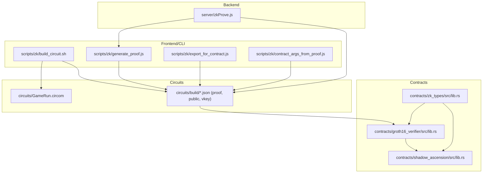
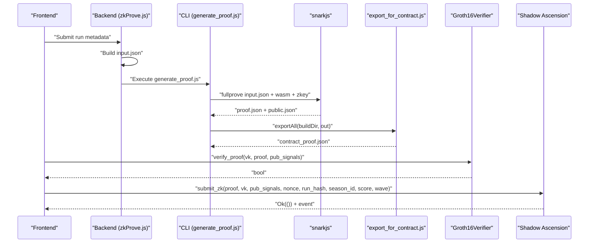
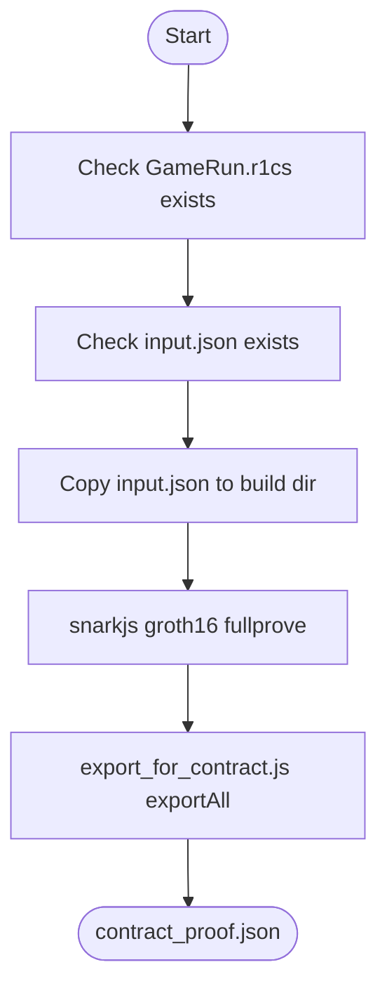
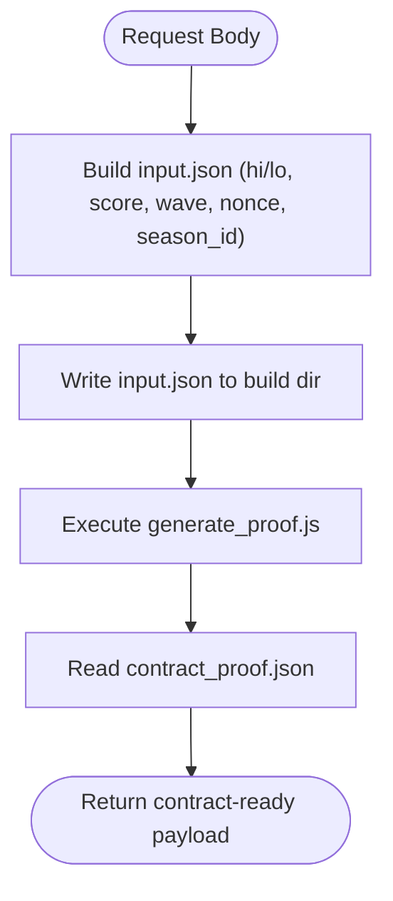
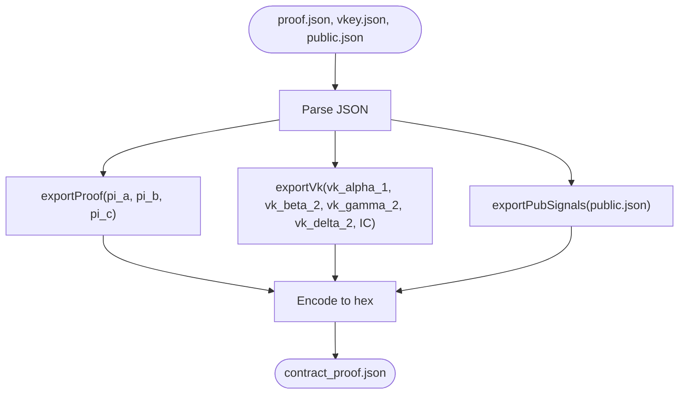
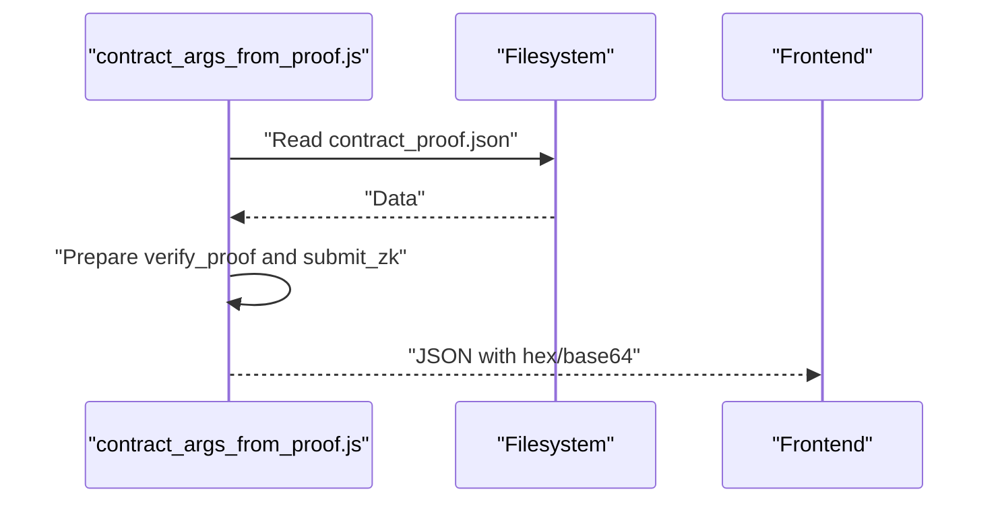
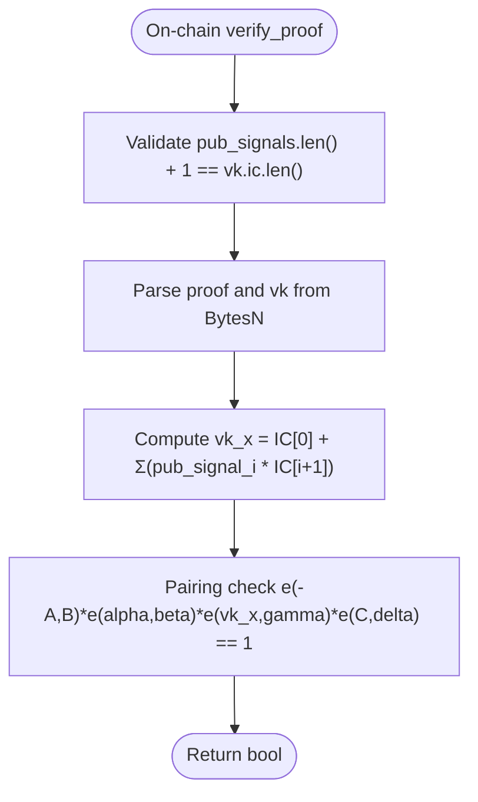
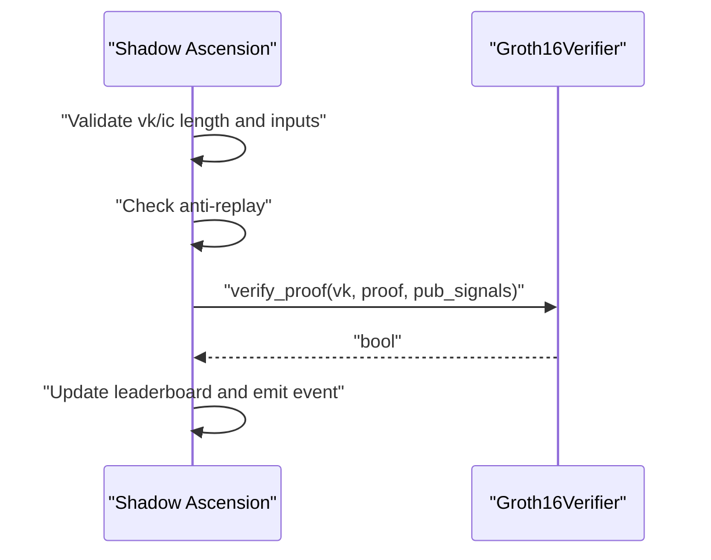
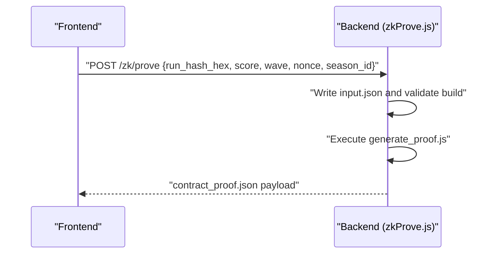
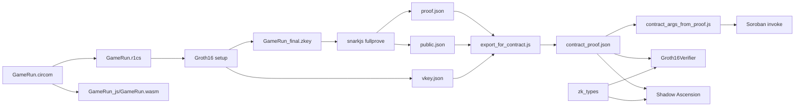

# Proof Generation and Export

<cite>
**Referenced Files in This Document**
- [generate_proof.js](file://scripts/zk/generate_proof.js)
- [export_for_contract.js](file://scripts/zk/export_for_contract.js)
- [contract_args_from_proof.js](file://scripts/zk/contract_args_from_proof.js)
- [build_circuit.sh](file://scripts/zk/build_circuit.sh)
- [GameRun.circom](file://circuits/GameRun.circom)
- [input.json.example](file://circuits/input.json.example)
- [proof.json](file://circuits/build/proof.json)
- [public.json](file://circuits/build/public.json)
- [vkey.json](file://circuits/build/vkey.json)
- [zkProve.js](file://server/zkProve.js)
- [gameProof.js](file://src/zk/gameProof.js)
- [lib.rs (Groth16 Verifier)](file://contracts/groth16_verifier/src/lib.rs)
- [lib.rs (Shadow Ascension)](file://contracts/shadow_ascension/src/lib.rs)
- [lib.rs (zk_types)](file://contracts/zk_types/src/lib.rs)
- [e2e_zk.sh](file://scripts/e2e_zk.sh)
- [ZK_REAL_SETUP.md](file://docs/ZK_REAL_SETUP.md)
- [gameClient.js](file://src/contracts/gameClient.js)
</cite>

## Table of Contents
1. [Introduction](#introduction)
2. [Project Structure](#project-structure)
3. [Core Components](#core-components)
4. [Architecture Overview](#architecture-overview)
5. [Detailed Component Analysis](#detailed-component-analysis)
6. [Dependency Analysis](#dependency-analysis)
7. [Performance Considerations](#performance-considerations)
8. [Troubleshooting Guide](#troubleshooting-guide)
9. [Conclusion](#conclusion)
10. [Appendices](#appendices)

## Introduction
This document explains the ZK proof generation and export workflow for the Cosmic Coder ranked submission system. It covers witness generation, snarkjs integration, Groth16 proof creation, exporting artifacts for contract deployment, ABI generation and argument preparation, verification on-chain, public input formatting, verification key extraction, optimization and batch processing strategies, error handling, and integration with backend ZK services.

## Project Structure
The ZK pipeline spans three layers:
- Frontend and CLI: scripts to build circuits, generate proofs, and prepare arguments for on-chain invocation.
- Backend: a Node service that orchestrates proof generation from request payloads.
- Contracts: Rust-based on-chain verifier and policy contract implementing anti-replay and leaderboard updates.

**Diagram sources**
- [build_circuit.sh](file://scripts/zk/build_circuit.sh#L1-L57)
- [generate_proof.js](file://scripts/zk/generate_proof.js#L1-L46)
- [export_for_contract.js](file://scripts/zk/export_for_contract.js#L1-L95)
- [contract_args_from_proof.js](file://scripts/zk/contract_args_from_proof.js#L1-L46)
- [zkProve.js](file://server/zkProve.js#L1-L68)
- [lib.rs (Groth16 Verifier)](file://contracts/groth16_verifier/src/lib.rs#L1-L61)
- [lib.rs (Shadow Ascension)](file://contracts/shadow_ascension/src/lib.rs#L1-L314)
- [lib.rs (zk_types)](file://contracts/zk_types/src/lib.rs#L1-L200)
- [GameRun.circom](file://circuits/GameRun.circom#L1-L34)
- [proof.json](file://circuits/build/proof.json#L1-L28)
- [public.json](file://circuits/build/public.json#L1-L8)
- [vkey.json](file://circuits/build/vkey.json#L1-L119)

**Section sources**
- [build_circuit.sh](file://scripts/zk/build_circuit.sh#L1-L57)
- [generate_proof.js](file://scripts/zk/generate_proof.js#L1-L46)
- [export_for_contract.js](file://scripts/zk/export_for_contract.js#L1-L95)
- [contract_args_from_proof.js](file://scripts/zk/contract_args_from_proof.js#L1-L46)
- [zkProve.js](file://server/zkProve.js#L1-L68)
- [lib.rs (Groth16 Verifier)](file://contracts/groth16_verifier/src/lib.rs#L1-L61)
- [lib.rs (Shadow Ascension)](file://contracts/shadow_ascension/src/lib.rs#L1-L314)
- [lib.rs (zk_types)](file://contracts/zk_types/src/lib.rs#L1-L200)
- [GameRun.circom](file://circuits/GameRun.circom#L1-L34)
- [proof.json](file://circuits/build/proof.json#L1-L28)
- [public.json](file://circuits/build/public.json#L1-L8)
- [vkey.json](file://circuits/build/vkey.json#L1-L119)

## Core Components
- Circuit definition: GameRun template defines six public inputs and enforces a score/wave rule.
- Trusted setup and proof generation: build_circuit.sh compiles the circuit and performs Groth16 setup; generate_proof.js runs snarkjs fullprove and exports artifacts.
- Contract export: export_for_contract.js converts snarkjs outputs to on-chain ABI-compatible formats.
- Argument preparation: contract_args_from_proof.js builds Soroban invoke arguments from contract_proof.json.
- Backend orchestration: zkProve.js writes input.json from request and invokes the CLI pipeline.
- On-chain verification: Groth16Verifier performs pairing checks; Shadow Ascension applies policy, anti-replay, and leaderboard updates.
- Types and ABI: zk_types defines ZkProof and ZkVerificationKey shapes and sizes for cross-contract compatibility.

**Section sources**
- [GameRun.circom](file://circuits/GameRun.circom#L1-L34)
- [build_circuit.sh](file://scripts/zk/build_circuit.sh#L1-L57)
- [generate_proof.js](file://scripts/zk/generate_proof.js#L1-L46)
- [export_for_contract.js](file://scripts/zk/export_for_contract.js#L1-L95)
- [contract_args_from_proof.js](file://scripts/zk/contract_args_from_proof.js#L1-L46)
- [zkProve.js](file://server/zkProve.js#L1-L68)
- [lib.rs (Groth16 Verifier)](file://contracts/groth16_verifier/src/lib.rs#L1-L61)
- [lib.rs (Shadow Ascension)](file://contracts/shadow_ascension/src/lib.rs#L1-L314)
- [lib.rs (zk_types)](file://contracts/zk_types/src/lib.rs#L1-L200)

## Architecture Overview
End-to-end flow from frontend to on-chain verification:

**Diagram sources**
- [zkProve.js](file://server/zkProve.js#L46-L67)
- [generate_proof.js](file://scripts/zk/generate_proof.js#L36-L45)
- [export_for_contract.js](file://scripts/zk/export_for_contract.js#L65-L86)
- [lib.rs (Groth16 Verifier)](file://contracts/groth16_verifier/src/lib.rs#L23-L56)
- [lib.rs (Shadow Ascension)](file://contracts/shadow_ascension/src/lib.rs#L159-L264)

## Detailed Component Analysis

### Witness Generation and snarkjs Integration
- The circuit compiles to R1CS and WASM, then Groth16 trusted setup produces a final zkey and verification key.
- The CLI copies the input.json into the build directory and runs snarkjs fullprove with the circuit WASM, zkey, and input to produce proof.json and public.json.
- The backend validates prerequisites and writes input.json from the request before invoking the CLI.

**Diagram sources**
- [generate_proof.js](file://scripts/zk/generate_proof.js#L23-L45)
- [build_circuit.sh](file://scripts/zk/build_circuit.sh#L30-L51)
- [export_for_contract.js](file://scripts/zk/export_for_contract.js#L65-L86)

**Section sources**
- [build_circuit.sh](file://scripts/zk/build_circuit.sh#L30-L51)
- [generate_proof.js](file://scripts/zk/generate_proof.js#L32-L45)
- [input.json.example](file://circuits/input.json.example#L1-L9)
- [proof.json](file://circuits/build/proof.json#L1-L28)
- [public.json](file://circuits/build/public.json#L1-L8)

### Proof Creation Using Groth16
- The backend constructs input.json from the request payload, ensuring run_hash is split into hi/lo, and normalizes numeric fields.
- It executes the CLI script with explicit timeout and captures the exported contract_proof.json for downstream use.

**Diagram sources**
- [zkProve.js](file://server/zkProve.js#L20-L67)

**Section sources**
- [zkProve.js](file://server/zkProve.js#L20-L67)

### Export Script Functionality for Contract Deployment
- Converts snarkjs outputs to on-chain ABI-compatible formats:
  - G1 points: two 32-byte big-endian limbs concatenated (64 bytes total).
  - G2 points: four 32-byte big-endian limbs in x0||x1||y0||y1 order (128 bytes total).
  - Public signals: 32-byte big-endian field elements.
- Produces a single contract_proof.json containing proof, vk, and pub_signals as hex strings.

**Diagram sources**
- [export_for_contract.js](file://scripts/zk/export_for_contract.js#L38-L86)
- [proof.json](file://circuits/build/proof.json#L1-L28)
- [vkey.json](file://circuits/build/vkey.json#L1-L119)
- [public.json](file://circuits/build/public.json#L1-L8)

**Section sources**
- [export_for_contract.js](file://scripts/zk/export_for_contract.js#L9-L86)
- [proof.json](file://circuits/build/proof.json#L1-L28)
- [vkey.json](file://circuits/build/vkey.json#L1-L119)
- [public.json](file://circuits/build/public.json#L1-L8)

### ABI Generation and Argument Preparation
- The argument script reads contract_proof.json and prepares two JSON blobs:
  - verify_proof: vk, proof, pub_signals for on-chain verifier testing.
  - submit_zk: adds derived fields (run_hash_hex from pub_signals[0], score, wave, nonce, season_id) for policy submission.
- The frontend can convert hex to Buffers/ScVal for Soroban SDK usage.

**Diagram sources**
- [contract_args_from_proof.js](file://scripts/zk/contract_args_from_proof.js#L16-L45)
- [export_for_contract.js](file://scripts/zk/export_for_contract.js#L65-L86)

**Section sources**
- [contract_args_from_proof.js](file://scripts/zk/contract_args_from_proof.js#L1-L46)
- [gameClient.js](file://src/contracts/gameClient.js#L123-L160)

### Proof Verification Process and Public Input Formatting
- On-chain verification uses the Groth16 pairing equation with vk_x computed as IC[0] + Σ(pub_signal_i * IC[i+1]).
- The verifier validates vk/ic length consistency and performs pairing checks.
- Public inputs are 32-byte field elements in big-endian order; the circuit exposes six public signals.

**Diagram sources**
- [lib.rs (Groth16 Verifier)](file://contracts/groth16_verifier/src/lib.rs#L23-L56)
- [vkey.json](file://circuits/build/vkey.json#L82-L119)
- [public.json](file://circuits/build/public.json#L1-L8)

**Section sources**
- [lib.rs (Groth16 Verifier)](file://contracts/groth16_verifier/src/lib.rs#L23-L56)
- [public.json](file://circuits/build/public.json#L1-L8)
- [vkey.json](file://circuits/build/vkey.json#L82-L119)

### Verification Key Extraction and On-chain Policy
- The backend exports vkey.json during setup; the CLI converts it to contract_proof.json.
- The policy contract enforces:
  - Verifier presence and vk/ic shape.
  - Non-zero score/wave.
  - Anti-replay using (player, nonce, season_id).
  - Leaderboard updates and event emission upon successful verification.

**Diagram sources**
- [lib.rs (Shadow Ascension)](file://contracts/shadow_ascension/src/lib.rs#L159-L264)
- [lib.rs (Groth16 Verifier)](file://contracts/groth16_verifier/src/lib.rs#L23-L56)

**Section sources**
- [lib.rs (Shadow Ascension)](file://contracts/shadow_ascension/src/lib.rs#L159-L264)
- [lib.rs (Groth16 Verifier)](file://contracts/groth16_verifier/src/lib.rs#L23-L56)

### Integration with Backend ZK Services
- The backend route builds input.json from request fields, validates prerequisites, executes the CLI pipeline, and returns contract-ready JSON.
- The frontend can call the backend to obtain a proof and then submit it to the policy contract.

**Diagram sources**
- [zkProve.js](file://server/zkProve.js#L46-L67)

**Section sources**
- [zkProve.js](file://server/zkProve.js#L46-L67)

### Examples of Proof Generation Scenarios
- Scenario A: Build circuit, generate a real proof, and run contract tests end-to-end.
- Scenario B: Use backend to generate a proof from a request payload and return contract-ready JSON.
- Scenario C: Prepare arguments for on-chain invocation using the argument script.

**Section sources**
- [e2e_zk.sh](file://scripts/e2e_zk.sh#L1-L22)
- [ZK_REAL_SETUP.md](file://docs/ZK_REAL_SETUP.md#L91-L101)
- [contract_args_from_proof.js](file://scripts/zk/contract_args_from_proof.js#L16-L45)

## Dependency Analysis
- Circuit to artifacts: GameRun.circom → R1CS/WASM → zkey/vkey.json → proof.json/public.json → contract_proof.json.
- CLI to contracts: export_for_contract.js depends on snarkjs outputs; contract_args_from_proof.js consumes contract_proof.json.
- Backend to CLI: zkProve.js writes input.json and invokes generate_proof.js.
- Contracts depend on zk_types for ABI-compatible types.

**Diagram sources**
- [GameRun.circom](file://circuits/GameRun.circom#L1-L34)
- [build_circuit.sh](file://scripts/zk/build_circuit.sh#L30-L51)
- [generate_proof.js](file://scripts/zk/generate_proof.js#L36-L45)
- [export_for_contract.js](file://scripts/zk/export_for_contract.js#L65-L86)
- [contract_args_from_proof.js](file://scripts/zk/contract_args_from_proof.js#L16-L45)
- [lib.rs (Groth16 Verifier)](file://contracts/groth16_verifier/src/lib.rs#L23-L56)
- [lib.rs (Shadow Ascension)](file://contracts/shadow_ascension/src/lib.rs#L159-L264)
- [lib.rs (zk_types)](file://contracts/zk_types/src/lib.rs#L1-L200)

**Section sources**
- [GameRun.circom](file://circuits/GameRun.circom#L1-L34)
- [build_circuit.sh](file://scripts/zk/build_circuit.sh#L30-L51)
- [generate_proof.js](file://scripts/zk/generate_proof.js#L36-L45)
- [export_for_contract.js](file://scripts/zk/export_for_contract.js#L65-L86)
- [contract_args_from_proof.js](file://scripts/zk/contract_args_from_proof.js#L16-L45)
- [lib.rs (Groth16 Verifier)](file://contracts/groth16_verifier/src/lib.rs#L23-L56)
- [lib.rs (Shadow Ascension)](file://contracts/shadow_ascension/src/lib.rs#L159-L264)
- [lib.rs (zk_types)](file://contracts/zk_types/src/lib.rs#L1-L200)

## Performance Considerations
- Circuit constraints: The GameRun circuit enforces score ≥ wave × 10 via GreaterEqThan, reducing invalid runs and minimizing downstream verification failures.
- Trusted setup: Use a production-grade multi-phase ceremony for ptau; the build script falls back to local generation for demos.
- Proof generation: snarkjs fullprove is CPU-intensive; cache inputs and reuse zkeys to avoid repeated setup.
- Batch processing: Group multiple runs with the same parameters to amortize setup costs; ensure unique nonces per batch submission.
- On-chain verification: Pairing checks are expensive; minimize unnecessary invocations by validating inputs off-chain first.

[No sources needed since this section provides general guidance]

## Troubleshooting Guide
Common issues and resolutions:
- Missing prerequisites: Ensure circom 2.x and snarkjs are installed and in PATH; the build script checks and installs as needed.
- Unbuilt circuit: Run the build script before generating proofs; the CLI checks for GameRun.r1cs and input.json.
- Incorrect input format: Follow input.json.example; run_hash must be 64 hex chars split into hi/lo.
- Byte order mismatches: The export script encodes G1/Fr big-endian and G2 as x0||x1||y0||y1; verify on-chain decoding aligns with zk_types sizes.
- Malformed VK: vk.ic must have len == pub_signals.len() + 1; otherwise, verification fails early.
- Anti-replay: Ensure nonce uniqueness per (player, season_id) to avoid replay errors.
- Backend timeouts: The backend sets a 60-second execution timeout for proof generation.

**Section sources**
- [build_circuit.sh](file://scripts/zk/build_circuit.sh#L16-L28)
- [generate_proof.js](file://scripts/zk/generate_proof.js#L23-L30)
- [export_for_contract.js](file://scripts/zk/export_for_contract.js#L22-L36)
- [lib.rs (Groth16 Verifier)](file://contracts/groth16_verifier/src/lib.rs#L31-L33)
- [lib.rs (Shadow Ascension)](file://contracts/shadow_ascension/src/lib.rs#L178-L201)
- [zkProve.js](file://server/zkProve.js#L58-L62)

## Conclusion
The ZK pipeline integrates a Circom circuit, snarkjs, and Rust contracts to enable provable, on-chain ranked submissions. The workflow supports both CLI-driven and backend-driven proof generation, robust export to on-chain ABI formats, and comprehensive error handling. By following the documented steps and leveraging the provided scripts and contracts, teams can reliably generate, verify, and submit ZK proofs for ranked leaderboards.

[No sources needed since this section summarizes without analyzing specific files]

## Appendices

### Appendix A: End-to-End Checklist
- Circuit: GameRun compiles with build_circuit.sh (r1cs, wasm, zkey, vkey.json).
- Proof: input.json + generate_proof.js → contract_proof.json succeeds.
- Verifier: stellar contract invoke --sim-only with contract_proof.json → true or no VK mismatch.
- Policy: submit_zk with unique nonce, coherent run_hash/season_id/score/wave → Ok(()); leaderboard updated and event emitted.
- Anti-replay: second submit_zk with same (player, nonce, season_id) → replay error.
- Frontend: manual submitZk with contract_proof.json reaches verifier and succeeds.
- Resources: documented CPU/memory simulation for real proof on testnet.

**Section sources**
- [ZK_REAL_SETUP.md](file://docs/ZK_REAL_SETUP.md#L177-L185)

### Appendix B: Public Inputs and Field Element Sizes
- Public signals: 32 bytes each (big-endian).
- G1: 64 bytes (x||y, each 32 bytes big-endian).
- G2: 128 bytes (x0||x1||y0||y1, each 32 bytes big-endian).
- zk_types defines G1_SIZE=64, G2_SIZE=128, FR_SIZE=32 for ABI compatibility.

**Section sources**
- [export_for_contract.js](file://scripts/zk/export_for_contract.js#L22-L36)
- [lib.rs (zk_types)](file://contracts/zk_types/src/lib.rs#L1-L200)