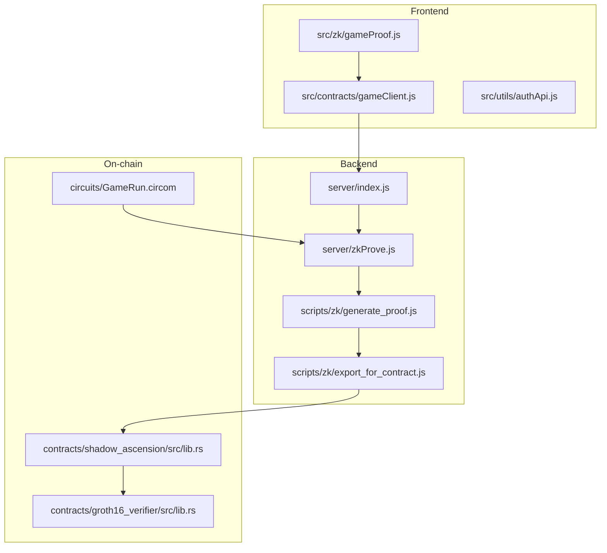
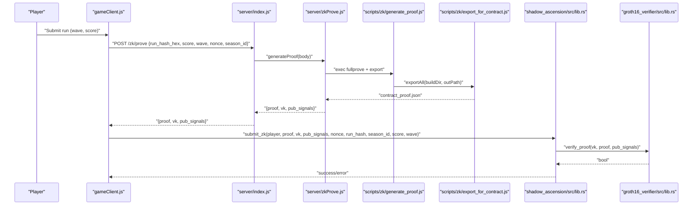
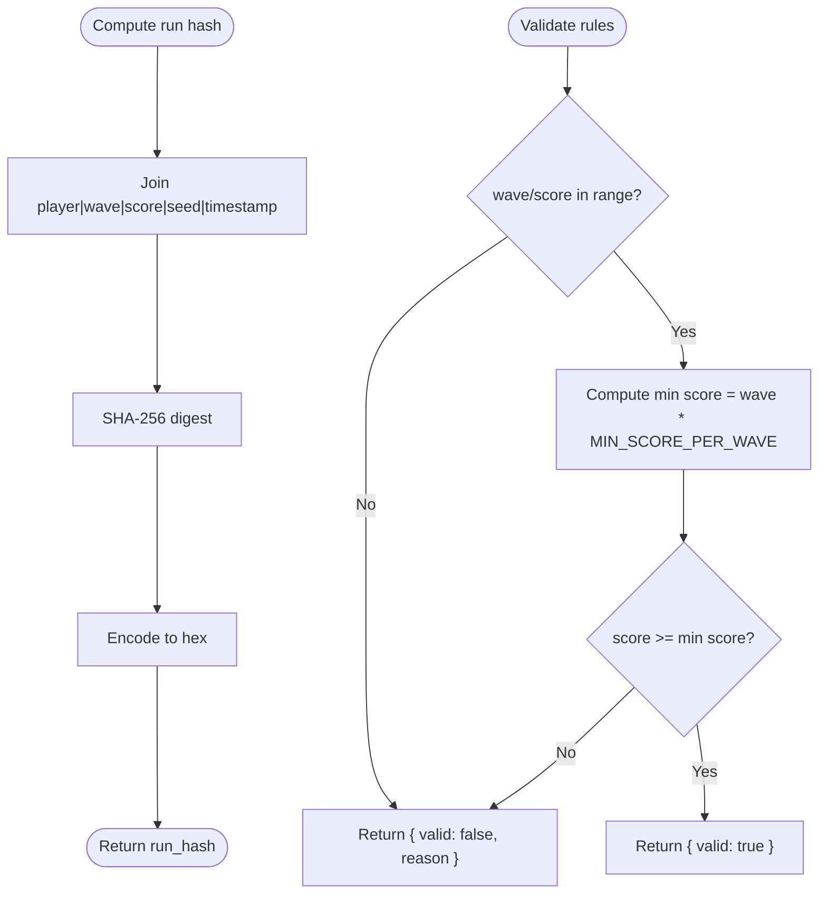
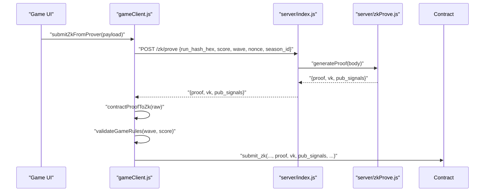
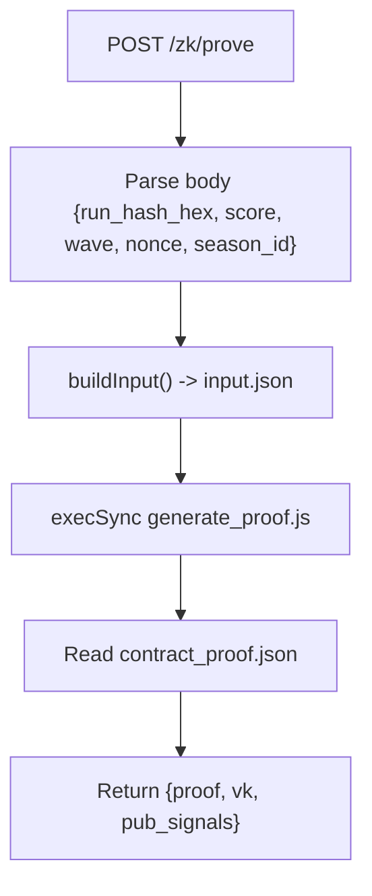
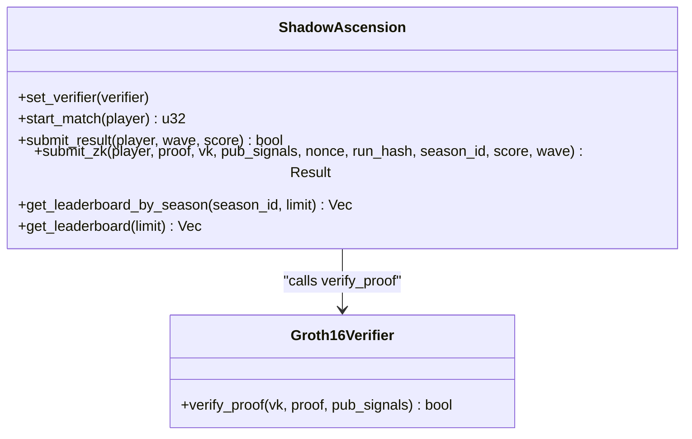
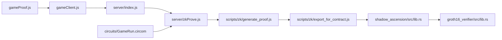

# Verification Integration and Backend Services

<cite>
**Referenced Files in This Document**
- [src/zk/gameProof.js](file://src/zk/gameProof.js)
- [server/zkProve.js](file://server/zkProve.js)
- [src/contracts/gameClient.js](file://src/contracts/gameClient.js)
- [server/index.js](file://server/index.js)
- [scripts/zk/generate_proof.js](file://scripts/zk/generate_proof.js)
- [scripts/zk/export_for_contract.js](file://scripts/zk/export_for_contract.js)
- [scripts/zk/contract_args_from_proof.js](file://scripts/zk/contract_args_from_proof.js)
- [contracts/shadow_ascension/src/lib.rs](file://contracts/shadow_ascension/src/lib.rs)
- [contracts/groth16_verifier/src/lib.rs](file://contracts/groth16_verifier/src/lib.rs)
- [circuits/GameRun.circom](file://circuits/GameRun.circom)
- [docs/E2E_VERIFICATION.md](file://docs/E2E_VERIFICATION.md)
- [docs/ZK_REAL_SETUP.md](file://docs/ZK_REAL_SETUP.md)
- [src/utils/authApi.js](file://src/utils/authApi.js)
- [src/utils/sep10StellarAuth.js](file://src/utils/sep10StellarAuth.js)
- [server/routes/auth.js](file://server/routes/auth.js)
</cite>

## Table of Contents
1. [Introduction](#introduction)
2. [Project Structure](#project-structure)
3. [Core Components](#core-components)
4. [Architecture Overview](#architecture-overview)
5. [Detailed Component Analysis](#detailed-component-analysis)
6. [Dependency Analysis](#dependency-analysis)
7. [Performance Considerations](#performance-considerations)
8. [Troubleshooting Guide](#troubleshooting-guide)
9. [Conclusion](#conclusion)
10. [Appendices](#appendices)

## Introduction
This document explains how the Vibe-Coder game integrates provable fairness using zero-knowledge proofs and integrates with backend verification services. It covers the end-to-end workflow from client-side run hashing and rule validation, to backend proof generation, to on-chain verification and leaderboard updates. It also documents the frontend contract client interactions, backend zkProve service, real-time verification processes, error handling, retry mechanisms, and performance optimization strategies. Integration patterns with the broader Vibe-Coder ecosystem (authentication, leaderboards, and events) are included.

## Project Structure
The verification pipeline spans three layers:
- Frontend client: computes run hashes, validates game rules, submits ZK runs, and interacts with the contract.
- Backend server: generates Groth16 proofs from submitted run metadata and returns contract-ready artifacts.
- On-chain contracts: a Groth16 verifier and a policy contract that validate proofs, enforce anti-replay, and maintain leaderboards.

**Diagram sources**
- [src/zk/gameProof.js](file://src/zk/gameProof.js#L1-L78)
- [src/contracts/gameClient.js](file://src/contracts/gameClient.js#L1-L401)
- [server/index.js](file://server/index.js#L196-L216)
- [server/zkProve.js](file://server/zkProve.js#L1-L68)
- [scripts/zk/generate_proof.js](file://scripts/zk/generate_proof.js#L1-L46)
- [scripts/zk/export_for_contract.js](file://scripts/zk/export_for_contract.js#L1-L95)
- [contracts/groth16_verifier/src/lib.rs](file://contracts/groth16_verifier/src/lib.rs#L1-L61)
- [contracts/shadow_ascension/src/lib.rs](file://contracts/shadow_ascension/src/lib.rs#L1-L314)
- [circuits/GameRun.circom](file://circuits/GameRun.circom#L1-L34)

**Section sources**
- [src/zk/gameProof.js](file://src/zk/gameProof.js#L1-L78)
- [src/contracts/gameClient.js](file://src/contracts/gameClient.js#L1-L401)
- [server/index.js](file://server/index.js#L196-L216)
- [server/zkProve.js](file://server/zkProve.js#L1-L68)
- [scripts/zk/generate_proof.js](file://scripts/zk/generate_proof.js#L1-L46)
- [scripts/zk/export_for_contract.js](file://scripts/zk/export_for_contract.js#L1-L95)
- [contracts/groth16_verifier/src/lib.rs](file://contracts/groth16_verifier/src/lib.rs#L1-L61)
- [contracts/shadow_ascension/src/lib.rs](file://contracts/shadow_ascension/src/lib.rs#L1-L314)
- [circuits/GameRun.circom](file://circuits/GameRun.circom#L1-L34)

## Core Components
- Client-side proof utilities:
  - Run hash computation, rule validation, and seed generation.
- Frontend contract client:
  - Wallet-aware invocation of contract methods, ZK proof request, and ZK submission.
- Backend proof generator:
  - Accepts run metadata, builds circuit input, executes proof generation, and returns contract-ready artifacts.
- On-chain verifier and policy:
  - Verifies Groth16 proofs, enforces anti-replay, and maintains leaderboards.
- Authentication and integration:
  - SEP-10 authentication for secure access and integration with the broader Vibe-Coder ecosystem.

**Section sources**
- [src/zk/gameProof.js](file://src/zk/gameProof.js#L1-L78)
- [src/contracts/gameClient.js](file://src/contracts/gameClient.js#L1-L401)
- [server/zkProve.js](file://server/zkProve.js#L1-L68)
- [contracts/groth16_verifier/src/lib.rs](file://contracts/groth16_verifier/src/lib.rs#L1-L61)
- [contracts/shadow_ascension/src/lib.rs](file://contracts/shadow_ascension/src/lib.rs#L1-L314)
- [src/utils/authApi.js](file://src/utils/authApi.js#L1-L184)
- [src/utils/sep10StellarAuth.js](file://src/utils/sep10StellarAuth.js#L1-L219)

## Architecture Overview
The verification workflow integrates frontend, backend, and on-chain components:

**Diagram sources**
- [src/contracts/gameClient.js](file://src/contracts/gameClient.js#L98-L121)
- [server/index.js](file://server/index.js#L196-L216)
- [server/zkProve.js](file://server/zkProve.js#L46-L67)
- [scripts/zk/generate_proof.js](file://scripts/zk/generate_proof.js#L36-L45)
- [scripts/zk/export_for_contract.js](file://scripts/zk/export_for_contract.js#L65-L86)
- [contracts/shadow_ascension/src/lib.rs](file://contracts/shadow_ascension/src/lib.rs#L156-L264)
- [contracts/groth16_verifier/src/lib.rs](file://contracts/groth16_verifier/src/lib.rs#L18-L57)

## Detailed Component Analysis

### Frontend: gameProof.js
Responsibilities:
- Compute run hash from player, wave, score, run seed, and timestamp.
- Validate game rules client-side before submission.
- Generate a cryptographically secure random run seed.

Key behaviors:
- Hash construction uses a deterministic separator and SHA-256.
- Rule validation enforces sane bounds and progression rules.
- Seed generation uses the Web Crypto API.

**Diagram sources**
- [src/zk/gameProof.js](file://src/zk/gameProof.js#L29-L63)

**Section sources**
- [src/zk/gameProof.js](file://src/zk/gameProof.js#L1-L78)

### Frontend: gameClient.js
Responsibilities:
- Build and sign contract invocations using Stellar SDK.
- Request ZK proof from backend and normalize proof artifacts to on-chain compatible formats.
- Submit ZK runs to the policy contract with anti-replay and rule enforcement.

Integration highlights:
- Environment-driven contract ID and prover URL.
- Wallet signing via a passed-in function.
- Conversion helpers for proof, verification key, and public signals to ScVal-compatible structures.
- Anti-replay and rule checks before invoking submit_zk.

**Diagram sources**
- [src/contracts/gameClient.js](file://src/contracts/gameClient.js#L98-L121)
- [src/contracts/gameClient.js](file://src/contracts/gameClient.js#L258-L273)
- [src/contracts/gameClient.js](file://src/contracts/gameClient.js#L228-L230)
- [server/index.js](file://server/index.js#L196-L216)
- [server/zkProve.js](file://server/zkProve.js#L46-L67)

**Section sources**
- [src/contracts/gameClient.js](file://src/contracts/gameClient.js#L1-L401)

### Backend: server/zkProve.js
Responsibilities:
- Parse and sanitize request payload.
- Build circuit input.json from run metadata.
- Execute proof generation script synchronously.
- Return contract-ready proof artifact.

Behavioral notes:
- Validates presence of build artifacts and throws descriptive errors.
- Uses a strict timeout for proof generation.
- Returns structured JSON consumable by the frontend.

**Diagram sources**
- [server/index.js](file://server/index.js#L196-L216)
- [server/zkProve.js](file://server/zkProve.js#L20-L39)
- [server/zkProve.js](file://server/zkProve.js#L46-L67)
- [scripts/zk/generate_proof.js](file://scripts/zk/generate_proof.js#L36-L45)

**Section sources**
- [server/zkProve.js](file://server/zkProve.js#L1-L68)
- [server/index.js](file://server/index.js#L196-L216)

### Backend: scripts/zk/generate_proof.js and export_for_contract.js
Responsibilities:
- Execute snarkjs fullprove with circuit wasm and final zkey.
- Export BN254-encoded artifacts to contract-ready JSON.

Key points:
- Ensures circuit build exists and input.json is present.
- Converts Groth16 proof and verification key to hex-encoded bytes aligned with Soroban BN254 expectations.
- Exports public signals as 32-byte big-endian buffers.

**Section sources**
- [scripts/zk/generate_proof.js](file://scripts/zk/generate_proof.js#L1-L46)
- [scripts/zk/export_for_contract.js](file://scripts/zk/export_for_contract.js#L1-L95)

### Contracts: groth16_verifier and shadow_ascension
Responsibilities:
- Verifier: performs BN254 pairing check against vk, proof, and public signals.
- Policy: sets verifier, validates anti-replay, enforces rule checks, invokes hub on end_game, updates per-season leaderboard, and emits events.

**Diagram sources**
- [contracts/groth16_verifier/src/lib.rs](file://contracts/groth16_verifier/src/lib.rs#L18-L57)
- [contracts/shadow_ascension/src/lib.rs](file://contracts/shadow_ascension/src/lib.rs#L74-L294)

**Section sources**
- [contracts/groth16_verifier/src/lib.rs](file://contracts/groth16_verifier/src/lib.rs#L1-L61)
- [contracts/shadow_ascension/src/lib.rs](file://contracts/shadow_ascension/src/lib.rs#L1-L314)

### Circuit: GameRun.circom
Responsibilities:
- Enforce the rule that score must be greater than or equal to wave times a constant.
- Expose run_hash (split into hi/lo), score, wave, nonce, and season_id as public signals.

**Section sources**
- [circuits/GameRun.circom](file://circuits/GameRun.circom#L1-L34)

### Authentication and Ecosystem Integration
- SEP-10 authentication APIs for challenge and token exchange.
- Frontend utilities to manage JWT lifecycle and authenticated requests.
- Integration with Vibe-Coder’s broader systems (leaderboards, events, progress).

**Section sources**
- [src/utils/authApi.js](file://src/utils/authApi.js#L1-L184)
- [src/utils/sep10StellarAuth.js](file://src/utils/sep10StellarAuth.js#L1-L219)
- [server/routes/auth.js](file://server/routes/auth.js#L1-L157)

## Dependency Analysis
High-level dependencies:
- Frontend client depends on:
  - gameProof.js for run hash and rule validation.
  - server/zkProve.js via HTTP route server/index.js.
  - On-chain contracts via Stellar SDK.
- Backend depends on:
  - scripts/zk/generate_proof.js and export_for_contract.js.
  - snarkjs and circom toolchain availability.
- On-chain contracts depend on:
  - zk_types shared types and Soroban SDK.
  - Groth16 verifier for BN254 pairing verification.

**Diagram sources**
- [src/zk/gameProof.js](file://src/zk/gameProof.js#L1-L78)
- [src/contracts/gameClient.js](file://src/contracts/gameClient.js#L1-L401)
- [server/index.js](file://server/index.js#L196-L216)
- [server/zkProve.js](file://server/zkProve.js#L1-L68)
- [scripts/zk/generate_proof.js](file://scripts/zk/generate_proof.js#L1-L46)
- [scripts/zk/export_for_contract.js](file://scripts/zk/export_for_contract.js#L1-L95)
- [contracts/shadow_ascension/src/lib.rs](file://contracts/shadow_ascension/src/lib.rs#L1-L314)
- [contracts/groth16_verifier/src/lib.rs](file://contracts/groth16_verifier/src/lib.rs#L1-L61)
- [circuits/GameRun.circom](file://circuits/GameRun.circom#L1-L34)

**Section sources**
- [src/zk/gameProof.js](file://src/zk/gameProof.js#L1-L78)
- [src/contracts/gameClient.js](file://src/contracts/gameClient.js#L1-L401)
- [server/zkProve.js](file://server/zkProve.js#L1-L68)
- [scripts/zk/generate_proof.js](file://scripts/zk/generate_proof.js#L1-L46)
- [scripts/zk/export_for_contract.js](file://scripts/zk/export_for_contract.js#L1-L95)
- [contracts/shadow_ascension/src/lib.rs](file://contracts/shadow_ascension/src/lib.rs#L1-L314)
- [contracts/groth16_verifier/src/lib.rs](file://contracts/groth16_verifier/src/lib.rs#L1-L61)
- [circuits/GameRun.circom](file://circuits/GameRun.circom#L1-L34)

## Performance Considerations
- Proof generation cost:
  - snarkjs fullprove is computationally intensive; avoid frequent repeated generation.
  - Cache or reuse run metadata to minimize redundant requests.
- Backend timeouts:
  - The backend enforces a strict timeout during proof generation; ensure adequate resources and consider async job queues for heavy loads.
- Frontend UX:
  - Show loading states while requesting proofs and submitting transactions.
  - Debounce repeated submissions and enforce client-side rule checks to reduce unnecessary backend calls.
- On-chain costs:
  - Use simulation where appropriate to estimate fees and gas before submission.
  - Batch leaderboard reads and writes to reduce event churn.

[No sources needed since this section provides general guidance]

## Troubleshooting Guide
Common issues and resolutions:
- Backend circuit build missing:
  - Ensure circuits are built and final zkey exists; otherwise, the backend throws a descriptive error.
- Invalid run hash or payload:
  - Confirm run_hash_hex is 64 hex characters and fields are properly sanitized.
- Proof generation failure:
  - Verify snarkjs and circom are installed and in PATH; check logs for toolchain errors.
- On-chain verification failures:
  - Validate vk/ic length alignment and public signals count; ensure run_hash, nonce, and season_id match the circuit inputs.
- Anti-replay errors:
  - Nonce must be unique per player and season; increment or derive from run seed/timestamp.
- Frontend submission errors:
  - Ensure contract ID and prover URL are configured; verify wallet connectivity and signatures.

**Section sources**
- [server/zkProve.js](file://server/zkProve.js#L49-L54)
- [server/index.js](file://server/index.js#L196-L216)
- [src/contracts/gameClient.js](file://src/contracts/gameClient.js#L225-L230)
- [contracts/shadow_ascension/src/lib.rs](file://contracts/shadow_ascension/src/lib.rs#L178-L188)

## Conclusion
The Vibe-Coder verification pipeline combines client-side run hashing and rule validation, backend proof generation, and on-chain Groth16 verification to deliver provable fairness. The frontend contract client seamlessly integrates with the backend prover and on-chain contracts, while authentication and ecosystem services support a cohesive user experience. Robust error handling, anti-replay protections, and performance optimizations ensure reliable operation across environments.

[No sources needed since this section summarizes without analyzing specific files]

## Appendices

### End-to-End Verification Checklist
- Circuit compiles and trusted setup completes.
- Real proof generation succeeds and exports contract-ready JSON.
- Verifier simulates successfully with exported artifacts.
- Policy accepts submit_zk with correct inputs and updates leaderboard.
- Anti-replay prevents duplicate submissions.
- Frontend integration shows ZK leaderboard updates.

**Section sources**
- [docs/E2E_VERIFICATION.md](file://docs/E2E_VERIFICATION.md#L1-L68)
- [docs/ZK_REAL_SETUP.md](file://docs/ZK_REAL_SETUP.md#L1-L192)