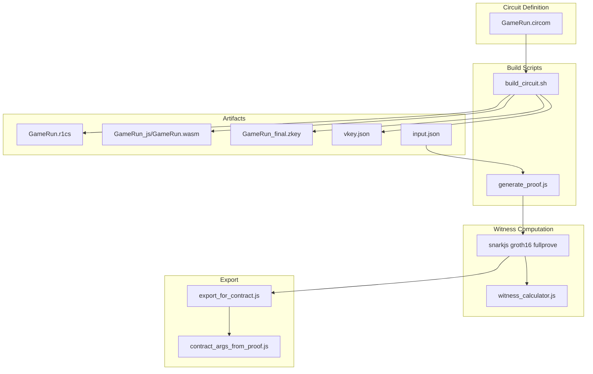
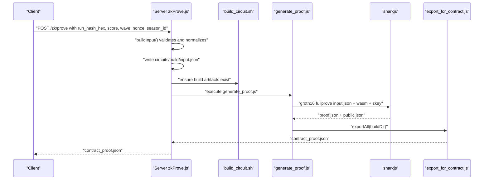
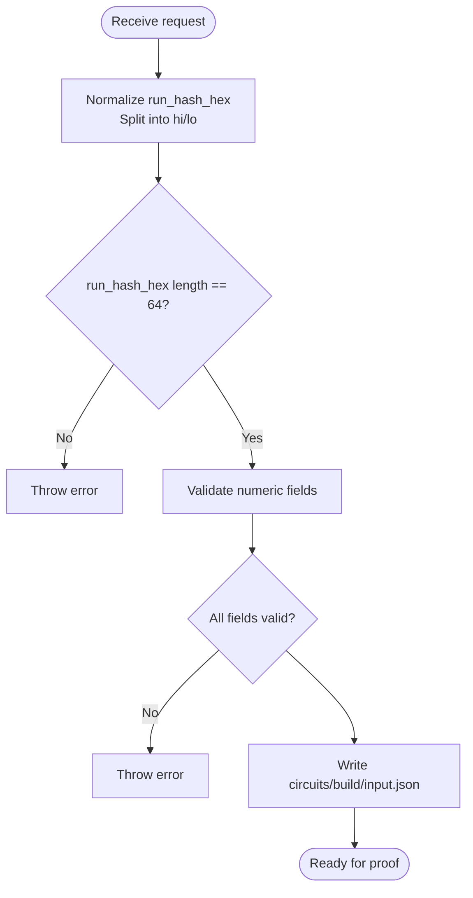
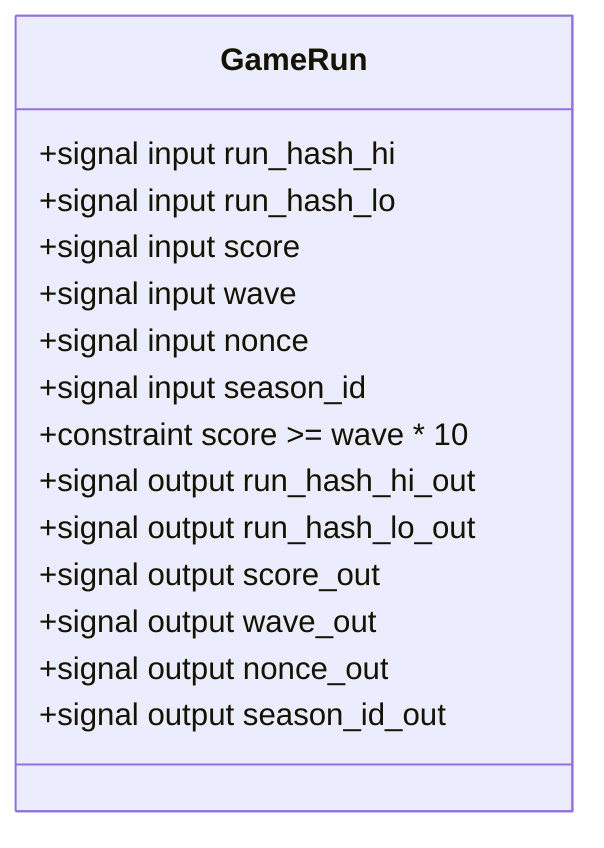
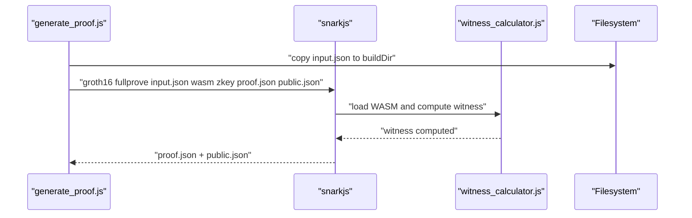
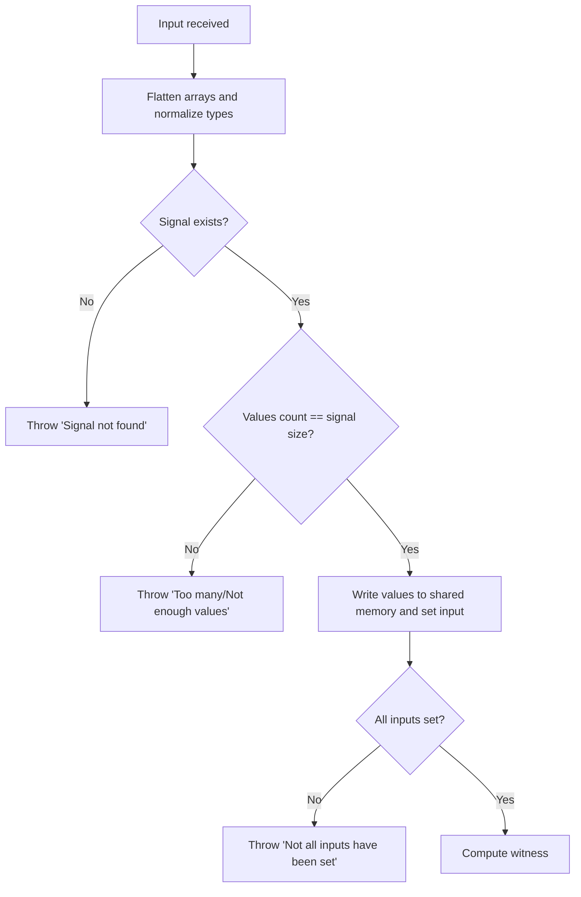
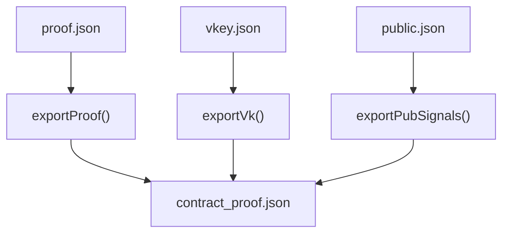
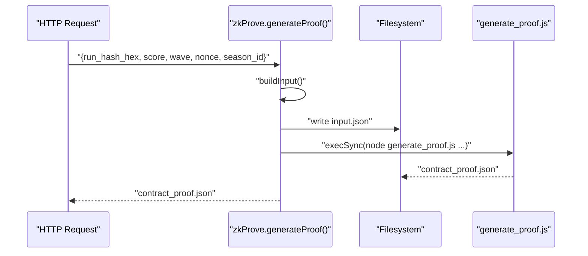
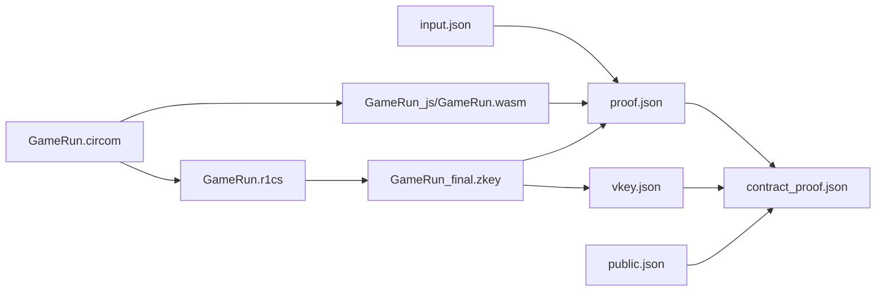

# Witness Generation Process

<cite>
**Referenced Files in This Document**
- [input.json](file://circuits/input.json)
- [input.json.example](file://circuits/input.json.example)
- [GameRun.circom](file://circuits/GameRun.circom)
- [build_circuit.sh](file://scripts/zk/build_circuit.sh)
- [generate_proof.js](file://scripts/zk/generate_proof.js)
- [export_for_contract.js](file://scripts/zk/export_for_contract.js)
- [contract_args_from_proof.js](file://scripts/zk/contract_args_from_proof.js)
- [zkProve.js](file://server/zkProve.js)
- [ZK_REAL_SETUP.md](file://docs/ZK_REAL_SETUP.md)
- [witness_calculator.js](file://circuits/build/GameRun_js/witness_calculator.js)
- [generate_witness.js](file://circuits/build/GameRun_js/generate_witness.js)
- [gameProof.js](file://src/zk/gameProof.js)
</cite>

## Table of Contents
1. [Introduction](#introduction)
2. [Project Structure](#project-structure)
3. [Core Components](#core-components)
4. [Architecture Overview](#architecture-overview)
5. [Detailed Component Analysis](#detailed-component-analysis)
6. [Dependency Analysis](#dependency-analysis)
7. [Performance Considerations](#performance-considerations)
8. [Troubleshooting Guide](#troubleshooting-guide)
9. [Conclusion](#conclusion)

## Introduction
This document explains the witness generation process in ZK proof creation for the Cosmic Coder game. It covers how input.json files are processed and validated, the role of snarkjs in witness computation, and the integration with Circom circuits. It documents input validation, error handling for malformed inputs, and the relationship between circuit inputs and witness generation. It also includes examples of proper input.json formatting, common input errors, and troubleshooting steps for witness generation failures.

## Project Structure
The witness generation pipeline spans several components:
- Circuit definition and compilation artifacts
- Input preparation and validation
- Witness computation via snarkjs and the Circom WASM prover
- Proof generation and export for on-chain verification

**Diagram sources**
- [GameRun.circom](file://circuits/GameRun.circom#L1-L34)
- [build_circuit.sh](file://scripts/zk/build_circuit.sh#L1-L57)
- [generate_proof.js](file://scripts/zk/generate_proof.js#L1-L46)
- [export_for_contract.js](file://scripts/zk/export_for_contract.js#L1-L95)
- [contract_args_from_proof.js](file://scripts/zk/contract_args_from_proof.js#L1-L46)

**Section sources**
- [GameRun.circom](file://circuits/GameRun.circom#L1-L34)
- [build_circuit.sh](file://scripts/zk/build_circuit.sh#L1-L57)
- [generate_proof.js](file://scripts/zk/generate_proof.js#L1-L46)
- [export_for_contract.js](file://scripts/zk/export_for_contract.js#L1-L95)
- [contract_args_from_proof.js](file://scripts/zk/contract_args_from_proof.js#L1-L46)

## Core Components
- Circuit definition: GameRun.circom defines six inputs (run_hash_hi, run_hash_lo, score, wave, nonce, season_id) and enforces a game rule constraint.
- Build pipeline: build_circuit.sh compiles the circuit to R1CS and WASM, performs Groth16 trusted setup, and exports verification keys.
- Input preparation: input.json holds the public inputs for the circuit; example and real files exist for guidance.
- Witness computation: generate_proof.js orchestrates snarkjs fullprove to compute the witness and generate a Groth16 proof.
- Export: export_for_contract.js converts snarkjs outputs into contract-ready hex-encoded fields.
- Server-side integration: zkProve.js builds input from HTTP requests, writes input.json, executes the pipeline, and returns contract-proof data.

**Section sources**
- [GameRun.circom](file://circuits/GameRun.circom#L1-L34)
- [build_circuit.sh](file://scripts/zk/build_circuit.sh#L1-L57)
- [input.json](file://circuits/input.json#L1-L9)
- [input.json.example](file://circuits/input.json.example#L1-L9)
- [generate_proof.js](file://scripts/zk/generate_proof.js#L1-L46)
- [export_for_contract.js](file://scripts/zk/export_for_contract.js#L1-L95)
- [zkProve.js](file://server/zkProve.js#L1-L68)

## Architecture Overview
The witness generation process follows a deterministic flow from input preparation to on-chain proof export.

**Diagram sources**
- [zkProve.js](file://server/zkProve.js#L1-L68)
- [build_circuit.sh](file://scripts/zk/build_circuit.sh#L1-L57)
- [generate_proof.js](file://scripts/zk/generate_proof.js#L1-L46)
- [export_for_contract.js](file://scripts/zk/export_for_contract.js#L1-L95)

## Detailed Component Analysis

### Input Preparation and Validation
- input.json and input.json.example define the six public inputs expected by the circuit.
- The server’s zkProve.js builds input from a request body, normalizing values and splitting run_hash_hex into two 128-bit halves.
- Validation ensures run_hash_hex is exactly 64 hex characters, and numeric fields are non-negative integers.

**Diagram sources**
- [zkProve.js](file://server/zkProve.js#L20-L39)

**Section sources**
- [input.json](file://circuits/input.json#L1-L9)
- [input.json.example](file://circuits/input.json.example#L1-L9)
- [zkProve.js](file://server/zkProve.js#L20-L39)

### Circuit Inputs and Constraint Relationship
- GameRun.circom declares six input signals and exposes them as public outputs.
- The circuit enforces a game rule: score >= wave * MIN_SCORE_PER_WAVE.
- Public outputs align with the six inputs, enabling the verifier to reconstruct run_hash, score, wave, nonce, and season_id.

**Diagram sources**
- [GameRun.circom](file://circuits/GameRun.circom#L8-L31)

**Section sources**
- [GameRun.circom](file://circuits/GameRun.circom#L1-L34)

### Witness Computation with snarkjs
- generate_proof.js copies the prepared input.json into the build directory and invokes snarkjs groth16 fullprove with the circuit WASM, final zkey, and input.json.
- The WASM prover (generated during build) computes the witness internally. The witness calculator validates input shapes and throws explicit errors if mismatches occur.

**Diagram sources**
- [generate_proof.js](file://scripts/zk/generate_proof.js#L32-L40)
- [witness_calculator.js](file://circuits/build/GameRun_js/witness_calculator.js#L131-L174)

**Section sources**
- [generate_proof.js](file://scripts/zk/generate_proof.js#L32-L40)
- [witness_calculator.js](file://circuits/build/GameRun_js/witness_calculator.js#L131-L174)

### Input Validation in the Witness Calculator
The witness calculator enforces strict input validation:
- Each input key must correspond to a declared signal.
- The number of values provided must match the signal size.
- Mixed types within an input array are rejected.
- If not all inputs are set, an error is thrown.

**Diagram sources**
- [witness_calculator.js](file://circuits/build/GameRun_js/witness_calculator.js#L131-L174)
- [witness_calculator.js](file://circuits/build/GameRun_js/witness_calculator.js#L292-L319)

**Section sources**
- [witness_calculator.js](file://circuits/build/GameRun_js/witness_calculator.js#L131-L174)
- [witness_calculator.js](file://circuits/build/GameRun_js/witness_calculator.js#L292-L319)

### Export for On-Chain Verification
- export_for_contract.js converts snarkjs outputs (proof.json, vkey.json, public.json) into a contract-ready JSON with hex-encoded fields.
- It validates byte lengths for G1/G2 elements and IC vectors, ensuring compatibility with Soroban BN254 encoding.

**Diagram sources**
- [export_for_contract.js](file://scripts/zk/export_for_contract.js#L38-L86)

**Section sources**
- [export_for_contract.js](file://scripts/zk/export_for_contract.js#L1-L95)

### Server-Side Integration
- zkProve.js receives a request, validates and normalizes inputs, writes input.json, executes the build and proof pipeline, and returns contract_proof.json.
- It checks for the presence of build artifacts and circuit keys before proceeding.

**Diagram sources**
- [zkProve.js](file://server/zkProve.js#L46-L67)

**Section sources**
- [zkProve.js](file://server/zkProve.js#L1-L68)

## Dependency Analysis
- GameRun.circom depends on circomlib comparators for the score vs wave constraint.
- The build pipeline depends on circom 2.x and snarkjs; it generates R1CS, WASM, zkeys, and verification keys.
- The witness computation depends on the compiled WASM prover and the final zkey.
- The export stage depends on the generated proof, verification key, and public signals.

**Diagram sources**
- [GameRun.circom](file://circuits/GameRun.circom#L1-L34)
- [build_circuit.sh](file://scripts/zk/build_circuit.sh#L30-L51)
- [generate_proof.js](file://scripts/zk/generate_proof.js#L36-L40)
- [export_for_contract.js](file://scripts/zk/export_for_contract.js#L65-L86)

**Section sources**
- [GameRun.circom](file://circuits/GameRun.circom#L1-L34)
- [build_circuit.sh](file://scripts/zk/build_circuit.sh#L1-L57)
- [generate_proof.js](file://scripts/zk/generate_proof.js#L1-L46)
- [export_for_contract.js](file://scripts/zk/export_for_contract.js#L1-L95)

## Performance Considerations
- The witness computation is performed by the WASM prover; performance depends on the circuit complexity and input sizes.
- The snarkjs fullprove step is CPU-intensive; ensure adequate resources when generating proofs.
- Byte conversions in export_for_contract.js are linear in the number of field elements; keep input sizes minimal to reduce overhead.

[No sources needed since this section provides general guidance]

## Troubleshooting Guide

### Common Input Errors
- Missing or extra fields in input.json: The witness calculator throws errors if a signal is not found or if too few/too many values are provided.
- Type mismatches: Mixed types within an input array cause validation failures.
- run_hash_hex length: Must be exactly 64 hex characters; otherwise, server-side validation fails.
- Numeric bounds: Non-positive or out-of-range values are normalized to safe defaults, potentially invalidating the proof.

**Section sources**
- [witness_calculator.js](file://circuits/build/GameRun_js/witness_calculator.js#L147-L155)
- [witness_calculator.js](file://circuits/build/GameRun_js/witness_calculator.js#L292-L319)
- [zkProve.js](file://server/zkProve.js#L20-L39)

### Malformed Inputs and Validation Failures
- If the circuit WASM or zkey is missing, the build script or proof generator will exit early with an error.
- If input.json is missing when running the proof generator, it exits with a helpful message.
- If the server detects missing build artifacts, it throws an error instructing to run the build script.

**Section sources**
- [build_circuit.sh](file://scripts/zk/build_circuit.sh#L16-L28)
- [generate_proof.js](file://scripts/zk/generate_proof.js#L23-L30)
- [zkProve.js](file://server/zkProve.js#L49-L54)

### Witness Generation Failures
- Ensure the correct version of circom is installed; the circuit requires 2.x.
- Verify snarkjs is installed globally and available in PATH.
- Confirm the powers of tau file exists or is generated; otherwise, the trusted setup will fail.
- After building, confirm GameRun_js/GameRun.wasm and GameRun_final.zkey exist before running the proof generator.

**Section sources**
- [build_circuit.sh](file://scripts/zk/build_circuit.sh#L16-L28)
- [build_circuit.sh](file://scripts/zk/build_circuit.sh#L34-L46)
- [generate_proof.js](file://scripts/zk/generate_proof.js#L23-L30)

### Example input.json Formatting
- Use the example file as a template; ensure all six fields are present and represented as decimal strings.
- For run_hash_hex, provide exactly 64 hex characters; the server splits it into run_hash_hi and run_hash_lo automatically.

**Section sources**
- [input.json.example](file://circuits/input.json.example#L1-L9)
- [input.json](file://circuits/input.json#L1-L9)
- [zkProve.js](file://server/zkProve.js#L20-L39)

### End-to-End Validation Checklist
- Compile the circuit and generate artifacts using the build script.
- Prepare input.json and run the proof generator to produce contract_proof.json.
- Verify the proof with the on-chain verifier using the exported arguments.
- Submit the ZK run with the same nonce and inputs to ensure anti-replay protection.

**Section sources**
- [ZK_REAL_SETUP.md](file://docs/ZK_REAL_SETUP.md#L177-L185)

## Conclusion
The witness generation process integrates Circom circuit definitions, snarkjs-based proof computation, and strict input validation. Properly formatted input.json, validated by both server-side normalization and the witness calculator, ensures successful witness computation and proof generation. The export pipeline produces contract-ready artifacts that can be verified on-chain. Following the troubleshooting steps and validation checklist helps diagnose and resolve common issues efficiently.