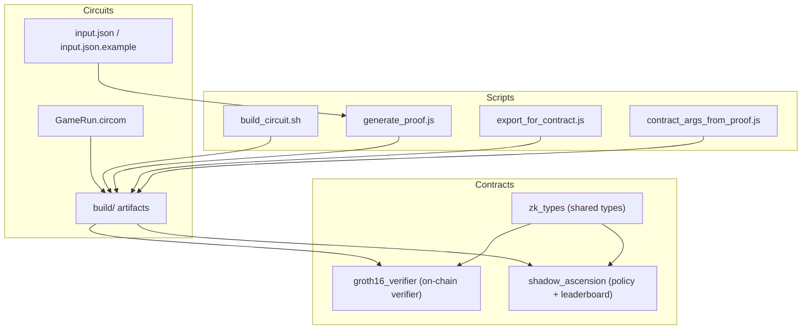
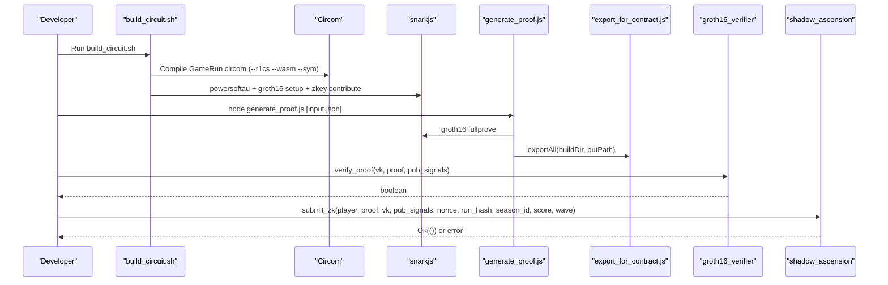
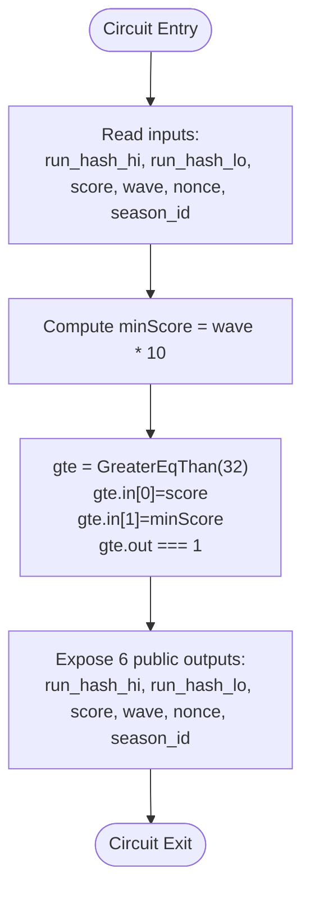
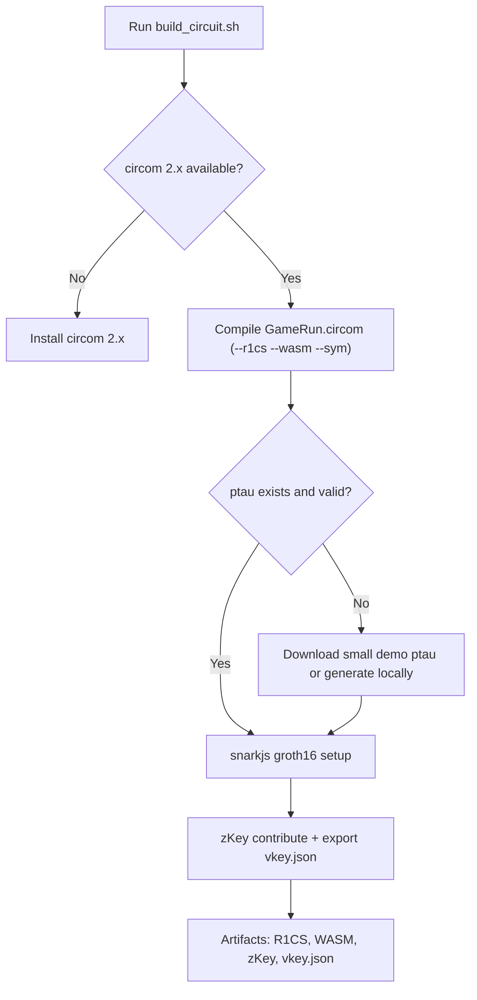
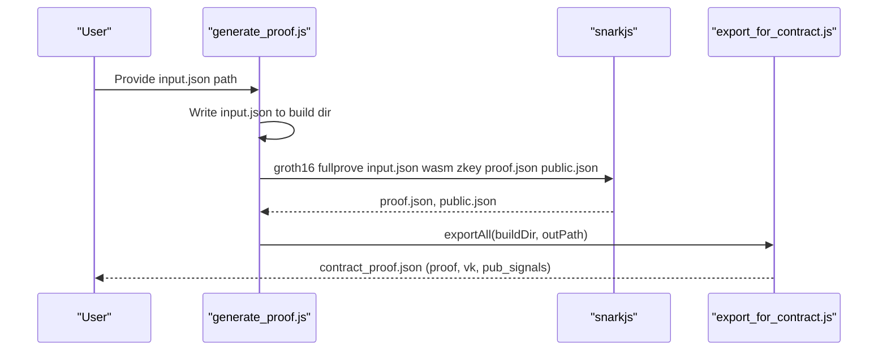
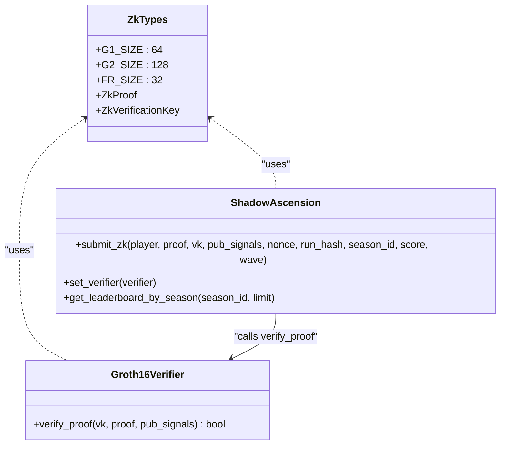
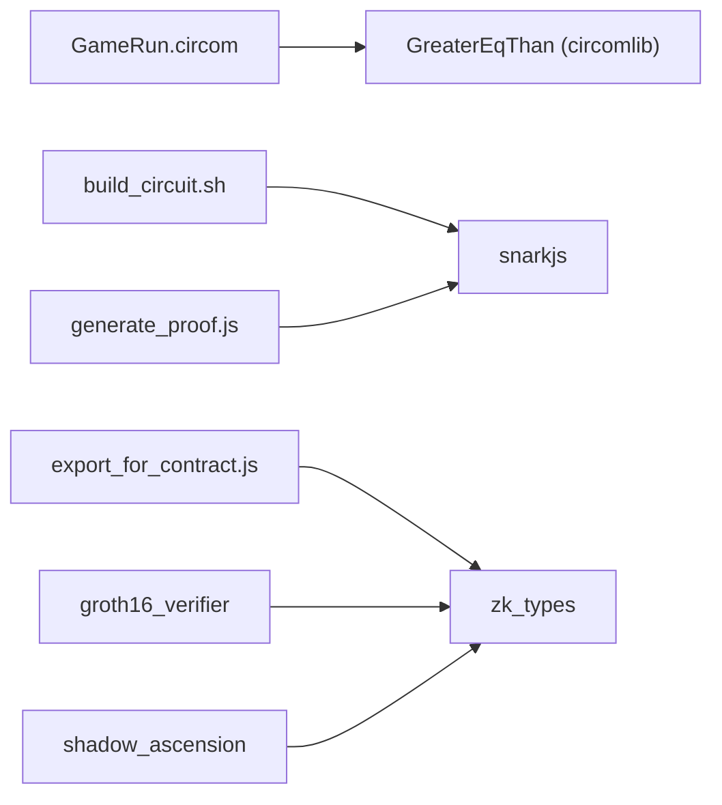

# ZK Circuit System

<cite>
**Referenced Files in This Document**
- [GameRun.circom](file://circuits/GameRun.circom)
- [input.json](file://circuits/input.json)
- [input.json.example](file://circuits/input.json.example)
- [build_circuit.sh](file://scripts/zk/build_circuit.sh)
- [generate_proof.js](file://scripts/zk/generate_proof.js)
- [export_for_contract.js](file://scripts/zk/export_for_contract.js)
- [contract_args_from_proof.js](file://scripts/zk/contract_args_from_proof.js)
- [vkey.json](file://circuits/build/vkey.json)
- [proof.json](file://circuits/build/proof.json)
- [public.json](file://circuits/build/public.json)
- [lib.rs (groth16_verifier)](file://contracts/groth16_verifier/src/lib.rs)
- [lib.rs (shadow_ascension)](file://contracts/shadow_ascension/src/lib.rs)
- [lib.rs (zk_types)](file://contracts/zk_types/src/lib.rs)
- [ZK_REAL_SETUP.md](file://docs/ZK_REAL_SETUP.md)
- [E2E_VERIFICATION.md](file://docs/E2E_VERIFICATION.md)
- [e2e_zk.sh](file://scripts/e2e_zk.sh)
- [gameProof.js](file://src/zk/gameProof.js)
</cite>

## Table of Contents
1. [Introduction](#introduction)
2. [Project Structure](#project-structure)
3. [Core Components](#core-components)
4. [Architecture Overview](#architecture-overview)
5. [Detailed Component Analysis](#detailed-component-analysis)
6. [Dependency Analysis](#dependency-analysis)
7. [Performance Considerations](#performance-considerations)
8. [Troubleshooting Guide](#troubleshooting-guide)
9. [Conclusion](#conclusion)
10. [Appendices](#appendices)

## Introduction
This document explains Vibe-Coder’s zero-knowledge (ZK) circuit system built with Circom and Groth16. It focuses on the GameRun circuit, its constraints, and the end-to-end workflow from compiling the circuit to generating proofs and verifying them on-chain using Soroban contracts. It also documents input formats, public versus private inputs, circuit parameters, and the build/export pipeline for contract deployment.

## Project Structure
The ZK system spans three main areas:
- Circuit definition and inputs under circuits/
- Scripts orchestrating compilation, trusted setup, proof generation, and export under scripts/zk/
- On-chain verification and policy logic under contracts/

**Diagram sources**
- [GameRun.circom](file://circuits/GameRun.circom#L1-L34)
- [input.json](file://circuits/input.json#L1-L9)
- [input.json.example](file://circuits/input.json.example#L1-L9)
- [build_circuit.sh](file://scripts/zk/build_circuit.sh#L1-L57)
- [generate_proof.js](file://scripts/zk/generate_proof.js#L1-L46)
- [export_for_contract.js](file://scripts/zk/export_for_contract.js#L1-L95)
- [contract_args_from_proof.js](file://scripts/zk/contract_args_from_proof.js#L1-L46)
- [lib.rs (zk_types)](file://contracts/zk_types/src/lib.rs#L1-L44)
- [lib.rs (groth16_verifier)](file://contracts/groth16_verifier/src/lib.rs#L1-L61)
- [lib.rs (shadow_ascension)](file://contracts/shadow_ascension/src/lib.rs#L1-L314)

**Section sources**
- [GameRun.circom](file://circuits/GameRun.circom#L1-L34)
- [build_circuit.sh](file://scripts/zk/build_circuit.sh#L1-L57)
- [lib.rs (zk_types)](file://contracts/zk_types/src/lib.rs#L1-L44)

## Core Components
- GameRun circuit: Implements a single arithmetic constraint ensuring score meets a minimum based on wave count, with six public outputs exposed for on-chain verification.
- Trusted setup and Groth16 key generation: Powers-of-tau ceremony and zKey contribution steps to produce verification and proving keys.
- Proof generation: Full-prove workflow using the WASM prover and final zKey to produce a Groth16 proof and public signals.
- Contract export: Converts snarkJS outputs into on-chain friendly formats (G1/G2 serialization, big-endian field elements).
- On-chain verifier: Performs BN254 pairing check against the verification key and public inputs.
- Policy contract: Orchestrates anti-replay, leaderboard updates, and emits events upon successful verification.

**Section sources**
- [GameRun.circom](file://circuits/GameRun.circom#L8-L31)
- [build_circuit.sh](file://scripts/zk/build_circuit.sh#L30-L56)
- [generate_proof.js](file://scripts/zk/generate_proof.js#L36-L45)
- [export_for_contract.js](file://scripts/zk/export_for_contract.js#L38-L86)
- [lib.rs (groth16_verifier)](file://contracts/groth16_verifier/src/lib.rs#L18-L56)
- [lib.rs (shadow_ascension)](file://contracts/shadow_ascension/src/lib.rs#L159-L264)

## Architecture Overview
The system follows a standard ZK workflow: compile circuit to R1CS, generate trusted setup, create a proof, and verify on-chain.

**Diagram sources**
- [build_circuit.sh](file://scripts/zk/build_circuit.sh#L30-L56)
- [generate_proof.js](file://scripts/zk/generate_proof.js#L36-L45)
- [export_for_contract.js](file://scripts/zk/export_for_contract.js#L65-L86)
- [lib.rs (groth16_verifier)](file://contracts/groth16_verifier/src/lib.rs#L23-L56)
- [lib.rs (shadow_ascension)](file://contracts/shadow_ascension/src/lib.rs#L159-L264)

## Detailed Component Analysis

### GameRun Circuit Design and Constraints
- Inputs:
  - run_hash_hi, run_hash_lo: two 128-bit halves of a run hash bound by the circuit.
  - score, wave: u32 values representing the run outcome.
  - nonce, season_id: u64 and u32 respectively, used for anti-replay and season scoping.
- Constraint:
  - Enforces score ≥ wave × MIN_SCORE_PER_WAVE (10).
  - Implemented using GreaterEqThan comparator from circomlib.
- Public outputs:
  - Six signals are exposed as public outputs: run_hash_hi, run_hash_lo, score, wave, nonce, season_id.

**Diagram sources**
- [GameRun.circom](file://circuits/GameRun.circom#L8-L31)

**Section sources**
- [GameRun.circom](file://circuits/GameRun.circom#L8-L31)

### Mathematical Foundations and Curve Details
- Curve: BN254 (BN128 in snarkJS terminology).
- Group sizes:
  - G1: 64 bytes (compressed-like affine serialization)
  - G2: 128 bytes
  - Scalar field Fr: 32 bytes
- Verification key structure:
  - vk.alpha: G1
  - vk.beta, vk.gamma, vk.delta: G2
  - ic: vector of G1 points (length equals number of public signals plus one)
- Pairing check formula is implemented in the verifier contract.

**Section sources**
- [lib.rs (zk_types)](file://contracts/zk_types/src/lib.rs#L9-L43)
- [lib.rs (groth16_verifier)](file://contracts/groth16_verifier/src/lib.rs#L23-L56)
- [vkey.json](file://circuits/build/vkey.json#L1-L119)

### Circuit Compilation Process (.circom to R1CS)
- Prerequisites: circom 2.x and snarkjs installed.
- Steps:
  - Compile GameRun.circom to R1CS and WASM, and generate symbols.
  - Ensure a valid powers-of-tau file (download or generate locally).
  - Perform Groth16 setup and zKey contribution.
  - Export verification key to vkey.json.

**Diagram sources**
- [build_circuit.sh](file://scripts/zk/build_circuit.sh#L16-L56)

**Section sources**
- [build_circuit.sh](file://scripts/zk/build_circuit.sh#L1-L57)

### Witness Generation and Proof Creation Workflow
- Input format:
  - JSON with run_hash_hi, run_hash_lo, score, wave, nonce, season_id.
  - Example input is provided for reference.
- Witness generation:
  - The script copies the input to the build directory and runs snarkjs fullprove using the WASM prover and final zKey.
- Outputs:
  - proof.json and public.json in the build directory.

**Diagram sources**
- [generate_proof.js](file://scripts/zk/generate_proof.js#L32-L45)
- [export_for_contract.js](file://scripts/zk/export_for_contract.js#L65-L86)

**Section sources**
- [generate_proof.js](file://scripts/zk/generate_proof.js#L1-L46)
- [input.json](file://circuits/input.json#L1-L9)
- [input.json.example](file://circuits/input.json.example#L1-L9)

### Contract Deployment and On-Chain Verification
- Verification key and proof export:
  - The export script converts snarkJS outputs into on-chain compatible formats:
    - G1: two 32-byte big-endian limbs concatenated (64 bytes total)
    - G2: four 32-byte big-endian limbs concatenated in x0||x1||y0||y1 order (128 bytes)
    - Public signals: 32-byte big-endian field elements
- On-chain verifier:
  - Accepts vk, proof, and pub_signals; reconstructs vk_x from ic and pub_signals; performs pairing check.
- Policy contract:
  - Enforces anti-replay using (player, nonce, season_id).
  - Updates per-season leaderboard and emits a ZkRunSubmitted event on success.

**Diagram sources**
- [lib.rs (zk_types)](file://contracts/zk_types/src/lib.rs#L27-L43)
- [lib.rs (groth16_verifier)](file://contracts/groth16_verifier/src/lib.rs#L18-L56)
- [lib.rs (shadow_ascension)](file://contracts/shadow_ascension/src/lib.rs#L159-L264)

**Section sources**
- [export_for_contract.js](file://scripts/zk/export_for_contract.js#L22-L86)
- [lib.rs (groth16_verifier)](file://contracts/groth16_verifier/src/lib.rs#L18-L56)
- [lib.rs (shadow_ascension)](file://contracts/shadow_ascension/src/lib.rs#L159-L264)

### Input Format Specification and Public vs Private Inputs
- Input JSON fields:
  - run_hash_hi, run_hash_lo: 128-bit halves of the run hash (bound in the circuit).
  - score, wave: u32 values (public outputs).
  - nonce: u64 (public output; used for anti-replay).
  - season_id: u32 (public output; used for per-season leaderboards).
- Public vs private:
  - All six inputs are public outputs in the circuit; the constraint is enforced internally.
  - The run hash is split into hi/lo to fit within the circuit’s 32-bit signal limits while preserving full commitment semantics.

**Section sources**
- [GameRun.circom](file://circuits/GameRun.circom#L9-L30)
- [input.json](file://circuits/input.json#L1-L9)
- [public.json](file://circuits/build/public.json#L1-L8)

### Circuit Parameters and Build Pipeline
- Circuit parameters:
  - MIN_SCORE_PER_WAVE: 10
  - Signal bit-widths: 32-bit for score, wave; 64-bit for nonce; 128-bit halves for run_hash.
- Build pipeline:
  - Compile: GameRun.circom → R1CS + WASM + SYM
  - Trusted setup: powers-of-tau → zKey initial → zKey final
  - Export: vkey.json for on-chain verification

**Section sources**
- [GameRun.circom](file://circuits/GameRun.circom#L3-L4)
- [build_circuit.sh](file://scripts/zk/build_circuit.sh#L30-L56)
- [vkey.json](file://circuits/build/vkey.json#L1-L119)

### End-to-End Verification and Testing
- Automated end-to-end flow:
  - Build circuit, generate real proof, run contract tests covering verifier and policy.
- Manual verification:
  - Use Stellar CLI to simulate verify_proof and submit_zk with generated artifacts.

**Section sources**
- [e2e_zk.sh](file://scripts/e2e_zk.sh#L1-L22)
- [ZK_REAL_SETUP.md](file://docs/ZK_REAL_SETUP.md#L177-L186)
- [E2E_VERIFICATION.md](file://docs/E2E_VERIFICATION.md#L18-L36)

## Dependency Analysis
- Internal dependencies:
  - GameRun.circom depends on GreaterEqThan comparator from circomlib.
  - Scripts depend on snarkjs and Node.js ecosystem.
  - Contracts share ZkTypes for serialization and error handling.
- External dependencies:
  - circom 2.x, snarkjs, Node.js, Rust toolchain for contracts.

**Diagram sources**
- [GameRun.circom](file://circuits/GameRun.circom#L6-L22)
- [build_circuit.sh](file://scripts/zk/build_circuit.sh#L25-L28)
- [generate_proof.js](file://scripts/zk/generate_proof.js#L6-L10)
- [export_for_contract.js](file://scripts/zk/export_for_contract.js#L6-L8)
- [lib.rs (zk_types)](file://contracts/zk_types/src/lib.rs#L1-L44)
- [lib.rs (groth16_verifier)](file://contracts/groth16_verifier/src/lib.rs#L1-L13)
- [lib.rs (shadow_ascension)](file://contracts/shadow_ascension/src/lib.rs#L10-L10)

**Section sources**
- [GameRun.circom](file://circuits/GameRun.circom#L6-L22)
- [lib.rs (zk_types)](file://contracts/zk_types/src/lib.rs#L1-L44)

## Performance Considerations
- Circuit size and constraints:
  - The GameRun circuit is intentionally minimal to reduce proof size and verification cost.
- Serialization overhead:
  - Export script ensures proper big-endian encoding and correct G1/G2 sizes to avoid runtime conversions.
- Trusted setup:
  - The build script supports both downloading a small demo ptau and generating a local contribution; for production, use a multi-party ceremony and a larger ptau.
- On-chain verification:
  - Pairing checks are efficient on Soroban; ensure pub_signals and vk.ic lengths match to prevent extra validation overhead.

[No sources needed since this section provides general guidance]

## Troubleshooting Guide
- Missing or wrong circom version:
  - The build script checks for circom 2.x and exits with guidance if not satisfied.
- Missing snarkjs:
  - The build script checks for snarkjs and exits with installation guidance.
- Powers-of-tau issues:
  - If the ptau file is missing or too small, the script attempts to download or generate it automatically.
- Proof generation errors:
  - Ensure input.json exists and matches the circuit’s public signals; the script copies it to the build directory before proving.
- Contract argument construction:
  - Use the helper script to convert contract_proof.json into invoke-ready arguments for Stellar CLI or frontend.

**Section sources**
- [build_circuit.sh](file://scripts/zk/build_circuit.sh#L16-L28)
- [build_circuit.sh](file://scripts/zk/build_circuit.sh#L34-L46)
- [generate_proof.js](file://scripts/zk/generate_proof.js#L23-L30)
- [contract_args_from_proof.js](file://scripts/zk/contract_args_from_proof.js#L11-L14)

## Conclusion
Vibe-Coder’s ZK system demonstrates a clean separation between circuit design, trusted setup, proof generation, and on-chain verification. The GameRun circuit enforces a simple but meaningful game rule, while the scripts and contracts provide a robust pipeline for building, testing, and deploying ZK-enabled leaderboards on Soroban. The documented inputs, constraints, and export formats enable straightforward customization and extension.

[No sources needed since this section summarizes without analyzing specific files]

## Appendices

### Appendix A: Input JSON Schema and Field Meanings
- run_hash_hi: upper 128 bits of the run hash
- run_hash_lo: lower 128 bits of the run hash
- score: final score (u32)
- wave: wave reached (u32)
- nonce: unique identifier per submission (u64)
- season_id: season identifier (u32)

**Section sources**
- [input.json](file://circuits/input.json#L1-L9)
- [public.json](file://circuits/build/public.json#L1-L8)

### Appendix B: On-Chain Data Formats
- ZkProof: { a (G1), b (G2), c (G1) }
- ZkVerificationKey: { alpha (G1), beta (G2), gamma (G2), delta (G2), ic[] (G1[]) }
- Public signals: array of 32-byte field elements

**Section sources**
- [lib.rs (zk_types)](file://contracts/zk_types/src/lib.rs#L27-L43)
- [export_for_contract.js](file://scripts/zk/export_for_contract.js#L22-L63)

### Appendix C: Example Workflows
- Real proof generation and verification:
  - Build circuit, generate proof, and run contract tests using the provided shell script.
- Manual verification:
  - Use the helper script to construct invoke arguments from contract_proof.json and simulate on-chain verification.

**Section sources**
- [e2e_zk.sh](file://scripts/e2e_zk.sh#L8-L18)
- [ZK_REAL_SETUP.md](file://docs/ZK_REAL_SETUP.md#L68-L90)

### Appendix D: Client-Side Validation Utilities
- Client-side hashing and rule validation helpers are available for pre-submission checks and run binding.

**Section sources**
- [gameProof.js](file://src/zk/gameProof.js#L29-L77)