# Database and Storage

<cite>
**Referenced Files in This Document**
- [schema.sql](file://server/db/schema.sql)
- [supabase.js](file://server/db/supabase.js)
- [users.js](file://server/db/users.js)
- [pool.js](file://server/db/pool.js)
- [auth.js](file://server/routes/auth.js)
- [index.js](file://server/index.js)
- [walletProgressApi.js](file://src/utils/walletProgressApi.js)
- [walletProgressService.js](file://src/utils/walletProgressService.js)
- [SaveManager.js](file://src/systems/SaveManager.js)
- [stellarWallet.js](file://src/utils/stellarWallet.js)
- [LeaderboardManager.js](file://src/systems/LeaderboardManager.js)
- [authApi.js](file://src/utils/authApi.js)
- [sep10StellarAuth.js](file://src/utils/sep10StellarAuth.js)
- [main.js](file://src/main.js)
- [run_db_schema.js](file://scripts/run_db_schema.js)
- [gameClient.js](file://src/contracts/gameClient.js)
</cite>

## Table of Contents
1. [Introduction](#introduction)
2. [Project Structure](#project-structure)
3. [Core Components](#core-components)
4. [Architecture Overview](#architecture-overview)
5. [Detailed Component Analysis](#detailed-component-analysis)
6. [Dependency Analysis](#dependency-analysis)
7. [Performance Considerations](#performance-considerations)
8. [Troubleshooting Guide](#troubleshooting-guide)
9. [Conclusion](#conclusion)
10. [Appendices](#appendices)

## Introduction
This document explains Vibe-Coder’s database and storage systems. It covers:
- Supabase integration for user management and JWT persistence
- PostgreSQL fallback for user records
- Wallet-backed progress storage via a local-first, server-side API
- Local storage for settings and offline run saves
- Data models for player progress, leaderboard entries, and game state
- Synchronization patterns between local and blockchain-backed storage
- Backup/recovery, migrations, and privacy considerations

## Project Structure
The storage stack spans frontend and backend:
- Frontend stores user preferences and temporary run state in localStorage
- Wallet-backed progress is persisted to a server API keyed by wallet address
- Authentication tokens are stored in localStorage for session continuity
- Optional Supabase and PostgreSQL backends persist user metadata and JWTs

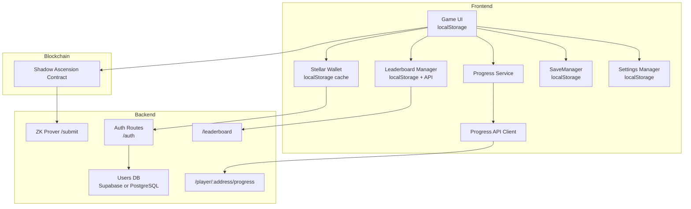

**Diagram sources**
- [auth.js](file://server/routes/auth.js#L1-L115)
- [users.js](file://server/db/users.js#L1-L181)
- [supabase.js](file://server/db/supabase.js#L1-L23)
- [pool.js](file://server/db/pool.js#L1-L36)
- [index.js](file://server/index.js#L129-L194)
- [walletProgressApi.js](file://src/utils/walletProgressApi.js#L1-L46)
- [walletProgressService.js](file://src/utils/walletProgressService.js#L1-L140)
- [SaveManager.js](file://src/systems/SaveManager.js#L1-L187)
- [LeaderboardManager.js](file://src/systems/LeaderboardManager.js#L1-L135)
- [stellarWallet.js](file://src/utils/stellarWallet.js#L1-L115)
- [gameClient.js](file://src/contracts/gameClient.js#L1-L401)

**Section sources**
- [auth.js](file://server/routes/auth.js#L1-L115)
- [users.js](file://server/db/users.js#L1-L181)
- [supabase.js](file://server/db/supabase.js#L1-L23)
- [pool.js](file://server/db/pool.js#L1-L36)
- [index.js](file://server/index.js#L129-L194)
- [walletProgressApi.js](file://src/utils/walletProgressApi.js#L1-L46)
- [walletProgressService.js](file://src/utils/walletProgressService.js#L1-L140)
- [SaveManager.js](file://src/systems/SaveManager.js#L1-L187)
- [LeaderboardManager.js](file://src/systems/LeaderboardManager.js#L1-L135)
- [stellarWallet.js](file://src/utils/stellarWallet.js#L1-L115)
- [gameClient.js](file://src/contracts/gameClient.js#L1-L401)

## Core Components
- Supabase/PostgreSQL user store: persists public_key, username, and JWT metadata
- In-memory fallback for user persistence when no database is configured
- Wallet-backed progress API: stores upgrades, legendaries, high scores, save state, and selected character
- Local storage for settings and offline run saves
- Leaderboard manager supporting local-only and on-chain submission
- SEP-10 auth flow with Freighter and JWT storage

**Section sources**
- [users.js](file://server/db/users.js#L1-L181)
- [supabase.js](file://server/db/supabase.js#L1-L23)
- [pool.js](file://server/db/pool.js#L1-L36)
- [walletProgressApi.js](file://src/utils/walletProgressApi.js#L1-L46)
- [walletProgressService.js](file://src/utils/walletProgressService.js#L1-L140)
- [SaveManager.js](file://src/systems/SaveManager.js#L1-L187)
- [LeaderboardManager.js](file://src/systems/LeaderboardManager.js#L1-L135)
- [authApi.js](file://src/utils/authApi.js#L1-L184)
- [sep10StellarAuth.js](file://src/utils/sep10StellarAuth.js#L1-L219)

## Architecture Overview
The system integrates three storage layers:
- Identity and session: JWT stored in localStorage and optionally in Supabase/PostgreSQL
- Progress: wallet-address-keyed JSON persisted via a simple HTTP API
- Local state: settings and run saves in localStorage

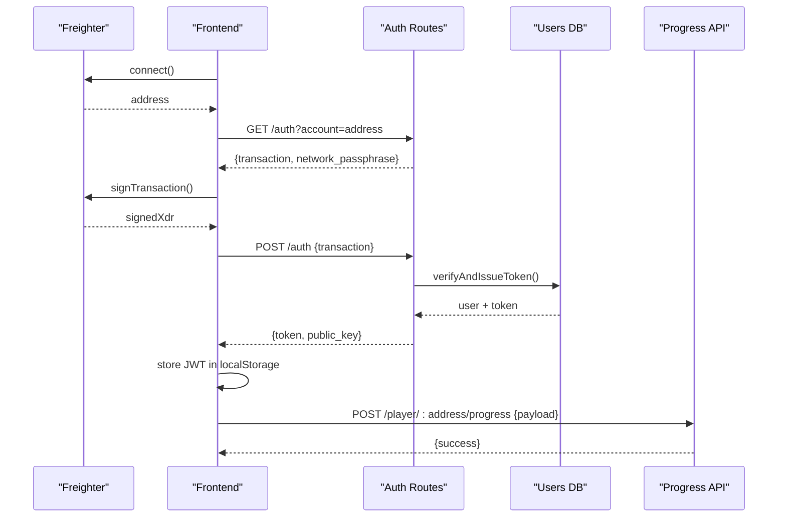

**Diagram sources**
- [auth.js](file://server/routes/auth.js#L19-L76)
- [users.js](file://server/db/users.js#L131-L180)
- [authApi.js](file://src/utils/authApi.js#L62-L111)
- [walletProgressApi.js](file://src/utils/walletProgressApi.js#L29-L45)
- [index.js](file://server/index.js#L129-L154)

## Detailed Component Analysis

### Supabase and PostgreSQL User Management
- Supabase client initialization supports service role or anonymous keys
- Users table schema includes unique public_key, optional username, JWT fields, and timestamps
- Upsert/find/update operations support Supabase, PostgreSQL, and in-memory fallback
- JWT metadata is stored alongside user identity for audit/session tracking

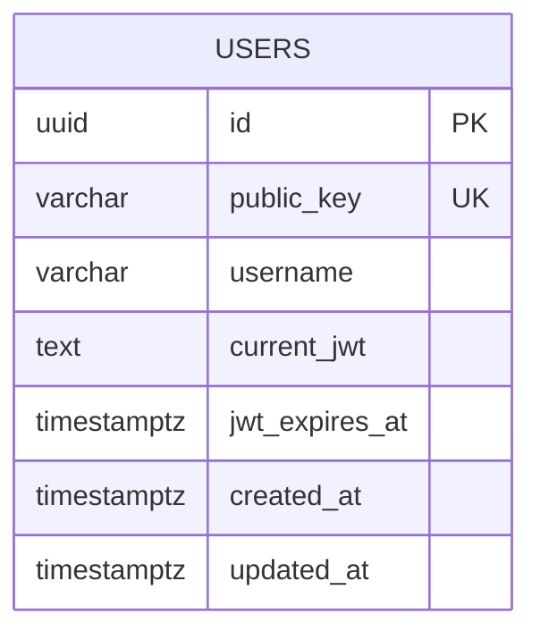

**Diagram sources**
- [schema.sql](file://server/db/schema.sql#L5-L13)
- [users.js](file://server/db/users.js#L28-L125)

**Section sources**
- [supabase.js](file://server/db/supabase.js#L1-L23)
- [schema.sql](file://server/db/schema.sql#L1-L31)
- [users.js](file://server/db/users.js#L1-L181)
- [pool.js](file://server/db/pool.js#L1-L36)

### Wallet-Backed Progress System
- Progress is stored per wallet address via a simple HTTP API
- Payload includes upgrades, legendaries, highWave, highScore, saveState, and selectedCharacter
- Frontend services hydrate and persist state without relying on cookies/localStorage for progress
- SaveManager handles local run saves for offline continuation

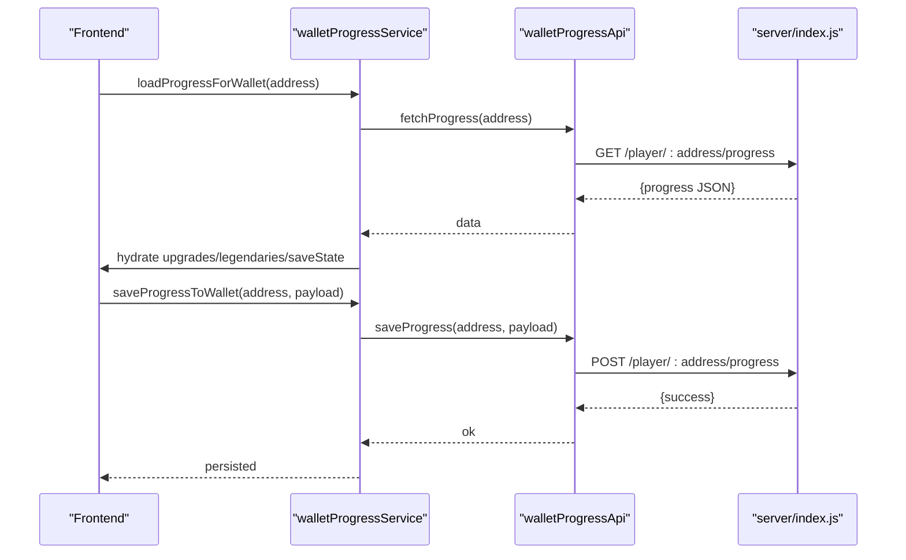

**Diagram sources**
- [walletProgressService.js](file://src/utils/walletProgressService.js#L22-L84)
- [walletProgressApi.js](file://src/utils/walletProgressApi.js#L15-L45)
- [index.js](file://server/index.js#L129-L154)

**Section sources**
- [walletProgressService.js](file://src/utils/walletProgressService.js#L1-L140)
- [walletProgressApi.js](file://src/utils/walletProgressApi.js#L1-L46)
- [SaveManager.js](file://src/systems/SaveManager.js#L1-L187)
- [index.js](file://server/index.js#L129-L154)

### Local Storage for Settings and Offline Saves
- Settings are persisted in localStorage with a dedicated loader/saver
- Run saves are stored with a timestamp and auto-expire after 24 hours
- SaveManager can restore from wallet-backed save data

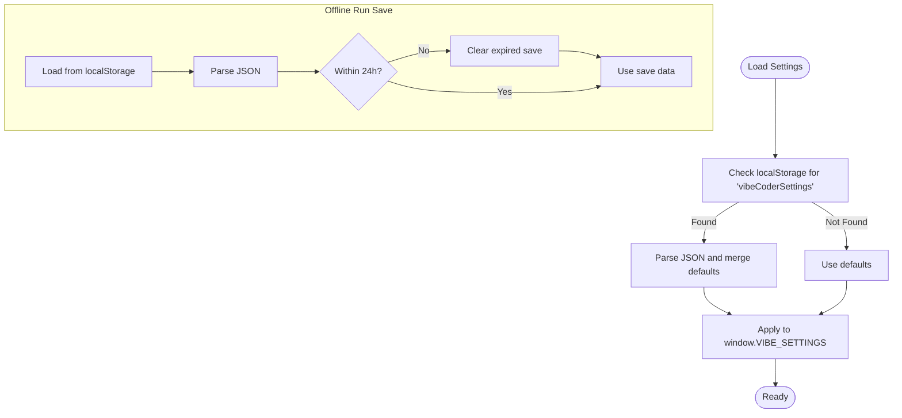

**Diagram sources**
- [main.js](file://src/main.js#L246-L317)
- [SaveManager.js](file://src/systems/SaveManager.js#L48-L101)

**Section sources**
- [main.js](file://src/main.js#L232-L317)
- [SaveManager.js](file://src/systems/SaveManager.js#L1-L187)

### Leaderboard Entries and Ranking
- Local-only leaderboard supports adding entries and sorting by score/wave/date
- On-chain leaderboard submission and retrieval supported via API
- Wallet identity is the on-chain identifier

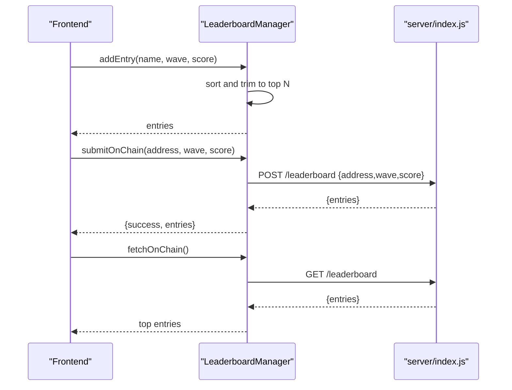

**Diagram sources**
- [LeaderboardManager.js](file://src/systems/LeaderboardManager.js#L56-L120)
- [index.js](file://server/index.js#L165-L194)

**Section sources**
- [LeaderboardManager.js](file://src/systems/LeaderboardManager.js#L1-L135)
- [index.js](file://server/index.js#L156-L194)

### Authentication and Session Storage
- SEP-10 challenge/token flow with Freighter
- JWT stored in localStorage for subsequent requests
- Alternative in-memory token for ephemeral sessions

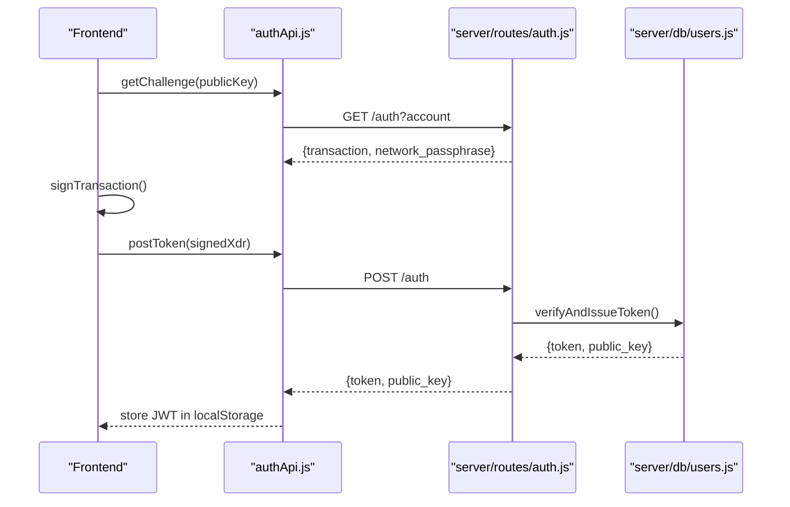

**Diagram sources**
- [authApi.js](file://src/utils/authApi.js#L62-L111)
- [auth.js](file://server/routes/auth.js#L19-L76)
- [users.js](file://server/db/users.js#L131-L180)

**Section sources**
- [authApi.js](file://src/utils/authApi.js#L1-L184)
- [sep10StellarAuth.js](file://src/utils/sep10StellarAuth.js#L65-L164)
- [auth.js](file://server/routes/auth.js#L1-L115)
- [users.js](file://server/db/users.js#L1-L181)

### Blockchain Integration and ZK Proofs
- Wallet identity is used for ranking and ZK submissions
- Frontend can request ZK proofs from a backend prover and submit to the contract
- Submission validates game rules and binds proof to run hash and season

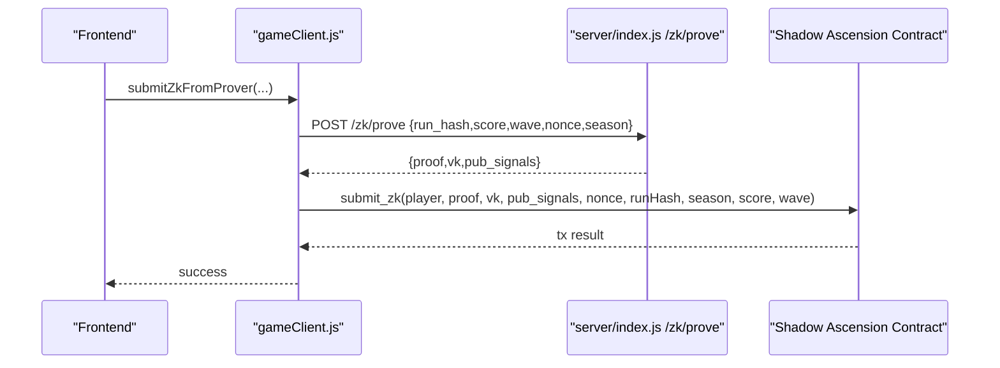

**Diagram sources**
- [gameClient.js](file://src/contracts/gameClient.js#L103-L273)
- [index.js](file://server/index.js#L196-L216)

**Section sources**
- [gameClient.js](file://src/contracts/gameClient.js#L1-L401)
- [index.js](file://server/index.js#L196-L216)

## Dependency Analysis
- Frontend depends on localStorage for settings and offline saves
- Progress depends on wallet address and server API
- Auth depends on Freighter and backend routes
- Optional Supabase/PostgreSQL provides user persistence fallback

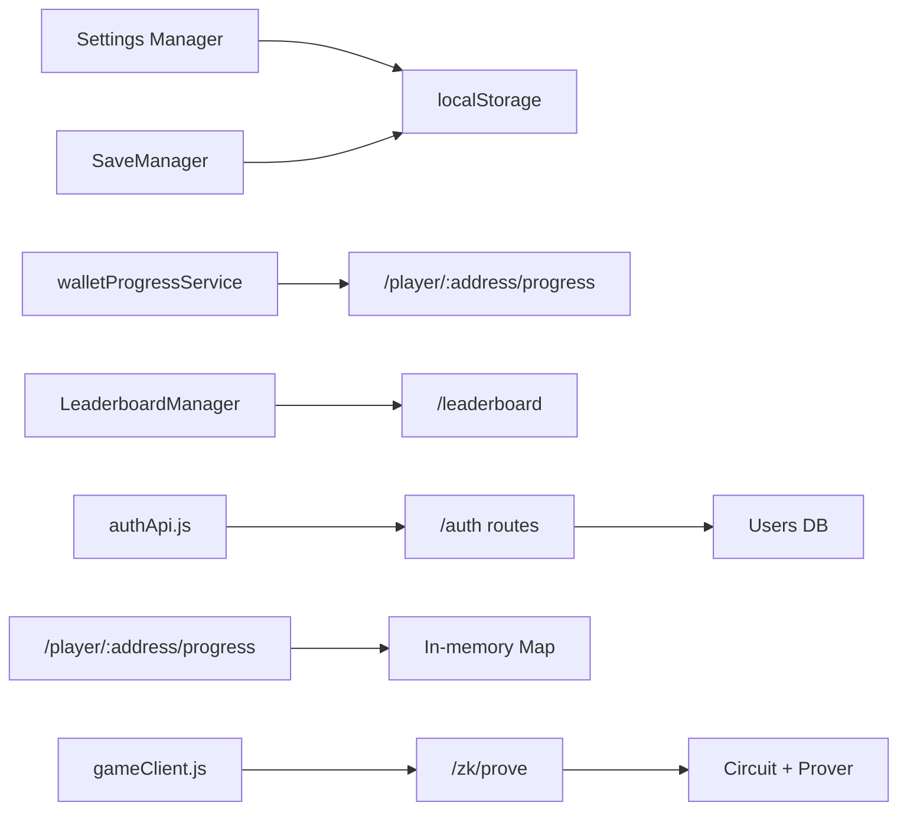

**Diagram sources**
- [main.js](file://src/main.js#L246-L317)
- [SaveManager.js](file://src/systems/SaveManager.js#L1-L187)
- [walletProgressService.js](file://src/utils/walletProgressService.js#L1-L140)
- [LeaderboardManager.js](file://src/systems/LeaderboardManager.js#L1-L135)
- [authApi.js](file://src/utils/authApi.js#L1-L184)
- [auth.js](file://server/routes/auth.js#L1-L115)
- [users.js](file://server/db/users.js#L1-L181)
- [index.js](file://server/index.js#L129-L154)
- [index.js](file://server/index.js#L196-L216)

**Section sources**
- [main.js](file://src/main.js#L232-L317)
- [SaveManager.js](file://src/systems/SaveManager.js#L1-L187)
- [walletProgressService.js](file://src/utils/walletProgressService.js#L1-L140)
- [LeaderboardManager.js](file://src/systems/LeaderboardManager.js#L1-L135)
- [authApi.js](file://src/utils/authApi.js#L1-L184)
- [auth.js](file://server/routes/auth.js#L1-L115)
- [users.js](file://server/db/users.js#L1-L181)
- [index.js](file://server/index.js#L129-L154)
- [index.js](file://server/index.js#L196-L216)

## Performance Considerations
- Local storage operations are synchronous and fast but limited in size; avoid storing large payloads
- Wallet-backed progress uses lightweight JSON; batch updates via the service layer
- Leaderboard sorts are O(n log n) with small N; keep entries trimmed to top N
- Supabase/PostgreSQL queries use indexed public_key; ensure proper indexing
- Connection pooling reduces overhead for PostgreSQL; tune pool size and timeouts for production
- WebSocket broadcasting for XP events scales with connected clients; monitor client counts

[No sources needed since this section provides general guidance]

## Troubleshooting Guide
- Authentication failures: verify Freighter availability and network passphrase; check backend logs for SEP-10 errors
- JWT not persisted: confirm localStorage availability and that the token is stored after login
- Progress not saving: ensure wallet is connected and the API endpoint responds; inspect network tab for errors
- Leaderboard not updating: confirm wallet address correctness and that score/wave meet minimum thresholds
- Supabase/PostgreSQL not configured: expect in-memory fallback for users; configure DATABASE_URL or SUPABASE_* for persistence
- ZK proof errors: validate run hash, score/wave rules, and nonce uniqueness

**Section sources**
- [sep10StellarAuth.js](file://src/utils/sep10StellarAuth.js#L65-L164)
- [authApi.js](file://src/utils/authApi.js#L167-L183)
- [walletProgressApi.js](file://src/utils/walletProgressApi.js#L15-L45)
- [LeaderboardManager.js](file://src/systems/LeaderboardManager.js#L81-L99)
- [users.js](file://server/db/users.js#L131-L180)
- [index.js](file://server/index.js#L196-L216)

## Conclusion
Vibe-Coder employs a layered storage strategy:
- Wallet identity anchors progress and ranking
- Local storage ensures offline usability for settings and saves
- Optional Supabase/PostgreSQL extends user persistence
- SEP-10 auth secures sessions with JWTs
- ZK integration enables verifiable, on-chain rankings

[No sources needed since this section summarizes without analyzing specific files]

## Appendices

### Database Schema and Migration
- Users table with unique public_key, timestamps, and JWT fields
- Optional trigger to maintain updated_at
- Migration script applies schema to PostgreSQL via DATABASE_URL

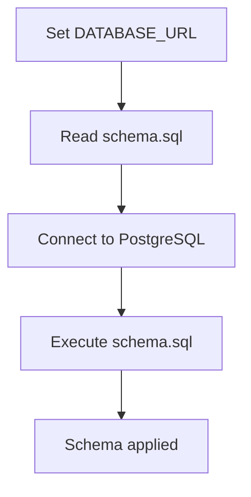

**Diagram sources**
- [schema.sql](file://server/db/schema.sql#L1-L31)
- [run_db_schema.js](file://scripts/run_db_schema.js#L16-L37)

**Section sources**
- [schema.sql](file://server/db/schema.sql#L1-L31)
- [run_db_schema.js](file://scripts/run_db_schema.js#L1-L38)

### Data Model Definitions
- Users: identity and session metadata
- Player Progress: upgrades, legendaries, high scores, save state, selected character
- Leaderboard Entry: address, wave, score, date

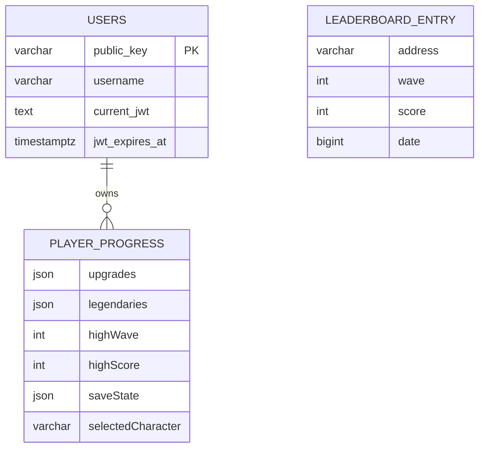

**Diagram sources**
- [users.js](file://server/db/users.js#L17-L26)
- [index.js](file://server/index.js#L140-L151)
- [index.js](file://server/index.js#L170-L180)

**Section sources**
- [users.js](file://server/db/users.js#L17-L26)
- [index.js](file://server/index.js#L129-L154)
- [index.js](file://server/index.js#L165-L194)

### Query Patterns and API Endpoints
- Auth: GET /auth?account=… and POST /auth with signed challenge
- User: GET /auth/me and PATCH /auth/me/username
- Progress: GET /player/:address/progress and POST /player/:address/progress
- Leaderboard: GET /leaderboard and POST /leaderboard
- ZK: POST /zk/prove

**Section sources**
- [auth.js](file://server/routes/auth.js#L19-L112)
- [index.js](file://server/index.js#L129-L194)

### Privacy and Security Notes
- JWTs are stored in localStorage; protect against XSS and ensure HTTPS in production
- Wallet address is the identity for progress and leaderboard; avoid exposing sensitive data
- SEP-10 ensures the user controls the private key; backend verifies signatures server-side
- Local storage is client-side; do not store secrets or sensitive credentials

[No sources needed since this section provides general guidance]