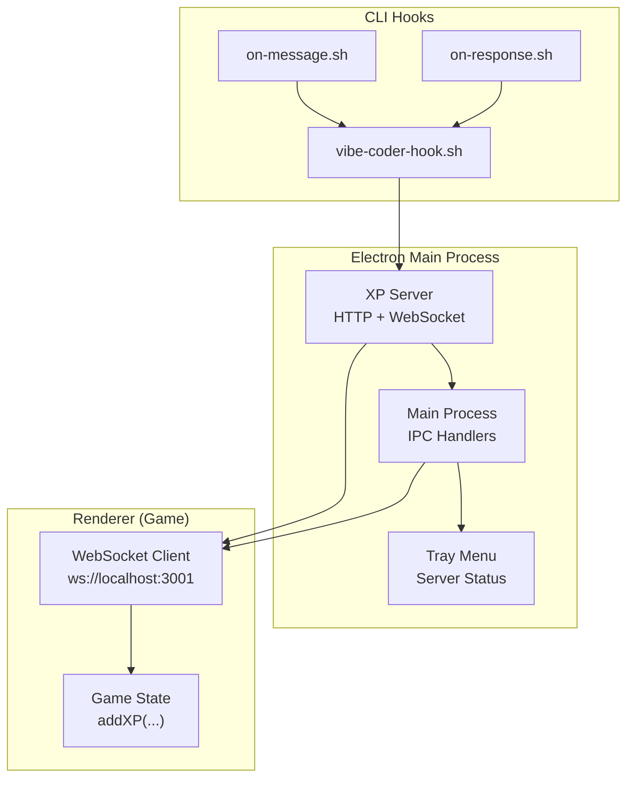
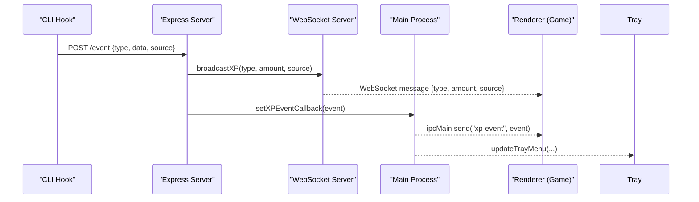
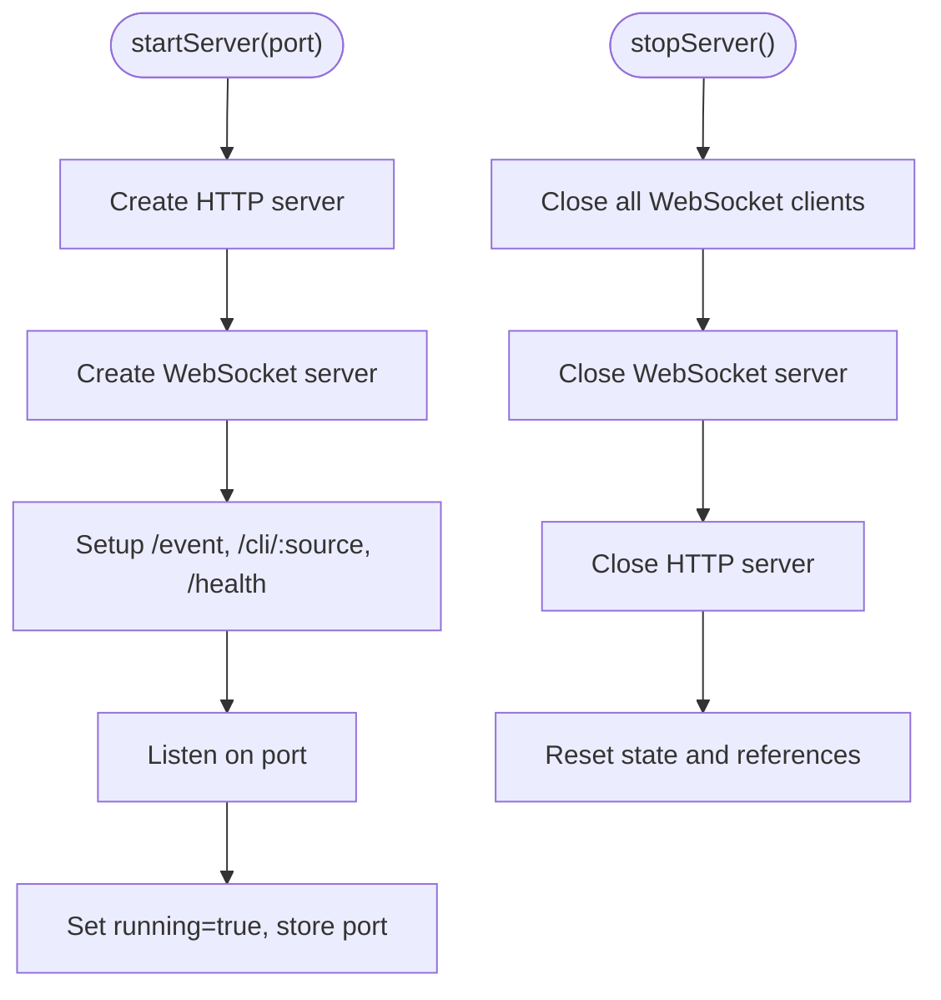
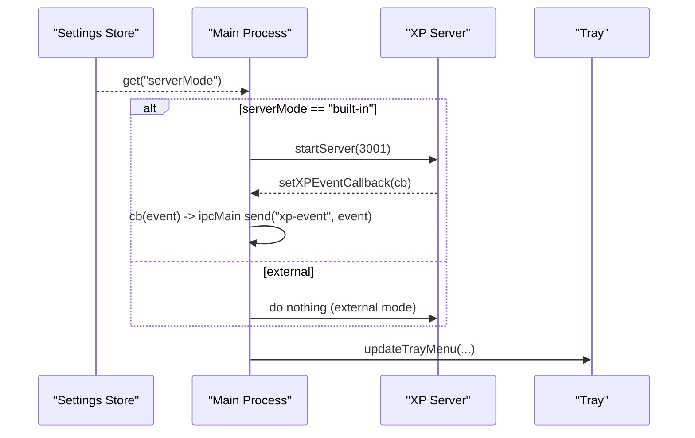
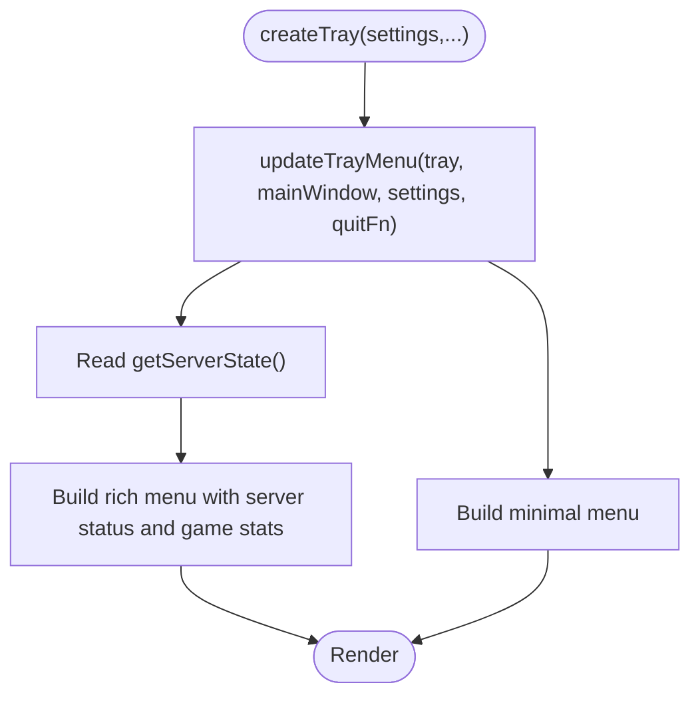
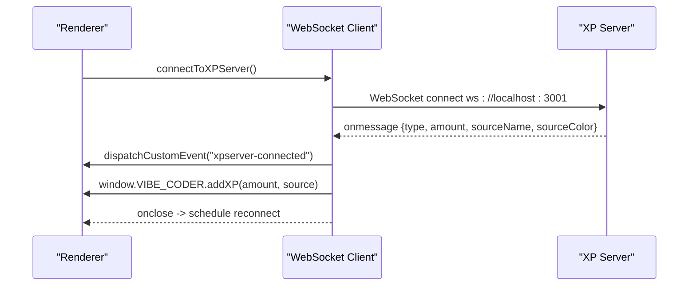
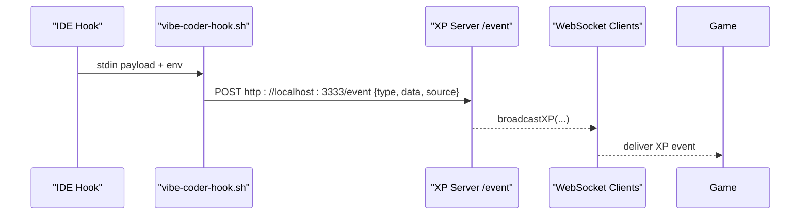
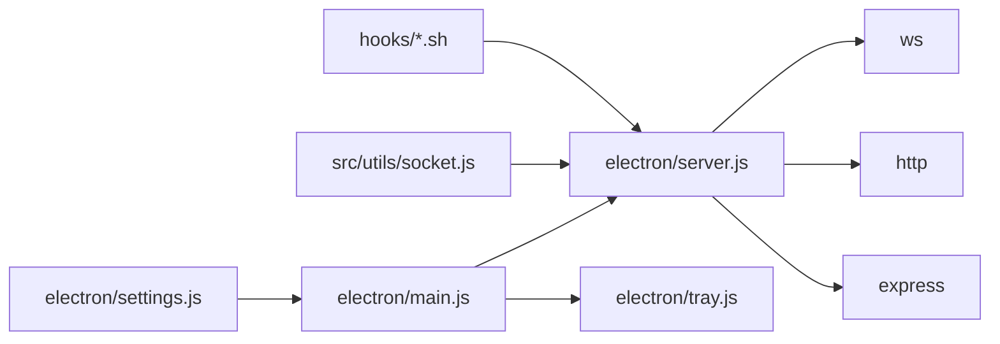

# Built-in Server

<cite>
**Referenced Files in This Document**
- [electron/server.js](file://electron/server.js)
- [electron/main.js](file://electron/main.js)
- [electron/tray.js](file://electron/tray.js)
- [electron/settings.js](file://electron/settings.js)
- [src/utils/socket.js](file://src/utils/socket.js)
- [hooks/vibe-coder-hook.sh](file://hooks/vibe-coder-hook.sh)
- [hooks/on-message.sh](file://hooks/on-message.sh)
- [hooks/on-response.sh](file://hooks/on-response.sh)
- [xp-server.js](file://xp-server.js)
</cite>

## Table of Contents
1. [Introduction](#introduction)
2. [Project Structure](#project-structure)
3. [Core Components](#core-components)
4. [Architecture Overview](#architecture-overview)
5. [Detailed Component Analysis](#detailed-component-analysis)
6. [Dependency Analysis](#dependency-analysis)
7. [Performance Considerations](#performance-considerations)
8. [Troubleshooting Guide](#troubleshooting-guide)
9. [Conclusion](#conclusion)

## Introduction
This document explains the Vibe-Coder built-in server functionality that powers XP event broadcasting to the game. It covers the XP event server implementation, WebSocket integration, real-time communication, server lifecycle, port management, external server mode switching, and the forwarding of XP events to the renderer process and tray updates. It also documents configuration options, error recovery mechanisms, and the relationship between built-in and external server modes.

## Project Structure
The built-in server lives in the Electron main process and exposes:
- An HTTP endpoint for receiving XP events from CLI hooks
- A WebSocket server for real-time delivery to the game
- A small internal callback mechanism to propagate XP events to the renderer and tray

The renderer connects via WebSocket to receive XP events and integrates them into the game state. The tray displays server status and game statistics.

**Diagram sources**
- [electron/server.js](file://electron/server.js#L75-L151)
- [electron/main.js](file://electron/main.js#L129-L158)
- [electron/tray.js](file://electron/tray.js#L92-L159)
- [src/utils/socket.js](file://src/utils/socket.js#L18-L104)
- [hooks/on-message.sh](file://hooks/on-message.sh#L1-L5)
- [hooks/on-response.sh](file://hooks/on-response.sh#L1-L5)
- [hooks/vibe-coder-hook.sh](file://hooks/vibe-coder-hook.sh#L1-L24)

**Section sources**
- [electron/server.js](file://electron/server.js#L1-L183)
- [electron/main.js](file://electron/main.js#L129-L158)
- [electron/tray.js](file://electron/tray.js#L92-L159)
- [src/utils/socket.js](file://src/utils/socket.js#L1-L121)
- [hooks/vibe-coder-hook.sh](file://hooks/vibe-coder-hook.sh#L1-L24)
- [hooks/on-message.sh](file://hooks/on-message.sh#L1-L5)
- [hooks/on-response.sh](file://hooks/on-response.sh#L1-L5)

## Core Components
- XP Server module: Provides HTTP endpoints and WebSocket broadcasting, maintains server state, and forwards XP events to the main process.
- Main process: Initializes the built-in server, registers the XP event callback, and forwards events to the renderer and tray.
- Tray: Displays server status and game stats, updating on XP events and server state changes.
- Renderer WebSocket client: Connects to the built-in server, parses XP events, and updates game state.
- CLI hooks: Send XP events to the server via HTTP POST.

Key responsibilities:
- Server startup/shutdown and port management
- Real-time XP broadcasting via WebSocket
- XP event forwarding to renderer and tray
- Server mode switching between built-in and external
- Error recovery and graceful shutdown

**Section sources**
- [electron/server.js](file://electron/server.js#L11-L183)
- [electron/main.js](file://electron/main.js#L129-L158)
- [electron/tray.js](file://electron/tray.js#L92-L159)
- [src/utils/socket.js](file://src/utils/socket.js#L1-L121)
- [hooks/vibe-coder-hook.sh](file://hooks/vibe-coder-hook.sh#L1-L24)

## Architecture Overview
The built-in server is an Express + WebSocket server embedded in the Electron main process. It listens on a configurable port, accepts XP events from CLI hooks, and broadcasts them to connected game clients. The main process subscribes to XP events and forwards them to the renderer and tray.

**Diagram sources**
- [electron/server.js](file://electron/server.js#L99-L119)
- [electron/server.js](file://electron/server.js#L48-L73)
- [electron/main.js](file://electron/main.js#L129-L143)
- [src/utils/socket.js](file://src/utils/socket.js#L54-L72)

## Detailed Component Analysis

### XP Event Server (Electron)
Implements:
- HTTP endpoints:
  - POST /event: Accepts XP events from CLI hooks and computes XP amounts based on type and source.
  - GET /health: Returns server health and client count.
  - POST /cli/:source: CLI-specific endpoint for direct actions from supported sources.
- WebSocket broadcasting:
  - On each connection, tracks client count and logs connection/close events.
  - Broadcasts XP events to all connected clients.
- Server state:
  - Tracks running status, port, client count, and last event.
- Callback system:
  - Exposes a callback registration to notify the main process of XP events.

Startup and shutdown:
- startServer(port): Creates Express + HTTP server + WebSocket server, sets up routes and connection handlers, starts listening on the given port, and marks the server as running.
- stopServer(): Closes all WebSocket connections, closes the WebSocket server and HTTP server, clears state, and resets running flag.
- getServerState(): Returns a copy of the current server state including live client count.

Error handling:
- Graceful handling of missing or malformed data in HTTP requests.
- Robust client tracking and cleanup on close.

**Diagram sources**
- [electron/server.js](file://electron/server.js#L75-L151)
- [electron/server.js](file://electron/server.js#L153-L174)

**Section sources**
- [electron/server.js](file://electron/server.js#L11-L183)

### Main Process Integration
Responsibilities:
- Server initialization:
  - Reads serverMode setting and starts the built-in server on port 3001 when configured.
  - Registers the XP event callback to forward events to the renderer and update the tray.
- Server mode switching:
  - Toggles between built-in and external modes by starting/stopping the built-in server or leaving it off for external mode.
  - Persists the new mode in settings and refreshes the tray menu.
- IPC handlers:
  - Provides server state retrieval and toggling server mode to the renderer.
  - Handles game state updates to refresh tray menus.

**Diagram sources**
- [electron/main.js](file://electron/main.js#L129-L158)
- [electron/settings.js](file://electron/settings.js#L28-L30)

**Section sources**
- [electron/main.js](file://electron/main.js#L129-L158)
- [electron/settings.js](file://electron/settings.js#L28-L30)

### Tray Updates
The tray menu reflects:
- Server status (running/off) and client count
- Game state (level, XP, weapon, run time)
- Window mode and always-on-top preferences
- Quick actions to toggle window visibility and quit

Updates occur when:
- XP events arrive (to reflect recent activity)
- Server state changes
- Game state messages are received

**Diagram sources**
- [electron/tray.js](file://electron/tray.js#L92-L159)

**Section sources**
- [electron/tray.js](file://electron/tray.js#L92-L159)

### Renderer WebSocket Client
Connects to the built-in server at ws://localhost:3001 and:
- Establishes a persistent WebSocket connection
- Parses incoming XP events and calls the game’s addXP function with source metadata
- Emits custom events for connection/disconnection to drive UI feedback
- Automatically reconnects with exponential backoff-like delays
- Guards against connecting when not on localhost to avoid cross-origin failures

**Diagram sources**
- [src/utils/socket.js](file://src/utils/socket.js#L18-L104)
- [electron/server.js](file://electron/server.js#L48-L73)

**Section sources**
- [src/utils/socket.js](file://src/utils/socket.js#L1-L121)

### CLI Hooks Integration
The CLI hooks send XP events to the server:
- on-message.sh and on-response.sh set the event type and delegate to vibe-coder-hook.sh
- vibe-coder-hook.sh reads stdin, detects the event type, sets the source, and posts to the server’s /event endpoint
- The server computes XP amounts and broadcasts to the game via WebSocket

**Diagram sources**
- [hooks/on-message.sh](file://hooks/on-message.sh#L1-L5)
- [hooks/on-response.sh](file://hooks/on-response.sh#L1-L5)
- [hooks/vibe-coder-hook.sh](file://hooks/vibe-coder-hook.sh#L1-L24)
- [xp-server.js](file://xp-server.js#L20-L70)

**Section sources**
- [hooks/vibe-coder-hook.sh](file://hooks/vibe-coder-hook.sh#L1-L24)
- [hooks/on-message.sh](file://hooks/on-message.sh#L1-L5)
- [hooks/on-response.sh](file://hooks/on-response.sh#L1-L5)
- [xp-server.js](file://xp-server.js#L1-L106)

## Dependency Analysis
- electron/server.js depends on:
  - ws for WebSocket server
  - http for the underlying server
  - express for HTTP routing
- electron/main.js depends on:
  - electron/server.js for server lifecycle and callbacks
  - electron/tray.js for tray updates
  - electron/settings.js for configuration
- src/utils/socket.js depends on:
  - WebSocket API for real-time communication
- CLI hooks depend on:
  - Local HTTP server availability on port 3333 (legacy standalone server) or 3001 (built-in server)

**Diagram sources**
- [electron/settings.js](file://electron/settings.js#L28-L30)
- [electron/main.js](file://electron/main.js#L7-L7)
- [electron/server.js](file://electron/server.js#L1-L3)
- [src/utils/socket.js](file://src/utils/socket.js#L1-L3)
- [hooks/vibe-coder-hook.sh](file://hooks/vibe-coder-hook.sh#L15)

**Section sources**
- [electron/server.js](file://electron/server.js#L1-L3)
- [electron/main.js](file://electron/main.js#L1-L10)
- [src/utils/socket.js](file://src/utils/socket.js#L1-L3)
- [hooks/vibe-coder-hook.sh](file://hooks/vibe-coder-hook.sh#L15)

## Performance Considerations
- Broadcasting to all clients: The server iterates over the clients set and sends messages to each client whose readyState indicates an open connection. This is O(n) per broadcast.
- Client tracking: Maintains a Set of clients and updates counts on connect/close. Consider limiting max clients if needed.
- HTTP parsing: Uses express.json(), which is efficient for typical payloads. Ensure CLI hook payloads remain lightweight.
- Reconnection: The renderer retries with a fixed interval; consider jitter to reduce thundering herd on restarts.
- Port contention: Default ports differ between built-in (3001) and legacy standalone (3333). Avoid conflicts by ensuring only one server runs at a time.

[No sources needed since this section provides general guidance]

## Troubleshooting Guide
Common issues and resolutions:
- Server not running:
  - Verify server mode is set to built-in and the app restarted.
  - Confirm the server is listening on the expected port.
- WebSocket connection fails:
  - Ensure the renderer is running locally; the client guards against non-localhost environments.
  - Check for firewall or proxy blocking the local port.
- No XP events in the game:
  - Confirm CLI hooks are executable and properly configured.
  - Test sending a manual HTTP POST to the /event endpoint.
  - Check the renderer console for connection/disconnection events.
- Tray shows server off:
  - Toggle server mode via the tray menu to restart the built-in server.
  - Verify the main process callback is registered and events are being forwarded.

Operational checks:
- Use the /health endpoint to confirm server status and client count.
- Inspect server logs for connection and broadcast messages.
- Validate XP amounts computed by the server based on event type and source.

**Section sources**
- [electron/server.js](file://electron/server.js#L135-L142)
- [src/utils/socket.js](file://src/utils/socket.js#L18-L104)
- [hooks/vibe-coder-hook.sh](file://hooks/vibe-coder-hook.sh#L14-L20)
- [electron/main.js](file://electron/main.js#L146-L158)

## Conclusion
The built-in server provides a compact, integrated solution for XP event broadcasting. It combines an HTTP endpoint for CLI hooks with a WebSocket server for real-time game updates, while integrating tightly with the main process and tray. The system supports seamless switching between built-in and external server modes, robust error recovery, and straightforward configuration via settings. For most development scenarios, the built-in server offers a reliable, low-friction path to XP-driven gameplay.