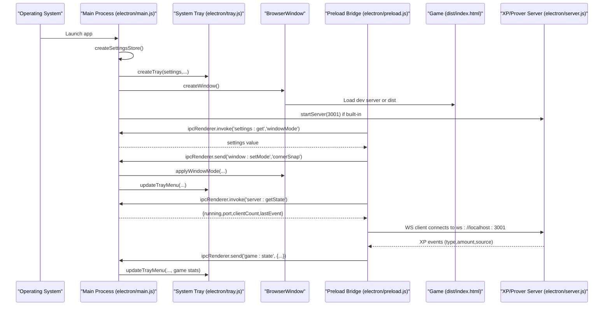
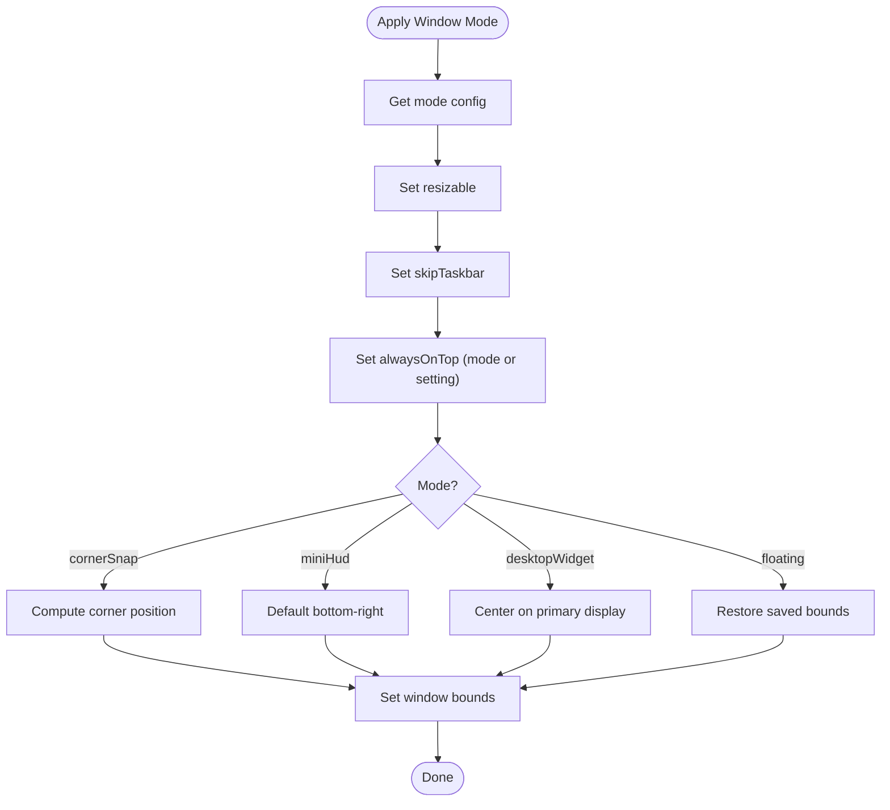
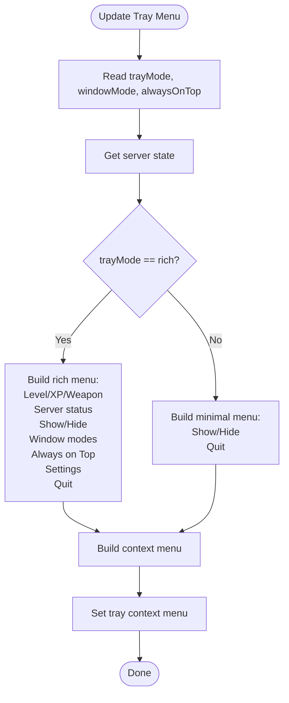
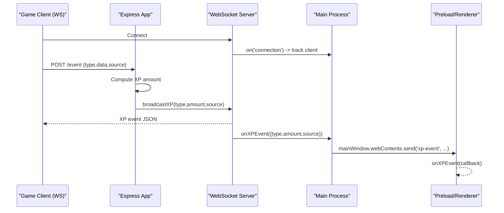
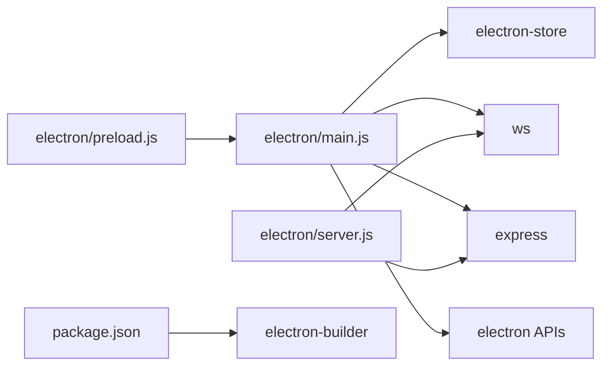

# Desktop Application

<cite>
**Referenced Files in This Document**
- [electron/main.js](file://electron/main.js)
- [electron/preload.js](file://electron/preload.js)
- [electron/windows.js](file://electron/windows.js)
- [electron/tray.js](file://electron/tray.js)
- [electron/settings.js](file://electron/settings.js)
- [electron/server.js](file://electron/server.js)
- [package.json](file://package.json)
- [README.md](file://README.md)
- [SETUP.md](file://SETUP.md)
- [CHANGELOG.md](file://CHANGELOG.md)
- [Dockerfile.prover](file://Dockerfile.prover)
- [render.yaml](file://render.yaml)
</cite>

## Table of Contents
1. [Introduction](#introduction)
2. [Project Structure](#project-structure)
3. [Core Components](#core-components)
4. [Architecture Overview](#architecture-overview)
5. [Detailed Component Analysis](#detailed-component-analysis)
6. [Dependency Analysis](#dependency-analysis)
7. [Performance Considerations](#performance-considerations)
8. [Troubleshooting Guide](#troubleshooting-guide)
9. [Conclusion](#conclusion)
10. [Appendices](#appendices)

## Introduction
This document explains the Vibe-Coder desktop application built with Electron. It covers the main process implementation, renderer integration, inter-process communication (IPC), window management, system tray integration, cross-platform considerations, the built-in XP/prover server for offline play, settings and preferences persistence, packaging and distribution, and the relationship between the desktop app and the web version. It also includes installation instructions, configuration options, and troubleshooting guidance for desktop-specific issues.

## Project Structure
The desktop application is implemented under the electron/ directory and integrates with the web game built via Vite. The main process initializes the BrowserWindow, sets up IPC, manages the system tray, applies window modes, and controls the built-in XP/prover server. The renderer communicates through a preload bridge exposing a safe subset of Electron APIs.

```mermaid
graph TB
subgraph "Electron Main Process"
M["electron/main.js"]
W["electron/windows.js"]
T["electron/tray.js"]
S["electron/server.js"]
ST["electron/settings.js"]
end
subgraph "Renderer (Game)"
P["electron/preload.js"]
G["dist/index.html<br/>or dev server"]
end
M --> W
M --> T
M --> S
M --> ST
M <- --> P
P --> G
```

**Diagram sources**
- [electron/main.js](file://electron/main.js#L1-L274)
- [electron/windows.js](file://electron/windows.js#L1-L130)
- [electron/tray.js](file://electron/tray.js#L1-L176)
- [electron/server.js](file://electron/server.js#L1-L183)
- [electron/settings.js](file://electron/settings.js#L1-L51)
- [electron/preload.js](file://electron/preload.js#L1-L43)

**Section sources**
- [electron/main.js](file://electron/main.js#L1-L274)
- [electron/preload.js](file://electron/preload.js#L1-L43)
- [electron/windows.js](file://electron/windows.js#L1-L130)
- [electron/tray.js](file://electron/tray.js#L1-L176)
- [electron/settings.js](file://electron/settings.js#L1-L51)
- [electron/server.js](file://electron/server.js#L1-L183)

## Core Components
- Main process controller orchestrating BrowserWindow, IPC, tray, window modes, and server lifecycle.
- Preload bridge exposing a controlled API surface to the renderer.
- Window mode manager supporting floating, corner snap, desktop widget, and mini HUD modes.
- System tray with rich/minimal menus and dynamic updates based on game state and server status.
- Settings store backed by electron-store with defaults for launch, tray, window, audio, notifications, server, and hotkeys.
- Built-in XP/prover server providing WebSocket and HTTP endpoints for real-time XP events and optional ZK prover functionality.

**Section sources**
- [electron/main.js](file://electron/main.js#L1-L274)
- [electron/preload.js](file://electron/preload.js#L1-L43)
- [electron/windows.js](file://electron/windows.js#L1-L130)
- [electron/tray.js](file://electron/tray.js#L1-L176)
- [electron/settings.js](file://electron/settings.js#L1-L51)
- [electron/server.js](file://electron/server.js#L1-L183)

## Architecture Overview
The desktop app runs the web game inside an Electron BrowserWindow. The main process handles OS integrations (tray, global shortcuts, single-instance lock), window modes, and the built-in XP/prover server. The renderer interacts safely via IPC exposed in the preload script. The server can operate in built-in mode (embedded) or external mode (configured URL), enabling offline play and optional ZK prover integration.



**Diagram sources**
- [electron/main.js](file://electron/main.js#L1-L274)
- [electron/preload.js](file://electron/preload.js#L1-L43)
- [electron/server.js](file://electron/server.js#L1-L183)
- [electron/tray.js](file://electron/tray.js#L1-L176)

## Detailed Component Analysis

### Main Process (electron/main.js)
Responsibilities:
- Creates and manages the main BrowserWindow, loading either the dev server or the built dist.
- Implements single-instance lock and macOS dock activation behavior.
- Registers global shortcuts for toggling the window and cycling window modes.
- Sets up IPC handlers for window controls, settings, server state, and game state updates.
- Initializes and controls the built-in XP/prover server, forwarding XP events to the renderer and tray.
- Applies window modes and persists window bounds.

Key behaviors:
- Window lifecycle: hide on close, persist bounds, show/hide toggling, always-on-top toggle.
- Server lifecycle: start/stop, mode switching between built-in and external, callback propagation.
- Tray integration: menu updates on visibility changes and game state.

**Section sources**
- [electron/main.js](file://electron/main.js#L1-L274)

### Preload Bridge (electron/preload.js)
Responsibilities:
- Exposes a safe API surface to the renderer using contextBridge.
- Provides window controls, settings access, game state reporting, notifications, server control, and event listeners.
- Marks the environment as Electron and exposes platform info.

Usage pattern:
- Renderer calls electronAPI methods to send IPC messages to the main process.
- Renderer registers listeners for XP events and window mode changes.

**Section sources**
- [electron/preload.js](file://electron/preload.js#L1-L43)

### Window Management (electron/windows.js)
Responsibilities:
- Defines window modes: floating, cornerSnap, desktopWidget, miniHud.
- Computes positions for corner snapping and centers desktop widgets.
- Applies mode-specific properties (resizable, skipTaskbar, alwaysOnTop).
- Handles frameless/transparency via renderer-side CSS for desktop widget mode.
- Supports cycling modes and corner positions.

Platform notes:
- Desktop widget mode uses workspace visibility on macOS for widget-like behavior.

**Section sources**
- [electron/windows.js](file://electron/windows.js#L1-L130)

### System Tray (electron/tray.js)
Responsibilities:
- Creates and manages the system tray icon with fallbacks.
- Builds rich and minimal context menus with actions for show/hide, window modes, always-on-top, settings, and quit.
- Updates menu items dynamically based on window visibility, server state, and game statistics.
- Stores and exposes callbacks for tray interactions.

**Section sources**
- [electron/tray.js](file://electron/tray.js#L1-L176)

### Settings and Preferences (electron/settings.js)
Responsibilities:
- Creates a persistent settings store with defaults for:
  - Launch options (auto-start)
  - Tray behavior (mode)
  - Window behavior (mode, always-on-top, bounds, corner position)
  - Audio (music, SFX, XP chime)
  - Notifications (level-up, legendary, high-score)
  - Server mode (built-in or external) and external URL
  - Global hotkeys (toggle, cycle window)

Persistence:
- Uses electron-store to persist settings under a dedicated file.

**Section sources**
- [electron/settings.js](file://electron/settings.js#L1-L51)

### Built-in XP/Prover Server (electron/server.js)
Responsibilities:
- Runs an Express server with a WebSocket server on port 3001 by default.
- Accepts HTTP POST /event for XP events and /cli/:source for CLI-specific events.
- Broadcasts XP events to connected clients with source metadata and XP amounts.
- Maintains server state (running, port, client count, last event).
- Exposes a callback mechanism for main process to receive XP events and update tray.

XP values and CLI sources:
- Configurable XP amounts per event type and per CLI source.
- Color-coded source metadata for rendering in the game.

Lifecycle:
- startServer(), stopServer(), getServerState(), isServerRunning().
- setXPEventCallback() for main process integration.

**Section sources**
- [electron/server.js](file://electron/server.js#L1-L183)

### IPC and Renderer Integration
IPC channels and handlers:
- Window controls: window:minimize, window:maximize, window:close.
- Settings: settings:get (invoke), settings:set (invoke).
- Window mode: window:setMode, window:toggleAlwaysOnTop.
- Server: server:getState (invoke), server:toggle.
- Game state: game:state (send) for tray updates.
- Renderer listeners: onXPEvent, onWindowModeChanged.

Security:
- Preload uses contextBridge to expose only necessary APIs.
- Node integration disabled in BrowserWindow webPreferences.

**Section sources**
- [electron/main.js](file://electron/main.js#L173-L203)
- [electron/preload.js](file://electron/preload.js#L1-L43)

### Packaging and Distribution (package.json and electron-builder)
Build and distribution:
- Main entry: electron/main.js
- Scripts: dev, build, preview, server, electron, electron:dev, electron:build, electron:pack
- electron-builder configuration:
  - appId, productName, output directories, files included, extra resources
  - macOS targets: dmg, zip universal
  - Windows targets: nsis, portable
  - Linux targets: AppImage, deb
  - Icons and DMG window configuration

Notes:
- The desktop app bundles the built web assets (dist/**/*) and electron/**/*.
- Extra resources include a top-level icon copied into the app bundle.

**Section sources**
- [package.json](file://package.json#L1-L135)

### Cross-Platform Considerations
- Single-instance lock enforced to avoid multiple instances.
- macOS-specific behaviors:
  - Dock activation recreates window if none exist.
  - Tray icon resized and set as template on macOS for native appearance.
  - Desktop widget visibility on all workspaces on macOS.
- Windows/Linux:
  - Window-all-closed handler keeps the app alive when tray is present.

**Section sources**
- [electron/main.js](file://electron/main.js#L234-L271)
- [electron/tray.js](file://electron/tray.js#L47-L50)
- [electron/windows.js](file://electron/windows.js#L90-L94)

### Relationship Between Desktop App and Web Version
- The desktop app loads the web game either from the dev server (localhost:5173) in development or from the built dist in production.
- The built-in XP/prover server enables offline play by broadcasting XP events to the game via WebSocket.
- Optional ZK prover integration is supported when the server is configured externally (e.g., via Docker or Render blueprint), aligning with the web version’s prover configuration.

**Section sources**
- [electron/main.js](file://electron/main.js#L48-L54)
- [electron/server.js](file://electron/server.js#L75-L151)
- [README.md](file://README.md#L1-L158)
- [Dockerfile.prover](file://Dockerfile.prover#L1-L26)
- [render.yaml](file://render.yaml#L1-L15)

## Architecture Overview

```mermaid
graph TB
subgraph "Desktop App"
MP["Main Process<br/>electron/main.js"]
BR["Preload Bridge<br/>electron/preload.js"]
WM["Window Modes<br/>electron/windows.js"]
TR["System Tray<br/>electron/tray.js"]
ST["Settings Store<br/>electron/settings.js"]
SRV["XP/Prover Server<br/>electron/server.js"]
end
subgraph "Game Runtime"
BW["BrowserWindow"]
HTML["dist/index.html"]
end
MP --> WM
MP --> TR
MP --> ST
MP --> SRV
MP <- --> BR
BR --> BW
BW --> HTML
SRV --> HTML
```

**Diagram sources**
- [electron/main.js](file://electron/main.js#L1-L274)
- [electron/preload.js](file://electron/preload.js#L1-L43)
- [electron/windows.js](file://electron/windows.js#L1-L130)
- [electron/tray.js](file://electron/tray.js#L1-L176)
- [electron/settings.js](file://electron/settings.js#L1-L51)
- [electron/server.js](file://electron/server.js#L1-L183)

## Detailed Component Analysis

### Window Modes and Positioning


**Diagram sources**
- [electron/windows.js](file://electron/windows.js#L60-L106)

**Section sources**
- [electron/windows.js](file://electron/windows.js#L1-L130)

### Tray Menu Construction


**Diagram sources**
- [electron/tray.js](file://electron/tray.js#L92-L159)

**Section sources**
- [electron/tray.js](file://electron/tray.js#L1-L176)

### XP Server Lifecycle and Broadcasting


**Diagram sources**
- [electron/server.js](file://electron/server.js#L75-L151)
- [electron/main.js](file://electron/main.js#L129-L144)

**Section sources**
- [electron/server.js](file://electron/server.js#L1-L183)
- [electron/main.js](file://electron/main.js#L129-L144)

### Settings Defaults and Categories
- Launch: autoStart
- Tray: trayMode
- Window: windowMode, alwaysOnTop, windowBounds, cornerPosition
- Audio: musicEnabled, musicVolume, sfxEnabled, sfxVolume, xpChimeEnabled
- Notifications: notifyLevelUp, notifyLegendary, notifyHighScore
- Server: serverMode, externalServerUrl
- Hotkeys: toggleHotkey, cycleWindowHotkey

**Section sources**
- [electron/settings.js](file://electron/settings.js#L3-L35)

## Dependency Analysis
- Main process depends on:
  - electron-store for settings persistence
  - ws and express for the XP/prover server
  - electron APIs for BrowserWindow, Tray, Menu, globalShortcut, screen
- Renderer depends on:
  - preload bridge for IPC and platform info
- Packaging depends on:
  - electron-builder configuration in package.json



**Diagram sources**
- [electron/main.js](file://electron/main.js#L1-L10)
- [electron/server.js](file://electron/server.js#L1-L4)
- [package.json](file://package.json#L31-L51)

**Section sources**
- [electron/main.js](file://electron/main.js#L1-L10)
- [electron/server.js](file://electron/server.js#L1-L4)
- [package.json](file://package.json#L31-L51)

## Performance Considerations
- Window mode changes avoid unnecessary recreations by applying resizable, skipTaskbar, and alwaysOnTop flags; frameless/transparency is handled via renderer-side CSS for desktop widget mode.
- XP server maintains a Set of clients and broadcasts efficiently; client counts are tracked and updated on connect/close.
- Settings are persisted via electron-store to reduce startup overhead.
- Consider minimizing heavy computations in the main process; delegate rendering and game logic to the renderer.

## Troubleshooting Guide
Common desktop-specific issues and resolutions:
- Tray icon not visible or incorrect:
  - Ensure icon paths exist and are readable; fallback to a colored square is provided.
  - On macOS, template images are set for proper menu bar appearance.
- Window does not appear or closes unexpectedly:
  - The app hides to tray on close; use tray menu or global shortcut to show.
  - Verify global shortcuts are registered and not conflicting with OS shortcuts.
- Built-in XP server not running:
  - Confirm server mode is set to built-in; the main process starts the server on port 3001.
  - Check that the port is not blocked and the game connects to ws://localhost:3001.
- External server configuration:
  - Switch server mode to external and set externalServerUrl accordingly.
  - For ZK prover integration, deploy the prover using the provided Dockerfile and Render blueprint.
- macOS-specific:
  - Dock icon activation restores the window.
  - Desktop widget visibility on all workspaces is handled on macOS.

**Section sources**
- [electron/tray.js](file://electron/tray.js#L31-L71)
- [electron/main.js](file://electron/main.js#L234-L271)
- [electron/server.js](file://electron/server.js#L75-L151)
- [README.md](file://README.md#L1-L158)
- [Dockerfile.prover](file://Dockerfile.prover#L1-L26)
- [render.yaml](file://render.yaml#L1-L15)

## Conclusion
The Vibe-Coder desktop application integrates the web game with Electron to deliver a seamless, cross-platform experience. The main process manages window modes, tray integration, and the built-in XP/prover server, while the preload bridge provides a secure IPC interface to the renderer. Settings persistence, global shortcuts, and packaging configurations enable a polished desktop product. Offline play and optional ZK prover integration align the desktop app with the web version’s capabilities.

## Appendices

### Installation and Setup
- Install dependencies and run the development server:
  - Install dependencies.
  - Run the dev server; the desktop app will load the dev server URL.
- Run the desktop app:
  - Use the Electron script to launch the app with the dev server.
- Build the desktop app:
  - Use the electron:build script to build the web assets and package the app with electron-builder.
- Optional: run the XP/prover server separately for advanced workflows.

**Section sources**
- [README.md](file://README.md#L23-L36)
- [package.json](file://package.json#L7-L22)

### Configuration Options
- Settings categories and keys:
  - Launch: autoStart
  - Tray: trayMode
  - Window: windowMode, alwaysOnTop, windowBounds, cornerPosition
  - Audio: musicEnabled, musicVolume, sfxEnabled, sfxVolume, xpChimeEnabled
  - Notifications: notifyLevelUp, notifyLegendary, notifyHighScore
  - Server: serverMode, externalServerUrl
  - Hotkeys: toggleHotkey, cycleWindowHotkey

**Section sources**
- [electron/settings.js](file://electron/settings.js#L3-L35)

### Auto-Updater Integration
- The repository does not include an auto-updater implementation. Consider integrating electron-updater with electron-builder for automatic updates across platforms.

[No sources needed since this section provides general guidance]

### Packaging and Distribution Details
- Targets and formats:
  - macOS: dmg, zip (universal)
  - Windows: nsis, portable
  - Linux: AppImage, deb
- Icon and DMG window configuration are defined in the electron-builder section of package.json.
- Extra resources include a top-level icon copied into the app bundle.

**Section sources**
- [package.json](file://package.json#L52-L133)

### ZK Prover Deployment (External Server)
- Dockerfile.prover defines a prover service exposing the ZK prove API.
- Render blueprint automates deployment with health checks and environment variables.

**Section sources**
- [Dockerfile.prover](file://Dockerfile.prover#L1-L26)
- [render.yaml](file://render.yaml#L1-L15)

### Version History and Changes
- Review the changelog for recent changes, fixes, and enhancements across versions.

**Section sources**
- [CHANGELOG.md](file://CHANGELOG.md#L1-L465)