# Electron Architecture

<cite>
**Referenced Files in This Document**
- [electron/main.js](file://electron/main.js)
- [electron/preload.js](file://electron/preload.js)
- [electron/windows.js](file://electron/windows.js)
- [electron/settings.js](file://electron/settings.js)
- [electron/tray.js](file://electron/tray.js)
- [electron/server.js](file://electron/server.js)
- [src/main.js](file://src/main.js)
- [src/utils/socket.js](file://src/utils/socket.js)
- [vite.config.js](file://vite.config.js)
- [package.json](file://package.json)
</cite>

## Table of Contents
1. [Introduction](#introduction)
2. [Project Structure](#project-structure)
3. [Core Components](#core-components)
4. [Architecture Overview](#architecture-overview)
5. [Detailed Component Analysis](#detailed-component-analysis)
6. [Dependency Analysis](#dependency-analysis)
7. [Performance Considerations](#performance-considerations)
8. [Security Best Practices](#security-best-practices)
9. [Development vs Production Differences](#development-vs-production-differences)
10. [Troubleshooting Guide](#troubleshooting-guide)
11. [Conclusion](#conclusion)

## Introduction
This document explains the Electron application architecture for Vibe-Coder, focusing on the main process lifecycle, window creation, inter-process communication (IPC), preload script security, and the separation between main and renderer processes. It also covers application initialization, single instance lock handling, platform-specific behaviors, sandboxing considerations, and development versus production differences including hot reload capabilities.

## Project Structure
The Electron application is organized with a clear separation between the main process (Node.js), preload bridge, and renderer (game). The main process initializes the application, creates windows, manages system tray, and exposes IPC handlers. The preload script safely exposes a limited API surface to the renderer. The renderer (Phaser game) communicates with the main process via IPC and optionally connects to a WebSocket-based XP server.

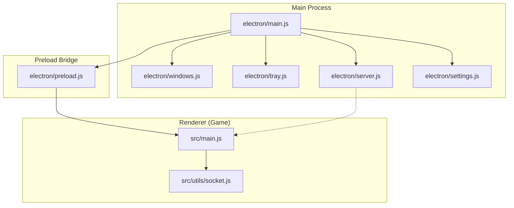

**Diagram sources**
- [electron/main.js](file://electron/main.js#L1-L274)
- [electron/preload.js](file://electron/preload.js#L1-L43)
- [electron/windows.js](file://electron/windows.js#L1-L130)
- [electron/tray.js](file://electron/tray.js#L1-L176)
- [electron/server.js](file://electron/server.js#L1-L183)
- [electron/settings.js](file://electron/settings.js#L1-L51)
- [src/main.js](file://src/main.js#L1-L464)
- [src/utils/socket.js](file://src/utils/socket.js#L1-L121)

**Section sources**
- [electron/main.js](file://electron/main.js#L1-L274)
- [electron/preload.js](file://electron/preload.js#L1-L43)
- [electron/windows.js](file://electron/windows.js#L1-L130)
- [electron/tray.js](file://electron/tray.js#L1-L176)
- [electron/server.js](file://electron/server.js#L1-L183)
- [electron/settings.js](file://electron/settings.js#L1-L51)
- [src/main.js](file://src/main.js#L1-L464)
- [src/utils/socket.js](file://src/utils/socket.js#L1-L121)
- [vite.config.js](file://vite.config.js#L1-L34)
- [package.json](file://package.json#L1-L135)

## Core Components
- Main process entry and lifecycle: Initializes settings, registers IPC handlers, creates the main window, sets up tray, applies window modes, registers global shortcuts, and starts the built-in XP server.
- Preload bridge: Uses contextBridge to expose a controlled API surface to the renderer, preventing direct access to Node.js APIs.
- Window management: Defines multiple window modes (floating, corner snap, desktop widget, mini HUD) with platform-aware positioning and behavior.
- Settings store: Persistent configuration using electron-store with defaults for UI, audio, notifications, server mode, and hotkeys.
- System tray: Dynamic menu reflecting window visibility, server status, and window mode selection.
- Built-in XP server: WebSocket server broadcasting XP events to connected clients and exposing REST endpoints for hook integrations.
- Renderer initialization: Phaser game bootstrap, runtime configuration loading, mobile orientation handling, and optional XP WebSocket connection.

**Section sources**
- [electron/main.js](file://electron/main.js#L1-L274)
- [electron/preload.js](file://electron/preload.js#L1-L43)
- [electron/windows.js](file://electron/windows.js#L1-L130)
- [electron/settings.js](file://electron/settings.js#L1-L51)
- [electron/tray.js](file://electron/tray.js#L1-L176)
- [electron/server.js](file://electron/server.js#L1-L183)
- [src/main.js](file://src/main.js#L1-L464)
- [src/utils/socket.js](file://src/utils/socket.js#L1-L121)

## Architecture Overview
The Electron app follows a strict main/renderer separation:
- Main process runs Node.js, manages OS integrations, and exposes IPC handlers.
- Preload script isolates the renderer from Node.js and exposes a typed API surface.
- Renderer runs the Phaser game and optionally connects to the XP server.

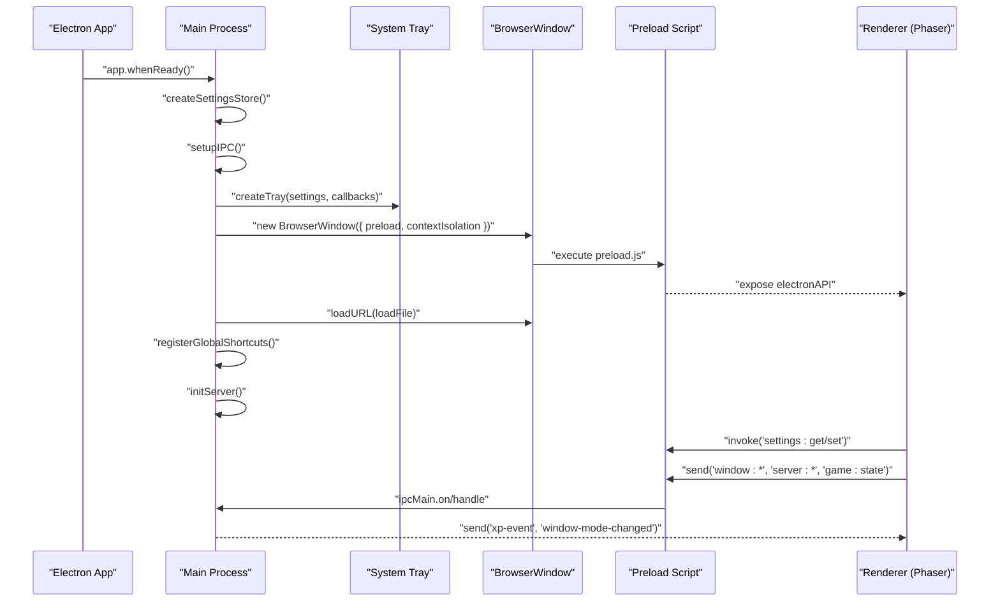

**Diagram sources**
- [electron/main.js](file://electron/main.js#L205-L242)
- [electron/preload.js](file://electron/preload.js#L4-L37)
- [electron/tray.js](file://electron/tray.js#L27-L90)
- [electron/server.js](file://electron/server.js#L75-L151)
- [src/main.js](file://src/main.js#L448-L452)

## Detailed Component Analysis

### Main Process Lifecycle and Application Initialization
- Single instance lock: Ensures only one app instance runs; second instances focus the existing window.
- Ready sequence: Creates settings store, sets up IPC, builds tray, creates window, applies window mode, registers global shortcuts, and starts the XP server.
- Window lifecycle: Handles close to hide, persists bounds, and updates tray on show/hide.
- Global shortcuts: Toggle window and cycle window mode via configurable hotkeys.
- Server lifecycle: Starts/stops built-in XP server and forwards XP events to renderer and tray.

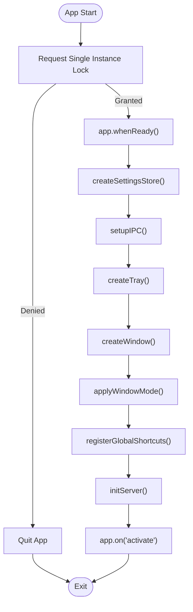

**Diagram sources**
- [electron/main.js](file://electron/main.js#L244-L242)

**Section sources**
- [electron/main.js](file://electron/main.js#L244-L274)

### Window Management and Modes
- Window modes: Floating, Corner Snap, Desktop Widget, Mini HUD with distinct frame, transparency, always-on-top, and skip-taskbar flags.
- Positioning: Corner snapping uses primary display work area; desktop widget centers; mini HUD defaults to bottom-right.
- Frameless/transparency: Handled via renderer-side CSS; frame changes require window recreation.
- Corner cycling and snapping: Utility functions to cycle and snap to corners with persistence.

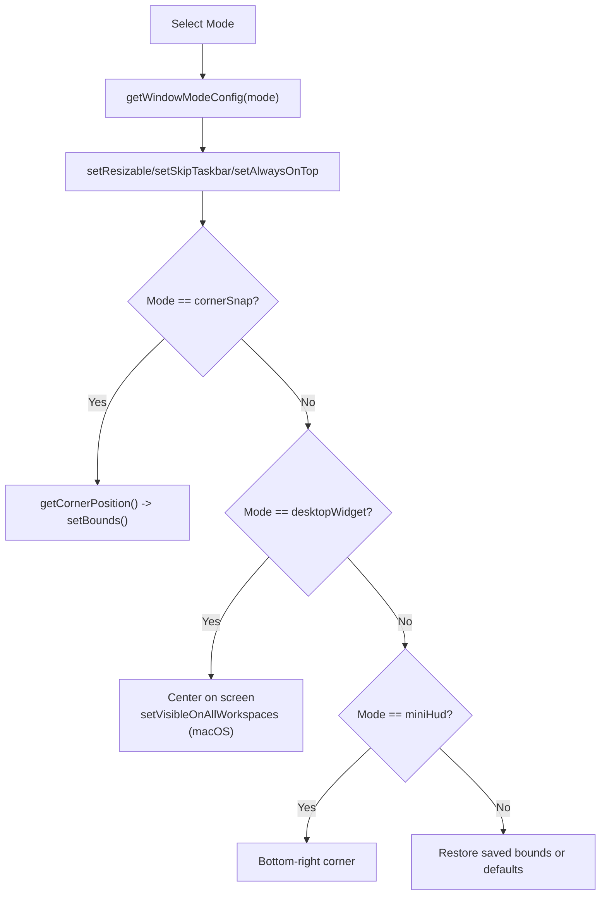

**Diagram sources**
- [electron/windows.js](file://electron/windows.js#L60-L106)

**Section sources**
- [electron/windows.js](file://electron/windows.js#L1-L130)

### Preload Script and Secure IPC Bridge
- Security model: contextBridge exposes a controlled API surface to the renderer, preventing direct Node.js access.
- Exposed methods: window controls, settings get/set, game state updates, notifications, server state and toggles, event listeners for XP and window mode changes.
- Renderer awareness: Adds a small DOMContentLoaded handler to log Electron environment.

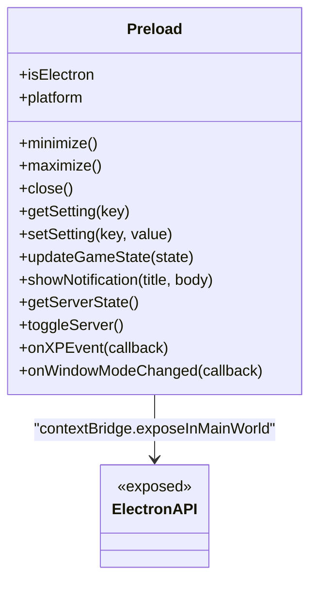

**Diagram sources**
- [electron/preload.js](file://electron/preload.js#L4-L37)

**Section sources**
- [electron/preload.js](file://electron/preload.js#L1-L43)

### Inter-Process Communication (IPC)
- Renderer-to-main: send('window:minimize|maximize|close'), send('settings:get'|'settings:set'), send('window:setMode'), send('window:toggleAlwaysOnTop'), send('server:toggle'), send('game:state'), invoke('server:getState').
- Main-to-renderer: send('xp-event', 'window-mode-changed').
- IPC handlers: Centralized in setupIPC(), covering window actions, settings, server state, and game state updates.

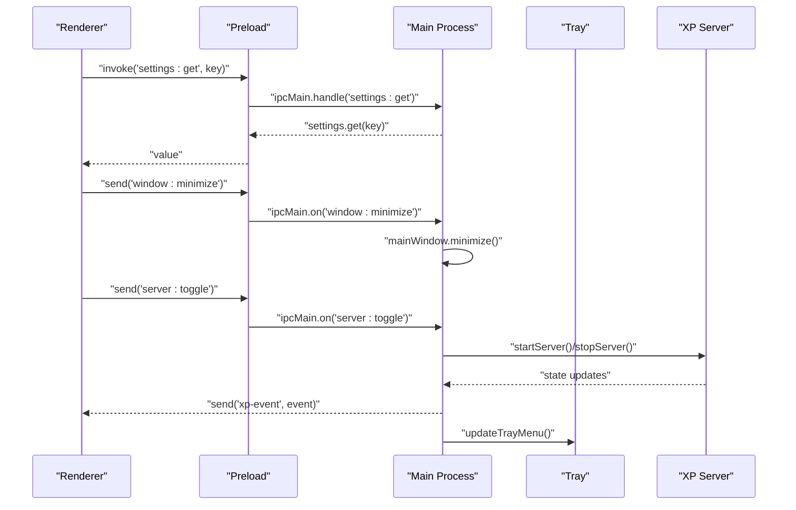

**Diagram sources**
- [electron/main.js](file://electron/main.js#L174-L203)
- [electron/preload.js](file://electron/preload.js#L6-L22)
- [electron/server.js](file://electron/server.js#L75-L151)
- [electron/tray.js](file://electron/tray.js#L92-L159)

**Section sources**
- [electron/main.js](file://electron/main.js#L174-L203)
- [electron/preload.js](file://electron/preload.js#L1-L43)
- [electron/server.js](file://electron/server.js#L1-L183)
- [electron/tray.js](file://electron/tray.js#L1-L176)

### System Tray Integration
- Icon resolution: Attempts multiple icon paths with fallback to a generated image; macOS template image support.
- Menu templates: Rich mode shows game state, server status, window options, and quit; minimal mode shows show/hide and quit.
- Dynamic updates: Menu reflects window visibility, server state, and current window mode; updates on window show/hide.

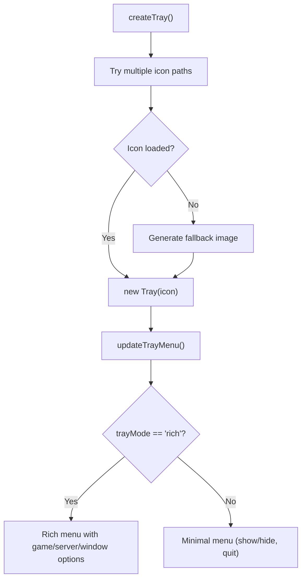

**Diagram sources**
- [electron/tray.js](file://electron/tray.js#L27-L90)
- [electron/tray.js](file://electron/tray.js#L92-L159)

**Section sources**
- [electron/tray.js](file://electron/tray.js#L1-L176)

### Built-in XP Server
- Transport: Express + HTTP server hosting REST endpoints; WebSocket server for live XP broadcasts.
- Endpoints: POST /event (hook integration), POST /cli/:source (CLI-specific), GET /health (status).
- Broadcasting: Sends XP events to all connected clients with source metadata; maintains server state and notifies main process.
- Lifecycle: startServer(), stopServer(), getServerState(), isServerRunning().

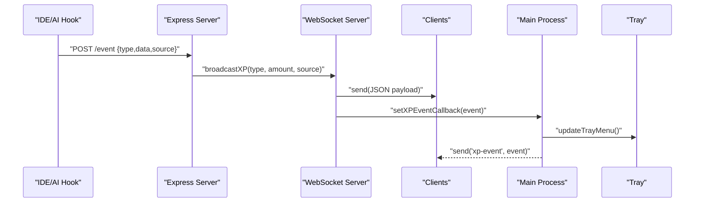

**Diagram sources**
- [electron/server.js](file://electron/server.js#L75-L151)
- [electron/server.js](file://electron/server.js#L41-L73)
- [electron/main.js](file://electron/main.js#L129-L144)

**Section sources**
- [electron/server.js](file://electron/server.js#L1-L183)
- [electron/main.js](file://electron/main.js#L129-L144)

### Renderer Initialization and XP Integration
- Phaser bootstrap: Configures game scale, physics, scenes, and pixel art.
- Runtime config: Loads config.json from same-origin path for environment-specific settings.
- Mobile handling: Orientation lock and overlay for portrait devices.
- XP connection: On localhost, connects to WebSocket server; listens for connection/disconnection events; parses XP events and updates game state.

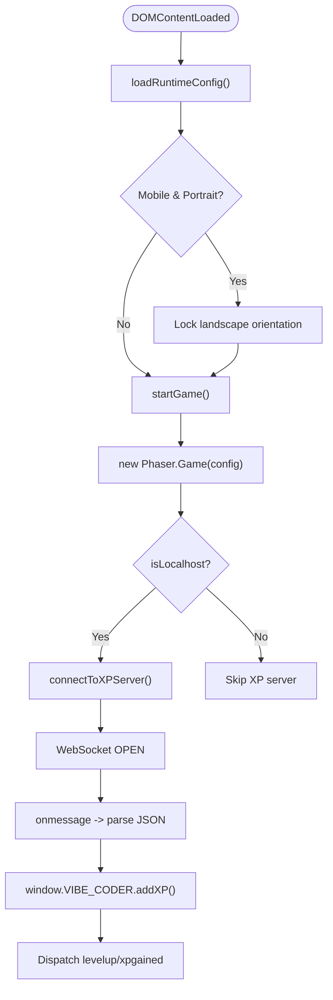

**Diagram sources**
- [src/main.js](file://src/main.js#L421-L464)
- [src/main.js](file://src/main.js#L381-L401)
- [src/utils/socket.js](file://src/utils/socket.js#L18-L104)

**Section sources**
- [src/main.js](file://src/main.js#L1-L464)
- [src/utils/socket.js](file://src/utils/socket.js#L1-L121)

## Dependency Analysis
- Main process depends on:
  - electron-store for settings persistence
  - electron APIs for BrowserWindow, Tray, globalShortcut, ipcMain
  - ws for WebSocket server
  - express for REST endpoints
- Preload depends on contextBridge and ipcRenderer.
- Renderer depends on Phaser and local storage for settings.
- Build and packaging are configured via package.json and vite.config.js.

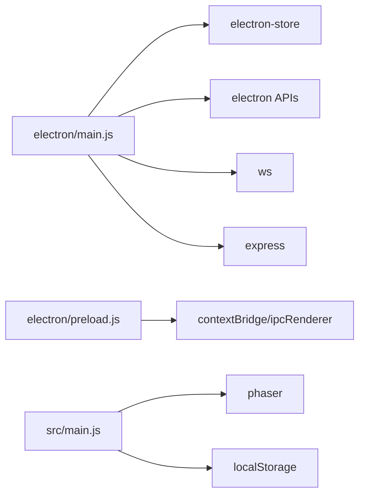

**Diagram sources**
- [electron/main.js](file://electron/main.js#L1-L10)
- [electron/preload.js](file://electron/preload.js#L1-L3)
- [src/main.js](file://src/main.js#L1-L10)

**Section sources**
- [electron/main.js](file://electron/main.js#L1-L10)
- [electron/preload.js](file://electron/preload.js#L1-L3)
- [src/main.js](file://src/main.js#L1-L10)
- [package.json](file://package.json#L31-L51)

## Performance Considerations
- Window modes: Prefer floating for typical use; corner snap and mini HUD reduce rendering overhead by limiting window size and always-on-top usage.
- Server broadcasting: Efficient client set iteration; consider throttling or batching XP events if traffic increases.
- Tray updates: Batch tray menu updates to avoid excessive rebuilds.
- Renderer performance: Phaser configuration includes pixelArt and roundPixels; keep assets optimized and avoid unnecessary DOM manipulation.

[No sources needed since this section provides general guidance]

## Security Best Practices
- Context isolation: Enabled in BrowserWindow webPreferences; preload uses contextBridge to expose only necessary APIs.
- Node integration disabled: Prevents direct Node.js access from renderer.
- IPC validation: Main process validates and sanitizes incoming IPC messages before acting.
- Single instance lock: Prevents multiple app instances interfering with each other.
- Platform-specific tray icons: Fallback to generated images if file icons fail.
- Restricted preload API: Only essential methods exposed; avoid exposing sensitive Node.js APIs.
- Environment detection: Renderer only connects to XP server on localhost to prevent unintended network exposure.

**Section sources**
- [electron/main.js](file://electron/main.js#L26-L45)
- [electron/preload.js](file://electron/preload.js#L1-L43)
- [electron/main.js](file://electron/main.js#L244-L256)
- [electron/tray.js](file://electron/tray.js#L31-L71)
- [src/main.js](file://src/main.js#L448-L452)

## Development vs Production Differences
- Development:
  - Main process loads game from Vite dev server (localhost:5173).
  - Hot reload: Vite dev server serves the renderer; Electron launches concurrently with wait-on to ensure the dev server is ready.
  - DevTools: Optionally opened in dev mode.
- Production:
  - Main process loads prebuilt HTML from dist directory.
  - Packaging: electron-builder configuration defines output directories, targets, and resources.
  - Base path: Vite base path adjusted for GitHub Pages deployment; affects asset loading in production builds.

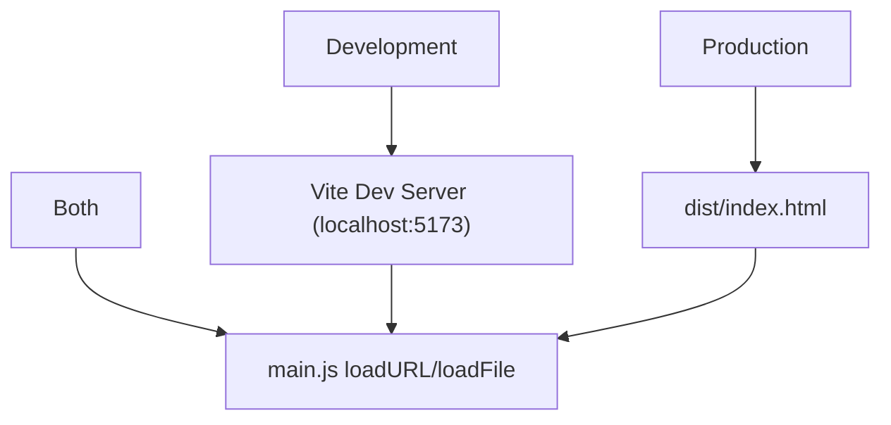

**Diagram sources**
- [electron/main.js](file://electron/main.js#L48-L54)
- [package.json](file://package.json#L13-L14)
- [vite.config.js](file://vite.config.js#L11-L29)

**Section sources**
- [electron/main.js](file://electron/main.js#L48-L54)
- [package.json](file://package.json#L13-L14)
- [vite.config.js](file://vite.config.js#L1-L34)

## Troubleshooting Guide
- Tray icon not visible:
  - Check icon paths and fallback generation; ensure nativeImage.createFromPath succeeds.
- Window does not hide on close:
  - Verify close event handler prevents default and hides window; ensure app.isQuitting flag is respected.
- XP server not receiving events:
  - Confirm server started in built-in mode; check /event and /cli/:source endpoints; verify WebSocket connections.
- Renderer cannot connect to XP server:
  - Ensure localhost detection is correct; confirm WebSocket URL matches server port.
- Global shortcuts not working:
  - Verify settings keys and globalShortcut registration; ensure shortcuts are unregistered on app quit.

**Section sources**
- [electron/tray.js](file://electron/tray.js#L31-L71)
- [electron/main.js](file://electron/main.js#L56-L78)
- [electron/server.js](file://electron/server.js#L75-L151)
- [src/utils/socket.js](file://src/utils/socket.js#L13-L20)
- [electron/main.js](file://electron/main.js#L160-L171)

## Conclusion
The Vibe-Coder Electron application demonstrates a clean separation between main and renderer processes, with a secure preload bridge and robust IPC patterns. The main process orchestrates lifecycle, window modes, tray integration, and the built-in XP server, while the renderer focuses on game logic and optional XP integration. Development and production environments are clearly differentiated, with hot reload support in development and packaged distribution in production. Security is addressed through context isolation, restricted preload APIs, and single instance enforcement.