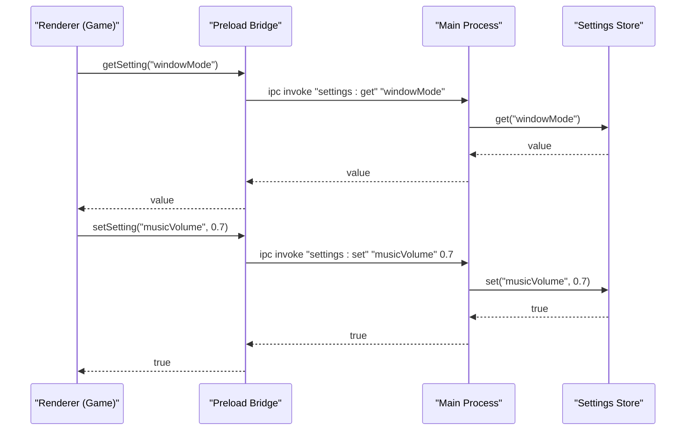
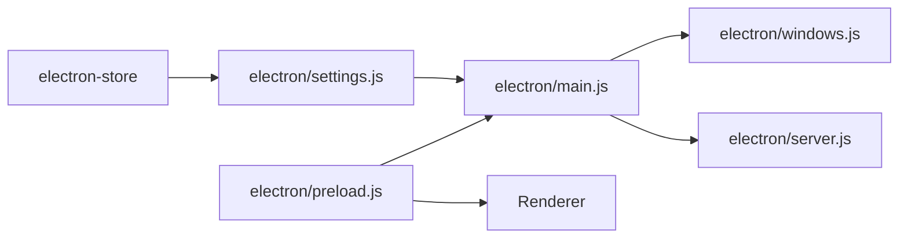

# Settings and Persistence

<cite>
**Referenced Files in This Document**
- [settings.js](file://electron/settings.js)
- [main.js](file://electron/main.js)
- [preload.js](file://electron/preload.js)
- [windows.js](file://electron/windows.js)
- [server.js](file://electron/server.js)
- [package.json](file://package.json)
- [dist/config.json](file://dist/config.json)
</cite>

## Table of Contents
1. [Introduction](#introduction)
2. [Project Structure](#project-structure)
3. [Core Components](#core-components)
4. [Architecture Overview](#architecture-overview)
5. [Detailed Component Analysis](#detailed-component-analysis)
6. [Dependency Analysis](#dependency-analysis)
7. [Performance Considerations](#performance-considerations)
8. [Troubleshooting Guide](#troubleshooting-guide)
9. [Conclusion](#conclusion)
10. [Appendices](#appendices)

## Introduction
This document explains the Vibe-Coder settings and persistence system. It covers the settings store implementation, data serialization, configuration management, and the IPC interface used by the renderer process. It also documents persistent settings such as window bounds, modes, hotkeys, and server preferences, along with default values, acceptable ranges, and validation mechanisms. Finally, it describes settings synchronization between the main and renderer processes and the impact on application behavior.

## Project Structure
The settings system spans three primary areas:
- Electron main process settings store and IPC handlers
- Electron preload bridge exposing safe IPC to the renderer
- Renderer-side window and server behavior controlled by settings

```mermaid
graph TB
subgraph "Electron Main Process"
MJS["electron/main.js"]
SJS["electron/settings.js"]
WJS["electron/windows.js"]
SRV["electron/server.js"]
end
subgraph "Preload Bridge"
PJS["electron/preload.js"]
end
subgraph "Renderer (Game)"
RND["Game UI and Systems"]
end
MJS --> SJS
MJS --> WJS
MJS --> SRV
PJS <- --> MJS
PJS --> RND
```

**Diagram sources**
- [main.js](file://electron/main.js#L1-L274)
- [settings.js](file://electron/settings.js#L1-L51)
- [windows.js](file://electron/windows.js#L1-L130)
- [server.js](file://electron/server.js#L1-L183)
- [preload.js](file://electron/preload.js#L1-L43)

**Section sources**
- [main.js](file://electron/main.js#L1-L274)
- [settings.js](file://electron/settings.js#L1-L51)
- [windows.js](file://electron/windows.js#L1-L130)
- [server.js](file://electron/server.js#L1-L183)
- [preload.js](file://electron/preload.js#L1-L43)

## Core Components
- Settings store: Provides a typed, default-backed key-value store for persistent configuration.
- IPC bridge: Exposes safe read/write access to settings and window/server controls to the renderer.
- Window mode manager: Applies persisted window mode and bounds to the BrowserWindow.
- Server controller: Starts/stops the XP event server and forwards events to the renderer.

Key responsibilities:
- Persist window geometry and mode
- Manage global hotkeys and always-on-top behavior
- Control built-in vs external XP server
- Provide reactive updates to the renderer via IPC

**Section sources**
- [settings.js](file://electron/settings.js#L1-L51)
- [main.js](file://electron/main.js#L173-L203)
- [windows.js](file://electron/windows.js#L60-L106)
- [server.js](file://electron/server.js#L75-L151)
- [preload.js](file://electron/preload.js#L4-L37)

## Architecture Overview
The settings system uses a layered approach:
- Persistent storage: electron-store manages a JSON file per platform.
- Main-process store: Centralized settings access and mutation.
- Preload bridge: Controlled IPC surface for the renderer.
- Renderer consumption: Reads settings and reacts to updates.



**Diagram sources**
- [preload.js](file://electron/preload.js#L10-L12)
- [main.js](file://electron/main.js#L185-L189)
- [settings.js](file://electron/settings.js#L39-L50)

## Detailed Component Analysis

### Settings Store Implementation
- Storage backend: electron-store creates a per-user JSON file named after the store name.
- Defaults: All supported keys and their default values are defined centrally.
- Access pattern: Main process reads/writes via the store; renderer invokes IPC to mutate settings.

Available settings and defaults:
- Launch
  - autoStart: boolean, default false
- Tray
  - trayMode: string, default "rich"; acceptable values include "minimal", "rich", "miniWidget", "hidden"
- Window
  - windowMode: string, default "floating"; acceptable values include "floating", "cornerSnap", "desktopWidget", "miniHud"
  - alwaysOnTop: boolean, default false
  - windowBounds: object { width, height, x, y }; default width 800, height 600
  - cornerPosition: string, default "bottom-right"; acceptable values include "top-left", "top-right", "bottom-left", "bottom-right"
- Audio
  - musicEnabled: boolean, default true
  - musicVolume: number, default 0.5; typical range 0.0–1.0
  - sfxEnabled: boolean, default true
  - sfxVolume: number, default 0.7; typical range 0.0–1.0
  - xpChimeEnabled: boolean, default true
- Notifications
  - notifyLevelUp: boolean, default true
  - notifyLegendary: boolean, default true
  - notifyHighScore: boolean, default false
- Server
  - serverMode: string, default "built-in"; acceptable values include "built-in", "external"
  - externalServerUrl: string, default "ws://localhost:3001"
- Hotkeys
  - toggleHotkey: string, default "CommandOrControl+Shift+V"
  - cycleWindowHotkey: string, default "CommandOrControl+Shift+W"

Notes:
- Volume sliders are commonly represented as 0.0–1.0 ranges in UIs.
- Acceptable values are constrained by the application’s validation and rendering logic.

**Section sources**
- [settings.js](file://electron/settings.js#L3-L35)

### Data Serialization and File Location
- File format: JSON
- File location: electron-store determines the platform-specific path for user data. The store is initialized with a store name and defaults.
- Backup strategy: electron-store does not automatically back up settings. Users can back up the store file from the platform-specific user data directory.

**Section sources**
- [settings.js](file://electron/settings.js#L39-L45)
- [package.json](file://package.json#L36-L36)

### Configuration Management and Validation
- Default handling: All keys are guaranteed to have a default value when accessed via the store.
- Validation: The system relies on the renderer and main process to interpret values sensibly. For example, window mode and corner position are validated against known sets of acceptable values.
- Hotkey registration: Global shortcuts are registered from stored values; invalid combinations are ignored by the OS.

**Section sources**
- [main.js](file://electron/main.js#L160-L171)
- [windows.js](file://electron/windows.js#L108-L113)

### Settings Migration System
- No explicit migration code is present in the examined files. If migrations are needed, they would typically be implemented in the main process during store initialization by checking for legacy keys or versions and updating values accordingly.

**Section sources**
- [settings.js](file://electron/settings.js#L39-L45)
- [main.js](file://electron/main.js#L205-L210)

### Settings IPC Interface for Renderer Access
The preload bridge exposes:
- Window controls: minimize, maximize, close
- Settings access: getSetting(key), setSetting(key, value)
- Server controls: getServerState(), toggleServer
- Game state updates: updateGameState(state)
- Event listeners: onXPEvent(callback), onWindowModeChanged(callback)
- Platform info: isElectron, platform

Renderer usage:
- Read settings via getSetting(key)
- Write settings via setSetting(key, value)
- Subscribe to window-mode changes and XP events

**Section sources**
- [preload.js](file://electron/preload.js#L4-L37)
- [main.js](file://electron/main.js#L173-L203)

### Reactive Settings Update System
- Window mode changes: Main process sends "window-mode-changed" to the renderer after applying a new mode.
- XP events: Main process broadcasts XP events to the renderer via IPC when the built-in server is active.
- Tray updates: Main process updates tray menus based on settings and game state.

**Section sources**
- [main.js](file://electron/main.js#L95-L105)
- [main.js](file://electron/main.js#L135-L142)
- [main.js](file://electron/main.js#L198-L202)

### Window Bounds and Modes Persistence
- Window bounds: Saved on close and restored on startup. The main process writes bounds to settings on close and reads them when creating the window.
- Mode persistence: The current window mode is saved to settings and applied when the app starts or when toggled.
- Corner snapping: Position is recalculated from the stored corner position and default sizes.
- Desktop widget and mini HUD: Sizes and positions are computed from defaults and screen bounds.

**Section sources**
- [main.js](file://electron/main.js#L56-L72)
- [main.js](file://electron/main.js#L20-L46)
- [windows.js](file://electron/windows.js#L60-L106)
- [windows.js](file://electron/windows.js#L115-L127)

### Server Preferences and Behavior
- Built-in server: Started/stopped based on serverMode. When started, XP events are broadcast to connected clients and forwarded to the renderer.
- External server: serverMode set to "external" disables the built-in server; the renderer can connect to externalServerUrl.
- XP event forwarding: Main process emits "xp-event" IPC messages to the renderer.

**Section sources**
- [main.js](file://electron/main.js#L128-L158)
- [server.js](file://electron/server.js#L75-L151)
- [server.js](file://electron/server.js#L48-L73)

### Hotkeys and Always-on-Top
- Global hotkeys: Registered from stored values. Toggling visibility and cycling modes are bound to stored hotkeys.
- Always-on-top: Toggled by the renderer; main process persists the setting and applies it to the window.

**Section sources**
- [main.js](file://electron/main.js#L160-L171)
- [main.js](file://electron/main.js#L112-L120)

## Dependency Analysis
- electron-store dependency: Used by settings.js to persist configuration.
- IPC dependencies: preload.js depends on main.js IPC handlers; main.js depends on settings store for values.
- Window mode dependencies: windows.js depends on settings for mode and bounds; main.js applies mode changes.
- Server dependencies: server.js runs independently but is controlled by settings-driven IPC in main.js.



**Diagram sources**
- [settings.js](file://electron/settings.js#L1-L1)
- [main.js](file://electron/main.js#L1-L10)
- [windows.js](file://electron/windows.js#L1-L1)
- [server.js](file://electron/server.js#L1-L4)
- [preload.js](file://electron/preload.js#L1-L1)

**Section sources**
- [package.json](file://package.json#L36-L36)
- [settings.js](file://electron/settings.js#L1-L1)
- [main.js](file://electron/main.js#L1-L10)
- [windows.js](file://electron/windows.js#L1-L1)
- [server.js](file://electron/server.js#L1-L4)
- [preload.js](file://electron/preload.js#L1-L1)

## Performance Considerations
- Settings I/O: Frequent reads/writes are lightweight due to JSON serialization and small payload sizes.
- IPC overhead: Minimal; most operations are single-key reads/writes.
- Window mode switching: Recomputes bounds and applies flags; negligible overhead.
- Server broadcasting: Broadcasts XP events to connected clients; overhead scales with client count.

## Troubleshooting Guide
Common issues and resolutions:
- Settings not persisting
  - Verify the store name and platform-specific user data directory.
  - Confirm the app has write permissions to the directory.
- Unexpected window size or position
  - Check windowBounds and windowMode values; ensure bounds are valid numbers.
- Hotkeys not working
  - Confirm stored hotkey strings are valid for the platform.
  - Ensure no conflicts with OS/global shortcuts.
- Built-in server not starting
  - Check serverMode; ensure port is free and accessible.
  - Inspect server logs for binding errors.
- Renderer not receiving updates
  - Ensure IPC listeners are attached after page load.
  - Verify "window-mode-changed" and "xp-event" handlers are registered.

**Section sources**
- [settings.js](file://electron/settings.js#L39-L45)
- [main.js](file://electron/main.js#L56-L72)
- [main.js](file://electron/main.js#L160-L171)
- [server.js](file://electron/server.js#L144-L148)
- [preload.js](file://electron/preload.js#L24-L30)

## Conclusion
The Vibe-Coder settings and persistence system provides a robust, cross-platform foundation for managing user preferences. It leverages electron-store for reliable persistence, exposes a minimal and secure IPC surface to the renderer, and integrates tightly with window modes, server behavior, and global hotkeys. While no explicit migration logic is present, the centralized defaults and validation patterns make future enhancements straightforward.

## Appendices

### Settings Reference Table
- Launch
  - autoStart: boolean, default false
- Tray
  - trayMode: string, default "rich"; acceptable values: "minimal", "rich", "miniWidget", "hidden"
- Window
  - windowMode: string, default "floating"; acceptable values: "floating", "cornerSnap", "desktopWidget", "miniHud"
  - alwaysOnTop: boolean, default false
  - windowBounds: object { width, height, x, y }; default width 800, height 600
  - cornerPosition: string, default "bottom-right"; acceptable values: "top-left", "top-right", "bottom-left", "bottom-right"
- Audio
  - musicEnabled: boolean, default true
  - musicVolume: number, default 0.5; typical range 0.0–1.0
  - sfxEnabled: boolean, default true
  - sfxVolume: number, default 0.7; typical range 0.0–1.0
  - xpChimeEnabled: boolean, default true
- Notifications
  - notifyLevelUp: boolean, default true
  - notifyLegendary: boolean, default true
  - notifyHighScore: boolean, default false
- Server
  - serverMode: string, default "built-in"; acceptable values: "built-in", "external"
  - externalServerUrl: string, default "ws://localhost:3001"
- Hotkeys
  - toggleHotkey: string, default "CommandOrControl+Shift+V"
  - cycleWindowHotkey: string, default "CommandOrControl+Shift+W"

**Section sources**
- [settings.js](file://electron/settings.js#L3-L35)

### Settings File Location and Format
- Format: JSON
- Location: Determined by electron-store based on platform user data directory
- Store name: "vibe-coder-settings"

**Section sources**
- [settings.js](file://electron/settings.js#L39-L45)
- [package.json](file://package.json#L36-L36)

### Environment Configuration
- Runtime configuration values are provided via Vite environment variables embedded at build time.
- Example keys include API URLs and contract identifiers.

**Section sources**
- [dist/config.json](file://dist/config.json#L1-L7)