# System Tray Integration

<cite>
**Referenced Files in This Document**
- [tray.js](file://electron/tray.js)
- [main.js](file://electron/main.js)
- [settings.js](file://electron/settings.js)
- [windows.js](file://electron/windows.js)
- [server.js](file://electron/server.js)
- [preload.js](file://electron/preload.js)
- [ArenaScene.js](file://src/scenes/ArenaScene.js)
</cite>

## Table of Contents
1. [Introduction](#introduction)
2. [Project Structure](#project-structure)
3. [Core Components](#core-components)
4. [Architecture Overview](#architecture-overview)
5. [Detailed Component Analysis](#detailed-component-analysis)
6. [Dependency Analysis](#dependency-analysis)
7. [Performance Considerations](#performance-considerations)
8. [Troubleshooting Guide](#troubleshooting-guide)
9. [Conclusion](#conclusion)

## Introduction

The Vibe-Coder system tray integration provides a comprehensive desktop experience that bridges the web-based game with native operating system capabilities. This integration enables users to control the application through a persistent system tray icon, access real-time game state information, and manage various application modes without keeping the main window visible.

The tray system implements sophisticated features including rich menu displays with game statistics, dynamic server state monitoring, multiple window mode configurations, and platform-specific optimizations for macOS, Windows, and Linux environments.

## Project Structure

The system tray integration is implemented across several key files in the electron directory, with tight integration between the main process, renderer process, and game state management.

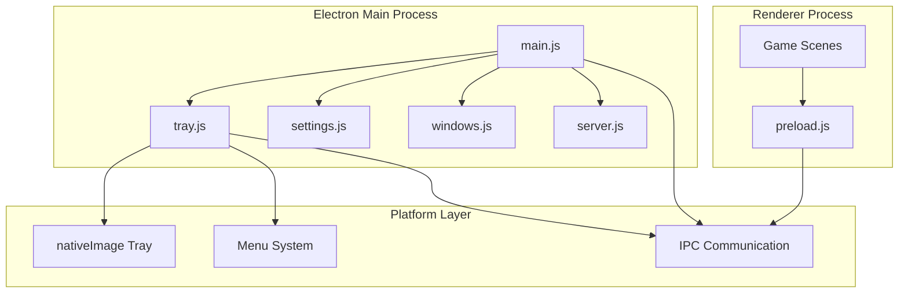

**Diagram sources**
- [main.js](file://electron/main.js#L1-L274)
- [tray.js](file://electron/tray.js#L1-L176)
- [settings.js](file://electron/settings.js#L1-L51)

**Section sources**
- [main.js](file://electron/main.js#L1-L274)
- [tray.js](file://electron/tray.js#L1-L176)
- [settings.js](file://electron/settings.js#L1-L51)

## Core Components

The system tray integration consists of several interconnected components that work together to provide a seamless desktop experience:

### Tray Icon Management
The tray system manages multiple icon variants and automatically adapts to platform-specific requirements. It supports fallback mechanisms and template image optimization for macOS menu bars.

### Dynamic Menu System
The menu system provides two distinct modes: rich mode with comprehensive game state information and minimal mode for streamlined access. The menu dynamically updates based on application state, server status, and window visibility.

### Game State Integration
Real-time game state synchronization allows the tray to display current level, XP progress, weapon information, and runtime statistics directly from the running game.

### Server State Monitoring
Built-in XP server monitoring provides real-time feedback on server status, client connections, and recent activity for integration with AI coding tools.

**Section sources**
- [tray.js](file://electron/tray.js#L11-L25)
- [main.js](file://electron/main.js#L128-L158)
- [server.js](file://electron/server.js#L10-L16)

## Architecture Overview

The tray integration follows a reactive architecture pattern where the main process maintains state and responds to changes in real-time.

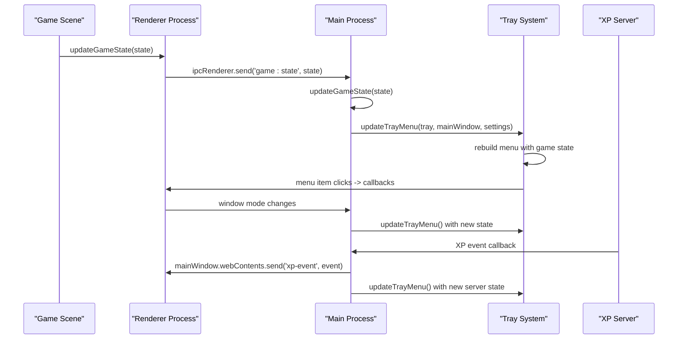

**Diagram sources**
- [ArenaScene.js](file://src/scenes/ArenaScene.js#L1338-L1348)
- [main.js](file://electron/main.js#L198-L202)
- [tray.js](file://electron/tray.js#L92-L159)

## Detailed Component Analysis

### Tray Icon Implementation

The tray icon system implements sophisticated platform-aware icon management with multiple fallback mechanisms.

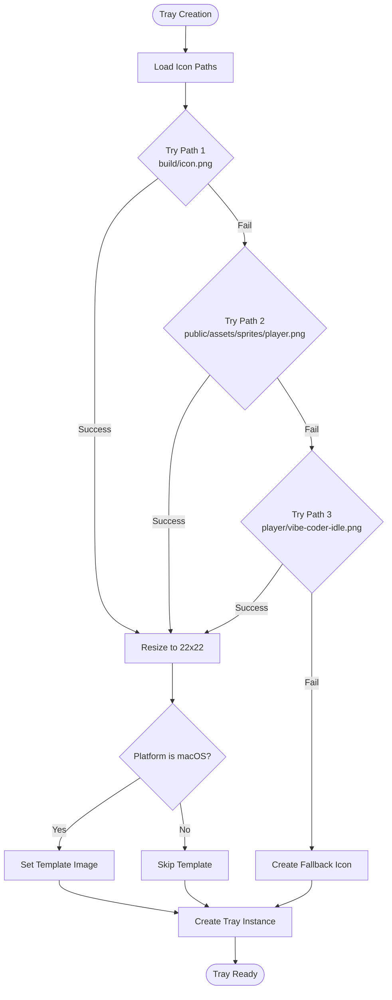

**Diagram sources**
- [tray.js](file://electron/tray.js#L31-L71)

The icon system supports multiple resolution targets:
- **macOS**: Template image with automatic color adaptation
- **Windows/Linux**: Standard 22x22 pixel icons
- **Fallback**: Programmatically generated cyan square icon

**Section sources**
- [tray.js](file://electron/tray.js#L31-L71)

### Menu System Architecture

The tray menu system operates in two distinct modes with dynamic content generation:

#### Rich Mode Menu Structure
Rich mode provides comprehensive game state information and application controls:

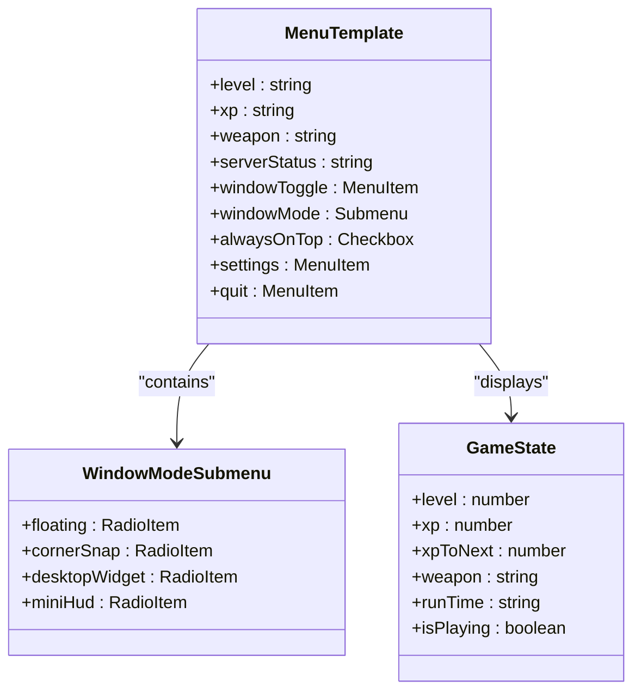

**Diagram sources**
- [tray.js](file://electron/tray.js#L107-L144)

#### Minimal Mode Menu Structure
Minimal mode provides essential functionality for users who prefer simplicity:

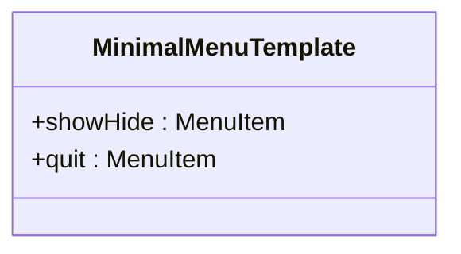

**Diagram sources**
- [tray.js](file://electron/tray.js#L145-L155)

**Section sources**
- [tray.js](file://electron/tray.js#L92-L159)

### Dynamic Menu Updates

The menu system implements reactive updates triggered by various application state changes:

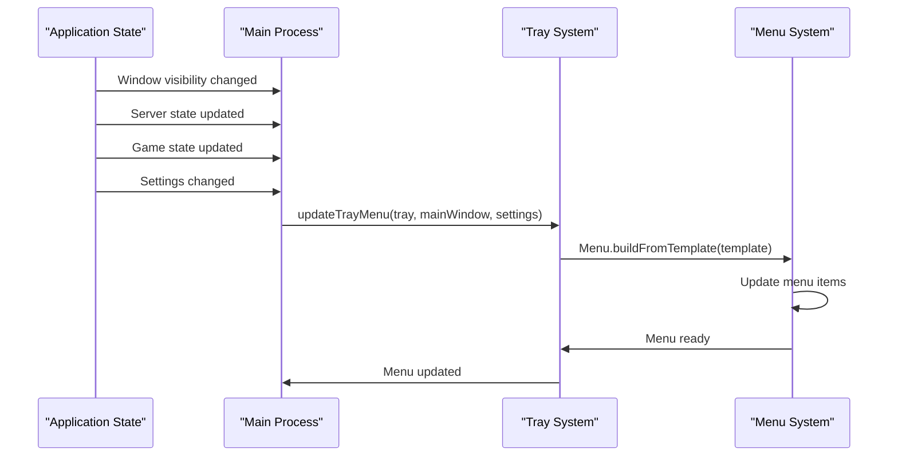

**Diagram sources**
- [main.js](file://electron/main.js#L74-L76)
- [tray.js](file://electron/tray.js#L92-L159)

**Section sources**
- [main.js](file://electron/main.js#L74-L76)
- [tray.js](file://electron/tray.js#L92-L159)

### Game State Integration

The game state integration provides real-time XP activity and progress information in the tray menu:

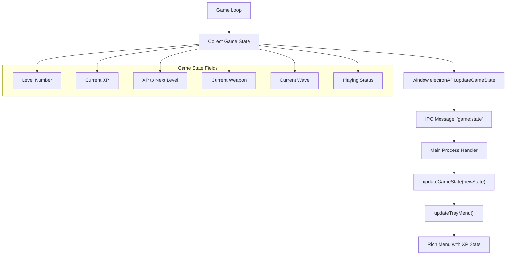

**Diagram sources**
- [ArenaScene.js](file://src/scenes/ArenaScene.js#L1338-L1348)
- [main.js](file://electron/main.js#L198-L202)

**Section sources**
- [ArenaScene.js](file://src/scenes/ArenaScene.js#L1338-L1348)
- [main.js](file://electron/main.js#L198-L202)

### Server Mode Switching

The system supports both built-in and external XP server modes with seamless switching:

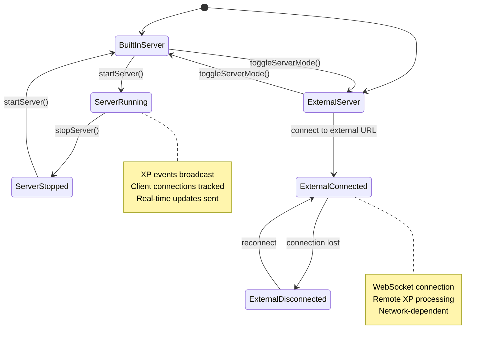

**Diagram sources**
- [main.js](file://electron/main.js#L128-L158)
- [server.js](file://electron/server.js#L75-L151)

**Section sources**
- [main.js](file://electron/main.js#L128-L158)
- [server.js](file://electron/server.js#L17-L178)

### Window Toggle Actions

The tray system provides comprehensive window management through multiple interaction methods:

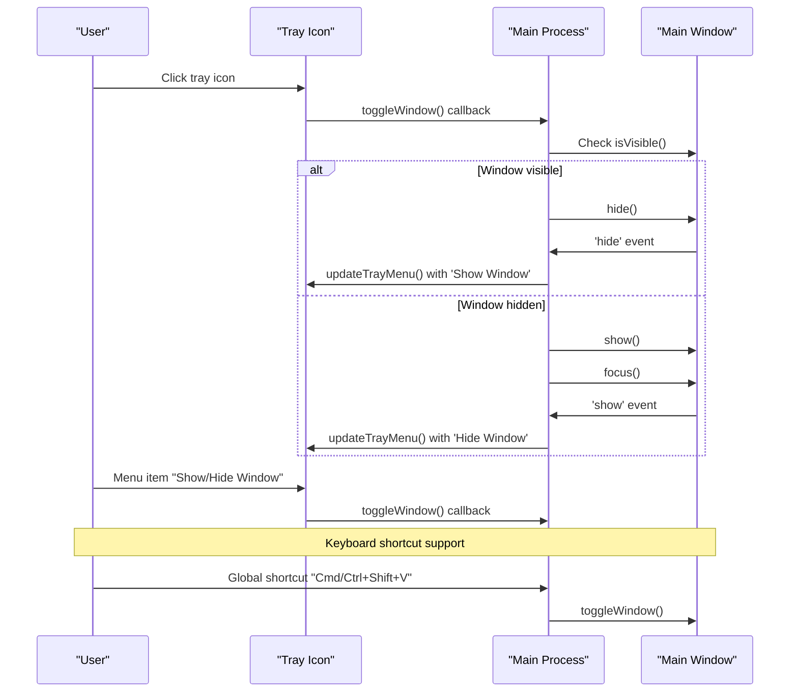

**Diagram sources**
- [tray.js](file://electron/tray.js#L78-L81)
- [main.js](file://electron/main.js#L81-L93)

**Section sources**
- [tray.js](file://electron/tray.js#L78-L81)
- [main.js](file://electron/main.js#L81-L93)

### Platform-Specific Behaviors

The tray system implements platform-specific optimizations for optimal user experience:

#### macOS Optimizations
- **Template Images**: Automatic color adaptation in menu bar
- **Dock Integration**: Re-creation of main window when dock icon clicked
- **Workspace Visibility**: Desktop widget behavior using `setVisibleOnAllWorkspaces`

#### Windows/Linux Behavior
- **Standard Icons**: 22x22 pixel icons with alpha channel support
- **System Integration**: Native context menu and notification support
- **Auto-Hide**: Minimizes to tray instead of closing

**Section sources**
- [tray.js](file://electron/tray.js#L47-L48)
- [main.js](file://electron/main.js#L234-L241)

### Custom Tray Implementations

The system supports multiple window modes with specialized tray integrations:

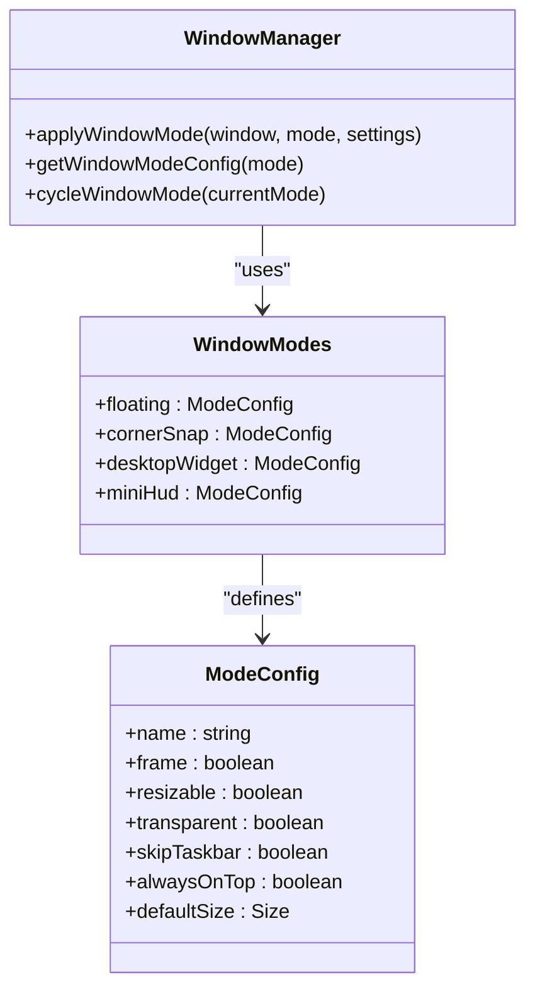

**Diagram sources**
- [windows.js](file://electron/windows.js#L4-L41)

**Section sources**
- [windows.js](file://electron/windows.js#L60-L106)

### Menu Item State Management

The tray system maintains dynamic state for all interactive menu items:

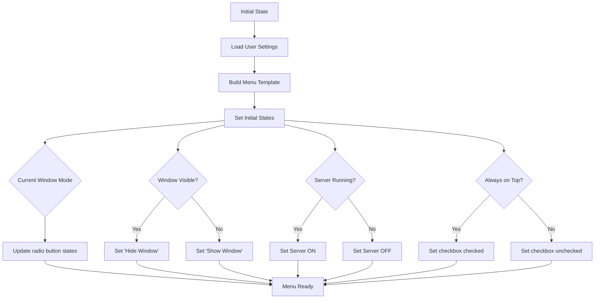

**Diagram sources**
- [tray.js](file://electron/tray.js#L107-L159)

**Section sources**
- [tray.js](file://electron/tray.js#L92-L159)

### Configuration Options

The tray system supports extensive user customization through the settings store:

| Category | Setting | Type | Default | Description |
|----------|---------|------|---------|-------------|
| Tray | trayMode | string | 'rich' | Menu display mode |
| Window | windowMode | string | 'floating' | Current window mode |
| Window | alwaysOnTop | boolean | false | Window always on top |
| Window | windowBounds | object | {w:800,h:600} | Saved window position |
| Server | serverMode | string | 'built-in' | XP server mode |
| Server | externalServerUrl | string | 'ws://localhost:3001' | External server URL |
| Hotkeys | toggleHotkey | string | 'CommandOrControl+Shift+V' | Window toggle shortcut |
| Hotkeys | cycleWindowHotkey | string | 'CommandOrControl+Shift+W' | Mode cycling shortcut |

**Section sources**
- [settings.js](file://electron/settings.js#L3-L35)

### User Preference Persistence

The settings system provides robust persistence for all user preferences:

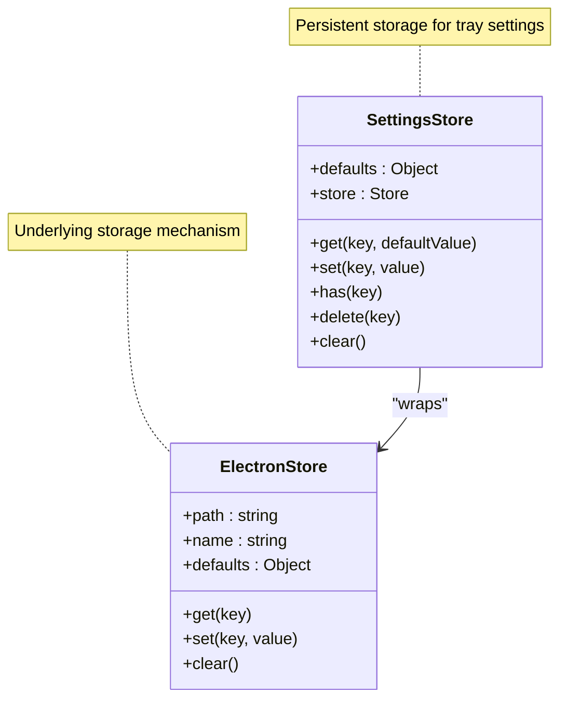

**Diagram sources**
- [settings.js](file://electron/settings.js#L39-L50)

**Section sources**
- [settings.js](file://electron/settings.js#L39-L50)

## Dependency Analysis

The tray system has well-defined dependencies that enable loose coupling and maintainability:

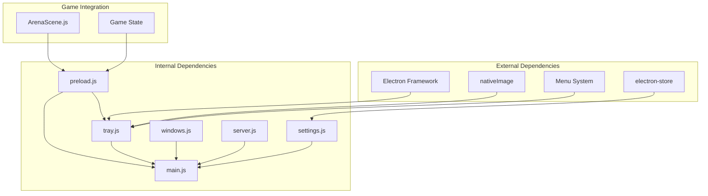

**Diagram sources**
- [main.js](file://electron/main.js#L1-L10)
- [tray.js](file://electron/tray.js#L1-L7)

**Section sources**
- [main.js](file://electron/main.js#L1-L10)
- [tray.js](file://electron/tray.js#L1-L7)

## Performance Considerations

The tray system implements several performance optimizations:

### Efficient Icon Loading
- **Multiple Fallback Paths**: Reduces failure risk and improves startup reliability
- **Platform-Specific Optimization**: Template images on macOS reduce rendering overhead
- **Lazy Loading**: Icons loaded only when tray is created

### Minimal Memory Footprint
- **State Caching**: Game state cached locally to avoid frequent IPC calls
- **Event Delegation**: Centralized event handling reduces memory overhead
- **Conditional Updates**: Menu only rebuilt when state changes

### Responsive UI Updates
- **Debounced Updates**: Rapid state changes batched for performance
- **Efficient IPC**: Minimal data transfer between processes
- **Lazy Menu Building**: Menu templates constructed on-demand

## Troubleshooting Guide

### Common Issues and Solutions

#### Tray Icon Not Displaying
**Symptoms**: Tray shows empty icon or fails to appear
**Causes**: 
- Missing icon files in build directory
- Permission issues accessing icon paths
- Platform-specific template image problems

**Solutions**:
- Verify icon files exist in `build/icon.png`
- Check file permissions and paths
- Test fallback icon creation

#### Menu Items Not Responding
**Symptoms**: Tray menu items don't trigger actions
**Causes**:
- Callback functions not properly bound
- IPC communication failures
- Menu template construction errors

**Solutions**:
- Verify callback function assignments in `createTray()`
- Check IPC handler registration in main process
- Validate menu template structure

#### Game State Not Updating
**Symptoms**: Tray shows stale game information
**Causes**:
- Missing IPC handlers for game state updates
- Renderer process not sending state updates
- Main process state management issues

**Solutions**:
- Ensure `window.electronAPI.updateGameState()` is called
- Verify IPC handler registration for `'game:state'`
- Check state update propagation chain

#### Server Mode Switching Failures
**Symptoms**: Cannot switch between built-in and external server modes
**Causes**:
- Server startup/shutdown errors
- Network connectivity issues
- Configuration persistence problems

**Solutions**:
- Verify server port availability
- Check network connectivity for external servers
- Validate settings persistence

**Section sources**
- [tray.js](file://electron/tray.js#L85-L87)
- [main.js](file://electron/main.js#L128-L158)

## Conclusion

The Vibe-Coder system tray integration represents a sophisticated implementation of desktop application integration that seamlessly bridges web-based gaming with native operating system capabilities. The system successfully combines real-time game state monitoring, comprehensive server management, and platform-specific optimizations to deliver a professional desktop experience.

Key achievements include:
- **Robust Platform Support**: Comprehensive macOS, Windows, and Linux compatibility
- **Dynamic State Management**: Real-time updates for game state, server status, and window modes
- **Extensible Architecture**: Modular design enabling easy feature additions
- **Performance Optimization**: Efficient resource usage with minimal system impact
- **User Experience**: Intuitive controls with customizable behavior

The integration demonstrates best practices in Electron application development, particularly in managing complex state transitions, implementing responsive UI updates, and maintaining cross-platform compatibility while providing rich desktop functionality.

Future enhancements could include expanded notification systems, additional customization options, and advanced analytics integration for user behavior tracking.